<properties
    pageTitle="Azure biztonsági másolat tárolókban és kiszolgálók használata a klasszikus telepítési modell Azure kezelése |} Microsoft Azure"
    description="Megtudhatja, hogy miként kezelheti az Azure biztonsági másolat tárolókban és -kiszolgálók ebből az oktatóanyagból használata"
    services="backup"
    documentationCenter=""
    authors="markgalioto"
    manager="jwhit"
    editor="tysonn"/>

<tags
    ms.service="backup"
    ms.workload="storage-backup-recovery"
    ms.tgt_pltfrm="na"
    ms.devlang="na"
    ms.topic="article"
    ms.date="09/27/2016"
    ms.author="jimpark;markgal"/>

# Azure biztonsági másolat tárolókban és a klasszikus telepítési modell segítségével a kiszolgálókat kezelése

> [AZURE.SELECTOR]
- [Erőforrás-kezelő](backup-azure-manage-windows-server.md)
- [Klasszikus](backup-azure-manage-windows-server-classic.md)

Ebben a cikkben megtalálja az Azure klasszikus portált, és a Microsoft Azure biztonsági agent keresztül érhető el a biztonságimásolat-kezelési-feladatok áttekintése.

[AZURE.INCLUDE [learn-about-deployment-models](../../includes/learn-about-deployment-models-classic-include.md)]Erőforrás-kezelő telepítési modell.

## Adatkezelési portál feladatok
1. Jelentkezzen be az [adatkezelési portál](https://manage.windowsazure.com).

2. Kattintson a **Helyreállítás szolgáltatások**, majd kattintson a nevére az első lépések lap megtekintéséhez biztonsági tárolóból elemre.

    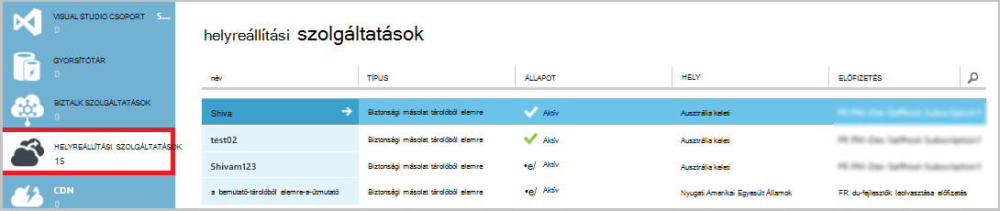

Jelölje ki az első lépések lap tetején a beállításokat, megjelenik a rendelkezésre álló engedélykezelési feladatai.

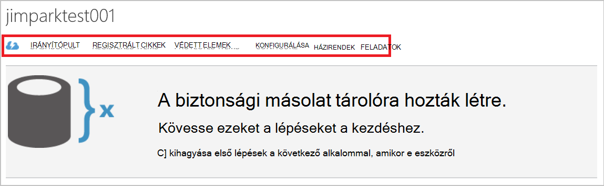

### Irányítópult
Válassza ki **az irányítópult** használatát a kiszolgáló áttekintéséhez. A **használati áttekintése** tartalmazza:

- A szám, a Windows-kiszolgálók regisztrált a felhőbe
- Azure virtuális gépeken futó felhőben védett száma
- A teljes tárterület felhasznált Azure-ban
- A legutóbbi feladatok állapotát

Az irányítópult alján, az alábbi műveleteket végezheti el:

- **Kezelés tanúsítvány** – Ha egy tanúsítványt használtak regisztrálni a kiszolgálót, akkor ennek használatával frissítheti a tanúsítvány. Ha tárolóra hitelesítő adatok használata esetén **kezelése tanúsítvány**nem használható.
- **Törlés** - törlése az aktuális biztonsági tárolóból elemre. Ha már nem használja egy biztonsági tárolóból elemre, törölheti, hogy a rendelkezésre álló tárterület méretének felszabadítani. **Törlés** csak akkor engedélyezett a tárolóból elemre az összes kiszolgálón a regisztrált törlése után.

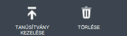

## Regisztrált cikkek
Válassza a **Registered elemek** megtekintése a tárolóból elemre kattintva regisztrált a kiszolgáló nevét.

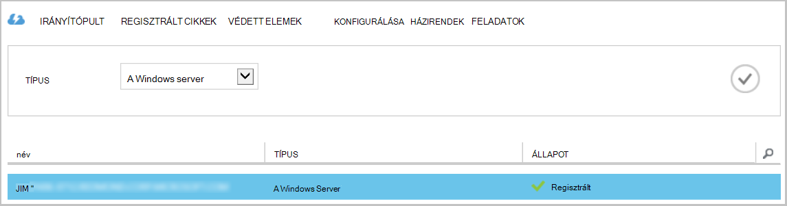

**A szűrő** Azure virtuális gép alapértelmezés szerint. Megtekintheti a tárolóból elemre kattintva regisztrált a kiszolgáló nevét, jelölje be **a Windows server** a legördülő menüből.

További lehetőségek hajtsa végre az alábbi műveleteket:

- **Engedélyezés Re regisztráció** – Ez a beállítás ki van jelölve a kiszolgálón is használhatja a **Regisztrációs varázsló** a helyszíni Microsoft Azure biztonsági Agent másodszori regisztrálhatja a kiszolgáló és a biztonsági másolat tárolóból elemre. A tanúsítvány hiba miatt újraregisztrálása kell, vagy ha egy kiszolgáló kellett az újonnan létrehozott kell.
- **Törlés** - kiszolgáló törlése a a biztonsági másolat tárolóból elemre. A kiszolgáló társított tárolt adatok azonnal törlődik.

    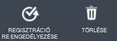

## Védett elemek
Jelölje be a **Védett elemek** megtekintése, az elemeket, amelyeket a kiszolgálókról mentésben.

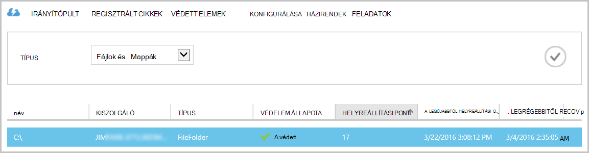

## Konfigurálása

A **beállítás** lapon jelölje ki a megfelelő tárolási redundancia lehetőséget. Jelölje ki a redundancia tárolási lehetőség a legjobb időpontot, jobbra, miután létrehozott egy tárolóból elemre, és mielőtt bármilyen gépek regisztrált rá.

>[AZURE.WARNING] Egy elem van regisztrálva a tárolóból elemre kattintva, amikor a redundancia tárolási lehetőség zárolva van, és nem módosíthatók.

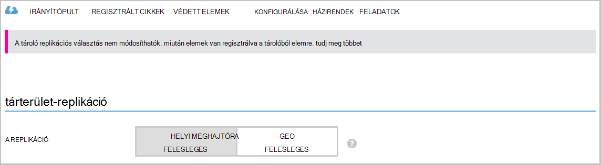

Lásd: Ez a cikk további információt a [tárhely redundancia](../storage/storage-redundancy.md).

## Microsoft Azure biztonsági másolat ügynök feladatok

### Konzol

Nyissa meg a **Microsoft Azure biztonsági másolat ügynök** (megtalálja a számítógép keres a *Microsoft Azure biztonsági másolat*).

A jobb oldali biztonsági ügynök konzol elérhető **Műveletek** hajtsa végre az alábbi felügyeleti műveleteket:

- Kiszolgáló regisztrálása
- Ütemezés biztonsági mentése
- Biztonsági mentése
- Tulajdonságainak módosítása

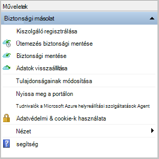

>[AZURE.NOTE] **Adatok helyreállítása**olvassa el [a Windows server és a Windows ügyfélgép fájlok visszaállítása](backup-azure-restore-windows-server.md).

### Módosítsa a meglévő biztonsági másolat

1. Kattintson a Microsoft Azure biztonsági másolat agent **Ütemezés biztonsági másolatot**.

    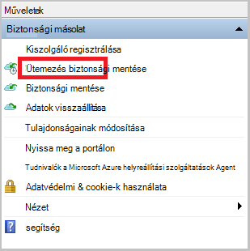

2. Az **Ütemterv biztonsági varázsló** hagyja bejelölve a **biztonságimásolat-elemek vagy az időpontok módosítása** lehetőséget, és kattintson a **Tovább**gombra.

    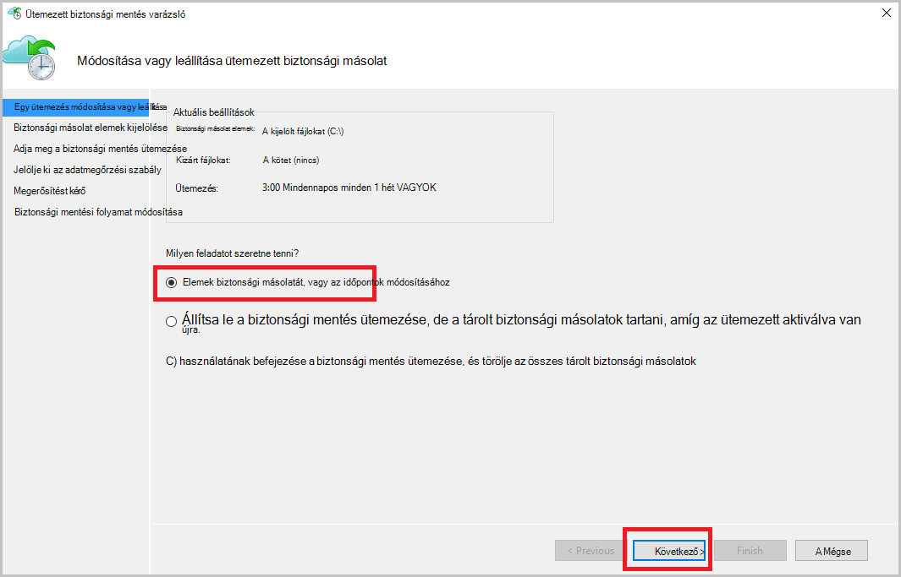

3. Ha hozzáadásához vagy módosításához az elemek, a **Biztonsági másolat elemek kijelölése** képernyőn kattintson a **Elemek hozzáadása**gombra.

    Ezen a lapon, a varázsló is beállíthatja **Való felelősség kizárását beállításait** . Ha ki szeretné zárni a fájlok vagy fájltípusok, olvassa el az eljárás a [való felelősség kizárását beállítások](#exclusion-settings)hozzáadására.

4. Jelölje ki a fájlokat és mappákat, készítsen biztonsági másolatot szeretne készíteni, kattintson a **rendben**.

    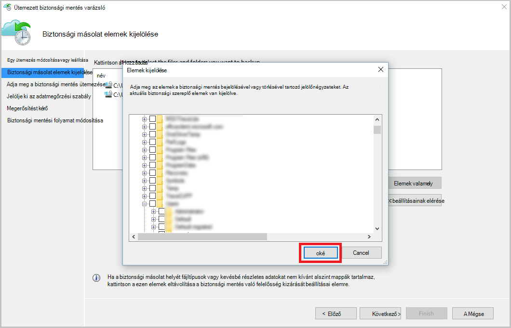

5. Adja meg a **biztonsági mentés ütemezése** , és kattintson a **Tovább**gombra.

    (A 3 időpontok naponta legfeljebb) napi vagy heti biztonsági ütemezheti.

    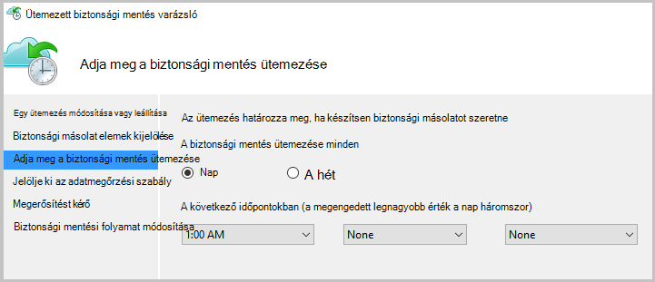

    >[AZURE.NOTE] Adja meg a biztonsági mentés ütemezése magyarázata a jelen [cikk](backup-azure-backup-cloud-as-tape.md)részletesen.

6. Jelölje ki a biztonsági másolat **Adatmegőrzési szabály** , és kattintson a **Tovább**gombra.

    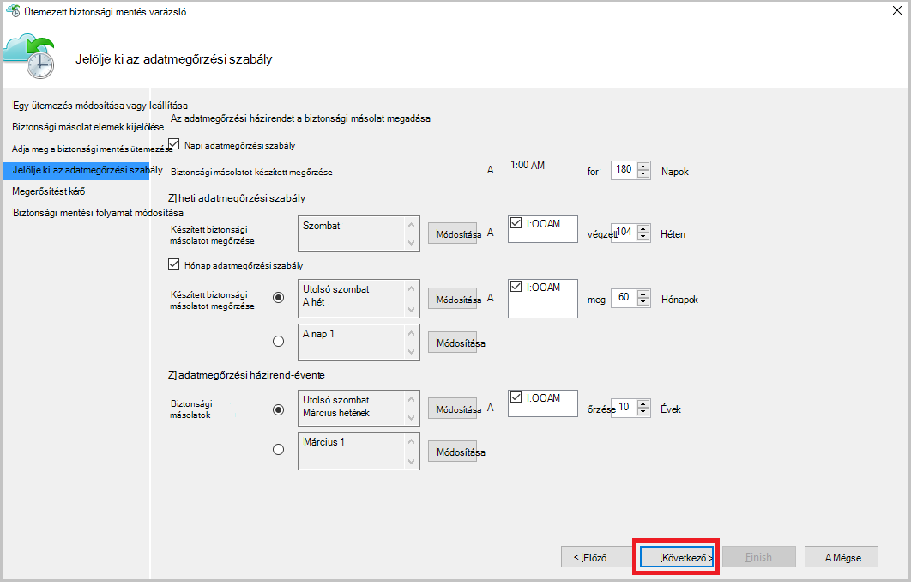

7. A **megerősítési** képernyőn tekintse át az információkat, és kattintson a **Befejezés gombra**.

8. Miután a varázsló végzett, az **Ütemezés**létrehozását, kattintson a **Bezárás**gombra.

    Védelem módosítása után győződhet meg, hogy biztonsági másolatok megfelelően vannak kiváltó megerősíti, hogy tükröződni fognak a biztonsági másolat feladatok és a **feladatok** lap.

### Hálózati szabályozásának engedélyezése  
Az Azure biztonsági másolat ügynök tartalmaz egy Throttling-lapon, amely lehetővé teszi, hogy használatának szabályozása hálózati sávszélesség adatátvitel során. Ez a beállítás akkor lehet hasznos, ha módosítani szeretné a biztonsági másolatot során adatok munkaórák, de nem szeretné a biztonsági mentés más internetes forgalmat zavarja. Az adatok szabályozásának átadás vonatkozik biztonsági mentése és visszaállítása a tevékenységeket.  

Ahhoz, hogy szabályozása:

1. Kattintson a **biztonsági másolat ügynök** **Tulajdonságainak módosítása**.

2. Jelölje be az **internetes sávszélesség-használat biztonsági műveletekhez szabályozásának engedélyezése** jelölőnégyzetet.

    

3. Szabályozásának engedélyezése után adja meg a biztonsági másolat adatátvitel engedélyezett sávszélesség **Munkaidő** és **a nem munkaidő**alatt.

    A sávszélesség-értékek 512 KB (KB) másodpercenként a kezdődik, és válassza a legfeljebb 1023 megabájt (MB) másodpercenként. Is kijelölni a kezdési és befejezési a **Munkaidő**, és amelyek a hét napjai számítanak munka nap. A kijelölt munkaidő-Ön kívüli idő munkaidő nem számít.

4. Kattintson az **OK gombra**.

## Kizárás beállítások

1. Nyissa meg a **Microsoft Azure biztonsági másolat ügynök** (megtalálja a számítógép keres a *Microsoft Azure biztonsági másolat*).

    

2. Kattintson a Microsoft Azure biztonsági másolat agent **Ütemezés biztonsági másolatot**.

    

3. Az ütemterv biztonsági varázslóban hagyja bejelölve a **biztonságimásolat-elemek vagy az időpontok módosítása** lehetőséget, és kattintson a **Tovább**gombra.

    

4. Kattintson a **Kivételek beállítások**gombra.

    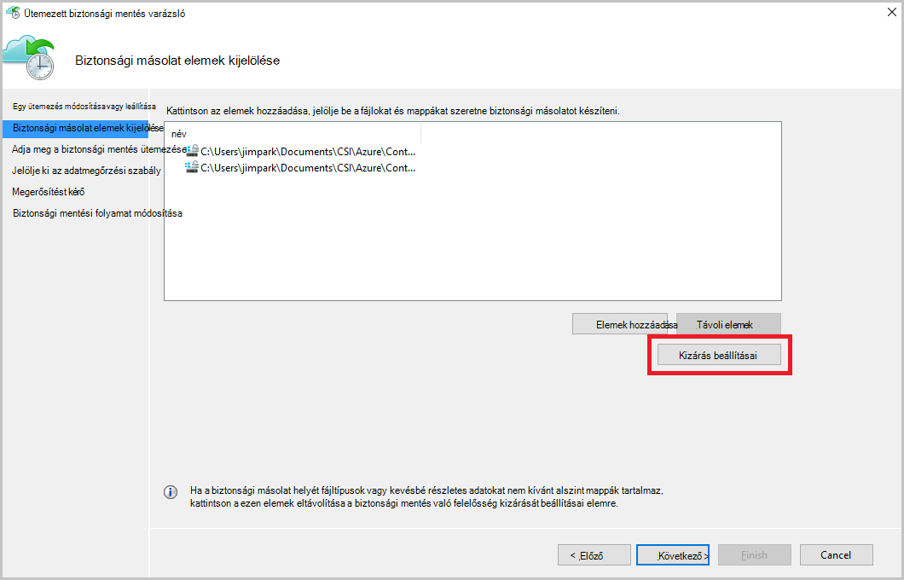

5. Kattintson a **kivétel hozzáadása**gombra.

    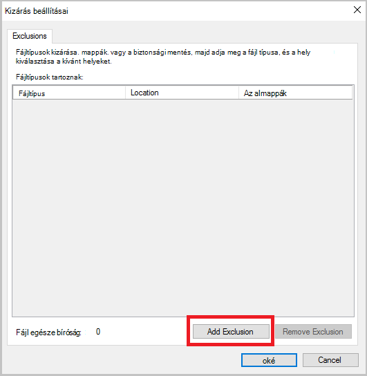

6. Jelölje ki azt a helyet, és kattintson az **OK gombra**.

    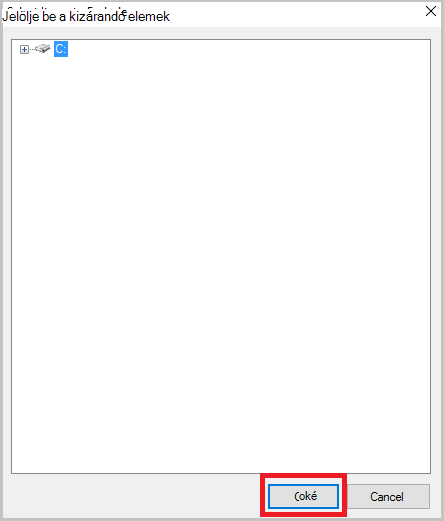

7. A fájl-bővítmény hozzáadása a **Fájl típusa** mezőben.

    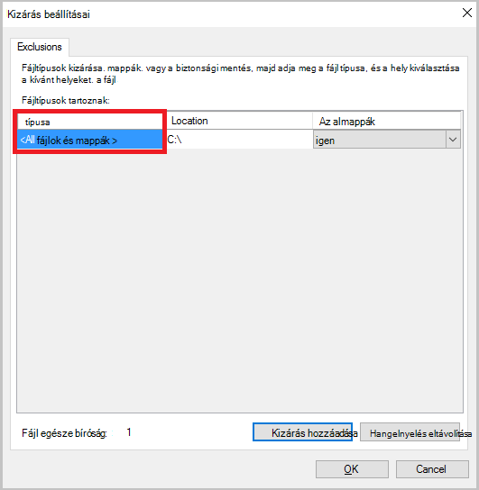

    Egy .mp3 bővítmény hozzáadása

    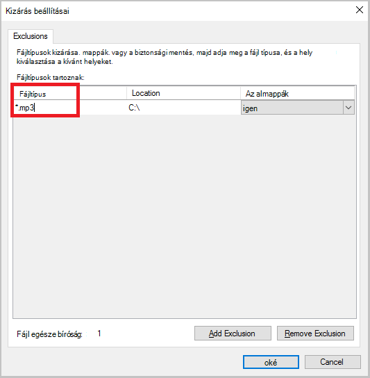

    Egy másik bővítmény hozzáadása, **Kizárás hozzáadása** gombra, és adjon meg egy másik típusú fájlkiterjesztést (a .jpeg-bővítmény hozzáadása).

    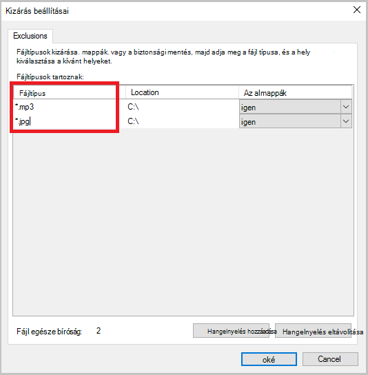

8. Ha minden bővítmény helyezett el, kattintson az **OK gombra**.

9. Az ütemterv biztonsági másolat varázsló folytassa addig, amíg a **Megerősítés lapon**a **Tovább gombra** kattintva, majd kattintson a **Befejezés gombra**.

    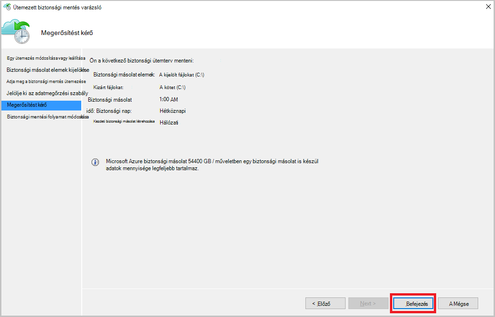

## Következő lépések
- [A Windows Server vagy a Windows-ügyfél visszaállítása az Azure](backup-azure-restore-windows-server.md)
- Azure biztonsági mentéssel kapcsolatos további tudnivalókért lásd: [Azure biztonsági mentés – áttekintés](backup-introduction-to-azure-backup.md)
- Keresse fel a [Azure biztonságimásolat-fórum](http://go.microsoft.com/fwlink/p/?LinkId=290933)
