<properties
    pageTitle="Azure helyreállítási szolgáltatások tárolókban és kiszolgálók kezelése |} Microsoft Azure"
    description="Ebben az oktatóanyagban segítségével megtudhatja, hogy miként Azure helyreállítási szolgáltatások tárolókban és kiszolgálók kezelése."
    services="backup"
    documentationCenter=""
    authors="markgalioto"
    manager="cfreeman"
    editor="tysonn"/>

<tags
    ms.service="backup"
    ms.workload="storage-backup-recovery"
    ms.tgt_pltfrm="na"
    ms.devlang="na"
    ms.topic="article"
    ms.date="10/19/2016"
    ms.author="jimpark; markgal"/>


# <a name="monitor-and-manage-azure-recovery-services-vaults-and-servers-for-windows-machines"></a>Figyelésére és Azure helyreállítási szolgáltatások tárolókban és a Windows gépekhez kiszolgálók kezelése

> [AZURE.SELECTOR]
- [Erőforrás-kezelő](backup-azure-manage-windows-server.md)
- [Klasszikus](backup-azure-manage-windows-server-classic.md)

Ez a cikk áttekintést nyújt a biztonságimásolat-kezelési az Azure-portálra, és a Microsoft Azure biztonsági agent keresztül érhető el találhatók.

[AZURE.INCLUDE [learn-about-deployment-models](../../includes/learn-about-deployment-models-rm-include.md)]klasszikus telepítési modell.

## <a name="management-portal-tasks"></a>Adatkezelési portál feladatok

### <a name="access-your-recovery-services-vaults"></a>A helyreállítási szolgáltatások tárolókban elérése

1. Jelentkezzen be az [Azure-portálon](https://portal.azure.com/) Azure-előfizetése segítségével.

2. A központi menüben kattintson a **Tallózás gombra** , és az erőforrások listája, írja be a **Helyreállítási szolgáltatások**. Gépelés megkezdésekor a listában a rendszer kiszűri a megadott feltételeknek. Kattintson a **helyreállítás szolgáltatások tárolókban**.

    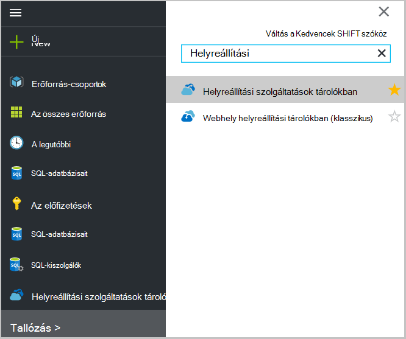 <br/>

2. Jelölje ki a nevét a tárolóra meg szeretné tekinteni a helyreállítási szolgáltatások tárolóból elemre az irányítópult lap megnyitása a listából.

    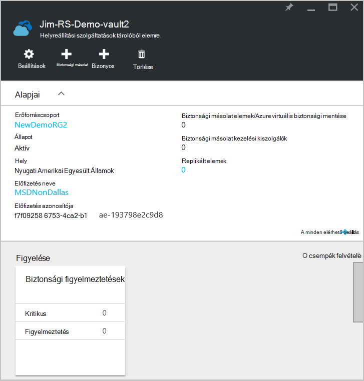 <br/>

## <a name="monitor-jobs-and-alerts"></a>Feladatok megfigyelése és értesítések
Figyelheti a feladatok és az helyreállítási szolgáltatások tárolóra irányítópult, ahol látható értesítések:

- Biztonsági figyelmeztetések részletei
- Fájlok és mappák, valamint a felhőben védett Azure virtuális gépeken futó
- Tárterületkorlátot elfogyasztott Azure-ban
- Biztonsági mentési feladat állapotának

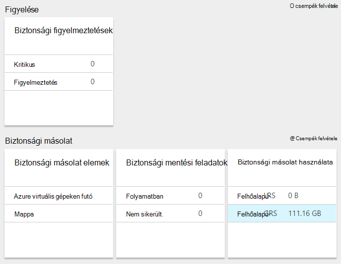

Kattintás az információkat az egyes közülük a társított lap, ahol kezelheti a kapcsolódó feladatok nyílik meg.

Az irányítópult tetején:

- Beállítások a rendelkezésre álló biztonsági feladatok hozzáférést biztosít.
- Mentés – segítségével biztonsági másolatot készíteni az új fájlok és mappák (vagy Azure VMs) a helyreállítási szolgáltatások tárolóból elemre.
- Törlés - már nem használja egy helyreállítási szolgáltatások tárolóból elemre, ha törölheti azt a rendelkezésre álló tárterület méretének felszabadítani. Törlés csak akkor érhető el, a tárolóból elemre az összes kiszolgálón a védett törlése után.

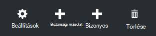
## <a name="alerts-for-backups-using-azure-backup-agent"></a>Figyelmeztetések a biztonsági másolatok Azure biztonsági ügynök használatával:
| Az értesítési szint  | Küldött értesítések |
| ------------- | ------------- |
| Kritikus | Biztonsági mentés sikerült, helyreállítási hiba  |
| Figyelmeztetés  | A biztonsági mentés figyelmeztetéssel (Ha kevesebb mint száz fájlok nem készül sérült problémák miatt, és egy milliónál fájlok sikeresen mentésben)  |
| Tájékoztató  | Nincs lehetőség  |
## <a name="manage-backup-alerts"></a>Biztonsági másolat értesítések kezelése
Kattintson a **Biztonsági figyelmeztetések** csempére kattintva nyissa meg a **Biztonsági figyelmeztetések** lap és értesítések kezelése.

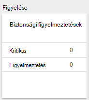

A biztonsági figyelmeztetések csempe száma látható:

- az elmúlt 24 óra feloldva kritikus értesítések
- az elmúlt 24 óra feloldva figyelmeztetés értesítések

Minden, az alábbi hivatkozásokra kattintva megnyitja a **Biztonsági figyelmeztetések** a szűrt nézetben az értesítések (kritikus vagy figyelmeztető) lap.

A biztonsági figyelmeztetések lap az Ön:

- Válassza ki a megfelelő adatokat tartalmazó az értesítések.

    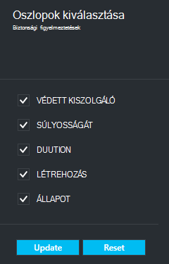

- Értesítések súlyosságát, állapot és a kezdő és záró időpont szűrheti.

    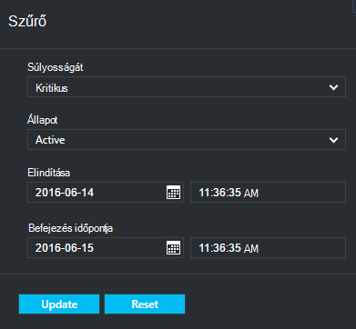

- Súlyosságát, a gyakoriság és a címzettek értesítések konfigurálása, valamint értesítések be- és kikapcsolása.

    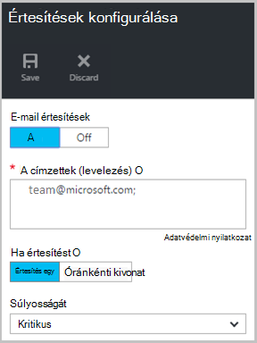

Ha **Egy figyelmeztető** van kiválasztva, mint az **értesítés** ismétlődési nincs csoportosítás és az e-mailben csökkentése fordul elő. Minden riasztás eredménye 1 értesítésben. Ez az alapértelmezett és a felbontás e is küld azonnal.

Ha **Óránkénti kivonat** ki van jelölve, mint a felhasználó jelzi, hogy nincsenek-e az utolsó órában meghatározatlan új figyelmeztetéseket az **értesítési** gyakoriság egy e-mailt küldi. A felbontás e-mailt küldi az órát végén.

Figyelmeztetések a következő fontossági szintek küldhetők el:

- kritikus
- Figyelmeztetés
- információk

Inaktiválja az **inaktívvá tétel** gomb, a feladatot a Részletek lap a az értesítésre. Kattintáskor inaktívvá biztosíthat a felbontás jegyzeteket.

Kiválaszthatja, hogy az oszlopok meg szeretné jeleníteni az értesítésre, a **Választható oszlopok** gombjára kattintva részeként.

>[AZURE.NOTE] A **Beállítások** lap az Ön kezeli biztonsági figyelmeztetések kiválasztásával **figyelése és a Jelentések > értesítések és események > biztonsági figyelmeztetések** , és válassza a **szűrő** , vagy **Állítsa be értesítéseket**.

## <a name="manage-backup-items"></a>Biztonsági másolat elemek kezelése
A helyszíni biztonsági másolatok kezelése érhető el az adatkezelési portálon. Az irányítópult a biztonsági mentés csoportban a **Biztonsági másolat elemek** csempét a tárolóból elemre kattintva védett biztonsági elemek számát mutatja.

Biztonsági másolat elemek csempéjén kattintson a **Fájl-mappák** parancsra.

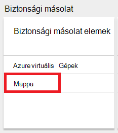

A biztonsági másolat elemek lap nyílik meg a szűrő beállítása mappát fájlt, ahol minden egyes adott biztonsági másolat felsorolt elem látható.

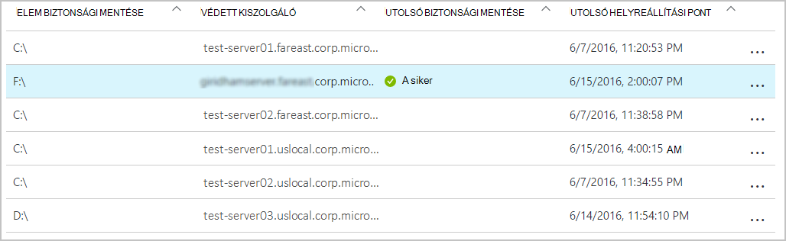

Egy adott biztonsági elemet a listából válassza ki, megjelenik az adott elem alapvető adatait.

>[AZURE.NOTE] A **Beállítások** lap az Ön kezeli fájlok és mappák kiválasztásával **védett elemek > biztonsági másolat elemek** és kiválasztja a **Fájl-mappákat** a legördülő menüből.

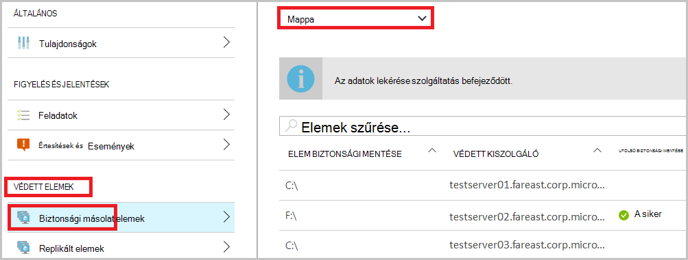

## <a name="manage-backup-jobs"></a>Biztonsági másolat feladatok kezelése
Biztonsági másolat (Ha a helyszíni kiszolgáló biztonsági másolatot készít az Azure) feladatok mindkét helyszíni telepítésű és Azure biztonsági másolatok láthatók az irányítópult.

Az irányítópult a biztonsági mentés csoportban a biztonsági mentési feladat csempe feladatok száma látható:

- folyamatban
- nem sikerült az elmúlt 24 óra.

A biztonsági másolat projektek kezeléséhez kattintson a **Biztonsági másolat feladatok** csempére, amely megnyitja a biztonsági másolat feladatok lap.


A rendelkezésre álló a biztonsági másolat feladatok lap **Oszlopok választása** gombbal az oldal tetején lévő adatok módosítása

A **szűrő** gomb segítségével válassza ki a fájlok és mappák és Azure virtuális gép biztonsági másolat között.

Ha nem látja a biztonsági másolat fájlokat és mappákat, kattintson a lap tetején a **szűrő** gombra, és az elem típusa menüből válassza a **fájlok és mappák** .

>[AZURE.NOTE] A **Beállítások** lap az Ön biztonsági feladatok kezelése kiválasztásával **figyelése és a Jelentések > feladatok > biztonsági feladatok** és kiválasztja a **Fájl-mappákat** a legördülő menüből.

## <a name="monitor-backup-usage"></a>Biztonsági másolat használat figyelése
Az irányítópult a biztonsági mentés csoportban a biztonsági másolat használatát csempére az Azure-ban felhasznált tárhely megjelenítése. Tárterület-használat megadva:
- A felhő a tárolóra társított LRS tárterület-használat
- A felhő a tárolóra társított GRS tárterület-használat

## <a name="production-servers"></a>Gyártás-kiszolgálókon
A gyártási kiszolgálók kezelésére, kattintson a **Beállítások**gombra. Kezelése csoportban kattintson a **biztonsági másolat infrastruktúra > üzemi kiszolgálók**.

A gyártási kiszolgálók lap az összes rendelkezésre álló gyártási kiszolgáló listák. Kattintson a listában, és nyissa meg a kiszolgáló adatait a kiszolgálón.

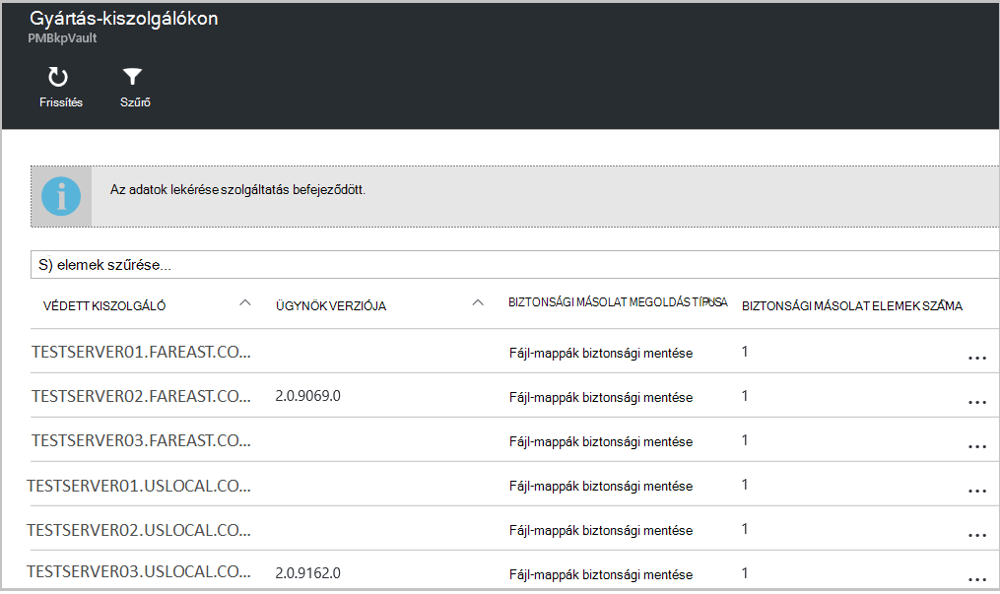

## <a name="microsoft-azure-backup-agent-tasks"></a>Microsoft Azure biztonsági másolat ügynök feladatok

## <a name="open-the-backup-agent"></a>Nyissa meg a biztonsági másolat agent

Nyissa meg a **Microsoft Azure biztonsági másolat ügynök** (megtalálta a számítógépen *a Microsoft Azure*biztonsági másolatának kereséssel).

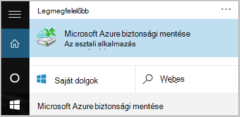

A jobb oldali biztonsági ügynök konzol elérhető **Műveletek** hajtsa végre az alábbi felügyeleti műveleteket:

- Kiszolgáló regisztrálása
- Ütemezés biztonsági mentése
- Biztonsági mentése
- Tulajdonságainak módosítása

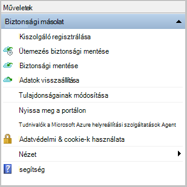

>[AZURE.NOTE] **Adatok helyreállítása**olvassa el [a Windows server és a Windows ügyfélgép fájlok visszaállítása](backup-azure-restore-windows-server.md).

## <a name="modify-an-existing-backup"></a>Módosítsa a meglévő biztonsági másolat

1. Kattintson a Microsoft Azure biztonsági másolat agent **Ütemezés biztonsági másolatot**.

    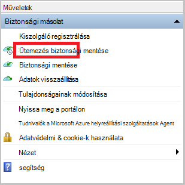

2. Az **Ütemterv biztonsági varázsló** hagyja bejelölve a **biztonságimásolat-elemek vagy az időpontok módosítása** lehetőséget, és kattintson a **Tovább**gombra.

    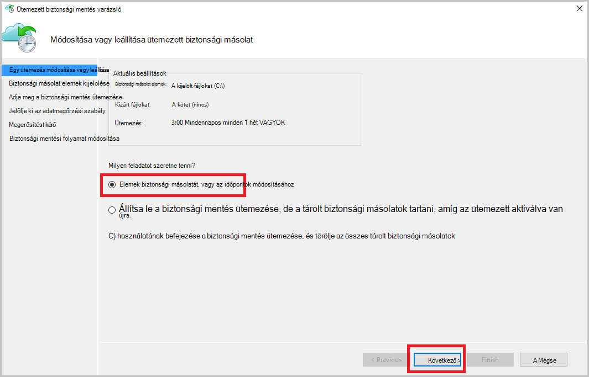

3. Ha hozzáadásához vagy módosításához az elemek, a **Biztonsági másolat elemek kijelölése** képernyőn kattintson a **Elemek hozzáadása**gombra.

    Ezen a lapon, a varázsló is beállíthatja **Való felelősség kizárását beállításait** . Ha ki szeretné zárni a fájlok vagy fájltípusok, olvassa el az eljárás a [való felelősség kizárását beállítások](#exclusion-settings)hozzáadására.

4. Jelölje ki a fájlokat és mappákat, készítsen biztonsági másolatot szeretne készíteni, kattintson a **rendben**.

    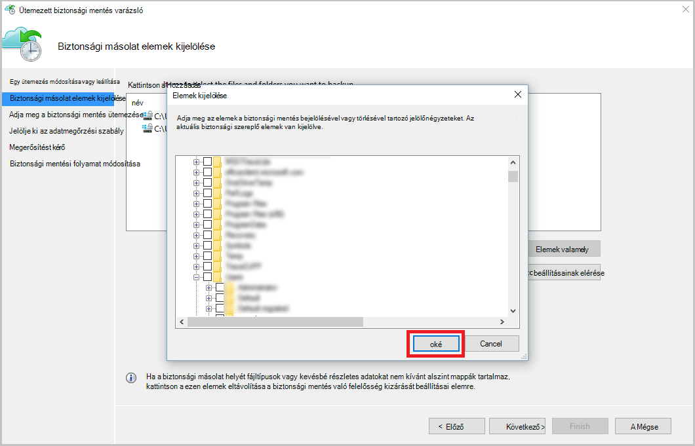

5. Adja meg a **biztonsági mentés ütemezése** , és kattintson a **Tovább**gombra.

    (A 3 időpontok naponta legfeljebb) napi vagy heti biztonsági ütemezheti.

    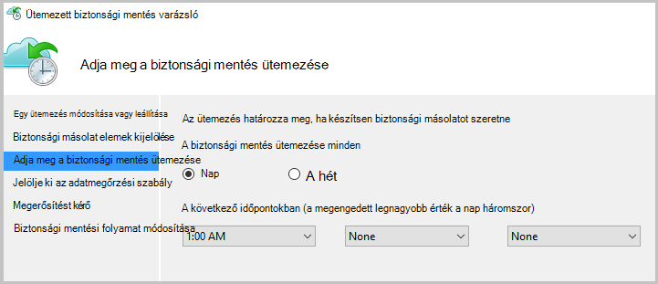

    >[AZURE.NOTE] Adja meg a biztonsági mentés ütemezése magyarázata a jelen [cikk](backup-azure-backup-cloud-as-tape.md)részletesen.

6. Jelölje ki a biztonsági másolat **Adatmegőrzési szabály** , és kattintson a **Tovább**gombra.

    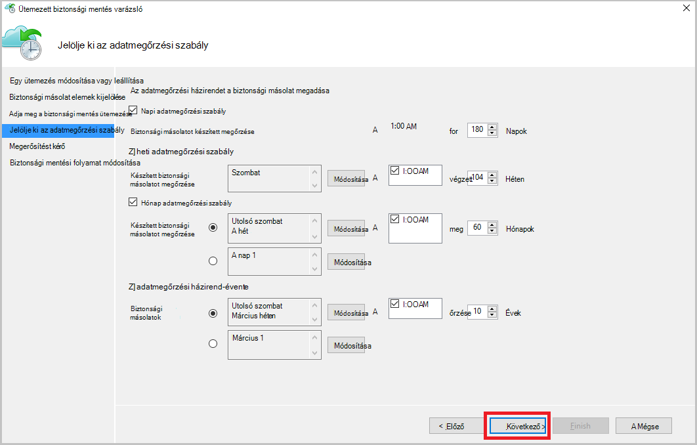

7. A **megerősítési** képernyőn tekintse át az információkat, és kattintson a **Befejezés gombra**.

8. Miután a varázsló végzett, az **Ütemezés**létrehozását, kattintson a **Bezárás**gombra.

    Védelem módosítása után győződhet meg, hogy biztonsági másolatok megfelelően vannak kiváltó megerősíti, hogy tükröződni fognak a biztonsági másolat feladatok és a **feladatok** lap.

## <a name="enable-network-throttling"></a>Hálózati szabályozásának engedélyezése  
Az Azure biztonsági másolat ügynök tartalmaz egy Throttling-lapon, amely lehetővé teszi, hogy használatának szabályozása hálózati sávszélesség adatátvitel során. Ez a beállítás akkor lehet hasznos, ha módosítani szeretné a biztonsági másolatot során adatok munkaórák, de nem szeretné a biztonsági mentés más internetes forgalmat zavarja. Az adatok szabályozásának átadás vonatkozik biztonsági mentése és visszaállítása a tevékenységeket.  

Ahhoz, hogy szabályozása:

1. Kattintson a **biztonsági másolat ügynök** **Tulajdonságainak módosítása**.

2. **Szabályozásának lapon jelölje be **a internetes sávszélesség-használat szabályozásának biztonsági műveletek ** engedélyezése.

    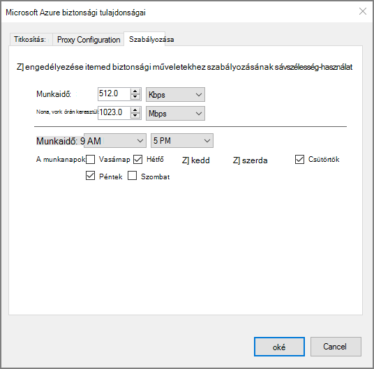

    Szabályozásának engedélyezése után adja meg a biztonsági másolat adatátvitel engedélyezett sávszélesség **Munkaidő** és **a nem munkaidő**alatt.

    A sávszélesség-értékek 512 KB (KB) másodpercenként a kezdődik, és válassza a legfeljebb 1023 megabájt (MB) másodpercenként. Is kijelölni a kezdési és befejezési a **Munkaidő**, és amelyek a hét napjai számítanak munka nap. A kijelölt munkaidő-Ön kívüli idő munkaidő nem számít.

3. Kattintson az **OK gombra**.

## <a name="manage-exclusion-settings"></a>Kizárás beállításainak kezelése

1. Nyissa meg a **Microsoft Azure biztonsági másolat ügynök** (megtalálja a számítógép keres a *Microsoft Azure biztonsági másolat*).

    

2. Kattintson a Microsoft Azure biztonsági másolat agent **Ütemezés biztonsági másolatot**.

    

3. Az ütemterv biztonsági varázslóban hagyja bejelölve a **biztonságimásolat-elemek vagy az időpontok módosítása** lehetőséget, és kattintson a **Tovább**gombra.

    

4. Kattintson a **Kivételek beállítások**gombra.

    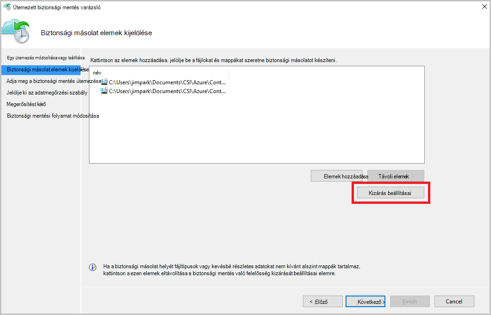

5. Kattintson a **kivétel hozzáadása**gombra.

    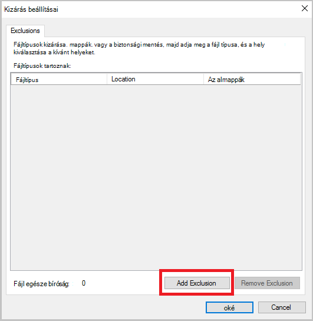

6. Jelölje ki azt a helyet, és kattintson az **OK gombra**.

    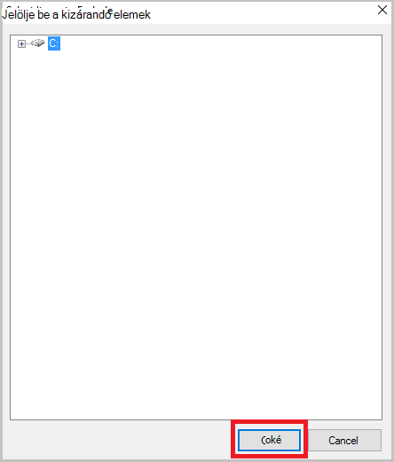

7. A fájl-bővítmény hozzáadása a **Fájl típusa** mezőben.

    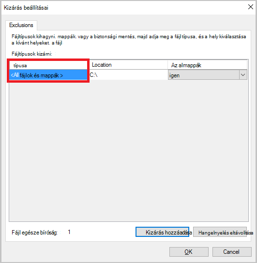

    Egy .mp3 bővítmény hozzáadása

    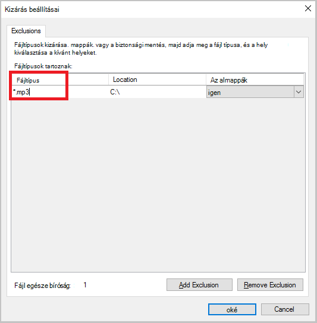

    Egy másik bővítmény hozzáadása, **Kizárás hozzáadása** gombra, és adjon meg egy másik típusú fájlkiterjesztést (a .jpeg-bővítmény hozzáadása).

    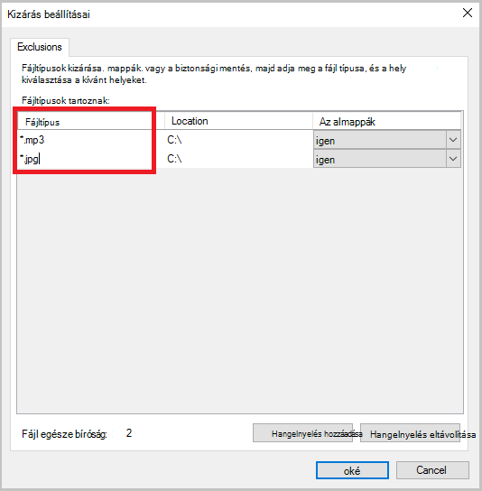

8. Ha minden bővítmény helyezett el, kattintson az **OK gombra**.

9. Az ütemterv biztonsági másolat varázsló folytassa addig, amíg a **Megerősítés lapon**a **Tovább gombra** kattintva, majd kattintson a **Befejezés gombra**.

    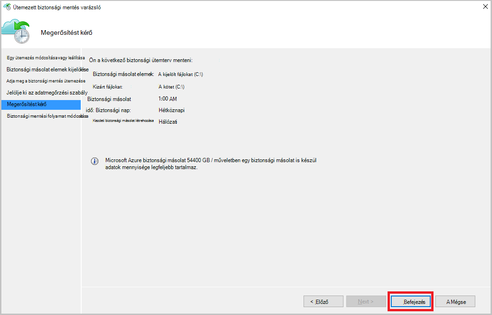

## <a name="frequently-asked-questions"></a>Gyakori kérdések
**V1. A biztonsági mentési feladat állapotának jeleníti meg az Azure biztonsági ügynök elvégzettként miért nem első megváltoznak azonnal portálra?**

A1. Nincs a 15 perc között a biztonsági mentési feladat állapotának maximális késleltetése tükröződik az Azure biztonsági ügynök és az Azure-portálra.

**Q.2, ha olyan biztonsági mentési feladat nem sikerül, mennyi ideig tart jelzést tipp?**

Értesítés A.2 akkor következik be, a Azure biztonsági hiba 20 perc belül.

**3. A KÉRDÉS. Van-e egy olyan esetben, ha e-mailben nem lehet küldeni Ha értesítések be van állítva?**

AZ A3. Alatti olyan esetek, amikor az értesítés nem lehet küldeni a riasztási zajt csökkentése érdekében:

   - Ha értesítések óránként vannak-e beállítva, és jelzést hatványát és a rendszer az órán belül
   - Feladat megszakad.
   - Biztonsági mentési feladat második nem sikerült, mert az eredeti biztonsági mentési feladat folyamatban van.

## <a name="troubleshooting-monitoring-issues"></a>Megfigyeléssel kapcsolatos problémák elhárítása

**Probléma:** Feladatok, illetve az Azure biztonsági másolat ügynök értesítések nem jelennek meg a portálon.

**Hibaelhárításhoz keres útmutatást:** A folyamat ```OBRecoveryServicesManagementAgent```, a feladatot, és a riasztási adatokat küld az Azure biztonsági másolat szolgáltatás. Időnként válnak ragadt ezt a folyamatot vagy a Leállítás.

1. Ha ellenőrizni szeretné a folyamat nem fut, nyissa meg a **Feladatkezelőt** , és ellenőrizheti a ```OBRecoveryServicesManagementAgent``` művelet végrehajtása.

2. Feltételezve, hogy a folyamat nem fut, nyissa meg a **Vezérlőpultot** , és keresse meg a szolgáltatások listában. Indítsa el, vagy indítsa újra **A Microsoft Azure helyreállítási szolgáltatások kezelése Agent**.

    További információért keresse meg a naplók:<br/>
`<AzureBackup_agent_install_folder>\Microsoft Azure Recovery Services Agent\Temp\GatewayProvider*`. Példa:<br/> `C:\Program Files\Microsoft Azure Recovery Services Agent\Temp\GatewayProvider0.errlog`.

## <a name="next-steps"></a>Következő lépések
- [A Windows Server vagy a Windows-ügyfél visszaállítása az Azure](backup-azure-restore-windows-server.md)
- Azure biztonsági mentéssel kapcsolatos további tudnivalókért lásd: [Azure biztonsági mentés – áttekintés](backup-introduction-to-azure-backup.md)
- Keresse fel a [Azure biztonságimásolat-fórum](http://go.microsoft.com/fwlink/p/?LinkId=290933)
