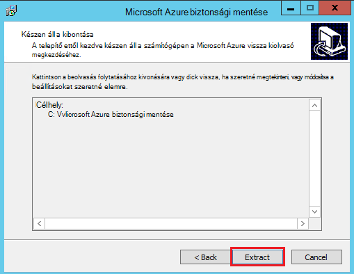
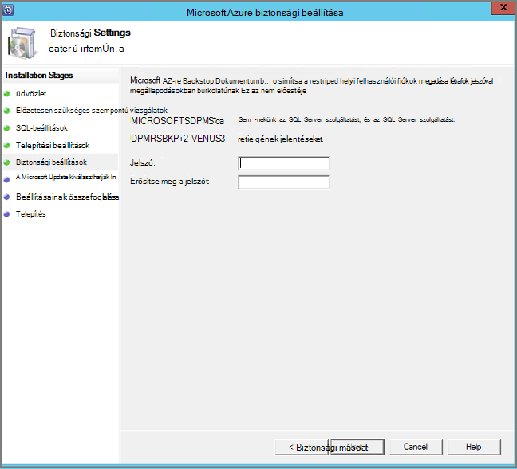

<properties
  pageTitle="Felkészülés a biztonsági mentésben munkaterhelésekből Azure biztonságimásolat-kiszolgálót használ a környezetben |} Microsoft Azure"
  description="Ellenőrizze, hogy a környezet megfelelően készen áll a biztonsági mentésben munkaterhelésekből Azure biztonságimásolat-kiszolgáló használata esetén"
  services="backup"
  documentationCenter=""
  authors="pvrk"
  manager="shivamg"
  editor=""
  keywords="Azure biztonsági kiszolgálón; biztonsági másolat tárolóból elemre"/>

<tags
  ms.service="backup"
  ms.workload="storage-backup-recovery"
  ms.tgt_pltfrm="na"
  ms.devlang="na"
  ms.topic="article"
  ms.date="08/22/2016"
  ms.author="jimpark;trinadhk;pullabhk; markgal"/>

# <a name="preparing-to-back-up-workloads-using-azure-backup-server"></a>Készítsen biztonsági másolatot az Azure biztonságimásolat-kiszolgálóval munkaterhelésekből előkészítése

> [AZURE.SELECTOR]
- [Azure biztonsági kiszolgálón](backup-azure-microsoft-azure-backup.md)
- [SCDPM](backup-azure-dpm-introduction.md)
- [Azure biztonsági Server (klasszikus)](backup-azure-microsoft-azure-backup-classic.md)
- [SCDPM (klasszikus)](backup-azure-dpm-introduction-classic.md)


Ez a cikk az előkészítése a biztonsági mentésben munkaterhelésekből Azure biztonságimásolat-kiszolgálót használ a környezetben. Azure biztonsági másolat kiszolgálóval alkalmazás munkaterhelésekből, például a Hyper-V VMs, a Microsoft SQL Server, a SharePoint Server, a Microsoft Exchange és a Windows-ügyfelek megvédheti egyetlen konzolról.

>[AZURE.WARNING] Biztonsági másolat Server Azure örökli terhelést biztonsági funkciók adatok védelme Manager (DPM). Egyes e ezekre a lehetőségekre DPM dokumentáció mutató hivatkozások találhatók. Azonban Azure biztonsági másolat kiszolgáló nem védelmet nyújtanak a szalag és integráció a System Center.

## <a name="1-windows-server-machine"></a>1. a Windows Server számítógépen


Az első lépés az Azure biztonsági másolat kiszolgáló használatba felé, hogy egy Windows Server számítógépre.

| Hely | Minimális követelmények | További utasításokért |
| -------- | -------------------- | ----------------------- |
| Azure | Azure IaaS virtuális gépen<br><br>Az a2 Standard: 2 egyes 3,5 GB RAM | Egy egyszerű gyűjteménye a Windows Server 2012 R2 adatközponthoz kiindulhat. [Azure biztonsági másolat Server (DPM) használatával védelme IaaS munkaterhelésekből](https://technet.microsoft.com/library/jj852163.aspx) van sok részleteiről. Győződjön meg róla, olvassa el a cikk teljesen üzembe helyezése a számítógép előtt. |
| A helyszíni | A Hyper-V virtuális,<br> VMWare virtuális,<br> vagy a fizikai állomásnév<br><br>2 magmintákat és 4GB RAM | A Windows Server Deduplication DPM tárterület is deduplicate. További tudnivalók a [DPM és deduplication](https://technet.microsoft.com/library/dn891438.aspx) összhatását, amikor a Hyper-V VMs rendszerbe. |

> [AZURE.NOTE] Ajánlott Azure biztonsági mentés kiszolgálóra telepített Windows Server 2012 R2 adatközponthoz a számítógépen. A előfeltételekről sok automatikusan tartoznak a Windows operációs rendszer legújabb verzióját.

Ha be szeretne kapcsolódni, a kiszolgáló egy tartomány bizonyos pontján, javasoljuk, hogy a tartomány csatlakozás tevékenység végezhető el az Azure biztonsági másolat Server telepítése előtt. Egy meglévő Azure biztonsági másolat Server gépi áthelyezése egy új tartomány után telepítési *nem támogatott*.

## <a name="2-backup-vault"></a>2. a biztonsági tárolóból elemre


Adatok biztonsági másolatának küldése Azure, vagy tarthatja helyi meghajtóra, a szoftvert kell csatlakoznia Azure. További kell bizonyos, a biztonsági másolat Server Azure gép kell kell regisztrált egy biztonsági tárolóból elemre.

A biztonsági másolat tárolóra létrehozása:

1. Jelentkezzen be az [adatkezelési portál](http://manage.windowsazure.com/).

2. Kattintson az **Új** > **Data Services** > **helyreállítási szolgáltatások** > **biztonsági tárolóra** > **gyors létrehozásához**. Ha a szervezeti fiókkal társított több előfizetéssel rendelkezik, válassza a a megfelelő előfizetés szeretne társítani a biztonsági másolat tárolóból elemre.

3. A **név**mezőbe írja be egy rövid nevet, amely azonosítja a tárolóból elemre. Ez szükséges, az egyes előfizetések egyedinek kell lennie.

4. **Régió**jelölje ki a földrajzi régióban esetében a tárolóból elemre. Általában a tárolóra régió van kiválasztott adatok felségterületéhez vagy hálózati késés kényszerek alapján.

    

5. Kattintson a **Hozzon létre a tárolóból elemre**. Eltarthat egy ideig a létrehozandó a biztonsági másolat tárolóból elemre. Figyelje meg a állapotát jelző a portálon alján.

    

6. Üzenet jelzi, hogy a tárolóra sikeresen létre, és megjelenik az aktív helyreállítási-szolgáltatások lapon.
    

  > [AZURE.IMPORTANT] Győződjön meg arról, hogy a megfelelő tárolási redundancia beállítás van kiválasztva, jobbra, miután létrejött a tárolóból elemre. További információk [geo felesleges](../storage/storage-redundancy.md#geo-redundant-storage) és [helyileg felesleges](../storage/storage-redundancy.md#locally-redundant-storage) beállítások a [áttekintése](../storage/storage-redundancy.md).


## <a name="3-software-package"></a>3. a szoftvercsomag


### <a name="downloading-the-software-package"></a>A szoftvercsomag letöltése

Tárolóból elemre a hitelesítő adatok hasonlóak töltheti le a Microsoft Azure biztonsági az alkalmazás munkaterhelésekből a **Rövid kezdőlap** a biztonsági másolat tárolóból elemre.

1. Kattintson **az alkalmazás Munkaterhelésekből (lemezen a lemez cloud)**. Ekkor a hol lehet letölteni a szoftvercsomag a letöltési központ lapot.

    

2. Kattintson a **Letöltés**gombra.

    

3. Jelölje ki az összes fájlt, és kattintson a **Tovább**gombra. Töltse le a Microsoft Azure biztonsági másolat letöltési lapját érkező összes fájlt, és helyezze az összes fájlt ugyanabban a mappában.


    A letöltés összes fájlt közös mérete > 3G, mivel a 10 MB/s töltse le a hivatkozást a letöltés befejezéséhez legfeljebb 60 percig tart.


### <a name="extracting-the-software-package"></a>A szoftver csomag kibontása

Miután letöltötte az összes fájlt, kattintson a **MicrosoftAzureBackupInstaller.exe**. Elindítja a **Microsoft Azure biztonsági másolat beállítási varázsló** az Ön által megadott helyre a telepítőfájlokat kibontásához. Kövesse a varázsló lépéseit, és kattintson a az kinyerésének megkezdéséhez **kibontása** gombra.

> [AZURE.WARNING] Bontsa ki a telepítőfájlokat legalább 4GB szabad lemezterület van szükség.




A kibontás folyamat befejezése, ha a jelölőnégyzet bejelölésével indítsa el a *setup.exe* frissen kibontott kezdje el a Microsoft Azure biztonsági másolat Server telepítése, és kattintson a **Befejezés** gombra.

### <a name="installing-the-software-package"></a>A szoftvercsomag telepítésekor

1. Kattintson a **Microsoft Azure biztonsági másolat** a beállítási varázsló indítása gombra.

    

2. Üdvözli a képernyőn kattintson a **Tovább** gombra. Ekkor megjelenik a *Kapcsolatban előzetesen szükséges ellenőrzi* szakaszban. A képernyőn kattintson a határozza meg, ha az Azure biztonsági másolat Server hardverre és szoftverre vonatkozó követelmények betartását **ellenőrzése** gombra. Ha az összes a Előfeltételek lett sikeresen teljesül, megjelenik egy üzenet, amely jelzi, hogy a számítógép megfelel. Kattintson a **Tovább** gombra.

    

3. Microsoft Azure biztonsági másolat Server szükséges SQL Server Standard, és a biztonságimásolat-Server Azure telepítőcsomag kötegelt megtalálható a megfelelő SQL Server bináris szükséges. Amikor egy új Azure biztonsági másolat Server telepítése kezdve, válassza ki a beállítást **Telepítés új SQL Server-példánnyal ezzel a beállítással** , és kattintson a **ellenőrzése és a telepítés** gombra. Miután a Előfeltételek sikeresen telepítve van, kattintson a **Tovább**gombra.

    

    Ha hiba történik a számítógép újraindítása ajánlást, tegye, és **Ellenőrizze ismét**gombra.

    > [AZURE.NOTE] Azure biztonságimásolat-kiszolgáló nem működnek a távoli SQL Server-példányt. Az Azure biztonsági másolat kiszolgáló által használt példány kell lennie a helyi.

4. Adja meg a telepítés server-fájlok Microsoft Azure biztonsági másolat helyét, és kattintson a **Tovább**gombra.

    

    Az ideiglenes helye felfelé Azure vissza felvétele szükséges. Győződjön meg róla a üres helyre az adatokat a felhőbe mentésben tervezett legalább 5 %-át. Lemezen védelmét külön lemezt kell beállítania, ha a telepítés befejeződött. Tárterület készletek további információért lásd: a [konfigurálása tároló készletek és a szabad tárterület](https://technet.microsoft.com/library/hh758075.aspx).

5. Erős jelszó megadását tiltott helyi felhasználói fiókok, és kattintson a **Tovább**gombra.

    

6. Válassza ki, hogy *A Microsoft Update* segítségével a frissítések keresése hivatkozásra, és kattintson a **Tovább**gombra.

    >[AZURE.NOTE] Azt javasoljuk, hogy a Microsoft Update, amely biztonság és a fontos frissítések a Windows és az egyéb termékek, például a Microsoft Azure biztonsági másolat Server irányítsa át a Windows Update problémákat.

    

7. Tekintse át az *Összefoglaló vonatkozó beállításokat* , és kattintson a **telepítés**gombra.

    

8. A telepítés fázisban történik. Az első szakaszban a a Microsoft Azure helyreállítási szolgáltatások Agent telepítve van a kiszolgálón. A varázsló is ellenőrzi az internetkapcsolat. Elérhető internetkapcsolat esetén is folytatja a telepítést, ha nem, meg kell adnia a proxy részletek csatlakozik az internethez.

    A következő lépésként konfigurálása a Microsoft Azure helyreállítási szolgáltatások Agent. A konfiguráció részeként megadását, használja a tárolóból elemre hitelesítő adatait, és a biztonsági másolat tárolóból elemre a gép regisztrálni fog rendelkezni. Akkor is biztosít az Azure és a helyi között küldött adatok titkosítás/visszafejtés egy jelszót. Automatikus készítése egy jelszót, vagy adja meg a saját minimális 16 karakteres hozzáférési kódot. Folytassa a varázsló mindaddig, amíg a ügynök úgy van beállítva.

    

9. Ha a Microsoft Azure biztonsági másolat kiszolgáló regisztrációs sikeresen befejeződött, a teljes beállítási varázsló folytatódik, a telepítési és az SQL Server és a biztonságimásolat-kiszolgáló Azure-összetevők konfigurálása. Ha az SQL Server összetevő telepítés befejeződött, a biztonságimásolat-kiszolgáló Azure-összetevők vannak telepítve.

    


A telepítés lépés befejezése a termék asztali ikonok fog lettek létrehozva is. Csak kattintson duplán az ikonra kattintva indítsa el a terméket.

### <a name="add-backup-storage"></a>Biztonsági másolat tárterület

Az első biztonsági másolatot a biztonsági másolat Server Azure géphez csatlakoztatott tárolón legyen. Lemezen hozzáadásával kapcsolatos további tudnivalókért lásd: [konfigurálása tároló készletek és a szabad tárterület](https://technet.microsoft.com/library/hh758075.aspx).

> [AZURE.NOTE] Biztonsági másolat tárolási felvenni, akkor is, ha azt tervezi, hogy az adatok küldése a Azure szüksége. Az aktuális architektúra Azure biztonsági kiszolgálójának az Azure biztonsági tárolóból elemre a *második* másolatot az adatok rendelkezik, miközben a helyi tároló tartalmazza az első (és kötelező) a biztonsági másolat.  

## <a name="4-network-connectivity"></a>4. a hálózati kapcsolat


Azure biztonsági másolat Server kiszolgálóhoz a termék sikeres működéséhez Azure biztonsági másolat szolgáltatáshoz való csatlakozást igényelnek Ellenőrizze, hogy a számítógépben Azure a kapcsolatot, használja a ```Get-DPMCloudConnection``` az Azure biztonsági másolat Server PowerShell konzolban parancsmag. Ha a parancsmag kimenete értéke igaz, létezik a kapcsolatot, majd még nincs kapcsolat.

Egy időben az Azure előfizetés kell egy megfelelő állapotban. Megtudhatja, hogy az előfizetés állapotának és kezelése, hogy jelentkezzen be az [előfizetés portálon]( https://account.windowsazure.com/Subscriptions).

Ha már elsajátította az Azure kapcsolatot, és az Azure előfizetés állapotát, az alábbi táblázat segítségével meg, hogy a felajánlott biztonsági mentési és visszaállítási funkció milyen hatással.

| Kapcsolat állapota | Azure előfizetés | Azure biztonsági mentése| Biztonsági másolat lemezre | Az Azure visszaállítása | Lemezről visszaállítása |
| -------- | ------- | --------------------- | ------------------- | --------------------------- | ----------------------- |
| Csatlakoztatott | Aktív | Engedélyezett | Engedélyezett | Engedélyezett | Engedélyezett |
| Csatlakoztatott | Lejárt | Leállítva | Leállítva | Engedélyezett | Engedélyezett |
| Csatlakoztatott | Leépítve | Leállítva | Leállítva | Leállítva és Azure helyreállítási pontok törlése | Leállítva |
| Elveszett kapcsolódási > 15 nap | Aktív | Leállítva | Leállítva | Engedélyezett | Engedélyezett |
| Elveszett kapcsolódási > 15 nap | Lejárt | Leállítva | Leállítva | Engedélyezett | Engedélyezett |
| Elveszett kapcsolódási > 15 nap | Leépítve | Leállítva | Leállítva |  Leállítva és Azure helyreállítási pontok törlése | Leállítva |

### <a name="recovering-from-loss-of-connectivity"></a>A kapcsolat elvesztését a helyreállítása
Ha tűzfalat vagy, ami miatt az access az Azure proxy kell whitelist tűzfal/proxy profilban a következő tartomány címeket:

- www.msftncsi.com
- \*. Microsoft.com
- \*. WindowsAzure.com
- \*. microsoftonline.com
- \*. windows.net

Azure kapcsolatot vissza lett állítva az Azure biztonsági másolat Server számítógépen, miután a végrehajtható műveletek Azure előfizetés állapotát határozza meg. A fenti táblázatban van a számítógépen "Csatlakozás" után engedélyezett műveletek olvashat.

### <a name="handling-subscription-states"></a>Előfizetés államok kezelése

A *lejárt* vagy *Deprovisioned* állam, hogy az *aktív* állapot vigye az Azure előfizetéssel lehetőség. Azonban ennek van néhány következmények a termék működését, amíg az állapot még nem *aktív*:

- *Deprovisioned* előfizetés megszakad a funkció akkor leépítjük időszakra vonatkozóan. Bekapcsolásával *aktív*, kattintson a biztonsági mentés és visszaállítás a termék funkciói aktiválja van. Az adatok biztonsági másolatának a helyi lemezen is tudja visszaszerezni, ha azt lett tartani elég nagy adatmegőrzési pontra. Azonban az Azure-ban adatok biztonsági másolatának elvész helyrehozhatatlanul után az előfizetés *Deprovisioned* állapotba kerül.
- A *lejárt* előfizetés elveszti funkciók csak a mindaddig, amíg újra *aktív* történt. Minden olyan biztonsági mentést, hogy az előfizetés *lejárt* lett-e időszakra ütemezett nem fog futni.


## <a name="troubleshooting"></a>Hibaelhárítás

Ha a hibát tartalmazó Microsoft Azure biztonsági kiszolgálón a telepítő fázis (vagy biztonsági mentése és visszaállítása) során nem sikerül, keresse meg a [hiba kódok dokumentum](https://support.microsoft.com/kb/3041338) további információt.
Akkor is érdemes lehet [Azure biztonsági másolat kapcsolatos gyakori kérdések](backup-azure-backup-faq.md)


## <a name="next-steps"></a>Következő lépések

[A környezet DPM előkészítése](https://technet.microsoft.com/library/hh758176.aspx) részletes információkat kaphat a Microsoft TechNet webhelyen. Támogatott konfigurációs, amelyen Azure biztonsági mentés kiszolgálóra telepített és használt információk is tartalmaz.

Ezek a cikkek mélyebb ismertetése, a Microsoft Azure biztonságimásolat-kiszolgálóval terhelést védelmet eléréséhez is használhatja.

- [Az SQL Server biztonsági mentése](backup-azure-backup-sql.md)
- [A SharePoint server biztonsági mentése](backup-azure-backup-sharepoint.md)
- [Másodlagos kiszolgáló biztonsági mentése](backup-azure-alternate-dpm-server.md)
