<properties
  pageTitle="Felkészülés a biztonsági mentésben munkaterhelésekből Azure biztonságimásolat-kiszolgálót használ a környezetben |} Microsoft Azure"
  description="Felkészülés a környezet védelme, vagy biztonsági másolatot munkaterhelésekből Azure biztonsági másolat Server használatával."
  services="backup"
  documentationCenter=""
  authors="PVRK"
  manager="shivamg"
  editor=""
  keywords="Azure biztonsági kiszolgálón; munkaterhelésekből; védelme Készítsen biztonsági másolatot munkaterhelésekből"/>

<tags
  ms.service="backup"
  ms.workload="storage-backup-recovery"
  ms.tgt_pltfrm="na"
  ms.devlang="na"
  ms.topic="article"
  ms.date="09/27/2016"
  ms.author="jimpark;trinadhk;pullabhk;markgal"/>

# <a name="preparing-to-back-up-workloads-using-azure-backup-server"></a>Készítsen biztonsági másolatot az Azure biztonságimásolat-kiszolgálóval munkaterhelésekből előkészítése

> [AZURE.SELECTOR]
- [Azure biztonsági kiszolgálón](backup-azure-microsoft-azure-backup.md)
- [SCDPM](backup-azure-dpm-introduction.md)
- [Azure biztonsági Server (klasszikus)](backup-azure-microsoft-azure-backup-classic.md)
- [SCDPM (klasszikus)](backup-azure-dpm-introduction-classic.md)

Ez a cikk ismerteti a Felkészülés a biztonsági mentésben munkaterhelésekből Azure biztonságimásolat-kiszolgálót használ a környezetben. Azure biztonsági másolat kiszolgálóval alkalmazás munkaterhelésekből, például a Hyper-V VMs, a Microsoft SQL Server, a SharePoint Server, a Microsoft Exchange és a Windows-ügyfelek megvédheti egyetlen konzolról. A kiszolgáló (IaaS)-munkaterhelésekből, például az Azure-ban VMs információkat is beállíthat védelmet.

> [AZURE.NOTE] Azure magában az erőforrások létrehozásáról és használatáról a két környezetben modellek: [az erőforrás-kezelő és klasszikus](../resource-manager-deployment-model.md). Ebben a cikkben az információkat és eljárásokat az erőforrás-kezelő modell rendszerbe VMs visszaállításához.

Biztonsági másolat Server Azure örökli nagy a terhelést biztonsági funkciókat, az adatok védelme Manager (DPM). Ez a cikk a DPM dokumentáció a megosztott funkció részét elmagyarázni mutató hivatkozásokat tartalmaz. Bár Azure biztonsági másolat Server megosztja a nagy része megegyezik a DPM funkcióval. Azure biztonságimásolat-kiszolgáló nem szalag biztonsági másolatot készíthet, sem pedig nem azt integrálása a System Center.

## <a name="1-choose-an-installation-platform"></a>1. Válassza egy telepítési platform

Az első lépést a Azure biztonsági másolat kiszolgáló használatba állíthatja be a Windows Server. A kiszolgáló Azure vagy a helyszíni lehet.

### <a name="using-a-server-in-azure"></a>Az Azure-kiszolgálóval

Az Azure biztonsági másolat Servert futtató kiszolgáló kiválasztásakor ajánlott készítésénél kiindulhat egy gyűjteménye a Windows Server 2012 R2 adatközponthoz. A cikk [a Windows első virtuális gép az Azure-portálon létrehozása](..\virtual-machines\virtual-machines-windows-hero-tutorial.md), nyújt segítséget első lépések a javasolt virtuális gép Azure, még akkor is, ha még soha nem használta az Azure előtt. A kiszolgáló virtuális gép (virtuális) ajánlott minimális követelmények kell lennie: A2 szabványos 2 magmintákat és 3,5 GB RAM.

Sok részleteiről védelme munkaterhelésekből Azure biztonságimásolat-kiszolgálóval rendelkezik. [DPM telepítse az Azure virtuális gép szerint](https://technet.microsoft.com/library/jj852163.aspx), a cikk segítséget nyújt a következő részleteiről ismertetik. Olvassa el a jelen cikk teljesen üzembe helyezése a számítógép előtt.

### <a name="using-an-on-premises-server"></a>A helyszíni kiszolgálót használ

Ha nem szeretné, hogy az alap server Azure-ban futtatásához, futtathatja a kiszolgáló a Hyper-V virtuális, egy VMware virtuális vagy a fizikai szolgáltató. A kiszolgáló hardver ajánlott minimális követelmények 2 magmintákat és 4 GB RAM. Az alábbi táblázat a támogatott operációs rendszerek jelennek meg.

| Operációs rendszer        | Platform           | RAKTÁRI SZÁM  |
| :------------- |-------------| :-----|
|A Windows Server 2012 R2 és legújabb SPs| 64 bites| Szabványos, adatközpont, Foundation|
|Windows Server 2012-ben és a legújabb SPs|    64 bites| Adatközpont, Foundation, normál|
|Windows tároló Server 2012 R2 és legújabb SPs  |64 bites|    Szabványos, munkacsoport|
|Windows tároló Server 2012-ben és a legújabb SPs |64 bites |Szabványos, munkacsoport|


A Windows Server Deduplication DPM tárterület is deduplicate. További tudnivalók a [DPM és deduplication](https://technet.microsoft.com/library/dn891438.aspx) összhatását, amikor a Hyper-V VMs rendszerbe.

> [AZURE.NOTE]  Azure biztonsági másolat kiszolgáló nem telepíthető a tartományvezérlőnek futtató számítógépen.

Azure biztonsági másolat Server kell csatlakoztatni egy tartományt. Ha a kiszolgáló áthelyezése egy másik tartományt, javasoljuk, hogy csatlakozik a kiszolgáló az új tartományhoz Azure biztonsági másolat Server telepítése előtt. Egy meglévő Azure biztonsági másolat Server gépi áthelyezése egy új tartomány után telepítési *nem támogatott*.

## <a name="2-recovery-services-vault"></a>2. a helyreállítási szolgáltatások tárolóból elemre.

Adatok biztonsági másolatának küldése Azure, vagy tarthatja helyi meghajtóra, a szoftvert kell csatlakoznia Azure. További kell bizonyos, a biztonságimásolat-Server Azure gép kell kell regisztrált egy helyreállítási szolgáltatások tárolóból elemre.

A helyreállítási szolgáltatások tárolóra létrehozása:

1. Jelentkezzen be az [Azure-portálon](https://portal.azure.com/).

2. A központi menüben kattintson a **Tallózás gombra** , és az erőforrások listája, írja be a **Helyreállítási szolgáltatások**. Gépelés megkezdésekor a listában a rendszer kiszűri a megadott feltételeknek. Kattintson a **helyreállítás szolgáltatások tárolóból elemre**.

    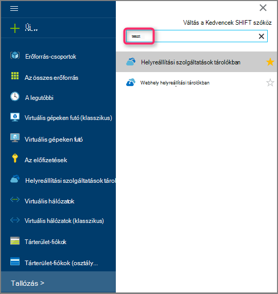 <br/>

    A tárolókban helyreállítási szolgáltatások listáját jelenik meg.

3. A **helyreállítási szolgáltatások tárolókban** menüben kattintson a **Hozzáadás**gombra.

    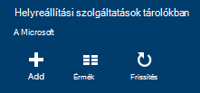

    Megnyílik a helyreállítási szolgáltatások tárolóból elemre a lap, kéri, adja meg **nevét**, **előfizetés**, **erőforráscsoport**és **helyét**.

    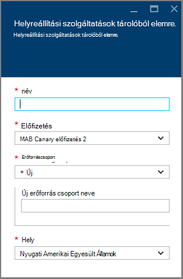

4. A **név**írja be egy rövid nevet, amely azonosítja a tárolóból elemre. A név van szüksége az Azure előfizetés egyedinek kell lennie. Adjon egy nevet, amely a 2 és 50 karakter közötti tartalmazza. Egy betűvel kell kezdődnie, és csak betűket, számokat és kötőjelet is tartalmazhat.

5. Kattintson az **előfizetés** az előfizetések elérhető listájának megjelenítéséhez. Ha nem biztos abban, hogy mely előfizetés használni, használja az alapértelmezett (vagy a javasolt) előfizetés. Lesznek több lehetőség csak akkor, ha a szervezeti fiók társítva több Azure előfizetés.

6. **Erőforráscsoport** a rendelkezésre álló erőforráscsoport listájának megtekintéséhez, vagy hozzon létre egy új erőforráscsoport **Új** gombra. Az erőforrás csoportok átfogó információt a [Azure erőforrás-kezelő áttekintése](../azure-resource-manager/resource-group-overview.md) című témakörben találhat.

7. Kattintson a **hely** jelölje ki a földrajzi régióban esetében a tárolóból elemre.

8. Kattintson a **létrehozása**gombra. Eltarthat egy ideig a létrehozandó a helyreállítási szolgáltatások tárolóból elemre. Figyelje meg a állapotát jelző a portál jobb felső területén.
Amikor létrejött a tárolóból elemre, megnyílik a portálon.

### <a name="set-storage-replication"></a>Tárterület-replikáció beállítása

A tároló replikációs beállítással geo felesleges tároló és a helyi meghajtóra felesleges szolgáltatások közül választhat. Alapértelmezés szerint a tárolóból elemre a geo felesleges tároló tartalmaz. Kilépés a geo felesleges tárolóhoz beállítása, ha ez az elsődleges biztonsági mentése lehetőséget. Válassza a helyi meghajtóra felesleges tárhely, ha azt szeretné, hogy egy olcsóbb beállítást, amely nem igazán tartós. További információk [geo felesleges](../storage/storage-redundancy.md#geo-redundant-storage) és a [helyi meghajtóra felesleges](../storage/storage-redundancy.md#locally-redundant-storage) -tárolási lehetőségek a az [Azure tároló replikációs – áttekintés](../storage/storage-redundancy.md).

A tároló replikációs beállításainak módosítása:

1. Jelölje ki a tárolóból elemre kattintva nyissa meg a tárolóból elemre az irányítópult és a beállítások lap. A **Beállítások** lap nem nyílik meg, ha a tárolóból elemre az irányítópult kattintson a **minden beállításai** parancsra.

2. Kattintson a **Beállítások** lap a **Biztonsági másolat infrastruktúra** > **Biztonsági másolat konfigurációs** a **Biztonsági mentés beállításainak** lap megnyitásához. A **Biztonsági mentés beállításainak** lap válassza a tárterület replikációs lehetőséget a tárolóból elemre.

    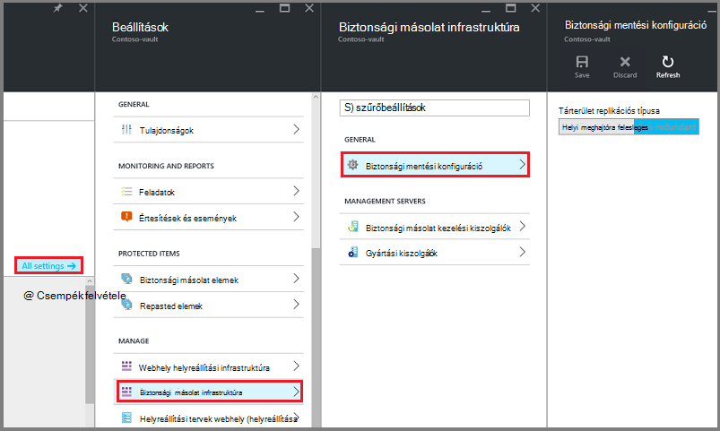

    Miután kiválasztotta a tárolóból elemre a tárolási lehetőség, készen áll a virtuális társítani a tárolóból elemre. A társítási indításához kell Fedezze fel, és regisztráljon az Azure virtuális gépeken futó.

## <a name="3-software-package"></a>3. a szoftvercsomag

### <a name="downloading-the-software-package"></a>A szoftvercsomag letöltése
1. Jelentkezzen be az [Azure-portálon](https://portal.azure.com/).

2. Ha már van nyitva egy helyreállítási szolgáltatások tárolóból elemre, ugorjon a 3. Ha nem rendelkezik egy helyreállítási szolgáltatások megnyitott tárolóból elemre, de az Azure-portálon központi menüben kattintson a **Tallózás gombra**.

    - Az erőforrások listája írja be a **Helyreállítási szolgáltatások**.
    - Gépelés megkezdésekor a listában a rendszer kiszűri a megadott feltételeknek. Ha **helyreállítási szolgáltatások tárolókban**jelenik meg, kattintson rá.

    

    A tárolókban helyreállítási szolgáltatások listája jelenik meg.

    - A tárolókban helyreállítási szolgáltatások listában jelölje ki a tárolóból elemre.

    Ekkor megnyílik a kijelölt tárolóból elemre az irányítópult.

    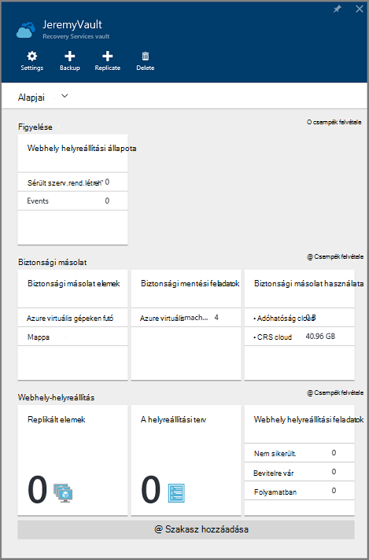

3. Beállítások lap alapértelmezés szerint nyílik meg. Ha meg van nyitva, nyissa meg a beállítások lap **Beállítások** parancsára.

    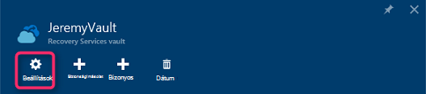

4. Kattintson a **biztonsági másolat** az **Első lépések** az első lépések varázsló megnyitásához.

    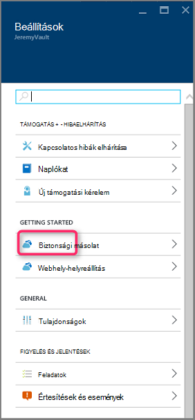

5. Az első lépések a megnyíló, a biztonsági céloknak képernyő lesz automatikus kijelölve.
    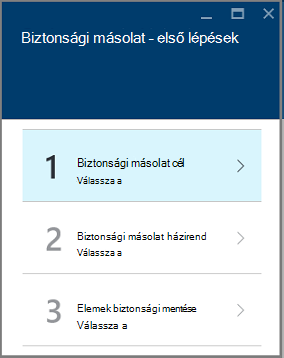

    A **biztonsági céloknak** csoportban jelölje ki *a helyszíni* *a terhelést futtató*.

    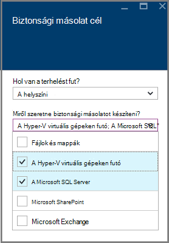

6. Jelölje ki a feladatok Azure biztonságimásolat-kiszolgáló használata esetén *milyen védelemmel ellátni kívánt feladatok* a védeni kívánt kattintson az **OK gombra**.

    > [AZURE.NOTE] Ha csak a fájlok és mappák védelme szeretné, majd használata ajánlott Azure Backup ügynök. Ha csak a fájlok és mappák-nél több munkaterhelésekből védelme szeretné vagy későbbi bontsa ki a védelem igényeinek szeretné, jelölje ki azokat a munkaterhelésekből.

    Ez az első lépések varázsló infrastruktúra Felkészülés jelszóval védenie az munkaterhelésekből a helyszíni Azure változik.

    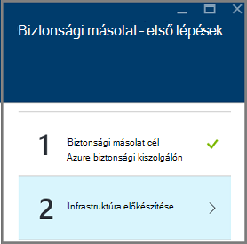

7. Az **Előkészítés infrastruktúra** lap, amely megnyitja hivatkozásai **letöltése** Azure biztonsági másolat Server telepítése és letöltése tárolóra hitelesítő adatok. Hitelesítő adatok tárolóból elemre a helyreállítási szolgáltatások tárolóra Azure biztonsági kiszolgálójának regisztráció során használhatja. A hivatkozások a letöltési központ, ahol szoftvercsomag letölthető.

    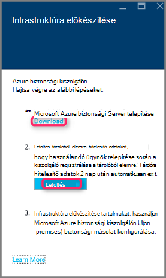

8. Jelölje ki az összes fájlt, és kattintson a **Tovább**gombra. Töltse le a Microsoft Azure biztonsági másolat letöltési lapját érkező összes fájlt, és helyezze az összes fájlt ugyanabban a mappában.

    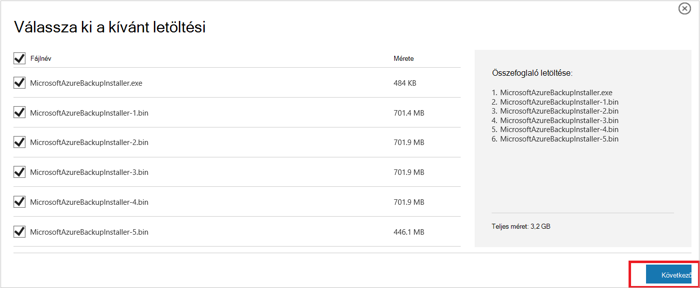

    A letöltés összes fájlt közös mérete > 3G, mivel a 10 MB/s töltse le a hivatkozást a letöltés befejezéséhez legfeljebb 60 percig tart.


### <a name="extracting-the-software-package"></a>A szoftver csomag kibontása

Miután letöltötte az összes fájlt, kattintson a **MicrosoftAzureBackupInstaller.exe**. Elindítja a **Microsoft Azure biztonsági másolat beállítási varázsló** az Ön által megadott helyre a telepítőfájlokat kibontásához. Kövesse a varázsló lépéseit, és kattintson a az kinyerésének megkezdéséhez **kibontása** gombra.

> [AZURE.WARNING] Bontsa ki a telepítőfájlokat legalább 4GB szabad lemezterület van szükség.


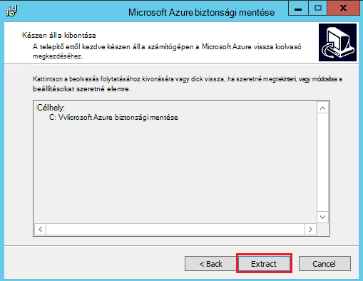

A kibontás folyamat befejezése, ha a jelölőnégyzet bejelölésével indítsa el a *setup.exe* frissen kibontott kezdje el a Microsoft Azure biztonsági másolat Server telepítése, és kattintson a **Befejezés** gombra.

### <a name="installing-the-software-package"></a>A szoftvercsomag telepítésekor

1. Kattintson a **Microsoft Azure biztonsági másolat** a beállítási varázsló indítása gombra.

    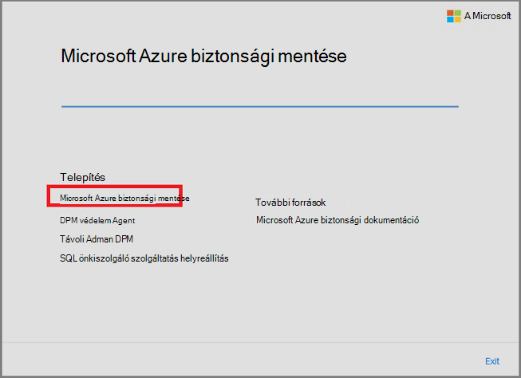

2. Üdvözli a képernyőn kattintson a **Tovább** gombra. Ekkor megjelenik a *Kapcsolatban előzetesen szükséges ellenőrzi* szakaszban. A képernyőn kattintson a határozza meg, ha az Azure biztonsági másolat Server hardverre és szoftverre vonatkozó követelmények betartását **ellenőrzése** gombra. Ha az összes a előfeltételekről lett sikeresen teljesül, megjelenik egy üzenet, amely jelzi, hogy a számítógép megfelel. Kattintson a **Tovább** gombra.

    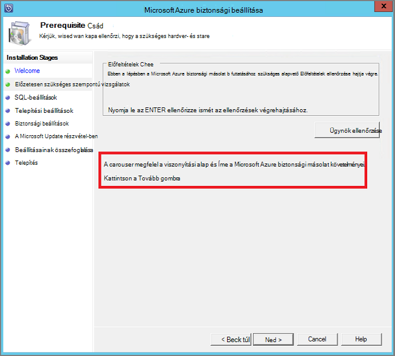

3. Microsoft Azure biztonsági másolat Server szükséges SQL Server Standard, és a biztonságimásolat-Server Azure telepítőcsomag kötegelt megtalálható a megfelelő SQL Server bináris szükséges. Amikor egy új Azure biztonsági másolat Server telepítése kezdve, válassza ki a beállítást **Telepítés új SQL Server-példánnyal ezzel a beállítással** , és kattintson a **ellenőrzése és a telepítés** gombra. Miután a Előfeltételek sikeresen telepítve van, kattintson a **Tovább**gombra.

    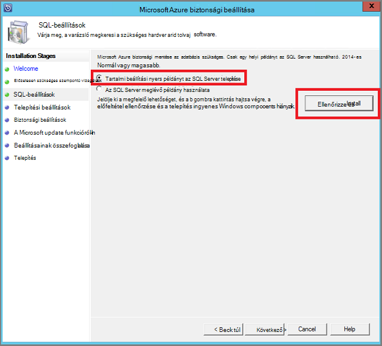

    Ha hiba történik a számítógép újraindítása ajánlást, tegye, és **Ellenőrizze ismét**gombra.

    > [AZURE.NOTE] Azure biztonságimásolat-kiszolgáló nem működnek a távoli SQL Server-példányt. Az Azure biztonsági másolat kiszolgáló által használt példány kell lennie a helyi.

4. Adja meg a telepítés server-fájlok Microsoft Azure biztonsági másolat helyét, és kattintson a **Tovább**gombra.

    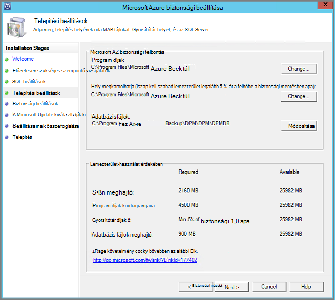

    Az ideiglenes helye felfelé Azure vissza felvétele szükséges. Győződjön meg róla a üres helyre az adatokat a felhőbe mentésben tervezett legalább 5 %-át. Lemezen védelmét külön lemezt kell beállítania, ha a telepítés befejeződött. Tárterület-készletek kapcsolatos további tudnivalókért lásd: a [tárterület-készletek konfigurálása és a szabad tárterület](https://technet.microsoft.com/library/hh758075.aspx).

5. Erős jelszó megadását korlátozott helyi felhasználói fiókok, és kattintson a **Tovább**gombra.

    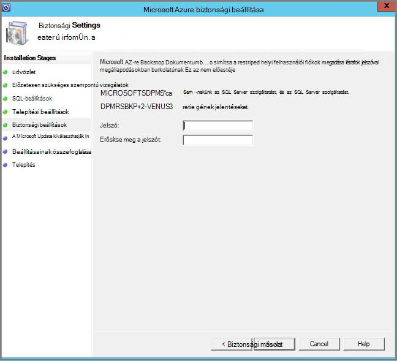

6. Válassza ki, hogy *A Microsoft Update* segítségével a frissítések keresése hivatkozásra, és kattintson a **Tovább**gombra.

    >[AZURE.NOTE] Azt javasoljuk, hogy a Microsoft Update, amely biztonság és a fontos frissítések a Windows és az egyéb termékek, például a Microsoft Azure biztonsági másolat Server irányítsa át a Windows Update problémákat.

    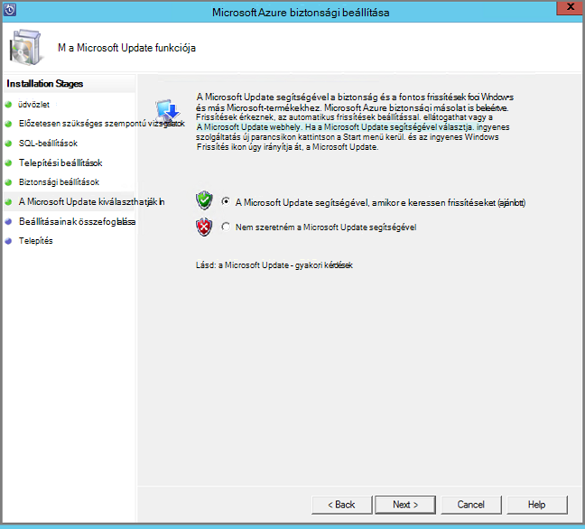

7. Tekintse át az *Összefoglaló vonatkozó beállításokat* , és kattintson a **telepítés**gombra.

    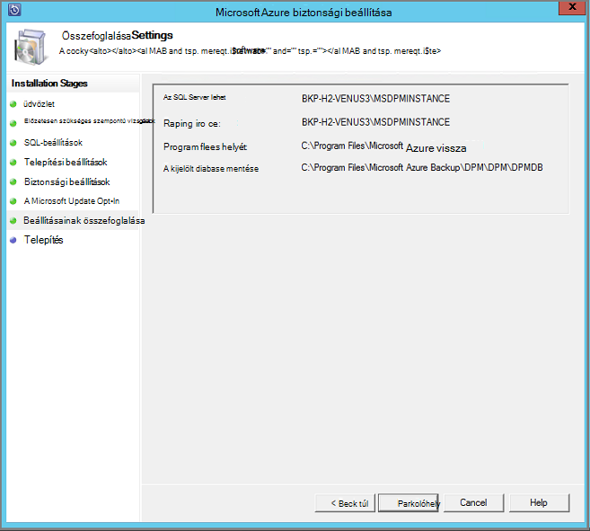

8. A telepítés fázisban történik. Az első szakaszban a Microsoft Azure helyreállítási szolgáltatások Agent telepítve van a kiszolgálón. A varázsló is ellenőrzi az internetkapcsolat. Elérhető internetkapcsolat esetén is folytatja a telepítést, ha nem, meg kell adnia a proxy részletek csatlakozik az internethez.

    A következő lépésként konfigurálása a Microsoft Azure helyreállítási szolgáltatások ügynök. A konfiguráció részeként be kell regisztrálhatja a helyreállítási szolgáltatások tárolóból elemre a gép hitelesítő adatok tárolóból elemre. Akkor is biztosít az Azure és a helyi között küldött adatok titkosítás/visszafejtés egy jelszót. Automatikus készítése egy jelszót, vagy adja meg a saját minimális 16 karakteres hozzáférési kódot. Folytassa a varázsló mindaddig, amíg a agent van beállítva.

    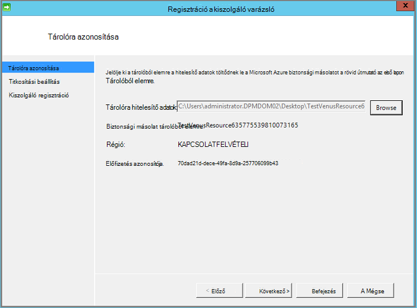

9. Ha a Microsoft Azure biztonsági másolat kiszolgáló regisztrációs sikeresen befejeződött, a teljes beállítási varázsló folytatódik, a telepítési és az SQL Server és a biztonságimásolat-kiszolgáló Azure-összetevők konfigurálása. Ha az SQL Server összetevő telepítés befejeződött, a biztonságimásolat-kiszolgáló Azure-összetevők vannak telepítve.

    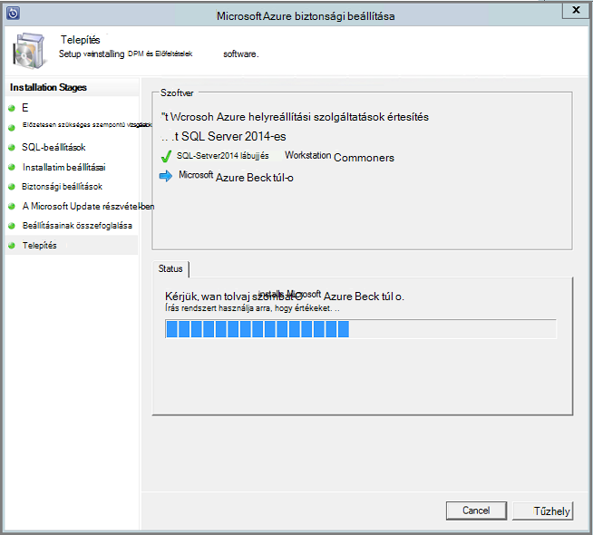


A telepítés lépés befejezése a termék asztali ikonok fog lettek létrehozva is. Csak kattintson duplán az ikonra kattintva indítsa el a terméket.

### <a name="add-backup-storage"></a>Biztonsági másolat tárterület

Az első biztonsági másolatot a biztonsági másolat Server Azure géphez csatlakoztatott tárolón legyen. Lemezen hozzáadásával kapcsolatos további tudnivalókért lásd: a [tárterület-készletek konfigurálása és a szabad tárterület](https://technet.microsoft.com/library/hh758075.aspx).

> [AZURE.NOTE] Biztonsági másolat tárolási felvenni, akkor is, ha azt tervezi, hogy az adatok küldése a Azure szüksége. Az aktuális architektúra Azure biztonsági kiszolgálójának az Azure biztonsági tárolóból elemre a *második* másolatot az adatok rendelkezik, miközben a helyi tároló tartalmazza az első (és kötelező) a biztonsági másolat.

## <a name="4-network-connectivity"></a>4. a hálózati kapcsolat

Azure biztonsági másolat Server kiszolgálóhoz a termék sikeres működéséhez Azure biztonsági másolat szolgáltatáshoz való csatlakozást igényelnek Ellenőrizze, hogy a számítógépben Azure a kapcsolatot, használja a ```Get-DPMCloudConnection``` parancsmagot a Azure biztonsági másolat Server PowerShell konzolban. Ha a parancsmag kimenete értéke igaz, létezik a kapcsolatot, majd még nincs kapcsolat.

Egy időben az Azure előfizetés kell egy megfelelő állapotban. Megtudhatja, hogy az előfizetés állapotának és kezelése, hogy jelentkezzen be az [előfizetés portálon]( https://account.windowsazure.com/Subscriptions).

Ha már elsajátította az Azure kapcsolatot, és az Azure előfizetés állapotát, az alábbi táblázat segítségével meg, hogy a felajánlott biztonsági mentési és visszaállítási funkció milyen hatással.

| Kapcsolat állapota | Azure előfizetés | Azure biztonsági mentése| Biztonsági másolat lemezre | Az Azure visszaállítása | Lemezről visszaállítása |
| -------- | ------- | --------------------- | ------------------- | --------------------------- | ----------------------- |
| Csatlakoztatott | Aktív | Engedélyezett | Engedélyezett | Engedélyezett | Engedélyezett |
| Csatlakoztatott | Lejárt | Leállítva | Leállítva | Engedélyezett | Engedélyezett |
| Csatlakoztatott | Leépítve | Leállítva | Leállítva | Leállítva és Azure helyreállítási pontok törlése | Leállítva |
| Elveszett kapcsolódási > 15 nap | Aktív | Leállítva | Leállítva | Engedélyezett | Engedélyezett |
| Elveszett kapcsolódási > 15 nap | Lejárt | Leállítva | Leállítva | Engedélyezett | Engedélyezett |
| Elveszett kapcsolódási > 15 nap | Leépítve | Leállítva | Leállítva |  Leállítva és Azure helyreállítási pontok törlése | Leállítva |

### <a name="recovering-from-loss-of-connectivity"></a>A kapcsolat elvesztését a helyreállítása
Ha tűzfalat vagy, ami miatt az access az Azure proxy kell whitelist tűzfal/proxy profilban a következő tartomány címeket:

- www.msftncsi.com
- \*. Microsoft.com
- \*. WindowsAzure.com
- \*. microsoftonline.com
- \*. windows.net

Azure kapcsolatot vissza lett állítva az Azure biztonsági másolat Server számítógépen, miután a végrehajtható műveletek Azure előfizetés állapotát határozza meg. A fenti táblázatban van a gép "Csatlakozás" után engedélyezett műveletek olvashat.

### <a name="handling-subscription-states"></a>Előfizetés államok kezelése

A *lejárt* vagy *Deprovisioned* állam, hogy az *aktív* állapot vigye az Azure előfizetéssel lehetőség. Azonban ennek van néhány következmények a termék működését, amíg az állapot még nem *aktív*:

- *Deprovisioned* előfizetés megszakad a funkció akkor leépítjük időszakra vonatkozóan. Kapcsolja *az aktív*, kattintson a biztonsági mentés és visszaállítás a termék funkciói van aktiválja. Az adatok biztonsági másolatának a helyi lemezen is tudja visszaszerezni, ha azt lett tartani elég nagy adatmegőrzési pontra. Azonban az Azure-ban adatok biztonsági másolatának elvész helyrehozhatatlanul után az előfizetés *Deprovisioned* állapotba kerül.
- A *lejárt* előfizetés elveszti funkciók csak a mindaddig, amíg újra *aktív* történt. Minden olyan biztonsági mentést, hogy az előfizetés *lejárt* lett-e időszakra ütemezett nem fog futni.


## <a name="troubleshooting"></a>Hibaelhárítás

Ha a hibát tartalmazó Microsoft Azure biztonsági kiszolgálón a telepítő fázis (vagy biztonsági mentése és visszaállítása) során nem sikerül, keresse meg a [hiba kódok dokumentum](https://support.microsoft.com/kb/3041338) további információt.
Akkor is érdemes lehet [Azure biztonsági másolat kapcsolatos gyakori kérdések](backup-azure-backup-faq.md)


## <a name="next-steps"></a>Következő lépések

[A környezet DPM előkészítése](https://technet.microsoft.com/library/hh758176.aspx) részletes információkat kaphat a Microsoft TechNet webhelyen. Támogatott konfigurációs, amelyen Azure biztonsági mentés kiszolgálóra telepített és használt információk is tartalmaz.

Ezek a cikkek mélyebb ismertetése, a Microsoft Azure biztonságimásolat-kiszolgálóval terhelést védelmet eléréséhez is használhatja.

- [Az SQL Server biztonsági mentése](backup-azure-backup-sql.md)
- [A SharePoint server biztonsági mentése](backup-azure-backup-sharepoint.md)
- [Másodlagos kiszolgáló biztonsági mentése](backup-azure-alternate-dpm-server.md)
