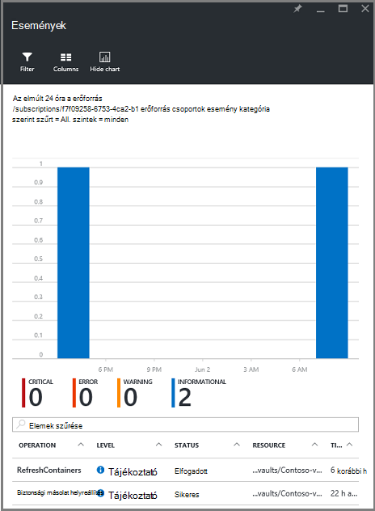

<properties
   pageTitle="Erőforrás-kezelő monitor rendszerbe virtuális gép biztonsági másolatok |} Microsoft Azure"
   description="Lync-események és erőforrás-kezelő rendszerbe virtuális gép biztonsági mentés riasztások. Értesítések alapuló e-mail küldése."
   services="backup"
   documentationCenter="dev-center-name"
   authors="markgalioto"
   manager="cfreeman"
   editor=""/>

<tags
ms.service="backup"
ms.workload="storage-backup-recovery"
ms.tgt_pltfrm="na"
ms.devlang="na"
ms.topic="article"
ms.date="08/25/2016"
ms.author="trinadhk; giridham;"/>

# <a name="monitor-alerts-for-azure-virtual-machine-backups"></a>Lync-riasztások Azure virtuális gép biztonsági másolatok

Értesítések, hogy egy esemény küszöb éri el vagy minőségjavulások szolgáltatásból válaszok. Arra, hogy mikor problémák kezdő fontos, hogy az üzleti költségek megőrzési is lehet. Értesítések általában nem jelentkezik ütemezés, és így célszerű meg, hogy minél korábban után riasztások fordul elő. Például ha nem sikerül egy biztonsági mentése és visszaállítása a feladatot, egy figyelmeztetés fordul elő a hiba öt percen belül. A biztonsági figyelmeztetések csempét a tárolóból elemre irányítópult kritikus és a Figyelmeztetés szintű események jeleníti meg. A biztonsági figyelmeztetések beállításait megtekintheti az összes eseményének. De mi a teendő, ha egy figyelmeztetés fordul elő, ha egy külön probléma dolgoznak? Az értesítés történik, ha nem tudja, ha ez lehet egy kisebb leáll, vagy azt csökkenthetik adatok. Győződjön meg arról, hogy a megfelelő személyek ismerjék - értesítés fordul elő, ha a szolgáltatás beállítása mailben értesítéseket küldeni. E-mail értesítések beállításával kapcsolatos részletekért [beállítás, értesítés](backup-azure-monitor-vms.md#configure-notifications)jelenik meg.

## <a name="how-do-i-find-information-about-the-alerts"></a>Hogyan találhatom meg a riasztások információt?

Értesítés okozott esemény adatainak megtekintéséhez nyissa meg a biztonsági figyelmeztetések lap. Nyissa meg a biztonsági figyelmeztetések lap kétféleképpen: akár a biztonsági figyelmeztetések a csempe a tárolóból elemre irányítópulton, illetve az értesítések és események lap.

Biztonsági figyelmeztetések csempe a biztonsági figyelmeztetések lap megnyitásához:

- Kattintson a **Biztonsági figyelmeztetések** csempét a tárolóból elemre irányítópulton, **kritikus** vagy **Figyelmeztetés** súlyosságát szintnek műveleti eseményei megtekintéséhez.

    


A biztonsági figyelmeztetések lap megnyitásához az értesítések és események lap:

1. Az irányítópult tárolóból elemre kattintson az **Összes beállításai**parancsra. 

2. Kattintson a **Beállítások** lap **értesítések és eseményeket**. 

3. Kattintson a **riasztások és események** lap **Biztonsági figyelmeztetések**. 

    A **Biztonsági figyelmeztetések** lap megnyílik, és megjeleníti a szűrt értesítések.

    

4. Egy adott típusú, az események listájából részletes információinak megtekintése kattintson az értesítésre, a **Részletek** lap megnyitásához.

    

    Testre szabhatja az attribútumok megjelennek a listában, lásd: [további esemény attribútumok megtekintése](backup-azure-monitor-vms.md#view-additional-event-attributes)

## <a name="configure-notifications"></a>Értesítések konfigurálása

 Beállíthatja, hogy mikor történt az elmúlt egy órában fölé, vagy ha az adott típusú eseményeket történne nyomon követése riasztásokkal parancsát értesítő e-mailek küldése a szolgáltatást.

Értesítő e-mail értesítések beállítása

1. Biztonsági figyelmeztetések menüben kattintson az **Értesítések beállítása**

    

    Az értesítések konfigurálása lap megnyitása

    

2. A Configure értesítések lap az értesítő e-mailek kattintson **a**.

    A címzettek és súlyosságát párbeszédpanelek van egy csillag melletti őket, mert ezeket az információkat szükség. Legalább egy e-mail cím megadásához, és válassza ki legalább egy súlyosságát.

3. A **címzettek (levelezés)** párbeszédpanelen írja be az értesítést kapnak az e-mail címét. A formátum használata: username@domainname.com. Több e-mail címre egymástól pontosvesszővel (;).

4. Az **értesítési** területen, **Egy figyelmeztetés** értesítés küldése, amikor a megadott riasztás vagy **Óránkénti kivonat** összefoglaló küldése az elmúlt óraként közül.

5. **Súlyosságát** párbeszédpanelen válassza az értesítő e-mailt az elindítani kívánt egy vagy több szintek.

6. Kattintson a **Mentés**gombra.
### <a name="what-alert-types-are-available-for-azure-iaas-vm-backup"></a>Riasztási milyen Azure IaaS virtuális biztonsági másolatának érhetők el?
| Az értesítési szint  | Küldött értesítések |
| ------------- | ------------- |
| Kritikus | Biztonsági mentés sikerült, helyreállítási hiba  |
| Figyelmeztetés  | Nincs lehetőség |
| Tájékoztató  | Nincs lehetőség  |

### <a name="are-there-situations-where-email-isnt-sent-even-if-notifications-are-configured"></a>Vannak olyan esetek, ahol nem küldött e-maileket, még akkor is, ha az értesítések vannak-e beállítva?

Vannak helyzetek, ahol jelzést nem küldi el, annak ellenére, hogy az értesítések megfelelően van konfigurálva. A következő helyzetekben e-mailben értesítéseket nem kapnak riasztási zajt elkerülése:

- Ha értesítést óránkénti kivonat vannak beállítva, és jelzést hatványát és a rendszer az órán belül.
- A feladat megszakad.
- Biztonsági mentési feladat induljanak, és utána mégsem, és egy másik biztonsági mentési feladat folyamatban van.
- Egy erőforrás-kezelő engedélyező virtuális ütemezett biztonsági mentési feladat indítja el, de már nem létezik a virtuális.

## <a name="customize-your-view-of-events"></a>Az események nézetének testreszabása

A **naplókat** beállítás tartalmaz egy előre definiált szűrők és oszlopok működési eseményre információhoz. Testre szabhatja a nézetet, így az **események** lap megnyitásakor mutatja meg a kívánt adatokat.

1. Az [Irányítópult tárolóból elemre](./backup-azure-manage-vms.md#open-a-recovery-services-vault-in-the-dashboard)keresse meg és válassza a **Naplókat** , az **események** lap megnyitásához.

    

    Az **események** lap nyílik meg a működési események szűrt csak az aktuális tárolóból elemre.

    

    A lap kritikus, hiba, figyelmeztetés és tájékoztató események, hogy mikor történt a múlt héten listáját jeleníti meg. Az időszak az a **szűrő**beállítása alapértelmezett érték. Az **események** lap is nyomon követése az események előfordulásakor sávdiagram jeleníti meg. Ha nem szeretné látni a sávdiagram, **események** menüben kattintson a **Diagram elrejtése** a Váltás a diagram ki. Események alapértelmezett nézete megjeleníti művelet, szint, állapot, erőforrás és időt. További esemény attribútumok közzéteszi tudni olvassa el a szakasz [kibontása eseményadatok](backup-azure-monitor-vms.md#view-additional-event-attributes)című témakört.

2. További információt a műveleti esemény, a **művelet** oszlopban kattintson a működési eseményre kattintva nyissa meg a lap. A lap az események részletes információkat tartalmaz. Eseményeket a korrelációs azonosító és az időszak előfordult eseményeket listájának szerint csoportosított.

    

3. Egy adott esemény, az események listájából részletes információt a **Részletek** lap megnyitásához az esemény gombra.

    

    Esemény szintű adatai annyira részletes információt kap. Ha inkább az ennyi az egyes eseményekkel kapcsolatos információkat lát, és szeretné ennyi részletek hozzáadása az **események** lap, olvassa el a szakasz [kibontása eseményadatok](backup-azure-monitor-vms.md#view-additional-event-attributes)című témakört.


## <a name="customize-the-event-filter"></a>Az esemény szűrő testreszabása
A **szűrő** segítségével módosítsa, vagy válassza ki a megjelenő adatokat egy adott lap. Az esemény információk szűréséhez:

1. Az [Irányítópult tárolóból elemre](./backup-azure-manage-vms.md#open-a-recovery-services-vault-in-the-dashboard)keresse meg és válassza a **Naplókat** , az **események** lap megnyitásához.

    

    Az **események** lap nyílik meg a működési események szűrt csak az aktuális tárolóból elemre.

    

2. **Események** menüben kattintson a **szűrő** , hogy a lap megnyitásához.

    

3. Kattintson a **szűrő** lap állítsa át a **szint**, az **idő időtartomány**és a **hívó** szűrőt. A további szűrők nem érhetők el, mivel ezek a a helyreállítási szolgáltatások tárolóból elemre az aktuális adatokat állított.

    

    Megadhatja, hogy a **szint** esemény: kritikus, hiba, figyelmeztetés vagy tájékoztatások. Esemény szintek tetszőleges kombinációját megadhatja, de legalább egy szinttel a kiválasztott kell rendelkeznie. Váltás a szint a be- és kikapcsolása. Az **idő időtartomány** szűrő, amely lehetővé teszi, hogy események rögzítéséhez idejének hosszát adja meg. Ha egy egyéni időszakot jelöl, beállíthatja a kezdési és befejezési időpont.

4. Ha készen áll a szűrővel a műveletek naplók lekérdezéséhez, kattintson a **frissítés**gombra. Az eredmények az **események** lap jeleníti meg.

    


### <a name="view-additional-event-attributes"></a>További esemény attribútumok megtekintése
A **Hasábok** gombra, engedélyezheti további esemény attribútumok jelenik meg a listában, kattintson az **esemény** lap. Az események alapértelmezett listáját a művelet, szint, állapot, erőforrás és idő adatait jeleníti meg. További attribútumokkal engedélyezése:

1. Kattintson az **esemény** lap **oszlopok**.

    

    A **Választható oszlopok** lap megnyitása

    

2. Az attribútum kijelöléséhez kattintson a jelölőnégyzet. A attribútum jelölőnégyzet alkalmazása, illetve be- és kikapcsolása.

3. **Állítsa alaphelyzetbe** a listában, az **események** lap attribútumok alaphelyzetbe állítása gombra. Után hozzáadása, vagy attribútumokat eltávolítása a listából, használja a **alaphelyzetbe állítása** az új esemény attribútumok listájának megtekintéséhez.

4. Kattintson a **frissítés** az esemény attribútumok az adatok frissítéséhez. Az alábbi táblázat az egyes attribútum információt tartalmaz.

| Oszlopnév      |Leírás|
| -----------------|-----------|
| Művelet|A művelet neve|
| Szint|A művelet szintjét értékek lehetnek: tájékoztató, figyelmeztetés, hiba vagy kritikus|
|Állapot|A művelet leíró állam|
|Erőforrás|URL-címet, amely azonosítja az erőforrás; a más néven erőforrás-azonosító|
|Idő|Az aktuális idő, ha az esemény bekövetkezett mért idő|
|Hívóazonosító|Ki mit nevű vagy vagy indított az esemény; lehet, a rendszer, vagy egy felhasználó|
|Időbélyeg|Az idő, ha az esemény indított volt|
|Erőforráscsoport|A hozzárendelt erőforrás csoport|
|Erőforrás típusa|Az erőforrás-kezelő által használt belső erőforrás típusa|
|Előfizetés azonosítója|A kapcsolódó előfizetés azonosítója|
|Kategória|Az esemény kategória|
|Korrelációs azonosító|Közös azonosító kapcsolódó eseményekre vonatkozóan:|


## <a name="use-powershell-to-customize-alerts"></a>Riasztások testreszabását a PowerShell használatával
A feladatok egyéni értesítéseket kaphat a portálon. Úgy juthat az alábbi feladatok, események működési naplók PowerShell rendszerű riasztási szabályok meg. Használat *PowerShell verzió 1.3.0 vagy újabb*.

Egy egyéni biztonsági hibák esetében a felhasználó értesítése megadásához használja a parancs, például a következőt:

```
PS C:\> $actionEmail = New-AzureRmAlertRuleEmail -CustomEmail contoso@microsoft.com
PS C:\> Add-AzureRmLogAlertRule -Name backupFailedAlert -Location "East US" -ResourceGroup RecoveryServices-DP2RCXUGWS3MLJF4LKPI3A3OMJ2DI4SRJK6HIJH22HFIHZVVELRQ-East-US -OperationName Microsoft.Backup/RecoveryServicesVault/Backup -Status Failed -TargetResourceId /subscriptions/86eeac34-eth9a-4de3-84db-7a27d121967e/resourceGroups/RecoveryServices-DP2RCXUGWS3MLJF4LKPI3A3OMJ2DI4SRJK6HIJH22HFIHZVVELRQ-East-US/providers/microsoft.backupbvtd2/RecoveryServicesVault/trinadhVault -Actions $actionEmail
```

**ResourceId** : a naplókat ResourceId fordulhat. A ResourceId az erőforrásoszlop, a művelet naplók megadott URL-címet.

**OperationName** : OperationName "Microsoft.RecoveryServices/recoveryServicesVault/*EventName*" ahol *EventName* lehet formátumban van:<br/>
- Regisztráció <br/>
- Unregister <br/>
- ConfigureProtection <br/>
- Biztonsági másolat <br/>
- Visszaállítása <br/>
- StopProtection <br/>
- DeleteBackupData <br/>
- CreateProtectionPolicy <br/>
- DeleteProtectionPolicy <br/>
- UpdateProtectionPolicy <br/>

**Állapot** : támogatott értékei a lépések, sikerült vagy sikertelen.

**ResourceGroup** : Ez az erőforráscsoport, amelyhez az erőforrás tartozik. Az erőforráscsoport oszlop fűzheti hozzá a létrehozott naplókat. Erőforráscsoport események adatait a rendelkezésre álló típusú egyike.

**Név** : a riasztási szabály nevét.

**CustomEmail** : Adja meg az egyéni e-mail címet, amelyre el szeretné küldeni az értesítést

**SendToServiceOwners** : Ez a beállítás küld az értesítések rendszergazdák és a további rendszergazdák az előfizetés. A **New-AzureRmAlertRuleEmail** parancsmag használható

### <a name="limitations-on-alerts"></a>Értesítések korlátozásai
Esemény értesítések az alábbi korlátozások vonatkoznak:

1. A figyelmeztetéseket a helyreállítási szolgáltatások tárolóból elemre az összes virtuális gépeken. Az értesítés a helyreállítási szolgáltatások tárolóból elemre a virtuális gépeken futó csak egy részhalmazát nem szabható testre.
2. Ez a funkció előzetes verzióban. [tudj meg többet](../monitoring-and-diagnostics/insights-powershell-samples.md#create-alert-rules)
3. Figyelmeztetések a feladó "alerts-noreply@mail.windowsazure.com". E-mail feladójának jelenleg nem módosíthatók.


## <a name="next-steps"></a>Következő lépések

Eseménynaplók remek utólagos engedélyezése, és a biztonsági mentés támogatása naplózási. Az alábbi műveletek naplózza:

- Regisztráció
- Unregister
- Védelem beállítása
- Biztonsági másolat (mindkét ütemezett és igény szerinti biztonsági másolat)
- Visszaállítása
- Védelem megszüntetése
- Adatok biztonsági másolatának törlése
- Házirend beállítása
- Szabály törlése
- Házirend módosítására
- Feladat megszakítása

Események széles körű leírását műveletek és a naplókat az Azure szolgáltatásban témakörben, [események megtekintése és a naplókat](../monitoring-and-diagnostics/insights-debugging-with-events.md).

További információkat újra a helyreállítási helyétől virtuális géphez kivétele [Azure VMs visszaállítása](backup-azure-restore-vms.md). Ha segítségre van szüksége a virtuális gépeken futó védheti, olvassa el a [először meg: készítsen biztonsági másolatot a helyreállítási szolgáltatások tárolóra VMs](backup-azure-vms-first-look-arm.md). Tudjon meg többet az adatkezelési feladatok virtuális biztonsági másolatok a következő cikket [kezelése Azure virtuális gép biztonsági mentést](backup-azure-manage-vms.md).
