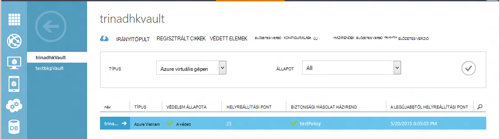
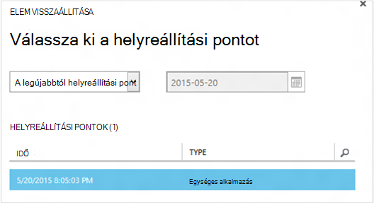
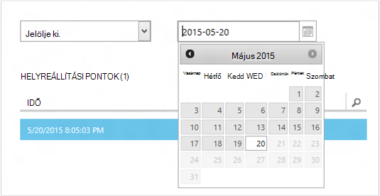
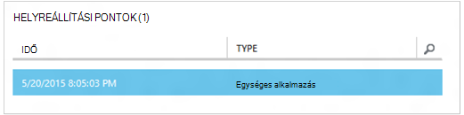
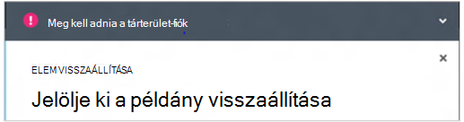
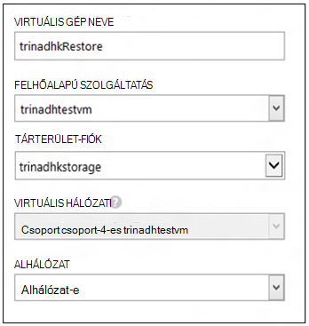
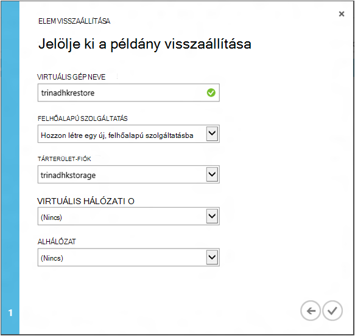
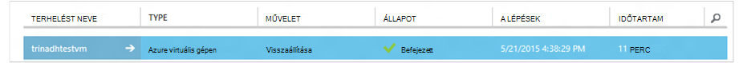

<properties
    pageTitle="A virtuális gépeken futó visszaállítása biztonsági másolatból |} Microsoft Azure"
    description="Megtudhatja, hogy miként szeretné visszaállítani a helyreállítási pont-Azure virtuális gépen"
    services="backup"
    documentationCenter=""
    authors="trinadhk"
    manager="shreeshd"
    editor=""
    keywords="biztonsági másolat; visszaállítása hogyan lehet visszaállítani; helyreállítási pont;"/>

<tags
    ms.service="backup"
    ms.workload="storage-backup-recovery"
    ms.tgt_pltfrm="na"
    ms.devlang="na"
    ms.topic="article"
    ms.date="08/02/2016"
    ms.author="trinadhk; jimpark;"/>

# Az Azure virtuális gépeken futó visszaállítása

> [AZURE.SELECTOR]
- [VMs visszaállítása az Azure-portálon](backup-azure-arm-restore-vms.md)
- [VMs visszaállítása klasszikus portálon](backup-azure-restore-vms.md)

Egy új virtuális virtuális gép visszaállíthatja a biztonsági mentés tárolt az Azure biztonsági tárolóból elemre a következő lépések.

## Munkafolyamat visszaállítása

### 1. Válassza az elem visszaállítása

1. Nyissa meg a **Védett elemek** fülre, majd válassza ki a virtuális gép azt szeretné, ha vissza szeretne állítani egy új virtuális.

    

    A **Védett elemek** lapon a **Helyreállítási pont** oszlop program tájékoztatja, virtuális géphez helyreállítási pontok száma. A **Legújabbtól helyreállítási pont** oszlopból kiderül, hogy a legutóbbi mentésének, ahonnan virtuális gép visszaállíthatók.

2. Kattintson a **Visszaállítás** kattintva nyissa meg az **elem visszaállítása** varázsló parancsra.

    

### 2. a helyreállítási pont kiválasztása

1. **Jelöljön ki egy helyreállítási pontot** képernyőn vissza tudja állítani a legújabb helyreállítási pont vagy egy előző pont időben. Az alapértelmezett beállítás kijelölve, amikor megnyílik a varázsló található *legújabbig helyreállítási*.

    

2. Válasszon egy korábbi pont idő, válasszon a **Dátum jelölje ki** a legördülő menü és a **Naptár ikonra**kattintva adja meg a dátumot a naptárban. A vezérlőben helyreállítási pont kezdődő összes dátumot vannak töltve a világos, szürke árnyékolása és a felhasználó által ügyféloldalon választható.

    

    Miután a Naptár vezérlőelem dátumot gombra kattint, a helyreállítás érhető el, hogy dátum helyreállítási pontok táblázatban látható jelennek mutat. Az **időértékeket** tartalmazó oszlopra azt jelzi, hogy az idő, amelynél a pillanatkép volt. A **típus** oszlopban a helyreállítási pont [konzisztencia](https://azure.microsoft.com/documentation/articles/backup-azure-vms/#consistency-of-recovery-points) jeleníti meg. A táblázatfejlécében zárójelet az adott napon rendelkezésre álló helyreállítási pontok száma látható.

    

3. Jelölje ki a helyreállítási pont a **Helyreállítási pontok** táblában, és a következő nyílra kattintva nyissa meg a következő képernyőn.

### 3. a rendeltetési helyének megadása

1. A **Select visszaállítása példány** képernyőn adja meg, hogy hol szeretné visszaállítani a virtuális gép részleteit.

  - Adja meg a virtuális számítógépnév: egy adott Felhőszolgáltatásában a virtuális gép egyedinek kell lennie. Nem támogatott diagramtípusról túlságosan írása a meglévő virtuális. 
  - Jelölje ki a virtuális egy felhőalapú szolgáltatásba: Ez a kötelező egy virtuális hozhat létre. Megadhatja, hogy egy meglévő felhőalapú szolgáltatást használja, vagy hozzon létre egy új felhőszolgáltatásba.

        Whatever cloud service name is picked should be globally unique. Typically, the cloud service name gets associated with a public-facing URL in the form of [cloudservice].cloudapp.net. Azure will not allow you to create a new cloud service if the name has already been used. If you choose to create select create a new cloud service, it will be given the same name as the virtual machine – in which case the VM name picked should be unique enough to be applied to the associated cloud service.

        We only display cloud services and virtual networks that are not associated with any affinity groups in the restore instance details. [Learn More](../virtual-network/virtual-networks-migrate-to-regional-vnet.md).

2. Válassza ki a virtuális egy tárolás számla: Ez a kötelező, a virtuális hozhat létre. Választhat a meglévő tároló fiókokból ugyanabban a régióban, mint az Azure biztonsági másolat tárolóból elemre. Tárterület-fiókot, amely zóna felesleges vagy prémium tároló típusú nem támogatjuk.

    Nem támogatott beállításokkal tárterület-fiókok esetén adjon visszaállítási művelet megkezdése előtt támogatott konfiguráció tároló fiók létrehozásához.

    

3. Jelöljön ki egy virtuális hálózatot: A virtuális hálózat (VNET) a virtuális gépen kell választani a virtuális létrehozása idején. A visszaállítás felhasználói felület belül az előfizetés használható minden VNETs jeleníti meg. Még nem kötelező, jelölje be a VNET a visszaállított virtuális – tud csatlakozni a visszaállított virtuális gép az interneten keresztül még akkor is, ha a program nem állítja a VNET lesz.

    Ha a kiválasztott felhőbeli szolgáltatástól társítva virtuális hálózatot, akkor a virtuális hálózat nem módosítható.

    

4. Jelölje ki a alhálózat: abban az esetben, ha a VNET alhálózat van, alapértelmezés szerint az első alhálózat lesz kijelölve. Válassza a alhálózat lehetőség a legördülő listákból. Alhálózat részletekért lépjen a hálózatok kiterjesztése a [portál kezdőlapján](https://manage.windowsazure.com/), használja a **Virtuális hálózatok** , jelölje ki a virtuális hálózat és konfigurálása alhálózat részletek végezhet részletezést.

    

5. Kattintson a **Küldés** ikonra a részletek elküldése és visszaállítási feladat létrehozása varázsló.

## A visszaállítás nyomon követése
A visszaállítás varázsló az információkat a szövegbeviteli és azt elküldése után Azure biztonsági másolat létrehozása a feladatok nyomon követése a visszaállítási művelet megpróbálja.

Ha sikerül a projekt létrehozása, megjelenik egy bejelentési értesítés jelzi, hogy a feladat jön létre. További információra kíváncsi, hogy a **feladatok** lap kattintva megnyílik a **Feladat megtekintése** gombra kattintva elérheti.

A visszaállítás befejeződése után azt a program megjelöli elvégzettként a **feladatok** lap.

A virtuális gép visszaállítása után szükség lehet újra kell telepítenie a meglévő az eredeti virtuális és [a végpontok módosítása](../virtual-machines/virtual-machines-windows-classic-setup-endpoints.md) a virtuális gép az Azure-portálon a bővítményeket.

## Lépéseket utáni visszaállítása
Alkalmazás használatakor a felhőben init alapú Linux terjesztési Ubuntu, például biztonsági okokból, azzal blokkolhatja jelszó visszaállítása közzé. Kérjük, használja a VMAccess kiterjesztése a visszaállított virtuális [a jelszó](../virtual-machines/virtual-machines-linux-classic-reset-access.md)alaphelyzetbe állítása. Azt javasoljuk, hogy ezek terjesztését SSH billentyűk segítségével elkerülése alaphelyzetbe a jelszó bejegyzés visszaállítása. 

## A visszaállított VMs biztonsági mentése
Ha egy felhőalapú szolgáltatás virtuális van visszaállítása eredetileg virtuális a biztonsági mentésben azonos nevű, biztonsági mentése az virtuális bejegyzés visszaállítása a továbbra is. Virtuális vissza valamelyik másik felhőszolgáltatásában vagy egy másik nevet a visszaállított virtuális megadott van, ha ez egy új virtuális fog tekinteni, és a visszaállított virtuális telepítés biztonsági másolat kell.

## A virtuális visszaállítása Azure adatközponthoz katasztrófa során
Azure biztonsági másolat lehetővé teszi, hogy visszaállítása a biztonsági mentésben VMs párosított adatközpontja abban az esetben, ha az elsődleges adatok középre, ahol VMs élményt katasztrófa fut, és úgy állította be, hogy geo felesleges kell a biztonsági másolat tárolóból elemre. Ilyen esetben során jelöljön ki egy párosított adatközpont jelen tárterület-fiókot kell, és a visszaállításhoz többi azonos marad. Azure biztonsági másolat párosított geo számítási szolgáltatást használ, a visszaállított virtuális gép létrehozásához. 

## Tartomány vezérlő VMs visszaállítása
Biztonsági másolatot tartomány vezérlő (Adatközpont) virtuális gépeken futó támogatott lehetőség Azure mentéssel. Azonban néhány ügyelni kell a visszaállítás során. A visszaállítás felület eltér nagyban tartomány vezérlő VMs a többszörös-Adatközpont konfiguráció egyetlen-Adatközpont konfigurációban VMs összehasonlítása.

### Egyetlen Adatközpont
A virtuális (például más virtuális) az Azure visszaállíthatja portálon vagy a PowerShell használatával.

### Több DCs
Ha a többszörös-Adatközpont környezet, a tartomány vezérlők van a saját módon, ha szinkronizálja az adatokat. Ha egy régebbi biztonsági másolat pontra a visszaállított *anélkül, hogy a megfelelő óvintézkedéseket*, a a USN modullal pusztítást többszörös-Adatközpont környezetben is teszi. A jobb oldali egy virtuális gép helyreállítása módja Címtárszolgáltatások módban indítására.

A kérdés merül fel, mert Címtárszolgáltatások mód nem szerepel a Azure. Így például egy virtuális visszaállításához nem használhatja az Azure-portálra. Az egyetlen támogatott visszaállítása mechanizmusa merevlemez-alapú visszaállítása a PowerShell használatával.

>[AZURE.WARNING] A tartomány vezérlő VMs többszörös-Adatközpont környezetben ne használja a az Azure-portálra a visszaállítás! Támogatott csak PowerShell-alapú visszaállítása

További információ a [USN visszaállítás probléma](https://technet.microsoft.com/library/dd363553) és a megoldással javasolt stratégiák.

## Visszaállítás VMs különleges hálózati beállítások
Azure biztonsági másolat biztonsági másolat támogatja a következő virtuális gépeken futó különleges hálózati konfigurációja.

- VMs a terheléselosztó (belső és külső)
- A több fenntartott IP-címei VMs
- A több VMs

Ezek a konfigurációk határozza meg, hogy közben visszaállításáról szempontok követően.

>[AZURE.TIP] PowerShell-alapú helyreállítási folyamat használatával hozza létre újból a VMs bejegyzés visszaállítása különleges hálózati konfigurációja miatt.

### A felhasználói felületen visszaállítása:
A felhasználói felület, **mindig válassza az új felhőalapú szolgáltatás**visszaállítása közben. Felhívjuk a figyelmét arra, hogy óta portál csak akkor kötelező paraméterek visszaállítása továbbításához, VMs visszaállítani a felhasználói felület használata során a speciális hálózati konfigurációja rendelkeznek elvesznek. Más szóval, VMs visszaállítása lesz a normál VMs terheléselosztó vagy több konfiguráció nélkül hálózati kártya vagy a több fenntartott IP.

### A PowerShell visszaállítása:
PowerShell tartalmaz, az azt jelenti, hogy csak a virtuális lemez visszaállítása biztonsági másolatból, és nem hoz létre a virtuális gép. Ez akkor hasznos, ha a virtuális gépeken futó igénylő különleges hálózati konfigurációk mentined fenti visszaállítása.

Annak érdekében, hogy teljesen hozza létre újból a virtuális gép bejegyzés visszaállítása lemezt, kövesse az alábbi lépéseket:

1. A lemez visszaállítása a biztonsági másolat tárolóból elemre, [Azure biztonsági PowerShell](../backup-azure-vms-classic-automation.md#restore-an-azure-vm) használatával

2. A virtuális config terheléselosztó szükséges létrehozása / több hálózati kártya/több fenntartott IP a PowerShell-parancsmagok és használata a virtuális a létrehozásához szükséges konfigurációs.
    - Hozzon létre virtuális felhőszolgáltatásában a [belső terheléselosztó](https://azure.microsoft.com/documentation/articles/load-balancer-internal-getstarted/)
    - Hozzon létre virtuális csatlakozni [terheléselosztó internetes] (https://azure.microsoft.com/en-us/documentation/articles/load-balancer-internet-getstarted/)
    - Hozzon létre virtuális [több](https://azure.microsoft.com/documentation/articles/virtual-networks-multiple-nics/)
    - Hozzon létre virtuális [több fenntartott IP-címei](https://azure.microsoft.com/documentation/articles/virtual-networks-reserved-public-ip/)

## Következő lépések
- [Hibák elhárítása](backup-azure-vms-troubleshoot.md#restore)
- [Virtuális gépeken futó kezelése](backup-azure-manage-vms.md)
