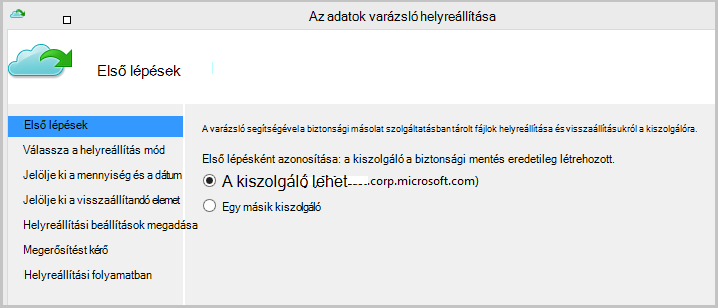
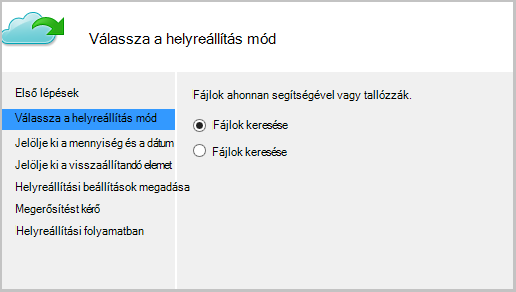
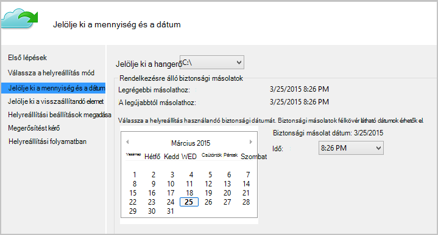
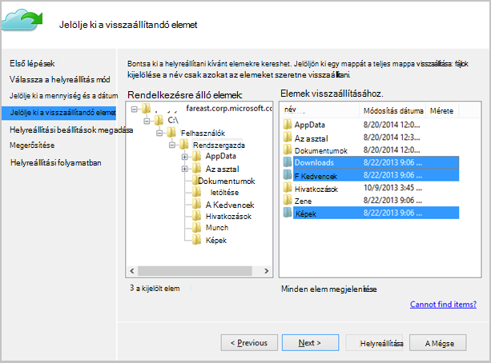
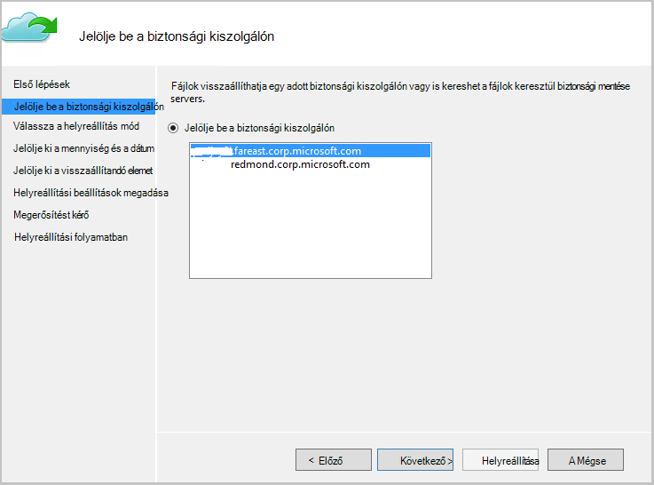
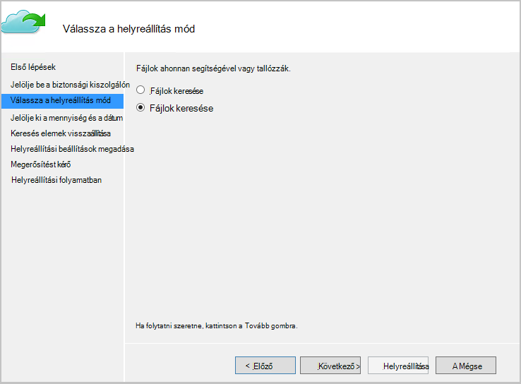
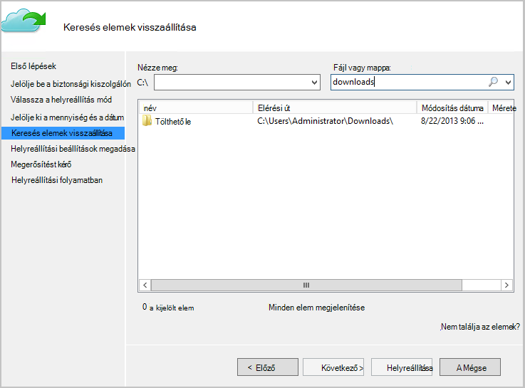
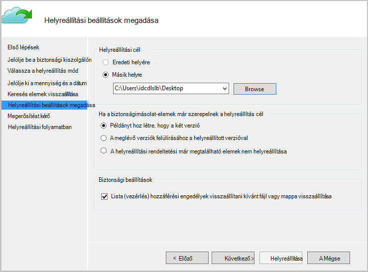
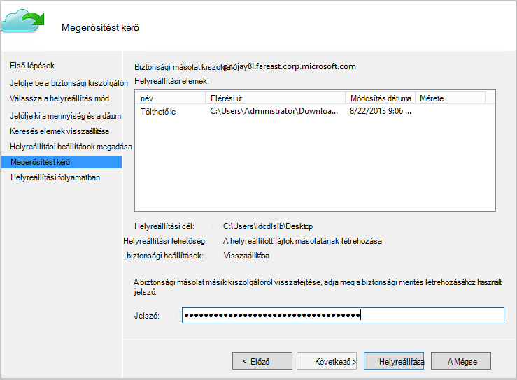

<properties
   pageTitle="Adatok visszaállítása a Windows Server vagy Windows-ügyfél használata a klasszikus telepítési modell Azure |} Microsoft Azure"
   description="Megtudhatja, hogy miként állíthatja helyre a Windows Server vagy Windows-ügyfél."
   services="backup"
   documentationCenter=""
   authors="saurabhsensharma"
   manager="shivamg"
   editor=""/>

<tags
   ms.service="backup"
   ms.workload="storage-backup-recovery"
     ms.tgt_pltfrm="na"
     ms.devlang="na"
     ms.topic="article"
     ms.date="08/02/2016"
     ms.author="trinadhk; jimpark; markgal;"/>

# A Windows server és a Windows az ügyfélgép a klasszikus telepítési modell használata a fájlok visszaállítása

> [AZURE.SELECTOR]
- [Klasszikus portál](backup-azure-restore-windows-server-classic.md)
- [Azure portál](backup-azure-restore-windows-server.md)

Ez a cikk bemutatja a kétféle visszaállítási műveletek elvégzéséhez szükséges lépéseket:

- Állítsa vissza az adatokat, amelyhez a biztonsági másolatok készítésének ugyanarra a számítógépre.
- Adatok visszaállítása bármelyik másik számítógépre.

Mindkét esetben az adatok beolvasása az Azure biztonsági másolat tárolóból elemre.

[AZURE.INCLUDE [learn-about-deployment-models](../../includes/learn-about-deployment-models-classic-include.md)]

## Adatok ugyanarra a számítógépre visszaállítása
Ha véletlenül törölte egy fájlt, és szeretné visszaállítani a ugyanarra a gépre (amely a biztonsági mentés származik), az alábbi lépésekkel segítséget nyújt az adatok helyreállítása.

1. Nyissa meg a **Microsoft Azure biztonsági másolat** beépülő modul.
2. **Adatok helyreállítása** a munkafolyamat indítása gombra.

    

3. Jelölje ki a * *a kiszolgáló (*yourmachinename*) ** beállításra a biztonsági másolatot fájlról ugyanazon a gépen.

    

4. Válassza a **fájlok keresse meg** vagy **fájlok keresése**.

    Ha szeretne egy vagy több fájlt, amelynek az elérési útját ismert visszaállítása, hagyja az alapértelmezett beállítás. Ha kapcsolatban a mappaszerkezet nem biztos, de szeretne megkeresni egy fájlt, válassza ki a **fájlok keresése** lehetőséget. Ez a szakasz céljából azt folytatódik, az alapértelmezett beállítást választja.

    

5. Jelölje ki a hangerőt, amelyből ki szeretne a fájl visszaállítása.

    Visszaállíthatja a bármely pontján időben. **Félkövér** a naptárban megjelenő dátumok azt jelzik, hogy a visszaállítási pont elérhetőségét. Dátum kijelölése után a biztonsági mentés ütemezése (és a biztonsági mentés sikeres) alapján kijelölhet egy időben a **idő** legördülő listáról lefelé.

    

6. Jelölje ki a helyreállítani az elemeket. Több elem kijelölése/mappafájlok visszaállítani kívánt is.

    

7. Az helyreállítási paramétert.

    

  - Ha egy visszaállítása az eredeti helyre (amelyben a fájl/mappa volna felül) vagy egy másik helyre a ugyanarra a gépre lehetőséget.
  - Ha létezik a visszaállítani kívánt fájl vagy mappa a célt, példányt (ugyanannak a fájlnak két verziója) hoz létre, felülírja a fájlokat a célhelyen vagy ugorja át a fájlokat, amelyek léteznek a célhely visszanyerése.
  - Kilépés a, a hozzáférés-vezérlési listák, a fájlokat, amelyek helyreállítása folyamatban lévő visszaállítása az alapértelmezett beállítás nagyon ajánlott.

8. Miután érhetők el ezeket a bemeneti adatok alapján, kattintson a **Tovább**gombra. A helyreállítási munkafolyamat ezen a számítógépen lévő fájlok visszaállítása, meg is kezdi.

## Egy másik gépre helyreállítása
A teljes kiszolgáló nem vesznek el, ha továbbra is visszaállíthatja adatok Azure biztonsági másolatból egy másik számítógépre. A következő lépések bemutatják a munkafolyamatot.  

Az alábbi lépéseket a terminológia tartalmazza:

- *Forrás gépi* – az eredeti számítógépen, amely a biztonsági mentés felvételének és, amelyet jelenleg nem érhető el a.
- *Cél gépi* – a számítógépen, amelyre az adatokat visszaállítani.
- *Minta tárolóra* – a *forrás gépi* és a *cél gépi* regisztrált, amelyhez a biztonsági másolat tárolóból elemre.  

> [AZURE.NOTE] A számítógépen, amely az operációs rendszer egy korábbi verziójában nem lehet visszaállítani a számítógépről készített biztonsági másolatok. Például biztonsági másolatok veszik a Windows 7 gépről, ha, ahonnan a Windows 8 vagy a számítógép felett. A fordítva azonban még nem tartsa igaz.

1. Nyissa meg a **Microsoft Azure biztonsági másolat** beépülő modul *céltábladiagram gépi*.
2. Győződjön meg arról, hogy a *célhely gépi* és a *forrás gépi* regisztrált az azonos biztonsági tárolóból elemre kattintva.
3. **Adatok helyreállítása** a munkafolyamat indítása gombra.

    

4. Jelöljön ki **egy másik kiszolgálót**

    

5. Adja meg a tárolóból elemre hitelesítőadat-fájlt, amely megfelel a *minta tárolóból elemre*kattintva. Tárolóra hitelesítő adatok fájl érvénytelen (vagy lejárt), új tárolóból elemre hitelesítőadat-fájl letöltése a *minta tárolóból elemre* az Azure klasszikus portálon. Miután a tárolóból elemre hitelesítőadat-fájl hiányzik, szemben a tárolóból elemre hitelesítőadat-fájlt a biztonsági másolat tárolóra jelenik meg.

6. Jelölje be a *forrás gépi* megjelenített gépek a listából.

    

7. Válassza a **fájlok keresése** vagy **fájlok keresése** lehetőséget. Ez a szakasz céljából fogjuk használni a **fájlok keresése** lehetőséget.

    

8. Jelölje ki a következő képernyőn a mennyiség és a dátum. Keresse meg a visszaállítani kívánt mappa vagy fájl nevét.

    

9. Jelölje ki azt a helyet, ahol a fájlok szükséges visszaállíthatók.

    

10. Adja meg a titkosítási jelszó *forrás gépi* regisztráció során kapott *minta tárolóból elemre*.

    

11. Miután a bemeneti biztosítjuk, kattintson a **helyreállítása**, amely elindítja a biztonsági másolat fájlokat a cél, feltéve hogy helyreállítása.

## Következő lépések
- [Azure biztonsági – gyakori kérdések](backup-azure-backup-faq.md)
- Látogasson el az [Azure biztonsági fórumán](http://go.microsoft.com/fwlink/p/?LinkId=290933).

## tudj meg többet
- [Azure biztonsági – áttekintés](http://go.microsoft.com/fwlink/p/?LinkId=222425)
- [Biztonsági másolat Azure virtuális gépeken futó](backup-azure-vms-introduction.md)
- [Biztonsági mentése Microsoft munkaterhelésekből](backup-azure-dpm-introduction.md)
