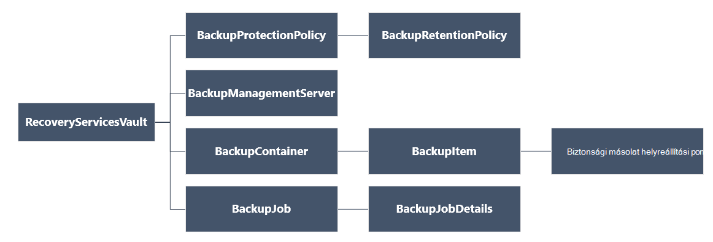

<properties
   pageTitle="Üzembe helyezéséhez és a biztonsági másolatok kezelése a PowerShell használatá erőforrás-kezelő rendszerbe VMs |} Microsoft Azure"
   description="Üzembe helyezéséhez és az erőforrás-kezelő rendszerbe VMs Azure biztonsági másolatok kezelése a PowerShell használatával"
   services="backup"
   documentationCenter=""
   authors="markgalioto"
   manager="cfreeman"
   editor=""/>

<tags
   ms.service="backup"
   ms.devlang="na"
   ms.topic="article"
   ms.tgt_pltfrm="na"
   ms.workload="storage-backup-recovery"
   ms.date="08/03/2016"
   ms.author="markgal; trinadhk"/>

# <a name="deploy-and-manage-backups-for-resource-manager-deployed-vms-using-powershell"></a>Üzembe helyezéséhez és kezeléséhez a biztonsági másolatok az erőforrás-kezelő rendszerbe VMs PowerShell használatával

> [AZURE.SELECTOR]
- [Erőforrás-kezelő](backup-azure-vms-automation.md)
- [Klasszikus](backup-azure-vms-classic-automation.md)

Ez a cikk bemutatja, hogyan Azure PowerShell-parancsmagok használata biztonsági mentése és helyreállítása az Azure virtuális gép (virtuális) a egy helyreállítási szolgáltatások tárolóból elemre. A helyreállítási szolgáltatások tárolóból elemre egy erőforrás-kezelő Azure erőforrás és védelme az adatok és az Azure biztonsági mentése és a webhely-helyreállítás Azure-szolgáltatásokban eszközök segítségével. Azure Service Manager rendszerbe VMs, valamint az erőforrás-kezelő Azure rendszerbe VMs védelme is használhatja a helyreállítási szolgáltatások tárolóból elemre.

>[AZURE.NOTE] Azure van két telepítési modellekkel létrehozásáról és használatáról az erőforrások: [az erőforrás-kezelő és klasszikus](../resource-manager-deployment-model.md). Ez a cikk csak használni az erőforrás-kezelő modell használatával létrehozott VMs.

Ez a cikk végigvezeti a virtuális védelme és visszaállíthatja a adatok helyreállítás ponttól PowerShell használatával.

## <a name="concepts"></a>Fogalmak

Ha nem ismeri a Azure biztonsági szolgáltatás, a szolgáltatás áttekintése a kivétele [Mi az Azure biztonsági másolat?](backup-introduction-to-azure-backup.md) Mielőtt nekikezdene, győződjön meg arról, hogy vonatkozik-e a essentials az Azure biztonsági és az aktuális virtuális biztonsági megoldás korlátozások végzett munkához szükséges előfeltételek kapcsolatban.

PowerShell hatékony használatához, akkor a hierarchia, objektumok és ember megértéséhez szükséges.



Megtekintéséről a AzureRmRecoveryServicesBackup PowerShell parancsmagjai – referencia című témakörben olvashat a [Azure biztonságimásolat - helyreállítás szolgáltatások parancsmagok](https://msdn.microsoft.com/library/mt723320.aspx) az Azure-tárban.
Megtekintéséről a AzureRmRecoveryServicesVault PowerShell parancsmagjai – referencia című témakörben olvashat a [Azure helyreállítási szolgáltatás parancsmagok](https://msdn.microsoft.com/library/mt643905.aspx).


## <a name="setup-and-registration"></a>A telepítő és a regisztrációs

A kezdéshez:

1. [Töltse le a legújabb PowerShell](https://github.com/Azure/azure-powershell/releases) (a szükséges minimális verziója: 1.4.0)

2. Keresse meg a rendelkezésre álló Azure biztonsági másolat PowerShell-parancsmagok írja be az alábbi parancsot:

```
PS C:\> Get-Command *azurermrecoveryservices*

CommandType     Name                                               Version    Source
-----------     ----                                               -------    ------
Cmdlet          Backup-AzureRmRecoveryServicesBackupItem           1.4.0      AzureRM.RecoveryServices.Backup
Cmdlet          Disable-AzureRmRecoveryServicesBackupProtection    1.4.0      AzureRM.RecoveryServices.Backup
Cmdlet          Enable-AzureRmRecoveryServicesBackupProtection     1.4.0      AzureRM.RecoveryServices.Backup
Cmdlet          Get-AzureRmRecoveryServicesBackupContainer         1.4.0      AzureRM.RecoveryServices.Backup
Cmdlet          Get-AzureRmRecoveryServicesBackupItem              1.4.0      AzureRM.RecoveryServices.Backup
Cmdlet          Get-AzureRmRecoveryServicesBackupJob               1.4.0      AzureRM.RecoveryServices.Backup
Cmdlet          Get-AzureRmRecoveryServicesBackupJobDetails        1.4.0      AzureRM.RecoveryServices.Backup
Cmdlet          Get-AzureRmRecoveryServicesBackupManagementServer  1.4.0      AzureRM.RecoveryServices.Backup
Cmdlet          Get-AzureRmRecoveryServicesBackupProperties        1.4.0      AzureRM.RecoveryServices
Cmdlet          Get-AzureRmRecoveryServicesBackupProtectionPolicy  1.4.0      AzureRM.RecoveryServices.Backup
Cmdlet          Get-AzureRMRecoveryServicesBackupRecoveryPoint     1.4.0      AzureRM.RecoveryServices.Backup
Cmdlet          Get-AzureRmRecoveryServicesBackupRetentionPolic... 1.4.0      AzureRM.RecoveryServices.Backup
Cmdlet          Get-AzureRmRecoveryServicesBackupSchedulePolicy... 1.4.0      AzureRM.RecoveryServices.Backup
Cmdlet          Get-AzureRmRecoveryServicesVault                   1.4.0      AzureRM.RecoveryServices
Cmdlet          Get-AzureRmRecoveryServicesVaultSettingsFile       1.4.0      AzureRM.RecoveryServices
Cmdlet          New-AzureRmRecoveryServicesBackupProtectionPolicy  1.4.0      AzureRM.RecoveryServices.Backup
Cmdlet          New-AzureRmRecoveryServicesVault                   1.4.0      AzureRM.RecoveryServices
Cmdlet          Remove-AzureRmRecoveryServicesProtectionPolicy     1.4.0      AzureRM.RecoveryServices.Backup
Cmdlet          Remove-AzureRmRecoveryServicesVault                1.4.0      AzureRM.RecoveryServices
Cmdlet          Restore-AzureRMRecoveryServicesBackupItem          1.4.0      AzureRM.RecoveryServices.Backup
Cmdlet          Set-AzureRmRecoveryServicesBackupProperties        1.4.0      AzureRM.RecoveryServices
Cmdlet          Set-AzureRmRecoveryServicesBackupProtectionPolicy  1.4.0      AzureRM.RecoveryServices.Backup
Cmdlet          Set-AzureRmRecoveryServicesVaultContext            1.4.0      AzureRM.RecoveryServices
Cmdlet          Stop-AzureRmRecoveryServicesBackupJob              1.4.0      AzureRM.RecoveryServices.Backup
Cmdlet          Unregister-AzureRmRecoveryServicesBackupContainer  1.4.0      AzureRM.RecoveryServices.Backup
Cmdlet          Unregister-AzureRmRecoveryServicesBackupManagem... 1.4.0      AzureRM.RecoveryServices.Backup
Cmdlet          Wait-AzureRmRecoveryServicesBackupJob              1.4.0      AzureRM.RecoveryServices.Backup
```


Az alábbi műveleteket a PowerShell automatizálhatók:

- Hozzon létre egy helyreállítási szolgáltatások tárolóból elemre.
- Biztonsági másolat készítése vagy Azure VMs védelme
- Biztonsági mentési feladat elindítása
- Biztonsági mentési feladat figyelése
- Az Azure virtuális visszaállítása

## <a name="create-a-recovery-services-vault"></a>Hozzon létre egy helyreállítási szolgáltatások tárolóból elemre.

Az alábbi lépésekkel átvezetés keresztül létrehozása a helyreállítási szolgáltatások tárolóból elemre. A helyreállítási szolgáltatások tárolóra eltér a biztonsági másolat tárolóból elemre.

1. Azure biztonsági másolat használatakor az első alkalommal a **[Register-AzureRMResourceProvider](https://msdn.microsoft.com/library/mt679020.aspx)** parancsmagot a Azure helyreállítási szolgáltató regisztrálása az előfizetés kell használnia.

    ```
    PS C:\> Register-AzureRmResourceProvider -ProviderNamespace "Microsoft.RecoveryServices"
    ```

2. A helyreállítási szolgáltatások tárolóból elemre egy erőforrás-kezelő erőforrás, így kell egy erőforrás csoporton belül helyezze el. Erőforrás csoport, vagy hozzon létre egy új erőforráscsoport a **[New-AzureRmResourceGroup](https://msdn.microsoft.com/library/mt678985.aspx)** parancsmagot a. Új erőforráscsoport létrehozásakor adja meg az erőforráscsoport helyét és nevét.  

    ```
    PS C:\> New-AzureRmResourceGroup –Name "test-rg" –Location "West US"
    ```

3. A **[New-AzureRmRecoveryServicesVault](https://msdn.microsoft.com/library/mt643910.aspx)** parancsmag használatával hozzon létre az új tárolóból elemre. Ügyeljen arra, hogy adja meg az adott helyen a tárolóból elemre az erőforráscsoport használta.

    ```
    PS C:\> New-AzureRmRecoveryServicesVault -Name "testvault" -ResourceGroupName " test-rg" -Location "West US"
    ```

4. Adja meg a tárhely redundancia használandó; [Helyi meghajtóra felesleges tároló (LRS)](../storage/storage-redundancy.md#locally-redundant-storage) vagy [Geo felesleges tároló (GRS)](../storage/storage-redundancy.md#geo-redundant-storage)is használhatja. A következő példa bemutatja a testVault - BackupStorageRedundancy beállítás értéke GeoRedundant.

    ```
    PS C:\> $vault1 = Get-AzureRmRecoveryServicesVault –Name "testVault"
    PS C:\> Set-AzureRmRecoveryServicesBackupProperties  -Vault $vault1 -BackupStorageRedundancy GeoRedundant
    ```

    > [AZURE.TIP] Sok Azure biztonságimásolat-parancsmagok a helyreállítási szolgáltatások tárolóra objektum egy bemenetként igényelnek Emiatt célszerű a biztonsági másolat helyreállítási szolgáltatások tárolóra objektum változó tárolásához.

## <a name="view-the-vaults-in-a-subscription"></a>A tárolókban előfizetés megtekintése
**[Get-AzureRmRecoveryServicesVault](https://msdn.microsoft.com/library/mt643907.aspx)** használatával az aktuális előfizetés minden tárolókban listájának megtekintése. Ezt a parancsot is használhatja, ellenőrizze, hogy egy új tárolóra jött létre, illetve megtekintheti, milyen tárolókban elérhetők az előfizetés.

Futtassa a Get-AzureRmRecoveryServicesVault, parancsot, és az előfizetés minden tárolókban jelennek meg.

```
PS C:\> Get-AzureRmRecoveryServicesVault
Name              : Contoso-vault
ID                : /subscriptions/1234
Type              : Microsoft.RecoveryServices/vaults
Location          : WestUS
ResourceGroupName : Contoso-docs-rg
SubscriptionId    : 1234-567f-8910-abc
Properties        : Microsoft.Azure.Commands.RecoveryServices.ARSVaultProperties
```


## <a name="backup-azure-vms"></a>Biztonsági másolat Azure VMs
Most, hogy a létrehozott egy helyreállítási szolgáltatások tárolóból elemre, használhatja a virtuális gép védelme. Azonban előtt a védelmet alkalmazhat, Önnek kell beállítania a tárolóból elemre környezetben, és a védelem házirend ellenőrizni kívánt. Helyi tárolóból elemre a védett adatok típusát a tárolóra határozza meg. A védelem házirend a biztonsági mentési feladat futtatásakor, és mennyi ideig tárolja az egyes biztonsági mentés pillanatképként az ütemtervet.

Egy virtuális a védelem engedélyezése, előtt be kell állítani a tárolóból elemre környezetben. A környezet minden későbbi parancsmagok érvényes.

```
PS C:\> Get-AzureRmRecoveryServicesVault -Name testvault | Set-AzureRmRecoveryServicesVaultContext
```

### <a name="create-a-protection-policy"></a>Védelem házirend létrehozása

Amikor létrehoz egy új tárolóból elemre, az alapértelmezett házirend megtalálható. Ezzel a házirenddel elindítja a biztonsági mentési feladat naponta egy adott időben. Az alapértelmezett házirend használati a biztonsági mentés pillanatképként 30 napig tárolja. Az alapértelmezett házirend segítségével gyorsan védelme a virtuális és szerkesztése a házirendekhez, ha később más részleteket.

A rendelkezésre álló házirendek listájának megtekintése a tárolóból elemre a **[Get-AzureRmRecoveryServicesBackupProtectionPolicy](https://msdn.microsoft.com/library/mt723300.aspx)** segítségével:

```
PS C:\> Get-AzureRmRecoveryServicesBackupProtectionPolicy -WorkloadType AzureVM
Name                 WorkloadType       BackupManagementType BackupTime                DaysOfWeek
----                 ------------       -------------------- ----------                ----------
DefaultPolicy        AzureVM            AzureVM              4/14/2016 5:00:00 PM
```

> [AZURE.NOTE] Az időzóna PowerShell BackupTime mezőjének UTC. Jó helyen jár Ha a biztonsági mentéskor látható az Azure-portálon, az idő módosul a helyi időzóna.

A biztonsági másolat védelem házirend társítva legalább egy adatmegőrzési szabályt.  Adatmegőrzési szabály határozza meg, hogy mennyi ideig tartott a helyreállítási pont legyen Azure mentéssel. **Get-AzureRmRecoveryServicesBackupRetentionPolicyObject** használja az alapértelmezett adatmegőrzési megtekintéséhez.  Hasonlóképpen **Get-AzureRmRecoveryServicesBackupSchedulePolicyObject** is használhatja az alapértelmezett ütemterv házirend juthat. Az ütemterv és az adatmegőrzési házirend-objektumok a **New-AzureRmRecoveryServicesBackupProtectionPolicy** parancsmag bemeneti adatokat használják.

A biztonsági védelem házirend azt határozza meg, mikor és hogyan gyakran a biztonsági mentés egy elem befejeződött. A New-AzureRmRecoveryServicesBackupProtectionPolicy parancsmag egy PowerShell-objektum biztonsági házirendek adatait tároló hoz létre. A biztonsági másolat házirend-az Enable-AzureRmRecoveryServicesBackupProtection parancsmag bemeneti adataiként szolgál.

```
PS C:\> $schPol = Get-AzureRmRecoveryServicesBackupSchedulePolicyObject -WorkloadType "AzureVM"
PS C:\>  $retPol = Get-AzureRmRecoveryServicesBackupRetentionPolicyObject -WorkloadType "AzureVM"
PS C:\>  New-AzureRmRecoveryServicesBackupProtectionPolicy -Name "NewPolicy" -WorkloadType AzureVM -RetentionPolicy $retPol -SchedulePolicy $schPol
Name                 WorkloadType       BackupManagementType BackupTime                DaysOfWeek
----                 ------------       -------------------- ----------                ----------
NewPolicy           AzureVM            AzureVM              4/24/2016 1:30:00 AM
```

### <a name="enable-protection"></a>Védelem bekapcsolása

Védelem bekapcsolása magában foglalja a két objektumok – az elem és a házirend. Mindkét objektum szükséges ahhoz, hogy a védelem a tárolóból elemre. A házirend van társítva a tárolóból elemre, ha a biztonsági másolat munkafolyamat induljanak a házirend ütemezés megadott időpontjában.

Ahhoz, hogy a védelmet a titkosítatlan ARM VMs

```
PS C:\> $pol=Get-AzureRmRecoveryServicesBackupProtectionPolicy -Name "NewPolicy"
PS C:\> Enable-AzureRmRecoveryServicesBackupProtection -Policy $pol -Name "V2VM" -ResourceGroupName "RGName1"
```

Ha engedélyezni szeretné a védelmet a titkosított VMs [titkosítva BEK és KEK], kell engedélyezhetik Azure biztonsági másolat szolgáltatás kulcsok és titkos kulcsok olvasható a fő tárolóból elemre. 

```
PS C:\> Set-AzureRmKeyVaultAccessPolicy -VaultName 'KeyVaultName' -ResourceGroupName 'RGNameOfKeyVault' -PermissionsToKeys backup,get,list -PermissionsToSecrets get,list -ServicePrincipalName 262044b1-e2ce-469f-a196-69ab7ada62d3
PS C:\> $pol=Get-AzureRmRecoveryServicesBackupProtectionPolicy -Name "NewPolicy"
PS C:\> Enable-AzureRmRecoveryServicesBackupProtection -Policy $pol -Name "V2VM" -ResourceGroupName "RGName1"
```

ASM alapuló VMs

```
PS C:\>  $pol=Get-AzureRmRecoveryServicesBackupProtectionPolicy -Name "NewPolicy"
PS C:\>  Enable-AzureRmRecoveryServicesBackupProtection -Policy $pol -Name "V1VM" -ServiceName "ServiceName1"
```

### <a name="modify-a-protection-policy"></a>A védelem házirend módosítása

A házirend módosítása, módosítsa a BackupSchedulePolicyObject vagy BackupRetentionPolicy objektumot, és módosítsa a házirendet, használja a Set-AzureRmRecoveryServicesBackupProtectionPolicy

Az alábbi példa az adatmegőrzési száma 365 változik.

```
PS C:\> $retPol = Get-AzureRmRecoveryServicesBackupRetentionPolicyObject -WorkloadType "AzureVM"
PS C:\> $retPol.DailySchedule.DurationCountInDays = 365
PS C:\> $pol= Get-AzureRmRecoveryServicesBackupProtectionPolicy -Name NewPolicy
PS C:\> Set-AzureRmRecoveryServicesBackupProtectionPolicy -Policy $pol  -RetentionPolicy  $RetPol
```

## <a name="run-an-initial-backup"></a>Az első biztonsági futtatása

A biztonsági mentés ütemezése készítsen biztonsági másolatot a teljes elindítja a kezdeti vissza az elem tagjának. A későbbi biztonsági ups, a biztonsági másolat egy növekményes másolatot. Ha történhet meg, bizonyos vagy akár közvetlenül a kezdeti biztonsági mentés kényszerítése majd használja a **[Biztonságimásolat-AzureRmRecoveryServicesBackupItem](https://msdn.microsoft.com/library/mt723312.aspx)** parancsmagot:

```
PS C:\> $namedContainer = Get-AzureRmRecoveryServicesBackupContainer -ContainerType "AzureVM" -Status "Registered" -Name "V2VM"
PS C:\> $item = Get-AzureRmRecoveryServicesBackupItem -Container $namedContainer -WorkloadType "AzureVM"
PS C:\> $job = Backup-AzureRmRecoveryServicesBackupItem -Item $item
WorkloadName     Operation            Status               StartTime                 EndTime                   JobID
------------     ---------            ------               ---------                 -------                   ----------
V2VM              Backup               InProgress            4/23/2016 5:00:30 PM                       cf4b3ef5-2fac-4c8e-a215-d2eba4124f27
```

> [AZURE. Megjegyzés: A kezdő időpont és a Befejezés időpontja mezője PowerShell időzóna a UTC. Jó helyen jár Ha az időt az Azure-portálon látható, az idő módosul a helyi időzóna.

## <a name="monitoring-a-backup-job"></a>Biztonsági mentési feladat figyelése

A legtöbb hosszan futó műveleteket Azure biztonsági másolat is modellezni feladatként. Ez egyszerűen nyomon követéséhez anélkül, hogy az Azure portál megtartása megnyitott mindig.

Egy folyamatban lévő feladat legújabb állapotát, használja a Get-AzureRmRecoveryservicesBackupJob parancsmag.

```
PS C:\ > $joblist = Get-AzureRmRecoveryservicesBackupJob –Status InProgress
PS C:\ > $joblist[0]
WorkloadName     Operation            Status               StartTime                 EndTime                   JobID
------------     ---------            ------               ---------                 -------                   ----------
V2VM             Backup               InProgress            4/23/2016 5:00:30 PM           cf4b3ef5-2fac-4c8e-a215-d2eba4124f27
```

Ezek a feladatok - amely felesleges további kód - feltételei lekérdezési helyett használja a **[Várakozás-AzureRmRecoveryServicesBackupJob](https://msdn.microsoft.com/library/mt723321.aspx)** parancsmag. Ezzel a parancsmaggal a végrehajtás felfüggeszti a mindaddig, amíg a feladat befejezése után, vagy az adott időkorlát eléri.

```
PS C:\> Wait-AzureRmRecoveryServicesBackupJob -Job $joblist[0] -Timeout 43200
```

## <a name="restore-an-azure-vm"></a>Az Azure virtuális visszaállítása

Van egy fő visszaállítása egy virtuális az Azure portálon és visszaállítása a PowerShell használatá virtuális közötti különbséget. A PowerShell a visszaállítási művelet befejeződött a lemez és a konfigurációs adatok a helyreállítási helyétől létrehozása után. A visszaállítás nem hoz létre egy virtuális számítógépre. A megjelenő utasításokat a virtuális gép lemezről készítéséhez állnak rendelkezésre. Azonban egy virtuális teljesen visszaállításához kell haladjon végig az alábbi eljárások valamelyikét:

- Jelölje ki a virtuális
- Válassza a helyreállítás pont
- A lemez visszaállítása
- A virtuális létrehozása tárolt lemezről

Az alábbi ábra a RecoveryServicesVault le a BackupRecoveryPoint a jeleníti meg az objektum hierarchiát.


Adatok biztonsági másolatának visszaállításához határozza meg a mentett elem és a helyreállítási pont a pont és az idő adatokat tartalmazó. A **[Visszaállítás-AzureRmRecoveryServicesBackupItem](https://msdn.microsoft.com/library/mt723316.aspx)** parancsmag használatával visszaállíthatja az adatokat az ügyfél fiókjának a a tárolóból elemre.

### <a name="select-the-vm"></a>Jelölje ki a virtuális

Úgy juthat az PowerShell-objektumra, amely azonosítja a jobb oldali biztonsági mentés elemet, indítsa el a tároló a tárolóból elemre, és a néznek ki az objektumot hierarchia lefelé. A tároló, amely a virtuális **[Get-AzureRmRecoveryServicesBackupContainer](https://msdn.microsoft.com/library/mt723319.aspx)** parancsmag kijelöléséhez és pipe, amely a **[Get-AzureRmRecoveryServicesBackupItem](https://msdn.microsoft.com/library/mt723305.aspx)** parancsmag szeretne.

```
PS C:\> $namedContainer = Get-AzureRmRecoveryServicesBackupContainer  -ContainerType AzureVM –Status Registered -Name 'V2VM'
PS C:\> $backupitem = Get-AzureRmRecoveryServicesBackupItem –Container $namedContainer  –WorkloadType "AzureVM"
```

### <a name="choose-a-recovery-point"></a>Válassza a helyreállítás pont

A **[Get-AzureRmRecoveryServicesBackupRecoveryPoint](https://msdn.microsoft.com/library/mt723308.aspx)** parancsmag használatával helyreállítási adatpontjainak a biztonsági mentés elem listában. Válassza a helyreállítás pont visszaállításához. Ha biztos abban, hogy melyik helyreállítási pontot, és használja, tanácsos válassza a legutóbbi RecoveryPointType = AppConsistent pont a listában.

A következő parancsfájl a, **$rp**, változó tömb helyreállítási pontok biztonsági elemhez. A tömb fordított sorrendben rendezett idő a legújabb helyreállítási ponttal a tárgymutató 0. Szabványos PowerShell tömb indexelés használatával válassza ki a helyreállítási pont. Például: [0] $rp választja ki a legújabb helyreállítási pont.

```
PS C:\> $startDate = (Get-Date).AddDays(-7)
PS C:\> $endDate = Get-Date
PS C:\> $rp = Get-AzureRmRecoveryServicesBackupRecoveryPoint -Item $backupitem -StartDate $startdate.ToUniversalTime() -EndDate $enddate.ToUniversalTime()
PS C:\> $rp[0]
RecoveryPointAdditionalInfo :
SourceVMStorageType         : NormalStorage
Name                        : 15260861925810
ItemName                    : VM;iaasvmcontainer;RGName1;V2VM
RecoveryPointId             : /subscriptions/XX/resourceGroups/ RGName1/providers/Microsoft.RecoveryServices/vaults/testvault/backupFabrics/Azure/protectionContainers/IaasVMContainer;iaasvmcontainer;RGName1;V2VM/protectedItems/VM;iaasvmcontainer; RGName1;V2VM
                              /recoveryPoints/15260861925810
RecoveryPointType           : AppConsistent
RecoveryPointTime           : 4/23/2016 5:02:04 PM
WorkloadType                : AzureVM
ContainerName               : IaasVMContainer;iaasvmcontainer; RGName1;V2VM
ContainerType               : AzureVM
BackupManagementType        : AzureVM
```


### <a name="restore-the-disks"></a>A lemez visszaállítása

A **[Visszaállítás-AzureRmRecoveryServicesBackupItem](https://msdn.microsoft.com/library/mt723316.aspx)** parancsmag használatával adatot és konfigurációt a biztonsági mentés elem visszaállítása a helyreállítási ponthoz. Miután azonosította, a helyreállítási pont használhassa értékként **- RecoveryPoint** paraméter. Az előző példában kódban **$rp [0]** választott a helyreállítási helyként használni. Az alábbi példa kód **$rp [0]** lemez visszaállításához használandó helyreállítási pontként van megadva.

A lemez és a konfigurációs adatok visszaállítása

```
PS C:\> $restorejob = Restore-AzureRmRecoveryServicesBackupItem -RecoveryPoint $rp[0] -StorageAccountName DestAccount -StorageAccountResourceGroupName DestRG
PS C:\> $restorejob
WorkloadName     Operation          Status               StartTime                 EndTime            JobID
------------     ---------          ------               ---------                 -------          ----------
V2VM              Restore           InProgress           4/23/2016 5:00:30 PM                        cf4b3ef5-2fac-4c8e-a215-d2eba4124f27
```

A visszaállítási feladat befejeződése segítségével a **[Get-AzureRmRecoveryServicesBackupJobDetails](https://msdn.microsoft.com/library/mt723310.aspx)** parancsmagot a visszaállítási művelet részleteit. A JobDetails tulajdonságnak a virtuális újraépítéséhez szükséges adatokat.

```
PS C:\> $restorejob = Get-AzureRmRecoveryServicesBackupJob -Job $restorejob
PS C:\> $details = Get-AzureRmRecoveryServicesBackupJobDetails
```

Miután a lemez visszaállításához nyissa meg a információt a következő szakaszban a a virtuális létrehozása.

### <a name="create-a-vm-from-restored-disks"></a>Hozzon létre egy virtuális visszaállított lemezről

A lemez visszaállítását követően az alábbi lépésekkel hozhat létre, és állítsa be a virtuális gép lemezről.

1. A feladat részletei visszaállított lemez tulajdonságainak lekérdezésére.

    ```
    PS C:\> $properties = $details.properties
    PS C:\> $storageAccountName = $properties["Target Storage Account Name"]
    PS C:\> $containerName = $properties["Config Blob Container Name"]
    PS C:\> $blobName = $properties["Config Blob Name"]
    ```

2. Adja meg az Azure tároló környezetben, és a JSON konfigurációs fájl visszaállítása.

    ```
    PS C:\> Set-AzureRmCurrentStorageAccount -Name $storageaccountname -ResourceGroupName testvault
    PS C:\> $destination_path = "C:\vmconfig.json"
    PS C:\> Get-AzureStorageBlobContent -Container $containerName -Blob $blobName -Destination $destination_path
    PS C:\> $obj = ((Get-Content -Path $destination_path -Encoding Unicode)).TrimEnd([char]0x00) | ConvertFrom-Json
    ```

3. A JSON konfigurációs fájl segítségével virtuális konfigurációját.

    ```
  PS C:\> $vm = New-AzureRmVMConfig -VMSize $obj.HardwareProfile.VirtualMachineSize -VMName "testrestore"
    ```

4. Az operációs rendszer lemez és adatok lemezt csatolni.

      A nem titkosított VMs

       ```
       PS C:\> Set-AzureRmVMOSDisk -VM $vm -Name "osdisk" -VhdUri $obj.StorageProfile.OSDisk.VirtualHardDisk.Uri -CreateOption “Attach”
       PS C:\> $vm.StorageProfile.OsDisk.OsType = $obj.StorageProfile.OSDisk.OperatingSystemType foreach($dd in $obj.StorageProfile.DataDisks)
       {
       $vm = Add-AzureRmVMDataDisk -VM $vm -Name "datadisk1" -VhdUri $dd.VirtualHardDisk.Uri -DiskSizeInGB 127 -Lun $dd.Lun -CreateOption Attach
       }
       ```
      Titkosított VMs frissítenie kell kitöltését [kulcs tárolóra](https://msdn.microsoft.com/library/dn868052.aspx) előtt lemezt csatolhat.
      
      ```
      PS C:\> Set-AzureRmVMOSDisk -VM $vm -Name "osdisk" -VhdUri $obj.StorageProfile.OSDisk.VirtualHardDisk.Uri -DiskEncryptionKeyUrl "https://ContosoKeyVault.vault.azure.net:443/secrets/ContosoSecret007" -DiskEncryptionKeyVaultId "/subscriptions/abcdedf007-4xyz-1a2b-0000-12a2b345675c/resourceGroups/ContosoRG108/providers/Microsoft.KeyVault/vaults/ContosoKeyVault" -KeyEncryptionKeyUrl "https://ContosoKeyVault.vault.azure.net:443/keys/ContosoKey007" -KeyEncryptionKeyVaultId "subscriptions/abcdedf007-4xyz-1a2b-0000-12a2b345675c/resourceGroups/ContosoRG108/providers/Microsoft.KeyVault/vaults/ContosoKeyVault" -CreateOption "Attach" -Windows
      PS C:\> $vm.StorageProfile.OsDisk.OsType = $obj.StorageProfile.OSDisk.OperatingSystemType foreach($dd in $obj.StorageProfile.DataDisks)
       {
       $vm = Add-AzureRmVMDataDisk -VM $vm -Name "datadisk1" -VhdUri $dd.VirtualHardDisk.Uri -DiskSizeInGB 127 -Lun $dd.Lun -CreateOption Attach
       }
      ```
      
5. A hálózat beállításainak megadása.

    ```
    PS C:\> $nicName="p1234"
    PS C:\> $pip = New-AzureRmPublicIpAddress -Name $nicName -ResourceGroupName "test" -Location "WestUS" -AllocationMethod Dynamic
    PS C:\> $vnet = Get-AzureRmVirtualNetwork -Name "testvNET" -ResourceGroupName "test"
    PS C:\> $nic = New-AzureRmNetworkInterface -Name $nicName -ResourceGroupName "test" -Location "WestUS" -SubnetId $vnet.Subnets[$subnetindex].Id -PublicIpAddressId $pip.Id
    PS C:\> $vm=Add-AzureRmVMNetworkInterface -VM $vm -Id $nic.Id
    ```

6. A virtuális gép létrehozása.

    ```
    PS C:\> $vm.StorageProfile.OsDisk.OsType = $obj.StorageProfile.OSDisk.OperatingSystemType
    PS C:\> New-AzureRmVM -ResourceGroupName "test" -Location "WestUS" -VM $vm
    ```

## <a name="next-steps"></a>Következő lépések

Ha jobban szereti a PowerShell használatával való részvétel, amikor a Azure, olvassa el a védelme a Windows Server, a [központi telepítés és a Windows Server biztonsági másolat kezelése](./backup-client-automation.md)a PowerShell cikk. Projektvezetési DPM biztonsági másolatokat, [Deploy és DPM a biztonsági másolat kezelése](./backup-dpm-automation.md)a PowerShell cikk is van. Ezek a cikkek egyikét az erőforrás-kezelő telepítések, valamint a hagyományos telepítések verziójával rendelkezik.  
