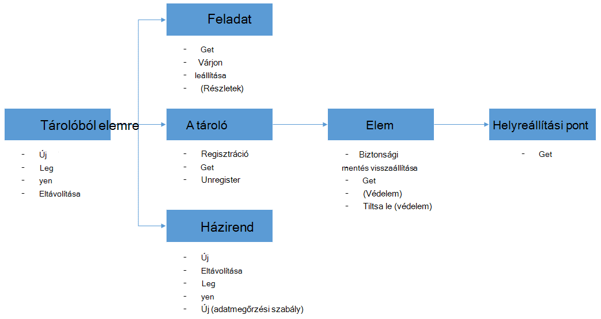

<properties
    pageTitle="Üzembe helyezéséhez és biztonsági másolat kezelése a PowerShell használatá Azure VMs |} Microsoft Azure"
    description="Megtudhatja, hogy miként telepítheti és kezelése a PowerShell használatá Azure biztonsági mentése"
    services="backup"
    documentationCenter=""
    authors="markgalioto"
    manager="cfreeman"
    editor=""/>

<tags
    ms.service="backup"
    ms.workload="storage-backup-recovery"
    ms.tgt_pltfrm="na"
    ms.devlang="na"
    ms.topic="article"
    ms.date="08/08/2016"
    ms.author="markgal;trinadhk;jimpark" />


# <a name="deploy-and-manage-backup-for-azure-vms-using-powershell"></a>Üzembe helyezéséhez és kezeléséhez biztonsági mentése az Azure VMs PowerShell használatával

> [AZURE.SELECTOR]
- [Erőforrás-kezelő](backup-azure-vms-automation.md)
- [Klasszikus](backup-azure-vms-classic-automation.md)

Ez a cikk bemutatja, hogyan Azure PowerShell használata az biztonsági mentése és helyreállítása Azure VMs. Azure van két különböző telepítési modellekkel létrehozásáról és használatáról az erőforrások: erőforrások Manager és a klasszikus. Ez a cikk bemutatja, hogy a klasszikus telepítési modell használata. Azt javasoljuk, hogy a legtöbb új telepítések az erőforrás-kezelő modell használata.

## <a name="concepts"></a>Fogalmak


Ez a cikk a biztonsági mentésben virtuális gépeken futó használt PowerShell-parancsmagok információkat tartalmaz. Azure VMs védelme bevezető információkért olvassa el [a virtuális biztonsági infrastruktúra Azure-ban megtervezése](backup-azure-vms-introduction.md).

> [AZURE.NOTE] Mielőtt nekikezdene, olvassa el a szükséges Azure biztonsági és az aktuális virtuális biztonsági megoldás [korlátozások](backup-azure-vms-prepare.md#limitations) [Előfeltételek](backup-azure-vms-prepare.md) .

A PowerShell hatékony használatához a hierarchia, objektumok és ember megértéséhez némi igénybe.



A két legfontosabb flow egy virtuális védelem bekapcsolása, és helyreállítási ponttól adatok visszaállítása. Ez a cikk elsősorban segít ahhoz, hogy ezeket az alábbi két forgatókönyvet PowerShell-parancsmagok használata a adept válnak.


## <a name="setup-and-registration"></a>A telepítő és a regisztrációs
A kezdéshez:

1. [Töltse le a legújabb PowerShell](https://github.com/Azure/azure-powershell/releases) (szükséges minimális verziója: 1.0.0)

2. Keresse meg a rendelkezésre álló Azure biztonsági másolat PowerShell-parancsmagok írja be az alábbi parancsot:

```
PS C:\> Get-Command *azurermbackup*

CommandType     Name                                               Version    Source
-----------     ----                                               -------    ------
Cmdlet          Backup-AzureRmBackupItem                           1.0.1      AzureRM.Backup
Cmdlet          Disable-AzureRmBackupProtection                    1.0.1      AzureRM.Backup
Cmdlet          Enable-AzureRmBackupContainerReregistration        1.0.1      AzureRM.Backup
Cmdlet          Enable-AzureRmBackupProtection                     1.0.1      AzureRM.Backup
Cmdlet          Get-AzureRmBackupContainer                         1.0.1      AzureRM.Backup
Cmdlet          Get-AzureRmBackupItem                              1.0.1      AzureRM.Backup
Cmdlet          Get-AzureRmBackupJob                               1.0.1      AzureRM.Backup
Cmdlet          Get-AzureRmBackupJobDetails                        1.0.1      AzureRM.Backup
Cmdlet          Get-AzureRmBackupProtectionPolicy                  1.0.1      AzureRM.Backup
Cmdlet          Get-AzureRmBackupRecoveryPoint                     1.0.1      AzureRM.Backup
Cmdlet          Get-AzureRmBackupVault                             1.0.1      AzureRM.Backup
Cmdlet          Get-AzureRmBackupVaultCredentials                  1.0.1      AzureRM.Backup
Cmdlet          New-AzureRmBackupProtectionPolicy                  1.0.1      AzureRM.Backup
Cmdlet          New-AzureRmBackupRetentionPolicyObject             1.0.1      AzureRM.Backup
Cmdlet          New-AzureRmBackupVault                             1.0.1      AzureRM.Backup
Cmdlet          Register-AzureRmBackupContainer                    1.0.1      AzureRM.Backup
Cmdlet          Remove-AzureRmBackupProtectionPolicy               1.0.1      AzureRM.Backup
Cmdlet          Remove-AzureRmBackupVault                          1.0.1      AzureRM.Backup
Cmdlet          Restore-AzureRmBackupItem                          1.0.1      AzureRM.Backup
Cmdlet          Set-AzureRmBackupProtectionPolicy                  1.0.1      AzureRM.Backup
Cmdlet          Set-AzureRmBackupVault                             1.0.1      AzureRM.Backup
Cmdlet          Stop-AzureRmBackupJob                              1.0.1      AzureRM.Backup
Cmdlet          Unregister-AzureRmBackupContainer                  1.0.1      AzureRM.Backup
Cmdlet          Wait-AzureRmBackupJob                              1.0.1      AzureRM.Backup
```

A következő beállítási és nyilvántartási feladatok automatizálhatók a PowerShell:

- Hozzon létre egy biztonsági tárolóból elemre
- A VMs regisztrálása az Azure biztonsági másolat szolgáltatással

### <a name="create-a-backup-vault"></a>Hozzon létre egy biztonsági tárolóból elemre

> [AZURE.WARNING] Az Azure biztonsági másolat használata első alkalommal ügyfelek esetében regisztrálnia kell az Azure biztonsági másolat szolgáltató használható az előfizetéséhez. Ezt megteheti a következő parancs futtatásával: külső.FÜGGV-AzureRmResourceProvider - ProviderNamespace "Microsoft.Backup"

Létrehozhat egy új biztonsági tárolóból elemre, a **New-AzureRmBackupVault** parancsmaggal. A biztonsági másolat tárolóból elemre egy ARM erőforrás, így kell egy erőforrás csoporton belül helyezze el. Az Azure PowerShell jogú konzolban futtassa az alábbi parancsokat:

```
PS C:\> New-AzureRmResourceGroup –Name “test-rg” –Location “West US”
PS C:\> $backupvault = New-AzureRmBackupVault –ResourceGroupName “test-rg” –Name “test-vault” –Region “West US” –Storage GeoRedundant
```

Az adott előfizetés a **Get-AzureRmBackupVault** parancsmaggal elérheti a biztonsági másolat tárolókban listáját.

> [AZURE.NOTE] Célszerű a biztonságimásolat-tárolóra objektum tárolására változó be. A tárolóból elemre objektum sok Azure biztonságimásolat-parancsmagok az meg van szükség.


### <a name="registering-the-vms"></a>A VMs rögzítése
Az első lépés a biztonsági másolat konfigurálása az Azure biztonsági felé, hogy a gép vagy a virtuális regisztrálása az Azure biztonsági tárolóból elemre. A **Külső.FÜGGV-AzureRmBackupContainer** parancsmag megnyitja a bemeneti adatokat egy Azure IaaS virtuális gép és regisztrálja, a megadott tárolóból elemre. A külső.FÜGGV művelet az Azure virtuális gép társít a biztonsági másolat tárolóból elemre, és nyomon követi a virtuális a biztonsági másolat életciklus.

A virtuális regisztrálása az Azure biztonsági másolat szolgáltatással létrehoz egy felső szintű objektum. Tároló általában tartalmazza több elem biztonsági másolatot, de ha a VMs-e a tároló csak egy elem biztonsági mentése.

```
PS C:\> $registerjob = Register-AzureRmBackupContainer -Vault $backupvault -Name "testvm" -ServiceName "testvm"
```

## <a name="backup-azure-vms"></a>Biztonsági másolat Azure VMs

### <a name="create-a-protection-policy"></a>Védelem házirend létrehozása
Még nem kötelező, hozzon létre egy új védelem házirendet biztonsági másolatot a VMs indításához. A "alapértelmezett házirend" ahhoz, hogy gyorsan védelem használt, és kattintson a jobb oldali később szerkesztett megtalálható a tárolóból elemre. A rendelkezésre álló a tárolóból elemre a házirendek listájának úgy is megnyithatja, hogy a **Get-AzureRmBackupProtectionPolicy** parancsmaggal:

```
PS C:\> Get-AzureRmBackupProtectionPolicy -Vault $backupvault

Name                      Type               ScheduleType       BackupTime
----                      ----               ------------       ----------
DefaultPolicy             AzureVM            Daily              26-Aug-15 12:30:00 AM
```

> [AZURE.NOTE] Az időzóna PowerShell BackupTime mezőjének UTC. Azonban a biztonsági mentéskor látható az Azure-portálon, amikor az időzóna van igazítva, a helyi rendszer idejének a világidőtől való eltérését együtt.

A biztonsági másolat házirend társítva legalább egy adatmegőrzési szabályt. Az adatmegőrzési határozza meg, hogy mennyi ideig tartott a helyreállítási pont legyen Azure mentéssel. A **New-AzureRmBackupRetentionPolicy** parancsmag adatmegőrzési házirend adatai élvező PowerShell-objektumok hoz létre. Az adatmegőrzési házirend-objektumok a *New-AzureRmBackupProtectionPolicy* parancsmag, vagy közvetlenül az *Enable-AzureRmBackupProtection* parancsmagot a bemenetben használják.

A biztonsági másolat házirend azt határozza meg, mikor és hogyan gyakran a biztonsági mentés egy elem befejeződött. A **New-AzureRmBackupProtectionPolicy** parancsmag egy PowerShell-objektum biztonsági házirendek adatait tároló hoz létre. A biztonsági másolat házirend-az *Enable-AzureRmBackupProtection* parancsmag bemeneti adataiként szolgál.

```
PS C:\> $Daily = New-AzureRmBackupRetentionPolicyObject -DailyRetention -Retention 30
PS C:\> $newpolicy = New-AzureRmBackupProtectionPolicy -Name DailyBackup01 -Type AzureVM -Daily -BackupTime ([datetime]"3:30 PM") -RetentionPolicy $Daily -Vault $backupvault

Name                      Type               ScheduleType       BackupTime
----                      ----               ------------       ----------
DailyBackup01             AzureVM            Daily              01-Sep-15 3:30:00 PM
```

### <a name="enable-protection"></a>Védelem bekapcsolása
Védelem bekapcsolása magában foglalja a két objektumok – az elem és a házirendet, és a mindkettő szükséges tagja az azonos tárolóból elemre. A házirend társítva az elemet, ha a biztonsági másolat munkafolyamat fog indítása a definiált ütemezés.

```
PS C:\> Get-AzureRmBackupContainer -Type AzureVM -Status Registered -Vault $backupvault | Get-AzureRmBackupItem | Enable-AzureRmBackupProtection -Policy $newpolicy
```

### <a name="initial-backup"></a>Kezdeti biztonsági mentése
Az ütemezés, hajtsa végre a teljes körű első példányt az elem és a növekményes másolatot a későbbi biztonsági másolatok fog gondoskodik. Jó helyen jár Ha történhet meg, bizonyos vagy akár közvetlenül a kezdeti biztonsági mentés kényszerítése szeretné majd használja a **Biztonságimásolat-AzureRmBackupItem** parancsmagot:

```
PS C:\> $container = Get-AzureRmBackupContainer -Vault $backupvault -Type AzureVM -Name "testvm"
PS C:\> $backupjob = Get-AzureRmBackupItem -Container $container | Backup-AzureRmBackupItem
PS C:\> $backupjob

WorkloadName    Operation       Status          StartTime              EndTime
------------    ---------       ------          ---------              -------
testvm          Backup          InProgress      01-Sep-15 12:24:01 PM  01-Jan-01 12:00:00 AM
```

> [AZURE.NOTE] Az időzóna, a kezdő időpont és a Befejezés időpontja mezők PowerShell látható UTC. Azonban a hasonló adatokat az Azure-portálon látható, ha az időzóna igazodik a rendszeróra.

### <a name="monitoring-a-backup-job"></a>Biztonsági mentési feladat figyelése
A legtöbb hosszan futó műveleteket Azure biztonsági másolat is modellezni feladatként. Ez egyszerűen nyomon követéséhez anélkül, hogy az Azure portál megtartása megnyitott mindig.

Egy folyamatban lévő feladat legújabb állapotát, használja a **Get-AzureRmBackupJob** parancsmag.

```
PS C:\> $joblist = Get-AzureRmBackupJob -Vault $backupvault -Status InProgress
PS C:\> $joblist[0]

WorkloadName    Operation       Status          StartTime              EndTime
------------    ---------       ------          ---------              -------
testvm          Backup          InProgress      01-Sep-15 12:24:01 PM  01-Jan-01 12:00:00 AM
```

Ezek a feladatok – Ez a szükségtelen, további kód - feltételei lekérdezési helyett az egyszerűbb a **Várakozási-AzureRmBackupJob** parancsmag. Egy parancsprogramot használva parancsmag mindaddig, amíg a feladat befejezése után, vagy az adott időkorlát eléri a végrehajtás mutasson.

```
PS C:\> Wait-AzureRmBackupJob -Job $joblist[0] -Timeout 43200
```


## <a name="restore-an-azure-vm"></a>Az Azure virtuális visszaállítása

Adatok biztonsági másolatának visszaállításához Önnek kell azonosítania a mentett elemet, és a helyreállítási pont a pont és az idő adatokat tartalmazó. A visszaállítás-AzureRmBackupItem parancsmagot a tárolóból elemre az ügyfél fiókjának adatainak visszaállítás kezdeményezése az adja meg ezt az információt.

### <a name="select-the-vm"></a>Jelölje ki a virtuális

Úgy juthat az PowerShell-objektumra, amely azonosítja a jobb oldali biztonsági mentés elemet, akkor kell nyissa meg az a tároló a tárolóból elemre, és az objektum hierarchia lefelé módon működnek. A tároló, amely a virtuális **Get-AzureRmBackupContainer** parancsmag kijelöléséhez és pipe, amely a **Get-AzureRmBackupItem** parancsmag szeretne.

```
PS C:\> $backupitem = Get-AzureRmBackupContainer -Vault $backupvault -Type AzureVM -name "testvm" | Get-AzureRmBackupItem
```

### <a name="choose-a-recovery-point"></a>Válassza a helyreállítás pont

Most a **Get-AzureRmBackupRecoveryPoint** parancsmaggal a biztonsági másolat elemhez helyreállítási pontok listában, és válassza a helyreállítás pont visszaállításához. Felhasználók általában a legutóbbi *AppConsistent* pont válassza a listában.

```
PS C:\> $rp =  Get-AzureRmBackupRecoveryPoint -Item $backupitem
PS C:\> $rp

RecoveryPointId    RecoveryPointType  RecoveryPointTime      ContainerName
---------------    -----------------  -----------------      -------------
15273496567119     AppConsistent      01-Sep-15 12:27:38 PM  iaasvmcontainer;testvm;testv...
```

A változó ```$rp``` helyreállítási pontok tömbje az kijelölt biztonsági cikk, fordított sorrendben idő – a legújabb helyreállítási pont a tárgymutató 0. Szabványos PowerShell tömb indexelés használatával válassza ki a helyreállítási pont. Példa: ```$rp[0]``` választja ki a legújabb helyreállítási pont.

### <a name="restoring-disks"></a>Lemezen visszaállítása

A visszaállítás műveletek és Azure Powershellen keresztül elérhetők az Azure portál kész közötti fő különbség van. A PowerShell a visszaállítási művelet megáll a lemez és a konfigurációs adatainak helyreállítása a helyreállítási helyétől. Nem hoz létre egy virtuális számítógépre.

> [AZURE.WARNING] A visszaállítás AzureRmBackupItem nem hoz létre egy virtuális. A megadott tárterület-fiókjába a lemez csak visszaállítja. Ez nem ugyanazt a viselkedést tapasztal az Azure-portálon.

```
PS C:\> $restorejob = Restore-AzureRmBackupItem -StorageAccountName "DestAccount" -RecoveryPoint $rp[0]
PS C:\> $restorejob

WorkloadName    Operation       Status          StartTime              EndTime
------------    ---------       ------          ---------              -------
testvm          Restore         InProgress      01-Sep-15 1:14:01 PM   01-Jan-01 12:00:00 AM
```

A részletek a visszaállítási művelet a **Get-AzureRmBackupJobDetails** parancsmaggal, a visszaállítási feladat befejeződése után. A *ErrorDetails* tulajdonság a virtuális újraépítéséhez szükséges adatokat fog rendelkezni.

```
PS C:\> $restorejob = Get-AzureRmBackupJob -Job $restorejob
PS C:\> $details = Get-AzureRmBackupJobDetails -Job $restorejob
```

### <a name="build-the-vm"></a>A virtuális összeállítása

A visszaállított lemez ki a virtuális felépíteni elintézhető régebbi Azure szolgáltatás kezelése a PowerShell-parancsmagok használata, az új Azure erőforrás-kezelő sablonokat, akár a az Azure portál használatával. Az egy gyors példa bemutatjuk út Szolgáltatáskezelés Azure-parancsmagok használata.

```
 $properties  = $details.Properties

 $storageAccountName = $properties["Target Storage Account Name"]
 $containerName = $properties["Config Blob Container Name"]
 $blobName = $properties["Config Blob Name"]

 $keys = Get-AzureStorageKey -StorageAccountName $storageAccountName
 $storageAccountKey = $keys.Primary
 $storageContext = New-AzureStorageContext -StorageAccountName $storageAccountName -StorageAccountKey $storageAccountKey


 $destination_path = "C:\Users\admin\Desktop\vmconfig.xml"
 Get-AzureStorageBlobContent -Container $containerName -Blob $blobName -Destination $destination_path -Context $storageContext


$obj = [xml](((Get-Content -Path $destination_path -Encoding UniCode)).TrimEnd([char]0x00))
 $pvr = $obj.PersistentVMRole
 $os = $pvr.OSVirtualHardDisk
 $dds = $pvr.DataVirtualHardDisks
 $osDisk = Add-AzureDisk -MediaLocation $os.MediaLink -OS $os.OS -DiskName "panbhaosdisk"
 $vm = New-AzureVMConfig -Name $pvr.RoleName -InstanceSize $pvr.RoleSize -DiskName $osDisk.DiskName

 if (!($dds -eq $null))
 {
     foreach($d in $dds.DataVirtualHardDisk)
     {
         $lun = 0
         if(!($d.Lun -eq $null))
         {
             $lun = $d.Lun
         }
         $name = "panbhadataDisk" + $lun
     Add-AzureDisk -DiskName $name -MediaLocation $d.MediaLink
     $vm | Add-AzureDataDisk -Import -DiskName $name -LUN $lun
    }
}

New-AzureVM -ServiceName "panbhasample" -Location "SouthEast Asia" -VM $vm
```

Hogyan lehet a visszaállított lemezről egy virtuális további információért olvassa el a következő parancsmagok kapcsolatos:

- [AzureDisk hozzáadása](https://msdn.microsoft.com/library/azure/dn495252.aspx)
- [Új AzureVMConfig](https://msdn.microsoft.com/library/azure/dn495159.aspx)
- [Új AzureVM](https://msdn.microsoft.com/library/azure/dn495254.aspx)

## <a name="code-samples"></a>Mintakódok

### <a name="1-get-the-completion-status-of-job-sub-tasks"></a>1. a feladat altevékenységek készenléti állapotát beszerzése

Nyomon követheti az egyes altevékenységek készenléti állapotát, a **Get-AzureRmBackupJobDetails** parancsmag is használhatja:

```
PS C:\> $details = Get-AzureRmBackupJobDetails -JobId $backupjob.InstanceId -Vault $backupvault
PS C:\> $details.SubTasks

Name                                                        Status
----                                                        ------
Take Snapshot                                               Completed
Transfer data to Backup vault                               InProgress
```

### <a name="2-create-a-dailyweekly-report-of-backup-jobs"></a>2. a biztonsági másolat feladatok napi/heti jelentés létrehozása

A rendszergazdák általában szeretné tudni, hogy milyen biztonsági feladatok futtatásakor az elmúlt 24 óra, ezeket a feladatokat állapotát. Ezenkívül átvitt adatok mennyisége ad a rendszergazdák becsüljük meg a havi adathasználat lehetőséget. Az alábbi parancsfájl az Azure biztonsági másolat szolgáltatás nyers adatait gyűjti össze, és a PowerShell konzolban jeleníti meg az információkat.

```
param(  [Parameter(Mandatory=$True,Position=1)]
        [string]$backupvaultname,

        [Parameter(Mandatory=$False,Position=2)]
        [int]$numberofdays = 7)


#Initialize variables
$DAILYBACKUPSTATS = @()
$backupvault = Get-AzureRmBackupVault -Name $backupvaultname
$enddate = ([datetime]::Today).AddDays(1)
$startdate = ([datetime]::Today)

for( $i = 1; $i -le $numberofdays; $i++ )
{
    # We query one day at a time because pulling 7 days of data might be too much
    $dailyjoblist = Get-AzureRmBackupJob -Vault $backupvault -From $startdate -To $enddate -Type AzureVM -Operation Backup
    Write-Progress -Activity "Getting job information for the last $numberofdays days" -Status "Day -$i" -PercentComplete ([int]([decimal]$i*100/$numberofdays))

    foreach( $job in $dailyjoblist )
    {
        #Extract the information for the reports
        $newstatsobj = New-Object System.Object
        $newstatsobj | Add-Member -Type NoteProperty -Name Date -Value $startdate
        $newstatsobj | Add-Member -Type NoteProperty -Name VMName -Value $job.WorkloadName
        $newstatsobj | Add-Member -Type NoteProperty -Name Duration -Value $job.Duration
        $newstatsobj | Add-Member -Type NoteProperty -Name Status -Value $job.Status

        $details = Get-AzureRmBackupJobDetails -Job $job
        $newstatsobj | Add-Member -Type NoteProperty -Name BackupSize -Value $details.Properties["Backup Size"]
        $DAILYBACKUPSTATS += $newstatsobj
    }

    $enddate = $enddate.AddDays(-1)
    $startdate = $startdate.AddDays(-1)
}

$DAILYBACKUPSTATS | Out-GridView
```

Ha diagramkészítési hozzáadása a jelentés kimeneti, tanuljon a TechNet blogbejegyzés [Charting PowerShell](http://blogs.technet.com/b/richard_macdonald/archive/2009/04/28/3231887.aspx)

## <a name="next-steps"></a>Következő lépések

Ha jobban szereti a PowerShell használatával való részvétel, amikor a Azure, olvassa el a védelme a Windows Server, a [központi telepítés és a Windows Server biztonsági másolat kezelése](./backup-client-automation-classic.md)a PowerShell cikk. Projektvezetési DPM biztonsági másolatokat, [Deploy és DPM a biztonsági másolat kezelése](./backup-dpm-automation-classic.md)a PowerShell cikk is van. Ezek a cikkek egyikét az erőforrás-kezelő telepítések, valamint a hagyományos telepítések verziójával rendelkezik.
