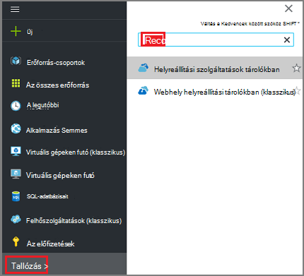

<properties
   pageTitle="Biztonsági mentési és visszaállítási titkosított VMs Azure biztonsági másolat használata"
   description="Szól ez a cikk a biztonsági mentés és visszaállítás gyakorlat VMs titkosított Azure lemez titkosítással."
   services="backup"
   documentationCenter=""
   authors="JPallavi"
   manager="vijayts"
   editor=""/>
<tags
   ms.service="backup"
   ms.devlang="na"
   ms.topic="article"
   ms.tgt_pltfrm="na"
   ms.workload="storage-backup-recovery"
   ms.date="10/25/2016"
   ms.author="markgal; jimpark; trinadhk"/>

# Biztonsági mentési és visszaállítási titkosított VMs Azure biztonsági másolat használata

Ez a cikk lépései biztonsági mentési és visszaállítási segítségével biztonsági Azure virtuális gépeken futó szól. Támogatott forgatókönyvek, előtti követelmény és hibaelhárítási lépések részleteinek hiba az esetek is tartalmaz.

## Támogatott felhasználási területei

> [AZURE.NOTE]
1.  Biztonsági mentési és visszaállítási a titkosított VMs csak az erőforrás-kezelő rendszerbe virtuális gépeken futó támogatott. A klasszikus virtuális gépeken futó nem támogatja.  
2.  Csak a virtuális gépeken futó titkosítva BitLocker titkosítókulcs és a fő titkosítási kulcs is támogatja. Virtuális gépeken futó titkosítva csak BitLocker titkosítási kulcs van nem támogatott.  

## Előzetes követelmények

1.  Virtuális gép titkosított [Azure lemez titkosítást](../security/azure-security-disk-encryption.md)használ. Érdemes titkosított, BitLocker titkosítási kulcs és a fő titkosítási kulcs is használ.
2.  Létrehozás helyreállítási szolgáltatások tárolóból elemre, és tároló replikációs adja meg [a biztonsági másolat környezet előkészítés](backup-azure-arm-vms-prepare.md)cikkben említett lépésekkel.

## Biztonsági másolat titkosított virtuális
Kövesse az alábbi lépéseket a biztonsági másolat cél beállítása, szabályzat, elemek és a kiváltó ok mező biztonsági másolat konfigurálása.

### Biztonsági másolat konfigurálása

1. Ha már van egy helyreállítási szolgáltatások tárolóból elemre, nyissa meg, akkor folytassa a következő lépéssel. Ha nem rendelkezik egy helyreállítási szolgáltatások megnyitott tárolóból elemre, de az Azure-portálon központi menüben kattintson a **Tallózás gombra**.

  - Az erőforrások listája írja be a **Helyreállítási szolgáltatások**.
  - Miközben elkezdi beírni, a lista szűrők a megadott feltételeknek. Ha **helyreállítási szolgáltatások tárolókban**jelenik meg, kattintson rá.
  
        

    A tárolókban helyreállítási szolgáltatások listája jelenik meg. A tárolókban helyreállítási szolgáltatások listában jelölje ki a tárolóból elemre.

    Ekkor megnyílik a kijelölt tárolóból elemre az irányítópult.

2. Az elemek listáját a megjelenő a tárolóból elemre kattintson a **biztonsági másolat** a biztonsági másolat lap megnyitásához.

       
    
3. Kattintson a biztonsági másolat lap **biztonsági másolat cél** a biztonsági másolat cél lap megnyitásához.

       
    
4.   A biztonsági másolat cél lap, állítsa **a terhelést futtató** Azure és **Miről szeretne biztonsági másolatot készíteni** virtuális géphez, majd kattintson az **OK gombra**.

    A biztonsági másolat cél lap bezárul, és a biztonsági másolat házirend lap nyílik meg.

       

5. Válassza a biztonsági másolat a házirend lap, a biztonsági másolat házirendet szeretne alkalmazni a tárolóból elemre, és kattintson az **OK gombra**.

       

    Az alapértelmezett házirend részleteit jelennek meg a részleteket. Ha szeretne hozzon létre egy házirendet, jelölje be **Új létrehozása** a legördülő menüből. Miután **az OK**gombra kattint, a biztonsági másolat házirendet a tárolóból elemre társítva.

    Ezután válassza ki a VMs szeretne társítani a tárolóból elemre.
    
6. Válassza ki a titkosított virtuális gépeken futó, a megadott házirend hozzárendelése, és kattintson az **OK gombra**.

      
   
7. Ezen a lapon megjelenik egy üzenetet a a kijelölt titkosított VMs társított fő tárolóból elemre. Biztonsági másolat szolgáltatás a kulcsok és titkos kulcsok a fő tárolóból elemre a csak olvasható hozzáférés szükséges. Használja a következő engedélyeket biztonsági billentyűt, és a titkos, a társított VMs együtt. 

      

      Most, hogy a megadott a tárolóból elemre a biztonsági másolat lap az összes beállításainak kattintson a biztonsági másolat engedélyezése az oldal alján. Engedélyezés biztonsági másolatot a tárolóból elemre, és a VMs üzembe helyezése a házirend.

8. A következő szakaszban előkészítése telepítésére van beállítva a virtuális Agent, vagy a virtuális Agent gondoskodhat arról, hogy telepítve van. Tegye ugyanezt, a [Felkészülés a biztonsági másolat környezet](backup-azure-arm-vms-prepare.md)cikkben található lépésekkel hozhatja létre. 

### Biztonsági mentési feladat elindítása
Az eseményindító biztonsági mentési feladat [Biztonsági Azure VMs helyreállítási szolgáltatások tárolóból elemre](backup-azure-arm-vms.md) a cikkben említett lépésekkel hozhatja létre.

## Titkosított virtuális visszaállítása
Titkosított és titkosítatlan virtuális gépeken futó visszaállítása gyakorlat megegyezik. [A portálon Azure virtuális gépeken futó visszaállítása](backup-azure-arm-restore-vms.md) említett lépésekkel hozhatja létre a titkosított virtuális visszaállításához. Abban az esetben, ha kulcsok és titkos kulcsok visszaállítása van szüksége, győződjön meg arról, hogy fő tárolóra visszaállításukról már léteznie kell.

## Hibák elhárítása

| Művelet | Részletek | Megoldás |
| -------- | -------- | -------|
| Biztonsági másolat | Sikertelen volt BEK egyedül a titkosított virtuális gép szerint. Biztonsági másolatok csak a virtuális gépeken futó titkosított BEK és KEK is engedélyezhető. | Virtuális gép BEK és KEK lehet titkosítani. Ezt követően engedélyezni kell a biztonsági másolat. |
| Visszaállítása | A titkosított virtuális nem állítható vissza, mivel az nem létezik a virtuális társított fő tárolóból elemre. | Hozzon létre fő tárolóra használata az [Első lépések az Azure kulcs tárolóból elemre](../key-vault/key-vault-get-started.md). Olvassa el a cikk a [fő tárolóra billentyű és a titkos Azure biztonsági mentéssel visszaállítása](backup-azure-restore-key-secret.md) billentyű és a titkos kulcs visszaállítására, ha az azok nem szerepelnek. |
| Visszaállítása | A titkosított virtuális nem állítható vissza, mivel billentyűt, és a virtuális társított titkos nem létezik. | Olvassa el a cikk a [fő tárolóra billentyű és a titkos Azure biztonsági mentéssel visszaállítása](backup-azure-restore-key-secret.md) billentyű és a titkos kulcs visszaállítására, ha az azok nem szerepelnek. |
