<properties
    pageTitle="Először meg: Azure VMs védelme a helyreállítási szolgáltatások tárolóból elemre a |} Microsoft Azure"
    description="Azure VMs védelme a helyreállítási szolgáltatások tárolóból elemre. Erőforrás-kezelő rendszerbe VMs, klasszikus rendszerbe VMs és prémium tárolás VMs biztonsági másolatait segítségével az adatok védelme. Hozzon létre, és regisztráljon a helyreállítási szolgáltatások tárolóból elemre. Regisztráció VMs, házirend létrehozása és védelme VMs Azure-ban."
    services="backup"
    documentationCenter=""
    authors="markgalioto"
    manager="cfreeman"
    editor=""
    keyword="backups; vm backup"/>

<tags
    ms.service="backup"
    ms.workload="storage-backup-recovery"
    ms.tgt_pltfrm="na"
    ms.devlang="na"
    ms.topic="hero-article"
    ms.date="10/13/2016"
    ms.author="markgal; jimpark"/>

# Először meg: Azure VMs védelme a helyreállítási szolgáltatások tárolóból elemre.

> [AZURE.SELECTOR]
- [A helyreállítási szolgáltatások tárolóra VMs védelme](backup-azure-vms-first-look-arm.md)
- [A biztonsági másolat tárolóra VMs védelme](backup-azure-vms-first-look.md)

Ebben az oktatóanyagban végigvezeti Önt a lépéseket létrehozásához a helyreállítási szolgáltatások tárolóból elemre, és biztonsági mentése az Azure virtuális gép (virtuális). Helyreállítási szolgáltatások tárolókban védelme:

- Erőforrás-kezelő rendszerbe VMs Azure
- Klasszikus VMs
- Szabványos tároló VMs
- Prémium tárolás VMs
- Titkosított titkosítással Azure lemezen, BEK és KEK VMs

Az prémium tárolás VMs védelmével kapcsolatban további tudnivalókért lásd: a [biztonsági mentése és visszaállítása prémium tárolás VMs](backup-introduction-to-azure-backup.md#back-up-and-restore-premium-storage-vms)

>[AZURE.NOTE] Ebben az oktatóanyagban feltételezi, hogy már van egy virtuális Azure-előfizetése, és léptek mértékek engedélyezése a biztonsági szolgáltatás, a virtuális eléréséhez.

[AZURE.INCLUDE [learn-about-Azure-Backup-deployment-models](../../includes/backup-deployment-models.md)]

Magas szintű az alábbiakban a lépéseket kell végrehajtania.  

1. Hozzon létre egy virtuális egy helyreállítási szolgáltatások tárolóból elemre.
2. Az Azure portal segítségével válassza ki az esetet, házirend beállítása és védelme elemek azonosítása.
3. Futtassa a kezdeti biztonsági mentést.

## Hozzon létre egy helyreállítási szolgáltatások tárolóból elemre egy virtuális

A még a biztonsági mentés és helyreállítási pontok időbeli létrehozott tároló egységek a helyreállítási szolgáltatások tárolóból elemre. A helyreállítási szolgáltatások tárolóra is tartalmaz, a biztonsági házirendek hatálya a védett VMs.

>[AZURE.NOTE] A következő helyi áll VMs mentéséről. Nem készíthet biztonsági másolatot VMs egyik helyről egy másik helyre a helyreállítási szolgáltatások tárolóból elemre kattintva. Igen minden Azure helyhez, amelynek VMs másolat készül, legalább egy helyreállítási szolgáltatások tárolóra léteznie kell, az adott helyen.

A helyreállítási szolgáltatások tárolóra létrehozása:

1. Jelentkezzen be az [Azure-portálon](https://portal.azure.com/).

2. A központi menüben kattintson a **Tallózás gombra** , és az erőforrások listája, írja be a **Helyreállítási szolgáltatások**. Miközben elkezdi beírni, a lista szűrők a megadott feltételeknek. Kattintson a **helyreállítás szolgáltatások tárolóból elemre**.

    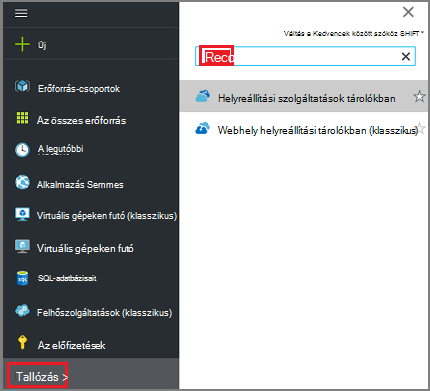  

    A helyreállítási szolgáltatások tárolókban listájában jelennek meg.

3. A **helyreállítási szolgáltatások tárolókban** menüben kattintson a **Hozzáadás**gombra.

    

    Megnyílik a helyreállítási szolgáltatások tárolóból elemre a lap, kéri, adja meg **nevét**, **előfizetés**, **erőforráscsoport**és **helyét**.

    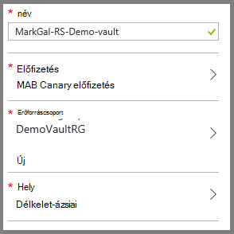

4. A **név**írja be egy rövid nevet, amely azonosítja a tárolóból elemre. A név van szüksége az Azure előfizetés egyedinek kell lennie. Adjon egy nevet, amely a 2 és 50 karakter közötti tartalmazza. Egy betűvel kell kezdődnie, és csak betűket, számokat és kötőjelet is tartalmazhat.

5. Kattintson az **előfizetés** az előfizetések elérhető listájának megjelenítéséhez. Ha nem biztos abban, hogy mely előfizetés használni, használja az alapértelmezett (vagy a javasolt) előfizetés. Nincsenek több lehetőség csak akkor, ha a szervezeti fiók társítva több Azure előfizetés.

6. **Erőforráscsoport** a rendelkezésre álló erőforráscsoport listájának megtekintéséhez, vagy kattintson az **Új** erőforráscsoport létrehozása gombra. Az erőforrás csoportok átfogó információt a [Azure erőforrás-kezelő áttekintése](../azure-resource-manager/resource-group-overview.md) című témakörben találhat.

7. Kattintson a **hely** jelölje ki a földrajzi régióban esetében a tárolóból elemre. A virtuális gépeken futó, amelyet védeni kíván azonos régió a tárolóból elemre **kell** lennie.

    >[AZURE.IMPORTANT] Ha biztos benne, hogy a helyet, ahol a virtuális létezik, zárja be a tárolóból elemre létrehozása párbeszédpanel ki, és nyissa meg a virtuális gépeken futó listáját a portálon. Virtuális gépeken futó több területre, ha az egyes régiókra hozzon létre egy helyreállítási szolgáltatások tárolóból elemre. Ugrás a következő helyen előtt hozzon létre a a tárolóból elemre az első helyen. Adja meg az adatok biztonsági másolatának – a helyreállítási szolgáltatások tárolóra tárolásához tároló fiókokat nincs szükség van, és a biztonsági másolat Azure szolgáltatás automatikusan kezelheti a.

8. Kattintson a **létrehozása**gombra. Eltarthat egy ideig a létrehozandó helyreállítási szolgáltatások tárolóból elemre. Figyelje meg a állapotát jelző a portál jobb felső területén. Amikor létrejött a tárolóból elemre, megjelenik a helyreállítási szolgáltatások tárolókban listájában.

    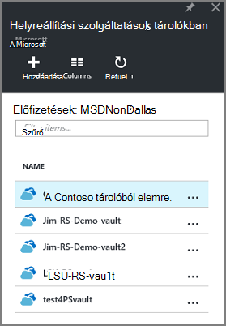

Most, hogy létrehozta a tárolóból elemre, megtudhatja, hogyan kell beállítani a tárterület-replikáció.

### Tárterület-replikáció beállítása

A tároló replikációs beállítással geo felesleges tároló és a helyi meghajtóra felesleges szolgáltatások közül választhat. Alapértelmezés szerint a tárolóból elemre a geo felesleges tároló tartalmaz. Kilépés a geo felesleges tárolóhoz beállítása, ha ez az elsődleges biztonsági mentése lehetőséget. Válassza a helyi meghajtóra felesleges tárhely, ha azt szeretné, hogy egy olcsóbb beállítást, amely nem, tartós. További információk [geo felesleges](../storage/storage-redundancy.md#geo-redundant-storage) és a [helyi meghajtóra felesleges](../storage/storage-redundancy.md#locally-redundant-storage) -tárolási lehetőségek a az [Azure tároló replikációs – áttekintés](../storage/storage-redundancy.md).

A tároló replikációs beállításainak módosítása:

1. Jelölje ki a tárolóból elemre kattintva nyissa meg a tárolóból elemre az irányítópult és a beállítások lap. A **Beállítások** lap nem nyílik meg, ha a tárolóból elemre az irányítópult kattintson a **minden beállításai** parancsra.

2. Kattintson a **Beállítások** lap a **Biztonsági másolat infrastruktúra** > **Biztonsági másolat konfigurációs** a **Biztonsági mentés beállításainak** lap megnyitásához. A **Biztonsági mentés beállításainak** lap válassza a tárterület replikációs lehetőséget a tárolóból elemre.

    

    Miután kiválasztotta a tárolóból elemre a tárolási lehetőség, készen áll a virtuális társítani a tárolóból elemre. A társítási indításához kell Fedezze fel, és regisztráljon az Azure virtuális gépeken futó.

## Válassza ki a biztonsági másolat célt, házirend beállítása és védelme elemek meghatározása

Regisztrálás előtt egy virtuális a tárolóból elemre, és futtassa a keresési folyamatának annak érdekében, hogy minden új virtuális gépeken futó, amely az előfizetéshez van hozzáadva azonosítja. A folyamat lekérdezések Azure virtuális gépeken futó az előfizetést, és további információt a listája, mint a felhőalapú szolgáltatás neve és a régió. Az Azure-portálon forgatókönyv utal, mit szeretne helyezni a helyreállítási szolgáltatások tárolóból elemre. A házirend olyan gyakran hogyan és mikor helyreállítási pontok kell venni az ütemtervet. Házirend is magába foglalja a helyreállítási pontok adatmegőrzési tartományát.

1. Ha már van egy helyreállítási szolgáltatások, nyissa meg a tárolóból elemre, ugorjon a 2. Ha nem rendelkezik a helyreállítás szolgáltatások megnyitott tárolóból elemre, de az Azure-portálon központi menüben kattintson a **Tallózás gombra**.

  - Az erőforrások listája írja be a **Helyreállítási szolgáltatások**.
  - Miközben elkezdi beírni, a lista szűrők a megadott feltételeknek. Amikor megjelenik a **helyreállítási szolgáltatások tárolókban**, kattintson rá.

      

    Megjelenik a helyreállítási szolgáltatások tárolókban listáját.
  - Helyreállítási szolgáltatások tárolókban listában jelölje ki a tárolóból elemre.

    Ekkor megnyílik a kijelölt tárolóból elemre az irányítópult.

    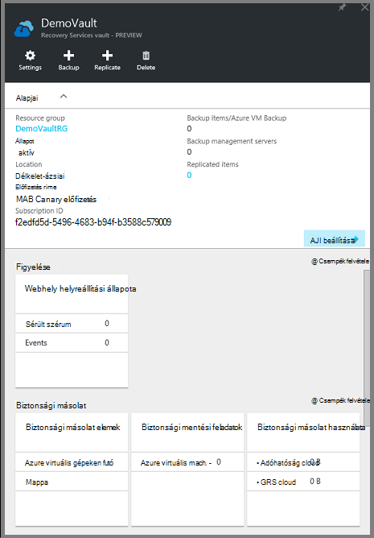

2. A tárolóból elemre az irányítópult menüben kattintson a **biztonsági másolat** kattintva nyissa meg a biztonsági másolat lap.

    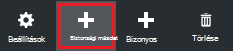

    Amikor megnyílik a lap, a biztonsági másolat szolgáltatás az előfizetés minden új VMs keres.

    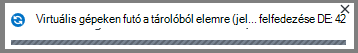

3. Kattintson a biztonsági másolat lap **biztonsági másolat cél** a biztonsági másolat cél lap megnyitásához.

    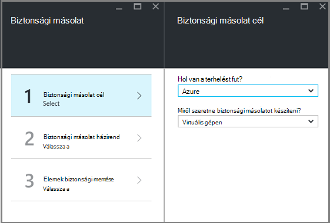

4. A biztonsági másolat cél lap, állítsa **a terhelést futtató** Azure és **Miről szeretne biztonsági másolatot készíteni** virtuális géphez, majd kattintson az **OK gombra**.

    A biztonsági másolat cél lap bezárul, és a biztonsági másolat házirend lap nyílik meg.

    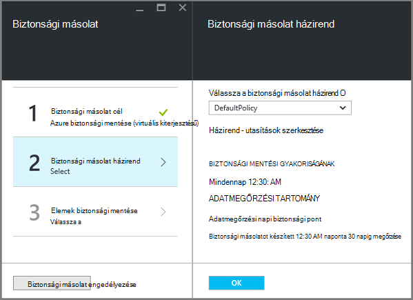

5. Válassza a biztonsági másolat a házirend lap, a biztonsági másolat házirendet szeretne alkalmazni a tárolóból elemre, és kattintson az **OK gombra**.

    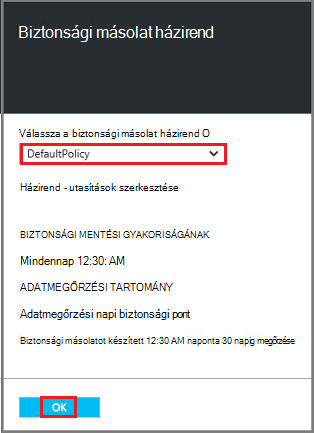

    Az alapértelmezett házirend részleteit jelennek meg a részleteket. Ha szeretne hozzon létre egy házirendet, jelölje be **Új létrehozása** a legördülő menüből. A legördülő menü is lehetővé teszi az idő, amikor a pillanatkép venni, 7 du válthat. Biztonsági házirend megadásával című cikkben olvashat [a biztonsági másolat házirend létrehozása](backup-azure-vms-first-look-arm.md#defining-a-backup-policy). Miután **az OK**gombra kattint, a biztonsági másolat házirendet a tárolóból elemre társítva.

    Ezután válassza ki a VMs szeretne társítani a tárolóból elemre.

6. Válassza ki a virtuális gépeken futó a megadott házirend hozzárendelése, és kattintson a **Kijelölés**gombra.

    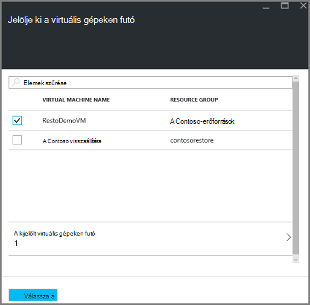

    Ha nem látja a kívánt virtuális, ellenőrizze, hogy a helyreállítási szolgáltatások tárolóra Azure ugyanazon a helyen található.

7. Most, hogy a megadott a tárolóból elemre a biztonsági másolat lap az összes beállításainak **Engedélyezése biztonsági mentése** elemre a lap alján kattintson a. Ez a házirendet a tárolóból elemre, és a VMs üzembe helyezése.

    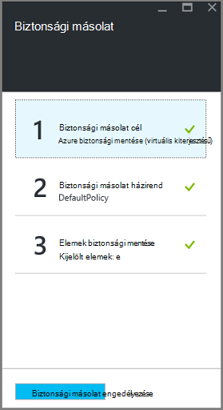

## Kezdeti biztonsági mentése

Miután egy biztonsági házirendet, amely nem jelent virtuális gépen lett telepítve az adatok nem készített biztonsági másolatot. Alapértelmezés szerint ki (a biztonsági másolat házirend meghatározott) az első ütemezett biztonsági másolat a kezdeti biztonsági másolatot. Mindaddig, amíg a kezdeti biztonsági másolat fordul elő, kattintson a **Biztonsági másolat feladatok** lap az utolsó biztonsági állapot oszlopban a **Figyelmeztetés (függő első biztonsági)**szerint.

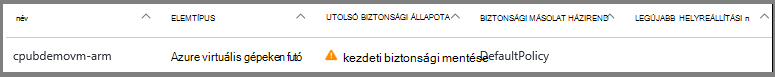

Csak az első biztonsági esedékes, amint a kezdéshez, **biztonsági mentése**futtatása ajánlott.

**Biztonsági másolat készítése**futtatása

1. Kattintson a tárolóból elemre irányítópult, akkor a **biztonsági másolat** csempére **Azure virtuális gépeken futó**  
    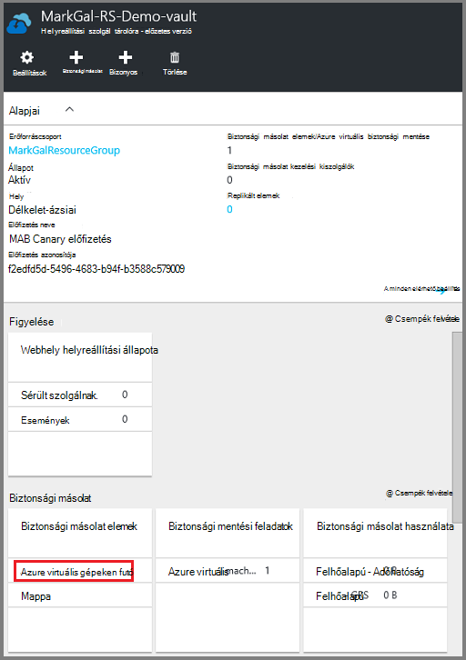

    A **Biztonsági másolat elemek** lap megnyitása

2. A **Biztonsági mentés elemet** a lap kattintson a jobb gombbal a biztonsági másolatot szeretne tárolóból elemre, és **biztonsági másolat letöltése**parancsra.

    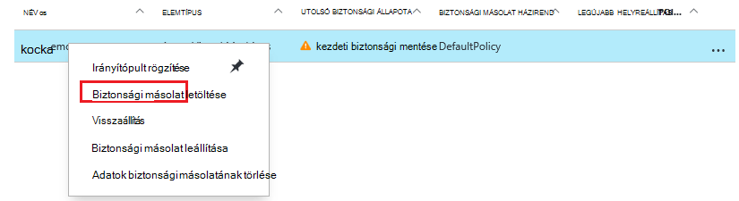

    A biztonsági mentési feladat induljanak.  

    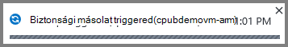

3. **Azure virtuális gépeken futó**kattintva megtekintheti, hogy az első biztonsági befejeződött, tárolóból elemre az irányítópulton a **Biztonsági másolat feladatok** hivatkozásra.

    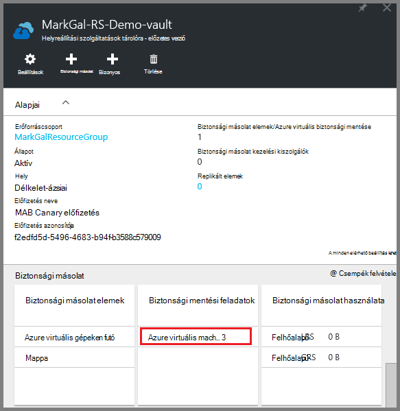

    Ekkor megnyílik a biztonsági másolat feladatok lap.

4. A biztonsági másolat a feladatok lap akkor láthatja az összes feladat állapotát.

    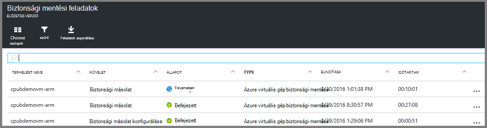

    >[AZURE.NOTE] A biztonsági mentés részeként a biztonsági másolat Azure szolgáltatás hibák parancs a biztonsági másolat bővítmény az egyes virtuális az összes írások ürítése, és egy következetes pillanatkép.

    A biztonsági mentési feladat befejezésekor, akkor az Állapot oszlop értéke *Befejezve*.

[AZURE.INCLUDE [backup-create-backup-policy-for-vm](../../includes/backup-create-backup-policy-for-vm.md)]

## A virtuális ügynököt a virtuális gépen

Ez az információ abban az esetben, ha ez szükséges megadva. Az Azure virtuális ügynök telepítenie kell a munkát a biztonsági másolat bővítmény Azure virtuális gépen. Azonban ha a virtuális az Azure gyűjteményből jött létre, majd a virtuális Agent már szerepel a virtuális gépen. Áttelepítését a rendszer a helyszíni adatközpontokkal volna nem a virtuális Agent telepítette, VMs. Ebben az esetben a virtuális Agent kell telepíteni. Ha a probléma a Azure virtuális mentésével, ellenőrizze, hogy az Azure virtuális ügynök megfelelően telepítve van a virtuális gépen (lásd az alábbi táblázatban). Ha létrehozott egy egyéni virtuális, [Győződjön meg róla, a **virtuális ügynököt a** jelölőnégyzet be van jelölve](../virtual-machines/virtual-machines-windows-classic-agents-and-extensions.md) a virtuális gép előtt már kiépítve.

Tudnivalók a [Virtuális ügynök](https://go.microsoft.com/fwLink/?LinkID=390493&clcid=0x409) és [útmutatást adunk a telepítés](../virtual-machines/virtual-machines-windows-classic-manage-extensions.md).

Az alábbi táblázat a virtuális ügynök a Windows vagy Linux VMs további információt tartalmaz.

| **Művelet** | **A Windows** | **Linux** |
| --- | --- | --- |
| A virtuális Agent telepítése | <li>Töltse le és telepítse az [MSI ügynök](http://go.microsoft.com/fwlink/?LinkID=394789&clcid=0x409). Rendszergazdai jogosultságokkal a telepítés befejezéséhez szükséges. <li>[A virtuális tulajdonság frissítéséhez](http://blogs.msdn.com/b/mast/archive/2014/04/08/install-the-vm-agent-on-an-existing-azure-vm.aspx) jelzi, hogy telepítve van-e a agent. | <li> Telepítse a legújabb [Linux ügynök](https://github.com/Azure/WALinuxAgent) GitHub. Rendszergazdai jogosultságokkal a telepítés befejezéséhez szükséges. <li> [A virtuális tulajdonság frissítéséhez](http://blogs.msdn.com/b/mast/archive/2014/04/08/install-the-vm-agent-on-an-existing-azure-vm.aspx) jelzi, hogy telepítve van-e a agent. |
| A virtuális Agent frissítése | Frissítés a virtuális Agent akkor egyszerűen, a [virtuális Agent bináris](http://go.microsoft.com/fwlink/?LinkID=394789&clcid=0x409)újratelepítése.  Győződjön meg arról, hogy nincs biztonsági mentést fut-e a virtuális agent frissítése közben. | Kövesse a képernyőn megjelenő utasításokat [a Linux virtuális Agent frissítése ](../virtual-machines-linux-update-agent.md).  Győződjön meg arról, hogy nincs biztonsági mentést fut-e a virtuális Agent frissítése közben. |
| A virtuális ügynök telepítés érvényesítése | <li>Nyissa meg a Azure virtuális *C:\WindowsAzure\Packages* mappájában. <li>Keresse meg a bemutató WaAppAgent.exe fájlt.<li> Kattintson a jobb gombbal a fájlra, válassza a **Tulajdonságok parancsot**, és válassza a **Részletek** fülre. A termék verziója írjuk 2.6.1198.718 vagy újabb verziójában. | A #HIÁNYZIK |

### Biztonsági másolat bővítmény

A virtuális Agent a virtuális gépen telepítése után a biztonsági másolat Azure szolgáltatás a biztonsági másolat bővítmény telepítése a virtuális Agent. A biztonsági másolat Azure szolgáltatás zökkenőmentes frissíti és összekapcsolja a biztonsági másolat bővítmény további felhasználói beavatkozás nélkül.

A biztonsági másolat bővítmény biztonsági másolat szolgáltatás telepítve van, hogy fut-e a virtuális. A futó virtuális itt-alkalmazás egységes helyreállítási pont első legnagyobb lehetőségét. Az Azure biztonsági másolat szolgáltatás azonban továbbra is, készítsen biztonsági másolatot a virtuális, még akkor is, ha ki van kapcsolva, és a bővítmény nem lehetett telepíteni. Kapcsolat nélküli virtuális nevezik. Ebben az esetben a helyreállítási pont lesz az *egységes összeomlik*.

## Hibaelhárítási tudnivalók
Ebben a cikkben feladatokat végrehajtásának problémák esetén olvassa el a [Hibaelhárítás útmutatást](backup-azure-vms-troubleshoot.md).

## Árak
Azure virtuális biztonsági másolat ráterheljük védett példányok modell alapján. További információ a [Biztonsági másolat árak](https://azure.microsoft.com/pricing/details/backup/)

## Kérdések?
Ha kérdései vannak, vagy bármely funkció, amely tartalmazza, hogy milyen [küldjön visszajelzést](http://aka.ms/azurebackup_feedback).
