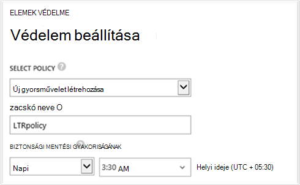
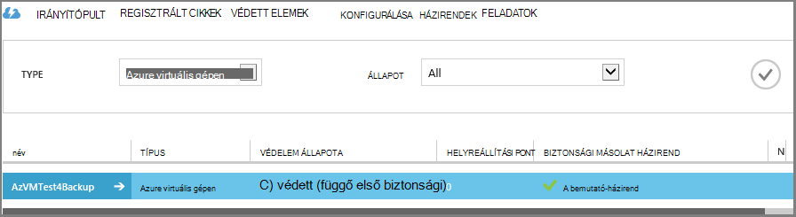

<properties
    pageTitle="Első megjelenés: Azure VMs védelme a biztonsági másolat tárolóból elemre a |} Microsoft Azure"
    description="Azure VMs védeni a biztonságimásolat-tárolóból elemre. Oktatóprogram megtudhatja, hogy hozzon létre a tárolóból elemre, VMs regisztrálni, házirend létrehozása és védelme VMs Azure-ban."
    services="backup"
    documentationCenter=""
    authors="markgalioto"
    manager="cfreeman"
    editor=""/>

<tags
    ms.service="backup"
    ms.workload="storage-backup-recovery"
    ms.tgt_pltfrm="na"
    ms.devlang="na"
    ms.topic="hero-article"
    ms.date="09/15/2016"
    ms.author="markgal; jimpark"/>

# Először meg: Azure virtuális gépeken futó mentésével

> [AZURE.SELECTOR]
- [A helyreállítási szolgáltatások tárolóra VMs védelme](backup-azure-vms-first-look-arm.md)
- [Azure VMs védelme a biztonsági másolat tárolóból elemre](backup-azure-vms-first-look.md)

Ebben az oktatóanyagban végigvezeti Önt a lépéseket az Azure virtuális gép (virtuális) mentésével az Azure-ban egy biztonsági tárolóból elemre. Ez a cikk ismerteti a Klasszikus modell vagy Service Manager telepítési modell, VMs mentésével. Ha érdeklik a virtuális egy helyreállítási szolgáltatások tárolóból elemre, amelyhez tartozik egy erőforráscsoport való mentéséről, olvassa el a [először meg: VMs védelme a helyreállítási szolgáltatások tárolóból elemre a](backup-azure-vms-first-look-arm.md). Ebben az oktatóanyagban sikeres befejezéséhez az alábbi előfeltételek léteznie kell:

- Az Azure előfizetés létrehozott egy virtuális.
- A virtuális Azure nyilvános IP-címek és kapcsolatot tartalmaz. További tudnivalókért lásd: [a hálózati kapcsolat](./backup-azure-vms-prepare.md#network-connectivity).

Biztonsági másolatot készít egy virtuális, az öt fő lépésből áll:  

 azonosítása egy meglévő biztonsági tárolóból elemre, vagy hozzon létre egy biztonsági tárolóból elemre.  
 az Azure klasszikus portal segítségével felderíteni és a virtuális gépeken futó regisztrálni.  
 a virtuális ügynököt.  
 a védelmet a virtuális gépeken futó házirend létrehozása.  
 futtassa a biztonsági mentést.

>[AZURE.NOTE] Azure van két telepítési modellekkel létrehozásáról és használatáról az erőforrások: [az erőforrás-kezelő és klasszikus](../resource-manager-deployment-model.md). Ebben az oktatóanyagban van a VMs az Azure klasszikus portál létrehozott való használatra. Az Azure biztonsági másolat szolgáltatás erőforrás-kezelő-alapú VMs támogatja. További információ a helyreállítási szolgáltatások tárolóból elemre kattintva VMs mentéséről [első keresése: VMs védelme a helyreállítási szolgáltatások tárolóból elemre a](backup-azure-vms-first-look-arm.md).

## Lépés: 1 – hozzon létre egy biztonsági tárolóból elemre egy virtuális

A még a biztonsági mentés és helyreállítási pontok időbeli létrehozott tároló egységek egy biztonsági tárolóból elemre. A biztonsági másolat tárolóra is alkalmazva vannak a virtuális gépeken futó biztonsági másolatot készít biztonsági házirendek tartalmaz.

1. Jelentkezzen be az [Azure klasszikus portálon](http://manage.windowsazure.com/).

2. A bal alsó sarkában az Azure portált kattintson az **Új** gombra

    

3. Kattintson a gyors létrehozása varázsló **Data Services** > **Helyreállítási szolgáltatások** > **Biztonsági másolat tárolóból elemre** > **Gyors létrehozása**.

    

    A varázsló kéri a **neve** és a **régió**. Ha egynél több előfizetés Ön kezeli, megjelenik egy párbeszédpanel, válassza az előfizetés.

4. A **név**írja be egy rövid nevet, amely azonosítja a tárolóból elemre. A név van szüksége az Azure előfizetés egyedinek kell lennie.

5. **Régió**jelölje ki a földrajzi régióban esetében a tárolóból elemre. A virtuális gépeken futó védi azt ugyanazon régió a tárolóból elemre **kell** lennie.

    Ha nem tudja, hogy a régió, amelyben a virtuális létezik, zárja be a varázslót, és Azure szolgáltatások listában kattintson a **virtuális gépeken futó** . A hely oszlopban tartalmazza a régió nevét. Virtuális gépeken futó több területre, ha az egyes régiókra hozzon létre egy biztonsági tárolóból elemre.

6. Ha nem **előfizetés** párbeszédpanel a varázslóban, ugorjon a következő lépéssel. Ha több előfizetéssel rendelkező dolgozik, válassza az előfizetés társíthatja az új biztonsági tárolóból elemre.

    

7. Kattintson a **Hozzon létre a tárolóból elemre**. Eltarthat egy ideig a létrehozandó a biztonsági másolat tárolóból elemre. Figyelje meg a állapotát jelző a portálon alján.

    

    Üzenet jelzi, hogy a tárolóra sikeresen létre. **Aktív**szerepel a **helyreállítási-szolgáltatások** lapon.

    

8. A tárolókban **Helyreállítási szolgáltatások** lapján listájában válassza a tárolóból elemre kattintva indítsa el az **Első lépések** lap létrehozott.

    

9. Az **Első lépések** lapon kattintson a nyissa meg a replikáció tárolási lehetőség **beállítása** gombra.
    

10. A **tároló replikációs** funkciót válassza a replikáció esetében a tárolóból elemre.

    

    Alapértelmezés szerint a tárolóból elemre a geo felesleges tároló tartalmaz. Ha ez az elsődleges biztonsági másolatának geo felesleges tároló kiválasztása Válassza a helyi meghajtóra felesleges tárolás, ha azt szeretné, hogy egy olcsóbb beállítást, amely nem igazán tartós. További információ a geo felesleges és helyileg redundáns tárolási lehetőségek a az [Azure tároló replikációs áttekintése](../storage/storage-redundancy.md).

Miután kiválasztotta a tárolóból elemre a tárolási lehetőség, készen áll a virtuális társítani a tárolóból elemre. A társítási indításához Fedezze fel, és regisztráljon az Azure virtuális gépeken futó.

## Lépés: 2 - Fedezze fel, és regisztráljon Azure virtuális gépeken futó
Előtt a virtuális regisztrálja a tárolóból elemre, futtassa a feltárás folyamat minden új VMs azonosításához. Ez az előfizetést, és további információk, például a felhőalapú szolgáltatás neve és a régió virtuális gépeken futó listáját adja eredményül.

1. Jelentkezzen be az [Azure klasszikus portál](http://manage.windowsazure.com/)

2. Az Azure klasszikus portálon kattintson a **Helyreállítás szolgáltatások** helyreállítási szolgáltatások tárolókban listájának megnyitásához.
    

3. A tárolókban listában jelölje ki a virtuális másolatot a tárolóból elemre.

    Ha bejelöli a tárolóból elemre, az **Első lépések** lap megnyitása

4. A tárolóból elemre menüből válassza a **Registered elemet**.

    

5. A **típus** listában jelölje ki **Azure virtuális gépen**.

    

6. Kattintson a **DISCOVER** az oldal alján.
    

    A keresési folyamatának néhány percig is eltarthat, amíg a virtuális gépeken futó vannak alatt álló táblázatos. Van egy értesítést, amely lehetővé teszi, hogy fut-e a folyamatot, hogy a képernyő alján.

    

    Az értesítés módosításokat a folyamat befejezéséhez.

    

7. Kattintson a lap alján a **REGISZTRÁCIÓ** .
    

8. Jelölje ki a **Regisztráció elemek** helyi menü regisztrálni kívánt virtuális gépeken futó.

    >[AZURE.TIP] Egyszerre több virtuális gépeken futó lehet regisztrálni.

    A feladat, amely a kijelölt virtuális gépeken jön létre.

9. Kattintson a **Feladat megtekintése** az értesítésben, ahol a **feladatok** lap megnyitásához.

    

    A virtuális gép is megjelenik a bejegyzett elemeket, és a regisztrációs művelet állapotának listájában.

    

    Amikor a művelet befejeződött, az állapotot, megfelelően *regisztrált* állapotát.

    

## Lépés a 3 - virtuális ügynököt a virtuális gépen

Az Azure virtuális ügynök telepítenie kell a munkát a biztonsági másolat bővítmény Azure virtuális gépen. Ha a virtuális az Azure gyűjteményből jött létre, a virtuális Agent már telepítve a virtuális. Kihagyhatja [a VMs](backup-azure-vms-first-look.md#step-4-protect-azure-virtual-machines)védelme.

A virtuális áttelepítenie egy helyszíni adatközponthoz, ha a virtuális valószínűleg nincs telepítve a virtuális Agent. A virtuális védelme a folytatás előtt virtuális gépen telepítenie kell a virtuális Agent. A lépések részletes leírását a virtuális Agent telepítésével olvassa el a a [virtuális ügynökök szakaszban a biztonsági másolat VMs cikk](backup-azure-vms-prepare.md#vm-agent)című témakört.

## Lépés: 4 – a biztonságimásolat-házirend létrehozása
Előtt, az elindítani a kezdeti biztonsági mentést, amikor biztonsági pillanatképek vesznek beállítása az ütemtervet. Biztonsági másolat pillanatképek vesznek, és idejének hosszát e pillanatképek megmaradnak, a biztonsági másolat házirend, az ütemtervet. Az adatmegőrzési információkat szerzett-apa-fia biztonsági Forgatás séma alapul.

1. Nyissa meg azt az Azure klasszikus portálon a **Helyreállítási szolgáltatások** biztonsági tárolóból elemre, majd kattintson a **Registered elemek**.
2. A legördülő menüből válassza az **Azure virtuális gépen** .

    

3. Kattintson a **védelem** az oldal alján.
    

    Az **elemek védelme varázsló** jelenik meg, és *csak* virtuális gépeken futó regisztrálva és a nem védett sorolja fel.

    

4. Jelölje ki a védelemmel ellátni kívánt virtuális gépeken futó.

    Ha két vagy több virtuális gépeken futó azonos nevű, a virtuális gépeken futó megkülönböztetni a felhőalapú szolgáltatást használhatja.

5. A **beállítás védelmet** menüben válassza a meglévő házirend, vagy hozzon létre egy új házirendet, amely a virtuális gépeken futó azonosította, hogy védelme.

    Új biztonsági másolat tárolókban rendelkezik egy alapértelmezett házirend társított a tárolóból elemre. Ezzel a házirenddel elfoglalja minden esti pillanatkép napi, és a napi pillanatkép 30 napig tárolja. Egyes biztonsági házirendek beállíthatja, hogy több virtuális gépeken futó társítva. Azonban a virtuális gép csak társítható egy házirend egyszerre.

    

    >[AZURE.NOTE] Biztonsági másolat házirendet a adatmegőrzési sablonjának az ütemezett biztonsági másolatok tartalmazza. Ha bejelöli a meglévő biztonsági házirend, a következő lépésben az adatmegőrzési beállítások módosítása nem fogja.

6. **Adatmegőrzési tartomány** állítsa be az adott biztonsági pontokat napi, heti, havi vagy éves hatókörét.

    

    Adatmegőrzési szabály adja meg a biztonsági tárolásához idejének hosszát. Megadhatja, hogy a különböző adatmegőrzési házirendek alapján, ha a biztonsági mentés származik.

7. Kattintson a **feladatok** **Konfigurálása védelem** feladatok listájának megtekintéséhez.

    

    Most, hogy létrehozta a házirendet, lépjen a következő lépésre, és futtassa a kezdeti biztonsági mentést.

## Kezdeti biztonságimásolat 5 - lépés

Miután egy virtuális gép szabálya védett, a kapcsolatot a **Védett elemek** lapon tekinthet meg. Mindaddig, amíg a kezdeti biztonsági másolat fordul elő, a **Védelem állapot** szerint **védett - (függő első biztonsági)**jeleníti meg. Az első ütemezett biztonsági másolat alapértelmezés szerint ki a *kezdeti biztonsági másolatot*.

A kezdeti biztonsági másolat letöltése indítása:

1. A **Védett elemek** lapon kattintson a **Biztonsági másolat letöltése** az oldal alján.
    

    Az Azure biztonsági szolgáltatás létrehoz egy biztonsági mentési feladat az a kezdeti biztonsági mentést.

2. Kattintson a **feladatok** lap feladatok listájának megtekintéséhez.

    

    Első biztonsági befejeződésekor kattintson a **Védett elemek** lap a virtuális gép állapota *védett*.

    

    >[AZURE.NOTE] Virtuális gépeken futó mentésével az egy helyi folyamat. Nem készíthet biztonsági másolatot virtuális gépeken futó egy területről egy másik tartományban lévő egy biztonsági tárolóból elemre kattintva. Igen minden Azure régiót, amelynek VMs kell biztonsági másolatot, legalább egy biztonsági tárolóra létre kell hozni az adott régióban.

## Következő lépések
Most, hogy sikeresen biztonsági egy virtuális, létezik néhány további lépések, amelyek az érdeklődésére számot. A legtöbb logikai lépésként olvassa el a virtuális adatok visszaállítása. Vannak azonban olyan engedélykezelési feladatai, amelyek segítségével megtudhatja, hogyan megbízható szeretné tartani az adatokat, illetve a költségek csökkentése érdekében.

- [Kezelése és a virtuális gépeken futó figyelése](backup-azure-manage-vms.md)
- [Virtuális gépeken futó visszaállítása](backup-azure-restore-vms.md)
- [Hibaelhárítási útmutatás](backup-azure-vms-troubleshoot.md)

## Kérdések?
Ha kérdései vannak, vagy bármely funkció, amely tartalmazza, hogy milyen [küldjön visszajelzést](http://aka.ms/azurebackup_feedback).
