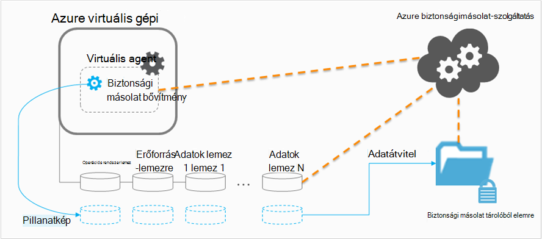

<properties
    pageTitle="Azure-ban a virtuális biztonsági infrastruktúrájára tervezési |} Microsoft Azure"
    description="Készítsen biztonsági másolatot az Azure virtuális gépeken futó tervezésekor fontos figyelembe veendő szempontok"
    services="backup"
    documentationCenter=""
    authors="markgalioto"
    manager="cfreeman"
    editor=""
    keywords="biztonsági másolat vms, készítsen biztonsági másolatot a virtuális gépeken futó"/>

<tags
    ms.service="backup"
    ms.workload="storage-backup-recovery"
    ms.tgt_pltfrm="na"
    ms.devlang="na"
    ms.topic="article"
    ms.date="10/19/2016"
    ms.author="trinadhk; jimpark; markgal;"/>

# <a name="plan-your-vm-backup-infrastructure-in-azure"></a>Az Azure virtuális biztonsági infrastruktúra megtervezése
Ebben a cikkben a teljesítmény és a erőforrás javaslatok a virtuális biztonsági infrastruktúra tervezéséhez. Is határozza meg a biztonsági másolat szolgáltatás; legfontosabb szempontok lehet, hogy a következő szempontokat kritikus a architektúra meghatározására kapacitás tervezése és az ütemezés. Ha, ha már [készített a környezetben](backup-azure-vms-prepare.md), ez az a következő lépésben [biztonsági VMs](backup-azure-vms.md)megkezdése előtt. Ha a Azure virtuális gépeken futó kapcsolatos további információra van szüksége, olvassa el a [virtuális gépeken futó dokumentáció](https://azure.microsoft.com/documentation/services/virtual-machines/).

## <a name="how-does-azure-back-up-virtual-machines"></a>Honnan tudja az Azure virtuális gépeken futó feljebb?
A biztonsági másolat Azure szolgáltatás egy biztonsági mentési feladat kezdeményez, az ütemezett időpontban, amikor a pont és az idő pillanatképet készíthet biztonsági bővítmény akkor indítja. Egyeztetés az a mennyiségi szolgáltatás (Árnyékmásolata) hozni a pillanatkép a lemezt egységes pillanatkép beszerzése a virtuális gépen anélkül, hogy le.

Után a pillanatkép származik, az adatok átkerülnek az Azure biztonsági szolgáltatás által a biztonsági másolat tárolóból elemre. A biztonsági mentés hatékonyabbá tételéhez a szolgáltatás azonosítja, és csak az adatok, amelyek módosultak a legutóbbi biztonsági mentés óta blokkok továbbítja.



Az adatátvitel befejeződése után a pillanatkép törlődik, és a helyreállítási pont jön létre.

### <a name="data-consistency"></a>Adatok konzisztencia
Mentésével és visszaállításával fontos adatokat a vállalati fontos adatokat kell biztonsági másolatot az alkalmazások az adatok okozó közben tény van bonyolultan üzleti futnak. Ez megoldására Azure biztonsági másolat biztosít alkalmazás egységes biztonsági másolatok Microsoft munkaterhelésekből annak érdekében, hogy adatokat tárolóhoz helyesen írt VSS használatával.

>[AZURE.NOTE] Linux virtuális gépekhez csak fájl egységes biztonsági másolatok lehetségesek, mivel Linux nincs VSS egy ezzel egyenértékű platform

Azure biztonsági másolat VSS teljes biztonsági másolatok Windows VMs (további információk: [VSS teljes biztonsági másolat](http://blogs.technet.com/b/filecab/archive/2008/05/21/what-is-the-difference-between-vss-full-backup-and-vss-copy-backup-in-windows-server-2008.aspx)) veszi fel. Ahhoz, hogy VSS biztonsági másolatok, a beállításjegyzék alatti kulcsot kell állítható be a virtuális.

```
[HKEY_LOCAL_MACHINE\SOFTWARE\MICROSOFT\BCDRAGENT]
"USEVSSCOPYBACKUP"="TRUE"
```


Az alábbi táblázatban ismertetjük konzisztencia típusú, és a feltételek azokat a során fellépő Azure virtuális biztonsági mentése és visszaállítása eljárásokat.

| Egységesebb | VSS-alapú | MAGYARÁZAT és adatainak megjelenítése |
|-------------|-----------|---------|
| Alkalmazás konzisztencia | igen | Ez a a Microsoft-munkaterhelésekből ideális egységesebb típusa, mint biztosítja, hogy:<ol><li> A virtuális *betölti be*. <li>Nincs *semmilyen sérült*. <li>*Az adatvesztés*van.<li> Az adatok egységesek az alkalmazás, amely az adatokat, használja az alkalmazás biztonsági másolat – VSS segítségével időben bevonásával</ol> A legtöbb Microsoft munkaterhelésekből végezze el a terhelést-specifikus műveletek kapcsolatos összhangot adatok VSS-írót van. Például a Microsoft SQL Server tartalmaz egy íróprogramban, amely biztosítja, hogy a tranzakció naplófájlt és az adatbázis írás megfelelően történt-e.<br><br> Azure virtuális biztonsági mentést, az alkalmazás egységes helyreállítási pont első azt jelenti, hogy a biztonsági másolat bővítmény volt a VSS munkafolyamat indítása és *megfelelően* fejezze be a virtuális pillanatkép felvételének előtt. Természetesen ez azt jelenti, a VSS szövegírói a Azure virtuális lévő összes alkalmazások indított is.<br><br>( [VSS alapjait](http://blogs.technet.com/b/josebda/archive/2007/10/10/the-basics-of-the-volume-shadow-copy-service-vss.aspx) , és a mély be, [hogy hogyan működik](https://technet.microsoft.com/library/cc785914%28v=ws.10%29.aspx)a részletek kördiagramjaira). |
| A fájlrendszer egységesebb | Igen, a Windows-alapú számítógépen | Van két helyzetben, ahol a helyreállítási pont lehet a *fájlrendszer egységes*:<ul><li>Biztonsági másolatait Linux VMs, mivel Linux nem rendelkezik egy ezzel egyenértékű platform VSS Azure-ban<li>VSS hiba Windows VMs Azure-ban a biztonsági másolatok készítése során.</li></ul> A legjobb elvégezhető mindkét esetben ahhoz, hogy: <ol><li> A virtuális *betölti be*. <li>Nincs *semmilyen sérült*.<li>*Az adatvesztés*van.</ol> Alkalmazások a visszaállított adatokat a saját "fix felfelé" eljárás végrehajtásához szükséges.|
| Egységesebb összeomlik | nem | Ebben az esetben a "összeomlik" (keresztül vagy a finom vagy kemény alaphelyzetbe állítása) történnek virtuális géphez megegyezik. Ez általában történik, ha az Azure virtuális gép leállítása a biztonsági másolat idején. Azure virtuális gép biztonsági másolatok összeomlik egységes helyreállítási pont eszköz Azure biztonsági másolat első kínál körül az adatok következetességét garanciáit a tárhely közepes – az operációs rendszer szemszögéből vagy az alkalmazás a rajtuk. Csak, amely már létezik a lemezen a biztonsági másolat idején adata mi kap rögzítse és biztonsági másolat készül. <br/> <br/> A legtöbb esetben garanciáit várakozó az operációs rendszer fog elindulni. Ez általában követi a lemez ellenőrzése eljárás chkdsk, például a sérült hibák megoldásához. A memóriában adatokat és, amely rendelkezik nem teljesen kiürítése megtörtént a lemezre írása el fog veszni. Az alkalmazás a szokásos követi a saját hitelesítési eljárás abban az esetben, ha adatok visszaállítás kell végrehajtania. <br><br>Szerepel példaként Ha a tranzakciónaplója tételeket, amelyek nem találhatók meg az adatbázist, majd az adatbázis-szoftver tartalmaz egy visszaállítása mindaddig, amíg az adatok egységesek. Adatok (például átnyúló kötet) több virtuális lemezre kiterjed, egy összeomlását egységes helyreállítási pont az adatok helyességének semmilyen garanciát biztosít.|


## <a name="performance-and-resource-utilization"></a>A teljesítmény és erőforrás-kihasználtság
Helyszíni telepített biztonsági szoftver, például meg kell terveznie kapacitás és erőforrás-kihasználtság igényeinek amikor mentésével VMs Azure-ban. Az [Azure tárterületkorlátok](azure-subscription-service-limits.md#storage-limits) határozza meg, hogyan strukturálhatja virtuális telepítések maximális teljesítményét munkaterhelésekből futó minimális gyakorolt hatás eléréséhez.

A következő Azure tárterületkorlátok figyelmet biztonsági teljesítményt tervezésekor:

- Max kilépési per tárterület-fiók
- Teljes kérelem díjat tárterület-fiók

### <a name="storage-account-limits"></a>Tárterületkorlátok fiók
Adatok biztonsági másolatának a tárterület-fiókból másolja a program, amikor azt számolja meg a bemeneti és kimeneti műveletek / második (IOPS) és a kilépési (vagy átviteli) felé mértékek a tárterület-fiók. Egy időben a virtuális gépeken futó operációs rendszert futtató és használata más IOPS és az átvitel. A cél, annak érdekében, hogy a teljes forgalom - biztonsági és virtuális gép – nem haladja meg a fiók tárterületkorlátok.

### <a name="number-of-disks"></a>A lemez száma
A biztonsági mentés próbálja minél gyorsabban egy biztonsági mentési feladat befejezéséhez. Az így fogyaszt annyi erőforrások igénybe. Az összes bemeneti és kimeneti műveletet azonban korlátozódik által *Egyetlen Blob-tároló átviteli*, amelynek van legfeljebb 60 MB másodpercenként. A sebesség maximalizálása kísérlete a biztonsági mentés próbál készítsen biztonsági másolatot mindegyikében a virtuális lemezt *párhuzamosan*. Igen ha egy virtuális négy lemezt, ezután Azure biztonsági másolat megpróbálja készítsen biztonsági másolatot az összes négy lemez párhuzamosan. Emiatt a legfontosabb tényező tároló ügyfélfiók Kilépés biztonsági forgalom meghatározása a **lemez száma** másolat készül a tárterület-fiókból.

### <a name="backup-schedule"></a>Biztonsági mentés ütemezése
Egy további, amely hatással van a teljesítmény tényező a **biztonsági mentés ütemezése**. Ha egyszerre minden VMs készül, adja meg a házirendek, a forgalom Beragadt ütemezte. A biztonsági mentés megpróbálja készítsen biztonsági másolatot az összes lemez párhuzamosan. Egyik módja a biztonsági másolat forgalom csökkentése egy tárterület-fiókból – különböző VMs biztonsági másolat készül a napon nincs átfedés a különböző időpontokban biztosítása.

## <a name="capacity-planning"></a>Kapacitás tervezése
Ezek a tényezők kiépítésekor, az azt jelenti, hogy fiókja tárterület-használat kell megfelelően kell megtervezni. Töltse le a [virtuális biztonsági kapacitás tervezési Excel-számolótábla](https://gallery.technet.microsoft.com/Azure-Backup-Storage-a46d7e33) milyen következményekkel járnak a lemez és a biztonsági mentés ütemezése lehetőségek megjelenítéséhez.

### <a name="backup-throughput"></a>Biztonsági másolat átviteli
Az egyes lemezen, másolat készül Azure biztonsági beolvassa a lemezen a tömbök és tárolja csak a módosított adatokat (növekményes biztonsági másolat). Az alábbi táblázat az átlagos átvitt értékek láthatók, hogy számíthat Azure biztonsági másolatból. Ez használ, időt vesz igénybe készítsen biztonsági másolatot az egy adott méret lemezen időtartama becsült.

| A biztonsági mentés | Legjobb teljesítmény |
| ---------------- | ---------- |
| Kezdeti biztonsági mentése | 160 MB |
| Növekményes biztonsági másolat (DR) | 640 MB <br><br> A teljesítmény jelentősen húzhatja kell a biztonsági másolat készül, hogy a lemez szétszórt tejeskanna sok esetén. |

## <a name="total-vm-backup-time"></a>Teljes virtuális biztonsági idő
A biztonsági másolat idő többsége töltött az olvasási és az adatok másolása, miközben vannak egyéb műveleteket, amelyek a teljes időt, készítsen biztonsági másolatot a virtuális szükséges:

- Az idő [vagy a biztonsági másolat kiterjesztés frissítés telepítése](backup-azure-vms.md#offline-vms)szükséges.
- Pillanatkép időpontját, ami pillanatkép indíthatja el a szükséges idő. Egy adott időpontban érvényes léptetés közelébe az ütemezett biztonsági idő.
- A várakozási várakozási időt. Mivel a biztonsági másolat szolgáltatás dolgoz több ügyfél biztonsági másolatok, pillanatkép biztonságimásolat-adatok másolása a biztonsági mentés vagy a helyreállítási szolgáltatások tárolóból elemre előfordulhat, hogy nem azonnal elindul. A csúcs időpontok betöltése, a Várakozás a feldolgozása biztonsági másolatok számát miatt 8 órát is egymástól. A teljes virtuális biztonsági időt azonban a napi biztonsági házirendek kisebb, mint 24 óra lesz.

## <a name="best-practices"></a>Ajánlott eljárások
Ajánlott a következő ezekkel az eljárásokkal, miközben a virtuális gépeken futó biztonsági mentések beállítása:

- Nem ütemezett az ugyanazt a felhőalapú szolgáltatást, készítsen biztonsági másolatot egyszerre legfeljebb négy klasszikus VMs. Javasoljuk, hogy egy órával répának biztonsági indítási beállítások, ha több VMs kevésbé azonos felhőbeli szolgáltatástól szeretne.
- Nem ütemezése több mint 40 erőforrás-kezelő rendszerbe VMs egyszerre biztonsági másolatot készíteni.
- Virtuális biztonsági másolatok ütemezése nem csúcs munkaidő alatt, így a biztonsági másolat szolgáltatás IOPS használja a vevőkód tároló adatok átvitele a biztonsági mentés vagy a helyreállítási szolgáltatások tárolóból elemre.
- Győződjön meg arról, hogy a házirend-címei VMs eltérő tárolási fiókok között. Javasoljuk, hogy legfeljebb 20 teljes lemezt egyetlen tárterület-fiókból egy házirend védeni. Ha nagyobb, mint 20 lemezen egy tárterület-fiókban, húzza szét e VMs a szükséges IOPS megszerezni a biztonsági mentés átadás fázisában több házirendek keresztül.
- Nem sikerül visszaállítani a virtuális prémium tároló futó azonos tárterület-fiókjába. Ha a visszaállítási művelet folyamat egybe a biztonsági mentést, csökkenti a biztonsági másolat a rendelkezésre álló IOPS.
- Azt javasoljuk, hogy minden prémium virtuális futó biztonsági optimális teljesítmény biztosítása érdekében különböző prémium tárterület-fiókjában.

## <a name="data-encryption"></a>Adatok titkosítása

Azure biztonsági másolat titkosítja az adatokat a biztonsági mentés részeként. Azonban a virtuális adatainak titkosítására, és zökkenőmentesen biztonsági másolatot védett (További információ a [titkosított adatok biztonsági](backup-azure-vms-encryption.md)olvasás).


## <a name="how-are-protected-instances-calculated"></a>Hogyan számítsa ki védett példányok?
Azure virtuális gépeken futó keresztül Azure biztonsági másolatban legyen hajtva. [Azure biztonsági másolat árak](https://azure.microsoft.com/pricing/details/backup/). A védett példányok számítás a virtuális gép, amely a virtuális gép – a "lemez" kivételével az összes adatot összege a *valós* méret alapul.

Ön *nem* számlázható maximális mérete az egyes a virtuális géphez csatlakoztatott adatok meghajtót támogatott, de az adatok lemez tárolt tényleges adatok alapján. A biztonsági másolat tárolási számla hasonlóan tárolt adatokhoz az Azure biztonsági másolat, amely olyan, a tényleges adat minden helyreállítási pont összegét mennyiségét alapján.

Ha például, hogy egy A2 szokásos méretű virtuális gépen, amelyen két további adatokat lemez mérete legfeljebb 1 TB. Az alábbi táblázatban a tényleges adat tárolt egyes lemezt a következő:

|Lemez típusa|Maximális méret|Bemutató tényleges adatok|
|---------|--------|------|
| Operációs rendszer lemezen | 1023 GB | 17 GB |
| Helyi lemez / erőforrás lemez | 135 GB | 5 GB (biztonsági másolatának nem része) |
| Adatok lemez 1 | 1023 GB | 30 GB |
| Adatok lemez 2 | 1023 GB | 0 GB |

A *tényleges* a virtuális gép ebben az esetben mérete 17 GB + 30 GB + 0 GB = 47 GB. Ez lesz a havi számla alapuló védett példány méretét. A virtuális gépen adatok mennyiségét növekedésével a számlázási is használható védett példány mérete ennek megfelelően változik.

Számlázási nem indul el az első sikeres biztonsági másolat befejeztéig. Ezen a ponton a számlázási tárhely és a példányok védett elindul. Számlázási továbbra is fennáll, mindaddig, amíg a virtuális gép *Azure biztonságimásolat-ben tárolt adatok biztonsági másolatának* . A Dokumentumvédelem kikapcsolása művelet végrehajtásakor nem akadályozza meg a számlázás, ha az adatok megőrződnek.

A számlázási megadott virtuális géphez megszűnik, csak ha a védelem leállítva *és* biztonsági adatok törlődik. Vannak nem aktív biztonsági feladatok (Ha a védelem leállt), a legutóbbi sikeres biztonsági mentése alkalmával a virtuális gép méretének válik a havi számla alapuló védett példány méretét.

## <a name="questions"></a>Kérdések?
Ha kérdései vannak, vagy bármely funkció, amely tartalmazza, hogy milyen [küldjön visszajelzést](http://aka.ms/azurebackup_feedback).

## <a name="next-steps"></a>Következő lépések

- [Készítsen biztonsági másolatot virtuális gépeken futó](backup-azure-vms.md)
- [Virtuális gép biztonsági másolat kezelése](backup-azure-manage-vms.md)
- [Virtuális gépeken futó visszaállítása](backup-azure-restore-vms.md)
- [Virtuális biztonsági kapcsolatos problémák megoldása](backup-azure-vms-troubleshoot.md)
