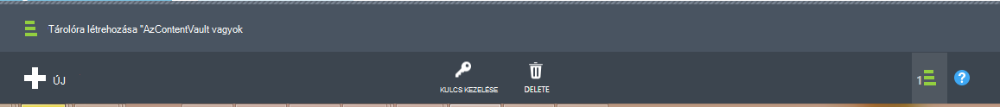

<properties
    pageTitle="Felkészülés a biztonsági mentésben Azure virtuális gépeken futó környezet |} Microsoft Azure"
    description="Ellenőrizze, hogy a környezet készült az Azure virtuális gépeken futó mentésével"
    services="backup"
    documentationCenter=""
    authors="markgalioto"
    manager="cfreeman"
    editor=""
    keywords="biztonsági másolatok; biztonsági másolat;"/>

<tags
    ms.service="backup"
    ms.workload="storage-backup-recovery"
    ms.tgt_pltfrm="na"
    ms.devlang="na"
    ms.topic="article"
    ms.date="08/26/2016"
    ms.author="trinadhk; jimpark; markgal;"/>


# <a name="prepare-your-environment-to-back-up-azure-virtual-machines"></a>A környezet készítsen biztonsági másolatot az Azure virtuális gépeken futó előkészítése

> [AZURE.SELECTOR]
- [Erőforrás-kezelő modell](backup-azure-arm-vms-prepare.md)
- [Klasszikus modell](backup-azure-vms-prepare.md)

Készíthet biztonsági másolatot az Azure virtuális gép (virtuális), mielőtt vannak három feltételt kell megtalálható.

- Hozzon létre egy biztonsági tárolóból elemre, vagy egy meglévő biztonsági tárolóra *ugyanabban a régióban, mint a virtuális*azonosítani kell.
- Az Azure nyilvános Internet-címeket és Azure tároló végpontjait közötti hálózati kapcsolatot létrehozni.
- A virtuális virtuális ügynököt.

Ha tudja, hogy a környezetben már létezik ezen feltételek majd folytassa a [biztonsági másolatot készíteni a VMs cikk](backup-azure-vms.md). Egyéb esetben Olvasson tovább, ez a cikk végigvezeti a lépéseket követve készít biztonsági másolatot készíteni az Azure virtuális a környezetben.


## <a name="limitations-when-backing-up-and-restoring-a-vm"></a>Ha mentésével és visszaállításával egy virtuális korlátai

>[AZURE.NOTE] Azure magában az erőforrások létrehozásáról és használatáról a két környezetben modellek: [az erőforrás-kezelő és klasszikus](../resource-manager-deployment-model.md). A következő lista ismerteti a korlátozások, amikor üzembe helyezése a Klasszikus modell.

- A 16-nál több adat lemezen a virtuális gépeken futó mentésével nem támogatott.
- Virtuális gépeken futó fenntartott IP-címet, és nem meghatározott végpont mentésével nem támogatott.
- Adatok biztonsági másolatának csatolni virtuális csatlakoztatott hálózati meghajtók nem tartalmazza. 
- Egy meglévő virtuális gép cseréje visszaállítás során nem támogatott. Először törölje a meglévő virtuális gép és bármely társított lemezen, és kattintson az adatok visszaállítása biztonsági másolatból.
- Idegen-terület biztonsági mentési és visszaállítási nem támogatott.
- Minden nyilvános régióban az Azure virtuális gépeken futó mentésével az Azure biztonsági másolat szolgáltatás használatával támogatott (lásd: támogatott régiók a [Feladatlista](https://azure.microsoft.com/regions/#services) ). Ha az régiót, amelynek a keresett jelenleg nem támogatott, azt nem jelenik a legördülő lista tárolóra létrehozása során.
- Az Azure biztonsági másolat szolgáltatás segítségével virtuális gépeken futó mentésével csak választó operációs rendszer verziója támogatott:
  - **Linux**: Azure biztonsági másolat támogatja a [listája, amely a Azure záradékkal terjesztését](../virtual-machines/virtual-machines-linux-endorsed-distros.md) Core OS Linux kivételével. Más Előrehozás-a-Öné-Linux terjesztését is működnek mindaddig, amíg a virtuális agent érhető el a virtuális gépen és Python létezik támogatása.
  - **A Windows Server**: Windows Server 2008 R2-nél korábbi verzióiban nem támogatott.
- A tartományvezérlőnek visszaállítása a többszörös-Adatközpont konfiguráció részét képező (Adatközpont) virtuális támogatott csak a PowerShell használatával. További információ [a többszörös-Adatközpont tartományvezérlőnek visszaállítása](backup-azure-restore-vms.md#restoring-domain-controller-vms).
- Az alábbi speciális hálózati beállításokat tartalmazó virtuális gépeken futó visszaállítása csak a PowerShell használatával támogatja. A visszaállítás munkafolyamat felhasználói felület használatával létrehozott VMs nem lesz hálózati őket a visszaállítási művelet befejezése után. További tudnivalókért olvassa el a [VMs visszaállítása a különleges hálózati beállítások](backup-azure-restore-vms.md#restoring-vms-with-special-netwrok-configurations)című témakört.
    - Virtuális gépeken futó betöltés terheléselosztó konfigurációja (belső és külső)
    - Virtuális gépeken futó több fenntartott IP-címmel
    - Virtuális gépeken futó több hálózati kártyával

## <a name="create-a-backup-vault-for-a-vm"></a>Hozzon létre egy biztonsági tárolóból elemre egy virtuális

A még a biztonsági mentés és helyreállítási pontok időbeli létrehozott tároló egységek egy biztonsági tárolóból elemre. A biztonsági másolat tárolóra is tartalmaz, a biztonsági házirendeket, amely a virtuális gépeken futó másolat készül fog vonatkozni.

Ezen a képen a különböző Azure biztonsági másolat szervezetek közötti kapcsolatokat ismerteti:     

A biztonsági másolat tárolóra létrehozása:

1. Jelentkezzen be az [Azure-portálon](http://manage.windowsazure.com/).

2. Az Azure-portálon kattintson az **Új** > **Hibrid integrációs** > **biztonsági másolatot**. **Biztonsági másolat**gombra kattintva, fog automatikus váltás a klasszikus portálra (a feljegyzés után jelenik meg).

    

    >[AZURE.NOTE] Ha előfizetése utolsó használta a klasszikus portálon, majd az előfizetés előfordulhat, hogy nyissa meg a klasszikus portál. Ebben az esetben a biztonsági másolat tárolóra pontra kattintva hozhat létre **Új** > **Data Services** > **Helyreállítási szolgáltatások** > **Biztonsági tárolóra** > **Gyors létrehozása** (lásd az alábbi képen).

    

3. A **név**írja be egy rövid nevet, amely azonosítja a tárolóból elemre. A név van szüksége az Azure előfizetés egyedinek kell lennie. Adjon egy nevet, amely a 2 és 50 karakter közötti tartalmazza. Egy betűvel kell kezdődnie, és csak betűket, számokat és kötőjelet is tartalmazhat.

4. **Régió**jelölje ki a földrajzi régióban esetében a tárolóból elemre. A tárolóból elemre a védelemmel ellátni kívánt virtuális gépeken futó azonos régió kell lennie. Virtuális gépeken futó több területre, ha az egyes régiókra létre kell hoznia egy biztonsági tárolóból elemre. Nem adja meg tároló fiókokat az adatok biztonsági másolatának – a biztonsági másolat tárolóból elemre, és a biztonsági másolat Azure szolgáltatás leíró tárolásához ez automatikusan nincs szükség.

5. Az **előfizetés** válassza azt az előfizetést, a biztonsági másolat tárolóra társítani szeretné. Lesznek több lehetőség csak akkor, ha a szervezeti fiók társítva több Azure előfizetés.

6. Kattintson a **Hozzon létre a tárolóból elemre**. Eltarthat egy ideig a létrehozandó a biztonsági másolat tárolóból elemre. Figyelje meg a állapotát jelző a portálon alján.

    

7. Üzenet fog győződjön meg arról, hogy a tárolóra létrehozása sikeresen befejeződött. Akkor megjelenik a **helyreállítási-szolgáltatások** lapon **aktív**. Ellenőrizze, hogy a tárolóra létrehozását követően, válassza ki a megfelelő tárolási redundancia beállítás jobbra. További információ [a beállítást tároló redundancia a a biztonsági másolat tárolóból elemre](backup-configure-vault.md#azure-backup---storage-redundancy-options).

    

8. Kattintson az Ugrás az **Első lépések** lap hol jelennek meg az utasításokat Azure virtuális gépeken futó mentésével biztonsági tárolóból elemre.

    


## <a name="network-connectivity"></a>A hálózati kapcsolat

Annak érdekében, hogy a virtuális pillanatképek kezelése, a biztonsági másolat bővítmény van szüksége a kapcsolatot az Azure nyilvános IP-címeket. A jobb oldali internetkapcsolat nélkül a virtuális gép HTTP kéri a időkorlátja, és a biztonsági másolat művelet sikertelen lesz. Ha a telepítő hozzáférés-korlátozásait helyen (a hálózat biztonsági csoport (NSG), például), válassza az törlése az elérési nyújtó biztonsági forgalom az alábbi lehetőségek egyikét:

- [Csak jelszóval módosítható tartományok Whitelist az Azure adatközpont IP](http://www.microsoft.com/en-us/download/details.aspx?id=41653) - hogyan való whitelist az IP-címek útmutatást a cikk tartalmaz.
- Az adatforgalom HTTP-proxy kiszolgáló üzembe.

Melyik lehetőség, amellyel kiválasztásakor a kompromisszumok kezelhetőség, a részletes vezérlő, és a költség között van.

|A beállítás|Előnyei|Hátrányai|
|------|----------|-------------|
|Whitelist IP-címtartományai| Nincs többletköltségek.<br><br>Access-NSG megnyithatja, használja a <i>Set-AzureNetworkSecurityRule</i> parancsmag. | Összetett kezeléséhez, a probléma által sújtott IP-címtartományai időről időre változnak.<br><br>Azure, és nem csak a tárterület a teljes hozzáférést biztosít.|
|HTTP-proxy| A tároló az előnézeti részletes szabályozható URL-címek engedélyezett.<br>Szimpla VMs pont az interneten keresztüli elérését.<br>Nem fizetnie Azure IP-cím változását.| Többletköltségek egy virtuális futtatásához a proxy szoftverrel.|

### <a name="whitelist-the-azure-datacenter-ip-ranges"></a>Whitelist az Azure adatközpont IP-tartományok

Whitelist az Azure adatközpont IP-tartományokat, a következő témakörben további információt a [webhely Azure](http://www.microsoft.com/en-us/download/details.aspx?id=41653) az IP-tartományokat, és az utasításokat.

### <a name="using-an-http-proxy-for-vm-backups"></a>HTTP-proxy használatáról virtuális biztonsági másolatok
Egy virtuális mentésével, amikor a virtuális meg a biztonsági másolat bővítmény küld a pillanatkép kezeléséhez szükséges parancsokat Azure tárolási egy HTTPS API-t használja. A forgalmat a biztonságimásolat-bővítmény a HTTP-proxyn keresztül mivel ez éppen a beállított nyilvános Internet-hozzáféréssel csak összetevőt.

>[AZURE.NOTE] A proxykiszolgáló szoftver használandó nincs javaslat nem. Győződjön meg arról, hogy Ön felveszi a proxy, hogy kompatibilis-e az alábbi konfigurálási lépéseket.

Az alábbi példa képen látható a három konfigurálási lépéseket kell használni a HTTP-proxy:

- Alkalmazás virtuális forgalom az összes HTTP-Proxy virtuális nyilvános internetre kötött.
- Virtuális proxy lehetővé teszi, hogy bejövő forgalmat a VMs a virtuális hálózaton.
- A hálózati biztonsági csoport (NSG) nevű NSF-zárolási szüksége van egy biztonsági szabály lehetővé tevő kimenő internetes forgalmat a Proxy virtuális.


A HTTP-proxy nyilvános internetkapcsolat kommunikáció használatához kövesse az alábbi lépéseket:

#### <a name="step-1-configure-outgoing-network-connections"></a>Lépés: 1. Kimenő hálózati kapcsolatainak konfigurálása
###### <a name="for-windows-machines"></a>A Windows gépekhez
Ez lesz telepítő proxykiszolgáló helyi rendszer fiók beállításait.

1. [PsExec](https://technet.microsoft.com/sysinternals/bb897553) letöltése
2. Futtassa a következő parancsot, emelt parancssorából

     ```
     psexec -i -s "c:\Program Files\Internet Explorer\iexplore.exe"
     ```
     Ennek hatására megnyílik az internet explorer-ablakot.
3. Ugrás a eszközök -> Internetbeállítások -> kapcsolatok -> helyi hálózati beállítások.
4. Ellenőrizze a System fiók proxybeállításait. Állítsa be a proxykiszolgáló IP és port.
5. Zárja be az Internet Explorer.

Gépi szintű proxy konfiguráció beállítása lesz, és minden kimenő HTTP-/ HTTPS-forgalom használható.

Ha a telepítő a proxykiszolgáló a jelenlegi felhasználói fiók (nem egy helyi rendszerfiók), használja az alábbi parancsprogramot SYSTEMACCOUNT alkalmazni őket:

```
   $obj = Get-ItemProperty -Path Registry::”HKEY_CURRENT_USER\Software\Microsoft\Windows\CurrentVersion\Internet Settings\Connections"
   Set-ItemProperty -Path Registry::”HKEY_USERS\S-1-5-18\Software\Microsoft\Windows\CurrentVersion\Internet Settings\Connections" -Name DefaultConnectionSettings -Value $obj.DefaultConnectionSettings
   Set-ItemProperty -Path Registry::”HKEY_USERS\S-1-5-18\Software\Microsoft\Windows\CurrentVersion\Internet Settings\Connections" -Name SavedLegacySettings -Value $obj.SavedLegacySettings
   $obj = Get-ItemProperty -Path Registry::”HKEY_CURRENT_USER\Software\Microsoft\Windows\CurrentVersion\Internet Settings"
   Set-ItemProperty -Path Registry::”HKEY_USERS\S-1-5-18\Software\Microsoft\Windows\CurrentVersion\Internet Settings" -Name ProxyEnable -Value $obj.ProxyEnable
   Set-ItemProperty -Path Registry::”HKEY_USERS\S-1-5-18\Software\Microsoft\Windows\CurrentVersion\Internet Settings" -Name Proxyserver -Value $obj.Proxyserver
```

>[AZURE.NOTE] Ha proxykiszolgáló naplóban "(407) Proxyhitelesítés szükséges" figyelemmel követi azt, jelölje be a authrntication helyesen beállítva.

######<a name="for-linux-machines"></a>Linux gépekhez

Az alábbi sor hozzáadása a ```/etc/environment``` fájl:

```
http_proxy=http://<proxy IP>:<proxy port>
```

A következő sorokat szeretne hozzáadni a ```/etc/waagent.conf``` fájl:

```
HttpProxy.Host=<proxy IP>
HttpProxy.Port=<proxy port>
```

#### <a name="step-2-allow-incoming-connections-on-the-proxy-server"></a>Lépés: 2. A proxykiszolgáló bejövő kapcsolatokkal engedélyezése:

1. Nyissa meg a Windows tűzfal a proxykiszolgálón. A tűzfal eléréséhez legegyszerűbben fokozott biztonságú Windows tűzfal kereséséhez.

    

2. A Windows tűzfal párbeszédpanelen kattintson a jobb gombbal a **Bejövő szabályok** , és kattintson az **Új szabály...**.

    

3. Az **Új bejövő szabály varázsló** **Szabálytípus** az **egyéni** lehetőséget választja, és kattintson a **Tovább**gombra.

4. Jelölje be a **Program**a lapon válassza a **Minden program** , és kattintson a **Tovább**gombra.

5. A **Protocol (protokoll) és a portokra** lapon írja be az alábbi adatokat, és kattintson a **Tovább**gombra:

    

    - *protokoll* válassza ki a *TCP*
    - *helyi port* válassza az *Adott portok*, az alábbi mezőben adja meg a ```<Proxy Port>``` be van állítva.
    - *Távoli port* válassza a *Minden port*

    Teljes mértékben a befejezéséhez kattintson a varázsló további lépéseit, és nevezze el a szabályon.

#### <a name="step-3-add-an-exception-rule-to-the-nsg"></a>3 a lépést. A kivétel szabály hozzáadása a NSG:

Az Azure PowerShell a parancssorba írja be a következő parancsot:

A következő parancsot hozzáadja az NSG kivételt. Ez a kivétel lehetővé teszi, hogy a TCP-forgalmat a minden olyan portot 10.0.0.5 a port (HTTP) 80 és 443-as (HTTPS) bármely internetes címre. Ha szüksége van egy adott port nyilvános internetkapcsolat a, ügyeljen arra, hogy a port hozzáadása a ```-DestinationPortRange``` is.

```
Get-AzureNetworkSecurityGroup -Name "NSG-lockdown" |
Set-AzureNetworkSecurityRule -Name "allow-proxy " -Action Allow -Protocol TCP -Type Outbound -Priority 200 -SourceAddressPrefix "10.0.0.5/32" -SourcePortRange "*" -DestinationAddressPrefix Internet -DestinationPortRange "80-443"
```

*Győződjön meg arról, hogy az adott telepítéshez megfelelő adataival cserélje le a példában a neveket.*


## <a name="vm-agent"></a>Virtuális agent

Mielőtt készíthet biztonsági másolatot az Azure virtuális gép, győződjön meg róla, hogy az Azure virtuális ügynök megfelelően telepítve van a virtuális gépen. Mivel a virtuális agent választható összetevő a virtuális gép létrehozott időben, győződjön meg arról, hogy a az virtuális ügynök jelölőnégyzetet a virtuális gép már kiépítve előtt.

### <a name="manual-installation-and-update"></a>Manuális telepítés és frissítése

A virtuális agent már szerepel a Azure gyűjteményből létrehozott VMs. Virtuális gépeken futó helyszíni adatközpontokkal az áttelepítendő azonban nem áll a virtuális agent. Az ilyen VMs a virtuális agent kell telepíteni explicit módon. További információ [a virtuális ügynök egy meglévő virtuális telepítése](http://blogs.msdn.com/b/mast/archive/2014/04/08/install-the-vm-agent-on-an-existing-azure-vm.aspx).

| **Művelet** | **A Windows** | **Linux** |
| --- | --- | --- |
| A virtuális agent telepítése | <li>Töltse le és telepítse az [MSI ügynök](http://go.microsoft.com/fwlink/?LinkID=394789&clcid=0x409). A telepítés elvégzéséhez rendszergazdai jogosultságokkal kell. <li>[A virtuális tulajdonság frissítéséhez](http://blogs.msdn.com/b/mast/archive/2014/04/08/install-the-vm-agent-on-an-existing-azure-vm.aspx) jelzi, hogy telepítve van-e a agent. | <li> Telepítse a legújabb [Linux ügynök](https://github.com/Azure/WALinuxAgent) GitHub. A telepítés elvégzéséhez rendszergazdai jogosultságokkal kell. <li> [A virtuális tulajdonság frissítéséhez](http://blogs.msdn.com/b/mast/archive/2014/04/08/install-the-vm-agent-on-an-existing-azure-vm.aspx) jelzi, hogy telepítve van-e a agent. |
| A virtuális agent frissítése | Frissítés a virtuális agent akkor egyszerűen, a [virtuális ügynök bináris](http://go.microsoft.com/fwlink/?LinkID=394789&clcid=0x409)újratelepítése. <br><br>Győződjön meg arról, hogy nincs biztonsági mentést fut-e a virtuális agent frissítése közben. | Kövesse a képernyőn megjelenő utasításokat [a Linux virtuális agent frissítése ](../virtual-machines-linux-update-agent.md). <br><br>Győződjön meg arról, hogy nincs biztonsági mentést fut-e a virtuális agent frissítése közben. |
| A virtuális ügynök telepítés érvényesítése | <li>Nyissa meg a Azure virtuális *C:\WindowsAzure\Packages* mappájában. <li>Keresse meg a bemutató WaAppAgent.exe fájlt.<li> Kattintson a jobb gombbal a fájlra, válassza a **Tulajdonságok parancsot**, és válassza a **Részletek** fülre. A termék verziója írjuk 2.6.1198.718 vagy újabb verziójában. | A #HIÁNYZIK |


Tudnivalók a [virtuális ügynök](https://go.microsoft.com/fwLink/?LinkID=390493&clcid=0x409) és [útmutatást adunk a telepítés](https://azure.microsoft.com/blog/2014/04/15/vm-agent-and-extensions-part-2/).

### <a name="backup-extension"></a>Biztonsági másolat bővítmény

Biztonsági másolatot a virtuális gép, hogy az Azure biztonsági másolat szolgáltatás telepítése kiterjesztése a virtuális agent. A biztonsági másolat Azure szolgáltatás zökkenőmentes frissíti és összekapcsolja a biztonsági másolat bővítmény további felhasználói beavatkozás nélkül.

A biztonsági másolat kiterjesztése a virtuális működik, ha van telepítve. A futó virtuális is biztosít egy alkalmazás egységes helyreállítási pont első legnagyobb lehetőségét. Azonban a Azure biztonsági másolat szolgáltatás továbbra is a biztonsági másolat készítése a virtuális –, még akkor is, ha ki van kapcsolva, és a bővítmény nem lehet telepíteni (más néven Offline virtuális). Ebben az esetben a helyreállítási pont lesz *egységes összeomlik* a fent ismertetett.


## <a name="questions"></a>Kérdések?
Ha kérdései vannak, vagy bármely funkció, amely tartalmazza, hogy milyen [küldjön visszajelzést](http://aka.ms/azurebackup_feedback).

## <a name="next-steps"></a>Következő lépések
Most, hogy a környezet a virtuális mentésével készített, a következő logikai lépésként biztonsági másolatot készíteni. A tervezési cikkben VMs mentésével kapcsolatos részletes tudnivalókat.

- [Készítsen biztonsági másolatot virtuális gépeken futó](backup-azure-vms.md)
- [A virtuális biztonsági infrastruktúra megtervezése](backup-azure-vms-introduction.md)
- [Virtuális gép biztonsági másolatok kezelése](backup-azure-manage-vms.md)
