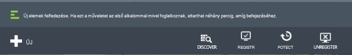
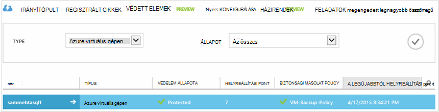

<properties
    pageTitle="Készítsen biztonsági másolatot az Azure virtuális gépeken futó |} Microsoft Azure"
    description="Fedezze fel, regisztrálja, majd készítsen biztonsági másolatot a virtuális gépeken futó Azure virtuális gép biztonsági másolatának ezekkel az eljárásokkal."
    services="backup"
    documentationCenter=""
    authors="markgalioto"
    manager="jwhit"
    editor=""
    keywords="virtuális gép biztonsági mentés; Készítsen biztonsági másolatot virtuális gép; biztonsági mentési és katasztrófa helyreállítási; virtuális biztonsági mentése"/>

<tags
    ms.service="backup"
    ms.workload="storage-backup-recovery"
    ms.tgt_pltfrm="na"
    ms.devlang="na"
    ms.topic="article"
    ms.date="09/28/2016"
    ms.author="trinadhk; jimpark; markgal;"/>

# Készítsen biztonsági másolatot az Azure virtuális gépeken futó

> [AZURE.SELECTOR]
- [Biztonsági másolatot készíthet VMs helyreállítási szolgáltatások tárolóból elemre.](backup-azure-arm-vms.md)
- [Biztonsági másolatot készíthet VMs biztonsági másolat tárolóból elemre.](backup-azure-vms.md)

Ez a cikk lépéseit a biztonsági másolatot a klasszikus rendszerbe Azure virtuális gép (virtuális) a biztonsági másolat tárolóból elemre. Nincsenek gondoskodik a előtt készíthet biztonsági másolatot az Azure virtuális gépen kell néhány feladatok. Ha, még nem tette meg, végezze el a [Előfeltételek](backup-azure-vms-prepare.md) a környezet a VMs mentésével való előkészítéséhez.

További információ című témakörben olvashat [Azure-ban a virtuális biztonsági infrastruktúrájára tervezési](backup-azure-vms-introduction.md) és [Azure virtuális gépeken futó](https://azure.microsoft.com/documentation/services/virtual-machines/).

>[AZURE.NOTE] Azure van két telepítési modellekkel létrehozásáról és használatáról az erőforrások: [az erőforrás-kezelő és klasszikus](../resource-manager-deployment-model.md). A biztonsági másolat tárolóra csak megvédheti VMs klasszikus rendszerbe. A biztonsági másolat tárolóból elemre az erőforrás-kezelő rendszerbe VMs nem védelme. Lásd: a [biztonsági másolatot VMs helyreállítási szolgáltatások tárolóból elemre kattintva](backup-azure-arm-vms.md) további információt a helyreállítási szolgáltatások tárolókban használata.

Azure virtuális gépeken futó mentésével három fő lépésből áll:

>[AZURE.NOTE] Virtuális gépeken futó mentésével az egy helyi folyamat. Nem készíthet biztonsági másolatot virtuális gépeken futó egy tartományban lévő egy másik tartományban lévő egy biztonsági tárolóból elemre kattintva. Létre kell hoznia egy biztonsági tárolóból elemre Azure területenként, ahol nincsenek VMs biztonsági másolatot.

## Lépés: 1 – Azure virtuális gépeken futó felfedezése
Győződjön meg arról, hogy minden új virtuális gépeken futó (VMs) hozzáadása az előfizetéshez Regisztrálás a feltárás folyamat futtatása előtt azonosítja. A folyamat lekérdezések Azure virtuális gépeken futó az előfizetést, és további információt a listája, mint a felhőalapú szolgáltatás neve és a régió.

1. Jelentkezzen be a [Klasszikus portál](http://manage.windowsazure.com/)

2. Azure szolgáltatások listájában kattintson a **Helyreállítás szolgáltatások** biztonsági mentése és a webhely helyreállítási tárolókban listájának megnyitásához.
    

3. Biztonsági másolat tárolókban listájában jelölje ki a biztonsági másolat készítése a virtuális a tárolóból elemre.

    Ha ez egy új tárolóból elemre a portálon a **Rövid** kezdőlappal nyílik meg.

    

    Ha korábban már konfigurálva a a tárolóból elemre, a portálon a legutóbb használt menü nyílik meg.

4. A menüből tárolóból elemre (az oldal tetején) válassza a **Registered elemet**.

    

5. A **típus** listában jelölje ki **Azure virtuális gépen**.

    

6. Kattintson a **DISCOVER** az oldal alján.
    

    A keresési folyamatának néhány percig is eltarthat, amíg a virtuális gépeken futó vannak alatt álló táblázatos. Van egy értesítést, amely lehetővé teszi, hogy fut-e a folyamatot, hogy a képernyő alján.

    

    Az értesítés módosításokat a folyamat befejezéséhez. A feltáráshoz használt folyamat nem találta meg a virtuális gépeken futó, ha először ellenőrizze a VMs címtartományokhoz. Ha a VMs létezik, győződjön meg róla, a VMs szerepelnek a biztonságimásolat-tárolóra azonos régió. Ha a VMs léteznek és ugyanabban a régióban, győződjön meg róla, a VMs már nem regisztrált egy biztonsági tárolóból elemre kattintva. Ha egy virtuális van hozzárendelve egy másik biztonsági tárolókban hozzárendelni nem érhető el biztonsági tárolóból elemre.

    

    Az új elemek van talált, folytassa a 2, és a VMs regisztrálni.

##  Lépés: 2 - nyilvántartás Azure virtuális gépeken futó
Rögzítheti az Azure virtuális gép társíthatja az Azure biztonsági másolat szolgáltatást. Ez általában a egy egyszeri tevékenységet.

1. Nyissa meg azt az Azure-portálon a **Helyreállítási szolgáltatások** biztonsági tárolóból elemre, és kattintson a **Registered elemek**.

2. A legördülő menüből válassza az **Azure virtuális gépen** .

    

3. Kattintson a lap alján a **REGISZTRÁCIÓ** .
    

4. Jelölje ki a **Regisztráció elemek** helyi menü regisztrálni kívánt virtuális gépeken futó. Ha két vagy több virtuális gépeken futó azonos nevű, megkülönböztetni őket a felhőalapú szolgáltatást használhatja.

    >[AZURE.TIP] Egyszerre több virtuális gépeken futó lehet regisztrálni.

    A feladat, amely a kijelölt virtuális gépeken jön létre.

5. Kattintson a **Feladat megtekintése** az értesítésben, ahol a **feladatok** lap megnyitásához.

    

    A virtuális gép is megjelenik a bejegyzett elemeket, és a regisztrációs művelet állapotának listájában.

    

    Amikor a művelet befejeződött, az állapotot, megfelelően *regisztrált* állapotát.

    

## Lépés a 3 - Azure virtuális gépeken futó védelme
Most már beállíthatja a virtuális gép biztonsági mentése és az adatmegőrzési házirend. Több virtuális gépeken futó védhetők egyetlen használatával művelet védelme.

Létrehozása után május 2015 jár az Azure biztonsági másolat tárolókban alapértelmezett házirend beépített a tárolóból elemre. Ez az alapértelmezett házirend egy alapértelmezett adatmegőrzési 30 nap és naponta egyszer mentési ütemezés megtalálható.

1. Nyissa meg azt az Azure-portálon a **Helyreállítás szolgáltatások** biztonsági tárolóból elemre, és kattintson a **Registered elemek**.
2. A legördülő menüből válassza az **Azure virtuális gépen** .

    

3. Kattintson a **védelem** az oldal alján.

    Megjelenik a **védelme elemek varázsló** . A varázsló csak megjeleníti a virtuális gépeken futó regisztrálva és a nem védett. Jelölje ki a védelemmel ellátni kívánt virtuális gépeken futó.

    Ha két vagy több virtuális gépeken futó azonos nevű, a virtuális gépeken futó megkülönböztetni a felhőalapú szolgáltatást használhatja.

    >[AZURE.TIP] Egyszerre több virtuális gépeken futó megvédheti.

    

4. Készítsen biztonsági másolatot a kijelölt széljegyzetek virtuális gépeken futó **ütemezett biztonsági mentés** végrehajtása Válassza a meglévő készletből házirendek, vagy meg egy újat.

    Egyes biztonsági házirendek beállíthatja, hogy több virtuális gépeken futó társítva. Azonban a virtuális gép csak társítható egy házirend adott bármikor időben.

    

    >[AZURE.NOTE] Biztonsági másolat házirendet a adatmegőrzési sablonjának az ütemezett biztonsági másolatok tartalmazza. Ha egy meglévő biztonsági házirend lehetőséget választja, a következő lépésben az adatmegőrzési beállítások nem módosíthatja.

5. Válassza a biztonsági másolatok társíthatja **adatmegőrzési tartományban** .

    

    Adatmegőrzési szabály adja meg a biztonsági tárolásához idejének hosszát. Megadhatja, hogy a különböző adatmegőrzési házirendek alapján, ha a biztonsági mentés származik. Biztonsági másolat pont naponta készített (Ez a működési helyreállítási pontként szolgál) például 90 napig kell őrizni. Összehasonlító (az ellenőrzés szempontjából) negyedévenként végén készített biztonsági pont lehet sok hónapok vagy évek maradnak.

    

    Ez a példa képe:

    - **Napi adatmegőrzési**: napi készített biztonsági másolatok 30 napig tárolja.
    - **Heti adatmegőrzési**: 104 hét vasárnappal hetente készített biztonsági másolatok megmaradnak.
    - **Havi adatmegőrzési**: minden egyes hónap utolsó vasárnappal készített biztonsági másolatok 120 hónapig megőrződnek.
    - **Éves adatmegőrzési**: minden január első vasárnappal készített biztonsági másolatok 99 évig megőrződnek.

    A védelem házirend konfigurálása és a a kijelölt széljegyzetek virtuális gépeken házirendhez a virtuális gépeken futó társítása egy feladat jön létre.

6. **Védelem beállítása** feladatok a tárolókban menüből listájának megtekintéséhez kattintson a **projektek** , és jelölje ki **A védelem beállítása** a **művelet** szűrő.

    

## Kezdeti biztonsági mentése
A virtuális gép szabálya védett, miután akkor jelenik meg a **Védett elemek** lapon a *védett - (függő első biztonsági)*állapotú. Az első ütemezett biztonsági másolat alapértelmezés szerint ki a *kezdeti biztonsági másolatot*.

A kezdeti biztonsági másolat kezdeményeznie közvetlenül azután, hogy védelem beállítása:

1. Kattintson a **Védett elemek** lap alján kattintson a **Biztonsági mentés gombra**.

    Az Azure biztonsági szolgáltatás létrehoz egy biztonsági mentési feladat az a kezdeti biztonsági mentést.

2. Kattintson a **feladatok** lap feladatok listájának megtekintéséhez.

    

>[AZURE.NOTE] A biztonsági másolat készítése közben az Azure biztonsági szolgáltatás hibák parancs a biztonsági másolat bővítmény a virtuális gépeken ürítse ki az összes írási feladatot, és egy következetes pillanatkép.

Amikor befejezte a kezdeti biztonsági mentést, a virtuális gépre, kattintson a **Védett elemek** lap állapota *védett*.

## Biztonsági másolat állapot és a részletek megtekintése
Miután védett, a virtuális gép számát is megnöveli **összefoglaló Irányítópultlap** . Az **Irányítópult** oldalát is az elmúlt 24 óra, amelyre *sikeres*volt, *nem sikerült*, és *a folyamatban*lévő feladatok száma látható. A **feladatok** lapon az **állapot**, a **művelet**vagy a **Kezdő** és **Záró** menük szűréséhez használni a feladatokat.

Az irányítópult értékek 24 óránként frissülnek.

## Hibák elhárítása
Ha biztonsági mentése közben hiba lép fel a virtuális gép, tekintse meg a [virtuális a cikk hibaelhárítási](backup-azure-vms-troubleshoot.md) segítséget.

## Következő lépések

- [Kezelése és a virtuális gépeken futó figyelése](backup-azure-manage-vms.md)
- [Virtuális gépeken futó visszaállítása](backup-azure-restore-vms.md)
