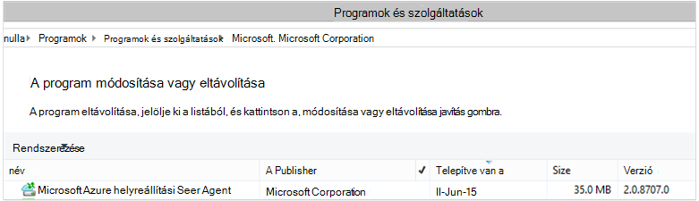

<properties
    pageTitle="Üzembe helyezéséhez és kezeléséhez biztonsági mentése a Windows Server/ügyfél PowerShell használatával |} Microsoft Azure"
    description="Megtudhatja, hogy miként telepítheti és kezelése a PowerShell használatá Azure biztonsági mentése"
    services="backup"
    documentationCenter=""
    authors="saurabhsensharma"
    manager="shivamg"
    editor=""/>

<tags
    ms.service="backup"
    ms.workload="storage-backup-recovery"
    ms.tgt_pltfrm="na"
    ms.devlang="na"
    ms.topic="article"
    ms.date="09/01/2016"
    ms.author="saurabhsensharma;markgal;jimpark;nkolli;trinadhk"/>


# <a name="deploy-and-manage-backup-to-azure-for-windows-serverwindows-client-using-powershell"></a>Üzembe helyezéséhez és kezeléséhez a biztonsági másolat Azure a Windows Server vagy Windows-ügyfél PowerShell használatával

> [AZURE.SELECTOR]
- [ARM](backup-client-automation.md)
- [Klasszikus](backup-client-automation-classic.md)

Ez a cikk bemutatja, hogyan állíthatja be a Windows Server vagy Windows-ügyfél biztonsági Azure, és biztonsági mentése és helyreállítása kezelése a PowerShell használata.

## <a name="install-azure-powershell"></a>Azure PowerShell telepítése

[AZURE.INCLUDE [learn-about-deployment-models](../../includes/learn-about-deployment-models-include.md)]

A Skype 2015 vállalati október Azure PowerShell 1.0 jelent meg. Ebben a kiadásban a 0.9.8 sikeres engedje fel, és a jelentős módosításokat, különösen a parancsmagok elnevezési szerkezetében vett fel. 1,0 parancsmagok, hajtsa végre a elnevezési minta {igei}-{főnévi}; AzureRm mivel a 0.9.8 nevek ne kerüljön bele az **erőforrás-kezelő** (például új-AzureRmResourceGroup új-AzureResourceGroup helyett). Azure PowerShell 0.9.8 használatakor, akkor először engedélyeznie kell az erőforrás-kezelő mód a **Kapcsoló-AzureMode AzureResourceManager** parancs futtatásával. Ez a parancs nem áll a 1.0 vagy újabb szükséges.

Ha a parancsfájlok a 0.9.8 írták használni kívánt környezetben, a 1.0 vagy újabb környezetben, gondosan tesztelje a parancsfájlok előtti munkakörnyezetben előtt használnia kell őket gyártás elkerülése érdekében a váratlan hatása.

[Töltse le a legújabb PowerShell verzióból](https://github.com/Azure/azure-powershell/releases) (szükséges minimális verziója: 1.0.0)


[AZURE.INCLUDE [arm-getting-setup-powershell](../../includes/arm-getting-setup-powershell.md)]


## <a name="create-a-backup-vault"></a>Hozzon létre egy biztonsági tárolóból elemre

> [AZURE.WARNING] Az Azure biztonsági másolat használata első alkalommal ügyfelek esetében regisztrálnia kell az Azure biztonsági másolat szolgáltató használható az előfizetéséhez. Ezt megteheti a következő parancs futtatásával: külső.FÜGGV-AzureProvider - ProviderNamespace "Microsoft.Backup"

Létrehozhat egy új biztonsági tárolóból elemre, a **New-AzureRMBackupVault** parancsmaggal. A biztonsági másolat tárolóból elemre egy ARM erőforrás, így kell egy erőforrás csoporton belül helyezze el. Az Azure PowerShell jogú konzolban futtassa az alábbi parancsokat:

```
PS C:\> New-AzureResourceGroup –Name “test-rg” -Region “West US”
PS C:\> $backupvault = New-AzureRMBackupVault –ResourceGroupName “test-rg” –Name “test-vault” –Region “West US” –Storage GeoRedundant
```

A **Get-AzureRMBackupVault** parancsmag használatával a biztonsági másolat tárolókban előfizetés a listában.


## <a name="installing-the-azure-backup-agent"></a>Az Azure biztonsági másolat ügynök telepítése
Mielőtt telepítené az Azure biztonsági másolat ügynök, a telepítő letöltött és a jelen van a Windows Server szükség. A telepítő a legújabb elérheti, a [Microsoft letöltőközpontból](http://aka.ms/azurebackup_agent) vagy a biztonsági másolat tárolóra Irányítópultlap. A telepítő ment egy könnyen hozzáférhető helyen, például a * C:\Downloads\*.

A agent telepítéséhez egy jogú PowerShell-konzolon futtassa a következő parancsot:

```
PS C:\> MARSAgentInstaller.exe /q
```

Ez a telepítést a agent, az alapértelmezett beállításokat. A telepítés néhány percig tart a háttérben. Ha nem adja meg a */nu* beállítás majd a **Windows Update** ablak bármely frissítések keresése gombot a telepítés végén nyílik meg. A telepítés után az ügynök jelennek meg a telepített programok listájában.

A telepített programok listájának megtekintéséhez nyissa meg a **Vezérlőpultot** > **programok** > **Programok és szolgáltatások**.



### <a name="installation-options"></a>Telepítési beállítások

Ha meg szeretné nézni a parancssori keresztül elérhető beállítások használja a következő parancsot:

```
PS C:\> MARSAgentInstaller.exe /?
```

A rendelkezésre álló beállítások a következők:

| A beállítás | Részletek | Alapértelmezett |
| ---- | ----- | ----- |
| / q | Csendes telepítés | - |
| / p: "hely" | A mappa elérési útját telepítési az Azure biztonsági másolat ügynök. | C:\Program Files\Microsoft Azure helyreállítási szolgáltatások Agent |
| / s: "hely" | A mappa elérési útját gyorsítótár az Azure biztonsági másolat ügynök. | C:\Program Files\Microsoft Azure helyreállítási szolgáltatások Agent\Scratch |
| /m | Részvétel a Microsoft Update | - |
| /Nu | Nem kereshet frissítéseket telepítés befejezése után | - |
| /d | Microsoft Azure helyreállítási szolgáltatások ügynök eltávolítása | - |
| /pH | A Host Proxycímére. | - |
| /po | A proxykiszolgáló Host Port száma | - |
| /Pu | A proxykiszolgáló Host felhasználónév | - |
| /pW | A proxykiszolgáló jelszó | - |


## <a name="registering-with-the-azure-backup-service"></a>Regisztrálás az Azure biztonsági másolat szolgáltatással
Mielőtt rögzítheti az Azure biztonsági szolgáltatás, győződjön meg arról, hogy teljesülnek-e a [előfeltételekről](backup-configure-vault.md) szeretne. A következők szükségesek:

- Van érvényes Azure előfizetésem
- Van egy biztonsági tárolóból elemre

A tárolóból elemre hitelesítő adatok letöltéséről **Get-AzureRMBackupVaultCredentials** futtassa az Azure PowerShell konzolban és tárolja azt egy helyen, például a * C:\Downloads\*.

```
PS C:\> $credspath = "C:\"
PS C:\> $credsfilename = Get-AzureRMBackupVaultCredentials -Vault $backupvault -TargetLocation $credspath
PS C:\> $credsfilename
f5303a0b-fae4-4cdb-b44d-0e4c032dde26_backuprg_backuprn_2015-08-11--06-22-35.VaultCredentials
```

Regisztráció a tárolóból elemre a gép befejeződött a [Kezdés-OBRegistration](https://technet.microsoft.com/library/hh770398%28v=wps.630%29.aspx) parancsmaggal:

```
PS C:\> $cred = $credspath + $credsfilename
PS C:\> Start-OBRegistration -VaultCredentials $cred -Confirm:$false

CertThumbprint      : 7a2ef2caa2e74b6ed1222a5e89288ddad438df2
SubscriptionID      : ef4ab577-c2c0-43e4-af80-af49f485f3d1
ServiceResourceName : test-vault
Region              : West US

Machine registration succeeded.
```

> [AZURE.IMPORTANT] Ne használjon relatív elérési utak megadása a tárolóból elemre hitelesítő adatok fájl. Abszolút elérési út-parancsmag bemeneti adataiként meg kell adnia.

## <a name="networking-settings"></a>Hálózati beállítások
Ha a Windows gépen az internet kapcsolatot proxykiszolgálón keresztül, a proxy beállításai is biztosítható, hogy a ügynökének. Ebben a példában nincs proxy kiszolgáló, így azt is kifejezetten törölje a jelet a proxykiszolgáló kapcsolatos információkat.

Sávszélesség-használat is vezérelhető lehetőségek ```work hour bandwidth``` és ```non-work hour bandwidth``` a hét napjai egy adott csoportjához.

A proxy és sávszélesség részletek megadása befejeződött a [Set-OBMachineSetting](https://technet.microsoft.com/library/hh770409%28v=wps.630%29.aspx) parancsmaggal:

```
PS C:\> Set-OBMachineSetting -NoProxy
Server properties updated successfully.

PS C:\> Set-OBMachineSetting -NoThrottle
Server properties updated successfully.
```

## <a name="encryption-settings"></a>Titkosítási beállítások
Azure biztonsági küldött adatok biztonsági másolatának titkosítva van titkosságának az adatokat. A titkosítási jelszó az a "jelszó" visszafejteni az adatokat a visszaállítás idején.

```
PS C:\> ConvertTo-SecureString -String "Complex!123_STRING" -AsPlainText -Force | Set-OBMachineSetting
Server properties updated successfully
```

> [AZURE.IMPORTANT] Hogy a jelszó adatai biztonságos be van állítva. Nem lehet visszaállítani az adatokat az Azure anélkül, hogy a jelszó.

## <a name="back-up-files-and-folders"></a>Fájlok és mappák biztonsági mentése
Az összes a biztonsági másolatok a Windows-kiszolgálók és ügyfelek Azure biztonsági másolatot készít a házirend irányadók. A házirend három részből áll:

1. **Biztonsági mentési ütemezés** , amely meghatározza, hogy mikor kell venni, és szinkronizálja a szolgáltatást az kell-e a biztonsági másolatok.
2. **Adatmegőrzési ütemtervet** , mennyi ideig adja meg, amely megőrzi az Azure-ban a helyreállítási pontokat.
3. Egy **fájl elküldésének/való felelősség kizárását specifikációja** szabja meg, mi is készítsen biztonsági másolatot.

A dokumentumban azt is automatizálása biztonsági mentés óta fogja feltételezzük semmi van beállítva. Az első lépések: hozzon létre egy új biztonsági házirendet a [New-OBPolicy](https://technet.microsoft.com/library/hh770416.aspx) parancsmaggal, és azt használja.

```
PS C:\> $newpolicy = New-OBPolicy
```

Ekkor a házirend üres és más parancsmagok szükséges elemek lesznek meghatározásához belefoglalt vagy kizárt, amikor biztonsági másolatok futtatható, és ha a biztonsági másolatok kíván tárolni.

### <a name="configuring-the-backup-schedule"></a>Az ütemezés konfigurálása
Az első házirend 3 részeinek a biztonsági mentés ütemezése, és a [New-OBSchedule](https://technet.microsoft.com/library/hh770401) parancsmaggal jön létre. A biztonsági mentés ütemezése határozza meg, hogy milyen biztonsági másolatok kell tenni. A kimutatás létrehozásakor meg kell adnia a 2 bemeneti paramétereket:

- **A hét napjai** működnie kell a biztonsági mentés. Csak egy napon a biztonsági mentést, vagy a hét minden napján, vagy a köztük lévő tetszőleges futtathatja.
- **A napi időpontok** kell a biztonsági mentés futtatásakor. Legfeljebb 3 különböző időpontot, amikor a biztonsági mentés aktiválódik napjának határozhatja meg.

Is beállítható, például egy biztonsági házirendet, amely minden és Vasárnapból lefut 4 du.

```
PS C:\> $sched = New-OBSchedule -DaysofWeek Saturday, Sunday -TimesofDay 16:00
```

A biztonsági mentés ütemezése kell társítani egy házirendet, és ez a [Set-OBSchedule](https://technet.microsoft.com/library/hh770407) parancsmaggal érhető el.

```
PS C:> Set-OBSchedule -Policy $newpolicy -Schedule $sched
BackupSchedule : 4:00 PM Saturday, Sunday, Every 1 week(s) DsList : PolicyName : RetentionPolicy : State : New PolicyState : Valid
```
### <a name="configuring-a-retention-policy"></a>Adatmegőrzési házirend beállítása
Az adatmegőrzési határozza meg, hogy mennyi ideig biztonsági feladatok alapján készített helyreállítási pontok megőrződnek. A [New-OBRetentionPolicy](https://technet.microsoft.com/library/hh770425) parancsmaggal új adatmegőrzési szabály létrehozásakor megadhatja a biztonsági másolat helyreállítási pontok kell őrzi meg a biztonsági másolat Azure napok számát. Az alábbi példában a napján adatmegőrzési szabály állítja be.

```
PS C:\> $retentionpolicy = New-OBRetentionPolicy -RetentionDays 7
```

Az adatmegőrzési társított kell parancsmaggal a [Set-OBRetentionPolicy](https://technet.microsoft.com/library/hh770405)kiemelten:

```
PS C:\> Set-OBRetentionPolicy -Policy $newpolicy -RetentionPolicy $retentionpolicy

BackupSchedule  : 4:00 PM
                  Saturday, Sunday,
                  Every 1 week(s)
DsList          :
PolicyName      :
RetentionPolicy : Retention Days : 7

                  WeeklyLTRSchedule :
                  Weekly schedule is not set

                  MonthlyLTRSchedule :
                  Monthly schedule is not set

                  YearlyLTRSchedule :
                  Yearly schedule is not set

State           : New
PolicyState     : Valid
```
### <a name="including-and-excluding-files-to-be-backed-up"></a>Ideértve és biztonsági másolat készül a fájlok kivételével
Egy ```OBFileSpec``` objektum a szerepelnek, és a biztonsági másolatot a kizárt fájlok határozza meg. Ez a szabályhalmaz, hogy a hatókör meg védett fájlok és mappák gépen. Lehet, hogy sok elküldésének vagy kizárás szabályok szükség szerint a fájl, és egy szabály társítása őket. Új OBFileSpec objektum létrehozásakor a következőkre van lehetősége:

- Adja meg a fájlokat és mappákat része lesz
- Adja meg a fájlokat és mappákat kihagyandó
- Adja meg a rekurzív biztonságimásolat-adatok egy mappát (vagy) csak a megadott mappába a legfelső szintű fájlok e készítsen biztonsági másolatot.

Az utóbbi érhető el a nem rekurzív - jelző a New-OBFileSpec parancs használatával.

Az alábbi példában hogy miként mennyiségi kevésbé részletes C: és D:, és a Windows-mappába és az ideiglenes mappák OS bináris kizárása. Hozzunk létre fogja ehhez két fájl parancsmaggal a [New-OBFileSpec](https://technet.microsoft.com/library/hh770408) - valamelyik felvételre jellemzői és egy való felelősség kizárását. A fájl jellemzői létrehozása után is legyenek társított a [Hozzáadás-OBFileSpec](https://technet.microsoft.com/library/hh770424) parancsmaggal házirend.

```
PS C:\> $inclusions = New-OBFileSpec -FileSpec @("C:\", "D:\")

PS C:\> $exclusions = New-OBFileSpec -FileSpec @("C:\windows", "C:\temp") -Exclude

PS C:\> Add-OBFileSpec -Policy $newpolicy -FileSpec $inclusions

BackupSchedule  : 4:00 PM
                  Saturday, Sunday,
                  Every 1 week(s)
DsList          : {DataSource
                  DatasourceId:0
                  Name:C:\
                  FileSpec:FileSpec
                  FileSpec:C:\
                  IsExclude:False
                  IsRecursive:True

                  , DataSource
                  DatasourceId:0
                  Name:D:\
                  FileSpec:FileSpec
                  FileSpec:D:\
                  IsExclude:False
                  IsRecursive:True

                  }
PolicyName      :
RetentionPolicy : Retention Days : 7

                  WeeklyLTRSchedule :
                  Weekly schedule is not set

                  MonthlyLTRSchedule :
                  Monthly schedule is not set

                  YearlyLTRSchedule :
                  Yearly schedule is not set

State           : New
PolicyState     : Valid


PS C:\> Add-OBFileSpec -Policy $newpolicy -FileSpec $exclusions

BackupSchedule  : 4:00 PM
                  Saturday, Sunday,
                  Every 1 week(s)
DsList          : {DataSource
                  DatasourceId:0
                  Name:C:\
                  FileSpec:FileSpec
                  FileSpec:C:\
                  IsExclude:False
                  IsRecursive:True
                  ,FileSpec
                  FileSpec:C:\windows
                  IsExclude:True
                  IsRecursive:True
                  ,FileSpec
                  FileSpec:C:\temp
                  IsExclude:True
                  IsRecursive:True

                  , DataSource
                  DatasourceId:0
                  Name:D:\
                  FileSpec:FileSpec
                  FileSpec:D:\
                  IsExclude:False
                  IsRecursive:True

                  }
PolicyName      :
RetentionPolicy : Retention Days : 7

                  WeeklyLTRSchedule :
                  Weekly schedule is not set

                  MonthlyLTRSchedule :
                  Monthly schedule is not set

                  YearlyLTRSchedule :
                  Yearly schedule is not set

State           : New
PolicyState     : Valid
```

### <a name="applying-the-policy"></a>A házirend alkalmazása
Most a csoportházirend-objektum befejeződött és ütemezett társított biztonsági mentés, adatmegőrzési, a fájlok egy elküldésének/kizárási listája. Ezzel a házirenddel most már az Azure biztonsági másolat lekötött. Alkalmazása előtt az újonnan létrehozott házirend győződjön meg arról, hogy nincsenek-e a kiszolgáló társított [Eltávolítása-OBPolicy](https://technet.microsoft.com/library/hh770415) parancsmaggal meglévő biztonsági házirendek. A házirend eltávolítása megerősítését kéri. A megerősítést kérő használata kihagyása a ```-Confirm:$false``` a parancsmagot a jelölőre.

```
PS C:> Get-OBPolicy | Remove-OBPolicy
Microsoft Azure Backup Are you sure you want to remove this backup policy? This will delete all the backed up data. [Y] Yes [A] Yes to All [N] No [L] No to All [S] Suspend [?] Help (default is "Y"):
```

A csoportházirend-objektum elvégzése befejeződött a [Set-OBPolicy](https://technet.microsoft.com/library/hh770421) parancsmaggal. Ez is megerősítést kér. A megerősítést kérő használata kihagyása a ```-Confirm:$false``` a parancsmagot a jelölőre.

```
PS C:> Set-OBPolicy -Policy $newpolicy
Microsoft Azure Backup Do you want to save this backup policy ? [Y] Yes [A] Yes to All [N] No [L] No to All [S] Suspend [?] Help (default is "Y"):
BackupSchedule : 4:00 PM Saturday, Sunday, Every 1 week(s)
DsList : {DataSource
         DatasourceId:4508156004108672185
         Name:C:\
         FileSpec:FileSpec
         FileSpec:C:\
         IsExclude:False
         IsRecursive:True,

         FileSpec
         FileSpec:C:\windows
         IsExclude:True
         IsRecursive:True,

         FileSpec
         FileSpec:C:\temp
         IsExclude:True
         IsRecursive:True,

         DataSource
         DatasourceId:4508156005178868542
         Name:D:\
         FileSpec:FileSpec
         FileSpec:D:\
         IsExclude:False
         IsRecursive:True
    }
PolicyName : c2eb6568-8a06-49f4-a20e-3019ae411bac
RetentionPolicy : Retention Days : 7
              WeeklyLTRSchedule :
              Weekly schedule is not set

              MonthlyLTRSchedule :
              Monthly schedule is not set

              YearlyLTRSchedule :
              Yearly schedule is not set
State : Existing PolicyState : Valid
```

A [Get-OBPolicy](https://technet.microsoft.com/library/hh770406) parancsmaggal a meglévő biztonsági házirend részleteinek megtekintése. Akkor lehet ásni további a [Get-OBSchedule](https://technet.microsoft.com/library/hh770423) parancsmag használata a biztonsági mentés ütemezése és a [Get-OBRetentionPolicy](https://technet.microsoft.com/library/hh770427) parancsmag az adatmegőrzési házirendek

```
PS C:> Get-OBPolicy | Get-OBSchedule
SchedulePolicyName : 71944081-9950-4f7e-841d-32f0a0a1359a
ScheduleRunDays : {Saturday, Sunday}
ScheduleRunTimes : {16:00:00}
State : Existing

PS C:> Get-OBPolicy | Get-OBRetentionPolicy
RetentionDays : 7
RetentionPolicyName : ca3574ec-8331-46fd-a605-c01743a5265e
State : Existing

PS C:> Get-OBPolicy | Get-OBFileSpec
FileName : *
FilePath : \?\Volume{b835d359-a1dd-11e2-be72-2016d8d89f0f}\
FileSpec : D:\
IsExclude : False
IsRecursive : True

FileName : *
FilePath : \?\Volume{cdd41007-a22f-11e2-be6c-806e6f6e6963}\
FileSpec : C:\
IsExclude : False
IsRecursive : True

FileName : *
FilePath : \?\Volume{cdd41007-a22f-11e2-be6c-806e6f6e6963}\windows
FileSpec : C:\windows
IsExclude : True
IsRecursive : True

FileName : *
FilePath : \?\Volume{cdd41007-a22f-11e2-be6c-806e6f6e6963}\temp
FileSpec : C:\temp
IsExclude : True
IsRecursive : True
```

### <a name="performing-an-ad-hoc-backup"></a>Egy alkalmi biztonsági mentés végrehajtása
Miután egy biztonsági házirend be van állítva a biztonsági másolatok akkor fordul elő, per az ütemtervet. El az egy alkalmi biztonsági másolat is lehetőség a [Kezdés-OBBackup](https://technet.microsoft.com/library/hh770426) parancsmaggal:

```
PS C:> Get-OBPolicy | Start-OBBackup
Taking snapshot of volumes...
Preparing storage...
Estimating size of backup items...
Estimating size of backup items...
Transferring data...
Verifying backup...
Job completed.
The backup operation completed successfully.
```

## <a name="restore-data-from-azure-backup"></a>Adatok visszaállítása biztonsági másolatból Azure
Ez a szakasz végigvezeti Önt a lépéseket az automatikus helyreállítási adatok Azure biztonsági másolatból. Ha így a következő lépésekből áll:

1. Válassza ki a forrást mennyiségi
2. Válasszon egy biztonsági pontot visszaállítása
3. Válasszon egy visszaállítandó elemet
4. A helyreállítási folyamat elindítása

### <a name="picking-the-source-volume"></a>A forrás mennyiségi kiválasztása
Elem visszaállítása biztonsági másolatból Azure, először van szüksége annak az elemnek a forrás azonosításához. Akkor használja a parancsok végrehajtása a Windows Server vagy Windows-ügyfél környezetében, mivel a gép már ki van jelölve. A forrás azonosításában lépés, az azt tartalmazó mennyiségi azonosítása. A listában szereplő kötet vagy biztonsági másolatot készít az ezen a számítógépen források hajtja végre a [Get-OBRecoverableSource](https://technet.microsoft.com/library/hh770410) parancsmag tudja visszaszerezni. Ez a parancs az összes találatforrásra, amelyet a kiszolgáló ügyfélprogramból a biztonsági mentésben tömbjét adja eredményül.

```
PS C:> $source = Get-OBRecoverableSource
PS C:> $source
FriendlyName : C:\
RecoverySourceName : C:\
ServerName : myserver.microsoft.com

FriendlyName : D:\
RecoverySourceName : D:\
ServerName : myserver.microsoft.com
```

### <a name="choosing-a-backup-point-to-restore"></a>Visszaállítása egy biztonsági pontot kiválasztása
A biztonsági másolat pontok listáját hajtja végre a megfelelő paramétereket a [Get-OBRecoverableItem](https://technet.microsoft.com/library/hh770399.aspx) parancsmag tudja visszaszerezni. Ebben a példában azt a Kiválasztom a legújabb biztonsági pontot a forrás kötet *D:* és helyreállítása egy adott fájl használatával.

```
PS C:> $rps = Get-OBRecoverableItem -Source $source[1]
IsDir : False
ItemNameFriendly : D:\
ItemNameGuid : \?\Volume{b835d359-a1dd-11e2-be72-2016d8d89f0f}\
LocalMountPoint : D:\
MountPointName : D:\
Name : D:\
PointInTime : 18-Jun-15 6:41:52 AM
ServerName : myserver.microsoft.com
ItemSize :
ItemLastModifiedTime :

IsDir : False
ItemNameFriendly : D:\
ItemNameGuid : \?\Volume{b835d359-a1dd-11e2-be72-2016d8d89f0f}\
LocalMountPoint : D:\
MountPointName : D:\
Name : D:\
PointInTime : 17-Jun-15 6:31:31 AM
ServerName : myserver.microsoft.com
ItemSize :
ItemLastModifiedTime :
```
Az objektum ```$rps``` biztonsági pontok tömböt. Az első elemet a legújabb pontot, és az n-edik elemet a legrégebbi pontot. Válassza ki a legújabb pontot, fogjuk használni ```$rps[0]```.

### <a name="choosing-an-item-to-restore"></a>Elem visszaállítása kiválasztása
A [Get-OBRecoverableItem](https://technet.microsoft.com/library/hh770399.aspx) parancsmag segítségével azonosítani a pontos fájl vagy mappa visszaállítása, rekurzív. Úgy, hogy mappastruktúra is megtekintett használata kizárólag a ```Get-OBRecoverableItem```.

Ebben a példában ha azt szeretné, hogy a fájl *finances.xls* visszaállítása azt hivatkozhat, használja az objektum ```$filesFolders[1]```.

```
PS C:> $filesFolders = Get-OBRecoverableItem $rps[0]
PS C:> $filesFolders
IsDir : True
ItemNameFriendly : D:\MyData\
ItemNameGuid : \?\Volume{b835d359-a1dd-11e2-be72-2016d8d89f0f}\MyData\
LocalMountPoint : D:\
MountPointName : D:\
Name : MyData
PointInTime : 18-Jun-15 6:41:52 AM
ServerName : myserver.microsoft.com
ItemSize :
ItemLastModifiedTime : 15-Jun-15 8:49:29 AM

PS C:> $filesFolders = Get-OBRecoverableItem $filesFolders[0]
PS C:> $filesFolders
IsDir : False
ItemNameFriendly : D:\MyData\screenshot.oxps
ItemNameGuid : \?\Volume{b835d359-a1dd-11e2-be72-2016d8d89f0f}\MyData\screenshot.oxps
LocalMountPoint : D:\
MountPointName : D:\
Name : screenshot.oxps
PointInTime : 18-Jun-15 6:41:52 AM
ServerName : myserver.microsoft.com
ItemSize : 228313
ItemLastModifiedTime : 21-Jun-14 6:45:09 AM

IsDir : False
ItemNameFriendly : D:\MyData\finances.xls
ItemNameGuid : \?\Volume{b835d359-a1dd-11e2-be72-2016d8d89f0f}\MyData\finances.xls
LocalMountPoint : D:\
MountPointName : D:\
Name : finances.xls
PointInTime : 18-Jun-15 6:41:52 AM
ServerName : myserver.microsoft.com
ItemSize : 96256
ItemLastModifiedTime : 21-Jun-14 6:43:02 AM
```

Elemek visszaállítása használatával is kereshet a ```Get-OBRecoverableItem``` parancsmag. Ebben a példában *finances.xls* keresett azt sikerült egy fogópont a fájlon Ez a parancs futtatásával:

```
PS C:\> $item = Get-OBRecoverableItem -RecoveryPoint $rps[0] -Location "D:\MyData" -SearchString "finance*"
```

### <a name="triggering-the-restore-process"></a>A helyreállítási folyamat elindítása
A helyreállítási folyamat elindítása, azt először kell a helyreállítási beállítások megadása. Ez történik a [New-OBRecoveryOption](https://technet.microsoft.com/library/hh770417.aspx) parancsmag használatával. Ebben a példában tegyük fel, hogy a fájlok visszaállítása *C:\temp*szeretnénk. Lássunk is feltételezik, hogy szeretnénk ugorja át a fájlokat már a célmappát *C:\temp*a. Hozzon létre egy helyreállítási lehetőséget, használja az alábbi parancsot:

```
PS C:\> $recovery_option = New-OBRecoveryOption -DestinationPath "C:\temp" -OverwriteType Skip
```

Most elindítása visszaállítása a kijelölt [Start-OBRecovery](https://technet.microsoft.com/library/hh770402.aspx) parancsával ```$item``` származó eredményét a ```Get-OBRecoverableItem``` parancsmagot:

```
PS C:\> Start-OBRecovery -RecoverableItem $item -RecoveryOption $recover_option
Estimating size of backup items...
Estimating size of backup items...
Estimating size of backup items...
Estimating size of backup items...
Job completed.
The recovery operation completed successfully.
```


## <a name="uninstalling-the-azure-backup-agent"></a>Az Azure biztonsági másolat ügynök eltávolítása
Az Azure biztonsági másolat ügynök eltávolítása a következő parancs használatával lehet végrehajtani:

```
PS C:\> .\MARSAgentInstaller.exe /d /q
```

Az ügynök bináris eltávolítása a számítógépről is célszerű figyelembe venni néhány következményekkel foglalja magában:

- A fájl szűrőt eltávolítja a számítógépen, és a változások nyomon követés leállítása.
- Minden egyéb szabályzataira törlődik a számítógépről, de a házirend adatai továbbra is a szolgáltatásban tárolja.
- Minden biztonsági ütemezés törlődik, és nincs további másolatok vesznek.

Az adatokat azonban tárolt Azure marad, és az adatmegőrzési házirend beállítása szerint tárolja az Ön által. A régebbi pontok automatikusan vannak kor.

## <a name="remote-management"></a>Távoli kezelése
Az összes körül az Azure biztonsági másolat ügynök házirendek és adatforrások kezelése távolról Powershellen keresztül elvégezhető. A gép távolról kezelt elkészítendő megfelelően van szüksége.

A WinRM szolgáltatás alapértelmezés szerint be van állítva az kézi indítás. Az indítási típus beállítást *Automatikus értékűre* meg kell, és el kell indítani a szolgáltatást. Ha ellenőrizni szeretné, hogy fut-e a WinRM szolgáltatás, az állapot tulajdonság értéke kell *operációs rendszert futtató*.

```
PS C:\> Get-Service WinRM

Status   Name               DisplayName
------   ----               -----------
Running  winrm              Windows Remote Management (WS-Manag...
```

Az távelérési PowerShell kell beállítania.

```
PS C:\> Enable-PSRemoting -force
WinRM is already set up to receive requests on this computer.
WinRM has been updated for remote management.
WinRM firewall exception enabled.

PS C:\> Set-ExecutionPolicy unrestricted -force
```

A gép most kezelhető távolról – a telepítés a Agent kezdve. Például a következőt a agent másolja a távoli számítógépen, és telepíti.

```
PS C:\> $dloc = "\\REMOTESERVER01\c$\Windows\Temp"
PS C:\> $agent = "\\REMOTESERVER01\c$\Windows\Temp\MARSAgentInstaller.exe"
PS C:\> $args = "/q"
PS C:\> Copy-Item "C:\Downloads\MARSAgentInstaller.exe" -Destination $dloc - force

PS C:\> $s = New-PSSession -ComputerName REMOTESERVER01
PS C:\> Invoke-Command -Session $s -Script { param($d, $a) Start-Process -FilePath $d $a -Wait } -ArgumentList $agent $args
```

## <a name="next-steps"></a>Következő lépések
Kapcsolatos további információkért lásd a Azure biztonsági mentése a Windows Server/ügyfél

- [Azure biztonsági másolat – bevezetés](backup-introduction-to-azure-backup.md)
- [Biztonsági mentése a Windows-kiszolgálók](backup-configure-vault.md)
