<properties
    pageTitle="Készítsen biztonsági másolatot a Windows server vagy klasszikus telepítési modellt használja Azure ügyfél |} Microsoft Azure"
    description="Biztonsági másolat Windows-kiszolgálók vagy létrehozása a biztonsági másolat tárolóból elemre, le hitelesítő adatokat, a biztonsági másolat agent telepítése, és befejezése az eredeti másolata a fájlok és mappák Azure ügyfelek."
    services="backup"
    documentationCenter=""
    authors="markgalioto"
    manager="cfreeman"
    editor=""
    keywords="biztonsági másolat tárolóra; biztonsági mentése a Windows server; a windows biztonsági;"/>

<tags
    ms.service="backup"
    ms.workload="storage-backup-recovery"
    ms.tgt_pltfrm="na"
    ms.devlang="na"
    ms.topic="article"
    ms.date="08/08/2016"
    ms.author="jimpark; trinadhk; markgal"/>

# Biztonsági másolat készítése a Windows server vagy ügyfél Azure a klasszikus telepítési modell használata

> [AZURE.SELECTOR]
- [Klasszikus portál](backup-configure-vault-classic.md)
- [Azure portál](backup-configure-vault.md)

Ez a cikk bemutatja a Felkészülés a környezet és biztonsági mentése a Windows server (vagy ügyfél) szükséges eljárások az Azure. A magában foglalja a biztonságimásolat-megoldást üzembe helyezné szempontjai is. Ha érdekli, próbálja Azure biztonsági mentése első alkalommal a, ez a cikk gyorsan végigvezeti a folyamat.

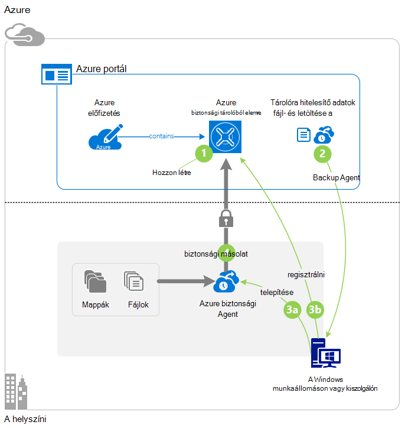

>[AZURE.IMPORTANT] Azure van két különböző telepítési modellekkel létrehozásáról és használatáról az erőforrások: az erőforrás-kezelő és klasszikus. Ez a cikk bemutatja, hogy a klasszikus telepítési modellt használja. Azt javasoljuk, hogy a legtöbb új telepítések az erőforrás-kezelő modell használata.

## Előzetes teendők
Biztonsági másolat készítése a kiszolgáló vagy ügyfél Azure, Azure-fiók szükséges. Ha nincs telepítve egyik, létrehozhat egy [ingyenes fiókot](https://azure.microsoft.com/free/) a mindössze néhány perc.

## Lépés: 1: Hozzon létre egy biztonsági tárolóból elemre
Biztonsági másolatot a fájlok és mappák kiszolgáló vagy ügyfél, meg kell hozzon létre egy biztonsági tárolóból elemre, amelyhez szeretne tárolja az adatokat földrajzi régióban.

### A biztonsági másolat tárolóra létrehozása

1. Jelentkezzen be [a klasszikus portálra](https://manage.windowsazure.com/).

2. Kattintson az **Új** > **Data Services** > **Helyreállítási szolgáltatások** > **Biztonsági másolat tárolóból elemre**, és válassza a **Gyors létrehozása**.

3. A **név** paraméter adjon meg egy rövid nevet a biztonsági másolat tárolóból elemre. Adjon egy nevet, amely a 2 és 50 karakter közötti tartalmazza. Egy betűvel kell kezdődnie, és csak betűket, számokat és kötőjelet is tartalmazhat. Ez a név szüksége van az egyes előfizetések egyedinek kell lennie.

4. Jelölje ki a földrajzi területhez tartozik a biztonsági másolat tárolóból elemre az a **régió** paramétert. Ez a beállítás azt határozza meg a földrajzi régióban, ahol az adatok biztonsági másolatának küldése. A földrajzi régióban leginkább hasonlító tartózkodási helyét kiválasztásával csökkentheti hálózati késés, ha előbb biztonsági másolatot készít Azure.

5. Kattintson a **Hozzon létre a tárolóból elemre**.

    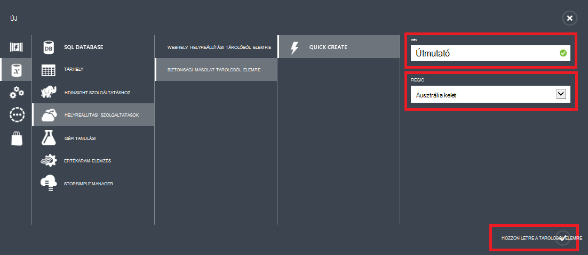

    Eltarthat egy ideig a létrehozandó a biztonsági másolat tárolóból elemre. Az állapot ellenőrzése, nyomon követni a klasszikus portál alján az értesítéseket.

    A biztonsági másolat tárolóra létrehozása után megjelenik az üzenet jelzi, hogy a tárolóra létrehozása sikeresen befejeződött. Azt is formában jelenik meg **az aktív** a erőforrás **Helyreállítási szolgáltatások** listában.

    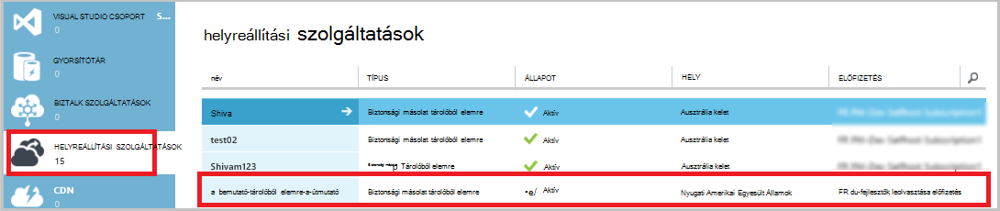

4. Jelölje ki a redundancia tárolási lehetőség itt leírt lépésekkel.

    >[AZURE.IMPORTANT] A legjobb időpontot tudja azonosítja a tárhely redundancia beállítás pedig jobbra tárolóra létrehozását követően mielőtt bármilyen gépek regisztrált a tárolóból elemre kattintva. Elem van regisztrálva a tárolóból elemre kattintva, miután a redundancia tárolási lehetőség zárolt, és nem módosíthatók.

    Ha egy elsődleges biztonsági másolat tárolási végpontjának Azure használja (például biztonsági az Azure a Windows Server), fontolja meg a [geo felesleges tárolási](../storage/storage-redundancy.md#geo-redundant-storage) lehetőség kiválasztása a (alapértelmezett).

    Ha egy harmadlagos biztonsági tárolás végpontjának Azure használja (például esetén System Center adatok védelme Manager áruházból helyi biztonsági másolat készítése a helyszíni és Azure használatának hosszú távú adatmegőrzési szükséges), fontolja meg [helyileg felesleges tárolás](../storage/storage-redundancy.md#locally-redundant-storage)kiválasztását. Ekkor az Azure-adattárolás közben eltarthatóság alacsonyabb szinten kezeléséről az adatok, amely elfogadható harmadlagos másolatok lehet költsége lefelé.

    **Jelölje ki a redundancia tárolási lehetőség:**

    egy. Kattintson az imént létrehozott tárolóból elemre.

    b. Első lépések lapon jelölje ki a **konfigurálása**.

    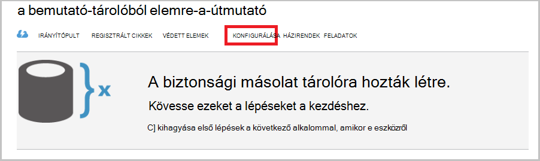

    c billentyűkombinációt. Válassza a megfelelő tárolási redundancia lehetőséget.

    Ha bejelöli a **Felesleges helyi meghajtóra**, kattintson a **Mentés** gombra, (mert **Geo-redundáns** lesz az alapértelmezett beállítás) szeretne.

    d. A bal oldali navigációs ablaktáblában kattintson a **Helyreállítás szolgáltatások** helyreállítási szolgáltatások: erőforrások listája való visszatéréshez.

## Lépés: 2: A tárolóból elemre hitelesítőadat-fájl letöltése
A helyszíni gépen kell sikerült hitelesíteni a biztonsági másolat tárolóra azt is biztonsági másolatokat Azure előtt. A hitelesítés *tárolóra hitelesítő adatok*keresztül érhető el. A tárolóból elemre hitelesítőadat-fájl letöltése egy biztonságos csatornát, a klasszikus portálon keresztül. A tanúsítvány titkos kulcs nem marad meg a portálon vagy a szolgáltatás.

További tudnivalók a [használatával tárolóból elemre a biztonsági másolat szolgáltatással hitelesítő adataival](backup-introduction-to-azure-backup.md#what-is-the-vault-credential-file).

### Kattintva töltse le a tárolóból elemre hitelesítőadat-fájlt egy helyi számítógép zónában

1. A bal oldali navigációs ablaktáblában kattintson a **Szolgáltatások helyreállítás**elemre, és válassza ki az Ön által létrehozott biztonsági tárolóból elemre.

    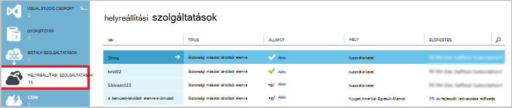

2.  Első lépések lapon kattintson a **Letöltés tárolóra hitelesítő adatok**.

    A klasszikus portál a tárolóból elemre hitelesítő adatok a tárolóból elemre nevét és az aktuális dátum használatával hoz létre. A tárolóból elemre hitelesítő adatok fájl esetén csak a regisztrációs munkafolyamat használni, és 48 óra elteltével lejár.

    A tárolóból elemre hitelesítőadat-fájl a portálról lehet letölteni.

3. Kattintva töltse le a letöltések mappában a helyi fiók a tárolóból elemre hitelesítőadat-fájlt a **Mentés** gombra. Kijelölhet is **A Mentés másként** parancsot a **Mentés** adja meg a tárolóból elemre hitelesítőadat-fájl helyét.

    >[AZURE.NOTE] Győződjön meg arról, hogy a tárolóból elemre hitelesítőadat-fájlt a számítógépről is elérhető helyre mentésekor. Ha a megosztás vagy a kiszolgáló üzenet a továbbfejlesztett fájlblokkolás van tárolva, ellenőrizheti, hogy az engedélyek elérheti őket.

## Lépés 3: Letöltése, telepítése, és a biztonsági másolat ügynök regisztrálása
Miután létrehozása a biztonsági másolat tárolóból elemre, és töltse le a tárolóból elemre hitelesítőadat-fájlt, ügynökszoftvert telepíteni kell az egyes a Windows gépek.

### Letöltése, telepítése, és regisztrálhatja a agent

1. Kattintson a **Helyreállítás szolgáltatások**elemre, és válasszon a kiszolgálóval regisztrálni kívánt biztonsági másolat tárolóból elemre.

2. Első lépések lapján kattintson a **Windows Server ügynök vagy System Center adatok védelme Manager vagy Windows-ügyfél**ügynök. Ezután kattintson a **Mentés**gombra.

    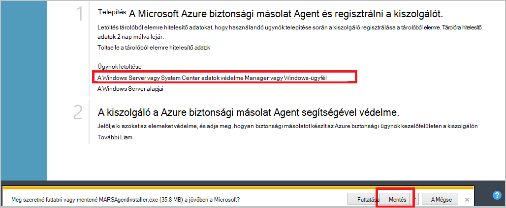

3. Rendelkezik a MARSagentinstaller.exe fájl letöltése után kattintson a **Futtatás** gombra (vagy kattintson duplán a **MARSAgentInstaller.exe** a mentett helyről).

4. Adja meg a telepítési mappájában és a agent szükséges gyorsítótárának mappáját, és kattintson a **Tovább gombra**. A gyorsítótár helyét adja meg, hogy az adatok biztonsági másolatának legalább 5 százalék egyenlő szabad területet kell rendelkeznie.

5. Továbbra is csatlakozik az internethez, az alapértelmezett proxybeállításokat keresztül.          Ha a proxykiszolgáló használatával csatlakozik az internethez, a Proxy beállítása lapon jelölje be az **Egyéni proxybeállítások használata** jelölőnégyzetet, és írja be a proxy kiszolgáló adatait. Ha hitelesítéssel működő proxy használ, írja be a felhasználó nevét és jelszavát, adatai, és kattintson a **Tovább gombra**.

7. Kattintson a **telepítse** a ügynök. A biztonsági másolat ügynök .NET-keretrendszer 4.5 és a Windows PowerShell telepítése (Ha még nincs telepítve) a telepítés befejezéséhez.

8. A agent telepítése után kattintson a **Folytatás regisztrációhoz** a munkafolyamat folytatásához.

9. A tárolóból elemre azonosítása lapon keresse meg és jelölje ki a korábban letöltött tárolóra hitelesítő fájlt.

    A tárolóból elemre hitelesítő adatok fájl érvényes csak 48 óra a portálról letöltés után. Ha a hiba (például "tárolóból elemre hitelesítő adatok már lejárt a megadott fájl"), a lap jelentkezzen be a portálra, és ismét le a tárolóból elemre hitelesítőadat-fájlt.

    Arról, hogy a tárolóból elemre hitelesítő adatok fájl érhető el a telepítő alkalmazás is elérhető helyre. Ha az access kapcsolatos hibák, a tárolóból elemre hitelesítőadat-fájl másolása ugyanazon a gépen ideiglenes helyére, és ismételje meg a műveletet.

    Ha egy tárolóból elemre hitelesítő adatok hiba, például "érvénytelen tárolóra hitelesítő adatok", a fájl megsérült, vagy nem nem rendelkezik a legújabb hitelesítő adatok az helyreállítás szolgáltatással társított. Új tárolóból elemre hitelesítőadat-fájl letöltésével a portálon múlva próbálkozzon ismét. Ez a hiba akkor is fordulhat elő, ha egy felhasználó a **Letöltés tárolóra hitelesítő adatok** beállítás többször rövid egymás után. Ebben az esetben csak az utolsó tárolóra hitelesítő adatok fájl érvényes.

9. A titkosítási beállítás lapon készítése egy jelszót, vagy küldje el a jelszó (16 karaktert minimum). Ne feledje, hogy a jelszó mentése biztonságos helyen.

10. Kattintson a **Befejezés gombra**. A kiszolgáló regisztrálni varázsló regisztrálja a kiszolgáló biztonsági másolatot.

    >[AZURE.WARNING] Ha elveszíti vagy elfelejti a jelszavát, a Microsoft nem tud segítséget az adatok biztonsági másolatának visszaállítása. A titkosítási jelszó tulajdonjogának, és a Microsoft nem rendelkezik betekintést kap abba, hogy az Ön által használt jelszót. Mentse a fájlt egy biztonságos helyen, hiszen szükséges a helyreállítási művelet során.

11. A titkosítási kulcs beállítása után a **Indítsa el a Microsoft Azure helyreállítási szolgáltatások Agent** jelölőnégyzetet hagyja bejelölve, és kattintson a **Bezárás**gombra.

## Lépés: 4: A kezdeti biztonsági mentés végrehajtása

A kezdeti biztonsági másolat két fő feladatokat foglalja magában:

- Az ütemezés létrehozása
- Fájlok és mappák biztonsági mentése első alkalommal

A biztonsági másolat házirend első biztonsági befejeződése után is használhatja, ha módosítani szeretné az adatok visszaállítása biztonsági pontok hoz létre. A biztonsági másolat házirend végzi az ütemtervet, amely csak alapján.

### A biztonsági mentés ütemezése

1. Nyissa meg a Microsoft Azure biztonsági másolat agent. (Ennek hatására megnyílik automatikusan, ha a **Indítsa el a Microsoft Azure helyreállítási szolgáltatások Agent** jelölőnégyzet be van jelölve, a kiszolgáló regisztrálni varázsló bezárásakor hagyta.) A számítógépen **a Microsoft Azure**biztonsági másolatának kereséssel megtalálhatja.

    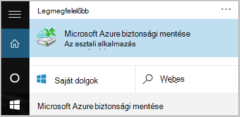

2. A biztonsági másolat ügynök kattintson a **Mentés**gombra.

    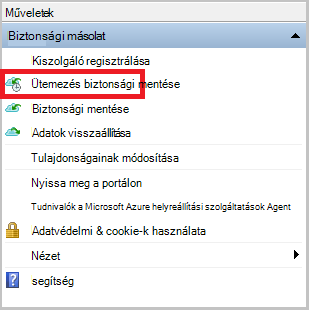

3. Az ütemterv biztonsági másolat varázsló használatának első lépései lapon kattintson a **Tovább**gombra.

4. Kattintson az elemek kijelölése biztonsági másolat lapra **Elemek hozzáadása**.

5. Jelölje ki a fájlokat és mappákat, amelyet szeretne biztonsági másolatot készíteni, és válassza a **rendben**.

6. Kattintson a **Tovább**gombra.

7. A **Biztonsági mentés ütemezése megadása** lapon adja meg a **biztonsági mentés ütemezése** , és kattintson a **Tovább**gombra.

    (Mértéke maximális száma naponta háromszor) napi vagy heti biztonsági ütemezheti.

    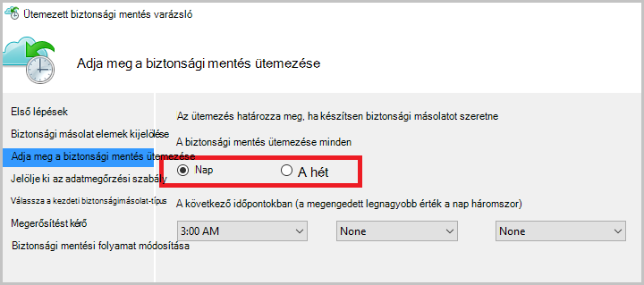

    >[AZURE.NOTE] További információ arról, hogy miként adja meg a biztonsági másolat ütemezést, olvassa el a [Használati Azure biztonsági a szalag infrastruktúra kicserélendő](backup-azure-backup-cloud-as-tape.md).

8. **Jelölje ki az adatmegőrzési** lapján jelölje be a biztonsági másolat az **Adatmegőrzési szabályt** .

    Az adatmegőrzési Itt adhatja meg az időtartam, amelynek a biztonsági másolatot szeretne tárolni. Csak megadása egy "strukturálatlan házirendet" az összes biztonsági pont, helyett megadhatja eltérő adatmegőrzési szabályok alapján a biztonsági mentés esetén. A napi, heti, havi vagy éves adatmegőrzési házirendek az igényeknek megfelelően módosíthatók.

9. A kezdeti biztonsági másolat típusának kiválasztása lapon válassza ki a kezdeti biztonsági. Hagyja a **automatikusan a hálózaton keresztül** kijelölt választógombot, és kattintson a **Tovább gombra**.

    Biztonsági másolatot készíthet automatikusan a hálózaton keresztül, vagy biztonsági másolatot készíthet offline. Ez a cikk hátralévő automatikusan mentésével folyamata ismerteti. Ha inkább egy offline biztonsági másolatot, olvassa el a cikk további információt [az Azure biztonsági Offline biztonsági munkafolyamat](backup-azure-backup-import-export.md) .

10. A Megerősítés lapon tekintse át az információkat, és kattintson a **Befejezés gombra**.

11. Az ütemezés létrehozását a varázsló befejezése után kattintson a **Bezárás**gombra.

### Engedélyezze a hálózati szabályozásának (nem kötelező)

A biztonsági másolat ügynök biztosít a hálózati szabályozásának. Vezérlők adatátvitel során hálózati sávszélesség használatának szabályozása. Ez a beállítás akkor lehet hasznos, ha módosítani szeretné a biztonsági másolatot során adatok munkaórák, de nem szeretné a biztonsági mentés más internetes forgalmat zavarja. Biztonsági mentése és visszaállítása a tevékenységek szabályozásának vonatkozik.

**Hálózati szabályozásának engedélyezése**

1. Kattintson a biztonsági másolat ügynök **Tulajdonságainak módosítása**.

    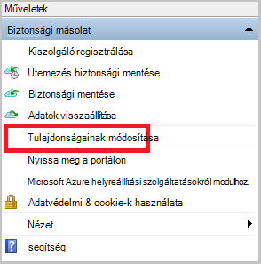

2. A **Throttling** lapon jelölje be az **internetes sávszélesség-használat biztonsági műveletekhez szabályozásának engedélyezése** jelölőnégyzetet.

    

3. Miután engedélyezte a szabályozásának, adja meg az adatok biztonsági másolatának átadás engedélyezett sávszélesség **Munkaidő** és **a nem munkaidő**alatt.

    A sávszélesség értékek 512 KB (KB) másodpercenként a kezdődik, és válassza a legfeljebb 1,023 megabájt (MB) másodpercenként. Is kijelöli a kezdés és Befejezés **Munkaidő**esetében, és amelyek a hét napjai számít munkanapok. Kijelölt munka óra ilyenként kívüli óra nem munka óra.

4. Kattintson az **OK gombra**.

### Biztonsági mentése

1. A biztonsági másolat ügynök kattintson **Azonnali biztonsági mentése elemre** a hálózaton keresztül kezdeti rendezi befejezéséhez.

    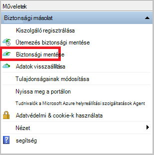

2. A Megerősítés lapon tekintse át a beállításokat, amelyekkel a vissza most varázslót biztonsági mentése a számítógépre. Kattintson a **Biztonsági másolatot készíteni**.

3. **Zárja be** a varázsló bezáráshoz kattintson. Ha ezek előtt a biztonsági másolat folyamat befejeződik, a varázsló továbbra is futtathatók a háttérben.

A kezdeti biztonsági mentés után a **feladat befejezése** állapota megjelenik a biztonsági másolat konzolban.

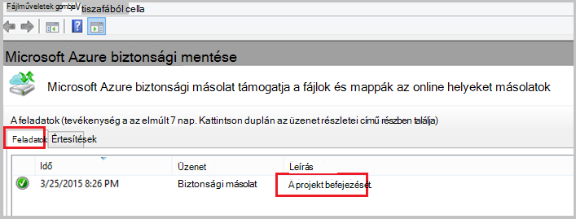

## Következő lépések
- Regisztráció [ingyenes Azure-fiók](https://azure.microsoft.com/free/).

További információ a biztonsági másolat VMs vagy más munkaterhelésekből talál:

- [Készítsen biztonsági másolatot IaaS VMs](backup-azure-vms-prepare.md)
- [A Microsoft Azure biztonsági másolat Server Azure biztonsági másolatot munkaterhelésekből](backup-azure-microsoft-azure-backup.md)
- [Biztonsági másolatot készíthet munkaterhelésekből DPM az Azure](backup-azure-dpm-introduction.md)
