<properties
    pageTitle="Készítsen biztonsági másolatot a Windows Server vagy az erőforrás-kezelő telepítési modell Azure mentéssel Azure ügyfél |} Microsoft Azure"
    description="Biztonsági másolat Windows-kiszolgálók vagy létrehozása a biztonsági másolat tárolóból elemre, le hitelesítő adatokat, a biztonsági másolat agent telepítése, és befejezése az eredeti másolata a fájlok és mappák Azure ügyfelek."
    services="backup"
    documentationCenter=""
    authors="markgalioto"
    manager="cfreeman"
    editor=""
    keywords="biztonsági másolat tárolóra; biztonsági mentése a Windows server; a windows biztonsági;"/>

<tags
    ms.service="backup"
    ms.workload="storage-backup-recovery"
    ms.tgt_pltfrm="na"
    ms.devlang="na"
    ms.topic="article"
    ms.date="08/10/2016"
    ms.author="jimpark; trinadhk; markgal"/>

# Biztonsági másolat készítése a Windows Server vagy ügyfél Azure az erőforrás-kezelő telepítési modell használata

> [AZURE.SELECTOR]
- [Azure portál](backup-configure-vault.md)
- [Klasszikus portál](backup-configure-vault-classic.md)

Ez a cikk bemutatja, hogyan biztonsági másolat készítése a Windows Server (vagy a Windows-ügyfél) fájlok és mappák használata az erőforrás-kezelő telepítési modell Azure mentéssel Azure.

[AZURE.INCLUDE [learn-about-deployment-models](../../includes/backup-deployment-models.md)]

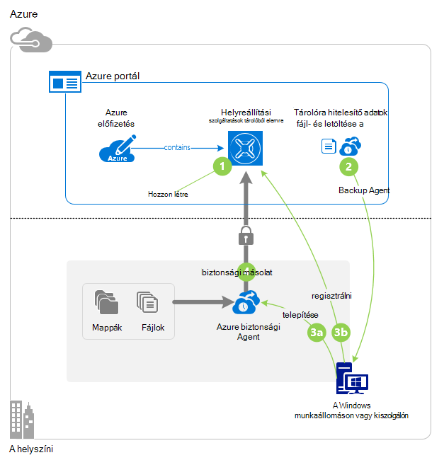

## Előzetes teendők
Biztonsági másolat készítése a kiszolgáló vagy ügyfél Azure, Azure-fiók szükséges. Ha nincs telepítve egyik, létrehozhat egy [ingyenes fiókot](https://azure.microsoft.com/free/) a mindössze néhány perc.

## Lépés: 1: Hozzon létre egy helyreállítási szolgáltatások tárolóból elemre.

A helyreállítási szolgáltatások tárolóra még a biztonsági mentés és helyreállítási pontok hoz létre idővel tároló egységek. A helyreállítási szolgáltatások tárolóra is tartalmaz, a biztonsági házirendek hatálya védett fájlok és mappák. Amikor létrehoz egy helyreállítási szolgáltatások tárolóból elemre, is jelölje ki a megfelelő tárolási redundancia lehetőséget.

### Hozzon létre egy helyreállítási szolgáltatások a tárolóból elemre

1. Ha még nem tette meg, jelentkezzen be az [Azure-portálon](https://portal.azure.com/) Azure-előfizetése segítségével.

2. A központi menüben kattintson a **Tallózás gombra** , és az erőforrások listája, írja be a **Helyreállítási szolgáltatások**. Gépelés megkezdésekor a listában a rendszer kiszűri a megadott feltételeknek. Kattintson a **helyreállítás szolgáltatások tárolókban**.

    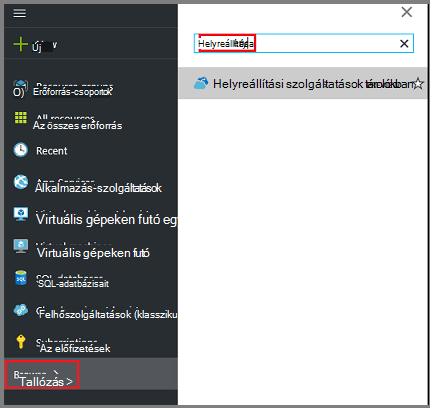  

    A tárolókban helyreállítási szolgáltatások listáját jelenik meg.

3. A **helyreállítási szolgáltatások tárolókban** menüben kattintson a **Hozzáadás**gombra.

    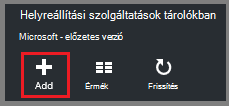

    Megnyílik a helyreállítási szolgáltatások tárolóból elemre a lap, kéri, adja meg **nevét**, **előfizetés**, **erőforráscsoport**és **helyét**.

    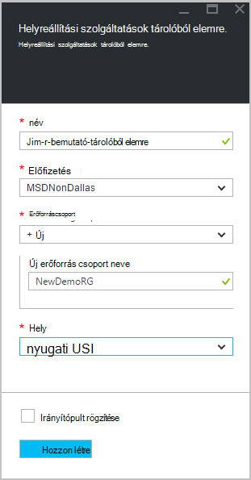

4. A **név**írja be egy rövid nevet, amely azonosítja a tárolóból elemre. A név van szüksége az Azure előfizetés egyedinek kell lennie. Adjon egy nevet, amely a 2 és 50 karakter közötti tartalmazza. Egy betűvel kell kezdődnie, és csak betűket, számokat és kötőjelet is tartalmazhat.

5. Kattintson az **előfizetés** az előfizetések elérhető listájának megjelenítéséhez. Ha nem biztos abban, hogy mely előfizetés használni, használja az alapértelmezett (vagy a javasolt) előfizetés. Lesznek több lehetőség csak akkor, ha a szervezeti fiók társítva több Azure előfizetés.

6. **Erőforráscsoport** a rendelkezésre álló erőforráscsoport listájának megtekintéséhez, vagy hozzon létre egy új erőforráscsoport **Új** gombra. Az erőforrás csoportok átfogó információt a [Azure erőforrás-kezelő áttekintése](../azure-resource-manager/resource-group-overview.md) című témakörben találhat.

7. Kattintson a **hely** jelölje ki a földrajzi régióban esetében a tárolóból elemre. Ez a beállítás azt határozza meg a földrajzi régióban, ahol az adatok biztonsági másolatának küldése. A földrajzi régióban leginkább hasonlító tartózkodási helyét kiválasztásával csökkentheti hálózati késés, ha előbb biztonsági másolatot készít Azure.

8. Kattintson a **létrehozása**gombra. Eltarthat egy ideig a létrehozandó a helyreállítási szolgáltatások tárolóból elemre. Figyelje meg a állapotát jelző a portál jobb felső területén. Amikor létrejött a tárolóból elemre, akkor nyíljon meg a portálon. Ha nem látja a tárolóból elemre van töltve fog szerepelni, kattintson a **frissítés**parancsra. Amikor frissíti a listában, kattintással jelölje ki azt a tárolóból elemre.

### Tárterület redundancia meghatározása
A helyreállítási szolgáltatások tárolóból elemre első létrehozásakor meghatározhatja, hogy hogyan tároló replikált-e.

1. Kattintson a **Beállítások** lap, amely automatikusan megnyílik a tárolóból elemre irányítópulthoz a **Biztonsági másolat infrastruktúra**.

2. A biztonsági másolat infrastruktúra lap kattintson a **Biztonsági mentés beállításainak** megtekintése a **tárhely replikációs típusát**.

    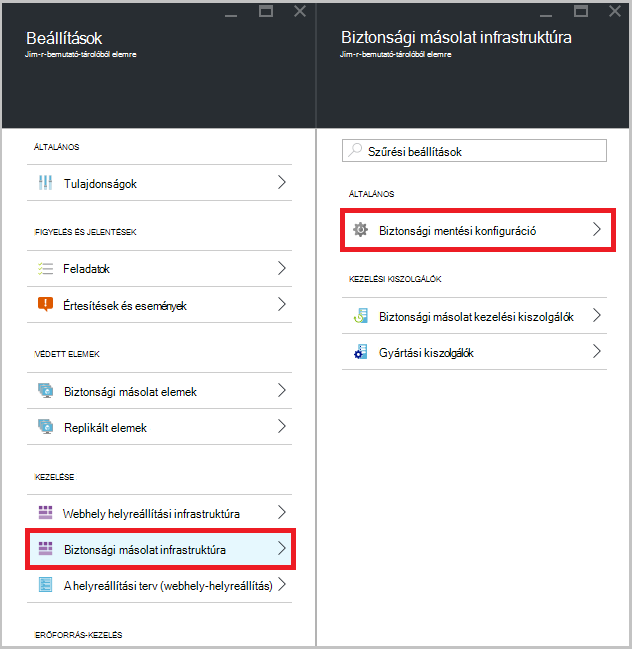

3. Válassza a tárterület replikációs esetében a tárolóból elemre.

    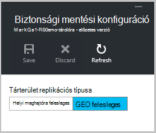

    Alapértelmezés szerint a tárolóból elemre a geo felesleges tároló tartalmaz. Azure használatakor egy elsődleges biztonsági másolat tárolási végpontjának használja továbbra is geo felesleges tárhelyet. Azure használatakor egy nem elsődleges biztonságimásolat-végpontot, válassza a helyi meghajtóra felesleges tárolására, az adatok tárolása Azure költsége csökkenti. További információk [geo felesleges](../storage/storage-redundancy.md#geo-redundant-storage) és a [helyi meghajtóra felesleges](../storage/storage-redundancy.md#locally-redundant-storage) -tárolási lehetőségek a az [Áttekintés](../storage/storage-redundancy.md).

    Miután kiválasztotta a tárolóból elemre a tárolási lehetőség, készen áll a fájlok és mappák társítani a tárolóból elemre.

Most, hogy létrehozta a tárolóból elemre, készítse elő a infrastruktúra biztonsági másolatot a fájlok és mappák letöltése és telepítése a Microsoft Azure helyreállítási szolgáltatási ügynökök, le tárolóra hitelesítő adatait, és a hitelesítő adatokat segítségével regisztrálhatja a agent a tárolóból elemre.

## Lépés: 2 - fájlok letöltése

>[AZURE.NOTE] Az Azure portálon keresztül engedélyezése biztonsági másolat hamarosan. Ekkor a Microsoft Azure helyreállítási szolgáltatások Agent helyszíni készítsen biztonsági másolatot a fájlok és mappák használata.

1. Kattintson a **Beállítások** gombra a helyreállítási szolgáltatások tárolóra irányítópulton.

    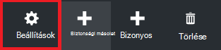

2. Kattintson a **első lépések > biztonsági másolat** kattintson a beállítások lap.

    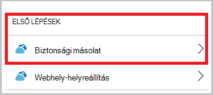

3. **Biztonsági másolat cél** kattintson a biztonsági másolat lap.

    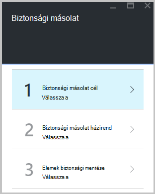

4. Válassza **a helyszíni** a Honnan származnak az a terhelést fut? menü.

5. **Fájlok és mappák** választhat a Miről szeretne biztonsági másolatot készíteni? menüre, és kattintson az **OK gombra**.

#### Töltse le a helyreállítási szolgáltatások agent

1. Kattintson az **Előkészítés infrastruktúra** lap **letöltése ügynök a Windows Server vagy Windows-ügyfél** .

    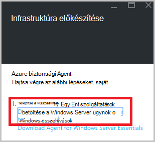

2. A letöltés előugró ablakban kattintson a **Mentés** gombra. Alapértelmezés szerint a **MARSagentinstaller.exe** fájlra a letöltések mappában van menti.

#### Töltse le a tárolóból elemre hitelesítő adatok

1. Kattintson a **letöltése > Mentés** kattintson az előkészítés infrastruktúra lap.

    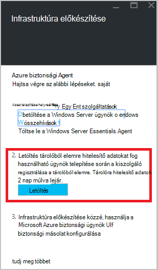

## Lépés a 3 - telepítés és regisztrálhatja a agent

1. Keresse meg, és kattintson duplán a **MARSagentinstaller.exe** a letöltések mappában (vagy más mentett helyről).

2. Töltse ki a Microsoft Azure helyreállítási szolgáltatások ügynök beállítási varázsló. A varázsló kell:

    - Válasszon egy helyet a telepítési és gyorsítótárának mappáját.
    - Adja meg a proxy server info ha proxykiszolgáló használatával csatlakozik az internethez.
    - Hálózatüzemeltetője a felhasználó nevét és jelszavát, ha hitelesítéssel működő proxy
    - A letöltött tárolóra hitelesítő adatok megadása
    - Mentse a titkosítási jelszó biztonságos helyen.

    >[AZURE.NOTE] Ha elveszíti vagy elfelejti a jelszavát, a Microsoft nem súgó az adatok biztonsági másolatának visszaállítása. Mentse a fájlt egy biztonságos helyen. Szükség van egy biztonsági másolatának visszaállítása.

A agent most már telepítve van, és a számítógép regisztrálva van a tárolóból elemre. Készen áll arra, beállítása és a biztonsági másolat ütemezése.

### A telepítés megerősítése

Győződjön meg arról, hogy a agent telepítve, és megfelelően regisztrált, ellenőrizheti az adatkezelési portál **Gyártási kiszolgáló** részében biztonsági másolat elemek. Ennek módja:

1. Jelentkezzen be az [Azure-portálon](https://portal.azure.com/) Azure-előfizetése segítségével.

2. A központi menüben kattintson a **Tallózás gombra** , és az erőforrások listája, írja be a **Helyreállítási szolgáltatások**. Gépelés megkezdésekor a listában a rendszer kiszűri a megadott feltételeknek. Kattintson a **helyreállítás szolgáltatások tárolókban**.

      

    A tárolókban helyreállítási szolgáltatások listáját jelenik meg.

2. Jelölje ki a nevét a létrehozott tárolóból elemre.

    A helyreállítási szolgáltatások tárolóból elemre az irányítópult lap megnyitása

    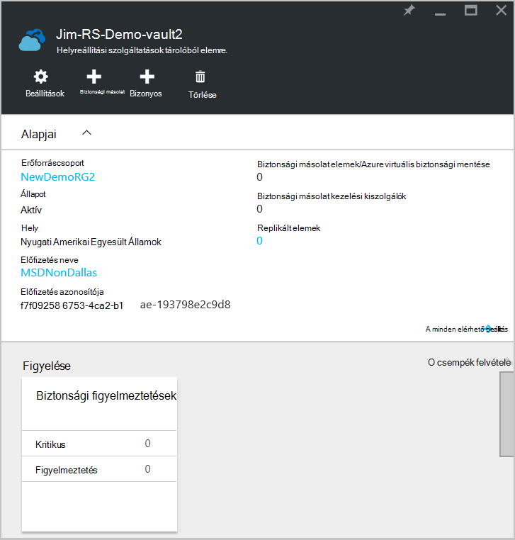  

3. Kattintson a lap tetején a **Beállítások** gombra.

4. Kattintson a **infrastruktúra biztonsági másolat > gyártás-kiszolgálók**.

    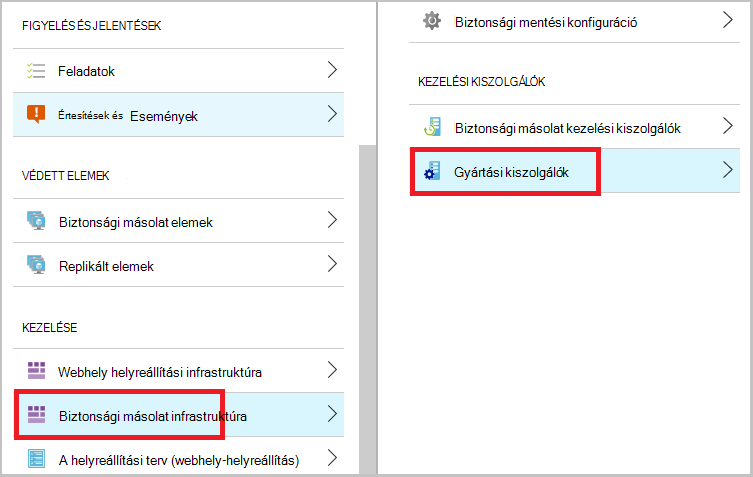

Ha látja a listában a kiszolgálókat, megerősítő, hogy a agent telepítve és megfelelően regisztrált van.

## Lépés: 4: A kezdeti biztonsági mentés végrehajtása

A kezdeti biztonsági másolat két fő feladatokat foglalja magában:

- A biztonsági mentés ütemezése
- Fájlok és mappák biztonsági mentése első alkalommal

A kezdeti biztonsági mentés végrehajtása, a Microsoft Azure biztonsági agent kell használnia.

### A biztonsági mentés ütemezése

1. Nyissa meg a Microsoft Azure biztonsági másolat agent. A számítógépen **a Microsoft Azure**biztonsági másolatának kereséssel megtalálhatja.

    

2. A biztonsági másolat ügynök kattintson a **Mentés**gombra.

    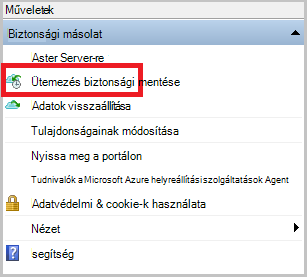

3. Az ütemterv biztonsági másolat varázsló használatának első lépései lapon kattintson a **Tovább**gombra.

4. Kattintson az elemek kijelölése biztonsági másolat lapra **Elemek hozzáadása**.

5. Jelölje ki a fájlokat és mappákat, amelyet szeretne biztonsági másolatot készíteni, és válassza a **rendben**.

6. Kattintson a **Tovább**gombra.

7. A **Biztonsági mentés ütemezése megadása** lapon adja meg a **biztonsági mentés ütemezése** , és kattintson a **Tovább**gombra.

    (Mértéke maximális száma naponta háromszor) napi vagy heti biztonsági ütemezheti.

    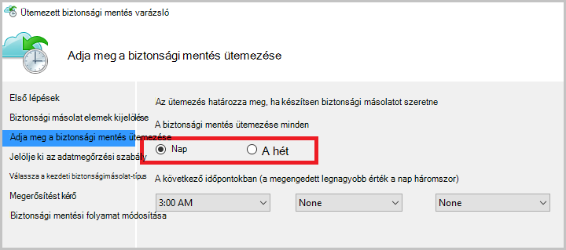

    >[AZURE.NOTE] További információ arról, hogy miként adja meg a biztonsági másolat ütemezést, olvassa el a [Használati Azure biztonsági a szalag infrastruktúra kicserélendő](backup-azure-backup-cloud-as-tape.md).

8. **Jelölje ki az adatmegőrzési** lapján jelölje be a biztonsági másolat az **Adatmegőrzési szabályt** .

    Az adatmegőrzési Itt adhatja meg az időtartam, amelynek a biztonsági másolatot szeretne tárolni. Csak megadása egy "strukturálatlan házirendet" az összes biztonsági pont, helyett megadhatja eltérő adatmegőrzési szabályok alapján a biztonsági mentés esetén. A napi, heti, havi vagy éves adatmegőrzési házirendek az igényeknek megfelelően módosíthatók.

9. A kezdeti biztonsági másolat típusának kiválasztása lapon válassza ki a kezdeti biztonsági. Hagyja a **automatikusan a hálózaton keresztül** kijelölt választógombot, és kattintson a **Tovább gombra**.

    Biztonsági másolatot készíthet automatikusan a hálózaton keresztül, vagy biztonsági másolatot készíthet offline. Ez a cikk hátralévő automatikusan mentésével folyamata ismerteti. Ha inkább egy offline biztonsági másolatot, olvassa el a cikk további információt [az Azure biztonsági Offline biztonsági munkafolyamat](backup-azure-backup-import-export.md) .

10. A Megerősítés lapon tekintse át az információkat, és kattintson a **Befejezés gombra**.

11. Az ütemezés létrehozását a varázsló befejezése után kattintson a **Bezárás**gombra.

### Engedélyezze a hálózati szabályozásának (nem kötelező)

A biztonsági másolat agent biztosít a hálózati szabályozásának. Vezérlők adatátvitel során hálózati sávszélesség használatának szabályozása. Ez a beállítás akkor lehet hasznos, ha módosítani szeretné a biztonsági másolatot során adatok munkaórák, de nem szeretné a biztonsági mentés más internetes forgalmat zavarja. Biztonsági mentése és visszaállítása a tevékenységek szabályozásának vonatkozik.

>[AZURE.NOTE] Hálózati szabályozásának nem érhető el a Windows Server 2008 R2 SP1, a Windows Server 2008 SP2 vagy a Windows 7 (service csomaggal). A szolgáltatás szabályozásának Azure biztonsági mentése hálózati szolgáltatás minősége (QoS) folytat, a helyi operációs rendszeren. Azure biztonsági másolat megvédheti az alábbi operációs rendszerek, mintha a következő platformokon elérhető QoS verziója nem működik Azure biztonsági mentése hálózati szabályozásának. Hálózati szabályozásának használható minden más [támogatott operációs rendszerek](backup-azure-backup-faq.md#installation-amp-configuration).

**Hálózati szabályozásának engedélyezése**

1. Kattintson a biztonsági másolat agent **Tulajdonságainak módosítása**.

    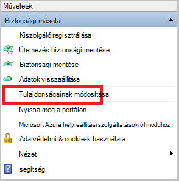

2. A **Throttling** lapon jelölje be az **internetes sávszélesség-használat biztonsági műveletekhez szabályozásának engedélyezése** jelölőnégyzetet.

    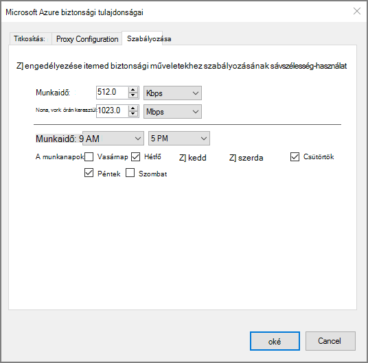

3. Miután engedélyezte a szabályozásának, adja meg az adatok biztonsági másolatának átadás engedélyezett sávszélesség **Munkaidő** és **a nem munkaidő**alatt.

    A sávszélesség értékek 512 KB (KB) másodpercenként a kezdődik, és válassza a legfeljebb 1,023 megabájt (MB) másodpercenként. Is kijelöli a kezdés és Befejezés **Munkaidő**esetében, és amelyek a hét napjai számít munkanapok. Kijelölt munka óra ilyenként kívüli óra nem munka óra.

4. Kattintson az **OK gombra**.

### Biztonsági másolat készítése a fájlokat és mappákat, hogy az első alkalommal

1. A biztonsági másolat agent kattintson **Azonnali biztonsági mentése elemre** a hálózaton keresztül kezdeti rendezi befejezéséhez.

    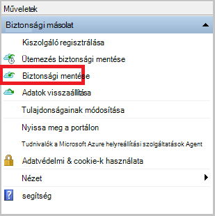

2. A Megerősítés lapon tekintse át a beállításokat, amelyekkel a vissza most varázslót biztonsági mentése a számítógépre. Kattintson a **Biztonsági másolatot készíteni**.

3. **Zárja be** a varázsló bezáráshoz kattintson. Ha ezek előtt a biztonsági másolat folyamat befejeződik, a varázsló továbbra is futtathatók a háttérben.

A kezdeti biztonsági mentés után a **feladat befejezése** állapota megjelenik a biztonsági másolat konzolban.

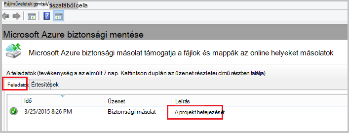

## Kérdések?
Ha kérdései vannak, vagy bármely funkció, amely tartalmazza, hogy milyen [küldjön visszajelzést](http://aka.ms/azurebackup_feedback).

## Következő lépések
További információ a biztonsági másolat VMs vagy más munkaterhelésekből talál:

- Most, hogy mentésben a fájlokat és mappákat, akkor [a tárolókban és kiszolgálók kezelése](backup-azure-manage-windows-server.md).
- Ha egy biztonsági másolatának visszaállítása, használja az ebben a cikkben [egy Windows számítógépre a fájlok visszaállítása](backup-azure-restore-windows-server.md).
