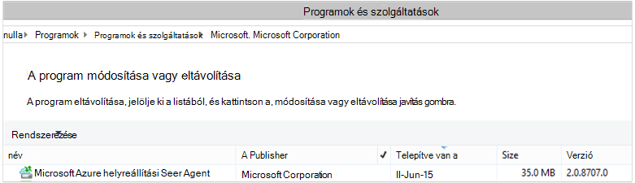

<properties
    pageTitle="Azure készítsen biztonsági másolatot - üzembe helyezéséhez és kezelése a PowerShell használatá DPM tagjának vissza |} Microsoft Azure"
    description="Megtudhatja, hogy miként üzembe helyezéséhez és kezeléséhez Azure biztonsági mentése az adatok védelme Manager (DPM) PowerShell használatával"
    services="backup"
    documentationCenter=""
    authors="Nkolli1"
    manager="shreeshd"
    editor=""/>

<tags
    ms.service="backup"
    ms.workload="storage-backup-recovery"
    ms.tgt_pltfrm="na"
    ms.devlang="na"
    ms.topic="article"
    ms.date="09/27/2016"
    ms.author="jimpark; trinadhk; anuragm; markgal"/>


# <a name="deploy-and-manage-backup-to-azure-for-data-protection-manager-dpm-servers-using-powershell"></a>Üzembe helyezéséhez és kezeléséhez a PowerShell használatá adatok védelme Manager (DPM) kiszolgálók Azure biztonsági mentése

> [AZURE.SELECTOR]
- [ARM](backup-dpm-automation.md)
- [Klasszikus](backup-dpm-automation-classic.md)

Ez a cikk bemutatja, hogyan, PowerShell-lel való DPM kiszolgálón Azure biztonsági beállítása és kezelése, biztonsági mentése és helyreállítása.

## <a name="setting-up-the-powershell-environment"></a>Állítsa be a PowerShell környezetet

[AZURE.INCLUDE [learn-about-deployment-models](../../includes/learn-about-deployment-models-include.md)]

Mielőtt a PowerShell használatával az Azure adatok védelme Manager biztonsági másolatok kezelése, szüksége lesz van-e a megfelelő környezet PowerShell. Elején található PowerShell-munkamenetet győződjön meg arról, hogy Ön a következő parancsot a megfelelő modulok importálása, és lehetővé teszi a DPM parancsmagok megfelelően hivatkozni szeretne.

```
PS C:> & "C:\Program Files\Microsoft System Center 2012 R2\DPM\DPM\bin\DpmCliInitScript.ps1"

Welcome to the DPM Management Shell!

Full list of cmdlets: Get-Command
Only DPM cmdlets: Get-DPMCommand
Get general help: help
Get help for a cmdlet: help <cmdlet-name> or <cmdlet-name> -?
Get definition of a cmdlet: Get-Command <cmdlet-name> -Syntax
Sample DPM scripts: Get-DPMSampleScript
```

## <a name="setup-and-registration"></a>A telepítő és a regisztrációs
A kezdéshez:

1. [Töltse le a legújabb PowerShell](https://github.com/Azure/azure-powershell/releases) (szükséges minimális verziója: 1.0.0)
2. Az Azure biztonsági másolat parancsmaggal kapcsolhatja be a **Kapcsoló-AzureMode** parancsmag használatával *AzureResourceManager* módban váltás:

```
PS C:\> Switch-AzureMode AzureResourceManager
```

A következő beállítási és nyilvántartási feladatok automatizálhatók a PowerShell:

- Hozzon létre egy biztonsági tárolóból elemre
- Az Azure Backup agent telepítése
- Regisztrálás az Azure biztonsági másolat szolgáltatással
- Hálózati beállítások
- Titkosítási beállítások

### <a name="create-a-backup-vault"></a>Hozzon létre egy biztonsági tárolóból elemre

> [AZURE.WARNING] Az Azure biztonsági másolat használata első alkalommal ügyfelek esetében regisztrálnia kell az Azure biztonsági másolat szolgáltató használható az előfizetéséhez. Ezt megteheti a következő parancs futtatásával: külső.FÜGGV-AzureProvider - ProviderNamespace "Microsoft.Backup"

Létrehozhat egy új biztonsági tárolóból elemre, a **New-AzureRMBackupVault** parancsmag használatával. A biztonsági másolat tárolóból elemre egy ARM erőforrás, így kell egy erőforrás csoporton belül helyezze el. Az Azure PowerShell jogú konzolban futtassa az alábbi parancsokat:

```
PS C:\> New-AzureResourceGroup –Name “test-rg” -Region “West US”
PS C:\> $backupvault = New-AzureRMBackupVault –ResourceGroupName “test-rg” –Name “test-vault” –Region “West US” –Storage GRS
```

A **Get-AzureRMBackupVault** parancsmag használatával egy adott előfizetésben elérheti a biztonsági másolat tárolókban listáját.


### <a name="installing-the-azure-backup-agent-on-a-dpm-server"></a>Az Azure biztonsági másolat ügynök telepítése DPM kiszolgálón
Mielőtt telepítené az Azure biztonsági másolat ügynök, a telepítő letöltött és a jelen van a Windows Server szükség. A telepítő a legújabb elérheti, a [Microsoft letöltőközpontból](http://aka.ms/azurebackup_agent) vagy a biztonsági másolat tárolóra Irányítópultlap. A telepítő ment egy könnyen hozzáférhető helyen, például * C:\Downloads\*.

A agent telepítéséhez futtassa a következő parancsot a egy jogú PowerShell konzol **DPM kiszolgálói**:

```
PS C:\> MARSAgentInstaller.exe /q
```

Az alapértelmezett beállításokat tartalmazó Ezzel telepíti az ügynök. A telepítés néhány percig tart a háttérben. Ha nem adja meg a */nu* beállítás végén található a telepítő bármely frissítések keresése a **Windows Update** ablak nyílik meg.

A telepített programok listájában a agent jelennek meg. A telepített programok listájának megtekintéséhez nyissa meg a **Vezérlőpultot** > **programok** > **Programok és szolgáltatások**.



#### <a name="installation-options"></a>Telepítési beállítások
Ha meg szeretné nézni a parancssori keresztül elérhető beállítások használja a következő parancsot:

```
PS C:\> MARSAgentInstaller.exe /?
```

A rendelkezésre álló beállítások a következők:

| A beállítás | Részletek | Alapértelmezett |
| ---- | ----- | ----- |
| / q | Csendes telepítés | - |
| / p: "hely" | A mappa elérési útját telepítési az Azure biztonsági másolat ügynök. | C:\Program Files\Microsoft Azure helyreállítási szolgáltatások Agent |
| / s: "hely" | A mappa elérési útját gyorsítótárból az Azure biztonsági másolat ügynök. | C:\Program Files\Microsoft Azure helyreállítási szolgáltatások Agent\Scratch |
| /m | Részvétel a Microsoft Update | - |
| /Nu | Nem kereshet frissítéseket telepítés befejezése után | - |
| /d | Microsoft Azure helyreállítási szolgáltatások ügynök eltávolítása | - |
| /pH | A Host Proxycímére. | - |
| /po | A proxykiszolgáló Host Port száma | - |
| /Pu | A proxykiszolgáló Host felhasználónév | - |
| /pW | A proxykiszolgáló jelszó | - |

### <a name="registering-with-the-azure-backup-service"></a>Az Azure biztonsági másolat szolgáltatással regisztrálása
Mielőtt rögzítheti az Azure biztonsági szolgáltatás, győződjön meg arról, hogy teljesülnek-e a [vonatkozó követelmények](backup-azure-dpm-introduction.md) szeretne. A következők szükségesek:

- Van érvényes Azure előfizetésem
- Van egy biztonsági tárolóból elemre

Töltse le a tárolóból elemre hitelesítő adatokat, futtassa a **Get-AzureBackupVaultCredentials** parancsmag az Azure PowerShell konzolban, és tárolja azt egy helyen, például a * C:\Downloads\*.

```
PS C:\> $credspath = "C:\"
PS C:\> $credsfilename = Get-AzureRMBackupVaultCredentials -Vault $backupvault -TargetLocation $credspath
PS C:\> $credsfilename
f5303a0b-fae4-4cdb-b44d-0e4c032dde26_backuprg_backuprn_2015-08-11--06-22-35.VaultCredentials
```

Regisztráció a tárolóból elemre a gép befejeződött a [Kezdés-DPMCloudRegistration](https://technet.microsoft.com/library/jj612787) parancsmaggal:

```
PS C:\> $cred = $credspath + $credsfilename
PS C:\> Start-DPMCloudRegistration -DPMServerName "TestingServer" -VaultCredentialsFilePath $cred
```

Ez a Microsoft Azure tárolóból elemre a megadott tárolóra hitelesítő adatokkal együtt "TestingServer" nevű DPM kiszolgáló regisztrálja.

> [AZURE.IMPORTANT] Ne használjon relatív elérési utak megadása a tárolóból elemre hitelesítő adatok fájlt. Abszolút elérési út-parancsmag bemeneti adataiként meg kell adnia.

### <a name="initial-configuration-settings"></a>Kezdeti beállítások
Az Azure biztonsági másolat tárolóból elemre a DPM kiszolgáló van regisztrálva, miután elkezdenek alapértelmezett előfizetés beállításokkal. Előfizetési beállítások olyan hálózat, a titkosítási és a átmeneti területre. Indításához először a [Get-DPMCloudSubscriptionSetting](https://technet.microsoft.com/library/jj612793) parancsmaggal meglévő (alapértelmezett) beállításai az egyik fogópont előkövetelményei előfizetés beállításainak módosítása:

```
$setting = Get-DPMCloudSubscriptionSetting -DPMServerName "TestingServer"
```

A helyi PowerShell-objektum végzett összes módosítás ```$setting``` , és kattintson a teljes objektum elkötelezett DPM és Azure biztonsági másolat követve mentheti őket a [Set-DPMCloudSubscriptionSetting](https://technet.microsoft.com/library/jj612791) parancsmaggal. Akkor használja a ```–Commit``` jelző annak érdekében, hogy a módosítások vannak-e állandó. A beállítások nem is alkalmazott és Azure biztonsági mentése csak lekötött használni.

```
PS C:\> Set-DPMCloudSubscriptionSetting -DPMServerName "TestingServer" -SubscriptionSetting $setting -Commit
```

### <a name="networking"></a>Hálózati
Ha a kapcsolatot a DPM gép az Azure biztonsági szolgáltatás, az interneten keresztül a proxykiszolgáló, majd a proxykiszolgáló beállításainak kell rendelkezni biztonsági mentés sikeres. Ennek használatával történik a ```-ProxyServer```, ```-ProxyPort```, ```-ProxyUsername``` és a ```ProxyPassword``` a [Set-DPMCloudSubscriptionSetting](https://technet.microsoft.com/library/jj612791) parancsmag paramétereket. Ebben a példában van nincs proxykiszolgáló, azt is explicit módon törölje a jelet a proxykiszolgáló kapcsolatos információkat.

```
PS C:\> Set-DPMCloudSubscriptionSetting -DPMServerName "TestingServer" -SubscriptionSetting $setting -NoProxy
```

Is vezérelhető sávszélesség-használat beállításait ```-WorkHourBandwidth``` és ```-NonWorkHourBandwidth``` a hét napjai egy adott csoportjához. Ez a példa azt nem állít be minden olyan szabályozásának.

```
PS C:\> Set-DPMCloudSubscriptionSetting -DPMServerName "TestingServer" -SubscriptionSetting $setting -NoThrottle
```

### <a name="configuring-the-staging-area"></a>Az átmeneti terület beállítása
Az Azure biztonsági másolat ügynök a DPM kiszolgálón futó ideiglenes tárolási visszaállítani a felhőből (átmeneti helyi) adatok szüksége van. Az átmeneti területre, a [Set-DPMCloudSubscriptionSetting](https://technet.microsoft.com/library/jj612791) parancsmaggal konfigurálása és a ```-StagingAreaPath``` paraméter.

```
PS C:\> Set-DPMCloudSubscriptionSetting -DPMServerName "TestingServer" -SubscriptionSetting $setting -StagingAreaPath "C:\StagingArea"
```

A fenti példában az átmeneti terület állítja be *C:\StagingArea* PowerShell-objektum ```$setting```. Győződjön meg arról, hogy a megadott mappa már létezik, különben a végleges véglegesítés az előfizetés beállításainak sikertelen lesz.


### <a name="encryption-settings"></a>Titkosítási beállítások
Azure biztonsági küldött adatok biztonsági másolatának titkosítva van titkosságának az adatokat. A titkosítási jelszó az a "jelszó" visszafejteni az adatokat a visszaállítás idején. Fontos, hogy ezek az információk biztonságos be van állítva.

Az alábbi példában az első parancs a karakterlánc konvertálása ```passphrase123456789``` biztonságos karakterlánc és a biztonságos karakterláncot a változó nevű rendel ```$Passphrase```. a második parancs állít be a biztonságos ```$Passphrase``` jelszava titkosítja a biztonsági mentés másként.

```
PS C:\> $Passphrase = ConvertTo-SecureString -string "passphrase123456789" -AsPlainText -Force

PS C:\> Set-DPMCloudSubscriptionSetting -DPMServerName "TestingServer" -SubscriptionSetting $setting -EncryptionPassphrase $Passphrase
```

> [AZURE.IMPORTANT] Hogy a jelszó adatai biztonságos be van állítva. Nem lehet visszaállítani az adatokat az Azure anélkül, hogy a jelszó.

Ezen a ponton célszerű saját a szükséges módosításokat, hogy a ```$setting``` objektumot. Ne feledje, hogy a módosítások.

```
PS C:\> Set-DPMCloudSubscriptionSetting -DPMServerName "TestingServer" -SubscriptionSetting $setting -Commit
```

## <a name="protect-data-to-azure-backup"></a>Azure biztonsági másolatot készít az adatok védelme
Ebben a részben egy gyártási kiszolgáló hozzáadása DPM, és kattintson a helyi DPM tárolásra és Azure biztonsági másolatot készít az adatok védelme. Az alábbi példákban azt fogja szemléltetik fájlok és mappák biztonsági másolatot készíteni. A logikai egyszerűen meghosszabbítható bármely DPM támogatott adatforrás biztonsági másolatot. A DPM biztonsági másolatok által a védelem csoport (LAPOZÁS) a négy részből vonatkoznak:

1. **Csoport tagjainak** felsoroljuk szerzőjének objektumait (más néven *adatforrást* a DPM), amely a védelem csoporton belül védelemmel ellátni kívánt. Ha például előfordulhat, hogy védelemmel ellátni kívánt termelési VMs egy védelem csoportot, és egy másik védelem csoportjában az SQL Server-adatbázisok, előfordulhat, hogy biztosítanak-különböző biztonsági követelményeknek. Mielőtt biztonsági másolatot készíthet olyan adatforrás egy gyártási kiszolgálón, akkor győződjön meg arról, hogy a DPM ügynök telepítve van a kiszolgálón, és DPM kezeli. Kövesse a lépéseket [a DPM Agent telepítése](https://technet.microsoft.com/library/bb870935.aspx) és összekapcsolása a megfelelő DPM kiszolgálóra.
2. **Adatok védelme módszer** adja meg a cél biztonsági helyeken - szalagos, a lemez és a felhőben. Ebben a példában a merevlemezre, és a felhőbe adatok védik azt.
3. **Biztonsági mentési ütemezés** arról, hogy milyen biztonsági másolatok kell tenni, és milyen gyakran kell-e a az adatok szinkronizálja a DPM és a gyártási kiszolgáló között.
4. **Adatmegőrzési ütemtervet** , mennyi ideig adja meg, amely megőrzi a helyreállítási pontok Azure-ban.

### <a name="creating-a-protection-group"></a>Védelem a csoport létrehozása
Indítsa el a [New-DPMProtectionGroup](https://technet.microsoft.com/library/hh881722) parancsmaggal a védelem új csoport létrehozása.

```
PS C:\> $PG = New-DPMProtectionGroup -DPMServerName " TestingServer " -Name "ProtectGroup01"
```

A fenti parancsmag *ProtectGroup01*nevű védelem csoport hoz létre. Meglévő védelem csoport később is módosítható biztonsági másolat hozzáadása az Azure felhő. Azonban bármilyen módosítást végez a védelem csoport – az új vagy meglévő - szükség egy leíró első a [Get-DPMModifiableProtectionGroup](https://technet.microsoft.com/library/hh881713) parancsmaggal *módosítható* objektum.

```
PS C:\> $MPG = Get-ModifiableProtectionGroup $PG
```

### <a name="adding-group-members-to-the-protection-group"></a>A védelem csoportba csoporttagok hozzáadása
Minden egyes DPM ügynök tudja, hogy a kiszolgáló, amely már telepítve van az adatforrások listáját. Adatforrás hozzáadása a védelem csoporthoz, a DPM Agent kell először küldenek vissza az adatforrások listáját a DPM kiszolgáló. Egy vagy több adatforrások ezután kijelölve, és hozzáadja a védelem csoporthoz. A PowerShell lépéseket kaphatná elérése a következők:

1. Az összes kiszolgálón keresztül a DPM Agent DPM kezeli listáját lehívása.
2. Válasszon egy adott kiszolgálót.
3. Az összes adatforrás listáját beolvasása a kiszolgálón.
4. Válasszon egy vagy több adatforrást, és vegye fel őt a védelem csoportba

A [Get-DPMProductionServer](https://technet.microsoft.com/library/hh881600) parancsmag van szerzett kiszolgálók, amelyen a DPM Agent telepítve van, és a DPM kiszolgáló által kezelt listája. Ebben a példában azt fogja szűrése, és csak PS állítson be nevet *productionserver01* biztonsági másolatának.

```
PS C:\> $server = Get-ProductionServer -DPMServerName "TestingServer" | where {($_.servername) –contains “productionserver01”
```

Most már lehívása adatforrások listáját a ```$server``` a [Get-DPMDatasource](https://technet.microsoft.com/library/hh881605) parancsmaggal. Ez a példa azt szűr a kötet *D:\* , amely a biztonsági másolat szolgáltatáshoz való konfigurálása szeretnénk. Az adatforrás a védelem csoportban a [Hozzáadás-DPMChildDatasource](https://technet.microsoft.com/library/hh881732) parancsmaggal majd kerül. Ne feledje, hogy használja az *modifable * védelem csoportházirend-objektum ```$MPG``` , hogy a kiegészítéseket.

```
PS C:\> $DS = Get-Datasource -ProductionServer $server -Inquire | where { $_.Name -contains “D:\” }

PS C:\> Add-DPMChildDatasource -ProtectionGroup $MPG -ChildDatasource $DS
```

Ismételje meg ezt a lépést, ahányszor szükséges, a mindaddig, amíg a választott adatforrások hozzáadta a védelem csoportba. Kiindulás csak egy adatforrást, és fejezze be a védelem csoport létrehozásához a munkafolyamat, és egy későbbi időpontban további adatforrást a védelem csoportba felvenni.

### <a name="selecting-the-data-protection-method"></a>Az adatok védelme módjának kiválasztása
Miután az adatforrások felvette a védelem csoportba, a következő lépésként a védelem módszer a [Set-DPMProtectionType](https://technet.microsoft.com/library/hh881725) parancsmaggal. Ebben a példában a védelem csoport lesz helyi lemez és a felhő biztonsági másolat vonatkozó beállítást. Meg kell adja meg a felhőbe a [Hozzáadás-DPMChildDatasource](https://technet.microsoft.com/library/hh881732.aspx) parancsmaggal jelölővel – Online védelemmel ellátni kívánt adatforrása.

```
PS C:\> Set-DPMProtectionType -ProtectionGroup $MPG -ShortTerm Disk –LongTerm Online
PS C:\> Add-DPMChildDatasource -ProtectionGroup $MPG -ChildDatasource $DS –Online
```

### <a name="setting-the-retention-range"></a>Az adatmegőrzési tartomány beállítása
A [Set-DPMPolicyObjective](https://technet.microsoft.com/library/hh881762) parancsmaggal a biztonsági másolat pontok az adatmegőrzési beállítása. Miközben tűnhet, páratlan előtt történő beállításához az adatmegőrzési az ütemezés definiálva, használja a ```Set-DPMPolicyObjective``` parancsmag automatikusan beállítja az alapértelmezett biztonsági ütemezett, majd módosítható. Ajánlatos mindig a biztonsági mentés ütemezése először beállítása és az adatmegőrzési után.

Az alábbi példában a parancsmag állítja be az adatmegőrzési paramétereket lemez biztonsági másolatok. Ez őrzik biztonsági másolatok 10 nap, valamint a szinkronizálási adatok között a termelési és a DPM kiszolgáló 6 óránként. A ```SynchronizationFrequencyMinutes``` nem határozza meg, milyen gyakran egy biztonsági pont jön létre, de hogyan gyakran adatokat másolja a DPM kiszolgáló; Ez a biztonsági másolatok megakadályozza valamit túl nagy.

```
PS C:\> Set-DPMPolicyObjective –ProtectionGroup $MPG -RetentionRangeInDays 10 -SynchronizationFrequencyMinutes 360
```

Biztonsági másolatok, látogasson el a Azure (DPM hivatkozik ezek Online biztonsági mentés másként) az adatmegőrzési tartományokat [hosszú távú adatmegőrzési szerzett-apa-fia séma (GFS) segítségével](backup-azure-backup-cloud-as-tape.md)is beállítható. Ez azt jelenti, hogy napi, heti, havi vagy éves adatmegőrzési házirendek érintő kombinált adatmegőrzési szabály adhatja meg. Ebben a példában azt, amely az összetett adatmegőrzési séma szeretnénk tömb létrehozása, és adja meg a [Set-DPMPolicyObjective](https://technet.microsoft.com/library/hh881762) parancsmaggal adatmegőrzési tartomány.

```
PS C:\> $RRlist = @()
PS C:\> $RRList += (New-Object -TypeName Microsoft.Internal.EnterpriseStorage.Dls.UI.ObjectModel.OMCommon.RetentionRange -ArgumentList 180, Days)
PS C:\> $RRList += (New-Object -TypeName Microsoft.Internal.EnterpriseStorage.Dls.UI.ObjectModel.OMCommon.RetentionRange -ArgumentList 104, Weeks)
PS C:\> $RRList += (New-Object -TypeName Microsoft.Internal.EnterpriseStorage.Dls.UI.ObjectModel.OMCommon.RetentionRange -ArgumentList 60, Month)
PS C:\> $RRList += (New-Object -TypeName Microsoft.Internal.EnterpriseStorage.Dls.UI.ObjectModel.OMCommon.RetentionRange -ArgumentList 10, Years)
PS C:\> Set-DPMPolicyObjective –ProtectionGroup $MPG -OnlineRetentionRangeList $RRlist
```

### <a name="set-the-backup-schedule"></a>Az ütemezés beállítása
DPM alapértelmezett biztonsági ütemezett automatikusan beállítja a védelem objektív használatával megadásakor a ```Set-DPMPolicyObjective``` parancsmag. Ha módosítani szeretné az alapértelmezett ütemezések, használja a [Get-DPMPolicySchedule](https://technet.microsoft.com/library/hh881749) parancsmagot a [Set-DPMPolicySchedule](https://technet.microsoft.com/library/hh881723) parancsmag követ.

```
PS C:\> $onlineSch = Get-DPMPolicySchedule -ProtectionGroup $mpg -LongTerm Online
PS C:\> Set-DPMPolicySchedule -ProtectionGroup $MPG -Schedule $onlineSch[0] -TimesOfDay 02:00
PS C:\> Set-DPMPolicySchedule -ProtectionGroup $MPG -Schedule $onlineSch[1] -TimesOfDay 02:00 -DaysOfWeek Sa,Su –Interval 1
PS C:\> Set-DPMPolicySchedule -ProtectionGroup $MPG -Schedule $onlineSch[2] -TimesOfDay 02:00 -RelativeIntervals First,Third –DaysOfWeek Sa
PS C:\> Set-DPMPolicySchedule -ProtectionGroup $MPG -Schedule $onlineSch[3] -TimesOfDay 02:00 -DaysOfMonth 2,5,8,9 -Months Jan,Jul
PS C:\> Set-DPMProtectionGroup -ProtectionGroup $MPG
```

A fenti példában ```$onlineSch``` , amely tartalmazza a védelem csoport a GFS rendszerben online védelmi szolgáltatás ütemtervét tömböt a négy elemek:

1. ```$onlineSch[0]```a napi ütemterv fog tartalmazni.
2. ```$onlineSch[1]```a heti ütemezés fog tartalmazni.
3. ```$onlineSch[2]```a havi ütemezése fog tartalmazni.
4. ```$onlineSch[3]```az éves ütemezés fog tartalmazni.

Így módosítania kell a heti ütemezés, ha hivatkozni kell a ```$onlineSch[1]```.

### <a name="initial-backup"></a>Kezdeti biztonsági mentése
Adatforrás mentésével az első alkalommal, amikor a DPM kell létrehozni a kezdeti replikájának, amely létrehoz egy példányát a védeni kívánt adatforrás DPM replika mennyiségi. Ez a tevékenység vagy meghatározott időre, e, vagy elindítása történhet manuálisan, a [Set-DPMReplicaCreationMethod](https://technet.microsoft.com/library/hh881715) parancsmaggal a paraméter ```-NOW```.

```
PS C:\> Set-DPMReplicaCreationMethod -ProtectionGroup $MPG -NOW
```
### <a name="changing-the-size-of-dpm-replica--recovery-point-volume"></a>DPM replika és helyreállítási pont mennyiségi méretének módosítása
DPM replika mennyiségi, valamint a [Set-DPMDatasourceDiskAllocation](https://technet.microsoft.com/library/hh881618.aspx) parancsmaggal, mint az árnyék másolás mennyiségi méretét is módosíthatja az alábbi példában: Get-DatasourceDiskAllocation - adatforrás $DS $DS Set-DatasourceDiskAllocation - adatforrás - ProtectionGroup $MPG-kézi - ReplicaArea (2 gb) - ShadowCopyArea (2 gb)

### <a name="committing-the-changes-to-the-protection-group"></a>A módosítások elvégzése a védelem csoport
Végül a módosítások kell lekötött DPM a biztonsági másolatot az új csoport védelem konfiguráció per megkezdése előtt. Ez történik a [Set-DPMProtectionGroup](https://technet.microsoft.com/library/hh881758) parancsmaggal.

```
PS C:\> Set-DPMProtectionGroup -ProtectionGroup $MPG
```
## <a name="view-the-backup-points"></a>A biztonsági másolat pontok megtekintése
A [Get-DPMRecoveryPoint](https://technet.microsoft.com/library/hh881746) parancsmag használatával lista beszerzése az összes helyreállítási pont egy adatforráshoz. Ebben a példában a következő történik:
- az összes PGs lehívása a DPM kiszolgáló, amelyen tömbben szeretne tárolni```$PG```
- Ismerkedés a megfelelő adatforrást a```$PG[0]```
- Szerezze be a helyreállítási címzett pontok adatforrás.

```
PS C:\> $PG = Get-DPMProtectionGroup –DPMServerName "TestingServer"
PS C:\> $DS = Get-DPMDatasource -ProtectionGroup $PG[0]
PS C:\> $RecoveryPoints = Get-DPMRecoverypoint -Datasource $DS[0] -Online
```

## <a name="restore-data-protected-on-azure"></a>Azure kattintson a védett adatok visszaállítása
Adatok visszaállítása kombinációi egy ```RecoverableItem``` objektumra, és egy ```RecoveryOption``` objektum. Az előző szakasz az adatforrás azt használ a biztonsági másolat pontok listáját.

Az alábbi példában azt szemléltetik biztonsági pontok kombinálva helyreállítás tárolóval Azure biztonsági a Hyper-V virtuális gép visszaállítani. Ide tartoznak:

- Hoz létre egy [Új-DPMRecoveryOption](https://technet.microsoft.com/library/hh881592) parancsmaggal a helyreállítás lehetőséget.
- Biztonsági másolat pontokat eszközzel tömbje beolvasása a ```Get-DPMRecoveryPoint``` parancsmag.
- Válassza a visszaállítása egy biztonsági pontot.

```
PS C:\> $RecoveryOption = New-DPMRecoveryOption -HyperVDatasource -TargetServer "HVDCenter02" -RecoveryLocation AlternateHyperVServer -RecoveryType Recover -TargetLocation “C:\VMRecovery”

PS C:\> $PG = Get-DPMProtectionGroup –DPMServerName "TestingServer"
PS C:\> $DS = Get-DPMDatasource -ProtectionGroup $PG[0]
PS C:\> $RecoveryPoints = Get-DPMRecoverypoint -Datasource $DS[0] -Online

PS C:\> Restore-DPMRecoverableItem -RecoverableItem $RecoveryPoints[0] -RecoveryOption $RecoveryOption
```

A parancsok egyszerűen meghosszabbítható adatforrás bármilyen.

## <a name="next-steps"></a>Következő lépések

- További információ a Azure biztonsági másolat DPM című témakörben [DPM biztonsági másolatot készít](backup-azure-dpm-introduction.md)
