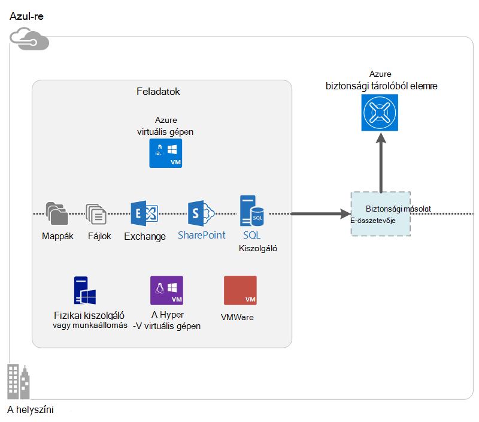

<properties
    pageTitle="Mi az Azure biztonsági másolat? | Microsoft Azure"
    description="Azure biztonsági mentése és helyreállítási Services használatával, készítsen biztonsági másolatot, és adatokat és alkalmazásokat a Windows-kiszolgálók, és a Windows-ügyfél gépek, System Center DPM Azure virtuális gépeken futó visszaállítani."
    services="backup"
    documentationCenter=""
    authors="markgalioto"
    manager="cfreeman"
    editor="tysonn"
    keywords="biztonsági mentési és visszaállítási; helyreállítási szolgáltatások; biztonsági másolat megoldások"/>

<tags
    ms.service="backup"
    ms.workload="storage-backup-recovery"
    ms.tgt_pltfrm="na"
    ms.devlang="na"
    ms.topic="get-started-article"
    ms.date="10/19/2016"
    ms.author="jimpark; trinadhk"/>

# Mi az Azure biztonsági másolat?
Azure biztonsági másolatot a szolgáltatást, amely segítségével biztonsági mentése és visszaállítása, hogy adatait abba a Microsoft cloud. A meglévő helyszíni, vagy a helyszínen biztonsági megoldás lecseréli az megbízható, a biztonságos és a költség versenytársak felhőalapú megoldás. Azt is segít az elemeket, amelyeket futtassa a felhőben. Azure biztonsági másolat világszínvonalú infrastruktúra méretezhető, tartós és könnyen hozzáférhető épül helyreállítási-szolgáltatásokat nyújt.

[Megtekintés az Azure biztonsági mentése egy videó áttekintése](https://azure.microsoft.com/documentation/videos/what-is-azure-backup/)

## Miért érdemes használni az Azure biztonsági másolat?
Hagyományos biztonsági megoldások lett hatékonyabb kezelni a lemez vagy szalag hasonló zárólap a felhőben. Bár ezt a megközelítést egyszerű, érdemes Emellett korlátozott. Nem kihasználhatja teljes az alapul szolgáló felhő platform és a megfelelője egy hatékony és drága megoldás.
Viszont Azure biztonsági biztosítja hatékony és elérhető felhő biztonsági megoldást előnyeit. Íme néhány főbb előnyöket a Azure biztonsági mentés nyújt.

| A szolgáltatás | Előny |
| ------- | ------- |
| Tárolók automatikus kezelése | A helyszíni tárolók tőke kiadás nem szükséges. Azure biztonsági mentése automatikusan osztja ki, és biztonsági másolat tárolási kezeli, és fizetési mint-akkor-használható felhasználási modell használ. |
| Korlátlan méretezése | Kihasználhatja magas elérhetősége garanciákkal rezsiköltség karbantartási és felügyeleti nélkül. Azure biztonsági másolat használja az alapul szolgáló power és Azure a felhőben, beosztásának nonintrusive autoscaling képességeit. |
| Több tárhely beállításai | Válassza ki a biztonsági másolat tárolási szükséges alapján:<li>Helyi meghajtóra felesleges tároló letiltása blob ideális ár-tudatában ügyfelek, és még könnyebben helyi hardver hibák adatok védelme. <li>Blokkokból álló blob geo replikációs tároló három több másolatot a páronkénti adatközpontban biztosít. Ezen további másolatok súgó, győződjön meg róla, hogy az adatok biztonsági másolatának nagyon elérhető, ha egy Azure webhelyszintű katasztrófa fordul elő. |
| Korlátlan adatátviteli | A a biztonsági másolat tárolóból elemre a visszaállítási művelet során nem minden kilépési (kimenő) adatátvitel ingyenesek. A bejövő adatok Azure egyben ingyenes. Működik-e az importálási szolgáltatásával hol érhető el. |
| Adatok titkosítása | Adatok titkosítása biztonságos továbbítása és a nyilvános felhőben felhasználói adatok tárolásának tesz lehetővé. A forrás a titkosítási jelszó van tárolva, és soha nem küldött vagy Azure-ban tárolt. A titkosítási kulcs szükséges visszaállítása az adatok közül, és csak a felhasználói adatok teljes hozzáféréssel rendelkezik a szolgáltatásban. |  
| Alkalmazás egységes biztonsági mentése | A Windows alkalmazás egységes biztonsági másolatok biztosíthatja javítások nincs szükség a visszaállítás, amely csökkenti a helyreállítási idő cél idején. Ez lehetővé teszi a felhasználóknak való visszatéréshez fut gyorsabban. |
| Hosszú távú adatmegőrzési | Helyett fizetni helyszínen szalag biztonsági megoldások, az ügyfelek lehet vissza felfelé Azure, amely magában foglalja a alacsony költségek lenyűgöző szalag-szerű megoldást. |

## Azure biztonságimásolat-összetevők
Mivel a biztonsági másolat hibrid biztonsági megoldást, több összetevők, amely a közös munka engedélyezése a végpontok közötti biztonsági mentése és visszaállítása munkafolyamatok áll.

### Telepítési esetek

| Összetevő | Elvégezhető Azure-ban? | Lehet helyszíni telepített? | Támogatott céltábladiagram tárhely|
| --- | --- | --- | --- |
| Azure Backup agent | 
**igen**
 
Az Azure biztonsági másolat ügynök bármely Windows Server virtuális Azure-ban futó telepíthetők.
 | 
**igen**
 
A biztonsági másolat agent bármely Windows Server virtuális vagy a fizikai gépi telepíthetők.
 | 
Azure biztonsági másolat tárolóból elemre
 |
| System Center adatok védelme Manager (DPM) | 
**igen**

További tudnivalók [az Azure System Center DPM használatával munkaterhelésekből védelmét](http://blogs.technet.com/b/dpm/archive/2014/09/02/azure-iaas-workload-protection-using-data-protection-manager.aspx).
 | 
**igen**
 
További tudnivalók a [munkaterhelésének és a adatközpontban VMs védelmét](https://technet.microsoft.com/library/hh758173.aspx).
 | 
Helyi meghajtóra csatlakoztatott lemezre,
 
Azure biztonsági másolat tárolóból elemre
 
szalag (helyszíni csak)
 |
| Azure biztonsági kiszolgálón | 
**igen**

További tudnivalók [az Azure Azure biztonságimásolat-kiszolgálóval való munkaterhelésekből védelmét](backup-azure-microsoft-azure-backup.md).
 | 
**igen**
 
További tudnivalók [az Azure Azure biztonságimásolat-kiszolgálóval való munkaterhelésekből védelmét](backup-azure-microsoft-azure-backup.md).
 | 
Helyi meghajtóra csatolt lemezen,
 
Azure biztonsági másolat tárolóból elemre
 |
| Azure biztonsági mentése (virtuális kiterjesztésű) | 
**igen**

Azure háló része

Speciális biztonsági másolat, [mint a szolgáltatás (IaaS) virtuális gépeken futó Azure infrastruktúra](backup-azure-vms-introduction.md).
 | 
**nem**
 
System Center DPM segítségével biztonsági másolatot készíthet az az Adatközpont virtuális gépeken futó.
 | 
Azure biztonsági másolat tárolóból elemre
 |

### Összetevő szintű előnyeit és korlátai

| Összetevő | Legfontosabb előny | Korlátozások | Helyreállítási Granularitás |
| --- | --- | --- | --- |
| Azure biztonsági mentése (MARS) agent | <li>Lehet biztonsági másolatot készíteni a Windows operációs rendszer számítógépen lévő fájlok és mappák legyen az fizikai vagy virtuális (VMs lehet tetszőleges helyszíni vagy Azure)<li>Nincs szükség külön biztonsági kiszolgáló<li>Használja az Azure biztonsági tárolóból elemre | <li>Háromszor a nap biztonságimásolat-fájl szint visszaállítása<li>Fájl/mappa/mennyiségi szintű visszaállítása egyetlen, nem alkalmazás szem előtt<li>Nem támogatott Linux | fájlok és mappák/kötet |
| System Center adatkezelő védelme | <li>Alkalmazás tartsa szem előtt pillanatképek (VSS)<li>Mikor érdemes biztonsági másolatok készítése a teljes rugalmasság<li>Helyreállítási granularitása (mind)<li>Használható az Azure biztonsági másolat tárolóból elemre.<li>Linux támogatási (Ha a Hyper-V szolgáltatást úgy is) | <li>(VMware virtuális, amelyről biztonsági másolatot az Oracle terhelést készítsen biztonsági másolatot) eltérő támogatásának hiánya.  | fájlok és mappák/kötet / VMs/alkalmazások |
| Microsoft Azure biztonsági kiszolgálón | <li>Alkalmazás tartsa szem előtt pillanatképek (VSS)<li>Mikor érdemes biztonsági másolatok készítése a teljes rugalmasság<li>Helyreállítási granularitása (mind)<li>Használható az Azure biztonsági másolat tárolóból elemre.<li>Linux támogatási (Ha a Hyper-V szolgáltatást úgy is)<li>Nincs szükség a System Center licencre | <li>(VMware virtuális, amelyről biztonsági másolatot az Oracle terhelést készítsen biztonsági másolatot) eltérő támogatásának hiánya.<li>Mindig az élő Azure előfizetést igényel<li>Nem támogatja a szalag biztonsági mentése | fájlok és mappák/kötet / VMs/alkalmazások |
| Azure IaaS virtuális biztonsági mentése | <li>Natív biztonsági másolatok for Windows vagy Linux rendszerhez<li>Nem kötelező adott ügynök telepítése<li>Nincs szükség biztonsági infrastruktúra háló szintű biztonsági mentése | <li>Egyszer vissza felfelé vagy lemez szintű visszaállítása<li>Nem tudja a helyszíni kevésbé | VMs Az összes lemez (a PowerShell használatával) |

## Mely alkalmazások és a feladatok készíthető?

| Terhelést | Forrás gépi | Azure biztonsági másolat megoldás |
| --- | --- |---|
| Fájlok és mappák | A Windows Server | 
[Azure Backup agent](backup-configure-vault.md)
 
[System Center DPM](backup-azure-dpm-introduction.md) (+ az Azure biztonsági másolat ügynök)
 
[Azure biztonsági kiszolgálón](backup-azure-microsoft-azure-backup.md) (az Azure biztonsági másolat ügynök befoglalása)
  |
| Fájlok és mappák | Windows-ügyfél | 
[Azure Backup agent](backup-configure-vault.md)
 
[System Center DPM](backup-azure-dpm-introduction.md) (+ az Azure biztonsági másolat ügynök)
 
[Azure biztonsági kiszolgálón](backup-azure-microsoft-azure-backup.md) (az Azure biztonsági másolat ügynök befoglalása)
  |
| A Hyper-V virtuális gép (Windows) | A Windows Server | 
[System Center DPM](backup-azure-backup-sql.md) (+ az Azure biztonsági másolat ügynök)
 
[Azure biztonsági kiszolgálón](backup-azure-microsoft-azure-backup.md) (az Azure biztonsági másolat ügynök befoglalása)
 |
| A Hyper-V virtuális gép (Linux) | A Windows Server | 
[System Center DPM](backup-azure-backup-sql.md) (+ az Azure biztonsági másolat ügynök)
 
[Azure biztonsági kiszolgálón](backup-azure-microsoft-azure-backup.md) (az Azure biztonsági másolat ügynök befoglalása)
  |
| A Microsoft SQL Server | A Windows Server | 
[System Center DPM](backup-azure-backup-sql.md) (+ az Azure biztonsági másolat ügynök)
 
[Azure biztonsági kiszolgálón](backup-azure-microsoft-azure-backup.md) (az Azure biztonsági másolat ügynök befoglalása)
  |
| Microsoft SharePoint | A Windows Server | 
[System Center DPM](backup-azure-backup-sql.md) (+ az Azure biztonsági másolat ügynök)
 
[Azure biztonsági kiszolgálón](backup-azure-microsoft-azure-backup.md) (az Azure biztonsági másolat ügynök befoglalása)
   |
| Microsoft Exchange |  A Windows Server | 
[System Center DPM](backup-azure-backup-sql.md) (+ az Azure biztonsági másolat ügynök)
 
[Azure biztonsági kiszolgálón](backup-azure-microsoft-azure-backup.md) (az Azure biztonsági másolat ügynök befoglalása)
   |
| Azure IaaS VMs (Windows) | - | [Azure biztonsági mentése (virtuális kiterjesztésű)](backup-azure-vms-introduction.md) |
| Azure IaaS VMs (Linux) | - | [Azure biztonsági mentése (virtuális kiterjesztésű)](backup-azure-vms-introduction.md) |

## ARM és Linux támogatása

| Összetevő | ARM-támogatás | Linux (Azure záradékkal) támogatás |
| --- | --- | --- |
| Azure biztonsági mentése (MARS) agent | igen | Nincs (csak Windows-alapú ügynök) |
| System Center adatkezelő védelme | Igen (a vendégként való bekapcsolódáshoz ügynök) | Csak a Hyper-V (nem Azure virtuális) csak fájl egységes biztonsági másolat lehetőség. |
| Azure biztonsági Server (MABS) | Igen (a vendégként való bekapcsolódáshoz ügynök) | Csak a Hyper-V (nem Azure virtuális) csak fájl egységes biztonsági másolat mindenre (megegyezik DPM) |
| Azure IaaS virtuális biztonsági mentése | igen | igen |

[AZURE.INCLUDE [learn-about-deployment-models](../../includes/learn-about-deployment-models-include.md)]

## Biztonsági mentése és visszaállítása prémium tároló VMs

Az Azure biztonsági másolat szolgáltatás most prémium tároló VMs védelmet nyújt.

### Készítsen biztonsági másolatot prémium tároló VMs

Biztonsági másolatot a prémium tároló VMs, miközben a biztonsági másolat szolgáltatás ideiglenes átmeneti tárolásra szolgáló helyre prémium tároló fiók hoz létre. Az átmeneti tárolásra szolgáló helyét, nevű "AzureBackup-", a virtuális csatolt prémium lemezt adatok összesítésére méretének megegyezik.

>[AZURE.NOTE] Nem módosíthatók az átmeneti tárolásra szolgáló helyének módosítása.

A biztonsági mentési feladat befejeződése után a program törli az átmeneti tárolásra szolgáló helyét. Az ár tárolási tárolására használt átmeneti tárolásra szolgáló mappa összhangban az összes [prémium tároló árak](../storage/storage-premium-storage.md#pricing-and-billing).

### Prémium tároló VMs visszaállítása

Prémium tároló virtuális vagy prémium tárolóhoz vagy normál tárolóhoz állíthatók vissza. A prémium tároló virtuális helyreállítási pont visszaállítása a prémium tároló visszaállítás tipikus során a rendszer. Azonban lehet ha vissza szeretne állítani egy prémium tároló virtuális helyreállítási pont szabványos tárhely a tényleges költség. Helyreállítása a következő típusú használható, ha szüksége van egy részét a virtuális-fájlokat.

## Funkciók
Az alábbi öt táblázatok összegzés milyen biztonsági funkciók minden összetevő kezeli.

### Tárhely

| A szolgáltatás | Azure Backup agent | System Center DPM | Azure biztonsági kiszolgálón | Azure biztonsági mentése (virtuális kiterjesztésű) |
| ------- | --- | --- | --- | ---- |
| Azure biztonsági másolat tárolóból elemre | ![igen][green] | ![igen][green] | ![igen][green] | ![igen][green] |
| Lemezterület | | ![igen][green] | ![igen][green] |  |
| Szalag tárhely | | ![igen][green] |  | |
| A tömörítési (a biztonsági másolat tárolóból elemre) | ![igen][green] | ![igen][green]| ![igen][green] | |
| Növekményes biztonsági mentése | ![igen][green] | ![igen][green] | ![igen][green] | ![igen][green] |
| Lemezen deduplication | | ![Részben][yellow] | ![Részben][yellow]| | |

A biztonsági másolat tárolóból elemre az előnyben részesített tároló célja minden összetevő keresztül. System Center DPM és biztonsági másolat Server is biztosít a beállítást, ha egy helyi lemezre másolása. Jó helyen jár csak a System Center DPM adatok írásához a szalag tárolóeszközre lehetőséget nyújt a.

#### Növekményes biztonsági mentése
Minden összetevő támogatja a növekményes biztonsági másolatot készíteni, függetlenül a cél tároló (lemezen, szalagos, biztonsági tárolóból elemre). Növekményes biztonsági másolat biztosítja, hogy biztonsági másolatok tárolására és az idő hatékony, úgy, hogy csak a legutolsó biztonsági mentés óta elvégzett módosításokat.

#### Tömörítés
Biztonsági másolatok szükséges tárolóterület csökkentése érdekében tömöríti. A csak, mely nem használja a tömörítési összetevője a virtuális bővítmény. Virtuális kiterjesztésű összes adatok biztonsági másolatának másolja át a vevőkód tárhely a biztonsági másolat tárolóra ugyanabban a régióban tömörítéssel nélkül. Tömörítés nélkül kissé fenntartása inflates használt tárolására, miközben tömörítés nélkül az adatok tárolásának lehetővé teszi, hogy így gyorsabban visszaállítása a lapok.

#### Deduplication
System Center DPM és a biztonsági másolat Server deduplication támogatott mikor érdemes a [Hyper-V virtuális gépen rendszerbe](http://blogs.technet.com/b/dpm/archive/2015/01/06/deduplication-of-dpm-storage-reduce-dpm-storage-consumption.aspx). Deduplication merevlemezeken virtuális (VHD), amely a virtuális gép biztonsági tárolására csatolt deduplication Windows Server használatával történik a host szintjén.

>[AZURE.WARNING] Deduplication minden összetevő biztonsági mentése az Azure-ban nem érhető el. Amikor a rendszer központ DPM és biztonsági másolat Server Azure-ban van telepítve, a nem deduplicated tároló lemezt a virtuális csatolva.

### Biztonsági

| A szolgáltatás | Azure Backup agent | System Center DPM | Azure biztonsági kiszolgálón | Azure biztonsági mentése (virtuális kiterjesztésű) |
| ------- | --- | --- | --- | ---- |
| Hálózati biztonsági (az Azure) | ![igen][green] |![igen][green] | ![igen][green] | ![Részben][yellow]|
| Adatok biztonsági (az Azure) | ![igen][green] |![igen][green] | ![igen][green] | ![Részben][yellow]|

Titkosítási szabványos 256 speciális használatával titkosított összes biztonságimásolat-alapú forgalmat a kiszolgálóról a biztonsági másolat tárolóból elemre. Az adatokat küldi el a biztonságos HTTPS-kapcsolaton keresztül. Az adatok biztonsági másolatának a biztonságimásolat-tárolóra titkosított formában is vannak tárolva. Csak az ügyfél a jelszó zárolásának feloldásához ezeket az adatokat tárolja. A Microsoft nem tudja visszafejteni az adatok biztonsági másolatának bármely pontján.

>[AZURE.WARNING] A biztonsági másolatok adatainak titkosítására használt kulcs szerepel a csak az ügyféllel. A Microsoft nem tart fenn egy másolatot az Azure-ban, és nincs hozzáférése bármely a billentyűt. A kulcs elvesztette van, ha a Microsoft nem tudja visszaállítani a biztonsági mentés adatait.

Azure VMs mentésével beállítása titkosítási *belül* a virtuális gép szükséges. Használja a Windows virtuális gépeken futó és **a titkosítási dm** Linux virtuális gépeken BitLocker. Azure biztonsági másolat nem titkosítja automatikusan adatok biztonsági másolatának, hogy az elérési út keresztül.

### Támogatott munkaterhelésekből

| A szolgáltatás | Azure Backup agent | System Center DPM | Azure biztonsági kiszolgálón | Azure biztonsági mentése (virtuális kiterjesztésű) |
| ------- | --- | --- | --- | ---- |
| A Windows Server gépi – a fájlok és mappák | ![igen][green] | ![igen][green] | ![igen][green] | |
| A Windows ügyfélgép – fájlok és mappák | ![igen][green] | ![igen][green] | ![igen][green] | |
| A Hyper-V virtuális gép (Windows) | | ![igen][green] | ![igen][green] | |
| A Hyper-V virtuális gép (Linux) | | ![igen][green] | ![igen][green] | |
| A Microsoft SQL Server | | ![igen][green] | ![igen][green] | |
| Microsoft SharePoint | | ![igen][green] | ![igen][green] | |
| Microsoft Exchange  | | ![igen][green] | ![igen][green] | |
| Azure virtuális gép (Windows) | | | | ![igen][green] |
| Azure virtuális gép (Linux) | | | | ![igen][green] |

### Hálózati

| A szolgáltatás | Azure Backup agent | System Center DPM | Azure biztonsági kiszolgálón | Azure biztonsági mentése (virtuális kiterjesztésű) |
| ------- | --- | --- | --- | ---- |
| Hálózati tömörítés (annak a biztonságimásolat-kiszolgáló) | | ![igen][green] | ![igen][green] | |
| Hálózati tömörítés (annak a biztonsági másolat tárolóra) | ![igen][green] | ![igen][green] | ![igen][green] | |
| Hálózati protokoll (annak a biztonságimásolat-kiszolgáló) | | TCP | TCP | |
| Hálózati protokoll (annak a biztonsági másolat tárolóra) | HTTPS | HTTPS | HTTPS | HTTPS |

A virtuális bővítmény adatokat olvas be az közvetlenül az Azure tároló fiókból a tárterület-hálózaton keresztül, mert nincs szükség optimalizálhatja a forgalmat. A forgalom az Azure adatközpontban helyi tároló hálózaton szándékos, tömörítés kis szükségessége miatt nem sávszélesség szempontjait.

Ha biztonsági kiszolgálón (DPM vagy biztonsági kiszolgáló) biztonsági másolatot az adatokról, az elsődleges-kiszolgálóról forgalmat a biztonsági kiszolgálón tömörítheti mentése sávszélesség-ra.

#### Hálózati szabályozása
Az Azure biztonsági másolat ügynök biztosít szabályozási lehetőséget, amely lehetővé teszi, hogy használatának szabályozása hálózati sávszélesség adatátvitel során. Szabályozásának akkor lehet hasznos, ha módosítani szeretné a biztonsági másolatot során adatok munkaórák, de nem szeretné a biztonsági mentés más internetes forgalmat zavarja. Az adatok szabályozásának átadás vonatkozik biztonsági mentése és visszaállítása a tevékenységek.

### Biztonsági másolat és az adatmegőrzési

|  | Azure Backup agent | System Center DPM | Azure biztonsági kiszolgálón | Azure biztonsági mentése (virtuális kiterjesztésű) |
| --- | --- | --- | --- | --- |
| Biztonsági mentési gyakoriságának (a biztonsági másolat tárolóra) | Napi három biztonsági másolatok | Napi két biztonsági másolatok |Napi két biztonsági másolatok | Napi egy biztonsági mentése |
| Biztonsági másolat gyakoriság (lemezre) | Nem alkalmazható | 
Az SQL Server 15 percenként
 
Más munkaterhelésekből óránként
 | 
Az SQL Server 15 percenként
 
Minden más munkaterhelésekből óra
 |Nem alkalmazható |
| Az adatmegőrzési beállítások | Naponta, hetente, havonta, évente | Naponta, hetente, havonta, évente | Naponta, hetente, havonta, évente |Naponta, hetente, havonta, évente |
| Az adatmegőrzési időszak | Legfeljebb 99 évek | Legfeljebb 99 évek | Legfeljebb 99 évek | Legfeljebb 99 évek |
| Biztonsági másolat tárolóból elemre a helyreállítási pontok | Korlátlan | Korlátlan | Korlátlan | Korlátlan |
| Helyi lemezen helyreállítási pontok | Nem alkalmazható | Fájl kiszolgálóinak 64  az alkalmazás-kiszolgálók 448 | Fájl kiszolgálóinak 64  az alkalmazás-kiszolgálók 448 |Nem alkalmazható |
| Helyreállítási pontok szalagon | Nem alkalmazható | Korlátlan | Nem alkalmazható | Nem alkalmazható |

## Mi az a tárolóból elemre hitelesítőadat-fájl?

A tárolóból elemre hitelesítő adatok fájl minden biztonsági tárolóból elemre a portál által generált tanúsítvány. A portál majd feltölti a nyilvános kulcshoz az Access vezérlő szolgáltatást (ACS). A titkos kulcs bocsátja ki a felhasználó hitelesítő adatait letöltésekor, és kattintson a gép regisztráció során megadott. A titkos kulcs hitelesíti a gép adatok biztonsági másolatának küldése a biztonsági másolat Azure szolgáltatás egy azonosított tárolóból elemre.

A tárolóból elemre hitelesítő csak a regisztrációs munkafolyamat során használják. A feladata annak érdekében, hogy a tárolóból elemre hitelesítő adatok fájlt nem sérül. A pálcikák bármely engedélyezetlen felhasználó tartozik, ha a tárolóból elemre hitelesítő adatok fájl használható regisztrálni más gépek szemben az azonos tárolóból elemre. Jó helyen jár mivel az adatok biztonsági másolatának titkosított egy jelszót, csak a felhasználói csoportba, a meglévő adatok biztonsági másolatának nem sérül. Csökkentésében ezt a problémát, tárolóra hitelesítő adatok beállítása 48 órában lejár. Miközben letöltheti biztonsági tárolóra hitelesítő adatai vault tetszőleges számú alkalommal, csak a legújabb fájl vonatkozó során a regisztrációs munkafolyamat.

## Miben különbözik a Azure biztonsági másolatot a Azure webhely helyreállítási?
Vevőknek tévessze össze a biztonsági másolat helyreállítási és a helyreállítás. Mindkét adatok rögzítése, és adja meg a visszaállítás szemantikáját, de a fő érték értékűeknek eltérőek.

Azure biztonsági másolatot készít be adatokat a helyszíni és felhőbeli. Azure webhely helyreállítási koordinálja virtuális gép és fizikai-kiszolgáló replikációs, feladatátvétel és visszaállás. Mind a kettőhöz fontosak, mert a katasztrófa helyreállítási megoldás kell megbízható szeretné tartani az adatokat, és a helyreállítható (biztonsági másolat), *és* tartsa a rendelkezésre álló munkaterhelésekből (webhely-helyreállítás) kimaradások végrehajtásakor.

Az alábbi fogalmak segítséget nyújt a fontos döntések biztonsági mentése és katasztrófa helyreállítási körül.

| Fogalma | Részletek | Biztonsági másolat | Vészhelyreállítás (DR) |
| ------- | ------- | ------ | ----------------- |
| Helyreállítási pont cél (Készletben) | Elfogadható az adatok elvesztését, ha a helyreállítás kell végrehajtania összege. | Biztonsági másolat megoldások van-e a elfogadható Készletben széles adattartományról. Virtuális gép biztonsági másolatok általában van egy nap, egy Készletben, míg a adatbázis biztonsági mentése 15 perccel a lehető RPOs. | Katasztrófa helyreállítási megoldások alacsony RPOs van. A DR másolatot néhány másodpercet vagy néhány perc lehet mögött. |
| Helyreállítási idő cél (RTO) | A helyreállítás fejezze be és távolíthat el a szükséges idő mennyiségét. | A nagyobb Készletben miatt biztonsági megoldást kell-e dolgoznia adatmennyiség, általában sokkal nagyobb, amely hosszabb RTOs vezet. Például nap szeretné visszaállítani adatok szalagok, attól függően, hogy a helyszínen helyről szalag átviteli szükséges időt is eltarthat. | Katasztrófa helyreállítási megoldások kisebb RTOs van, mert az több szinkronban a forrás. Kevesebb módosítások kell dolgozható fel. |
| Adatmegőrzés | Mennyi ideig adatokat kell tárolni | Ha műveleti helyreállítási (adatsérülésekkel, a fájl véletlen törlését, OS hiba) igénylő esetben biztonsági általában tárolja az adatokat 30 nap vagy annál kisebb. Megfelelőségi szempontból adatok lehet kell tárolni a hónap vagy akár évek. Adatok biztonsági másolatának kiválóan alkalmas az ezekben az esetekben az archiválás. | Vészhelyreállítás csak műveleti helyreállítási adatok, amely általában vesz igénybe néhány óra vagy nap felfelé van szüksége. A részletes adatok rögzítés DR megoldások használt, mert hosszú távú adatmegőrzési DR adatokkal nem ajánlott. |

## Következő lépések

Próbálja ki az egyszerű Azure biztonsági másolatot. További tudnivalókért olvassa el oktatóanyagokban:

- [Próbálja ki az Azure biztonsági mentése](backup-try-azure-backup-in-10-mins.md)
- [Próbálja ki az Azure virtuális biztonsági mentése](backup-azure-vms-first-look.md)

Adott oktatóanyagok gyorsan feljebb szeretne lépni, mert azok jelzik, hogy csak a legközvetlenebb elérési útját mentéséről az adatok. További információt a biztonsági másolat, típusát szeretné, hogy:

- [Biztonsági mentése a Windows gépi](backup-configure-vault.md)
- [Készítsen biztonsági másolatot alkalmazás munkaterhelésekből](backup-azure-microsoft-azure-backup.md)
- [Biztonsági másolat Azure IaaS VMs](backup-azure-vms-prepare.md)

[green]: ./media/backup-introduction-to-azure-backup/green.png
[yellow]: ./media/backup-introduction-to-azure-backup/yellow.png
[red]: ./media/backup-introduction-to-azure-backup/red.png
