<properties
   pageTitle="Ismerje meg, hogyan biztonsági másolatot készíthet fájlokat és mappákat a Windows Azure biztonsági másolat erőforrás-kezelő telepítési modellt használja az Azure |} Microsoft Azure"
   description="Megtudhatja, hogy miként létrehozása a tárolóból elemre, a helyreállítási szolgáltatások ügynök telepítése és a fájlok és mappák biztonsági mentése az Azure Windows Server biztonsági másolatot."
   services="backup"
   documentationCenter=""
   authors="markgalioto"
   manager="cfreeman"
   editor=""
   keywords="hogyan kell a biztonsági mentés; biztonsági másolat készítése"/>

<tags
   ms.service="backup"
   ms.workload="storage-backup-recovery"
   ms.tgt_pltfrm="na"
   ms.devlang="na"
   ms.topic="hero-article"
   ms.date="09/27/2016"
   ms.author="markgal;"/>

# Először meg: készítsen biztonsági másolatot a fájlok és mappák használata az erőforrás-kezelő telepítési modell Azure mentéssel

Ez a cikk bemutatja, hogyan biztonsági másolat készítése a Windows Server (vagy a Windows-ügyfél) fájlok és mappák Azure az Azure biztonsági másolat erőforrás-kezelő használatával. Ismerteti, hogy az alapokat szánt oktatóanyagot. Szeretné az Ismerkedés az Azure biztonsági másolat használata, ha a megfelelő helyre.

Ha szeretne többet megtudni az Azure biztonsági másolatot, olvassa el az [Áttekintés](backup-introduction-to-azure-backup.md).

Ezek a tevékenységek fájlok és mappák biztonsági mentése az Azure van szükség:

 elő az Azure-ra, (Ha még nincs egyet). 
 hozzon létre egy helyreállítási szolgáltatások tárolóból elemre. 
 azokat a fájlokat letölteni. 
 telepítés és a külső.FÜGGV a helyreállítási szolgáltatások agent. 
 készítsen biztonsági másolatot a fájlok és mappák.

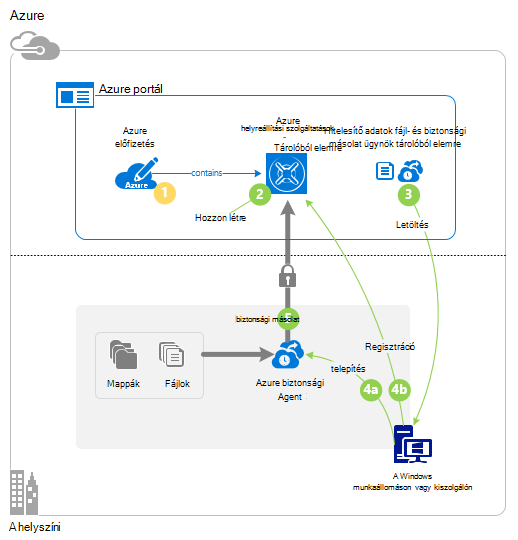

## Lépés: 1: Elő az Azure-ra

Ha nem rendelkezik az Azure előfizetéssel, hozzon létre egy [ingyenes fiókot](https://azure.microsoft.com/free/) , amellyel bármely Azure szolgáltatás eléréséhez.

## Lépés: 2: Hozzon létre egy helyreállítási szolgáltatások tárolóból elemre.

Biztonsági másolatot a fájlok és mappák, meg kell hozzon létre egy helyreállítási szolgáltatások tárolóból elemre a régió, hol tárolja az adatokat szeretne. Meg kell határozza meg, hogy hogyan replikált tárhelyet.

### Hozzon létre egy helyreállítási szolgáltatások a tárolóból elemre

1. Ha még nem tette meg, jelentkezzen be az [Azure-portálon](https://portal.azure.com/) Azure-előfizetése segítségével.

2. A központi menüben kattintson a **Tallózás gombra** , és erőforrások listája, írja be a **Helyreállítási szolgáltatások** , és az **helyreállítási szolgáltatások tárolókban**gombra.

    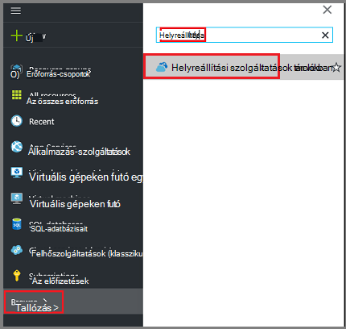  

3. A **helyreállítási szolgáltatások tárolókban** menüben kattintson a **Hozzáadás**gombra.

    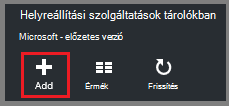

    Megnyílik a helyreállítási szolgáltatások tárolóból elemre a lap, kéri, adja meg **nevét**, **előfizetés**, **erőforráscsoport**és **helyét**.

    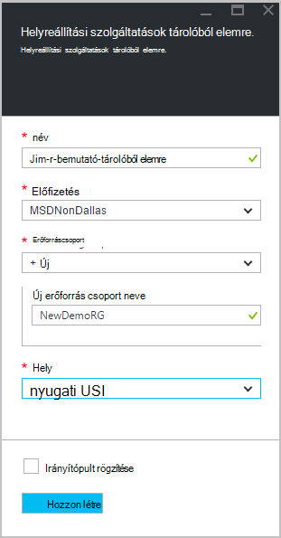

4. A **név**írja be egy rövid nevet, amely azonosítja a tárolóból elemre.

5. Kattintson az **előfizetés** az előfizetések elérhető listájának megjelenítéséhez.

6. **Erőforráscsoport** a rendelkezésre álló erőforráscsoport listájának megtekintéséhez, vagy hozzon létre egy új erőforráscsoport **Új** gombra.

7. Kattintson a **hely** jelölje ki a földrajzi régióban esetében a tárolóból elemre. Ez a beállítás azt határozza meg a földrajzi régióban, ahol az adatok biztonsági másolatának küldése.

8. Kattintson a **létrehozása**gombra.

    Ha nem látja a tárolóból elemre van töltve fog szerepelni, kattintson a **frissítés**parancsra. Amikor frissíti a listában, kattintással jelölje ki azt a tárolóból elemre.

### Tárterület redundancia meghatározása
A helyreállítási szolgáltatások tárolóból elemre első létrehozásakor meghatározhatja, hogy hogyan tároló replikált-e.

1. Kattintson az új tárolóból elemre kattintva nyissa meg az irányítópulton.

2. Kattintson a **Beállítások** lap, amely automatikusan megnyílik a tárolóból elemre irányítópulthoz a **Biztonsági másolat infrastruktúra**.

3. A biztonsági másolat infrastruktúra lap kattintson a **Biztonsági mentés beállításainak** megtekintése a **tárhely replikációs típusát**.

    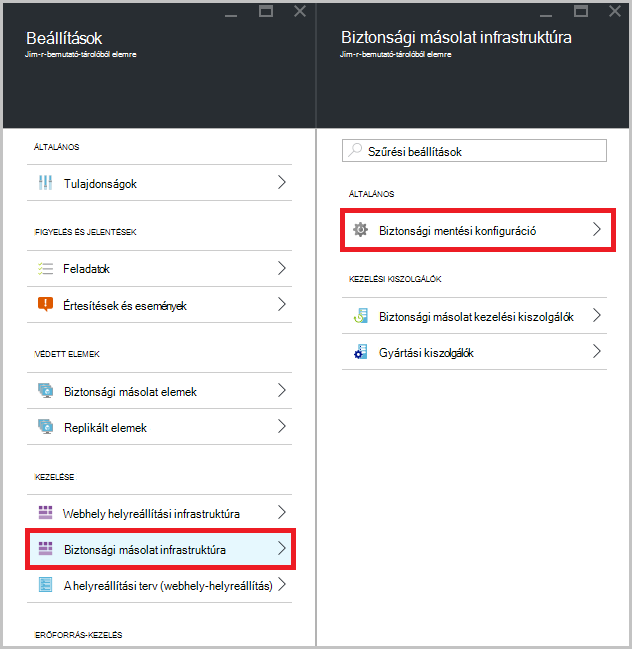

4. Válassza a megfelelő tárolási replikációs esetében a tárolóból elemre.

    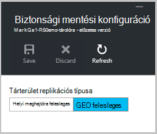

    Alapértelmezés szerint a tárolóból elemre a geo felesleges tároló tartalmaz. Azure használatakor egy elsődleges biztonsági másolat tárolási végpontjának használja továbbra is geo felesleges tárhelyet. Azure használatakor egy nem elsődleges biztonságimásolat-végpontot, válassza a helyi meghajtóra felesleges tárolására, az adatok tárolása Azure költsége csökkenti. További információk [geo felesleges](../storage/storage-redundancy.md#geo-redundant-storage) és a [helyi meghajtóra felesleges](../storage/storage-redundancy.md#locally-redundant-storage) -tárolási lehetőségek a az [Áttekintés](../storage/storage-redundancy.md).

Most, hogy létrehozta a tárolóból elemre, készítse elő a infrastruktúra készítsen biztonsági másolatot a fájlok és mappák letöltése a Microsoft Azure helyreállítási szolgáltatások ügynök és a tárolóból elemre az adatokat.

## Lépés a 3 - fájlok letöltése

1. Kattintson a **Beállítások** gombra a helyreállítási szolgáltatások tárolóra irányítópulton.

    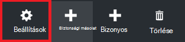

2. Kattintson a **első lépések > biztonsági másolat** kattintson a beállítások lap.

    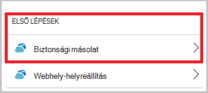

3. **Biztonsági másolat cél** kattintson a biztonsági másolat lap.

    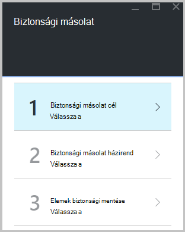

4. Válassza **a helyszíni** a Honnan származnak az a terhelést fut? menü.

5. **Fájlok és mappák** választhat a Miről szeretne biztonsági másolatot készíteni? menüre, és kattintson az **OK gombra**.

### Töltse le a helyreállítási szolgáltatások agent

1. Kattintson **a Windows Server ügynök töltse le vagy a Windows-ügyfél** az **Előkészítés infrastruktúra** lap.

    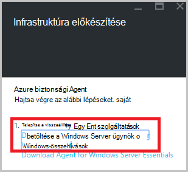

2. A letöltés előugró ablakban kattintson a **Mentés** gombra. Alapértelmezés szerint a **MARSagentinstaller.exe** fájlra a letöltések mappában van menti.

### Töltse le a tárolóból elemre hitelesítő adatok

1. Kattintson a **letöltése > Mentés** kattintson az előkészítés infrastruktúra lap.

    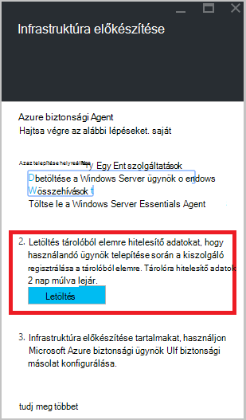

## Lépés a 4 - telepítés és regisztrálhatja a agent

>[AZURE.NOTE] Az Azure portálon keresztül engedélyezése biztonsági másolat hamarosan. Ekkor a Microsoft Azure helyreállítási szolgáltatások Agent helyszíni készítsen biztonsági másolatot a fájlok és mappák használata.

1. Keresse meg, és kattintson duplán a **MARSagentinstaller.exe** a letöltések mappában (vagy más mentett helyről).

2. Töltse ki a Microsoft Azure helyreállítási szolgáltatások ügynök beállítási varázsló. A varázsló kell:

    - Válasszon egy helyet a telepítési és gyorsítótárának mappáját.
    - Adja meg a proxy server info ha proxykiszolgáló használatával csatlakozik az internethez.
    - Hálózatüzemeltetője a felhasználó nevét és jelszavát, ha hitelesítéssel működő proxy
    - A letöltött tárolóra hitelesítő adatok megadása
    - Mentse a titkosítási jelszó biztonságos helyen.

    >[AZURE.NOTE] Ha elveszíti vagy elfelejti a jelszavát, a Microsoft nem súgó az adatok biztonsági másolatának visszaállítása. Mentse a fájlt egy biztonságos helyen. Szükség van egy biztonsági másolatának visszaállítása.

A agent most már telepítve van, és a számítógép regisztrálva van a tárolóból elemre. Készen áll arra, beállítása és a biztonsági másolat ütemezése.

## Lépés 5: A fájlok és mappák kevésbé

A kezdeti biztonsági másolat két fő feladatokat foglalja magában:

- A biztonsági mentés ütemezése
- Fájlok és mappák biztonsági mentése első alkalommal

A kezdeti biztonsági mentés végrehajtása, a Microsoft Azure helyreállítási Services agent kell használnia.

### A biztonsági mentés ütemezése

1. Nyissa meg a Microsoft Azure helyreállítási szolgáltatási ügynökök. A számítógépen **a Microsoft Azure**biztonsági másolatának kereséssel megtalálhatja.

    

2. A helyreállítási szolgáltatások ügynök kattintson a **Mentés**gombra.

    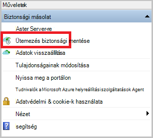

3. Az ütemterv biztonsági másolat varázsló használatának első lépései lapon kattintson a **Tovább**gombra.

4. Kattintson az elemek kijelölése biztonsági másolat lapra **Elemek hozzáadása**.

5. Jelölje ki a fájlokat és mappákat, amelyet szeretne biztonsági másolatot készíteni, és válassza a **rendben**.

6. Kattintson a **Tovább**gombra.

7. A **Biztonsági mentés ütemezése megadása** lapon adja meg a **biztonsági mentés ütemezése** , és kattintson a **Tovább**gombra.

    (Mértéke maximális száma naponta háromszor) napi vagy heti biztonsági ütemezheti.

    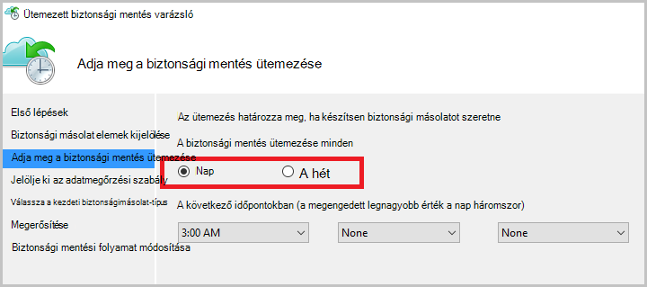

    >[AZURE.NOTE] További információ arról, hogy miként adja meg a biztonsági másolat ütemezést, olvassa el a [Használati Azure biztonsági a szalag infrastruktúra kicserélendő](backup-azure-backup-cloud-as-tape.md).

8. **Jelölje ki az adatmegőrzési** lapján jelölje be a biztonsági másolat az **Adatmegőrzési szabályt** .

    Az adatmegőrzési Itt adhatja meg az időtartam, amelynek a biztonsági másolatot szeretne tárolni. Csak megadása egy "strukturálatlan házirendet" az összes biztonsági pont, helyett megadhatja eltérő adatmegőrzési szabályok alapján a biztonsági mentés esetén. A napi, heti, havi vagy éves adatmegőrzési házirendek az igényeknek megfelelően módosíthatók.

9. A kezdeti biztonsági másolat típusának kiválasztása lapon válassza ki a kezdeti biztonsági. Hagyja a **automatikusan a hálózaton keresztül** kijelölt választógombot, és kattintson a **Tovább gombra**.

    Biztonsági másolatot készíthet automatikusan a hálózaton keresztül, vagy biztonsági másolatot készíthet offline. Ez a cikk hátralévő automatikusan mentésével folyamata ismerteti. Ha inkább egy offline biztonsági másolatot, olvassa el a cikk további információt [az Azure biztonsági Offline biztonsági munkafolyamat](backup-azure-backup-import-export.md) .

10. A Megerősítés lapon tekintse át az információkat, és kattintson a **Befejezés gombra**.

11. Az ütemezés létrehozását a varázsló befejezése után kattintson a **Bezárás**gombra.

### Biztonsági másolat készítése a fájlokat és mappákat, hogy az első alkalommal

1. A helyreállítási szolgáltatások agent kattintson **Azonnali biztonsági mentése elemre** a hálózaton keresztül kezdeti rendezi befejezéséhez.

    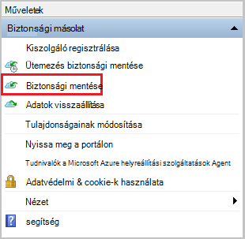

2. A Megerősítés lapon tekintse át a beállításokat, amelyekkel a vissza most varázslót biztonsági mentése a számítógépre. Kattintson a **Biztonsági másolatot készíteni**.

3. **Zárja be** a varázsló bezáráshoz kattintson. Ha ezek előtt a biztonsági másolat folyamat befejeződik, a varázsló továbbra is futtathatók a háttérben.

A kezdeti biztonsági mentés után a **feladat befejezése** állapota megjelenik a biztonsági másolat konzolban.

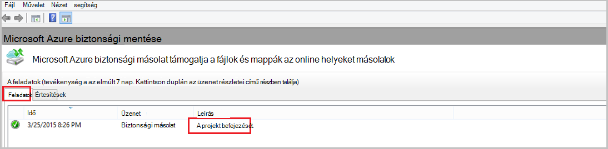

## Kérdések?
Ha kérdései vannak, vagy bármely funkció, amely tartalmazza, hogy milyen [küldjön visszajelzést](http://aka.ms/azurebackup_feedback).

## Következő lépések
- További részleteket szeretne megtudni a [Windows gépek mentésével](backup-configure-vault.md).
- Most, hogy mentésben a fájlokat és mappákat, akkor [a tárolókban és kiszolgálók kezelése](backup-azure-manage-windows-server.md).
- Ha egy biztonsági másolatának visszaállítása, használja az ebben a cikkben [egy Windows számítógépre a fájlok visszaállítása](backup-azure-restore-windows-server.md).
