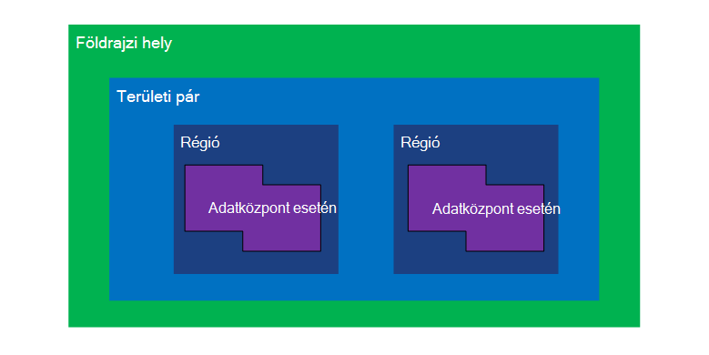
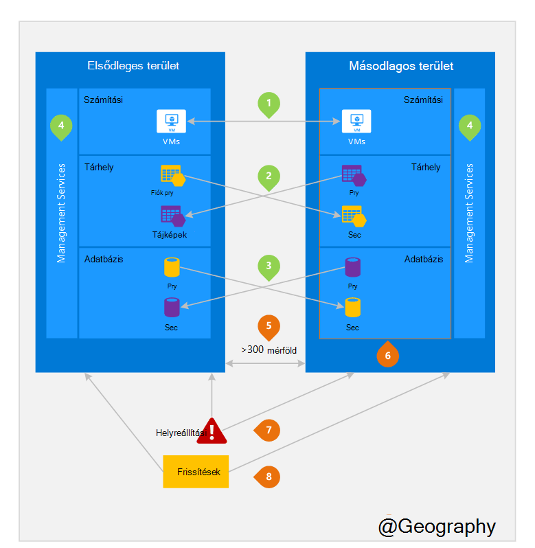

<properties
    pageTitle="Üzleti folytonosságot és katasztrófa helyreállítási (BCDR): Azure párosított régiók |} Microsoft Azure"
    description="Azure területi párban győződjön meg arról, hogy alkalmazások rugalmassá adatok központ hibák során."
    services="site-recovery"
    documentationCenter=""
    authors="rayne-wiselman"
    manager="jwhit"
    editor=""/>

<tags
    ms.service="site-recovery"
    ms.workload="storage-backup-recovery"
    ms.tgt_pltfrm="na"
    ms.devlang="na"
    ms.topic="article"
    ms.date="08/23/2016"
    ms.author="raynew"/>

# Üzleti folytonosságot és katasztrófa helyreállítási (BCDR): Azure párosított területek

## Mik azok a párosított régiók?

A világon több geographies Azure működik. Az Azure földrajzi egy meghatározott területén a világ, amely legalább egy Azure részt tartalmazza. Egy Azure terület belül egy egy vagy több adatközpontokkal tartalmazó Földrajz területen található.

Azure területenként közös kezdeményezhet területi két azonos földrajzi hely egy másik területéhez van megfeleltetni. A kivétel ez alól brazíliai Dél, amely van egy kívül a földrajzi régióban megfeleltetni.

Ábra: 1 – Azure területi pár diagram

| Földrajzi hely     |  Párosított területek  |                     |
| :-------------| :-------------   | :-------------      |
| Észak-Amerika | A központi Észak-amerikai | A központi Dél-Amerikai Egyesült Államok    |
| Észak-Amerika | Kelet-Amerikai Egyesült Államok          | Nyugati Amerikai Egyesült Államok             |
| Észak-Amerika | USA keleti 2        | Amerikai Egyesült Államok központi          |
| Észak-Amerika | Nyugati USA-beli 2        | Nyugati központi Amerikai Egyesült Államok     |
| Európa        | Észak-Európa     | Nyugati Európa         |
| Ázsia          | Dél-kelet-ázsiai  | Kelet-ázsiai           |
| Kína         | Kelet-kínai       | Észak-kínai         |
| Japán         | Japán keleti       | Japán nyugati          |
| Brazília        | Brazília Dél (1) | A központi Dél-Amerikai Egyesült Államok    |
| Ausztrália     | Ausztrália kelet   | Ausztrália Könyvesbolt is. |
| Amerikai Egyesült Államok kormányzati | Amerikai Egyesült Államok Gov Iowa      | Amerikai Egyesült Államok Gov Virginia     |
| India         | A központi India    | Dél-indiai         |
| Kanada        | Közép Kanadán   | Kanada-keleti         |
| EGYESÜLT KIRÁLYSÁG            | Egyesült Királyság nyugati          | Egyesült Királyság Dél            |

Táblázat 1 - leképezés azure területi pár

> (1) Dél Brazília oka az egyedi azt az egy kívül saját földrajzi régióban megfeleltetni. Másodlagos terület brazil dél dél központi US de Dél központi US meg másodlagos terület nem Brazília Dél.

Azt javasoljuk, hogy Azure-féle elkülönítési és elérhetőség házirendek összekapcsolhatók területi párban végig, bizonyos feladatok. Ha például a rendszer tervezett Azure frissítések telepítésének egymás után (nem egy időben) párosított területek között. Ez azt jelenti, hogy még egy hibás frissítés ritka esetben a két régió nem befolyásolja egyidejű. Egy széles üzemszünetek valószínű esetben továbbá minden pár ki legalább egy régió helyreállítási van prioritása.

## Példa párosított területek
Ábra 2 alatti egy hipotetikus alkalmazást, amely használja a regionális pár vészhelyreállítás jeleníti meg. A zöld számok kiemelése három Azure szolgáltatások (Azure számítja ki, tárolási és adatbázis), és hogy hogyan konfigurálhatók való replikáció különböző régiók határokon-régió tevékenységét. A narancssárga számmal kiemelt üzembe helyezése a teljes párosított régiók egyedi előnyeit.

Ábra 2 – hipotetikus Azure területi pár

## Idegen-régió tevékenységek
A 2 említett.

 **Azure számítja ki (PaaS)** – akkor engedélyeznie kell további számítási erőforrások korábban, hogy erőforrások elérhetők egy másik tartományban lévő katasztrófa során. További tudnivalókért lásd: [Azure tűrőképessége technikai útmutatást](./resiliency/resiliency-technical-guidance.md).

 **Azure tárterület** - Geo felesleges tároló (GRS) alapértelmezés szerint van beállítva, Azure tároló fiók létrehozásakor. A GRS az adatok van automatikusan replikált háromszor a elsődleges régión belüli és háromszor a páronkénti régióban. További tudnivalókért lásd: [Azure tároló redundancia beállítások](storage/storage-redundancy.md).

 **Azure SQL-adatbázisait** – az Azure SQL szabványos Geo replikációs, beállíthatja aszinkron replikációs tranzakciók párosított területére. Prémium Geo replikációs beállíthatja bármely régió való replikáció a világ; jó helyen jár azt javasoljuk, ezek az erőforrások katasztrófa helyreállítási találatokkal párosított területen rendszerbe. További tudnivalókért lásd: [Geo replikációs Azure SQL-adatbázisban](./sql-database/sql-database-geo-replication-overview.md).

 **Azure erőforrás Manager (ARM)** - ARM eleve biztosít szolgáltatás felügyeleti összetevők logikai elkülönítési területek között. Ez azt jelenti, hogy egy régióban logikai hibák kevésbé valószínű, hogy egy másik hatással.

## Párosított régiók előnyei
A 2 említett.  

**fizikai elkülönítési** – Ha lehetséges, Azure inkább egy területi pár adatközpontokkal közötti szétválasztás legalább 300 mérföld bár ez nem gyakorlati vagy nem lehetséges az összes geographies. Fizikai adatközponthoz elkülönítésének csökkenti a természeti katasztrófák, polgári unrest, áramkimaradásokat vagy a két régió egyszerre érintő fizikai hálózati kihagyások annak a valószínűségét. Elkülönítési van a korlátok belül a geography (földrajzi méretét, kiemelt/hálózati infrastruktúrát áll rendelkezésre, előírásokat stb.).  

**Platform által biztosított replikációs** - egyes szolgáltatások, például Geo felesleges tárhely, adja meg a párosított régió automatikus replikáció.

**régió helyreállítási sorrendben** – széles üzemszünetek, egy régió helyreállítási megelőzve van rangsorolt kívül minden pár. Különböző régiók párosított telepített alkalmazások vannak garantált már van egy, a régiók prioritású helyreállított. Ha egy alkalmazás telepíti át, hogy a program nem párosított régiók, helyreállítási késve – a legrosszabb esetben lehet, hogy a választott régiók állíthatók az utolsó két.

**Sequential frissíti** – tervezett Azure rendszer frissítések történő közzétételének párosított régiók egymás után (nem egyszerre) legrövidebb leállás, a hibák és a ritka esemény hibás frissítés logikai hibáit hatása céljából.

annak érdekében, hogy az adatok illetőségére követelményeknek adó és a jogszabályok végrehajtás szempontjából joghatóság annak pár (kivételével Brazília dél), az azonos földrajzi található**adatok illetőségére** – egy területet.

