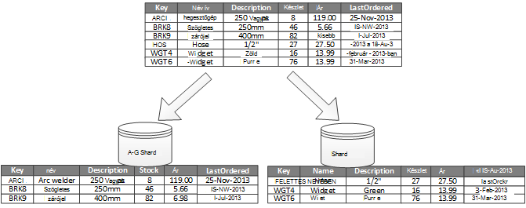
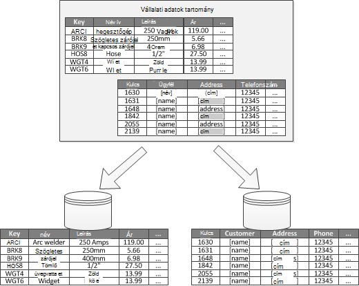
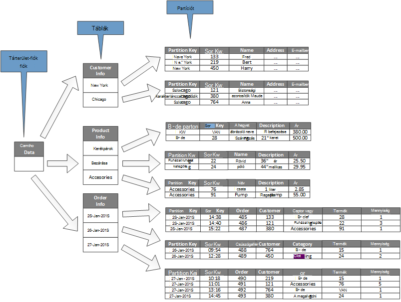

<properties
   pageTitle="Adatok útmutatást szétválasztás |} Microsoft Azure"
   description="Külön kell kezelni és külön-külön partíciók útmutatást."
   services=""
   documentationCenter="na"
   authors="dragon119"
   manager="christb"
   editor=""
   tags=""/>

<tags
   ms.service="best-practice"
   ms.devlang="na"
   ms.topic="article"
   ms.tgt_pltfrm="na"
   ms.workload="na"
   ms.date="07/14/2016"
   ms.author="masashin"/>

# Adatok particionáló útmutató

[AZURE.INCLUDE [pnp-header](../includes/guidance-pnp-header-include.md)]

## – Áttekintés

Sok nagyméretű megoldás, az adatok meg van osztva külön kezelhető és külön-külön elérhető partíciók. A particionáló stratégia kell választani gondosan előnyökkel jár maximalizálása hatásokat káros minimalizálása közben. Méretezhetőség javítása, csökkentheti a kérelem és a teljesítmény optimalizálása segíthetnek a szétválasztás. Egy másik szétválasztás előnye, hogy a kisalkalmazások adatainak elosztja a mintázat használati lehet adni. Ha például archiválhatja a régebbi, kisebb aktív (hideg) adatainak olcsóbb adattárolás.

## Miért partition adatok?

A legtöbb felhő alkalmazások és szolgáltatások tárolására, és az adatok beolvasásához tevékenységeik részeként. Az adatok tárolja, az alkalmazások használó felépítésének is hatással vannak jelentős a teljesítményt, teljesítmény és méretezhetőség a rendszer. A nagyméretű rendszerekben leggyakrabban alkalmazott egyik módszer az adatok osztása külön partíciót.

> A folyamat fizikailag felosztása a külön adatokat tárolja az adatokat a szerződési időszak _szétválasztás_ az útmutató használt hivatkozik. Ez nem ugyanaz, mint az SQL Server szétválasztás a táblázat, amely különböző fogalma.

Adatok szétválasztás is kínálhatnak, számos előnyét. Ha például azt alkalmazhatók annak érdekében, hogy:

- **Méretezhetőség javítása**. Akkor egyetlen adatbázis rendszerét, akkor végül eléri a fizikai hardver korlátozott. Ha több partíciók, amelyek mindegyike üzemelteti, a üzemeltető kiszolgálón, keresztül adatok méretezheti a rendszer szinte végtelen időre szóló.
- **Gyakori teljesítményét**. Az access adatműveleteket egyes partíciók történjen a kisebb mennyiségű adat. Feltéve, hogy az adatok megfelelő úgy van formázva, szétválasztás fel, hogy a rendszer hatékonyabbá. Egynél több partíciót befolyásoló műveletek párhuzamos futtathatók. Egyes partíciók hálózati késés minimalizálásához használó alkalmazásokban mellett található.
- **Gyakori elérhetőségét**. Adatok különválasztó több kiszolgálóin elkerülhető hiba egyetlen pontot. Ha egy kiszolgáló nem tud, és a tervezett karbantartás, csak az adatokat van alatt áll, abban, hogy partíciót nem érhető el. Egyéb műveleteket is. Egyetlen kiszolgálóhiba relatív hatása partíciót számának növelése csökkenti az adatok, amelyek nem lesz elérhető a százalékos csökkentésével. Egyes partíciók replikálása tovább csökkentse a hozzájuthat a szükséges műveleteket érintő partíciót a hiba. Azt is lehetővé teszi elválaszthatja egymástól a legfontosabb adatokról, amely folyamatosan kell lennie, és erősen elérhető alacsony érték, amely kisebb elérhetősége követelményei vannak (például a napló fájlok).
- **Gyakori biztonsági**. Attól függően, hogy az adatokat, és hogyan particionálva jellegét, esetleg bizalmas és nem bizalmas adatokat külön be másik partíciók, és így különböző kiszolgálók vagy adatokat tárol. Biztonsági majd kifejezetten optimalizált bizalmas adatokhoz.
- A **műveleti rugalmasság megadása választógombot**. Finom finombeállítása műveletek, felügyeleti hatékonyság maximalizálása és a költség minimalizálása rengeteg szétválasztás kínál. Például határozhatja meg másik stratégiák kezelése, figyelése, biztonsági mentése és visszaállítása és egyéb felügyeleti feladatok az adatokat az összes partíciót fontosságát alapján.
- **Az adatok való használatának tárolására egyezés**. Szétválasztás lehetővé teszi, hogy minden partíciót egy másik típusú adattárhoz költség és a beépített funkciók, hogy az adatok tárolására ajánlatok alapján telepíthető. Ha például nagy bináris adatokat tárolhatók a blob-tárolóban, miközben megtartható a további strukturált adatok, dokumentum-adatbázisban. További tudnivalókért olvassa el a [megoldás kiépítése olyan polyglot] a a szabályszerűségeket és eljárások útmutató és [adatelérési erősen scalable megoldások: használata SQL NoSQL és polyglot adatmegőrzési] a Microsoft webhelyén.

Egyes rendszerek nem hajtja végre, mivel célszerű előny, hanem a költség szétválasztás. A magyarázata gyakori okai a következők:

- Sok adatokat tároló rendszerek nem támogatják a illesztések partíciót keresztül, és szeretné őrizni a hivatkozási integritás particionált rendszerben nehéz lehet. Adatintegritás ellenőrzések alkalmazás kód, amely további adatátviteli, valamint az alkalmazás összetettsége eredményezhet (a particionáló rétegben), és illesztés végrehajtása gyakran szükség.
- Ez esetben megtartják a partíciók kifolyólag sem trivial tevékenység. A rendszer, ahol adatai környezetfüggő szükség lehet visszaállás partíciót rendszeres a kérelem és interaktív területek csökkentése érdekében.
- Néhány gyakori eszközök nem működnek természetesen particionált adatokkal.

## Partíciót tervezése

Adatok többféleképpen is lehet formázva: vízszintes, függőleges vagy funkcionális. A kiválasztott stratégia attól függ, hogy az adatokat, és az alkalmazások és szolgáltatások, amelyekkel az adatok követelményeinek szétválasztás okát.

> [AZURE.NOTE] A particionáló rendszerek, az ebben az útmutatóban ismertetett módon, hogy a mögöttes adatok tárolására technológia független a című cikkben ismertetett. Számos különböző típusú adatokat tárolja, beleértve a relációs és NoSQL adatbázisokhoz való alkalmazhatók.

### Stratégiák szétválasztás

A három tipikus stratégiák szétválasztás adatok a következők:

- **Vízszintes szétválasztás** (más néven _sharding_). E stratégia minden egyes partíciót egy saját jobb adattár, de az összes partíciót is ugyanarra a sémára. Minden egyes partíciót egy _shard_ néven, és tárolja az adatokat, például meghatározott az e-kereskedelmi alkalmazásokban vevők rendeléseit meghatározott részhalmazát.
- A **Függőleges szétválasztás**. Ez a stratégia egyes partíciók rendelkezik a mezők, elemek csak egy részhalmazát az adatok áruházban. A mezőket a minta használati szerint vannak csoportosítva. A gyakran használt mezők kell elhelyezni például egy függőleges partíciót, és kevesebb egy másik gyakran elérni kívánt mezőket.
- Ha a **szétválasztás funkcionális**. Ez a stratégia az adatok van összesíti aszerint, hogy minden körülhatárolható környezetben használja a rendszer. Ha például egy elektronikus kereskedelmi rendszer eszközök külön számlázás az üzleti tevékenységek és a termék készlet kezelése számla adatokat tartalmazhatnak egy partíciót termék készlet adatainak és egy másik.

Fontos tudni, hogy az itt leírt három stratégiák állíthatók össze. Még nem egymást kölcsönösen kizáró, és azt javasoljuk, hogy, fontolja meg azokat a particionáló sablonjának tervezésekor. Például előfordulhat, hogy adatok osztása shards és majd használja a függőleges szétválasztás további megkönnyíti az egyes shard adatait. Az adatok funkcionális partíciót feloszthat hasonlóan shards (ez is lehet függőlegesen particionálni).

Azonban az egyes stratégia eltérő követelményei emelheti számos nem ütközik-e a probléma megoldásához. Értékeli, és egyenleg ezek közül az összes, amely megfelel a rendszer a teljes adatfeldolgozás teljesítmény célok particionálási séma tervezésekor. Az alábbi szakaszok Ismerkedjen meg részletesebben a stratégiák mindegyike.

### Vízszintes szétválasztás (sharding)

Ábra 1 vízszintes szétválasztás vagy sharding áttekintése látható. Ebben a példában készlet termékadatok meg van osztva shards alapján a termékkulcsot. Minden egyes shard shard kulcsok (A-G és H – Z), betűrend szerint rendezett összefüggő cellatartományban adatait tartalmazza.

_Ábra 1. Vízszintes szétválasztás (sharding) adatok, egy partíciót kulcs alapján_

A betöltés elosztva csökkenti a kérelem és javítja a teljesítményt, további számítógépekre sharding segítségével. A rendszer, méretezheti további további kiszolgálón futó shards hozzáadásával.

A legfontosabb e particionáló stratégia végrehajtásakor tényező választható sharding billentyűt. A kulcs módosítása, amikor a rendszer a művelet nehéz lehet. A kulcs gondoskodnia kell arról, hogy az adatok particionálva van, hogy a terhelését, akár a lehető a shards keresztül.

Ne feledje, hogy más shards kell hasonló mennyiségű adattal tartalmaz. Ehelyett a fontosabb figyelembe, hogy egyenleg kérések száma. Lehet, hogy bizonyos shards igen nagy, de egyes elemek access műveletek kevés tárgyát. Előfordulhat, hogy más shards kisebb, de sokkal több gyakran férnek hozzá, mindegyik elemhez. Is fontos annak érdekében, hogy egy egyetlen shard ne lépjék skála (értelmez kapacitással és feldolgozása erőforrásokkal) az adatokat tároló tárolni, hogy shard használt.

Egy sharding rendszer használata esetén létrehozásának elkerülése érdekében interaktív (vagy meleg partíciót), amely hatással lehet a teljesítmény és elérhetőségét. Például ha egy ügyfél-azonosító kivonat egy ügyfél nevét az első betűje helyett használja, megakadályozhatja a kiegyenítetlenségét eloszlás, amely való közös és kevésbé gyakori kezdeti betűket. Ez a egy tipikus technika, amely segít a adatok egyenletesebb terhelést kialakítani partíciót keresztül.

Válassza a lehető legkevesebb minden jövőbeni követelményeknek nagy shards felosztása kisebb darabokra sharding kulcs kis shards egyesítés nagyobb partíciót be, vagy a séma, amely leírja a partíciók halmazának tárolt adatok módosítása. Ezek a műveletek nagyon időigényes lehet, és előfordulhat, hogy egy vagy több shards offline állapotúvá, miközben végeznek.

Ha shards replikált, esetleg megőrzése a replikák online amíg mások felosztása, egyesített, vagy újrakonfigurálni. Előfordulhat, hogy a rendszer azonban korlátozhatja a konfigurálás történő során a következő shards az adatokon végrehajtható műveletek kell. Például az adatokat a kópiában jelölhető shards átalakult során fellépő adatveszteségről inconsistences hatókörének korlátozására csak olvashatóként.

> Részletesebb információkat és ezek szempontokról és tanácsos új célközönségszabályt technikák adatokat tárolja, amely vízszintes szétválasztás valósítja tervezéséhez számos útmutató című témakörben talál [Sharding mintát].

### Függőleges szétválasztás

A leggyakrabban függőleges szétválasztás csökkentheti az I/O, és az elemek, amelyek beolvasása társított teljesítményét költségek leggyakrabban érhetők el. Ábra 2 azt szemlélteti, függőleges szétválasztás. Ebben a példában a minden elem tulajdonságainak különböző különböző partíciók vannak tartani. Egy partíciót adatok elérhető gyakrabban, például a név, leírás és termékekre vonatkozó árinformációkat tartalmaz. Egy másik tábla a hangerőt, az árfolyam és rendezett utolsó dátumát tartalmazza.

_Ábra 2. Függőlegesen szétválasztás adatok a minta használati szerint_

Ebben a példában az alkalmazás rendszeresen lekérdezi a termék neve, leírás és ár a termékadatok ügyfelek szeretne megjelenítésekor. A készlet szint és a dátumot, amikor a termék utolsó megrendelt gyártótól egy külön partíciót mert ezeket az elemeket két gyakran együtt tartják.

A particionálási séma van előnye, hogy az általában viszonylag lassú-áthelyezése adatok (termék neve, leírás és ár) egymástól a további dinamikus adatok (a készlet szint és az utolsó rendezett dátumának). Az alkalmazások előfordulhat, hogy meglássa előnyös memória lassú áthelyezése adatainak gyorsítótárban, ha gyakran érhető el.

Egy másik tipikus forgatókönyv a particionáló stratégia is teljes méretűre állíthatja a bizalmas adatokat. Például végezheti el a hitelkártya számokat és a megfelelő biztonsági-ellenőrzési számok tárolása külön partíciót szerint.

Függőleges szétválasztás is csökkentheti az összeget egyidejű hozzáférés az adatokhoz van szükség.

> Függőleges szétválasztás belül egy adattár részben normalizálás részletezve egy _széles_ elemből használatával egy _szűkítése_ elemek entitás entitás szinten működik. Azt kiválóan oszlopirányú adatokat tárolja, például HBase és Cassandra számára. Ha az oszlopok együttese adatai valószínű, hogy módosítani, is megpróbálkozhat oszlop tárolja az SQL Server.

### Funkcionális szétválasztás

Hol az egyes különböző üzleti terület vagy az alkalmazás szolgáltatás körülhatárolható környezetben azonosítható rendszerek funkcionális szétválasztás biztosít technika elkülönítési és adatokat az access teljesítmény javítására. Egy másik közös funkcionális szétválasztás használata írási és olvasási adatok külön adatokból csak olvasható, amellyel jelentéskészítési célra. Ábra 3 jeleníti meg a szétválasztás funkcionális áttekintését hol készlet adatokat a felhasználói adatok elválasztani.

_3. ábrát. Funkcionális szétválasztás körülhatárolható helyi vagy altartomány adatok_

A particionáló stratégia csökkentheti az adat-hozzáférési kérelem végig a rendszer különböző részei.

## Méretezhetőség partíciók tervezése

Nagyon fontos fontolja meg a méretét és az összes partíciót terhelést és egyenleg őket, hogy az adatok eléréséhez maximális méretezhetőség van meghatározva. Jó helyen jár meg kell is partition az adatokat, hogy nem haladja meg egy olyan partíciót tároló méretezési határain.

Méretezhetőség partíciók tervezésekor, tegye a következőket:

1. Az alkalmazás az access mintázatok, például az egyes lekérdezés által visszaadott eredményhalmazt méretének megértéséhez elemzése, a gyakoriság az access, a belső időtartam és a kiszolgálóoldali feldolgozás követelmények számítja ki. Sok esetben néhány fő szervezetek nagy része a feldolgozás erőforrásokat fog igény.
2. Az elemzés használni a pillanatnyi és a későbbi méretezhetőség célok, például adatok méretét és a terhelést meghatározásához. A partíciók felel meg a méretezhetőség cél majd elosztása az adatokat. A vízszintes particionáló stratégia kiválasztása a megfelelő shard billentyűt fontos annak érdekében, terjesztési is. További tudnivalókért lásd: a [Sharding mintát].
3. Ellenőrizze, hogy az összes partíciót elérhető erőforrások elegendő a méretezhetőség követelmények értelmez adatok méretét és az átvitel kezelése. Például a csomópontot, amelyen az partíciót előfordulhat, hogy korlátozzák kemény a mekkora tárhelyet, feldolgozási power vagy a hálózati sávszélességet biztosít. Ha az adatok tárolására és feldolgozása követelményei valószínűsíthetően meghaladja a ezek a korlátok, finomíthatja a particionáló vonatkozó stratégia, és az adatok ki további felosztása szükség lehet. Ha például egyik méretezhetőség megközelítés vezethet, ha naplóadatok elválasztja a core webalkalmazás szolgáltatásainak. Ezt megteheti, hogy az adatok összesítésére tárhelyre, a meghaladja a csomópont méretezési határértékén külön adatokat tárolja használatával. Ha az adatokat tárolja száma meghaladja a csomópontot, használatához külön tároló csomópontok szükség lehet.
4. Figyelje meg a rendszer csoportban ellenőrizze, hogy az adatok oszlik a várt módon, hogy a partíciók képes kezelni a betöltés, amely akkor kirótt őket segítségével. Akkor lehet, hogy a használatát nem egyezik meg a használatát, amely szerint az elemzés várható. Ebben az esetben lehet a partíciók visszaállás is. Ennek hiányában szükség lehet a rendszer a szükséges egyensúly eléréséhez egyes részeinek átírása.

Figyelje meg, hogy bizonyos felhőalapú környezetben értelmez infrastruktúra határai erőforrásokat. Győződjön meg arról, hogy a kijelölt oszlopazonosító határain nyújt elég hely az adatok adattárolás, feldolgozási teljesítmény és sávszélesség mennyisége bármely várható növekedését.

Például ha Azure táblatárolóhoz használ, egy elfoglalt shard szükség lehet a további erőforrások, mint egy olyan partíciót kérelmek kezeléséhez nyújt. (Nem a hangerőt, amely egy adott idő szerint egyetlen partíciót is kezelhető kérések korlátozott. Lásd: az [Azure tároló méretezhetőség és a teljesítmény célok] lapon a további információt a Microsoft webhelyének.)

 Ha ez így, a shard lehet kell kell particionálni húzza szét a betöltés. Ha a teljes méret vagy átviteli, az alábbi táblázat mérete meghaladja a tárterület-fiók kapacitása, további tárterület-fiókok létrehozása, és húzza szét a táblák között az ezekben a fiókokban szükség lehet. Ha a tárterület-fiókok száma meghaladja a fiókok előfizetés elérhető, majd szükség lehet több előfizetéssel használni.

## A lekérdezési teljesítményt partíciót tervezése

A lekérdezési teljesítmény gyakran is csillapítja, kisebb adatkészletek és a párhuzamos lekérdezések futtatásával. Egyes partíciók tartalmaznia kell egy kis hányadát a teljes adatkészletet. A hangerő csökkentése is javítja a lekérdezések. Szétválasztás viszont nem egy alternatív megoldás tervezése és beállítása az adatbázis megfelelően. Ha például ellenőrizze, hogy a rendelkezik a szükséges indexek helyen relációs adatbázisok használatakor.

A lekérdezési teljesítményt partíciót tervezésekor, tegye a következőket:

1. Az alkalmazás követelmények és teljesítményét vizsgálja meg:
    - Az üzleti követelmények segítségével határozza meg, hogy mindig gyorsan kell végrehajtania kritikus lekérdezéseket.
    - Figyelje meg a rendszert a lassan végző lekérdezések.
    - Hozzon létre, mely lekérdezések végrehajtásának sorrendjét leggyakrabban. Előfordulhat, hogy egyetlen példánya mindkét lekérdezés minimális költség, de az erőforrások göngyölt felhasználása jelentős hatással lehet. Az adatok jelennek meg a letöltött ezeket a lekérdezések be egy egyedi partíciót vagy akár a gyorsítótár elkülönítésére hasznos lehet.
2. Partition okoz lelassulhat adatokat:
    - Mérete az egyes partíciók, hogy a lekérdezés válaszidő cél belül.
    - A shard billentyűt, hogy az alkalmazás könnyen megtalálhatja a partíciót Ha vízszintes szétválasztás végrehajtási tervezése Ez a lekérdezés megakadályozza, hogy az összes partíciót tekintse meg.
    - Fontolja meg egy partíciót helyét. Ha lehetséges próbálja meg szeretné tartani az adatokat a partíciók, amelyek földrajzilag közelébe az alkalmazások és a felhasználókat, elérheti őket.
3. Ha entitás átviteli és lekérdezési teljesítmény követelményeknek, használja a funkcionális szétválasztás alapján, hogy a szervezet. Ha ez még nem megfelelnek, a vízszintes szétválasztás, valamint vonatkoznak. A legtöbb esetben egy egyetlen particionáló stratégia elegendő, de bizonyos esetekben sokkal hatékonyabban mindkét stratégiák egyesítéséhez.
4. Fontolja meg, amely a teljesítmény javítása érdekében partíciót különböző párhuzamosan futtatása aszinkron lekérdezések.

## Az elérhetőség partíciót tervezése

Adatok szétválasztás biztosítva, hogy az egész adatkészlet nem jelent hiba egyetlen pontot, és az adatkészlet egyes részhalmazának önállóan kezelt javíthatja a az alkalmazásokban elérhető. Fontos adatokat tartalmazó partíciót replikálása is javíthatja elérhetőségét.

Tervezés és végrehajtási partíciók, vegye figyelembe az alábbi tényezőket rendelkezésre állás kiterjedő:

- **Hogyan kritikus az adatokat, ha a vállalati verzió műveletek**. Adatokat tartalmazhatnak olyan fontos üzleti információt, például a számla részletei vagy a banki tranzakciók. Egyéb adatok rendszerint a kevésbé fontos működési adatok, például a naplófájlok, teljesítmény halad, és így tovább. Után minden típusú adat azonosítása, fontolja meg:
    - Könnyen hozzáférhető partíciót egy megfelelő biztonsági csomaggal fontos adatokat tárolja.
    - Külön management létrehozásáról, és a figyeléshez mechanizmusok vagy a különböző criticalities minden adatkészletből eljárásokat. Helyezze úgy, hogy egy megfelelő gyakorisággal azt biztonsági másolat együtt a azonos partíciót a kritikusság azonos szintű tartalmazó adatok. Például partíciók, tartsa lenyomva az ujját a banki tranzakciók adatok előfordulhat, hogy kell biztonsági másolatot, tartsa lenyomva a naplózás vagy nyomkövetési adatok partíciót gyakrabban.
- **Hogyan egyes partíciót kezelhető**. Független kezelési és karbantartás partíciót tervezése több előnyökkel jár. Példa:
    - Nem sikerül a partíciók, ha azt lehet helyreállítani független más partíciót adatainak hozzáférő alkalmazások előfordulását megtartásával.
    - Adatokat földrajzi területenként szétválasztás lehetővé teszi, hogy a ütemezett karbantartási műveleteket a essen minden olyan helyen, a teljes összefésülése. Győződjön meg arról, hogy partíciót ne legyenek, hogy minden tervezett karbantartás ez idő alatt megakad túl nagy.
- **E való replikáció keresztül partíciót fontos adatokat**. Ez a stratégia javíthatja rendelkezésre állásának és a teljesítmény elérése érdekében annak ellenére is a konzisztencia problémák vezessenek is be. Szinkronizálni kell minden kópia partíciót adatainak végzett módosítások időt vesz igénybe. Az időszak alatt a különböző partíciók különböző értékek is tartalmaz.

## Szétválasztás hatása tervezési és fejlesztési ismertetése

A tervezés és a rendszer fejlesztésének használata a szétválasztás hozzáadja összetettsége. Fontolja meg egy partíciót csak szétválasztás alapvető részeként rendszer tervezés, akkor a rendszer először tartalmazza. Cím a szétválasztás egy afterthought, mint amikor a rendszer megkezdi a teljesítmény és méretezhetőség problémák érheti, ha a összetettségétől mivel már van egy élő rendszer megőrzéséhez megnöveli.

Ha frissíti a rendszer, amelyekkel beépíthetők a szétválasztás ebben a környezetben, azt szükségessé teszi az adatok access logika módosítása. Azt is jár, hogy miként nagy mennyiségű a meglévő adatokból a elosztása azt partíciók, gyakran miközben a felhasználó által elvárt, használja a rendszer továbbra is láthatja.

Egyes esetekben szétválasztás nem számít fontos, mert a kezdeti adatkészlet kicsi, és egyetlen kiszolgáló könnyen kezelhető. Ez a rendszerben, amely várhatóan nem túl az eredeti méretre méretezni okai lehetnek, de sok kereskedelmi rendszerek kell bontsa ki a felhasználók nő számát. A kiterjesztett általában az adatok mennyisége növekedése együtt.

Is fontos, ha meg szeretné érteni, hogy szétválasztás nem jelenik meg mindig nagy adatokat tárolja a függvény. Például egy kis adattár erősen érheti el a több száz felhasználót egyidejű. Ebben az esetben az adatok szétválasztás kérelem csökkentése és a teljesítmény javítása segít.

Adatok particionálási séma tervezésekor, vegye figyelembe az alábbiakat:

- **Ha lehetséges, a leggyakrabban használt adatbázis-műveletek adatok együtt tartása az egyes partíciók határokon-partíciót adatműveleteket access minimalizálásához**. Több időt vesz igénybe, mint csak egyetlen partíciót belül lekérdezése lekérdezése partíciót át lehet, de a lekérdezések az egyik készlete partíciók optimalizálása negatív hatással a többi a lekérdezések beállítása. Különböző partíciót lekérdezése nem elkerülése érdekében, amikor összezárása lekérdezés időtartama párhuzamos lekérdezések futtatása és az eredmények az alkalmazáson belül összesítése. Ezt a megközelítést előfordulhat, hogy ne lehessen bizonyos esetekben, például amikor beszerzése eredménye egy lekérdezésből, és használni a következő lekérdezés szükség.
- **Ha a lekérdezések ellenőrizze viszonylag statikus hivatkozási adatok, például az irányítószám táblák vagy termék listák használatát, fontolja meg, ezeket az adatokat az összes kötelező különböző partíciók külön keresési műveletek csökkentheti a partíciók replikálása**. Ez a módszer is csökkentheti annak valószínűségét, hogy a hivatkozási adatok valamit, hogy nehéz forgalmat a megtörtént a teljes rendszerben "meleg" adatkészletet. Azonban van egy további költség társított fordulhat elő, az összefoglaló adatokat által végzett esetleges módosítások szinkronizálása.
- **Ha lehetséges, összezárása függőleges és funkcionális partíciót végig a hivatkozási integritás követelményei**. Az alábbi rendszerek az alkalmazás, magát a felelős a hivatkozási integritás megőrzése fenntartása partíciót keresztül, ha az adatok frissítése és elfogyasztott. Több partíciót át kell csatlakoznia az adatok lekérdezések futtatása csatlakozni az adatok csak a azonos partíciót belül, mert az alkalmazást a szokásos kell lekérdezésére egymást követő alapú kulcs és idegen kulcs a lekérdezések lassabban. Ehelyett fontolja meg a végre vagy vonja normalizálása a megfelelő adatokat. A lekérdezés időtartama, ha határokon-partíciót illesztések szükségesek minimalizálásához párhuzamos lekérdezések futtatása a partíciók fölé, és Bekapcsolódás az adatokat az alkalmazáson belül.
- **Fontolja meg, hogy milyen hatással a particionálási séma előfordulhat, hogy az adatok konzisztencia a partíciók keresztül.** Hogy erős konzisztencia ténylegesen annak követelménye kiértékelésének eredménye. Ehelyett a közös megközelítés a felhőben, hogy esetleges konzisztencia végrehajtása. Az összes partíciót az adatokat külön-külön frissül, és az alkalmazás logika biztosítja, hogy a frissítések vannak az összes sikeresen befejeződött. Az adatok lekérdezése, végül egységes művelet futása közben a felmerülő következetlenségekre is kezeli. Az esetleges konzisztencia végrehajtási kapcsolatos további tudnivalókért lásd: az [adatok konzisztencia alapozó].
- **Fontolja meg, hogyan keresse meg a lekérdezéseket az helyességét**. Lekérdezés az összes partíciót keresse meg a szükséges adatokat kell beolvasni, ha nincs jelentős hatást teljesítmény, akkor is, ha több párhuzamos lekérdezés futnak. A függőleges és funkcionális particionáló stratégiák használt lekérdezések természetesen adhatja meg a partíciók. Azonban vízszintes szétválasztás (sharding) fel, hogy nehéz elem keresése, mivel minden shard ugyanarra a sémára. Egy tipikus sharding megoldást is térképpel lépések elvégzésével keresheti meg az adatok adott elemek shard helyét használható. A térkép szerepelni fog az alkalmazás a sharding logika, vagy az adatok üzlet tartható fenn, ha a átlátszó sharding támogat.
- **Vízszintes particionáló stratégia funkcióval, vegye figyelembe a shards rendszeres szakismeretekre**. Ezzel az elemzéssel méretét és interaktív kisméretűvé, a teljes méretűre állíthatja a lekérdezési teljesítmény és a tárolóhely korlátozások kerülheti terhelést egyenletes elosztása az adatokat. Ez azonban bonyolult feladat, amely gyakran van szükség egy egyéni eszköz vagy a folyamat.
- **Ha, bizonyos egyes partíciók hiba ellen további védelmet nyújt**. Egyetlen kópia sikertelen, ha lekérdezések használata másolatának felé is irányítja.
- **Ha egy particionáló stratégia fizikai határain elér szükség lehet a másik szintre méretezhetősége kiterjesztése**. Például ha az adatbázis szintjén a szétválasztás, előfordulhat, hogy kell keresse meg vagy több adatbázis partíciók replikáció. Ha már van szétválasztás adatbázis szintre, és fizikai korlátozások problémát, azt jelentheti, amelyet fel kell keresse meg és több Office-fiók partíciók bizonyos.
- A **tranzakciók, az adatok több partíciót hozzáférési elkerülése érdekében**. Egyes adatokat tárolja megvalósítása egységessége és a műveletek integritását, módosítsa a adatokat, de csak abban az esetben, ha az adatok egyetlen partíciót található. Ha több partíciót keresztül tranzakció-támogatás van szüksége, valószínűleg szüksége lesz ez az alkalmazás logikája megvalósítani, mert a legtöbb particionáló rendszerek nem támogatja natív.

Az összes adatokat tárolja bizonyos üzemeltetési kezelése és figyelése szükség. A feladatok terjedhet adatok betöltése, mentésével és adatok visszaállítása, adatok átrendezése és biztosítva, hogy a rendszer megfelelően és hatékonyan hajt végre.

Vegye figyelembe az alábbi tényezőket befolyásoló műveleti kezelése:

- A **megfelelő kezelési és műveleti feladatok, ha az adatok particionált megvalósításáról**. Az alábbi műveleteket tartalmazhatnak olyan biztonsági mentési és visszaállítási, archiválás adatokat, a rendszer és egyéb felügyeleti feladatok nyomon követéséhez. Biztonsági mentési és visszaállítási művelet során fenntartása logikai konzisztencia például bonyolulttá is lehet.
- **Betöltése több partíciót az adatokat, és, amelyek az egyéb forrásból érkező új adatok felvétele**. Egyes eszközök és segédprogramok esetleg nem támogatja a sharded adatműveleteket, például adatok betöltése a helyességét be. Ez azt jelenti, hogy lehet, ha létrehozása, és szerezze be az új eszközök és segédprogramok.
- **Archiválás, és az adatok rendszeresen törlése**. Partíciót fölösleges értéknövekedésével elkerülése érdekében szeretne archiválni és törlése az adatok rendszeresen (talán havonta). Az adatokat a különböző archiválási séma megfelelően, hogy szükség lehet.
- **Hogyan adatintegritási problémák találhatja meg**. Fontolja meg, periodikus folyamatok, például az adatok minden adatintegritási problémák megkeresni egy olyan partíciót egy másik hiányzó adatok hivatkozó futtatása. A folyamat vagy megpróbálja automatikusan a problémák kijavítása, vagy manuálisan a problémák megoldására operátor figyelmeztető üzenet előléptetése is. Az e-kereskedelmi alkalmazásokban, például egy partíciót a rendelési adatokat lehet tartani, de a jelentenek az egyes megrendelésekre vonatkozóan sor elemekhez lehet tartani egy másik. A folyamaton, úgy, hogy a megfelelő sorrendben kell adatok hozzáadása más partíciót. Ha ezt a folyamatot meghiúsul, nem lehet sor elemek tárolhatók, amelyek nem megfelelő sorrendben nem.

Különböző adatokat tároló technológiák általában adja meg a saját szolgáltatások támogatása a szétválasztás. Az alábbiakban összefoglaljuk az Azure alkalmazások által gyakran használt adatokat tárolja végrehajtott beállítások. Is talál, amely a legjobban kihasználhassa ezek a funkciók alkalmazások tervezéséhez.

## Stratégiák szétválasztás Azure SQL-adatbázis

Azure SQL-adatbázis relációs adatbázis-mint-a-szolgáltatás, amely a felhőben. Microsoft SQL Server alapul. Relációs adatbázisból osztja fel adatokat táblává, hosszan az táblázat minden egyes személyek információt a sorok adatsorként. Minden egyes sorára oszlopokat, tartsa lenyomva az egyes mezőkhöz egy személy adatait tartalmazza. Az oldal [Mi az Azure SQL-adatbázishoz?] a Microsoft a webhely létrehozásával és SQL-adatbázisait használatával kapcsolatos részletes leírást tartalmaz.

## Vízszintes szétválasztás rugalmas adatbázis

Egy SQL-adatbázis korlátozott hangerejének adatokat tartalmazó is tartalmaz. Átviteli építészeti tényezők és az egyidejű kapcsolatok, amely támogatja a korlátozza. Az SQL-adatbázis rugalmas adatbázis-szolgáltatás támogatja a vízszintes méretezés SQL-adatbázishoz. Rugalmas adatbázis használata esetén, amelyek több SQL-adatbázisok között helyezkednek shards be az adatok szintén szétválaszthatók. Akkor is is hozzáadhat vagy eltávolíthat shards kezeléséhez szükséges adatokat hangerejének megnő, és zsugorodik össze. Rugalmas adatbázis használata is segíthetnek kérelem csökkentse a betöltés terjesztése adatbázisok között.

> [AZURE.NOTE] Rugalmas adatbázisa Azure SQL-adatbázis szövetségeire funkció helyettesíti. A meglévő SQL-adatbázis összevonási telepítések telepíthető át az adatbázis rugalmas segédprogrammal szövetségeire áttelepítési. Azt is megteheti saját sharding mechanizmusa megvalósítása, ha az Ön esetében nem lízingbe magát természetesen rugalmas adatbázis által biztosított funkciókhoz.

Minden egyes shard alkalmazása egy SQL-adatbázis. Egy shard tartalmazhatnak egynél több adatkészlet (néven egy _shardlet_). Adatbázisonként megtartja a shardlets, amely tartalmazza azt ismerteti, hogy metaadatokat. Egy shardlet lehet egy egyetlen elemet, vagy az elemek megosztása a azonos shardlet billentyűt csoport. Például ha sharding adatok multitenant alkalmazásban, a shardlet kulcs lehet a bérlői azonosító, és egy adott bérlői webhely összes adatát megtartható a azonos shardlet részeként. Más bérlők adatokat a különböző shardlets kell tartani.

Feladata a programmer társítása egy adatkészlet shardlet használatával. Különálló SQL-adatbázis globális shard térkép vezető működik. Ebben az adatbázisban a rendszer a shards és shardlets listáját tartalmazza. Adatok hozzáférő ügyfélalkalmazás először csatlakozik a globális shard térkép manager-adatbázis juthat hozzá egy példányát a shard térkép (shards és shardlets felsoroló), amely, majd a gyorsítótárban helyi meghajtóra.

Kattintson az alkalmazás útvonal adatok kérések ezt az információt a megfelelő shard használja. Ezt a funkciót mögött sorozata API-khoz szereplő az Azure SQL adatbázis rugalmas adatbázis ügyfél-tárban, amely a NuGet csomag érhető el van rejtve. A Microsoft webhelyének lapjain [Rugalmas adatbázis szolgáltatások áttekintése] egy rugalmas adatbázis átfogóbb – bevezetés nyújt.

> [AZURE.NOTE] Hogy bizonyos késés csökkentése és elérhetőség javítása a globális shard manager adatbázis. Ha a prémium árak rétegek valamelyikével alkalmazza az adatbázist, beállíthatja aktív geo folyamatosan másolja az adatokat a különböző régiókban adatbázisok replikációs. Hozzon létre egy másolatot az adatbázisról felhasználók alapul, amelyben minden egyes régióban. Konfigurálja az alkalmazás másoláshoz szerezze be a shard térkép csatlakozni.

> Alternatív megközelítés környezetbe Azure SQL-adatok szinkronizálási vagy egy Azure Data Factory folyamat területek közötti shard térkép manager-adatbázis replikáció. Ezen az űrlapon replikációs rendszeres elindul, és alkalmasabb, ha a shard térkép ritkán változó. Emellett a shard térkép manager-adatbázis nincs hozza létre az egy réteg árak prémium változatának használata.

Rugalmas adatbázis biztosít az adatok megfeleltetése shardlets és tárolja őket shards két sémák:

- A **lista shard térkép** egy kulcs és egy shardlet közötti társítás ismerteti. Például multitenant rendszerben, az adatok minden bérlő egyedi kulcs társított, illetve saját shardlet tárolt. Zökkenőmentes adatvédelmi és elkülönítési (Ez azt jelenti, hogy meg, hogy egy bérlői csökkenti a rendelkezésre álló adatokat tároló erőforrások mások számára is elérhető), minden egyes shardlet megtartható a saját shard.

_Ábra 4. Leképezéssel lista shard külön shards bérlői adatok tárolására_

- A **tartomány shard térkép** összefüggő kulcs értékhalmaz és egy shardlet közötti társítás ismerteti. Végrehajtási dedikált shardlets, alternatívájaként korábban leírt multitenant példában csoportosíthatja az adatokat az azonos shardlet belül (minden saját kulccsal) bérlők halmazára. Ez a rendszer oka kevésbé drága, mint az első (bérlők adatokat tároló az erőforrások megosztása), de is csökkentett adatok adatvédelmi és elkülönítési kockázat hoz létre.

_Ábra 5. Leképezéssel tartomány shard egy shard bérlők adattartomány adattárolásra_

Figyelje meg, hogy egy egyetlen shard tartalmazhat több shardlets adatait. Például hogy tárolja az adatokat a különböző nem összefüggő bérlőkhöz az azonos shard lista shardlets is használhatja. Akkor is is keverjen ki tartomány shardlets és az azonos shard a lista shardlets bár fog foglalkozni a globális shard térkép manager-adatbázis más térképek keresztül. (A globális shard térkép manager-adatbázis több shard térképek tartalmazhat.) Ábra 6 módon ábrázolja.

_6. ábrát. Több shard végrehajtási megfeleltetések_

A particionálási sémát, amely alkalmazhat is hatással lehetnek jelentős a rendszer teljesítményét. A ráta, amelynél shards kell lennie, illetve el, vagy a ráta, amellyel adatokat kell particionálni shards keresztül is befolyásolja. Partition adatokat rugalmas adatbázis használatakor, vegye figyelembe az alábbiakat:

- Csoportosíthatja az adatokat az azonos shard közösen használt, és kerülje a több shards tartott adatok eléréséhez szükséges műveleteket. Ne feledje, hogy rugalmas adatbázis-kezelő egy shard saját jobb SQL-adatbázishoz, és Azure SQL-adatbázis nem támogatja az adatbázis-határokon illesztések (melyek ügyféloldali elvégzendő). Ne feledje, hogy is, hogy az Azure SQL-adatbázissal, a hivatkozási integritás kényszerek, eseményindítók és egy adatbázisban tárolt eljárások nem hivatkozhat más objektumokat. Emiatt nem tervezése a rendszer shards közötti függőségek tartalmazó. SQL-adatbázishoz, azonban táblát tartalmazhat, tartsa lenyomva a lekérdezések és egyéb műveletek által gyakran használt hivatkozási adatok másolatait. Az alábbi táblázat ne kelljen minden adott shardlet tartoznak. A adatreplikálás keresztül shards segítségével, hogy távolítsa el a csatlakozás adatok adatbázisok nyúló kell. Ideális esetben ezeket az adatokat kell statikus, illetve lassan replikációs munkamennyiség kisméretűvé alakítása és az esélye annak elévültek csökkentése.

    > [AZURE.NOTE] SQL-adatbázis nem támogatja az adatbázis-határokon illesztések, bár a rugalmas adatbázis API-val keresztté-shard lekérdezések végezheti el. Ezek a lekérdezések átlátszó is Végigléptetés az összes a shardlets shard térkép által hivatkozott tárolt adatokat. Az adatbázis API-val rugalmas oldaltörések határokon-shard egyes lekérdezések (egy-adatbázisonként) sorozatává lefelé lekérdezése, és majd egyesíti az eredményeket. További tudnivalókért lásd: az oldal, [több shard lekérdezése] a Microsoft webhelyén.

- Az ugyanazt a térképet shard tartoznak shardlets tárolt adatok ugyanarra a sémára kell rendelkeznie. Ha például nem, amely bizonyos bérlői adatokat tartalmazó shardlets és más termékinformációkat tartalmazó shardlets mutat lista shard térkép létrehozása. Ez a szabály rugalmas adatbázis, de az adatok kezelése nem lép életbe, és a nagyon összetett, ha minden shardlet van egy másik séma lekérdezése lesz. Az imént említett példában kiváló megoldás, ha két lista shard térképek létrehozása: egy bérlői adatokat, és egy másik termékadatok mutató hivatkozás. Ne feledje, hogy az azonos shard különböző shardlets tartozó adatok tárolhatók.

    > [AZURE.NOTE] Az adatbázis rugalmas API keresztté-shard lekérdezés működésének attól függ, hogy minden shardlet ugyanarra a sémára tartalmazó shard térképen.

- Tranzakció alapú műveletek csak adatokat kell tartani az azonos shard és shards között nem támogatott. Tranzakciók shardlets is kiterjedhet, feltéve, hogy az azonos shard részét képezik. Ezért ha a logikájának végrehajtása a tranzakciókat, vagy az azonos shard érintett adattárolásra vagy esetleges konzisztencia végrehajtása. További tudnivalókért lásd: az [adatok konzisztencia alapozó].
- Helyezze a felhasználókat a elérni az adatokat az adott shards közelébe shards (más szóval geo-keresse meg a shards). Ez a stratégia csökkentheti a késés.
- Zsugorítása erősen többféle aktív (interaktív) és az általában viszonylag inaktív shards. Próbálja meg a betöltés egyenletesen shards keresztül. Előfordulhat, hogy a shardlet billentyűk kivonatolás.
- Ha shards geo megkeresése, győződjön meg arról, hogy a kivonatolt billentyűk feleltesse meg a felhasználóknak, hogy adatok hozzáférő közelébe tárolt shards tartott shardlets.
- Jelenleg csak korlátozott készlete, már támogatott shardlet kulcsként; SQL-adatok _int, a bigint, varbinary,_ és a _uniqueidentifier_. Az SQL- _int_ és _bigint_ típusok C# _int_ és _hosszú_ adattípusok felelnek meg, és az azonos tartományokat kell. Az SQL- _varbinary_ típus használatával egy _bájt_ tömb C# lehet kezelni, és az SQL- _uniqueidentier_ típus felel meg a .NET-keretrendszer _globálisan egyedi azonosítója_ osztály.

Magában foglalja a nevet, mint rugalmas adatbázis lehetővé teszi hozzáadása és eltávolítása a shards, az adatok mennyisége zsugorodik össze, és megnő rendszer. Az Azure SQL-adatbázis rugalmas adatbázis ügyfél beállításai párbeszédpanelen a API-k engedélyezése egy alkalmazást, és hozhat létre és shards dinamikusan törlése (a shard térkép kezelő átlátszó frissítése). Azonban egy shard eltávolítása egy olyan felülíró művelet, igénylő is, hogy shard az összes adat törlése.

Ha az alkalmazás egy shard felosztása két külön shards vagy shards egyesíteni, akkor rugalmas adatbázis külön felosztása és egyesítése szolgáltatást nyújt. Ez a szolgáltatás fut a felhőben tárolt szolgáltatás (amely a fejlesztő által hozható létre), és adatok biztonságos shards közötti áttelepítése. További információért témakört a [Méretezés a rugalmas adatbázis-kezelő eszközével felosztása és egyesítése] a Microsoft webhelyén.

## Stratégiák szétválasztás Azure tárolására

Azure tároló három vízkivételeket adatok kezelésére nyújt:

- Hajtja végre scalable struktúra tároló tábla tárolása. Táblázat olyan gyűjteménye, személyek, amelyek tartalmazhatnak tulajdonságokat és értékeket tartalmazza.
- BLOB-tárolóhoz, amely megadja a nagyméretű objektumokat és a fájlok tárolására.
- Tárterület sorban várakozó, amely támogatja a megbízható aszinkron üzenetkezelés alkalmazások között.

Táblatároló és blob-tárolóhoz tartása a kurzor a strukturált és strukturálatlan adatokat optimalizált érték lényegében kulcs tárolja. Tárterület sorban várakozó mechanizmusa módszerektől összekapcsolt, méretezhető alkalmazások készítéséhez. Azure tároló fiók környezetén belül táblatároló blob-tárolóhoz és tároló sorban várakozó jönnek létre. Tárterület-fiókok redundancia három űrlapok támogatja:

- **Helyben felesleges tárhely**, amely megőrzi a egyetlen adatközponthoz adatait három példányát. Ezen az űrlapon redundancia hardver hiba ellen, de nem ellen, amely magában foglalja a teljes adatközponthoz katasztrófa védi.
- **Zóna-felesleges tároló**, amely megőrzi a húzza szét a végig a azonos régión belüli különböző adatközpontokkal (vagy több két földrajzilag Bezárás régió) adatok három példányát. Ezen az űrlapon redundancia meg tudják védeni, egy egyetlen adatközponthoz belül fordul elő, de nem vírusvédelmet katasztrófák nagyméretű hálózati leválasztja az egy teljes terület befolyásolja. Ne feledje, hogy zóna felesleges tároló jelenleg csak blokk BLOB jelenleg elérhető.
- **Geo felesleges tárhely**, hat példányainak adatok fenntartó: három példányban egy régióban (helyi régió), és egy másik három példányban távoli területen. Ezen az űrlapon redundancia a legmagasabb szintű elszállíthatók biztosít.

Microsoft Azure tárolására közzétett méretezhetőség célokat. További információt a Microsoft webhelyének az oldal [Azure tároló méretezhetőség és teljesítményét célok] kapcsolatban. Jelenleg az összes fiók tárolókapacitású nem haladhatja meg a 500 TB mennyiségben. (Ideértendők tartott adatok méretét a táblatároló és blob-tárolóhoz, valamint a függőben lévő üzenetek tároló várakozási sorban található tartott).

A maximális kérelem (feltételezve, hogy egy 1-KB egyed, blob vagy üzenetméret) ráta 20 KB. Ha a rendszer valószínű, hogy ezek a korlátok haladja meg, fontolja meg, a betöltés szétválasztás több tárterületet fiók között. Egyetlen Azure előfizetés legfeljebb 100 tároló fiókok hozhat létre. Megjegyzendő, hogy ezek a korlátok megváltozik az adott idő alatt.

## Azure táblatárolója szétválasztás

Azure táblatárolója egy kulcs-érték áruházból, amelyek körül szétválasztás lett tervezve. Minden entitás partíciót tárolja, és partíciót belső kezeli Azure táblatárolóhoz. Minden egyes entitás egy táblában tárolt biztosítania kell egy két részből álló kulcsot, amely tartalmazza:

- **A partíciók billentyűt**. Az határozza meg, hogy melyik partíciót az Azure táblatárolóhoz elhelyezi a szervezet szöveges értékként. A azonos partíciót ugyanazzal a partíciót kulccsal összes entitás kerülnek.
- **A sor billentyűt**. Ez a másik karakterlánc, amely azonosítja a szervezet a partíciót belül. Partíciót belül minden személyek szerint vannak rendezve lexically, növekvő sorrendben, a kulcsot. A partíciók kulcs/sor billentyűkombináció minden személyhez egyedinek kell lennie, és 1 KB hossza nem haladhatja meg.

Az adatok entitás maradéka alkalmazás által definiált mezőből áll. Nem adott sémák akkor lép életbe, és minden egyes sor egy más-más szabálykészletet alkalmazás által definiált mezőket is tartalmazhat. Egyetlen korlátozás, hogy egy egyed (beleértve a partíciót sor billentyűkombinációt) a maximális méretet jelenleg 1 MB. A maximális táblázat mérete 200 TB, bár ezeket az adatokat a jövőben változhat. (Ezek a korlátok legutóbbi információt a Microsoft webhelyének lapjain [Azure tároló méretezhetőség és teljesítményét célok] ellenőrzése.)

Próbál tárolni a szervezetek, amelyekre a beosztását, ha követően fontolja meg több táblákba felosztása őket. Függőleges szétválasztás segítségével a csoportok, amelyek valószínűleg a közös érhető el a mezők osztani.

Ábra 7 példa tároló fiók (Contoso adatok) logikai szerkezetének kitalált e-kereskedelmi alkalmazáshoz jeleníti meg. A tároló fiók három tábla tartalmazza: ügyféladatok, a termék adatai és a rendelés adatai. Mindegyik táblázatban szerepel több partíciót.

Az ügyfél adatai táblázat az adatok particionált megfelelően a város, amelyen az ügyfél található, és a sor kulcs tartalmazza a felhasználói azonosítójával. A termék adatai táblázatban a termékek vannak particionálva termékkategória szerint, és a sor kulcs tartalmazza a termékszám. A rendelés adatai táblázatban a rendelések amelyen kerültek, és a sor billentyűt, adja meg az időt, a sorrend általi fogadásának dátuma szerint vannak particionálva. Figyelje meg, hogy az összes adat megrendelte-e az összes partíciót a sor billentyűt.

_Ábra 7. A táblák és partíciót egy példa tárterület-fiókjában_

> [AZURE.NOTE] Azure táblatárolója minden személy is hozzáadja időbélyegző mezőt. Az időbélyegző mező táblatároló üzemeltet, és minden alkalommal, amikor a szervezet módosítása és partíciók vissza írt frissül. A táblázat tárhelyszolgáltatáshoz ezt a mezőt az optimista feldolgozási végrehajtásához használja. (Minden alkalommal, amikor az alkalmazás adatforrásokba entitás táblatárolóhoz, a táblázat tárhelyszolgáltatáshoz hasonlítja össze az a személy jelenleg írt időbélyeg táblatárolóban lévő tartott értékkel értékét. Ha különböző értékek, az azt jelenti, hogy egy másik alkalmazásban kell módosította a szervezet óta utolsó beolvasása történt, és az írási művelet sikertelen lesz. Ne módosítsa a saját kód ezt a mezőt, és egy értéket a mező nem adja meg, amikor létrehoz egy új entitás.

Azure táblatárolója a partíciót kulccsal határozza meg, hogyan tárolja az adatokat. Ha korábban még nem használt partíciót használatával táblázat entitás hozzáadta, Azure táblatárolóhoz hoz létre új entitás. Más szervezetek kulccsal megegyező partíciót a azonos partíciót fog tárolható.

Ez az eljárás hatékony egy automatikus méretezési stratégia hajtja végre. Minden egyes partíciót egy Azure adatközpontban érdekében, hogy egyetlen partíciót adatokat beolvasó lekérdezések futtatása gyorsan egy kiszolgálón vannak tárolva. A különböző partíciók azonban több kiszolgálóin terjeszthetők. Ezenkívül egyetlen kiszolgáló üzemeltetheti több partíciók, ha ezek a partíciók korlátozott méretét.

A személyek az Azure táblatárolóhoz tervezésekor, vegye figyelembe az alábbiakat:

- Módja a kijelölés partíciót billentyűt, és a sor kulcs értékeit kell alapú az adatok elérhető. Válassza a partíciót kulcs/sor billentyűkombinációt, amely támogatja a lekérdezések többségét. A lehető leghatékonyabb lekérdezések beolvashatja az adatokat a partíciót és a sor kulcs megadásával. Adja meg egy partíciót kulcs és egy sor billentyűk cellatartomány lekérdezések végrehajthatják egyetlen partíciót végzett vizsgálatot. Ennek oka általában viszonylag gyors az adatok sor kulcs sorrendben kell tartani. Lekérdezések nem adja meg a mely szeretne képet beolvasni a partíciók, ha a partíciót kulcs szükség lehet a Azure táblatárolóhoz az összes partíciót a adatok beolvasásához.

    > [AZURE.TIP] Entitás van egy természetes billentyű, ha partíciót kulcsként vele, és adja meg az üres karakterlánc sor kulcsként. Ha entitás egy összetett kulcs első két tulajdonságait tartalmazó, jelölje ki a slowest módosítása tulajdonságot a partíciót billentyűt, és a többi sor kulcsként. Ha entitás kettőnél több főbb tulajdonságait, a tulajdonságok egy összefűzése segítségével partíciót és sor kulcsokkal.

- Adatok kikeresése kívül a partíciót sor billentyűkombinációt mezők lekérdezések rendszeresen hajtson végre, ha fontolja meg, az [index táblázat mintát]végrehajtása.
- Ha egyes partíciók tartalmazó csak korlátozott mennyiségű adat készítése a termékkulcsok funkcióval a monoton növekvő vagy a csökkenő sorrend (például "0001", "0002", "0003" és a partneradatokat), majd Azure táblatárolóhoz fizikailag csoportosíthatja ezek a partíciók együtt, ugyanazon a kiszolgálón. Ez az eljárás feltételezi, hogy az alkalmazás nagy valószínűséggel lekérdezésére partíciót (tartomány lekérdezések) összefüggő cellatartományban át és ebben az esetben van optimalizálva. Ezt a megközelítést azonban csak egy kiszolgálón, mivel az új egység összes Beszúrások valószínűleg egy záró vagy más összefüggő tartományt sűrített interaktív vezethet. Méretezhetőség csökkentésére is használható. Egyenletesen a betöltés további kiszolgálóin, fontolja meg a partíciót billentyűt, hogy milyen sorrendben több véletlen kivonatolás.
- Azure táblatárolója tranzakció alapú műveleteket a azonos partíciót tartozó személyek támogatja. Ez azt jelenti, hogy az alkalmazás hajthatják végre több Beszúrás, frissítés, törlés, cseréje vagy egyesítési művelet egy atomi mértékegységként (mindaddig, amíg a tranzakció nem tartalmazza a 100-nál több személyek és a tartalom a kérelem nem haladja meg a 4 MB). Több partíciót átterjedő műveletek nem tranzakció alapú, és előfordulhat, hogy meg az [adatok konzisztencia alapozó]leírtak esetleges konzisztencia végrehajtásához. További információt a táblázat tárhely és a tranzakciók keresse meg a [végrehajtása entitás csoport tranzakciók] a Microsoft webhelyének.
- Adja meg a partíciót kulcs granularitása figyelmet ügyeljen az alábbi okok miatt:
    - A táblázat tároló szolgáltatás hozzon létre egy egyetlen nagy partíciót egy kiszolgálón tartott kulccsal partíciót minden entitás okoz. Megakadályozza, hogy ki méretezés ez, és helyette a betöltés koncentrál egyetlen kiszolgáló. Emiatt ezt a megközelítést alkalmas csak rendszerek, amely szervezetek kisszámú kezelése. Jó helyen jár ezt a megközelítést győződjön meg arról, hogy minden entitás entitás csoport tranzakciók vehet részt.
    - A táblázat tároló szolgáltatás hozzon létre egy külön partíciót minden entitás nagyszámú (attól függően, hogy a személyek méretének) kis partíciót valószínűleg így minden entitás egyedi partíciót kulccsal okoz. Ezt a megközelítést partíciót kulccsal-nél több scalable, de entitás csoport tranzakciók nem lehetséges. Is lekérdezései, amelyek egynél több személy lehívása előfordulhat, hogy tartalmaznak olvasási egynél több kiszolgálóról. Azonban az alkalmazás tartomány lekérdezések hajt végre, ha monoton sorozat használatával készítése a termékkulcsok segíthet optimalizálhatja az alábbi lekérdezések.
    - A partíciók kulcs megosztása személyek csak egy részhalmazát keresztül lehetővé teszi, hogy a csoport kapcsolódó a azonos partíciót a szervezetek. Kapcsolódó szervezetek igénylő műveletek entitás csoport tranzakciók használatával hajtható végre, és a kapcsolódó személyek halmaza lehívása lekérdezések is kell teljesülniük egyetlen kiszolgáló elérésével.

További információ a Azure táblatárolóhoz particionáló adatainak témakörben található [Azure tároló tábla tervezési útmutató] a Microsoft webhelyén.

## Szétválasztás Azure blob-tárolóhoz

Azure blob-tárolóhoz tartása a nagyméretű bináris objektumokat – jelenleg legfeljebb 200 GB méretű blokkokból álló BLOB- vagy az 1 TB, oldal BLOB-lehetővé teszi. (A legfrissebb adatokat Ugrás az oldal [Azure tároló méretezhetőség és a teljesítmény célok] a a Microsoft webhelyének.) Például a folyamatos átvitelű, ahol szükséges esetben blokk BLOB segítségével fel- vagy letöltése a nagy mennyiségű adattal gyorsan. Alkalmazások igénylő véletlenszerűen, nem pedig annak a soros hozzáférés az adatok lap BLOB használata.

Minden egyes blob (tiltása vagy oldal) az Azure tárterület-fiókokban található tárolóban kell tartani. Az azonos biztonsági követelményeknek rendelkező kapcsolódó BLOB csoportba, bár ez csoportosítási logikai, hanem fizikai tárolók is használhatja. Tároló, belül minden blob tartalmaz egy egyedi nevet.

BLOB-tárolóhoz automatikusan particionált blob neve alapján. Minden egyes blob tartja a saját partíciót. Ugyanabban a tárolóban BLOB nem oszthat meg egy partíciót. Ez a felépítés Azure blob-tárolóhoz terhelését kiszolgálóin átlátszó mert másik BLOB ugyanabban a tárolóban terjeszthetők különböző kiszolgálóin segítségével.

A műveletek írás egy egyetlen letiltása (blob blokk) vagy a lapot (lap blob) atomi, de megakadályozza, oldal vagy BLOB átterjedő műveletek nem. Ha összhangot, tömbök, lapok és BLOB keresztül írási műveletek végrehajtásakor kell, hogy ki írási lakat egy blob bérleti használatával.

Azure blob-tárolóhoz minden blob támogatja a második vagy 500 kérelmek egy második felhasználónként legfeljebb 60 MB átadás mértékét. Ha várhatóan sok határértékek túllépését ezek a korlátok, és a blob-adatok viszonylag statikus, majd vegye figyelembe BLOB replikálása az Azure tartalom kézbesítési hálózaton keresztül. További tudnivalókért lásd: az oldal [használatával kézbesítési tartalom hálózat Azure] a Microsoft webhelyén. További útmutatás és szempontok című témakörben talál [használatával tartalom kézbesítési hálózat Azure].

## Azure tároló sorban várakozó szétválasztás

Azure tároló sorban várakozó lehetővé teszi üzenetküldéshez aszinkron folyamatok között. Azure tároló fiók tetszőleges számú sorok is tartalmazhat, és minden sor tartalmazhat bármely az üzenetek számát. Egyetlen korlátozás megtelt érhető el a tárterület-fiókjában. Az üzenetek maximális mérete 64 KB. Ha nagyobb, mint ez üzenetek van szüksége, majd fontolja meg az Azure Service Bus sorban várakozó használja.

Minden tároló sor egy egyedi nevet a tárterület-fiókot, amely tartalmazza azt belül tartalmaz. Azure partíciók sorban várakozó neve alapján. Az ugyanazon sor összes üzenet azonos partíciót, egyetlen kiszolgáló által ellenőrzött tárolja. Másik sorban várakozó segíti a terhelés különböző kiszolgálók kezelhető. A Felosztás sorok kiszolgálókhoz átlátszóvá, az alkalmazások és a felhasználó számára.

 Egy nagyméretű alkalmazásban nem használja ugyanazt a tárhely várakozási az alkalmazás az összes előfordulását mivel előfordulhat, hogy ezt a megközelítést a kiszolgáló, amelyen a várólista egy interaktív lesz. Másik sorban várakozó használja inkább az alkalmazás különböző funkcionális funkcióival kapcsolatos. Azure tároló sorban várakozó nem támogatják tranzakciók, így különböző sorban várakozó üzenetek irányítása kell kell konzisztencia üzenetküldés kis hatással.

Az Azure tároló várólista legfeljebb 2000 üzenetek másodpercenként képes kezelni.  Ha egy nagyobb, mint a díjazott üzenetek feldolgozását van szükség, fontolja meg, több sorban várakozó létrehozását. Globális alkalmazásban, például tároló külön sorban várakozó az egyes régiókra futó szolgáltatásalkalmazás-példányok kezelése külön tároló fiókok létrehozása.

## Stratégiák szétválasztás az Azure Service Bus

Azure Service Bus üzenet ügynök szolgáltatás Bus várólista vagy témakör küldött üzenetek kezelésére használja. Alapértelmezés szerint kezeli várólista vagy témakör küldött összes üzenet üzenet ügynök ugyanezt az eljárást. Ez a felépítés korlátozása állíthat be a teljes kapacitásának az üzenet várólista. Jó helyen jár szintén is szétválaszthatók várólista vagy a témakör után. Ehhez a várólista vagy tematikus leírás _EnablePartitioning_ tulajdonságának beállítása _Igaz_.

A particionált várólista vagy témát több töredékek biztonsági, amelyek egy külön üzenet áruházból, valamint az üzenet ügynök oszlik. Szolgáltatás Bus hozhat létre és kezelhet ezek töredékek felelősséget. Az alkalmazások particionált várólista vagy témakör üzenet közzétesz, szolgáltatás Bus egy kódrészletet az adott várólista vagy a témakör az üzenet rendel. Az alkalmazások várólista vagy előfizetést üzenetet kap, amikor a szolgáltatás Bus ellenőrzi a minden részlet, a következő elérhető üzenetet, és átadja feldolgozásra az alkalmazás.

Ennél a módszernél segítséget nyújt a betöltés elosztása üzenet kereskedők és az üzenet tárolja, méretezhetőség növelése és javítása az elérhetőség. Ha egy üzenet közvetítő vagy az üzenet áruházból átmenetileg nem érhető el, a szolgáltatás Bus meghallgathatja üzenetek a többi elérhető töredékek közül.

Szolgáltatás Bus rendel egy üzenetet egy kódrészletet az alábbi képlettel történik:

- Ha az üzenet munkamenetre tartozik, a _munkamenet_ tulajdonság ugyanazt az értéket tartalmazó összes üzenet elküldi a azonos részlet.
- Ha az üzenet nem tagja a munkamenet, de a feladó meg van adva a _PartitionKey_ tulajdonság értékét, majd _PartitionKey_ azonos értéket tartalmazó összes üzenet elküldi a azonos részlet.

    > [AZURE.NOTE] Ha a _munkamenet-azonosító_ és a _PartitionKey_ tulajdonság mindkét megadva, majd azonos értékre kell beállítani, vagy az üzenet elutasításra kerül.
- Ha nincs megadva a _munkamenet-azonosító_ és a _PartitionKey_ tulajdonság, egy üzenet, de a duplikált elemek észlelése engedélyezve van, a _MessageId_ tulajdonság használatos. Az azonos _MessageId_ tartalmazó összes üzenet irányítja át azokat a azonos részlet.
- Ha üzenetek ne kerüljön bele a _munkamenet-azonosító, PartitionKey,_ vagy _MessageId_ tulajdonságot, majd szolgáltatás Bus rendel üzenetek töredékek egymás után. A részlet nem érhető el, ha szolgáltatás Bus helyezi át a Tovább gombra. Ez azt jelenti, hogy egy ideiglenes hiba, az üzenetkezelési infrastruktúrára nem hiúsul meg az üzenet-Küldés művelet sikertelen lesz.

Vegye figyelembe az alábbiakat, ha kiválasztásakor, vagy a szolgáltatás Bus üzenet várólista vagy témát partition hogyan:

- Szolgáltatás Bus sorban várakozó és témakörök szolgáltatás Bus névteret hatálya alá jönnek létre. Szolgáltatás Bus jelenleg lehetővé teszi, hogy legfeljebb 100 particionált sorban várakozó vagy egy névtér témaköröket.
- Minden egyes szolgáltatás Bus névtér ró a rendelkezésre álló erőforrások, például a témakör, egyidejű küldés száma egy előfizetések száma vonatkozó kvóták, és fogadása a kérelmek egy második és hozható létre egyidejű kapcsolatok maximális száma. Ezek a kvóták dokumentált vannak a Microsoft webhelyének [szolgáltatás Bus kvóták]lapon. Ha várhatóan haladja meg a következő értékeket, saját sorban várakozó és a témakörök tartalmaznak további névtér hoz létre, és húzza szét a munka át ezeket a névtér. Globális alkalmazásban, például külön névtér létrehozása az egyes régiókra, és állítsa be a sorok és témakörök használatáról a legközelebbi névtér szolgáltatásalkalmazás-példányok.
- A tranzakciók részeként küldött üzenetek meg kell adnia egy partíciót billentyűt. Ez lehet egy _munkamenet_, _PartitionKey_vagy _MessageId_ tulajdonságot. Ugyanazon tranzakció részeként küldött összes üzenet kell adnia a azonos partíciót billentyűt, mert az ugyanazon üzenet ügynök folyamat kell kezelni. Üzenetek különböző sorban várakozó vagy témakörök ugyanazon tranzakción belül nem küldhet.
- Particionált sorban várakozó és témakörök nem állíthatók be automatikusan törli, ha az azok fókusszá üresjárati.
- Particionált sorban várakozó és témakörök nem jelenleg használhatók a speciális üzenet Queuing Protocol (AMQP) platformok vagy hibrid megoldások készítésekor.

## Azure DocumentDB adatbázisok stratégiák szétválasztás

Azure DocumentDB dokumentumokat tárolhatnak NoSQL adatbázisok. A dokumentumok DocumentDB adatbázis JSON szerializáltként ábrázolhatók az objektum vagy egyéb adatok. Nincs a rögzített sémák akkor lép életbe, azzal a különbséggel, hogy minden dokumentum kell tartalmaznia egy egyedi azonosítót.

Dokumentumok gyűjtemények vannak tagolva. Kapcsolódó dokumentumok közös gyűjtemény csoportosíthatja. Például az állapotinformációkat blogbejegyzések, tárolhatja minden blogbejegyzés tartalmát egy webhelycsoport-dokumentumként. A tárgy típusonként webhelycsoportok is létrehozhat. Azt is megteheti multitenant alkalmazásban, például a rendszert, ahol másik szerző szabályozhatja és kezelheti a saját blogbejegyzések is partition Szerző blogok és az egyes szerzők külön webhelycsoportok létrehozása. A webhelycsoportok számára lefoglalandó tárhely rugalmas és is kisebb vagy nagyobb szükség szerint.

Dokumentum gyűjtemények lehetővé természetes szétválasztás egyetlen adatbázisban lévő adatokat. Belső DocumentDB adatbázis több kiszolgálók is kiterjedhet, és előfordulhat, hogy próbálja a betöltés terjednek gyűjtemények terjesztése kiszolgálóin. A sharding végrehajtásához legegyszerűbben az egyes shard gyűjtemény létrehozásához.

> [AZURE.NOTE] DocumentDB adatbázisonként határozza meg, hogy kap erőforrások mennyiségét _teljesítményszint_ rendelkezik. A teljesítmény szint társítva _kérelem egység_ (Licencelési) ráta korlátozott. A Licencelési ráta korlát ennek már jó fenntartott és a rendelkezésre álló kizárólagos adott webhelycsoport által használt erőforrások hangerejének adja meg. A költség gyűjtemény attól függ, hogy teljesítményét, hogy ki van jelölve, hogy a webhelycsoport szintjén. Nagyobb teljesítmény szint (és Licencelési ráta korlát) minél nagyobb a költség. Beállíthatja, hogy a teljesítményszint gyűjtemény a Azure portál használatával. További információt a Microsoft webhelyének a lap [DocumentDB teljesítményét szintjén] kapcsolatban.

Minden adatbázisban az környezetben DocumentDB fiók jönnek létre. Egy adott DocumentDB fiókhoz tartalmazhat több adatbázisok, és azt adja meg, hogy melyik régióban az adatbázisok jönnek létre. Minden egyes DocumentDB fiókot is kényszeríti a saját hozzáférés-vezérlés. Használható geo DocumentDB fiókok-keresse meg a shards (belül adatbázisok gyűjtemények) közelébe a felhasználók, akik kell elérheti őket, és a vonatkozó korlátozások érvényesítése, hogy csak azoknak a felhasználóknak csatlakozhat hozzájuk.

Minden DocumentDB korlátozza az adatbázisok és webhelycsoportok tartalmazó is számát és a dokumentumok tárolása elérhető mennyiségét kvóta rendelkezik. Ezek a korlátok változhatnak, de a Microsoft webhelyének lap [DocumentDB korlátai és kvóták] ismertetik. Érdemes elméletileg lehetséges, hogy ha alkalmazza a rendszer, ahol ugyanazt az adatbázis összes shards tartoznak, előfordulhat, hogy elér annak a fióknak kapacitás méretkorlátot.

Ebben az esetben előfordulhat, hogy szeretne további DocumentDB fiókok és adatbázisokat hozhat létre, és a shards elosztása az adatbázisok. Jó helyen jár még akkor is, valószínűleg nem éri az adatbázis tárolókapacitású, érdemes több adatbázisok használata javasolt. Ennek az oka adatbázisonként van a saját beállítása a felhasználók és engedélyek, és az access adatbázis-alapon gyűjtemények elkülönítése Ez az eljárás is használhatja.

Ábra 8 DocumentDB architektúrája magas szintű felépítését mutatja be.

_Ábra 8.  A szerkezet a DocumentDB-architektúra_

Feladata az ügyfélalkalmazás általában irányítsa át a megfelelő shard kérelmek végrehajtása a saját megfeleltetés mechanizmusa néhány attribútum, amelyek meghatározzák a shard billentyűt az adatok alapján. Ábra 9 két DocumentDB adatbázist, az egyes szerepelnek két gyűjtemények shards működő tartalmazó. Az adatok egy bérlői azonosító szerint sharded és adatokat tartalmazza az adott bérlői webhelyre. Az adatbázisok külön DocumentDB fiókok jönnek létre. Ezekben a fiókokban a bérlők, amelyhez adatokat tartalmaznak, ugyanabban a régióban találhatók. Az ügyfélalkalmazás útválasztási logika a bérlői azonosító használja, mint a shard billentyűt.

_Ábra 9. Végrehajtási sharding egy Azure DocumentDB-adatbázis használata_

Hogyan DocumentDB adatbázist tartalmazó adatok partition kiválasztásakor, vegye figyelembe az alábbiakat:

- **Az erőforrások DocumentDB adatbázis elérhető legyen hajtva a DocumentDB fiók kvóta korlátozások**. Adatbázisonként tartalmazhatnak a gyűjtemények számos (ismét nincs korlátozás), és minden egyes webhelycsoport társítva a teljesítményszint, amely a Licencelési ráta korlátját (fenntartott sebesség), hogy a webhelycsoport szabályozza. További információért keresse meg a [DocumentDB korlátai és kvóták] a Microsoft webhelyének.
- **Minden dokumentumhoz tartoznia kell a tulajdonság, amelyek egyértelműen azonosítják az, hogy a dokumentumot, amelyben tartott webhelycsoporton belüli használható**. Az attribútum eltér a shard billentyűt, amely meghatározza, hogy melyik gyűjteményben tárolja a dokumentumot. A webhelycsoport tartalmazhat sok dokumentumot. Elméletben akkor csak korlátozza maximális hossza a dokumentum azonosítóját. A dokumentumazonosító legfeljebb 255 karakterből állhat.
- **Az összes dokumentum ellen műveleteket a tranzakciók környezetén belül. A webhelycsoport, ahol a dokumentum található az DocumentDB adatbázis-tranzakciók korlátozódik.** Ha nem sikerül a művelet, teljesítette a munka visszaáll. Amíg egy dokumentum fizetnie egy műveletet, végzett módosításokat pillanatfelvétel szintű elkülönítési vonatkoznak. Ez az eljárás biztosítja, hogy ha például kérelmének új dokumentum létrehozása sikertelen, egy másik felhasználó, aki egyidejű kérdezi le az adatbázis nem jelenik meg a részleges dokumentum, amely ezután törlődik.
- **Az adatbázis-lekérdezések DocumentDB is az a webhelycsoport szintjén korlátozódik**. Egyetlen lekérdezés csak egy gyűjteményből is beolvashatja az adatokat. Adatok visszakeresése több gyűjtemények van szüksége, ha kell egyenként a lekérdezés minden egyes webhelycsoport és az eredmények egyesítése alkalmazás kódban.
- **DocumentDB adatbázisok támogatja, amely az összes tárolt dokumentumok mellett egy webhelycsoport programozható elemek**. Ezek közé tartozik, tárolt eljárások, felhasználó által definiált függvények és indítók (JavaScript írt). Tetszőleges dokumentum azonos webhelycsoporton belüli ezeket az elemeket érheti el. Ezenkívül ezeket az elemeket futtatása vagy belül (Ha a eseményindító, amely akkor indul el, az eredménye egy létrehozása, törlése vagy cseréje végrehajtott dokumentum elleni művelet), a környezeti tranzakció hatókörének vagy indításával új tranzakció (Ha a tárolt eljárás eredményeként létrejövő explicit ügyfél felkérés futó). Ha a kód egy programozható elemet kivételt okoz, a tranzakció visszaáll. Integritás és a dokumentumok közötti összhangot megőrzéséhez használhatja tárolt eljárások és eseményindítók, de ezeket a dokumentumokat a azonos gyűjtemény tagjának kell lennie.
- **A gyűjtemények, tartsa lenyomva az ujját a adatbázisokban egy DocumentDB fiókban kívánt valószínű, hogy a gyűjtemények teljesítmény szintjei által meghatározott átviteli lépjék kell lennie**. Ezek a korlátok ismertetjük az oldalon [kezelése DocumentDB kapacitás van szüksége] a Microsoft webhelyén. Ha várhatóan sok alkalmazáson keresztül ezek a korlátok, fontolja meg a webhelycsoportok felosztása adatbázisai csökkentheti a betöltés / webhelycsoport különböző DocumentDB fiókokat keresztül.

## Stratégiák szétválasztás az Azure-keresés

Szúrhatók szeretne adatot keresni, gyakran navigációs és feltárása számos webes alkalmazások által biztosított elsődleges metódusát. A felhasználók információforrásokért gyorsan számára (például az e-kereskedelmi alkalmazásokban termékek) kombinációi keresési feltételek alapján könnyebben. Az Azure keresési szolgáltatás teljes szöveges keresési lehetőségeket kínál a webes tartalmak fölé, és olyan szolgáltatásokat, például a találatok és síklapos navigációs közelében alapján javaslatokat, javasolt lekérdezések is. Ezek a funkciók teljes körű leírását érhető el az oldalon [Mi az Azure keresési?] a Microsoft webhelyén.

Azure keresési kereshető tartalom JSON dokumentumok adatbázisban tárol. Meghatározhatja, hogy a kereshető mezők meg ezeket a dokumentumokat, és adja meg a következő definíciók Azure keresés indexek. A keresési kérelem a felhasználó által beadott, amikor keresés Azure egyező elemek keresése a megfelelő indexek használja.

Kérelem csökkentéséhez az Azure keresési által használt tárterület oszthatók 1, 2, 3, 4, 6 vagy 12 partíciók, és minden partíciót replikálhatók legfeljebb 6 időpontok. A _Keresés egység_ (felső) kópiák számának szorzata partíciók száma szorzatának neve. Azure keresési egyetlen példánya legfeljebb 36 SUs (12 partíciót adatbázis csak a támogatott legfeljebb 3 kópiák) is tartalmazhatnak.

A szolgáltatásnak az egyes SZU felosztott számlázható. Növekedésével hangerejének kereshető tartalom nő, illetve a keresési kérelem mértékének SUs vehet egy meglévő példányának Azure keresés a fölös terhelés kezelésére. Azure kereséshez elosztja a dokumentumok egyenletes a partíciók. Nincs kézi particionáló stratégiák jelenleg támogatott.

Egyes partíciók legfeljebb 15 millió dokumentumok tartalmazhatnak vagy 300 (attól a kisebb) tárterület GB vezérlőelemmel. Legfeljebb 50 indexek hozhat létre. A szolgáltatás a teljesítmény változik, és a dokumentumok, a rendelkezésre álló index és a hálózati késés hatásait komplexitását függ. Átlagosan egyetlen kópia (1 SZU) kell tudnia (QPS), másodpercenként 15 lekérdezések kezelése bár javasoljuk, hogy egy átviteli pontosabb mértéke beszerzése a saját adatain mérés elvégzéséhez. További információt talál az oldal [Azure keresési szolgáltatás korlátozások] a Microsoft webhelyén

> [AZURE.NOTE] Adattípusok korlátozott számú kereshető dokumentumokban, beleértve a karakterláncok, a logikai értékek, a numerikus adatokat, a datetime adatok és a földrajzi adatokat tárolhat. További információt a Microsoft webhelyének a [támogatott adattípusok (Azure keresés)] lap látható.

Hogyan az Azure keresési partíciók adatok a szolgáltatás minden példányában szabályozható, korlátozott. Azonban globális környezetben bizonyára teljesítmény növelése és csökkentése időtartama és tovább kérelem magát a következők egyikét a következő stratégiák használja a szolgáltatás szétválasztás:

- Hozzon létre egy példányának Azure keresés minden földrajzi régióban, és győződjön meg arról, hogy ügyfélalkalmazásokban felé kérték Öntől, a legközelebbi elérhető példány. Ez a stratégia szükséges, hogy kereshető tartalom valamilyen frissítés replikált időben lehet minden példányára a szolgáltatás.

- Hozzon létre két rétegek Azure keresés:
    - Az egyes régiókra leggyakrabban érhető el a felhasználók az adott régióban adatokat tartalmazó helyi szolgáltatás. Felhasználók is biztosít kéréseit az alábbi gyors, de korlátozott eredmények.
    - Globális szolgáltatás, amely magában foglalja az összes adatot. Felhasználók is biztosít kéréseit az alábbi lassabban, de a tökéletes eredmények.

Ez a módszer leginkább megfelelő végzi az adatok jelentős területi változása esetén.

## Stratégiák szétválasztás Azure vgx.dll gyorsítótár

Azure vgx.dll gyorsítótár megosztott gyorsítótárazási szolgáltatást a felhőben, a kulcs érték vgx.dll tároló alapuló nyújt. Ahogy azt jelenti, a nevét, a Azure vgx.dll gyorsítótár gyorsítótárazási megoldásként íródott. Vele, csak az ideiglenes (tranziens) adatot tároló, nem pedig egy állandó adattár. Azure vgx.dll gyorsítótár kihasználó alkalmazások kell folytathatják működik, ha a gyorsítótár nem érhető el. Azure vgx.dll gyorsítótár támogatja az elsődleges és másodlagos replikációs magas rendelkezésre állás, de jelenleg korlátozza a gyorsítótár maximális mérete 53 GB. Ha ennél több helyre van szüksége, további gyorsítótárát kell létrehoznia. További információért keresse meg az [Azure vgx.dll gyorsítótára] a Microsoft webhelyének.

Egy vgx.dll adattár szétválasztás magában foglalja a az adatok felosztása különböző példányok a vgx.dll szolgáltatás. Egyes példányok egyetlen partíciót jelent. Azure vgx.dll gyorsítótár mögött egy homlokzati vgx.dll szolgáltatások abstracts, és nem az jeleníti meg őket közvetlenül. A szétválasztás végrehajtásához legegyszerűbben hozhat létre több Azure vgx.dll gyorsítótár-példányok, és húzza szét az adatokat át őket.

Minden elem társíthat, amely meghatározza, hogy melyik gyorsítótár tárolja az adatokat elem azonosítót (partíciót billentyűt). Az ügyfél alkalmazás logika használhatja az azonosító és a megfelelő partíciót kérések irányítja. A rendszer rendkívül egyszerű, de ha a particionálási séma (Ha például készült Azure vgx.dll gyorsítótárat a további előfordulásait) változik, ügyfélalkalmazásokban kell újrakonfigurálni lehet szükség.

Natív vgx.dll (Azure vgx.dll gyorsítótár nem) támogatja a kiszolgálóoldali szétválasztás vgx.dll fürtözés alapján. Ez a módszer a oszthatja az adatok egyenletes kiszolgálóin egy ujjlenyomat mechanizmusa használatával. Minden egyes vgx.dll server tárolja a metaadat-alapú, amely leírja a kivonat kulcsok a partíciót tartalmazó cellatartományt, és mely kivonat kapcsolatos billentyűk más kiszolgálókon a partíciók található információkat is tartalmaz.

Ügyfélalkalmazások egyszerűen kérést küld a résztvevő vgx.dll kiszolgálók (valószínűleg legközelebbi azzal) közül. A vgx.dll kiszolgálón vizsgálja meg az ügyfél kérése. Ha a helyi meghajtóra megoldható, a kívánt művelet hajt végre. Egyéb esetben továbbítja a kérést, megjelenítheti a megfelelő kiszolgálót.

Ez a modell vgx.dll fürtözés használatával történik, és a vgx.dll webhelyen [fürt oktatóprogram vgx.dll] lapon részletesebb leírása. Vgx.dll ürtözés ügyfélalkalmazásokban elemre átlátszóvá. További vgx.dll kiszolgálók lehet hozzáadni a fürt (és az adatok újbóli particionálva) anélkül, hogy be újra az ügyfeleknek.

> [AZURE.IMPORTANT] Azure vgx.dll gyorsítótár jelenleg nem támogatja a fürtözés vgx.dll. Ha azt szeretné Azure, az eljárás végrehajtásához, majd be kell állítani a saját vgx.dll kiszolgálók Azure virtuális gépeken futó halmazának vgx.dll telepítése, és kézi konfigurálás őket. Az alábbiakban a a Microsoft webhelyének [Operációs rendszert futtató vgx.dll egy CentOS Linux virtuális Azure-ban a] lap egy példa arról, hogy miként létre, és állítsa be az Azure virtuális futtatott vgx.dll csomópontot.

Az oldal [particionálására: hogyan felosztása több vgx.dll példányok között adatok] a vgx.dll meg a webhely további információt a végrehajtási vgx.dll a szétválasztás tartalmaz. Ez a szakasz hátralévő feltételezi, hogy Ön végrehajtási ügyféloldali vagy a proxykiszolgáló által támogatott szétválasztás.

Hogyan Azure vgx.dll gyorsítótár adatok partition kiválasztásakor, vegye figyelembe az alábbiakat:

- Azure vgx.dll gyorsítótár nem célja, hogy a használni kívánt állandó adatok üzlet, így bármilyen particionálási séma alkalmazza, az alkalmazás kódot kell tennie egy helyen tárolt adatok beolvasásához, amelyek nem a gyorsítótár.
- A gyakran együtt elérhető adatok a azonos partíciót a őrizze meg. A hatékony kulcs-érték áruház, ahol számos erősen optimalizált mechanizmusok adatok tagolásának vgx.dll. Ezek a mechanizmusok lehet az alábbiak egyikét:
    - Egyszerű karakterláncok (bináris adatokat hossza 512 MB)
    - Listák (amely működhet sorban várakozó és összefoglalások) például összesítő típusai
    - Állítja be (rendezett és rendezetlen)
    - Tiltva (amely lehet kapcsolódó mezők alapján egy csoportba, például az elemeket, amelyeket jelenítik meg az objektum mezők)

- Összesítő fájltípusok lehetővé teszi azok sok kapcsolódó értékeket társítása ugyanazt a kulcsot. Egy vgx.dll kulcs azonosítja a listáját, beállítása, vagy kivonat, hanem a rajta lévő adatok elemek. Ilyen az Azure vgx.dll gyorsítótár érhetők el és az [adattípusok] lapon a vgx.dll webhelyen ismertetik. Például részben nyomon követi a felhasználók által rendelések egy e-kereskedelmi rendszer ügyfelek részleteit tárolható vgx.dll kivonat beállítható van, a felhasználói azonosító segítségével Minden egyes kivonat tárolhat azonosítóit sorrendje csoportjára a vevő. Egy külön vgx.dll sor is tartsa lenyomva az ujját a rendelések újra strukturált tiltva, és beállítható a Rendeléskód használatával Ábra 10 ennél a módszernél jeleníti meg. Figyelje meg, hogy vgx.dll nem hajtja végre bármilyen hivatkozási integritás megőrzését, így a fejlesztői feladata, vevőkkel és megrendelésekkel kapcsolatának fenntartani.

_Ábra 10. Javasolt szerkezet vgx.dll tárterület felvételek vevők rendeléseit és azok adatai_

> [AZURE.NOTE] Vgx.dll az összes kulcs bináris adatokat érték (például vgx.dll karakterláncok), és is tartalmazhat, az adatok 512 MB. Elméletben egy kulcsot szinte bármilyen adatokat is tartalmazhatnak. Jó helyen jár azt javasoljuk, elfogadása következetes elnevezési kulcsok, amely pontosan leírja a típusú adatokat, és, amely azonosítja a szervezet, de nem túlzottan hosszú. A közös megközelítés, az űrlap "entity_type:ID" billentyűkkel. Ha például, hogy az a billentyűt az azonosító 99 az ügyfél számára "ügyfél: 99" is használhatja.

- Alkalmazhat, függőleges szétválasztás által kapcsolódó információk tárolása különböző összesítések ugyanabból az adatbázisból. Ha például az e-kereskedelmi alkalmazásokban, tárolhatja termékek egy vgx.dll kivonat, és a gyakran használt részletes információkat a másik kisebb gyakran használt adatait.
Mindkét tiltva használhatja ugyanazt a Termékszám a kulcs részeként. Használhatja például "termék: _nn_" (ahol _nn_ a termékazonosító) az információkat, és "product_details: _nn_" a részletes adatok. A stratégia csökkentheti a hangerőt, amely a legtöbb lekérdezések valószínűleg beolvasásához adatok.
- Particionálhatja egy vgx.dll adatok tárolására, de ne feledje, hogy az összetett és időigényesebbé válik tevékenység. Vgx.dll fürtözés automatikusan adatok particionálhatja, de ez a lehetőség nem érhető el az Azure vgx.dll gyorsítótár. Emiatt a particionálási séma tervezésekor próbálja meg az adott idő alatt a várt adatot NÖV lehetővé egyes partíciók elegendő szabad hely hagyja. Ne feledje azonban, hogy Azure vgx.dll gyorsítótár célja, hogy gyorsítótár adatok ideiglenes, és hogy adatokat a gyorsítótárban tárolt beállíthatja, hogy egy korlátozott élettartam megadott time-to-live (TTL) értéket. Az általában viszonylag környezetfüggő adatokat lehet, hogy a TTL (élettartam) rövid, de statikus adatok lehet sokkal hosszabb a TTL (élettartam). Kerülje a nagy mennyiségű adatot élettartamú tárolása a gyorsítótár, ha a mennyiségű adat valószínű, hogy töltse ki a gyorsítótár. Megadhatja, hogy az Azure vgx.dll gyorsítótár lehet eltávolítani az adatokat, ha terület támogatás okozó eviction házirend.

    > [AZURE.NOTE] Azure vgx.dll gyorsítótár használata esetén adja meg a gyorsítótár (a – 53 GB 250 MB) maximális mérete a megfelelő árak réteg kiválasztásával. Azonban az Azure vgx.dll gyorsítótár létrehozását követően nem növeli (vagy csökkentése) méretre.

- Vgx.dll kötegekben és tranzakciók nem időtartomány több kapcsolatot, így egy köteg vagy tranzakció által érintett összes adatot kell tartani, ugyanabból az adatbázisból (shard).

    > [AZURE.NOTE] A függvény nem feltétlenül atomi műveletek vgx.dll műveletben egy sorozatát. A parancsok, amely a tranzakciók írása ellenőrzött és aszinkron előtt futnak. Ha hiba történik a fázisban, a teljes sor elvész. Azonban a tranzakció elküldése sikeresen, után a várólistás parancsok futtatása sorrendben Ha nem sikerül a parancsok, a csak ez a parancs leáll. A várakozási sorban található összes előző és a következő parancs végrehajtásának sorrendjét. További információ a vgx.dll webhelyen lépjen a [tranzakciók] lapra.

- Korlátozott számú atomi műveletek vgx.dll támogatja. Csak a műveletek az ilyen típusú több kulcsok és értékek támogató MGET és MSET műveletek, amelyek. MGET műveleteket vissza értékeket megadott listáját a billentyűparancsok gyűjteménye, és MSET műveletek megadott listáját a billentyűparancsok értékek gyűjteménye tárolható. Akkor használja ezeket a műveleteket, ha a kulcs – érték párokká, a MSET és MGET parancsok által hivatkozott tárolva lehetnek ugyanabból az adatbázisból.

## A partíciók szakismeretekre

A rendszer lejáratkori, és a felhasználói szokások jobban megismeri, lehet, ha a particionáló az Office-téma módosítása. Például egyedi partíciót előfordulhat, hogy indítása, valamint a forgalom aránytalan mennyisége, hideg, amelyek fölösleges kérelem válik. Ezenkívül, előfordulhat, hogy rendelkezik alábecsülte az egyes partíciók, az adatok mennyisége okozza, hogy a tárolókapacitással rendelkezik az alábbi partíciót határain megközelíthető. Tekintet nélkül a probléma okát, időnként szükség a betöltés további egyenletesen partíciók visszaállás.

Bizonyos esetekben a adatokat tároló rendszerek, hogy hogyan adatok kiszolgálók rendelt nem nyilvánosan elérhetővé tenni automatikusan visszaállás partíciót a rendelkezésre álló források keretén belül. Egyéb esetben szakismeretekre felügyeleti feladatot, amely két szakaszból áll:

1. Annak megállapítása, hogy az új particionáló stratégia annak megállapítására:
    - Melyik partíciót lehet kell felosztása (vagy esetleg adatai egyesítve).
    - Hogyan osztja fel a következő új partíciók adatok új termékkulcsok megtervezésével.
2. Áttérés a régi particionálási sémát az érintett adatok partíciót az újonnan létrehozott.

> [AZURE.NOTE] A hozzárendelés DocumentDB adatbázis gyűjtemények kiszolgálók átlátszóvá, de továbbra is érheti el a következő tárolókapacitású és átviteli korlátozások DocumentDB fiók. Ez történik, ha szüksége lehet, hogy a particionálási séma újratervezéséhez, és az adatok áttelepítéséhez.

Attól függően, hogy az adatokat tároló technológia és a tervezés, az adatokat tároló rendszerével előfordulhat, hogy is áttelepítheti a partíciók, amíg ők használja (online áttelepítési) között adatokat. Ha ez nem lehetséges, előfordulhat, hogy szükséges a szóban forgó partíciók átmenetileg nem érhető el az adatok állapotában áthelyezett (offline áttelepítés).

## Kapcsolat nélküli áttelepítése

Kapcsolat nélküli áttelepítése oka arguably a legegyszerűbb megoldás csökkenti a csomagváltás kérelem fordul elő. Nem bármilyen módosítást végez az adatokat, miközben folyamatban van át és szerkezetátalakítás.

Ebben az értelemben ezt a folyamatot tartalmazza az alábbi lépéseket:

1. Kapcsolat nélküli módban a shard megjelölni.
2. Felosztása és egyesítése és az új shards át az adatokat.
3. Ellenőrizze az adatokat.
4. Jelenítse meg az új shards.
5. Távolítsa el a régi shard.

Néhány elérhetősége megőrzéséhez jelölheti ki az eredeti shard írásvédettként az 1, hanem így nem érhető el. Ebben a csoportban adhatja alkalmazások közben azt helyezi át, olvassa el az adatokat, de nem módosítható.

## Online áttelepítési

Online áttelepítési működik, komplexebb, végre de kevésbé zavaró felhasználóknak, mert az adatok megmaradnak a teljes eljárás során. A folyamat hasonlít a kapcsolat nélküli áttelepítése, által használt, azzal a különbséggel, hogy az eredeti shard nem fog offline (lépés: 1). Attól függően, hogy az áttelepítési folyamatot (például, hogy az áttelepítés elem vagy shard által shard) granularitása az adatok hozzáférési kódot az ügyfélalkalmazásokban esetleg kezelheti az olvasásra és írásra (az eredeti shard és az új shard) két helyen tartani az adatokat.

Példa, amely támogatja az online áttelepítési megoldást cikke a [Méretezés a rugalmas adatbázis-kezelő eszközével felosztása és egyesítése] a Microsoft webhelyén.

## Kapcsolódó minták és útmutató

Amikor a végrehajtási adatok konzisztencia stratégiák, a következő mintázatok is lehet igényektől fontos:

- A Microsoft webhelyének [adatok konzisztencia alapozó] lapjain összhangot, például a felhőben elosztott környezetben karbantartásának stratégiák ismerteti.
- A Microsoft webhelyének [particionáló útmutatást adatok] lapján áttekintést kaphat általános tervezéséről partíciók elosztott megoldást több feltételnek felelnek meg.
- Ahogy a Microsoft webhelyének a [sharding mintát] néhány gyakori stratégiák sharding adatokat foglalja össze.
- Ahogy a Microsoft webhelyének a [Tárgymutató táblázat mintát] bemutatja, hogyan hozhat létre az adatok másodlagos indexek. Az alkalmazás nem a webhelycsoport elsődleges kulcsa hivatkozó lekérdezések használatával gyorsan meghallgathatja ezt a megközelítést adatokat.
- A [Minta nézet eseményre] ahogy a Microsoft webhelyének ismerteti, amelyek az adatok gyors lekérdezés műveletek támogatásához előre megadott nézetek létrehozása. Ez a módszer akkor lehet hasznos egy particionált adatainak tárolása, ha a partíciók, az összegzett adatokat tartalmazó több webhelyen van meghatározva.
- A [Használatával Azure tartalom kézbesítési hálózati] a cikk a Microsoft webhelyének a további útmutatás beállítása és használata a tartalom kézbesítési hálózati Azure ismertetése

## További információ

- Az oldal [Mi az Azure SQL-adatbázishoz?] a Microsoft webhely nyújt részletes leírást, amely bemutatja, hogy miként hozhat létre és használhat az SQL-adatbázisait.
- A Microsoft webhelyének lapjain [Rugalmas adatbázis szolgáltatások áttekintése] rugalmas adatbázis egy teljes – bevezetés nyújt.
- A Microsoft webhelyének a [Méretezés a rugalmas adatbázis-kezelő eszközével felosztása és egyesítése] lap rugalmas adatbázis shards kezelése az felosztása és egyesítése szolgáltatással információkat tartalmazza.
- A Microsoft webhelyének lapjain [Azure tároló méretezhetőség és teljesítményét célok](https://msdn.microsoft.com/library/azure/dn249410.aspx) Azure tároló aktuális méretezése és átviteli határainak dokumentumok.
- A Microsoft webhelyének lapjain [végrehajtása entitás csoport tranzakciók] tranzakció alapú műveletek végrehajtása a Azure táblatárolóhoz tárolt szervezetek fölé részletes információt tartalmaz.
- A cikk [Azure tároló tábla tervezési útmutató] a Microsoft webhelyén az Azure táblatárolóhoz particionáló adatokkal kapcsolatos részletes információkat tartalmaz.
- A Microsoft webhelyének lapjain [Használatával Azure tartalom kézbesítési hálózati] ismerteti, hogyan való replikáció az Azure tartalom kézbesítési hálózaton keresztül tartják Azure blob-tárolóban lévő adatokat.
- A lap [kezelése DocumentDB kapacitás van szüksége] a Microsoft webhelyén hogyan Azure DocumentDB adatbázisok erőforrásokat információkat tartalmazza.
- Az oldal [Mi az Azure keresési?] a Microsoft webhely biztosít a teljes körű leírását az Azure keresés szolgáltatásait.
- A Microsoft webhelyének lapjain [Azure keresési szolgáltatás korlátozások] Azure keresés minden példányában kapacitása információkat tartalmazza.
- A Microsoft webhelyének lapjain [támogatott adattípusok (Azure keresés)] is használhatja a kereshető és indexek típusú adatokat foglalja össze.
- A Microsoft webhelyének lapjain [Azure vgx.dll gyorsítótár] bevezető az Azure vgx.dll gyorsítótár.
- A [particionálására: hogyan felosztása több vgx.dll példányok között adatok] vgx.dll webhely lapjának megvalósításáról vgx.dll a szétválasztás információt tartalmaz.
- Az alábbiakban a a Microsoft webhelyének [Operációs rendszert futtató vgx.dll egy CentOS Linux virtuális Azure-ban a] lap egy példa arról, hogy miként létre, és állítsa be az Azure virtuális futtatott vgx.dll csomópontot.
- Az [adattípusok] vgx.dll webhely lapjának az vgx.dll és Azure vgx.dll gyorsítótár adattípusa ismerteti.

[Azure vgx.dll gyorsítótár]: http://azure.microsoft.com/services/cache/
[Azure tároló méretezhetőség és a teljesítmény cél]: storage/storage-scalability-targets.md
[Azure tároló tábla tervezési útmutató]: storage/storage-table-design-guide.md
[Megoldás kiépítése olyan Polyglot]: https://msdn.microsoft.com/library/dn313279.aspx
[Adathozzáférés erősen méretezhető megoldások: SQL, NoSQL és Polyglot megőrzése]: https://msdn.microsoft.com/library/dn271399.aspx
[Adatok konzisztencia alapozó]: http://aka.ms/Data-Consistency-Primer
[Adatok particionáló útmutató]: https://msdn.microsoft.com/library/dn589795.aspx
[Adattípusok]: http://redis.io/topics/data-types
[DocumentDB korlátai és kvóták]: documentdb/documentdb-limits.md
[Rugalmas adatbázis szolgáltatások áttekintése]: sql-database/sql-database-elastic-scale-introduction.md
[Federations Migration Utility]: https://code.msdn.microsoft.com/vstudio/Federations-Migration-ce61e9c1
[Index táblázat mintával]: http://aka.ms/Index-Table-Pattern
[DocumentDB kapacitás igényeinek kezelése]: documentdb/documentdb-manage.md
[Minta materializált nézet]: http://aka.ms/Materialized-View-Pattern
[Több elem shard lekérdezése]: sql-database/sql-database-elastic-scale-multishard-querying.md
[Szétválasztás: hogyan adatok több vgx.dll példányok között felosztása]: http://redis.io/topics/partitioning
[A DocumentDB teljesítményszint]: documentdb/documentdb-performance-levels.md
[Személy csoport tranzakciók végrehajtása]: https://msdn.microsoft.com/library/azure/dd894038.aspx
[Fürt oktatóprogram vgx.dll]: http://redis.io/topics/cluster-tutorial
[Vgx.dll futó egy CentOS Linux virtuális Azure-ban]: http://blogs.msdn.com/b/tconte/archive/2012/06/08/running-redis-on-a-centos-linux-vm-in-windows-azure.aspx
[Méretezés a rugalmas adatbázis felosztása és egyesítése eszközzel]: sql-database/sql-database-elastic-scale-overview-split-and-merge.md
[Azure Tartalomkézbesítési hálózatai használatával]: cdn/cdn-create-new-endpoint.md
[Szolgáltatás Bus kvóták]: service-bus/service-bus-quotas.md
[Szolgáltatás-korlátozások az Azure-keresés]:  search/search-limits-quotas-capacity.md
[Sharding mintával]: http://aka.ms/Sharding-Pattern
[Támogatott adattípusok (Azure keresés)]:  https://msdn.microsoft.com/library/azure/dn798938.aspx
[Tranzakciók]: http://redis.io/topics/transactions
[Mi az Azure keresési?]: search/search-what-is-azure-search.md
[Mi az Azure SQL-adatbázishoz?]: sql-database/sql-database-technical-overview.md
