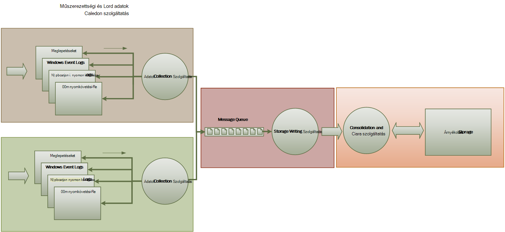

<properties
   pageTitle="Figyelés és diagnosztika útmutatást |} Microsoft Azure"
   description="Gyakorlati tanácsok a felhőben elosztott alkalmazások figyelése."
   services=""
   documentationCenter="na"
   authors="dragon119"
   manager="christb"
   editor=""
   tags=""/>

<tags
   ms.service="best-practice"
   ms.devlang="na"
   ms.topic="article"
   ms.tgt_pltfrm="na"
   ms.workload="na"
   ms.date="07/13/2016"
   ms.author="masashin"/>

# <a name="monitoring-and-diagnostics-guidance"></a>Figyelés és diagnosztika útmutató

[AZURE.INCLUDE [pnp-header](../includes/guidance-pnp-header-include.md)]

## <a name="overview"></a>– Áttekintés
A felhőben futó elosztott alkalmazások és szolgáltatások vannak, a jelleg, szoftver sok mozgó részből áll összetett darab szerint. Üzemi környezetben fontos tudja nyomon követheti a csatlakozást a felhasználók az a rendszer, az erőforrás-kihasználtság nyomkövetési módon, és általában figyelni a rendszerállapot és a rendszer teljesítményét. Használhatja ezt az információt diagnosztikai segítségként észlelése és javítása a problémákat, és is a Súgó direkt esetleges problémákat, és megakadályozhatja, hogy az előforduló.

## <a name="monitoring-and-diagnostics-scenarios"></a>Figyelés és diagnosztika felhasználási területei
Figyelés segítségével bepillantást egy milyen jól működik-e a rendszer. Figyelés része a kulcsfontosságú szolgáltatás minősége célok fenntartása. Tipikus esetei felügyeleti adatok gyűjtése a következők:

- Annak ellenőrzése, hogy a rendszer továbbra is megfelelő.
- Nyomon követése a rendszer és az összetevő-elemei az elérhető.
- Ez esetben megtartják annak érdekében, hogy a rendszer a kapacitásának nem rontja váratlanul, a mennyiségű munka nő teljesítményét.
- Biztosítása, hogy a rendszer megfelel-e a vevőkkel folytatott létrehozott szolgáltatói rendelkezést (SLA).
- Az adatvédelmi és biztonsági a rendszer, a felhasználók és az adatok védelme.
- A naplózási vagy szabályozó célokra végrehajtott műveletek nyomon.
- A napi szintű használatát a rendszer és a trendek, amely problémák vezethet, ha éppen nem foglalkozik gyorsabban figyelése című témakört.
- Követés problémák, a lehetséges okok, kijavítása, csatlakozása szoftverfrissítések és üzembe elemzésének keresztül kezdeti jelentésből.
- Műveletek nyomon követése és hibakeresés szoftver kiadásokban.

> [AZURE.NOTE] Ez a lista nem kell a teljes készült. Ezt a dokumentumot, a leggyakoribb helyzetekben felügyeletében az forgatókönyvekben koncentrál. Előfordulhat, hogy mások is, amely kevésbé gyakori vagy a program a környezetben.

Az alábbi szakaszok ismertetik forgatókönyvekben részletesebben. Az összes lépéshez információkat Budai tárgyalja a következő formátumban:

1. Az alkalmazási példát rövid áttekintése
2. Ebben az esetben tipikus követelményei
3. A nyers műszerezettségi adatok támogatása a forgatókönyv, és a lehetséges információforrások szükséges
4. Hogyan elemezheti és együttes használata értelmes diagnosztikai adatok készítése a e nyers adatokból

## <a name="health-monitoring"></a>Állapot ellenőrzése
A rendszer a megfelelő futó és képes kérelmek feldolgozása esetén. A rendszerállapot figyelése célja, hogy ellenőrizheti, hogy a rendszer minden összetevő meg a várt módon működnek-e az aktuális állapota pillanatképét létrehozásához.

### <a name="requirements-for-health-monitoring"></a>A rendszerállapot figyelése vonatkozó követelmények
Operátor kell gyorsan (belül a témát, másodperc) Ha értesítést kell sérült tekinteni, a rendszer bármely részét. Annak megállapítása, a rendszer mely részei a szokásos módon működnek-e, és mely részei problémákat tapasztal az operátor láthatja. A rendszerállapot is kiemelten forgalom – világos rendszeren keresztül:

- Piros színű a sérült (a rendszer leállt)
- A sárga részben megfelelő (a rendszer fut csökkentett szolgáltatáskészletű üzemmód)
- Zöld teljesen megfelelő

A rendszerállapot figyelése átfogó rendszert lehetővé teszi, hogy az operátor részletezést végez a rendszer, alrendszerek és -összetevők állapotának megtekintéséhez keresztül. Ha például a teljes rendszerben olyan téglalapként ábrázol, részben megfelelő, ha az operátor látnia kell nagyításához, és határozza meg, mely a funkció jelenleg nem érhető el.

### <a name="data-sources-instrumentation-and-data-collection-requirements"></a>Adatforrások műszerezettségi és adatgyűjtési vonatkozó követelmények
A rendszerállapot figyelése támogatásához szükséges nyers adatokból következtében hozható létre:

- Nyomkövetés a felhasználói kérések végrehajtása. Ez az információ határozza meg, amelyekhez a sikeres volt, amelyek nem és minden kérés időtartamának használható.
- Szintetikus felhasználói figyelése című témakört. Ez a folyamat keltő a szűrő megőrzi a felhasználó által elvégzett lépéseket, és lépéseket előre definiált sorozata követi. Kell feltüntetni az egyes lépések eredményei.
- A naplózás a kivételek, hibák és figyelmeztetések. Ezt az információt az alkalmazás kódja beágyazására, valamint a adatok beolvasása az Eseménynapló bármely szolgáltatások, a rendszer hivatkozó nyomkövetési kimutatások eredményeként rögzíthető.
- A rendszer által használt külső szolgáltatások állapotának ellenőrzése. Ez az ellenőrzés beolvasása és az alábbi szolgáltatások ellátási állapot adatok elemzése lehet szükség. Ez az információ sokféle formátum igénybe vehet.
- Végpont figyelése című témakört. Ez az eljárás részletesen a "Elérhetőség ellenőrzése" szakaszban leírtak.
- Gyűjt a környezeti teljesítmény információt, például a háttér Processzor kihasználtsági vagy I/O (beleértve a hálózati) tevékenység.

### <a name="analyzing-health-data"></a>Állapot-adatok elemzése
Elsődleges a rendszerállapot figyelése elsősorban gyorsan jelzi, hogy fut-e a rendszer. Meleg azonnali adatok elemzése riasztás válthat, kritikus összetevője észlelésekor a sérült. (Ez nem válaszol a ping egymást követő sorozatának például.) Az operátor majd készíthet a megfelelő korrekciós műveletet.

A speciális rendszert tartalmazhatnak olyan egy prediktív elem, amely egy hideg analysis végez a legutóbbi és az aktuális feladatok fölé. A hideg elemzésre tendenciakövetés és a határozza meg, hogy a rendszer valószínűleg a megfelelő marad, vagy hogy szüksége lesz a rendszer további források. Ez az elem prediktív alapjául kritikus teljesítménymutatók, például:

- Egyes szolgáltatások és alrendszer irányuló kérések mértéke.
- Az alábbiak válaszidő kéri.
- Az adatok be- és kijelentkezés a egyes szolgáltatásokhoz folyó mennyisége.

Tetszőleges metrikus értéke meghaladja a megadott küszöbértékét, ha a rendszer emelheti jelzést lehetővé teszi, hogy egy operátor vagy autoscaling (ha elérhető) a műveleteket megelőző rendszerállapot megőrzéséhez szükséges. Az alábbi műveletek előfordulhat, hogy magában foglalja a források, indítsa újra az adatkapcsolat, vagy kisebb prioritású kérések szabályozásának alkalmazása egy vagy több szolgáltatás hozzáadása.

## <a name="availability-monitoring"></a>Elérhetőség ellenőrzése
Nagyon jól megfelelő rendszer szükséges, hogy a összetevők és a rendszer alkotó alrendszerek állnak rendelkezésre. Elérhetőség ellenőrzése szorosan kapcsolódik, a rendszerállapot figyelése. De mivel a rendszerállapot figyelése a rendszer az aktuális állapotának azonnali nézetének elérhetőség ellenőrzése foglalkozik nyomon követése a rendszer és a rendszer a felmérést statisztikájának létrehozásához összetevői elérhetőségét.

Beépített redundancia lehetővé teszi a gyors feladatátvevő komoly hibafa vagy kapcsolódási elvesztése esetén számos rendszerben, néhány összetevőt (például egy adatbázis) van beállítva. Felhasználók ideális esetben nem kell szem előtt, hogy ilyen hiba történt. De egy perspektíva figyelése elérhetőségét, a gyűjtése minél több információt a lehető ilyen hibák határozza meg a probléma okát, és így megakadályozhatja, hogy az ismétlődő korrekciós műveletek végrehajtása szükséges.

Az elérhetőség nyomon követéséhez szükséges adatokat számos tényező alsóbb szintű függhet. Lehet, hogy ezek a tényezők közül számos az alkalmazás, a rendszer és a környezetben. Hatékony ellenőrzési rendszer rögzíti a elérhetőségi adatok, amelyek e alacsony tényezők felel meg, és ezután összesítésének őket a rendszer átfogó képet. Például egy e-kereskedelmi rendszerben az üzleti funkcióit, amely lehetővé teszi, hogy a rendelések vevő függhet a rendelés részletei tároló tárházba és a fizetési rendszer fizet a következő rendelések pénzbeli tranzakcióinak kezeli. A sorrend-elhelyezése részét a rendszer az elérhető éppen ezért a tárat, és a fizetési alrendszer állásáról függvényt.

### <a name="requirements-for-availability-monitoring"></a>Elérhetőség ellenőrzése vonatkozó követelmények
A korábbi elérhetősége az egyes rendszerek és alrendszer jeleníthet meg és ezen információk segítségével, előfordulhat, hogy egy vagy több alrendszerek rendszeres meghiúsító tendenciakövetés operátor is láthatja. (Tegye szolgáltatások indítsa el a nap, amely megfelel a csúcs feldolgozás óra adott időpontban meghiúsító?)

Ellenőrző megoldást biztosítania kell a rendelkezésre álló azonnali és korábbi rálátást vagy minden alrendszer elérhetetlenség. Is kell képes gyorsan riasztási operátor, ha egy vagy több szolgáltatások fail, vagy ha a felhasználó nem tud csatlakozni a szolgáltatásokat. Ez a frissítését és nem csak egyes szolgáltatás felügyelete, de is vizsgálja meg a műveleteket, amelyeket minden felhasználó hajt végre, ha az alábbi műveletek sikertelen, amikor megpróbálnak kommunikáció a szolgáltatás. Bizonyos mértékig kapcsolódási hiba fokú normál, és előfordulhat, hogy tranziens hibákat. De hasznos lehet ahhoz, hogy a rendszer kapcsolódási hibák egy megadott alrendszer adott időszakára előforduló száma értesítés előléptetése engedélyezése valószínűleg.

### <a name="data-sources-instrumentation-and-data-collection-requirements"></a>Adatforrások műszerezettségi és adatgyűjtési vonatkozó követelmények
A rendszerállapot figyelése, az elérhetőség ellenőrzése támogatásához szükséges nyers adatokból eredményeként szintetikus felhasználói figyelhető és naplózható kivételek, a hibák és a figyelmeztetés fellépő adatveszteségről hozhatók létre. Ezenkívül elérhetőségi adatok beszerezhető felügyeletében végpontot. Az alkalmazás fedhet egy vagy több állapot végpontok, minden egyes tesztelés access funkcionális terület belül a rendszer. Az ellenőrző rendszer is minden végpontra pingelése által definiált ütemezés, és az eredmények (sikeres vagy sikertelen) összegyűjtése.

Az összes időtúllépései, hálózati kapcsolódási hibák és újrapróbálkozási kapcsolatfelvételi rögzíteni kell. Az összes adat kell időbélyeggel.

<a name="analyzing-availability-data"></a>
### <a name="analyzing-availability-data"></a>Elérhetőségi adatok elemzése
Műszerezettségi adatokat kell összesíti, és összefüggésbe elemzés a következő típusú támogatja:

- A rendszer és alrendszerek az azonnal elérhető.
- Elérhetőség hiba mértékének a rendszer és alrendszerek. Ideális esetben operátor láthatja az adott tevékenységek a hibák összehangolására: Mi lett történik, amikor a rendszer nem sikerült?
- A rendszer vagy bármely alrendszerek át bármelyik hiba mértékének korábbi nézetének megadott időszak és a terhelést a rendszeren (például a felhasználói kérések száma) amikor hiba történt.
- A rendszer vagy bármely alrendszerek elérhetetlenség okait. Például az oka lehet, hogy a szolgáltatás nem fut, a kapcsolat megszakadt, de időtúllépés és csatlakoztatott, de az adatszolgáltató hibák csatlakozik.

Kiszámíthatja a szolgáltatás százalékos elérhetőségét időszakra vonatkozóan a következő képlet használatával:

```
%Availability =  ((Total Time – Total Downtime) / Total Time ) * 100
```

Ez akkor hasznos SLA céljából. ([SLA figyelése](#SLA-monitoring) leírása részletesen belül az útmutató.) _Legrövidebb leállás_ definícióját attól függ, hogy a szolgáltatás. Ha például a Visual Studio Csapat összeállítása szolgáltatások határozza meg legrövidebb leállás az időszak (teljes halmozott perc), amelynek során létre szolgáltatás nem érhető el. Egy perc tekintendő nem érhető el, ha minden folyamatos HTTP-kérések szolgáltatás összeállítása a percet egész ügyfél által kezdeményezett műveletek elvégzésére hibakód eredményez, vagy választ adnak.

## <a name="performance-monitoring"></a>A teljesítmény figyelése
A rendszer felépítése további és további terhelve (által a felhasználók a hangerő növelése) az adatkészleteket, hogy ezek a felhasználók hozzáférési megnő méretének és egy vagy több összetevők meghibásodása lehetőségéről válik nagyobb az esélye. Gyakran összetevő meghibásodása egy csökkenhet a teljesítmény előtt. Ha sikerül észleli a csökkentése a helyzet megelőző kijavításukhoz készíthet.

Rendszerteljesítmény számos tényező függ. Minden egyes faktor általában például adatbázis-tranzakciók másodpercenként számát vagy a hálózati kérelmeket, hogy a program sikeres kiszolgált az egy adott időkereten mennyiségű mérni fő teljesítménymutatók (KPI-k) keresztül. Egy része a KPI-k lehet adott teljesítmény mértékek, amelyekhez, míg mások esetleg kell származnia mértékek kombinációi.

> [AZURE.NOTE] Annak megállapítása, gyenge vagy a jó teljesítményt igényel, hogy megismeri a teljesítményt, amelynél a rendszer futtatása képes kell szintjét. Ehhez a betartásával a rendszer, miközben működik-e egy tipikus terhelés alatt, és az adatok rögzítéséhez minden KPI időbeli fölé. Ez lehet magában szimulált terhelés alatt a rendszer fut tesztkörnyezetben, és a szükséges adatok összegyűjtése munkakörnyezetben mielőtt a rendszer.

> Biztosítania kell, hogy a teljesítmény célokra figyelése nem lesz a rendszer terhet. Előfordulhat, hogy dinamikusan módosítsa az adatokat gyűjt a teljesítmény folyamat figyelése részletességi szintjét.

### <a name="requirements-for-performance-monitoring"></a>Teljesítményét figyelve vonatkozó követelmények
Rendszerteljesítmény vizsgálatához operátor általában van szüksége az információt, amely tartalmazza:

- A felhasználói kérések esetén válasz mértéke.
- Egyidejű felhasználói kérések száma.
- A hálózati forgalmának engedélyezésére mennyiségű.
- A díjak, mely üzleti a tranzakciók befejeződött vannak.
- Az átlag kérelmek feldolgozási ideje.

Is lehet hasznos eszközök, amelyek lehetővé teszik a direkt összefüggések, például: segítséget operátorok egyike szükséges:

- Kérés késés időpontok (időtartamának kérés végrehajtása után a felhasználónak küldött, indításához) és a párhuzamos felhasználók számát.
- Az átlagos válaszidő (időtartamának kérelmének befejezéséhez, miután elindult feldolgozása) és a párhuzamos felhasználók számát.
- A hangerő kérelmek és a feldolgozás hibák számának.

Magas szintű funkcionális információk, valamint operátor látnia kell a rendszer minden összetevő teljesítményének részletes nézete juthat. Ezeket az adatokat a szokásos nyomon követheti az információkat, például: alacsony teljesítményét teljesítménymutatói keresztül elérhetők:

- A memória kihasználtsági.
- Szálak száma.
- Processzor feldolgozás idő.
- Sor hossza kérhet.
- Lemezen vagy hálózati I/O díjak és hibák.
- További bájt száma.
- Köztes jelzők, például várólista hossza.

Minden képi megjelenítés töltött idő megadásához operátor lehetővé teszi. Lehet, hogy a megjelenített adatok a jelenlegi helyzet pillanatképét és/vagy a teljesítmény korábbi nézetének.

Operátor látnia kell tipp jelzést során minden megadott időközönként bármely teljesítmény mértéke, minden megadott érték alapján.

### <a name="data-sources-instrumentation-and-data-collection-requirements"></a>Adatforrások műszerezettségi és adatgyűjtési vonatkozó követelmények
Felhasználói kérések végrehajtásának megfigyelésével, mire eljut az üzenetem, és a rendszer haladnia gyűjthető magas szintű teljesítményadatokat (átviteli, egyidejű felhasználók számát és a vállalati tranzakciók, hiba arányok és stb.). Ez magában foglalja magában foglaló nyomkövetési kimutatások, az alkalmazás kódja együtt időzítés információk főbb pontjairól. Az összes hibák, kivétel és figyelmeztetések használatával történik a őket a kéréseivel okozó őket a megfelelő adatokat tartalmazó kell rögzített. Az Internet Information Services (IIS) napló egy másik hasznos forrás.

Ha lehetséges minden olyan külső rendszerek, az alkalmazás által használt teljesítményadatokat is rögzíthet. Ezek a külső rendszerek előfordulhat, hogy a szükséges saját teljesítményét számláló vagy egyéb szolgáltatások teljesítményét adatokat kér. Ha ez nem lehetséges, rekord információkat, például a kezdési idő és befejezési idő értékét minden kérelme egy külső rendszerhez, a művelet állapotát (sikeres, sikertelen vagy figyelmeztetés) együtt. Például a időmérője megközelítés idő kérelmek használható: indításakor időzítőt a kérést, és majd leállítása az óra, amikor befejeződött a kérést.

Lehet, hogy az egyes alkatrészek rendszerben követő teljesítményadatokat funkciók és szolgáltatások, például a Windows teljesítmény számláló és Azure diagnosztika keresztül érhető el.

### <a name="analyzing-performance-data"></a>A teljesítményadatok elemzése
Munka nagy része a analysis, ahol a felhasználói kérelem típusa és/vagy a alrendszer vagy a szolgáltatás, amelyhez minden kérelem elküldése teljesítményét adatok összesítése. Példa egy felhasználói kérelem elem felvétele a bevásárlókocsi vagy a kivétel folyamat végrehajtása egy e-kereskedelmi rendszerben.

Egy másik közös követelmény az engedélyeiről kijelölt percentilisek teljesítményadatokat. Operátor például kérések 99 %-át, 95 kérések százalékos aránya és 70 kérések százalékos aránya válaszidő előfordulhat, hogy megállapításához. Előfordulhat, hogy SLA célok, vagy más célok állít be, az egyes PERCENTILIS. A folyamatban lévő eredmények lehet jelenteni közeli valós idejű azonnali hibák feltárása érdekében. Az eredmények is összesítenie kell statisztikai célokra hosszabb idő.

Késés problémák teljesítményét érintő, amíg egy operátort láthatja gyorsan okának szűk vizsgálata, hogy minden kérés végrehajtása lépésein késleltetése alapján. A teljesítményadatok ezért biztosítania kell használatával történik az egyes lépések összehívásra adott kelljen teljesítményét mértékek eszközei.

Attól függően, hogy a képi megjelenítések követelményeknek célszerű lehet hozhat létre és tárolni a nyers adatokból nézeteket tartalmazó adatok kocka. A adatok kocka lehetővé teheti a összetett alkalmi lekérdezése és a teljesítményadatok elemzését.

## <a name="security-monitoring"></a>Biztonsági figyelése
Bizalmas adatokat tartalmazó összes kereskedelmi rendszerek biztonsági szerkezetet kell végrehajtania. A biztonsági mechanizmusa komplexitását az általában a magánjellegű adatok, a függvény. A felhasználók hitelesítését igénylő rendszerben, adniuk:

- Az összes bejelentkezési kísérleteket, sikertelen e őket vagy sikertelen volt.
- Összes művelet által elvégzett – és – egy hitelesített felhasználó által elérhető összes erőforrás részleteit.
- Ha egy felhasználó a munkamenet befejezése és kilépett.

Figyelés lehet a rendszer támadásokkal feltárása érdekében. Például a sikertelen bejelentkezési kísérleteket nagyszámú egy próbálkozásos homonimaszerű webcímmel jelezheti. Lehet, hogy egy váratlan hullámzó jellegű összehívásokban elosztott szolgáltatás megtagadását (DDoS) homonimaszerű webcímmel eredményét. Kell készíteni, Lync-e kérelmek forrásának függetlenül az összes erőforrás összes kérelmet. A rendszer, amelyen egy bejelentkezési biztonsági véletlenül előfordulhat, hogy jelenítik meg a külső világ erőforrások anélkül, hogy a felhasználót, hogy valójában jelentkezzen be.

### <a name="requirements-for-security-monitoring"></a>Biztonsági figyelése vonatkozó követelmények
A legfontosabb figyelése biztonsági szempontjait gyorsan engedélyezze az operátor:

- Nem hitelesített entitás észlelő kísérlete jövő támadásokkal szemben.
- Személyek, amelynek ezek nem hozzáférést kapott adatok a műveletek elvégzésére kísérletek azonosítása
- Ellenőrizze, hogy a rendszer, vagy a rendszer a részben a területen a homonimaszerű webcímmel belüli vagy kívüli. (Ha például egy rosszindulatú hitelesített felhasználó előfordulhat, hogy próbál leállíthatja a rendszer.)

Ezeknek a követelményeknek támogatásához operátor értesíteni kell:

- Ha több fiókkal ismételt miatt sikertelen volt a bejelentkezési kísérletet a megadott időszakon belül.
- Ha egy hitelesített fiók többször kísérel meg hozzáférni tiltott erőforrás egy meghatározott időszakban.
- Ha nagyszámú nem hitelesített vagy jogosulatlan kérelmek egy adott időszakban fordul elő.

Az adatokat, operátorok egyike által biztosított tartalmaznia kell a forrás, minden egyes kérelem host címét. Ha biztonsági megsértése rendszeresen egy adott cellatartományból címek merülnek fel, ezek a hosts blokkolhatja.

Kulcs részt, a rendszer fenntartása folyamatban van gyors észleli a műveleteket, amelyek eltérnek a szokásos minta Információkat, például sikertelen, illetve sikeres bejelentkezési kérések száma vizuálisan megjeleníthetők észleli, hogy van egy Nyárs tevékenység szokatlan időben érdekében. (Ez a tevékenység egy példa a felhasználók bejelentkezni a http://Portal.Office.com/onedrivehttp: 3:00 de és sok műveletek elvégzéséhez, a 9:00 de azok munkanap indításakor). Ez az információ is használható időalapú autoscaling konfigurálhatja. Ha például egy operátort azt látja, hogy egy nagy számú felhasználó rendszeresen jelentkezzen be az adott időpontban nap, az operátor elrendezhetik további hitelesítési szolgáltatások kezelése a mennyiségű munka, és ezután állítsa le a ezeket a szolgáltatásokat, ha a csúcs eltelte indításához.

### <a name="data-sources-instrumentation-and-data-collection-requirements"></a>Adatforrások műszerezettségi és adatgyűjtési vonatkozó követelmények
Biztonsági egy minden felölelő funkcióival leggyakrabban elosztott rendszerek. A megfelelő adatokat valószínű, hogy egy rendszerben több pontokon jön létre. Vegye figyelembe az alkalmazás, egy hálózati eszköz, kiszolgálók, tűzfalak, víruskereső szoftvert és egyéb behatolási-megelőzés elemek keletkezett események származó eredményeket biztonsággal kapcsolatos információk összegyűjtése biztonsági információk és esemény-kezelés (SIEM) megközelítés elfogadása.

Biztonsági figyelése is beépítése eszközök, amelyek nem részei az alkalmazás az adatokat. Ezeket az eszközöket is elhelyezhet, amely a tevékenységek port végzett vizsgálatot külső irodák vagy hálózati szűrők, hogy az alkalmazás és az adatok nem hitelesített eléréséhez szükséges kísérletek azonosítását segédprogramok.

Minden esetben az összegyűjtött adatok engedélyeznie kell a rendszergazda bármely homonimaszerű webcímmel jellegét határozza meg, és a megfelelő ellenintézkedések készítése.

### <a name="analyzing-security-data"></a>Biztonsági adatok elemzése
A felügyeleti biztonsági funkció a különböző forrásokból, az adatok merül fel. A különböző formátumú és részletességi szintjét gyakran igényelnek összetett kötik össze az információk egységes szál rögzített adatok elemzése A legegyszerűbb esetek (például a sikertelen bejelentkezések vagy kritikus erőforrásokra mutató ezzel az illetéktelen hozzáférést többszöri próbálkozás nagyszámú észlelését), kivéve azt lehetséges nem fogja tudni bármely összetett biztonsági adatok automatikus feldolgozása végrehajtásához. Ehelyett lehet előnyös ezeket az adatokat, de különben a program az eredeti formájában, egy biztonságos adattár szakértői kézi elemzésre engedélyezni szeretné időbélyeggel írni.

<a name="SLA-monitoring"></a>

## <a name="sla-monitoring"></a>SLA figyelése
Sok kereskedelmi rendszerek, amelyek támogatják a fizető vevők végezze el a rendszer a teljesítmény garanciákkal SLA formájában. SLA lényegében, adja meg, hogy a rendszer a meghatározott mennyiségű munka egy elfogadott időkereten belüli időpontra és a fontos adatok elvesztése képes kezelni. SLA figyelése érintett biztosítva, hogy a rendszer a mérhető SLA is megfelelnek.

> [AZURE.NOTE] SLA figyelése szorosan kapcsolódik teljesítményét figyelve. De teljesítményét figyelve érintett biztosítva, hogy a rendszer függvények _optimálisan_, mivel a szerződési kötelezettség, amely meghatározza, hogy milyen _optimálisan_ ténylegesen azt jelenti, hogy SLA figyelése szabályozza.

A gyakran definiált SLA:

- Rendszer általános elérhetőségét. Például egy szervezet garantálja lehet, hogy a rendszer a idő 99,9 százaléka elérhető lesz. Ez megfelel legfeljebb 9 óra legrövidebb leállás évente vagy a hét minden megközelítőleg 10 perc.
- Műveleti kapacitása. Ez a méretarány gyakran fejezi ki egy vagy több maximális – méretei, például, hogy a rendszer támogatja a legfeljebb 100 000 egyidejű felhasználói kérések, vagy 10 000 egyidejű üzleti tranzakciók kezelése biztosítása.
- Műveleti válaszidő. A rendszer előfordulhat, hogy győződjön kérések feldolgozásának árfolyam garanciákkal is. Példa, hogy az összes üzleti tranzakciók 99 %-át 2 másodpercek befejeződik, de nem egyetlen tranzakció több időt vesz igénybe mint 10 másodperc.

> [AZURE.NOTE] Kereskedelmi rendszerek néhány szerződéseket SLA az ügyfélszolgálat tartalmazhat. Példa, hogy az összes segélyszolgálat kérés 5 percen belül fog kér választ, de, hogy az összes problémák 99 %-át teljesen címzettje lesz 1 munkanap belül. Értekezlet-SLA alábbiakhoz kulcsfontosságú hatékony [Problémakövetés](#issue-tracking) (később a jelen szakaszban ismertetett).

### <a name="requirements-for-sla-monitoring"></a>SLA figyelése vonatkozó követelmények
A legmagasabb szintű operátor látnia kell egy pillantással megállapíthatja, hogy a rendszer megfelel-e az elfogadott SLA-e. Ha nem az operátor láthatja a felhatoláshoz lefelé és vizsgálja meg a mögöttes tényezők követelményeket teljesítményét okai megállapításához.

Vizuálisan megismerését tipikus magas szintű jelölőket tartalmazza:

- A százalékos aránya üzemidő.
- Az alkalmazás átviteli (sikeres tranzakciók és/vagy másodpercenként művelet mért).
- A sikeres és sikertelen alkalmazás kérések száma.
- Az alkalmazás- és hibák, a kivételek és figyelmeztetések száma.

Az összes hibajelzők képes egy meghatározott időtartamra szerint szűrve kell lennie.

A felhő alkalmazások valószínűleg magában foglalja a alrendszerek és -összetevők számos. Válassza ki a magas szintű kijelzőt, és megtekintheti, hogyan összehangolt az alapul szolgáló elemek állapotának operátor láthatja. Ha például a teljes rendszerben felmérést elfogadható érték alá esik, ha operátor látnia kell nagyításához, és meghatározza, hogy mely elemek biztosítanak a hiba.

> [AZURE.NOTE] Rendszer üzemidőt kell gondosan definiálhatók. Annak biztosítása érdekében a maximális elérhetőség redundancia használó rendszerben elemek különálló példányai előfordulhat, hogy nem, de a rendszer továbbra is működnek. Minden elem összesítő felmérést, és nem feltétlenül hogy a rendszer ténylegesen leállt rendszer üzemidőt rendszerállapot figyelése által bemutatott jelzi. Ezenkívül hibák elszigetelt lehet. Így akkor is, ha egy adott rendszer nem érhető el, a rendszer a maradékot előfordulhat, hogy továbbra is elérhetők, bár együtt megnövekedhet funkciók. (Egy e-kereskedelmi rendszerben, a rendszer hiba megakadályozhatja egy ügyfél úgy, hogy a rendelések, de az ügyfél továbbra is a termékkatalógus böngészhet.)

A riasztási céljából, a rendszer látnia kell esemény tipp, ha a megadott küszöbértékét nagyobb, mint a magas szintű jelölők közül. A különböző tényezők magas szintű jelző alkotó alsóbb szintű részleteit környezetfüggő adatként a figyelmeztető rendszernek kell lennie.

### <a name="data-sources-instrumentation-and-data-collection-requirements"></a>Adatforrások műszerezettségi és adatgyűjtési vonatkozó követelmények
A szükséges a SLA ellenőrzésére támogatási nyers adatokból hasonlít a nyers adatokból teljesítményét figyelve együtt néhány szempontjait állapot és az elérhetőség ellenőrzése működéséhez szükséges. (Lásd: további részleteket szakaszokat.) Ezeket az adatokat is rögzíthet:

- Felügyeletében végpontot.
- A naplózás a kivételek, hibák és figyelmeztetések.
- Nyomkövetés a felhasználói kérések végrehajtása.
- Figyelés, a rendszer által használt külső szolgáltatások elérhetőségét.
- Teljesítménymutatók és számláló használatával.

Az összes adat időzítette legyen, és időbélyeggel.

### <a name="analyzing-sla-data"></a>SZOLGÁLTATÁSISZINT-adatok elemzése
Az műszerezettségi adatokat összesíteni kell létrehozni, a rendszer általános teljesítményére képe. Összesített adatok is támogatnia kell ahhoz, hogy a teljesítményt, az alapul szolgáló alrendszerek vizsgálata Lehatolás. Ha például kell tudni:

- Felhasználói kérések teljes számának kiszámítása a megadott időszak alatt, és meghatározzák, hogy ezek a kérelmek sikeres és sikertelen mértéke.
- A felhasználói kérések készítése a rendszer válaszidő átfogó képet válaszidő össze.
- A felhasználói kérések szeretné bontani be az egyes munkaelemek a kérelem válaszidő kérelem általános válaszidő végrehajtásának elemezheti.  
- Határozza meg a rendszer általános elérhetősége üzemidőt százalékában bármely adott időszakra.
- A százalékos idő elérhetősége az egyes alkatrészek és szolgáltatások elemzése a rendszer. Ez lehet magában elemző naplók, amely a külső szolgáltatásokra támaszkodik hozott létre.

Jelentés valós teljesítmény számok alapján megállapított SLA meghatározott ideig, általában egy adott hónapban számos kereskedelmi rendszer szükséges. Ez az információ kiszámításához credits vagy egyéb törlesztések ügyfeleknek Ha adott időszakban nem éri el a SLA használható. Egy szolgáltatás elérhetősége kiszámíthatja [elemzése elérhetőségi adatok](#analyzing-availability-data)szakaszban leírt módszerrel.

Belső célokra szervezeti előfordulhat, hogy is nyomon követheti a szám és a szolgáltatások meghiúsító kiváltó események természeti. Útmutató a problémák megoldásához gyorsan vagy kiküszöbölheti a teljes egészében csökkentheti az állásidőt, és teljesíti SLA segítségével.

## <a name="auditing"></a>A naplózás
Attól függően, hogy az alkalmazás jellegét előfordulhat, hogy szerinti törvényes vagy más jogszabályok, adja meg az felhasználói műveletek naplózási és a felvétel összes adatokhoz való hozzáférés. A naplózás megadhatja az igazolás, hogy a hivatkozások felhasználók adott kérelmekre. Nem megtagadás számos e-üzleti rendszer adatvédelmi megőrzése érdekében fontos tényezőt kell egy ügyfél és a szervezet felelős az alkalmazás vagy szolgáltatás között.

### <a name="requirements-for-auditing"></a>A naplózás vonatkozó követelmények
Egy analitikus kell tudja nyomon követheti a vállalati verzió műveletek, amelyek a felhasználók hajt végre, hogy akkor is állítania felhasználói műveletek sorrendjét. Ez lehet, hogy egyszerűen alkot rekordot, vagy egy Törvényszéki vizsgálat részeként.

Bizalmas információk naplózása fut. Valószínűleg azt fogja tartalmazni, amely azonosítja a rendszer, azok is elvégzéséhez feladatokat és a felhasználók adatokat. Emiatt információk naplózása valószínűleg a következőkben jelentések csak megbízható elemzők elérhető, hanem grafikus műveletek Lehatolás támogató egy interaktív rendszer. Egy analitikus látnia kell egy cellatartomány jelentések létrehozásához. Például jelentések előfordulhat, hogy a lista összes felhasználó tevékenységeket egy adott időkereten során előforduló, részletesen a tevékenység egy felhasználó időrendjének vagy lista egy vagy több erőforrások címtáron műveletek sorrendjének.

### <a name="data-sources-instrumentation-and-data-collection-requirements"></a>Adatforrások műszerezettségi és adatgyűjtési vonatkozó követelmények
Az elsődleges információforrások a naplózás a következők lehetnek:

- A felhasználói hitelesítés kezelő biztonsági rendszer.
- A nyomkövetési naplók, amelyek a felhasználói tevékenység rögzítése.
- Biztonsági naplók minden azonosítható és azonosíthatatlan hálózati kérés nyomon.

A formátum a naplóadatokat és a program hogyan tárolja amelyek alapján szabályozó előfordulhat, hogy vezeti. Ha például nem esetleg semmilyen módon az adatok letisztázásának. (Ez rögzíteni kell az eredeti formátumában.) Tárolási helye a tárházba való hozzáférést, hogy az illetéktelen hozzáférés kell védeni.

### <a name="analyzing-audit-data"></a>Naplózási adatok elemzése
Egy analitikus kell fér hozzá az eredeti formájában egészében nyers adatokból. Azon a követelmény közös naplózási jelentések készítése az adatok elemzéséhez használható eszközök valószínűleg speciális, és a rendszer a külső tartani.

## <a name="usage-monitoring"></a>Használat figyelése
Használat figyelése nyomon követi a szolgáltatások és -összetevők, az alkalmazás használata. Operátor használható az összegyűjtött adatokat:

- Mely funkciók van kitéve, és meghatározzák, hogy minden lehetséges interaktív a rendszer határozza meg. Max-forgalmat elemek előnyt jelenthet funkcionális szétválasztás vagy még több egyenletesen a Betöltés a replikáció. Operátor annak megállapítása, hogy mely funkciók ritkán használja, és lehetséges jelöltek elavulása vagy a rendszer egy későbbi verziójában helyettesítő ezeket az adatokat is használhatja.
- A rendszer a szokásos használata a működési események információhoz juthat. Például az e-kereskedelmi hely rögzítheti a tranzakciók száma és ügyfelek felelősek őket hangerejének statisztikai adatainak. Ezt az információt a kapacitás tervezéséhez vevők számát növekedésével használható.
- A teljesítményt, illetve a funkció a rendszer a felhasználói elégedettséget észleli (esetleg közvetetten). Például egy e-kereskedelmi rendszerben ügyfelek nagyszámú rendszeresen elhagyja a vásárlási kártyák, ha ez előfordulhat, hogy a kivétel funkciókat probléma.
- Készítése a számlázási adatait. Egy kereskedelmi alkalmazás vagy szolgáltatás multitenant előfordulhat, hogy díjat számít fel, amelyeket használnak az erőforrások ügyfelek.
- A hivatkozási kvóták. Ha egy felhasználó multitenant rendszerben meghaladja a feldolgozási idő vagy az Erőforrás kihasználtsága adott időszakára fizetett kvóta, lehet, hogy a hozzáférésüket korlátozott, vagy feldolgozás szabályozott is lehet.

### <a name="requirements-for-usage-monitoring"></a>Használat figyelése vonatkozó követelmények
Rendszer használatát vizsgálatához operátor általában van szüksége az információt, amely tartalmazza:

- Vannak minden alrendszer által feldolgozott és az egyes erőforrásokhoz kérések száma.
- A munka minden felhasználó hajt végre.
- Adattárolás, amely az egyes felhasználók által elfoglalt hangerejének.
- Az erőforrások minden felhasználó hozzáférhet.

Diagramok létrehozásához operátor is láthatja. Például egy diagramon lehet, hogy a legtöbb erőforrás belekóstol felhasználók megjelenítése vagy a leggyakrabban használt erőforrások vagy a rendszer funkcióit.

### <a name="data-sources-instrumentation-and-data-collection-requirements"></a>Adatforrások műszerezettségi és adatgyűjtési vonatkozó követelmények
Követés használatát viszonylag magas szintű lehet elvégezni. Az egyes kérelmek kezdési és befejezési időpont és a kérelem (olvasni, írja be, és így tovább attól függően, hogy az adott erőforrás) jellegét is vegye figyelembe. Ezt az információt is kaphat:

- Nyomkövetés felhasználói tevékenység.
- A rögzítés teljesítmény teljesítménymutatói a kihasználtság az egyes erőforrásokhoz.
- Az erőforrás-felhasználás minden felhasználó által figyelése című témakört.

Célra mérés, meg kell is engedélyezni szeretné, hogy mely felhasználók felelősek hajt végre, milyen műveleteket, és ezeket a műveleteket kihasználó erőforrások azonosítása. Az összegyűjtött információkat kell lennie ahhoz, hogy pontos számlázási részletes.

<a name="issue-tracking"></a>
## <a name="issue-tracking"></a>Problémakövetés
Ügyfelek és más felhasználók előfordulhat, hogy hibát, ha nem várt események vagy probléma fordul elő, a rendszer. Problémakövetés ezeket a problémákat, társítása őket a rendszer minden érintett problémák megoldására erőfeszítéseket és a lehetséges megoldások a felhasználók tájékoztatása foglalkozik.

### <a name="requirements-for-issue-tracking"></a>Problémakövetés vonatkozó követelmények
Operátorok gyakran hajtsa végre a problémakövetés egy külön rendszerével, amely lehetővé teszi őket és jelentés probléma részleteit, hogy a felhasználók jelentés. Ezeket az adatokat is elhelyezhet a felhasználó próbált végezze el a probléma, események, sorozata és bármilyen hiba vagy kiadott figyelmeztető üzenet a jelei feladatokat.

### <a name="data-sources-instrumentation-and-data-collection-requirements"></a>Adatforrások műszerezettségi és adatgyűjtési vonatkozó követelmények
A kezdeti adatforrás problémakövetési adatokhoz a felhasználó, aki a probléma az elsőként jelentett. Lehet, hogy a felhasználó képes további adatok számára:

- Egy összeomlik kiírása (ha az alkalmazás a felhasználó az asztali futó összetevő tartalmazza).
- A képernyő-pillanatfelvétel.
- Dátum és időpont, amikor a hiba történt, például a felhasználói hely többi környezeti információk együtt.

Ez az információ hibakeresési munkamennyiség Súgó és a Súgó a funkciót a későbbi kiadásokban a szoftver egy tartalék Egyenletszerkesztővel használható.

### <a name="analyzing-issue-tracking-data"></a>Problémakövetési adatok elemzése
A különböző felhasználók jelenthet probléma. A problémakövetési rendszer közös jelentések kell társítani.

Hibakeresési munkamennyiség végrehajtásának rögzítendő minden probléma jelentés szemben. Ha a probléma megoldódott, az ügyfél is tájékoztatni a megoldást.

Ha egy felhasználó jelzi, amelynek a problémakövetési rendszer ismert probléma megoldásán problémát, az operátor látnia kell, hogy haladéktalanul értesíti a felhasználót a megoldás.

## <a name="tracing-operations-and-debugging-software-releases"></a>Műveletek nyomon követése és hibakeresés szoftver-verziókban
Amikor a felhasználó jelentéseket a problémát, a felhasználó nem gyakran csak érdemes szem előtt, hogy ezek a műveletek közvetlen hatását. A felhasználó csak jelentést küldhet a saját, amikor az eredmények vissza a felelős a rendszer fenntartása operátor. Ezek a szolgáltatások rendszerint egy vagy több alapvető problémák csak a látható jelenség. Sok esetben egy analitikus kell alaposabban meg a problémát a kiváltóok létrehozásához a mögöttes műveletek időrendjének. Ez a folyamat _legfelső szintű okozó analysis_neve.

> [AZURE.NOTE] Legfelső szintű okának elemzése a tervezés, az alkalmazás a hatékonyság hiánya előfordulhat, hogy Kihúzás. Ezekben az esetekben lehet az érintett elemek átdolgozási és üzembe helyezése a későbbi kiadásokban részeként. Ez az eljárás szükséges óvatos vezérlő, és a frissített összetevők szorosan ellenőrizni kell.

### <a name="requirements-for-tracing-and-debugging"></a>Nyomkövetés és hibakeresés vonatkozó követelmények
Váratlan események és egyéb problémák nyomon követő, nagyon fontos, hogy az ellenőrzési adatokat nyújt elegendő információt egy analitikus nyomon követheti a ezeket a problémákat forrásokból való engedélyezése és eseményeket, hogy mikor történt sorozata állítania. Az információk megfelelő ahhoz, hogy egy az esetleges problémákat legfelső szintű okának elemző kell lennie. A Fejlesztőeszközök is végezze el a szükséges módosításokat megakadályozhatja, hogy az ismétlődő.

### <a name="data-sources-instrumentation-and-data-collection-requirements"></a>Adatforrások műszerezettségi és adatgyűjtési vonatkozó követelmények
Hibaelhárítási is magában foglalja a nyomkövetés-során, amely ábrázolja a logikai folyamat – a rendszer, amikor egy ügyfél egy adott kérelmet fa felépítheti meghívott minden módszer (és a paraméterek). Kivételek és figyelmeztetések, amelyek a rendszer létrehozza a folyamat eredményeként kell rögzítse és a naplózott.

A támogatási hibakeresése során, a rendszer képes horgok, amelyek lehetővé teszik az operátor állapot adatai, a fontos pontokat rögzítése a rendszer. Másik lehetőségként a rendszer tartana kijelölt műveletek végrehajtási részletes részletes információt. Rögzítés szintű adatok mindegyikére a részletek is ír elő egy további terhelést a rendszer, és egy ideiglenes folyamat kell lennie. Operátor használja ezt a folyamatot, főleg, ha nagyon szokatlan események akkor fordul elő, és nehéz való replikáció, vagy egy vagy több elemet új kiadását rendszerbe igényel, ügyeljen figyelése annak biztosítására, hogy a várt módon elemek függvény.

## <a name="the-monitoring-and-diagnostics-pipeline"></a>A figyelés és diagnosztika folyamat
Jelentős bonyolulttá egy nagyméretű elosztott rendszer figyelése jelent. Minden egyes az jelenik meg az előző szakaszban ismertetett nem feltétlenül tekinthető önmagában. Nincs valószínű, hogy az minden esetben működéséhez szükséges nyomon követése és diagnosztikai adatok jelentős átfedés bár adat szükséges lehet feldolgozni és a különböző módokon található. Az alábbi okai lehetnek figyelés és diagnosztika holisztikus nézetének kell tennie.

Egy folyamat, amely magában foglalja a szakaszokat, az 1, teljes nyomon követésére és diagnosztika folyamat is előirányozni.


_Ábra 1. A figyelés és diagnosztika során a szakaszok_

Ábra 1 kiemeli, hogy hogyan figyelemmel kísérésére és diagnosztika az adatokat a különböző adatforrásokat származnak. A műszerezettségi és a webhelycsoport szakasz, ahol az adatokat kell irányítania kell rekordforrások azonosító van szó, milyen adatokat szeretne rögzíteni, rögzítése, hogy miként és formázásáról ezeket az adatokat, így egyszerűen vizsgálni meghatározásához. Az elemzés és diagnosztika szakasz megnyitja a nyers adatokból, és hasznos információkat operátor használható határozza meg a rendszer állapota létrehozásához használja. Az operátor ezen információk segítségével döntések meghozatalára kapcsolatos esetleges műveleteket, és majd hírcsatorna vissza az eredményeket az műszerezettségi és a webhelycsoport szakaszában. A Megjelenítés/riasztási szakasz fázis jeleníti meg a rendszerállapot felhasználható nézetének. Irányítópultok adatsorokkal megjeleníthet közeli valós idejű adatokat. És, jelentések, grafikonok és diagramok adja meg az adatokat, amely segíthet azonosítani a hosszú távú trendek korábbi nézetének hozhat létre. Ha információt azt jelzi, hogy KPI-k valószínűsíthetően meghaladja a korlátok elfogadható, ebben a szakaszban is válthat operátor figyelmeztető üzenet. Egyes esetekben az értesítés is használható az automatizált eljárással, amely korrekciós műveleteket, például autoscaling megpróbálja elindítani.

Figyelje meg, hogy a ezeket a lépéseket a hol vannak történik a szakaszok párhuzamosan folytonos folyamat folyamat alkotnak. Ideális esetben minden fázisok dinamikusan konfigurálható kell. Bizonyos pontján különösen akkor, amikor a rendszer újonnan lett telepítve, vagy tapasztalható problémák, szükség lehet kiterjesztett adatok gyűjtése a gyakrabban. Más időpontban kattintva térjen vissza a rögzítés a lényeges adatokkal, ellenőrizze, hogy a rendszer megfelelően működik-e alap szintű lehetővé kell tenni.

Emellett a teljes ellenőrzési folyamatot élő, a folyamatban lévő megoldás érvényes pontosabb beállításra, és a fejlesztések visszajelzés eredményeként kell tekinteni. Ha például kiindulhat mérési számos tényező, a rendszer állapotáról. Időbeli Analysis vezethet a pontosítás elvetése mértékek, nem szükséges, amely lehetővé teszi a pontosan a fókusz a szükséges adatokat, miközben a kis méretre háttérzajt.

## <a name="sources-of-monitoring-and-diagnostic-data"></a>Ellenőrzés és diagnosztikai adatforrások
Az információkat, amely az ellenőrzési folyamat használja az 1 bemutatott több forrásból származnak. Az alkalmazás szintjén adatokat a rendszer a kód szóló nyomkövetési naplók származik. A fejlesztők az vezérlő kódjukat keresztül menetrendjét nyomon követésére a szabványos megközelítés kell követnie. Például egy bejegyzést a módszerrel is elhelyezése egy nyomkövetési üzenet, amely a módszerrel, az aktuális idő, mindegyik paraméter és minden más kapcsolódó információt értékének nevét adja meg. Felvétel belépési és kilépési időpontok akkor is lehet hasznos.

Jelentkezzen be az összes kivételek és figyelmeztetések kell, és biztosítani, hogy megtartja-e beágyazott kivételek és figyelmeztetések a teljes nyomkövetési. Ideális esetben, amely azonosítja a felhasználó, aki fut a kód korrelációs tevékenységadatokat (a kérések nyomon őket a rendszer haladnia) együtt is rögzíthet. És nem kell bejelentkezni kísérletek összes erőforrás, például az üzenet sorban várakozó, adatbázisok, fájlok és más függő szolgáltatások eléréséhez. Ez az információ mérési és a naplózás a célra használható.

Sok alkalmazások tárak és keretek gyakori műveletek, például egy adattár elérése vagy a hálózaton kommunikáció végrehajtásához használja. Előfordulhat, hogy ezek a keretek konfigurálható saját üzenetek nyomon követése és nyers diagnosztikai adatok, például tranzakció díjak és adatok továbbítása sikeres és sikertelen megadására.

> [AZURE.NOTE] Sok modern keretek automatikusan a teljesítmény és a nyomkövetési események közzé. Ezt az információt rögzít egyszerűen frissítését és kezeléséről a eszközökkel és tároljuk, ahol feldolgozott és elemezheti.

Az operációs rendszer, amikor az alkalmazást futtató követő rendszerbeli információt, például a teljesítmény számláló I/O arányok, a memóriahasználat kihasználtsági és a processzorhasználata jelző forrást is lehet. Operációs rendszer hibák (például a meg nem nyílnak meg megfelelően fájl) is lehet jelenteni.

A mögöttes infrastruktúra és -összetevők, amelyen a rendszer fut. is figyelembe. Virtuális gépeken futó virtuális hálózatok és tárolása az összes lehet fontos infrastruktúra szintű teljesítménybeli számláló forrásai és más diagnosztikai adatok.

Ha az alkalmazás más külső szolgáltatások – például egy webkiszolgáló vagy az adatbázis-kezelő rendszer, az alábbi szolgáltatások saját nyomkövetési adatok, a naplókat és a teljesítmény számlálót előfordulhat, hogy tegye közzé. Többek között az SQL Server dinamikus kezelése nézetek egy SQL Server-adatbázison végrehajtott műveletek nyomon követésére, és az IIS nyomkövetési naplók kérések webkiszolgálóra történő felvételéhez.

A rendszer összetevői módosulnak, és új verziója van telepítve, fontos, hogy is attribútum problémák, események és mérőszámok minden verzióra. Ez az információ kell kötni vissza a Megjelenés folyamat, hogy egy adott verziójához összetevő problémáit gyorsan követ, és finomított.

Biztonsági problémákról bármely pontján előfordulhatnak a rendszer. A felhasználó például megpróbálja előfordulhat, hogy jelentkezzen be az érvénytelen felhasználói Azonosítót vagy jelszó. Egy hitelesített felhasználó próbálja meg ezzel az illetéktelen hozzáférést az erőforráshoz juthat. Vagy a felhasználó előfordulhat, hogy adja meg az érvénytelen vagy elavult kulcs titkosított adatok eléréséhez. Biztonsággal kapcsolatos információkat sikeres és hibás kérések mindig meg kell bejelentkeznie.

A szakasz [az alkalmazások leírására](#instrumenting-an-application) további útmutatást irányítsa információkat tartalmazza. De ezt az információt gyűjthet stratégiák számos is használhatja:

- Az **alkalmazás/rendszer ellenőrzése**című témakört. A stratégia használja az alkalmazás, alkalmazás keretek, operációs rendszer és infrastruktúra belül belső adatforrásból. Az alkalmazás kódja hozhat létre saját főbb pontokon-adatok figyelése ügyfél kérelem az életciklus során. Az alkalmazás előfordulhat, hogy kell szelektív engedélyezhető vagy tiltható le, körülmények nyomkövetési kimutatásokat is tartalmazhat. Azt is esetleg a beillesztendő diagnosztika dinamikusan egy diagnosztika keretrendszer használatával. A keretek általában bővítmények, amely a kód műszerezettségi különböző pontjaira csatolása és nyomkövetési adatok alábbi pontokon rögzítése adja meg.

    Emellett a kód, illetve az alapul szolgáló infrastruktúra előfordulhat, hogy előléptetése a kritikus pontokon eseményeket. Ügynökök is vannak beállítva, hogy az alábbi események meghallgatása figyelése rögzítheti az esemény információkat.

- A **felhasználó ellenőrzése**című témakört. Ezt a megközelítést rekordokat felhasználó és az alkalmazás között a kapcsolati, és az egyes kérelem és a válasz azt látja. Ez az információ beállíthatja, hogy a kettős célból: használható mérési használatát az egyes felhasználók által és határozza meg, hogy felhasználók megkapják-e a megfelelő színvonalú szolgáltatás (például gyors választ időpontok, alacsony időtartama és minimális hibák) szolgál. A rögzített adatok azokat a területeket érintő hibák helyét leggyakrabban is használhatja. Akkor is használhatja az adatokat elemek azonosítása amikor a rendszer lelassul, esetleg az alkalmazás vagy más formájában szűk interaktív miatt. Ha körültekintően ezt a megközelítést alkalmazza, esetleg szeretné állítania felhasználói flow hibakereséshez és tesztelésre, az alkalmazáson keresztül.

    > [AZURE.IMPORTANT] Vegye figyelembe az adatokat, amelyek rendkívül érzékeny lesz, mert bizalmas adatokat tartalmazhat valós felhasználók megfigyelésével rögzíthető. Ha menti a rögzített adatok, tárolja azt biztonságosan. Ha szeretné használni az adatokat a teljesítmény elérése érdekében figyelemmel kísérésére és hibakeresés céljából, törli az összes személyes azonosításra használható információk először.

- **Szintetikus felhasználói ellenőrzése**című témakört. A ezt a megközelítést, írja be a saját vizsgálat ügyfél keltő szűrő megőrzi a felhasználó, és egy konfigurálható, de tipikus műveletsorozat hajt végre. A próba-ügyfél segítségével megállapítható, hogy a rendszer állapota teljesítményének nyomon követéséhez. Hogyan reagáljon terhelve a rendszer, és megtervezheti kimeneti figyelése ezen feltételek alapján jön létre a betöltés tesztelés során a próba-ügyfél több példányával is használhatja.

    > [AZURE.NOTE] Alkalmazhat valós és szintetikus felhasználói figyelése, beleértve a kódot, amely követi nyomon és időtúllépés módszer hívások és más kritikus az alkalmazás részei végrehajtását.

- **Adatgyűjtés**. Ezt a megközelítést elsődlegesen alkalmazásindítójukban figyelés és az alkalmazás teljesítményének javítása. Nem működik a valós és szintetikus felhasználó-ellenőrzési működési szinten, lefut az alkalmazás alsóbb szintű információkat rögzíti. Alkalmazhat adatainak összegyűjtése (annak megállapítása, mely kódot, amely az alkalmazást futtató egy adott pontján időben darab) alkalmazás végrehajtás szerinti periodikus mintavételnél használatával. Műszerezettségi szondákat szúrja be a kódot a fontos junctures (például a kezdés és metódusát végére), és milyen módszerekkel voltak meghívott milyen időben, és mennyi ideig tartott minden hívás rekordok is használhatja. Az adatok megállapíthatja, hogy mely részei az alkalmazás teljesítményének hibákat okozhatnak, majd elemezheti.

- **Végpont ellenőrzése**című témakört. Ez a módszer egy vagy több diagnosztikai végpontok kifejezetten ahhoz, hogy figyelése közzététele az alkalmazást használ. Zárólap biztosít a járda be az alkalmazás kódját, és térhet vissza, a rendszer a rendszerállapot adatait. Különböző végpontokon a funkcióval számos tulajdonságát segítségével koncentrálhat. Írja be a saját periodikus kérést küld a végpontok diagnosztika ügyfél és a válaszokat beolvaszt is. Ezt a megközelítést ismertetett további [Állapot végpont figyelése mintát](https://msdn.microsoft.com/library/dn589789.aspx) a Microsoft webhelyén.

Maximális követés, az alábbi eljárások számának együttes kell használnia.

<a name="instrumenting-an-application"></a>
## <a name="instrumenting-an-application"></a>Az alkalmazások leírására
Műszerezettségi része egy fontos az ellenőrző folyamat. Döntéseket hozhasson értelmes a teljesítmény és a rendszer állapotának csak akkor, ha először rögzítése az adatokat, amely lehetővé teszi, hogy ezek döntések. Az információkat, amelyek segítségével műszerezettségi gyűjtse össze kell elegendő mérje fel, hogy a teljesítményt, problémáinak diagnosztizálása és döntések anélkül, hogy jelentkezzen be egy gyártási távoli kiszolgálóra végezze el a nyomkövetés (és hibakeresés) ahhoz, hogy manuálisan. Műszerezettségi adatok általában magában foglalja a mértékek és a nyomkövetési naplók írt információkat.

A nyomkövetési napló tartalmát szöveges adatok, az alkalmazás által írt, illetve a bináris adatokat, az eredmény nyomkövetési esemény (ha az alkalmazás által használt eseményvezérelt Tracing a Windows – esemény-nyomkövetés) létrehozott eredménye lehet. Azok a rendszer naplók a infrastruktúra – például webkiszolgálóra részei eredő eseményeket rögzítő is létrehozhatók. A napló szöveges üzenetek gyakran készült olvasható lesz, de azokat is, amely lehetővé teszi, hogy könnyen értelmezhető őket egy automatikus rendszer formátumban kell írni.

Meg kell is sorolják be a naplókat. Nem minden nyomkövetési adatok egyetlen naplót írni, de rögzíti a rendszer különböző részleteivel nyomkövetési kimenetét külön naplók használja. Ezután gyorsan naplózás szerint szűrhető, hogy egyetlen hosszadalmas fájl feldolgozása helyett a megfelelő napló olvasásakor. Soha ne írási információ, amelyekben a napló (például információk naplózása és hibakeresés adatok) másik biztonsági követelményeknek.

> [AZURE.NOTE] Előfordulhat, hogy a fájlrendszerben fájlként szerepelni fog a naplózási, vagy néhány más formátumban, például egy blob blob-tárolóban lévő előfordulhat, hogy tartani. További strukturált tárolására, például a tábla sorainak az is előfordulhat, hogy tárolt a naplóadatok.

Mértékek általában lesz egy mértéket vagy néhány szempont, vagy az erőforrás számát a rendszer egy adott időpontban, és egy vagy több társított címkék méreteit (más néven _minta_). Egy példányát a metrikus és az általában nem önmagában hasznos. Ehelyett mértékek kell időbeli kell irányítania. Szempontok a főbb probléma mely kell rögzítenie mértékek és milyen gyakran. Mértékek az adatok túl gyakran létrehozása is ír elő egy jelentős további terhelést a számítógépre, mivel a rögzítés mértékek ritkán okozhat, hogy az esetekben kihagy jelentős eseményt, hogy vezethet. A megfontolások metrikus metrikus változhatnak. Például a kiszolgálón Processzor kihasználtsági szolgáltatásoktól jelentősen a második második, de nagy kihasználtsági válik a problémát, csak ha élettartamú fölé, hogy hány perc.

<a name="information-for-correlating-data"></a>
### <a name="information-for-correlating-data"></a>Információk használatával történik a adatok
Egyszerűen figyelése egyes rendszer szintű teljesítményét számláló, az erőforrások mértékek rögzítése és szerezze be az alkalmazás nyomkövetési adatok különböző naplófájlból. De néhány űrlapok az ellenőrzés az elemzés és diagnosztika szakasz a megfigyeléssel során az adatok több forrásból foghat összehangolására van szükség. Az adatok több űrlap igénybe vehet az nyers adatok, és az elemzési folyamatot meg kell adni a engedélyezni szeretné a különböző űrlapok megfeleltetése elegendő műszerezettségi adatokkal. Például az alkalmazás keretrendszer szintjén egy tevékenység előfordulhat, hogy azonosítható a szál azonosítót. Egy alkalmazásból az azonos munkára lehet társított Felhasználóazonosító felhasználó számára, hogy a feladat végrehajtásához.

Ezenkívül van valószínűleg egy 1:1-leképezés között a beszélgetésekben és a felhasználói kérések, mert aszinkron műveletek előfordulhat, hogy újrafelhasználása az azonos szálak egynél több felhasználó nevében műveletek elvégzéséhez. Ügyekben bonyolult lesz a további, egyetlen kérelem előfordulhat, hogy kell kezelnie egynél több szálon, végrehajtás flow keresztül, a rendszer. Ha lehetséges minden kérés társítása egy egyedi Tevékenységazonosító propagálja keresztül, a rendszer a kérés környezete részeként. (A technika és a nyomkövetési információk az azonosítók tevékenység együtt a követési adatok rögzítésére használt technológiát függ.)

Az összes felügyeleti adatokat kell ugyanúgy időbélyeggel. Egységesebb rekord összes dátumok és időpontok egyezményes világidő használatával. Ez segít könnyebben nyomkövetési sorozatok események.

> [AZURE.NOTE] Eltérő időzóna és a hálózatok működő számítógépek esetleg nem szinkronizálódnak. Nem attól függ, hogy egyedül időrendjének használatával több gépek nyúló műszerezettségi adatok használatával történik.

### <a name="information-to-include-in-the-instrumentation-data"></a>Ha meg szeretné jeleníteni a műszerezettségi adatok információk
Milyen műszerezettségi adatok összegyűjtése kell kiválasztásakor esetén, vegye figyelembe az alábbiakat:

- Győződjön meg róla, hogy nyomkövetési események által rögzített adatokat gépi és emberi olvasható. Fogadja el az adatok automatikus feldolgozása naplóadatok megkönnyítésére rendszerek keresztül, és adja meg a tevékenységek és a naplók olvasása oktatói mérnöki konzisztencia pontosan meghatározott sémák. Olyan környezeti adatokat, köztük a telepítési környezet, a számítógépen, amelyen a folyamat fut, a folyamatot, és a hívás Papírhalom részleteit.  
- Engedélyezze a adatainak összegyűjtése csak akkor, ha szükséges, mert azt is ír elő egy jelentős terhelést a rendszer. Adatgyűjtés műszerezettségi használatával rekordok egy eseményt (például: hívás kezdeményezése módszer) minden alkalommal jelentkezik, mivel a rekordok mintavételi csak a kijelölt események. A kijelölés lehet időalapú (egyszer *n* másodpercenként), vagy gyakoriság-alapú (miután minden *n* kér). Ha események gyakran előfordul, által műszerezettségi adatgyűjtés előfordulhat, hogy okozó túl sok terhet és magát általános teljesítményét. Ebben az esetben a mintavételnél megközelítés célszerű lehet. Jó helyen jár Ha a gyakoriság események alacsony, mintavételnél előfordulhat, hogy kihagy őket. Ebben az esetben a műszerezettségi valószínűleg jobb megközelítés.
- Adja meg a megfelelő helyi ahhoz, hogy az egyes kérelmek okát fejlesztő vagy rendszergazda. Ez tartalmazhatnak olyan néhány azonosító kérelmének példányára Tevékenységazonosító formájában. Ez a tevékenység összehangolására használt erőforrások és a számítási munkáért használható információk is tartalmazhat. Figyelje meg, hogy mindez működjön a folyamat, illetve a gép határai előfordulhat, hogy közötti. A mérés, a helyi tartalmaznia kell (közvetlenül vagy közvetve keresztül egyéb információkat összefüggésben) az értekezlet-összehívást nyilváníthatók kapó vevő mutató hivatkozás. A helyi adatokat, a rögzítésének időben az alkalmazás állam értékes információt tartalmaz.
- Rögzítse minden kérelmeket, és a helyekre vagy a régiók, amelyből ezek kérések. Annak megállapítása, hogy vannak-e minden olyan helyen-specifikus interaktív segítheti ezt az információt. Ez az információ is hasznos lehet a annak megállapítása, hogy particionálnia egy alkalmazást vagy az adatokat, akkor használja-e.
- Rögzítheti és gondosan rögzítheti a kivételek részleteit. Gyakran kritikus hibakeresési információ elvész eredményeként gyenge kezelésének módját. Rögzítheti az alkalmazás okoz, köztük a belső kivételek és a más helyi adatokat kivételek teljes részleteit. A hívás egymást fedő Ha lehetséges tartalmazzák.
- Egységes, az adatok, amelyek a különböző elemek az alkalmazás rögzítése, mert ez az események elemzése és használatával történik a őket a felhasználói kérések segítheti lehet. Fontolja meg egy teljes és konfigurálható naplózás csomag segítségével információk összegyűjtése helyett fejlesztők számára, hogy a rendszer különböző részei megvalósítását ugyanezt a megközelítést elfogadják függően. Adatok összegyűjtése fő teljesítménymutatók számláló, például a hangerőt, i/o-végre, hálózati kihasználtsági, kérelmek, a memóriahasználat és Processzor kihasználtsági számát. Néhány infrastruktúrájának szolgáltatásai feltétlenül nyújt a saját egyedi teljesítmény számláló, például egy adatbázist, az árfolyam, amelynél a tranzakciókat végzik éppen és lesz sikeres vagy sikertelen tranzakciók száma kapcsolatok száma. Előfordulhat, hogy alkalmazásokat is meghatározhat, saját egyedi teljesítmény számláló.
- Jelentkezzen be a külső szolgáltatások – például adatbázis-rendszerek, web services vagy más rendszer szintű szolgáltatásokkal az infrastruktúra részét képező hívások. Rögzítse minden a hívás elvégzéséhez szükséges idő információt és sikeres vagy sikertelen a hívások. Ha lehetséges a rögzítési minden információt újrapróbálkozások és tranziens hibákat előforduló hibák.

### <a name="ensuring-compatibility-with-telemetry-systems"></a>Telemetriai rendszerek kompatibilitást biztosító
Sok esetben az információkat, amelyet műszerezettségi a teljes sorozatának fordulhat elő, és egy külön telemetriai rendszer feldolgozása és elemzése az átadott. A telemetriai rendszert bármely adott alkalmazás vagy technológia általában függetlenül, de azt vár, kövesse az egy bizonyos formátumban, általában egy séma által meghatározott információk. A hatékony sémában, amely meghatározza az adatmezők és a telemetriai rendszer is ingest adattípusa szerződést. A séma általános kell kell az adatokat egy cellatartomány platformokon és eszközök érkező engedélyezni.

A közös séma tartalmaznia kell a mezőket, amelyeket a közös összes műszerezettségi eseményeket, például az esemény nevét, az esemény időpontja, a feladó IP-címét és a részletek szükséges más eseményekkel (például felhasználói azonosító, olyan Eszközazonosítót és az alkalmazás azonosítója) használatával történik. Ne feledje, hogy eszközök tetszőleges számú eseményeket, előfordulhat, hogy emelni, így a séma nem függ az eszköz típusa. Ezenkívül előléptetése a különféle eszközök előfordulhat, hogy ugyanazt a kérelmet, az események az alkalmazás központi vagy egyéb űrlap eszközfüggetlenség eloszlás előfordulhat, hogy támogatja.

A séma is tartalmazhatnak olyan tartomány mezők szempontjából fontos egy adott forgatókönyv, amely közös különböző számára. Lehet, hogy a kivételek, alkalmazás indítása és a záró eseményeket, és a sikeres és/vagy web service API-hívások meghibásodása információt. Minden ugyanazok a tartomány mezők használó alkalmazások ugyanazokat az események engedélyezése közös jelentések és analitikus felépíteni kell elhelyezése.

Végül a séma az egyéni mezőket az alkalmazás-specifikus események részleteinek rögzítéséhez tartalmazhat.

### <a name="best-practices-for-instrumenting-applications"></a>Gyakorlati tanácsok a leírására alkalmazások
Az alábbiakban összefoglaljuk a gyakorlati tanácsok a felhőben futó elosztott alkalmazás leírására.

- Végezze el a naplók egyszerűen olvasási és könnyen értelmezhető. A strukturált használata naplózás, ha lehetséges. Tömör, és a bejelentkezés során leíró lennie.
- Az összes naplókban a forrás azonosítása, és környezet és időzítés információkat adnak, miként ez egyes telefonnapló-rekordok íródott.
- Az összes időrendjének időzóna és a formátum használata. Ez segít a hardver és más földrajzi régióban futó szolgáltatások átterjedő műveletekhez események összehangolására.
- Naplók kategorizálhassa, és beírja az üzeneteket a megfelelő naplófájlt.
- Ne tegye közzé bizalmas információkat a rendszer vagy a felhasználók személyes adatokat. Ez az információ csúszkákkal, mielőtt be van jelentkezve, de biztosítása, hogy a program megőrzi a vonatkozó adatokat. Például az azonosító és a jelszó eltávolítása bármilyen adatbázis kapcsolati karakterláncot, de a többi adatot írni a napló, hogy egy elemző megállapítható, hogy a rendszer van-e a megfelelő adatbázis elérése. Jelentkezzen be az összes kritikus kivétel, de a rendszergazdát, hogy be- és bekapcsolása alsó szintjeinek kivételek és figyelmeztetések engedélyezése. Is rögzíthet és az összes újrapróbálkozási logika információk naplózása. Az adatok akkor lehet hasznos, a rendszer tranziens állapotának nyomon követésével.
- Nyomon követheti a folyamat hívásokat, például külső webszolgáltatásokhoz, illetve adatbázisokhoz kérések ki.
- Ne keverje a naplózás az ugyanazon naplófájl különböző biztonsági követelményeknek. Ha például nem írása hibakeresési és napló információk naplózása.
- Kivételével naplózása, ellenőrizze, hogy az összes naplózás hívások fire és elfelejti, ne tiltsa le a vállalati verzió műveletek végrehajtásának műveletek. Naplózási események olyan kivételes, mert fontos, hogy az üzleti és fajtái üzleti műveletek alapvető részét.
- Győződjön meg arról, hogy a naplózás bővíthető, és nem rendelkezik közvetlen függőségek konkrét cél. Helyett adatokat ír _System.Diagnostics.Trace_használatával, például definiálása absztrakt felületet (például _ILogger_), amely a naplózás módszerek közzététele és, amely bármely megfelelő módon keresztül kell végrehajtani.
- Győződjön meg arról, hogy az összes naplózás biztonságos és soha nem elindítja a kaszkádolt hibák. Naplózás nem kell lépett esetleges kivételek.
- Egy folyamatos közelítéses folyamat műszerezettségi tekinti, és a naplók rendszeresen, tekintse meg nem csak akkor, ha probléma merül fel.

## <a name="collecting-and-storing-data"></a>Összegyűjtése és adatok tárolása
A webhelycsoport szakaszában az ellenőrzési folyamat a műszerezettségi hoz létre, ezeket az adatokat, így azok könnyebben használhatnak az elemzés és diagnosztika szakaszra, és mentése az átalakított adatokat tároló megbízható a formázás adatok beolvasása foglalkozik. Azt egy megosztott rendszer különböző részei összegyűjtése műszerezettségi adatokat, a helyek és változó formátumokkal különböző megtartható. Például az alkalmazás kódja előfordulhat, hogy nyomkövetési napló fájlok létrehozása és alkalmazás eseménynaplójának adatok, létrehozása, mivel a teljesítmény teljesítménymutatói figyelheti a infrastruktúra, az alkalmazás által használt kulcsfontosságú tulajdonságát rögzíthetők egyéb technológiákat keresztül. Minden külső összetevők és -szolgáltatások, hogy a alkalmazás által alkalmazott előfordulhat, hogy információval műszerezettségi különböző formátumokban, külön nyomkövetési fájlokat, használatával blob-tároló, vagy akár egy egyéni adattár.

Adatgyűjtés gyakran történik, hogy az alkalmazás által generált adatok műszerezettségi önállóan futtathatja a webhelycsoport szolgáltatáson keresztül. Ábra 2 e architektúra kiemelése a műszerezettségi adatgyűjtési alrendszer példa szemlélteti.


_Ábra 2. Műszerezettségi adatok gyűjtése_

Ne feledje, hogy ez egy egyszerűsített nézetet. A webhelycsoport szolgáltatás nem feltétlenül egyetlen folyamat és sok más gépeken futó eleménél előfordulhat, hogy közé tartoznak, az alábbi szakaszokban ismertetett módon. Ezenkívül ha bizonyos telemetriai adatok elemzése gyorsan kell elvégezni (melegvíz-elemzés a dokumentumon belül [támogató érdekes, hideg- és szeretetteli, elemző](#supporting-hot-warm-and-cold-analysis) szakaszban leírtak), a webhelycsoport szolgáltatás kívül működő helyi összetevők előfordulhat, hogy a feladatokat elemző azonnal. 2. ábra szemlélteti ebben az esetben a kijelölt eseményeihez. Analitikus feldolgozás után, az eredmény lehet küldeni közvetlenül a megjelenítés és a figyelmeztető alrendszer. Adatok meleg vagy hideg-elemzés van kitéve van tárolt várja feldolgozása közben.

Azure-alkalmazások és szolgáltatások Azure diagnosztika biztosít behelyezi adatok rögzítése. Azure diagnosztika adatait gyűjti össze a következő forrásokból számítási csomópontok összesíti, és majd feltölti azt Azure tárolóhoz:

- IIS naplók
- IIS nem sikerült kérése naplók
- Windows-eseménynaplók
- Teljesítmény számláló
- Kiírása összeomlik
- Azure diagnosztika infrastruktúra naplók  
- Egyéni hibanaplók
- .NET EventSource
- Jegyzék-alapú esemény-nyomkövetés

További tudnivalókért olvassa el [Azure: Telemetriai alapismeretek és hibaelhárítás](http://social.technet.microsoft.com/wiki/contents/articles/18146.windows-azure-telemetry-basics-and-troubleshooting.aspx).

### <a name="strategies-for-collecting-instrumentation-data"></a>Stratégiák műszerezettségi adatok gyűjtése
Figyelembe véve a felhőben, és ne legyen szükség kézi beolvasásának a rendszer minden csomópont telemetriai adatokat rugalmas természeti kell elrendezni az adatokat át egy központi helyen, és összesített. Több adatközpontokkal nyúló rendszer esetén célszerű lehet először összegyűjtése, összesítése, és tárolja az adatokat a régió-terület alapon és majd összesítése regionális adatok egyetlen központi rendszerbe.

Sávszélesség használatának optimalizálása, megválaszthatja szövegadattömb kötegekben, a kisebb sürgős adatátviteli. Azonban az adatokat kell nem lehet késleltetni határozatlan ideig, különösen akkor, ha időérzékeny információkat tartalmaz.

#### <a name="pulling-and-pushing-instrumentation-data"></a>_Adatok és műszerezettségi adatok küldése_
A műszerezettségi adatgyűjtési alrendszer aktívan meghallgathatja műszerezettségi adatokat a különböző naplókat és a más forrásokból, az alkalmazás (a _leküldéses modell_) minden példányában. Vagy egy megvárja, amíg az adatokat küldeni az alkatrészek, az alkalmazás (a _leküldéses modell_) minden példányában felépítő passzív vevő működhet.

A leküldéses modell végrehajtása egy megközelítése felügyeleti anyagokkal, futó helyileg az alkalmazás minden példányában környezetbe. A felügyeleti ügynök rendszeres kérdezi le (illesztéssel) telemetriai adatokat gyűjtött, a helyi csomópontot, külön folyamat, és ír közvetlenül ezt az információt, hogy az alkalmazás az összes előfordulását megosztása központi tároló. Ez az, hogy a módszer, Azure diagnosztika hajtja végre. Azure webes vagy dolgozó szerepet minden példányában beállítható úgy, hogy a rögzítés a diagnosztikai és más nyomkövetési adatok helyben tárolt. A felügyeleti agent, amelyek összegzik az egyes példányok futtatása a megadott adatok Azure tárolóhoz másolja át. A cikk [Diagnosztika segítségével, így az Azure Felhőszolgáltatások és a virtuális gépeken futó](./cloud-services/cloud-services-dotnet-diagnostics.md) folyamathoz részletesen ismerteti. Néhány elem, például az IIS naplók, összeomlik kiírása és egyéni hibanaplók, blob-tároló kerülnek. A Windows eseménynaplójának, az esemény-nyomkövetés események és a teljesítmény számláló adatainak táblatárolóban lévő rögzítését. Ábra 3 Ez az eljárás mutatja be.


_3. ábrát. A felügyeleti ügynök információt a lekérés, és írja be a megosztott tárolóhoz használatával_

> [AZURE.NOTE] A felügyeleti ügynök használatával kiválóan alkalmas az adatforrásból származó természetesen beillesztett műszerezettségi adatok rögzítése. Példa az SQL Server dinamikus kezelése nézetek vagy egy Azure Service Bus várólista hossza adatait.


Érdemes a megközelítést csak egyetlen helyen található csomópontok korlátozott számú futó kisüzemi alkalmazáshoz telemetriai adatokat tároló leírt számára. Azonban egy összetett, nagyon méretezhető, globális felhő alkalmazás előfordulhat, hogy készítése nagyon nagy mennyiségű adattal a százai közül webes és dolgozó szerepkörök, adatbázis shards és más szolgáltatások Ez az adatok áradat egyszerűen túlterhelhetik I/O sávszélesség egy központi helyen számára érhető el. A telemetriai megoldás így megakadályozhatja, hogy a rendszer kibővíti a szűk eljáró méretezhető kell lennie. Ideális esetben a megoldás kell tartalmazniuk, redundancia (például naplózási vagy a számlázási adatok) fontos felügyeleti adatok elvesztése, ha nem sikerül egy részét a rendszer a kockázatok csökkentésére fokú.

A probléma megoldására alkalmazhat queuing, 4 ábrán látható módon. Az e architektúra, a helyi felügyeleti ügynök (Ha a megfelelő módon beállíthatók) vagy egyéni adatgyűjtés szolgáltatást (Ha nem) bejegyzések adatok egy sorba. Egy aszinkron futtatása külön folyamatot (service írásakor a 4 tároló) megnyitja az adatokat a várakozási sorban található, és írja azt a megosztott tárolóhoz. Egy üzenet várólista alkalmas a ebben az esetben, mivel a "legalább egyszer" biztosít, amelyek segítségével, győződjön meg arról, hogy várólistás adatok nem elvesznek után fel van adva szemantikáját. A service írásakor külön dolgozó szerepkörbe használatával tároló alkalmazhat.


_A 4. ábra. Pufferelési műszerezettségi adatok várólista alapján_

A helyi adatgyűjtés szolgáltatás adatokat adhat várólista közvetlenül az után kapott van. A várakozási sorban található működik-e egy pufferelési, és a tároló service írásakor is olvashat be és az adatok írásához a saját tempójában is. Alapértelmezés szerint a várólista alapon első a kiküldési működik. De csak a fontos üzeneteket, hogy felgyorsítsa őket a sor keresztül, ha az azok adatokat tartalmaznak, gyorsan kell kezelni. További tudnivalókért lásd: a [Prioritás várólista](https://msdn.microsoft.com/library/dn589794.aspx) mintázatot. Azt is megteheti irányítsa át az adatokat más helyekre attól függően, hogy az analitikus feldolgozási szükséges formájában különféle csatornák (például témakörök szolgáltatás Bus) is használhatja.

Méretezhetőség a service írásakor tárolásának több példányával futtathatja. Ha nagy mennyiségű esemény, különböző számítási erőforrások feldolgozás és tárolására szolgáló adatok elküldeni egy esemény hubhoz is használhatja.

<a name="consolidating-instrumentation-data"></a>
#### <a name="consolidating-instrumentation-data"></a>_Műszerezettségi adatok összesítésére_
Az adatgyűjtési szolgáltatás átveszi egy példányát az alkalmazások és műszerezettségi adatokat a honosított nézetének az állapot és a teljesítmény adott példányának adja vissza. Mérje fel, hogy a rendszer általános állapotának, néhány szempontok helyi nézetek az adatok összesítése szükség. Az adatok tárolt, de bizonyos esetekben is érhet el, mint az adatgyűjtés ez végezhet. Nem írt közvetlenül megosztott tárhely, a műszerezettségi adatokat, hogy biztonságosan és működik-e a szűrés és törlési folyamat külön adatok összesítés szolgáltatáson keresztül továbbíthatja. Ha például műszerezettségi adatok, például egy Tevékenységazonosító azonos korrelációs információt tartalmazó által is. (Akkor lehet, hogy egy felhasználó elindítja az egyik csomóponton üzleti művelet végrehajtása, és ezután kap át egy másik csomópontra csomópont hiba esetén, vagy terheléselosztás beállításaitól függően.) Ez az eljárás is észleli és távolítsa el az ismétlődő adatokat (mindig lehetőséget, ha a telemetriai szolgáltatás által üzenet sorban várakozó leküldéses műszerezettségi adatok ki tárolóhoz). Ábra 5 ennél a módszernél példa szemlélteti.



_Ábra 5. Külön szolgáltatással összesítése és műszerezettségi adatok karbantartása_

### <a name="storing-instrumentation-data"></a>Műszerezettségi adattárolás
A korábbi beszélgetések van kitaláltak inkább simplistic nézetének a program hogyan tárolja, amelyben műszerezettségi adatait. A valóságban is értelme a különböző típusú adatok tárolására technológiákhoz, amelyek leginkább megfelelő módon, amelyben minden egyes valószínűleg használható használatával.

Például Azure blob- és a táblázat tárolása az elérhető esetén módon van néhány hasonlóságokat. De korlátozások rendelkeznek a végezheti el ezeket a műveleteket, és az adatokat azok élvező granularitása igazán különbözik. Ha további analitikai hajtanak végre, illetve a teljes szöveges keresési képességek az adatok szükség van szükség, akkor célszerű további adattárolás, amelybe adott típusú lekérdezések és adatok access optimalizált funkcióját használni. Példa:

- A számláló teljesítményadatokat tárolhatók ahhoz, hogy alkalmi analysis SQL-adatbázisban.
- A nyomkövetési naplók előfordulhat, hogy Azure DocumentDB jobban tárolható.
- Biztonsági információk Fájlrendszerhez írható lesz.
- Teljes szöveges keresés igénylő információk (amelynek használatával gazdag indexelés keresések is sebessége) Elasticsearch keresztül tárolhatók.

Alkalmazhat egy további szolgáltatás, amely rendszeres a adatnézetek megosztott tárhely, a partíciók és a szűrők az adatok célja szerint, és írja azt egy megfelelő szolgáltatáskészletet adatokat tárolja 6 ábrán látható módon. Alternatív megközelítés, hogy ez a funkció szerepeltetése az Összesítés és törlési folyamat, és az adatok írásához közvetlenül az alábbi tárolja, akkor van beolvasott, hanem mentése köztes a megosztott tárterületet. Minden egyes megközelítés tartalmaz, annak előnyei és hátrányai. Egy külön particionáló szolgáltatás üzembe csökkenti a betöltés az Összesítés és karbantartása szolgáltatás, és lehetővé teszi, hogy legalább (attól függően, hogy mennyi adatot megosztott tárolója tárolja az) szükség esetén létre kell hoznia a particionált adatainak egy részét. Jó helyen jár hogy további erőforrásokat fogyaszt. Is előfordulhat, hogy késleltetést minden alkalmazás példány műszerezettségi adatok átvétele és értekezletekre információk átváltása az adatok között.


_6. ábrát. Szétválasztás végezni analitikai és tárhelyre_

Egyező adatok műszerezettségi egynél több célból lehet szükség. Például a teljesítmény számláló rendszerteljesítmény időbeli korábbi nézetének megadására használható. Ez az információ előfordulhat, hogy lehet kombinálni más használatát, a számlázási ügyféladatok létrehozásához használandó adatokat. Ezekben az esetekben ugyanazokat az adatokat több helyre, például egy dokumentum adatbázisból, amely működhet tartó számlázási információkat a hosszú távú kínáló áruházat, és egy összetett teljesítmény analytics-kezeléshez többdimenziós áruházból lehet küldeni.

Hogyan sürgős szükség-e az adatokat is figyelembe. Adatok, amely bemutatja, hogy a riasztási gyorsan, is elérhető, ezért érdemes lehet tárolt adatok gyors és indexelt vagy strukturált optimalizálása, hogy a figyelmeztető rendszer hajt végre lekérdezéseket. Bizonyos esetekben akkor lehet, hogy gyűjt adatokat formázásához és adatok helyben menteni, hogy egy helyi példányt a figyelmeztető rendszer gyorsan felhívhatja az esetleges problémák minden csomóponton telemetriai szolgáltatáshoz. Ugyanazokat az adatokat is küldik a szolgáltatásra, az előző diagramok látható központilag tárolt, ha más célra is szükséges írása tárolóhoz.

Amellyel további információt analysis tekinteni, jelentéskészítő és a múltbeli trendek gyorsabban kevésbé sürgős és oly módon, amely támogatja az adatkeresési és alkalmi lekérdezések tárolhatók. További információ című [kiegészítő, meleg, hideg- és melegvíz elemző](#supporting-hot-warm-and-cold-analysis) a dokumentumon belül.

#### <a name="log-rotation-and-data-retention"></a>_Log elforgatás és az adatmegőrzés_
Műszerezettségi jelentős mennyiségű adattal hozhat létre. Ezeket az adatokat számos helyen, a nyomkövetési fájlokat, nyers naplófájlok kezdődő megtartható és egyéb információkat az összevont minden csomópontot a rögzített törölve és művelettel felosztott az adatok tárolt megosztott nézet. Egyes esetekben az után feldolgozott és a át, az adatokat az eredeti nyers forrásadatok eltávolítható minden csomópontot. Egyéb esetben lehet szükséges, vagy egyszerűen hasznos nyers adatok mentéséhez. Például hibakeresés céljából generált adatok legjobb maradhat nyers formájában érhető el, de majd gyorsan után elvetheti hibáit van orvosolják.

A teljesítményadatok hosszabb élettartamot gyakran van, így gyorsabban teljesítmény trendek és a kapacitás tervezés is használható. A összesített adat nézete általában legyen online korlátozott ideig gyors hozzáférést biztosít. Ezt követően ez archivált vagy figyelmen kívül. Mérési adatok összegyűjtése és számlázási ügyfelek végtelen időre szóló menteni lehet szükség. Ezenkívül szabályozó előfordulhat, hogy meghatározzák, hogy naplózási és biztonsági célokra gyűjtött adatok kell archivált, és mentette. Ezeket az adatokat is bizalmas és titkosított, vagy más módon védetté illetéktelen hozzáférés szükséges lehet. Felhasználói jelszavak vagy egyéb információkat, amelyek identitás csalás véglegesítésre tapasztalhatott soha nem kell rögzítenie. Ezeket az adatokat az adatok kell törölte, mielőtt a rendszer tárolja.

#### <a name="down-sampling"></a>_Lefelé-mintavételnél_
Célszerű korábbi adatok tárolására, így akkor is tendenciakövetés hosszú távú. Nem teljes egészében régi adatok mentése, akkor lehetséges lefelé kétmintás annak felbontásának csökkentése, és mentse a tárolási költségek az adatokat is. Szerepel példaként hanem mentése perc által perces teljesítménymutatók is összevonhatja az adatokat, amely több mint egy régi űrlap egy óra órán keresztül nézetben a hónap.

### <a name="best-practices-for-collecting-and-storing-logging-information"></a>Gyakorlati tanácsok a összegyűjtése és naplóadatokat tárolása
Az alábbiakban összefoglaljuk rögzítéséhez és naplózás adatok tárolásának ajánlott eljárások:

- A felügyeleti ügynök vagy szolgáltatás adatgyűjtési működnie kell a folyamaton szolgáltatásként, és üzembe egyszerű kell lennie.
- Az ellenőrző ügynök minden kimeneti vagy szolgáltatás adatgyűjtési kell lennie, amely független a számítógépre, az operációs rendszer vagy a hálózati protokollokat agnostic formátumú. Ha például elhelyezése egy önálló leíró formátumban, például a JSON, MessagePack, vagy Protobuf, hanem ETL/esemény-nyomkövetés információkat. Egy szabványos formátum használatával lehetővé teszi, hogy a rendszer feldolgozás folyamatok; összeállításához olvasási, átalakítási és adatok küldése a egyeztetett formában összetevők egyszerűen integrálhatók.
- A figyelés és adatgyűjtési folyamat biztonságos kell lennie, és nem kell elindítani a kaszkádolt hiba feltételeket.
- Az adatokat küld a adatok gyűjtő tranziens hiba esetén a megfigyeléssel ügynök vagy szolgáltatás adatgyűjtési kell készüljön fel átrendezése a telemetriai adatokat, hogy először legújabb adatokat küldi. (A megfigyeléssel ügynök/adatgyűjtés szolgáltatás lehet, hogy a régebbi adatok egérrel vagy helyben menteni, és továbbítja az újabb tájékozódást segíti, hogy, a saját megítélése szerint válasszon.)

## <a name="analyzing-data-and-diagnosing-issues"></a>Adatok elemzése és a problémák diagnosztizálása
A figyelés és diagnosztika folyamat fontos része a teljes jól alatt a rendszer képe beszerzése összegyűjtött adatkeresési van. Érdemes beállított saját KPI-k és teljesítménymutatók, és a fontos, hogy megfeleljenek az adatelemzési igényeknek megfelelően alakíthatja összegyűjtötte az adatokat felépítésének megértéséhez. Is fontos megértéséhez, hogy milyen különböző mértékek, és jelentkezzen be fájlokban rögzíthető adatokat van összefüggésben, mert ezeket az adatokat is billentyű lenyomásával események sorozata nyomon követése és diagnosztizálását felmerülő.

A szakaszban leírtak [Consolidating műszerezettségi adatok](#consolidating-instrumentation-data), a rendszer minden egyes részei adatkapcsolatú általában rögzíthető helyi meghajtóra, de általában szükséges lehet kombinálni más webhelyek, a rendszer részt a létrehozott adatokat. Ezt az információt csak annak érdekében, hogy adatait pontosan fűzi össze, ügyeljen korrelációs. A művelet látogatottsági adatok például csomópontot, amelyen a webhely egy felhasználó kapcsolódik, ezt a műveletet, és egy másik csomóponton tartott adattárolás részeként egy külön szolgáltatás elérhető futtató csomópont előfordulhat, hogy időtartamát. Ez az információ kell kötni együtt, hogy az erőforrás- és feldolgozása használatát átfogó képet a művelet a szükséges. Egyes előtti feldolgozási és az adatok szűrése előfordulhatnak a csomóponton, amelyen az adatok rögzíthető, mivel összesítési és a formázás nagyobb valószínűséggel egy központi csomóponton fordulhat elő.

<a name="supporting-hot-warm-and-cold-analysis"></a>
### <a name="supporting-hot-warm-and-cold-analysis"></a>Támogató hideg-, meleg, és elemzése
Elemzése és a formázott adat megjelenítő elem, jelentéskészítés és riasztási célból lehet egy bonyolult folyamat, amely a saját erőforráskészletek fogyaszt. Néhány űrlapok felügyeleti idő kritikus és hatékony adatok azonnali elemzése igényel. Ez az úgynevezett _meleg analysis_. A riasztási és bizonyos (például annak ellenőrzése, hogy a rendszer támadások) figyelése biztonsági szempontjait szükséges elemzések többek között. E célokra szükséges adatokat gyorsan elérhető és hatékony feldolgozásra strukturált kell lennie. Bizonyos esetekben akkor lehet, hogy az elemzés feldolgozása az egyes csomópontok, az adatok tárolási helye áthelyezése.

Más űrlapok elemzési kevesebb időt kritikus, és előfordulhat, hogy egyes kiszámítása és összesítési után a nyers adatok megérkeztek. Ezt hívják _meleg elemzés_. Teljesítmény elemzése gyakran ebbe a kategóriába esik. Ebben az esetben elszigetelt, egyetlen teljesítmény esemény valószínű statisztikailag jelentős. (Ez lehet, hogy egy hirtelen Nyárs vagy okozhatja működési hiba.) A teljes sorozatának adatainak meg kell határoznia rendszerteljesítmény további megbízható képe.

Meleg analysis is használható állapot problémáinak diagnosztizálása érdekében. Egy állapot esemény általában feldolgozása meleg elemző keresztül, és azonnal emelheti értesítés. Operátor láthatja az állapot esemény okai lehatolhatnak meleg elérési adatainak vizsgálata alapján. Az adatok tartalmaznia kell a problémát okozó az állapot esemény vezet eseményének adataira kíváncsi.

Bizonyos típusú figyelése készítése a több hosszú távú adatokat. Az elemzés hajthatják későbbi időpontban, valószínűleg egy előre definiált ütemezés szerint. Egyes esetekben az elemzés lehetséges kell nagy mennyiségű adattal egy időszakra vetített állapotával rögzített összetett szűrés végrehajtása. Ezt hívják _hideg elemzés_. A fő megkövetelésének, hogy az adatok tárolása biztonságosan után már megtörtént. Például használat figyelése és naplózás idő igényelnek normál ponton a rendszer állapota pontos képet, de ez az állapot adatai nem kell érhető el lett összegyűjtötte után azonnal feldolgozása.

Operátor is használhatja az adatokat nyújt a cserélendő állapot analysis hideg analysis. Az operátor is egy adott időszakban korábbi információk összegyűjtése és vele együtt az aktuális adatokkal állapota (beolvasása a meleg elérési út) követni a trendeket, amint szolgáltatásállapot-hiba miatt megtelhet. Ebben az esetben akkor lehet, hogy jelzést tipp az, hogy javításra tehetők.

### <a name="correlating-data"></a>Adatok használatával történik
Az adatokat, amely jellemzi műszerezettségi biztosíthat a rendszerállapot pillanatképét, de elemzés célja, hogy az adatok értekezletekre. Példa:

- Mi okozta az élénk I/O, a rendszer szintjén az adott időpontban betöltése?
- Az adatbázis-műveletek sok eredményét található ez?
- Az Ez az adatbázis-válasz időpontok, a tranzakciók másodpercenként száma tükröződik és alkalmazás válasz mindvégig a azonos ettõl a pillanattól?

Ha igen, egy javító műveletet, amely csökkentheti a betöltés lehet shard az adatok több kiszolgálón keresztül. Ezeken kívül kivételek eredményeként egy hiba, a rendszer minden szintjén merülhetnek fel. Egy szinttel a kivétel gyakran elindítja a fenti szinten egy másik hibafa.

Az alábbi okai lehetnek szükséges engedélyezni szeretné a nyomon követési adatok minden szintjén az állapotát a rendszer és az alkalmazások rajta futó átfogó képet kapcsol különböző típusú összehangolására. Majd ezen információk segítségével döntések kapcsolatban, hogy a rendszer akadálytalanul vagy nem működik, és meghatározzák, hogy mit lehet tenni a rendszer javításához.

A szakaszban leírtak [használatával történik a adatok adatait](#information-for-correlating-data), győződjön meg arról, hogy az nyers műszerezettségi adatokat tartalmaz elegendő környezet és a tevékenység azonosító információkat események használatával történik a szükséges összesítések támogatása. Ezenkívül különböző formátumokban lehet tartani az adatokat, és elemezni az adatokat egy szabványos formátum elemzéshez alakítja szükség lehet.

### <a name="troubleshooting-and-diagnosing-issues"></a>Hibaelhárítás és diagnosztizálása kapcsolatos problémák
Diagnosztikai megbizonyosodhat okának hibáit, vagy szokatlan viselkedést tapasztal, beleértve a legfelső szintű OK elemzését. A szokásos szükséges információkat tartalmazza:

- Részletes információk az eseménynaplók és halad, a teljes rendszerben, vagy egy megadott alrendszer egy megadott időkeret során.
- Töltse ki a kivételek és a rendszer vagy egy megadott alrendszer adott időszak során előforduló hibák minden megadott szint eredő Papírhalom nyomkövetések.
- Összeomlását kiírása bármely sikertelen folyamatok bárhol a rendszerben, vagy egy megadott alrendszer egy megadott időkeret során.
- Tevékenység naplózza a felvétel a végrehajtott műveletek az összes felhasználó, vagy a kijelölt felhasználóknak egy adott időszakban.

Architektúrája és a különféle összetevőket a megoldást alkotó mély technikai értelmezését adatok elemzése a hibaelhárítási célból gyakran van szükség. Nagyfokú beavatkozás eredményeként gyakran van szükség az adatok értelmezéséhez, megállapítása a probléma okát és javítsa ki őket a megfelelő stratégiát javasoljuk. Egyszerűen egy ezt az információt példányát tárolni az eredeti formátumában, és tegye elérhetővé a szakértő hideg elemzéshez megfelelő lehet.

## <a name="visualizing-data-and-raising-alerts"></a>Adatok megjelenítése és értesítések előléptetése
Bármely ellenőrző rendszer fontos eleme az azt jelenti, hogy az adatok ábrázolása úgy, hogy egy operátort is gyorsan direkt bármilyen trendek vagy probléma. Fontos is előfordulhat, hogy az azt jelenti, hogy gyorsan tájékoztatja operátor, ha a jelentős eseményt fordult elő, amely figyelmet.

Adatok bemutató készíthet több űrlapok, többek között a képi megjelenítések irányítópultokon, riasztási és jelentésekben.

### <a name="visualization-by-using-dashboards"></a>Képi megjelenítés irányítópultokon
A leggyakoribb adatok ábrázolása módja információk jeleníthetők meg, diagramok, diagramok és más ábrán néhány irányítópultokat használni. Ezeket az elemeket is lehet paraméteres, és egy analitikus látnia kell (például az időtartamot) fontos paramétereinek bármely különleges helyzetére kiválasztása.

Az irányítópultok hierarchikusan rendszerezheti. Legfelső szintű irányítópultok is a rendszer minden méretarány átfogó képet ad, de az operátor Lehatolás ide a Részletek engedélyezése. Egy irányítópult, amely a rendszer általános lemeztevékenység ábrázolja lehetővé kell tenniük megtekintése a I/O díjak minden egyes lemezre annak megállapítása, hogy egy-egy elemző vagy a szűkebb eszközök számlája forgalom aránytalan mennyiségig. Az irányítópult ideális esetben is megjelenjen a kapcsolódó információk, például a forrás az egyes kérelmek (a felhasználó vagy a tevékenység), amely a I/O hoz létre. Ez az információ ezután használható megállapíthatja, hogy (és hogyan) a betöltés egyenletesebben széttáró minden eszközön, és hogy a rendszer kell elvégeznie jobban, ha további eszközök volt.

Irányítópult is használhat színkódolást vagy néhány egyéb vizuális figyelmeztetések jelzése anomalous megjelenő vagy egy várt tartományon kívüli értékeket. Az előző példában használata:

- A maximális kapacitás hosszabb ideig közelítő I/O sebesség lemezen (meleg lemez) is kiemelten piros.
- A maximális érték rövid időszakokra a rendszeres futtató I/O sebesség lemezen (meleg lemez) is kiemelten sárga.
- Zöld, amely normál használatát tapasztal lemezen jeleníthetők meg.

Megjegyzendő, hogy a rendszer irányítópulton a hatékony munkát, rendelkeznie kell a nyers adatokból készült. Ha a saját irányítópult rendszer készítésekor, vagy egy másik szervezet által kifejlesztett az irányítópulton, látnia kell, mely műszerezettségi adatokat gyűjt a beállítási lehetőséget, és hogyan akkor kell formázni az irányítópult használhatnak, milyen szinten van szüksége.

A helyes irányítópultok csak nem jelenít meg információt, is lehetővé teszi-elemző jelentenek alkalmi kérdéseket ezeket az információkat. Egyes rendszerek nyújtanak operátor használhatja ezeket a műveleteket, és a mögöttes adatok vizsgálata eszközeit. Azt is megteheti attól függően, hogy a tárházba való ezt az információt tartsa használt, esetleg közvetlenül a lekérdezés ezeket az adatokat, és importálja az eszközöket, például a Microsoft Excel további elemzés és kimutatások készítése céljából.

> [AZURE.NOTE] Az irányítópultok belépés, hogy az access korlátozni, mivel előfordulhat, hogy akár kereskedelmi célra is bizalmas információk. Az irányítópultok meg, hogy a felhasználók módosítsák, akkor a mögöttes adatok kell is beállíthat védelmet.

### <a name="raising-alerts"></a>Értesítések előléptetése
A folyamaton a figyelés és műszerezettségi adatok elemzése és értesítés létrehozása, ha a jelentős eseményt lép fel, mert.

Riasztási biztosítja, hogy a rendszer a megfelelő válaszol és biztonságos továbbra is. Olyan rendszerekhez, teljesítményét, elérhetőségét és adatvédelmi garanciákkal teszi a felhasználóknak, ha az adatok szükséges lehet házirendtippekkel a azonnal fontos része. A figyelmeztetést kiváltó esemény értesíteni operátorok egyike lehet szükség. Riasztási is használható például autoscaling rendszer függvények meghívása.

Riasztási általában attól függ, hogy a következő műszerezettségi adatokat:

- Biztonsági eseményeket. Ha az eseménynaplók adja meg, amely ismételt hitelesítési és/vagy engedélyezési hibák történnek, a rendszer lehet homonimaszerű webcímmel csoportban, és operátor tájékoztatni kell.
- Teljesítménymutatók. A rendszer gyorsan kell válaszoljon, ha egy adott teljesítmény mérőszám meghaladja a megadott küszöbértékét.
- Elérhetőségi adatait. Ha egy hiba lép fel, gyorsan indítsa újra az egy vagy több alrendszerek, vagy biztonsági másolat erőforrás átadni szükség lehet. Ismétlődő hibáinak alrendszer jelezheti komoly kérdésére választ adhatnak.

Operátorok értesítés adatainak kaphat, például az e-mailek, a személyhívó eszköz vagy SMS-ben számos kézbesítési csatornák használatával. Értesítés is tartalmazhatnak olyan feltüntetése hogyan kritikus olyan helyzet van. Sok figyelmeztető rendszer támogatja az előfizetői csoportokat, és minden operátorok, akik az azonos csoportba tartozó kaphatnak a ugyanazok a riasztások.

Egy figyelmeztető rendszer testre szabható elvileg, és a megfelelő értékeket az alapul szolgáló műszerezettségi adatok paramétereket is meg kell adni. Ezt a megközelítést lehetővé teszi, hogy az adatok szűrése és a fókusz erőforrásküszöbökről és kombinációi, amelyek a vizsgált értékek operátor. Figyelje meg, hogy bizonyos esetekben az nyers műszerezettségi adatok biztosítható, hogy a figyelmeztető rendszerbe. Más helyzetekben akkor célszerű további összesített adatokat. (Például is lehet figyelmeztet, ha a Processzor kihasználtsági egy csomópont túllépte a 90 százalék az utolsó 10 perc alatt). A részletek, a figyelmeztető rendszernek megadott tartalmaznia kell megfelelő összefoglalása és a helyi adatokat. Az adatok csökkentheti az, hogy hamis pozitív események trip-e a értesítés lehetőséget.

### <a name="reporting"></a>Jelentéskészítés
Jelentés létrehozásához a rendszer átfogó képet használatos. Akkor lehet, hogy beépítése korábbi adatok mellett az aktuális adatokat. Jelentéskészítés maguk követelmények két fő kategóriába sorolhatók: műveleti jelentése és biztonsági jelentés.

A szokásos működési jelentése tartalmazza az alábbi szempontokat:

- Egy megadott időkeret során a rendszer általános vagy a megadott alrendszerek erőforrás-kihasználtság megértéséhez használható statisztika összesítése
- Az általános rendszer vagy a megadott alrendszerek az Erőforrás kihasználtsága trendek azonosítása egy megadott időszakban
- A kivételek történt a rendszerben, illetve a megadott alrendszerek egy adott időszakban figyelése
- Annak megállapítása, az alkalmazás a telepített erőforrások értelmez hatékonyságát, és teljesítmény szükségtelenül megtartásával erőforrások hangerejének (és a kapcsolódó költség) csökkenthető, hogy ismertetése

Biztonsági jelentéskészítés foglalkozik nyomon követése a rendszer az ügyfelek használatát. Lehetnek:

- Felhasználói műveletek naplózási. Ehhez az egyes kéréseket minden felhasználó hajt végre, valamint dátumok és időpontok rögzítési. A adatszerkezet ahhoz, hogy a rendszergazda gyorsan állítania az egy adott időszakban végrehajtott egy felhasználó a műveletsort.
- A nyomon követés erőforrás felhasználó használja. Ehhez a felvételt, hogyan kér egy felhasználó eléri a különféle erőforrások, a rendszer alkotó, és mennyi ideig. Egy rendszergazdának kell lennie jelentést kihasználtsági felhasználó által megadott időszakban, esetleg számlázási célokra segítségével ezeket az adatokat.

Sok esetben a köteg folyamatok definiált ütemezés szerint jelentéseket hozhat létre. (Időtartam általában nem probléma.) De azok is legyen elérhető az generációs alkalmi kombinálásával szükség esetén. Példaként Ha adattárolás Azure SQL-adatbázissal, például egy relációs adatbázisban vannak is használhatja például SQL Server Reporting Services eszköz kibontása és adatok formázása és a jelentések formájában állna vele.

## <a name="related-patterns-and-guidance"></a>Kapcsolódó minták és útmutató
- [Autoscaling útmutató](best-practices-auto-scaling.md) ismerteti, hogyan lehet csökkentése management felsőbb folyamatosan rendszert a teljesítmény figyelését megjelenítése és döntések felvételével és erőforrások eltávolításával kapcsolatban az operátor szükségességének csökkentése.
- [Állapot végpont figyelése mintát](https://msdn.microsoft.com/library/dn589789.aspx) ismerteti, hogyan hozzáférő külső eszközökkel keresztül elérhető végpontok rendszeres időközönként alkalmazáson belül funkcionális ellenőrzések végrehajtásához.
- [Prioritás várólista mintát](https://msdn.microsoft.com/library/dn589794.aspx) prioritást rendelhet a várakozó üzeneteket, hogy a sürgős kérések egyaránt megérkezik, és kevesebb sürgős üzenetek előtt feldolgozhatók mutatja.

## <a name="more-information"></a>További információ
- [Figyelése, diagnosztizálása és a Microsoft Azure tároló – problémamegoldás](./storage/storage-monitoring-diagnosing-troubleshooting.md)
- [Azure: Telemetriai alapjai és hibaelhárítás](http://social.technet.microsoft.com/wiki/contents/articles/18146.windows-azure-telemetry-basics-and-troubleshooting.aspx)
- [Az Azure Felhőszolgáltatások és a virtuális gépeken futó diagnosztika engedélyezése](./cloud-services/cloud-services-dotnet-diagnostics.md)
- [Azure vgx.dll gyorsítótár](https://azure.microsoft.com/services/cache/) [Azure DocumentDB](https://azure.microsoft.com/services/documentdb/)és [hdinsight szolgáltatáshoz](https://azure.microsoft.com/services/hdinsight/)
- [Szolgáltatás Bus sorban várakozó használata](./service-bus-messaging/service-bus-dotnet-get-started-with-queues.md)
- [Az SQL Server üzleti intelligenciával kapcsolatos funkciók az Azure virtuális gépeken futó](./virtual-machines/virtual-machines-windows-classic-ps-sql-bi.md)
- [Értesítések fogadása](./monitoring-and-diagnostics/insights-receive-alert-notifications.md) és a [szolgáltatásállapot nyomon követése](./monitoring-and-diagnostics/insights-service-health.md)
- [Alkalmazás Hírcsatornájában](./application-insights/app-insights-overview.md)
