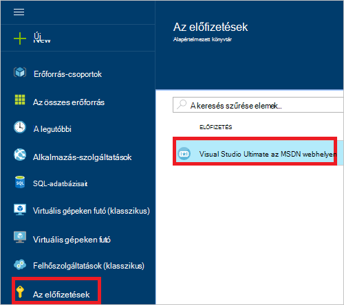
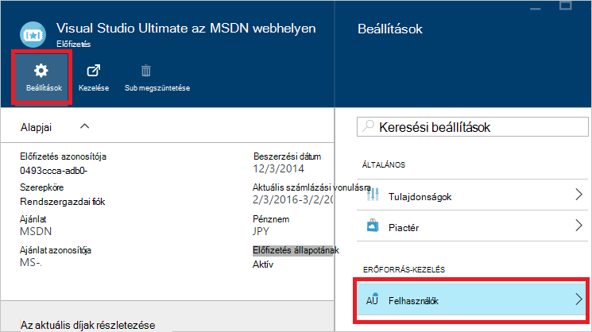
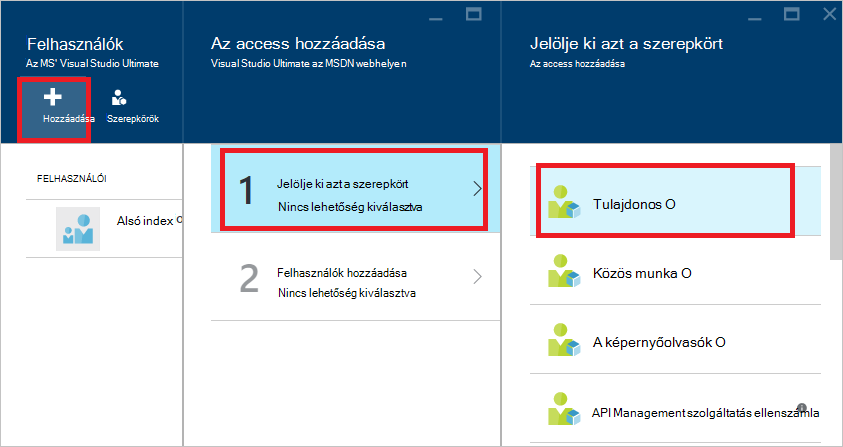
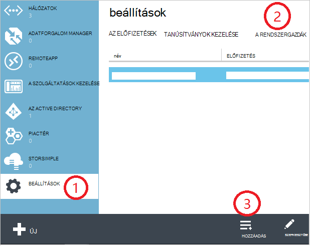
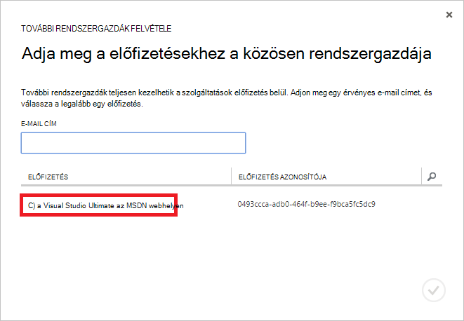
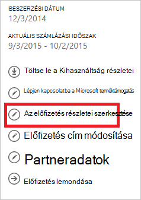
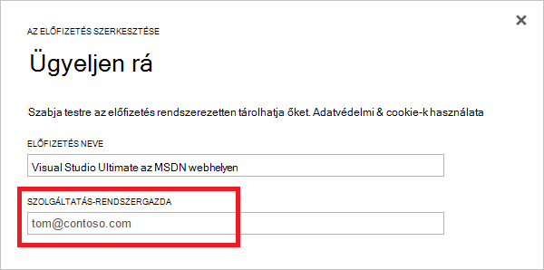

<properties
    pageTitle="Hogyan hozzáadásához vagy módosításához az Azure rendszergazdai szerepkörök |} Microsoft Azure"
    description="Megtudhatja, hogy miként hozzáadásához vagy módosításához az Azure közös rendszergazda, a szolgáltatás rendszergazdája és a fiók rendszergazda"
    services=""
    documentationCenter=""
    authors="genlin"
    manager="mbaldwin"
    editor=""
    tags="billing"/>

<tags
    ms.service="billing"
    ms.workload="na"
    ms.tgt_pltfrm="na"
    ms.devlang="na"
    ms.topic="article"
    ms.date="08/17/2016"
    ms.author="genli"/>

# Hogyan hozzáadásához vagy módosításához az Azure rendszergazdai szerepkörök

Háromféle rendszergazdai szerepkörök Microsoft Azure-ban van:

| Rendszergazdai szerepkör   | Határérték  | Leírás
| ------------- | ------------- |---------------|
|Fiók rendszergazdai (ε)  | 1 / Azure-fiók  |Ez az a személy, aki jelentkezett be az internetről vásároltam Azure előfizetések és a [Fiók Center](https://account.windowsazure.com/Home/Index) és különböző felügyeleti feladatok elvégzéséhez engedéllyel rendelkezik. Ide tartoznak a előfizetések létrehozása, előfizetés lemondása, módosíthatja a számlázási előfizetéshez, valamint a szolgáltatás rendszergazdája lehetőséget.
| Szolgáltatás-rendszergazda (Nyelvű) | Azure előfizetésenként 1  |A szerepkör jogosult az [Azure portál](https://portal.azure.com)szolgáltatások kezelése. Új előfizetéshez alapértelmezés szerint a fiók rendszergazdára is a szolgáltatás rendszergazdája.|
|Az [Azure klasszikus portál](https://manage.windowsazure.com) közös rendszergazda (CA)|200 előfizetésenként| A szerepkör jogosultságai az azonos hozzáférést, a szolgáltatás rendszergazdája, de nem lehet módosítani a társítás előfizetések Azure könyvtárak. |

> [AZURE.NOTE] Azure Active Directory-szerepköralapú hozzáférés vezérlő (RBAC) lehetővé teszi a felhasználóknak vehető fel több szerepkörök. További tudnivalókért olvassa el az [Azure Active Directory szerepköralapú hozzáférés-vezérlés](./active-directory/role-based-access-control-configure.md)című témakört.

> [AZURE.NOTE] Ha bármely pontján Ez a cikk további segítségre van szüksége, kérjük, [Kapcsolatfelvétel az ügyfélszolgálattal](https://portal.azure.com/?#blade/Microsoft_Azure_Support/HelpAndSupportBlade) veheti a probléma megoldódott gyorsan.

## Hogyan lehet hozzáadni a rendszergazda előfizetéshez

**Azure portál**

1. Jelentkezzen be az [Azure-portálon](https://portal.azure.com).

2. A központi menüben jelölje ki azt az **előfizetést** > *az előfizetést, amelyhez a felügyeleti eléréséhez*.

    

3. Az előfizetés a lap, válassza a **Beállítások**> **felhasználók**.

    
4. A felhasználók a lap, válassza a **Hozzáadás**>**Jelölje ki azt a szerepkört** > **tulajdonosa**.

    

    **Megjegyzés:**
    - A tulajdonos szerepkör jogosultságai azonos access közös rendszergazdaként. A szerepkör nem rendelkezik az [Azure-fiók központ](https://account.windowsazure.com/subscriptions)hozzáférési jogosultságot.
    - A tulajdonosok keresztül az [Azure portálon](https://portal.azure.com) felvett nem képes kezelni az [Azure klasszikus portál](https://manage.windowsazure.com)szolgáltatások.  

5. Írja be annak a felhasználónak tulajdonosaként hozzáadni, kattintson arra a felhasználóra, és kattintson a **Jelölje ki**a kívánt e-mail címét.

    

**Azure klasszikus portál**

1. Jelentkezzen be az [Azure klasszikus portálon](https://manage.windowsazure.com/).

2. A navigációs ablakban válassza a **Beállítások**> **rendszergazdák**> **Hozzáadás gombra**.  

    

3. Írja be annak a személynek, vegye fel a közös közé, és válassza ki az előfizetést, amelyhez a közös rendszergazda eléréséhez az e-mail címet. 

     

A következő e-mail cím közös rendszergazdái adhatók hozzá:

* **Microsoft-fiók** (korábban Windows Live ID)  
 Jelentkezzen be a fogyasztói készült Microsoft-termékek összes és a felhőszolgáltatásokba, például az Outlook (Hotmail), a Skype (MSN), a onedrive-on, a Windows Phone és a Xbox LIVE egy Microsoft-Account is használhatja.
* **Szervezeti fiók** 
 Szervezeti fiókkal egy készült Azure Active Directory a fiók. A szervezeti fiók címe a következőhöz hasonló: user@ &lt;tartománya&gt;. onmicrosoft.com

### Korlátozások és korlátozásai

 * Egyes előfizetéshez társítva az Azure Active Directory-címtár (más néven az alapértelmezett könyvtár). Keresse meg az alapértelmezett címtár az előfizetéshez társítva, az [Azure klasszikus portálra](https://manage.windowsazure.com/), és válassza a **Beállítások** > **előfizetések**. Jelölje be az alapértelmezett könyvtár keresése az előfizetés azonosítója.

 * Ha be van jelentkezve a Microsoft-Account, csak felveheti más Microsoft Accounts vagy a felhasználók az alapértelmezett címtáron belül közös rendszergazdaként.

 * Ha egy szervezeti fiókkal jelentkezett be, felveheti a más szervezeti fiókok közös rendszergazdájaként a szervezet. Ha például abby@contoso.com adhat hozzá bob@contoso.com szolgáltatás rendszergazdája vagy közös rendszergazdaként, de nem vehet fel john@notcontoso.com kivéve, ha john@noncontoso.com van a felhasználó a címtárban alapértelmezett. Bejelentkezett a szervezeti fiókok a felhasználók továbbra is vehet fel a Microsoft-Account felhasználókat szolgáltatás rendszergazdája vagy közös rendszergazdaként.

 * Most, hogy ajánlatos szervezeti fiókkal jelentkezzen be az Azure be, az alábbiakban a módosítások szolgáltatás rendszergazdája és a közös rendszergazdai fiók követelmények:

    Bejelentkezési módszer| A Microsoft Account vagy a felhasználókat alapértelmezett címtáron belül adható hozzá hitelesítésszolgáltató vagy rendszergazdai?  |Szervezeti fiók hozzá hitelesítésszolgáltató vagy rendszergazdai szervezete? |Szervezeti fiók felvétele másik szervezet hitelesítésszolgáltató vagy rendszergazdai?
    ------------- | ------------- |---------------|---------------
    Microsoft-fiók |igen|nem|nem
    Szervezeti fiók|igen|igen|nem

## Szolgáltatás-rendszergazda módosítása az előfizetéshez

Csak a fiók rendszergazda módosíthatja a szolgáltatás rendszergazdája előfizetéshez.

1. Jelentkezzen be az [Azure-fiók központ](https://account.windowsazure.com/subscriptions) a fiók rendszergazda használatával.

2. Jelölje ki a módosítani kívánt előfizetést.

3. A jobb oldalon kattintson a részletek **szerkesztése előfizetés** .  

    

4. **Szolgáltatás-rendszergazda** mezőbe írja be az e-mail címet az új szolgáltatás rendszergazdája.  

    

## A fiók rendszergazda módosítása

Az Azure-fiók tulajdonjogának átvitele másik fiókba, lásd: [Az Azure előfizetéssel átvitele tulajdonjogának](billing-subscription-transfer.md).

## Következő lépések

* Ha többet szeretne megtudni, hogyan erőforrás hozzáférés szabályozható a Microsoft Azure-ban, látni [ismeretek erőforrás access Azure-ban](./active-directory/active-directory-understanding-resource-access.md)

* Azure Active Directory hogyan az Azure előfizetés vonatkozik a további tudnivalókért lásd: [hogyan Azure előfizetések társítva Azure Active Directory](./active-directory/active-directory-how-subscriptions-associated-directory.md)

* Azure Active Directory hogyan vonatkozik az Azure előfizetés kapcsolatos további tudnivalókért olvassa el a [rendszergazdai szerepkörök hozzárendelése az Azure Active Directory](./active-directory/active-directory-assign-admin-roles.md) című témakört.

> [AZURE.NOTE] Ha továbbra is további kérdései vannak, kérjük, a [Kapcsolatfelvétel az ügyfélszolgálattal](https://portal.azure.com/?#blade/Microsoft_Azure_Support/HelpAndSupportBlade) veheti a problémát megoldódott gyorsan.
