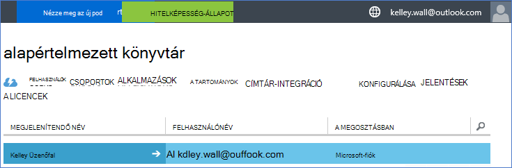
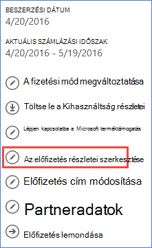

<properties
    pageTitle="Az Office 365-ös bérlői használata Azure szóló előfizetéssel |} Microsoft Azure"
    description="Megtudhatja, hogy miként hozzáadása az Office 365-ben címtár (bérlő esetében), hogy a társítás Azure-előfizetésbe."
    services=""
    documentationCenter=""
    authors="JiangChen79"
    manager="mbaldwin"
    editor=""
    tags="billing,top-support-issue"/>

<tags
    ms.service="billing"
    ms.workload="na"
    ms.tgt_pltfrm="ibiza"
    ms.devlang="na"
    ms.topic="article"
    ms.date="09/16/2016"
    ms.author="cjiang"/>

# Az Office 365-ös bérlői társítása az Azure előfizetéssel
Külön vásárolta meg Azure és az Office 365-előfizetések múltbeli, és most szeretné az Office 365-ös bérlői elérhessék az Azure előfizetésből, ha erre könnyen. Ebből a cikkből megtudhatja, hogyan.

> [AZURE.NOTE] Ez a cikk nem vonatkozik, a nagyvállalati szerződés (EA) ügyfelek.

## Rövid útmutató
Társíthatja az Office 365-ös bérlői Azure-előfizetése, használja az Azure-fiók hozzáadása az Office 365-ös bérlői webhelyen, és kattintson az Azure előfizetés társítása az Office 365-ös bérlői.

## A lépések részletes leírását
Ebben az esetben Kelley fal a fiók csoportjában az Azure előfizetéssel rendelkező felhasználó kelley.wall@outlook.com. Kelley is rendelkezik Office 365-előfizetéssel a fiókon kelley.wall@contoso.onmicrosoft.com. Most már Kelley szeretne férni az Office 365-ös bérlői webhelye az Azure előfizetés.

### Előfeltételek
A társítási csak akkor működik helyesen az alábbi előfeltételek szükség:

- Szüksége van a szolgáltatás rendszergazdája az Azure előfizetés hitelesítő adatait. További rendszergazdák nem hajtható végre a lépéseket egy részét.
- Szüksége van az Office 365-bérlőből egy globális rendszergazdai hitelesítő adatait.
- A szolgáltatás-rendszergazda: e-mail címe nem tartalmaznia kell az Office 365-ös bérlői webhelyet.
- A szolgáltatás-rendszergazda: e-mail címe nem egyeznie kell az Office 365-ös bérlői globális rendszergazdái.
- Ha jelenleg a Microsoft-fiók és egy szervezeti fiók e-mail címre használ, ideiglenes módosítása a szolgáltatás-rendszergazda az Azure előfizetése egy másik Microsoft-fiók. A [Microsoft-fiók regisztrációs lapján](https://signup.live.com/)is létrehozhat új Microsoft-fiókkal.

Ha módosítani szeretné a szolgáltatás rendszergazdája, tegye a következőket:

1. Jelentkezzen be a [fiók kezelőportálja segítségével](https://account.windowsazure.com/subscriptions).
2. Jelölje ki a módosítani kívánt előfizetést.
3. Válassza a **Szerkesztés az előfizetés részletei**.

    

4. **Szolgáltatás-rendszergazda** mezőbe írja be az új szolgáltatás-rendszergazda annak az e-mail címét.

    

### Az Office 365-ös bérlői társítása az Azure előfizetés
Az Office 365-ös bérlői társíthatja az Azure előfizetéshez, kövesse az alábbi lépéseket:

1.  Jelentkezzen be a [fiók kezelőportálja](https://account.windowsazure.com/subscriptions) szolgáltatás rendszergazdai hitelesítő adataival.
2.  A bal oldali ablaktáblában jelölje ki az **ACTIVE DIRECTORY**.

    

    > [AZURE.NOTE] Az Office 365-ös bérlői nem láthatók. Ha azt látja, ugorja át a következő lépéssel.

    

3. Az Office 365-ös bérlői hozzáadása az Azure előfizetéshez.

    egy. Válassza az **Új** > **KÖNYVTÁRAT** > **egyéni létrehozása**.

    

    b. **Hozzáadás könyvtárat** lapon **KÖNYVTÁRAT**csoportban jelölje ki a **meglévő könyvtár használata**. **Az aláírandó most már készen is állok**válasszon, majd válassza a **teljes** .

    

    c billentyűkombinációt. Miután kijelentkezett, a globális rendszergazdai hitelesítő adataival jelentkezzen be az Office 365-bérlőjére vonatkozó.

    

    d. Jelölje ki, hogy **továbbra is**.

    

    e. Válassza a **Kijelentkezés gombra**.

    

    f. Jelentkezzen be a [fiók kezelőportálja](https://account.windowsazure.com/subscriptions) szolgáltatás rendszergazdai hitelesítő adataival.

    

    g. Ekkor megjelennek az Office 365-ös bérlői webhelyen az irányítópult.

    

4. A könyvtár az Azure-előfizetéséhez társított módosítása.

    egy. Válassza a **Beállítások**.

    

    b. Jelölje ki az Azure-előfizetése, és válassza a **SZERKESZTÉS CÍMTÁR**.
    

    c billentyűkombinációt. Jelölje be a **következő** .

    

    > [AZURE.WARNING] Minden további rendszergazdák törlődni fognak figyelmeztető üzenetet kap.

    

    >[AZURE.WARNING] Emellett a meglévő erőforrás-csoportok a hozzárendelt hozzáféréssel rendelkező összes [szerepköralapú hozzáférés szerepalapú](./active-directory/role-based-access-control-configure.md) felhasználók is törlődnek. A figyelmeztetést kap csak az eltávolítás, további rendszergazdák az Említések.

    

    d. Válassza a **teljes** .

5. Most már vehet az Office 365-ös szervezeti fiókok, további rendszergazdák az Azure Active Directory-ös bérlői webhelyet.

    egy. Válassza a **RENDSZERGAZDÁK** fület, és válassza a **hozzáadni**.

    

    b. Írja be az Office 365-ös bérlői a szervezeti fiókkal, jelölje ki azt az Azure előfizetést, és válassza ki a **teljes** .

    

    c billentyűkombinációt. Térjen vissza a **RENDSZERGAZDÁK** lapra. Meg kell jelennie a szervezeti fiók közös rendszergazdaként jelenik meg.

    

6. Az access következő tesztelheti a közös rendszergazdájával.

    egy. Jelentkezzen ki a fiók kezelőportálja segítségével.

    b. Nyissa meg a [fiók felügyeleti portál](https://account.windowsazure.com/subscriptions) vagy az [Azure-portálon](https://portal.azure.com/).

    c billentyűkombinációt. Ha az Azure bejelentkezési lapján, **Jelentkezzen be a szervezeti fiókjával**hivatkozást tartalmaz, jelölje ki a hivatkozást. Egyéb esetben ugorja át ezt a lépést.

    

    d. Írja be a közös rendszergazdai hitelesítő adatait, és válassza a **Bejelentkezés**gombra.

    

## Következő lépések
Kapcsolódó esetek:

- Már rendelkezik Office 365-előfizetést, és készen áll az Azure előfizetéssel, de a meglévő Office 365 felhasználói fiókok használata Azure előfizetéshez tartozó szeretne.
- Az Azure előfizetői, és szeretné, hogy a felhasználók az Office 365-előfizetéssel a meglévő Azure Active Directory-példány.

Megtudhatja, hogy miként elvégezheti az alábbi műveleteket, olvassa el a [meglévő Office 365-ös számla, az Azure-előfizetéséhez, vagy fordítva használata](billing-use-existing-office-365-account-azure-subscription.md)című témakört.
