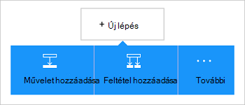

<properties
    pageTitle="Az Azure blob-tárolóhoz összekötő beszúrása az összefüggés-alkalmazások |} Microsoft Azure"
    description="Azure blob-tárolóhoz összekötő REST API-paraméterekkel áttekintése"
    services=""
    documentationCenter="" 
    authors="MandiOhlinger"
    manager="anneta"
    editor=""
    tags="connectors"/>

<tags
   ms.service="logic-apps"
   ms.devlang="na"
   ms.topic="article"
   ms.tgt_pltfrm="na"
   ms.workload="integration" 
   ms.date="10/18/2016"
   ms.author="mandia"/>

# Első lépések az Azure blob-tároló összekötő
Azure Blob-tárolóhoz olyan szolgáltatás, a nagy mennyiségű adatot strukturálatlan tárolásához. Végezze el a különféle műveletek, például a feltöltés, frissítés, beszerzése és Azure blob-tárolóban lévő BLOB törlése. 

Az Azure blob-tárolóhoz akkor:

- Hozza létre a munkafolyamat úgy, hogy az új projektek feltöltése vagy fájlok nemrég frissített első.
- Fájl metaadatait juthat, törölje a fájl, fájlok másolása és az egyéb műveletek használata Például frissítésekor eszköz Azure webhely (az eseményindító), majd frissítse blob-tárolóhoz (művelet) fájl. 

Ez a témakör bemutatja, hogyan használja az blob-tároló összekötő összefüggés-alkalmazásban, és műveletek is láthatók.

>[AZURE.NOTE] Ez a cikk verziójának logika alkalmazások általános elérhetőség (kiadás) vonatkozik. 

Ha többet szeretne megtudni a logika alkalmazások, [Mik azok a logika alkalmazások](../app-service-logic/app-service-logic-what-are-logic-apps.md) és megtekintése [összefüggés-alkalmazás létrehozása](../app-service-logic/app-service-logic-create-a-logic-app.md)

## Csatlakozás Azure blobtárolóhoz

Mielőtt a logika alkalmazás elérhető valamelyik szolgáltatás először hoz létre *kapcsolatot* a szolgáltatás. Kapcsolat a összefüggés-at, és egy másik szolgáltatás közötti kapcsolatot biztosít. Például fiókhoz való csatlakozáshoz a tárhely, először hoz létre blob tároló *kapcsolat*. Kapcsolat létrehozása általában a szolgáltatás csatlakozik eléréséhez használt hitelesítő adatok megadása Így Azure adathordozós adja meg a hitelesítő adatokat a kapcsolat létrehozása a tárterület-fiókjába. 

#### A kapcsolat létrehozása

>[AZURE.INCLUDE [Create a connection to Azure blob storage](../../includes/connectors-create-api-azureblobstorage.md)]
 
## Az eseményindító használata

Ez az összekötő nincsenek olyan indítók. Más indítók segítségével indítsa el a logika alkalmazást, például az ismétlődés az eseményindító, HTTP Webhook eseménykód, indítók más összekötők, és sok más érhető el. [Egy logikai-alkalmazás létrehozása](../app-service-logic/app-service-logic-create-a-logic-app.md) egy példát tartalmaz.

## Művelet használata
    
Művelet egy olyan művelet, a munkafolyamat egy logikai alkalmazásban definiált által végzett.

1. Jelölje ki a pluszjelre. Számos beállítást látni: **művelet hozzáadása**, **a megadott feltétel hozzáadása**vagy a **További** lehetőségek közül.

    

2. Válassza az **Add művelet**.

3. A szöveg mezőbe írja be a "blob", hogy az elérhető műveletek listájának.

     

4. Ebben a példában válassza a **AzureBlob - első metaadatok fájl elérési útját**. Ha már létezik kapcsolat, akkor jelölje be a **…** Jelölje ki a fájlt (megjelenítés kiválasztása) gombra.

    

    Ha a kapcsolat adatait kéri, írja be a részletek, a kapcsolat létrehozása. [A kapcsolat létrehozása](connectors-create-api-azureblobstorage.md#create-the-connection) a jelen témakör következő tulajdonságokat ismerteti. 

    > [AZURE.NOTE] Ebben a példában a metaadatok fájl első azt. A metaadatok megtekintéséhez adja hozzá a másik művelet, amelyet a létrehoz egy új fájlt egy másik connector használatakor. Például, hogy létrehoz egy új, a metaadat-alapú alapján "tesztelése" fájlt a OneDrive művelet hozzáadása. 

5. **Mentse** a módosításokat (bal felső sarkában az eszköztár). A logikai alkalmazás menti, és előfordulhat, hogy lesz automatikusan engedélyezett.

> [AZURE.TIP] Több tárhely fiók kezelése kiváló eszköz a [Tárhely Explorer](http://storageexplorer.com/) .

## Műszaki információk

## Tárterület Blob-műveletek

|Művelet|Leírás|
|--- | ---|
|[Fájl metaadatait beszerzése](connectors-create-api-azureblobstorage.md#get-file-metadata)|Ezt a műveletet a fájl azonosítójával fájl metaadatait kap.|
|[Fájl frissítése](connectors-create-api-azureblobstorage.md#update-file)|Ez a művelet frissíti egy fájlt.|
|[Fájl törlése](connectors-create-api-azureblobstorage.md#delete-file)|Ez a művelet töröl egy fájlt.|
|[Ismerkedés a metaadatok fájl elérési útja](connectors-create-api-azureblobstorage.md#get-file-metadata-using-path)|Ez a művelet az elérési út segítségével fájl metaadatait kap.|
|[Get-fájl tartalmának elérési út segítségével](connectors-create-api-azureblobstorage.md#get-file-content-using-path)|Ezt a műveletet a fájl tartalmát, az elérési út segítségével kap.|
|[Fájl tartalom beszerzése](connectors-create-api-azureblobstorage.md#get-file-content)|Ez a művelet azonosítójával tartalmában kap.|
|[Fájl létrehozása](connectors-create-api-azureblobstorage.md#create-file)|Ez a művelet feltölt egy fájlt.|
|[Fájl másolása](connectors-create-api-azureblobstorage.md#copy-file)|Ez a művelet Azure Blob-tárolóhoz másolja át egy fájlt.|
|[Bontsa ki az archiválási mappába](connectors-create-api-azureblobstorage.md#extract-archive-to-folder)|Ez a művelet kibontja az archív mappák mappába (Példa: .zip).|

### Művelet részletei

Ebben a részben lásd: az egyes műveletek, például minden olyan kötelező és választható bemeneti tulajdonságainak és bármely megfelelő eredményt ad, az összekötő társított pontos részleteket.

#### Fájl metaadatait beszerzése
Ez a művelet megkapja a fájl metaadatait fájl azonosítójával.  

|Tulajdonság neve| Megjelenítendő név|Leírás|
| ---|---|---|
|azonosító *|Fájl|Jelölje ki a fájlt|

Csillag (*) azt jelzi, hogy a tulajdonság szükség.

##### Kimeneti részletei
BlobMetadata

| Tulajdonság neve | Adattípus |
|---|---|
|Azonosító|karakterlánc|
|név|karakterlánc|
|DisplayName|karakterlánc|
|Elérési út|karakterlánc|
|Módosítás dátuma|karakterlánc|
|Mérete|egész szám|
|MediaType|karakterlánc|
|IsFolder|logikai érték|
|ETag|karakterlánc|
|FileLocator|karakterlánc|

#### Fájl frissítése
Ez a művelet frissíti egy fájlt.  

|Tulajdonság neve| Megjelenítendő név|Leírás|
| ---|---|---|
|azonosító *|Fájl|Jelölje ki a fájlt|
|szervezet *|Fájl tartalma|Frissítheti a fájl tartalmát|

Csillag (*) azt jelzi, hogy a tulajdonság szükség.

##### Kimeneti részletei
BlobMetadata

| Tulajdonság neve | Adattípus |
|---|---|
|Azonosító|karakterlánc|
|név|karakterlánc|
|DisplayName|karakterlánc|
|Elérési út|karakterlánc|
|Módosítás dátuma|karakterlánc|
|Mérete|egész szám|
|MediaType|karakterlánc|
|IsFolder|logikai érték|
|ETag|karakterlánc|
|FileLocator|karakterlánc|

#### Fájl törlése
Ez a művelet töröl egy fájlt.  

|Tulajdonság neve| Megjelenítendő név|Leírás|
| ---|---|---|
|azonosító *|Fájl|Jelölje ki a fájlt|

Csillag (*) azt jelzi, hogy a tulajdonság szükség.

##### Kimeneti részletei
Nincs lehetőség.

#### Ismerkedés a metaadatok fájl elérési útja
Ez a művelet az elérési út segítségével fájl metaadatait kap.  

|Tulajdonság neve| Megjelenítendő név|Leírás|
| ---|---|---|
|elérési út *|Fájl elérési útja|Jelölje ki a fájlt|

Csillag (*) azt jelzi, hogy a tulajdonság szükség.

##### Kimeneti részletei
BlobMetadata

| Tulajdonság neve | Adattípus |
|---|---|
|Azonosító|karakterlánc|
|név|karakterlánc|
|DisplayName|karakterlánc|
|Elérési út|karakterlánc|
|Módosítás dátuma|karakterlánc|
|Mérete|egész szám|
|MediaType|karakterlánc|
|IsFolder|logikai érték|
|ETag|karakterlánc|
|FileLocator|karakterlánc|

#### Get-fájl tartalmának elérési út segítségével
Ezt a műveletet a fájl tartalmát, az elérési út segítségével kap.  

|Tulajdonság neve| Megjelenítendő név|Leírás|
| ---|---|---|
|elérési út *|Fájl elérési útja|Jelölje ki a fájlt|

Csillag (*) azt jelzi, hogy a tulajdonság szükség.

##### Kimeneti részletei
Nincs lehetőség.

#### Fájl tartalom beszerzése
Ez a művelet azonosítójával tartalmában kap.  

|Tulajdonság neve| Adattípus|Leírás|
| ---|---|---|
|azonosító *|karakterlánc|Jelölje ki a fájlt|

Csillag (*) azt jelzi, hogy a tulajdonság szükség.

##### Kimeneti részletei
Nincs lehetőség.

#### Fájl létrehozása
Ez a művelet feltölt egy fájlt.  

|Tulajdonság neve| Megjelenítendő név|Leírás|
| ---|---|---|
|Mappa_útvonala *|Mappa elérési útja|Jelölje ki azt a mappát|
|név *|Fájlnév|A fájl feltöltése neve|
|szervezet *|Fájl tartalma|Tartalom-fájl feltöltése|

Csillag (*) azt jelzi, hogy a tulajdonság szükség.

##### Kimeneti részletei
BlobMetadata

| Tulajdonság neve | Adattípus | 
|---|---|
|Azonosító|karakterlánc|
|név|karakterlánc|
|DisplayName|karakterlánc|
|Elérési út|karakterlánc|
|Módosítás dátuma|karakterlánc|
|Mérete|egész szám|
|MediaType|karakterlánc|
|IsFolder|logikai érték|
|ETag|karakterlánc|
|FileLocator|karakterlánc|

#### Fájl másolása
Ez a művelet Azure Blob-tárolóhoz másolja át egy fájlt.  

|Tulajdonság neve| Megjelenítendő név|Leírás|
| ---|---|---|
|forrás *|Forrás URL-címe|Forrásfájl URL-címének megadása|
|cél *|Cél fájl elérési útja|Adja meg a cél elérési útja, beleértve a célfájl neve|
|felülírása|Felülírja?|Egy meglévő célfájl felülírható (IGAZ vagy hamis)?  |

Csillag (*) azt jelzi, hogy a tulajdonság szükség.

##### Kimeneti részletei
BlobMetadata

| Tulajdonság neve | Adattípus |
|---|---|
|Azonosító|karakterlánc|
|név|karakterlánc|
|DisplayName|karakterlánc|
|Elérési út|karakterlánc|
|Módosítás dátuma|karakterlánc|
|Mérete|egész szám|
|MediaType|karakterlánc|
|IsFolder|logikai érték|
|ETag|karakterlánc|
|FileLocator|karakterlánc|

#### Bontsa ki az archiválási mappába
Ez a művelet kibontja az archív mappák mappába (Példa: .zip).  

|Tulajdonság neve| Megjelenítendő név|Leírás|
| ---|---|---|
|forrás *|Forrás archív fájl elérési útja|Jelölje ki az archív mappák|
|cél *|Cél mappa elérési útja|Jelölje ki a tartalmat kibontásához|
|felülírása|Felülírja?|Egy meglévő célfájl felülírható (IGAZ vagy hamis)?|

Csillag (*) azt jelzi, hogy a tulajdonság szükség.

##### Kimeneti részletei
BlobMetadata

| Tulajdonság neve | Adattípus |
|---|---|
|Azonosító|karakterlánc|
|név|karakterlánc|
|DisplayName|karakterlánc|
|Elérési út|karakterlánc|
|Módosítás dátuma|karakterlánc|
|Mérete|egész szám|
|MediaType|karakterlánc|
|IsFolder|logikai érték|
|ETag|karakterlánc|
|FileLocator|karakterlánc|

## HTTP-válaszok

Ha a hívások átirányítása a különböző műveletek elvégzése adott válaszok jelenhetnek meg. Az alábbi táblázat ismerteti a válaszokat és azok leírását:  

|név|Leírás|
|---|---|
|200|oké|
|202|Elfogadott|
|400|Hibás kérés|
|401|Ezzel az illetéktelen|
|403|Tiltott|
|404|Nem található|
|500|Belső kiszolgálóhiba. Ismeretlen hiba|
|alapértelmezett|A művelet sikertelen volt.|

## Következő lépések

[Egy logikai-alkalmazás létrehozása](../app-service-logic/app-service-logic-create-a-logic-app.md). Ismerkedjen meg az [API-khoz listában](apis-list.md)a összefüggés-alkalmazások más elérhető összekötők.

