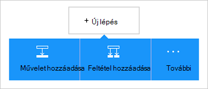

<properties
    pageTitle="A Dynamics CRM Online-összekötő hozzáadása az összefüggés-alkalmazások |} Microsoft Azure"
    description="Logika alkalmazások Azure alkalmazás szolgáltatás hozzon létre. A Dynamics CRM Online kapcsolat szolgáltatója dolgozhatnak személyekkel Dynamics CRM Online-API-t tartalmaz."
    services="logic-apps"    
    documentationCenter=""     
    authors="MandiOhlinger"    
    manager="erikre"    
    editor="" 
    tags="connectors" />

<tags
ms.service="logic-apps"
ms.devlang="na"
ms.topic="article"
ms.tgt_pltfrm="na"
ms.workload="integration"
ms.date="08/15/2016"
ms.author="mandia"/>

# Első lépések a Dynamics CRM Online-összekötő
Csatlakozás a Dynamics CRM Online új rekord létrehozása, frissítése egy elemet, és így tovább. A CRM Online-ban a következőkre van lehetősége:

- Hozza létre az üzleti folyamat, letölthető CRM Online adatok alapján. 
- Egy rekord törléséhez használja műveleteket első szervezetek, és így tovább. Az alábbi műveletek kap választ, és végezze el a kimenet rendelkezésre álló további lehetőségeket. Például elem CRM frissítése az Office 365 e-mail küldhet.

Ez a témakör bemutatja, hogyan használja a Dynamics CRM Online-összekötő összefüggés-alkalmazásban, és is megjeleníti a eseményindítók és a műveletek.

>[AZURE.NOTE] Ez a cikk verziójának logika alkalmazások általános elérhetőség (kiadás) vonatkozik.

Ha többet szeretne megtudni a logika alkalmazások, [Mik azok a logika alkalmazások](../app-service-logic/app-service-logic-what-are-logic-apps.md) és megtekintése [összefüggés-alkalmazás létrehozása](../app-service-logic/app-service-logic-create-a-logic-app.md)

## Csatlakozás a Dynamics CRM Online

Mielőtt a logika alkalmazás elérhető valamelyik szolgáltatás először hoz létre *kapcsolatot* a szolgáltatás. Kapcsolat a összefüggés-at, és egy másik szolgáltatás közötti kapcsolatot biztosít. Ha például Dynamics szeretne csatlakozni, először a Dynamics CRM Online *kapcsolat*. Kapcsolat létrehozása általában a szolgáltatást, amelyhez csatlakozni szeretne eléréséhez használt hitelesítő adatok megadása Így a Dynamics, adja meg a hitelesítő adatokat a kapcsolat létrehozása a Dynamics CRM Online fiókjába.

### A kapcsolat létrehozása

>[AZURE.INCLUDE [Steps to create a connection to Dynamics CRM Online Connection Provider](../../includes/connectors-create-api-crmonline.md)]

## Az eseményindító használata

Az eseményindító az eseményre kattintva elindíthatja a munkafolyamatot egy logikai alkalmazásban definiált használható. Eseményindítók "lekérdezik" a szolgáltatás-intervallum és a gyakoriság, amelyet. [További tudnivalók a indítók](../app-service-logic/app-service-logic-what-are-logic-apps.md#logic-app-concepts).

1. Írja be a logika alkalmazást, a "dynamics" szeretne lista beszerzése az eseményindító:  

    

2. Jelölje ki a **Dynamics CRM Online - rekord létrehozásakor**. Ha egy kapcsolat már létezik, válassza a egy szervezet és a szervezet a legördülő listából.

    

    Ha jelentkezzen be a program kéri, írja be a bejelentkezési adatokat a kapcsolat létrehozása. [A kapcsolat létrehozása](connectors-create-api-crmonline.md#create-the-connection) az Ez a témakör felsorolja azokat a lépéseket. 

    > [AZURE.NOTE] Ebben a példában a logika alkalmazást futtatja a rekord létrehozásakor. Ez az eseményindító eredményének megtekintéséhez adja hozzá a másik műveletet, amely e-mailben értesítést küld Önnek. Például vegye fel az Office 365-ben, *küldjön e-mailt* művelet, amelyet a az e-maileket, amikor az új rekord felvétele megtörténik. 

3. Kattintson a **Szerkesztés** gombra, és adja meg a **gyakoriság** és **intervallum** értéket. Például ha azt szeretné, hogy az eseményindító lekérdezik 15 percenként, majd adja a **gyakoriság** **perccé**, és **15** **intervallum** beállítása. 

    

4. **Mentse** a módosításokat (bal felső sarkában az eszköztár). A logikai alkalmazás menti, és előfordulhat, hogy lesz automatikusan engedélyezett.

## Művelet használata

Művelet egy olyan művelet, a munkafolyamat egy logikai alkalmazásban definiált által végzett. [További tudnivalók a műveletek](../app-service-logic/app-service-logic-what-are-logic-apps.md#logic-app-concepts).

1. Jelölje ki a pluszjelre. Számos beállítást látni: **művelet hozzáadása**, **a megadott feltétel hozzáadása**vagy a **További** lehetőségek közül.

    

2. Válassza az **Add művelet**.

3. A szöveg mezőbe írja be a "dynamics" az összes rendelkezésre álló műveletek listájának.

    

4. Ebben a példában válassza a **Dynamics CRM Online - rekordok frissítését**. Ha egy kapcsolat már létezik, válassza a **Szervezet neve**, **Személy neve**és más tulajdonságait:  

    

    Ha a kapcsolat adatait kéri, írja be a részletek, a kapcsolat létrehozása. [A kapcsolat létrehozása](connectors-create-api-crmonline.md#create-the-connection) a jelen témakör következő tulajdonságokat ismerteti. 

    > [AZURE.NOTE] Ebben a példában, frissítjük a CRM Online-ban egy meglévő rekord. Egy másik eseményindító kimenetét segítségével frissítse a rekordot. Ha például hozzáadása a SharePoint *meglévő elemének módosításakor* az eseményindító. Akkor adja hozzá a *rekordok frissítését* CRM Online művelet a meglévő rekord CRM Online módosítása a SharePoint mezők használó. 

5. **Mentse** a módosításokat (bal felső sarkában az eszköztár). A logikai alkalmazás menti, és előfordulhat, hogy lesz automatikusan engedélyezett.

## Műszaki információk

## Eseményindítók

|Eseményindító | Leírás|
|--- | ---|
|[Ha egy rekord létrehozása](connectors-create-api-crmonline.md#when-a-record-is-created)|Egy objektum CRM létrehozásakor elindítja a folyamat.|
|[Ha egy rekord frissítése](connectors-create-api-crmonline.md#when-a-record-is-updated)|Egy folyamat elindítja a CRM objektum módosításakor.|
|[Ha egy rekord törlése](connectors-create-api-crmonline.md#when-a-record-is-deleted)|Objektum CRM törlésekor elindítja a folyamat.|

## Műveletek

|Művelet|Leírás|
|--- | ---|
|[Listán szereplő bejegyzések](connectors-create-api-crmonline.md#list-records)|Ez a művelet a rekordok entitás kap.|
|[Új rekord létrehozása](connectors-create-api-crmonline.md#create-a-new-record)|Ez a művelet új rekordot hoz létre egy egyed.|
|[Rekord beolvasása](connectors-create-api-crmonline.md#get-record)|Ez a művelet a megadott rekord entitás kap.|
|[Rekord törlése](connectors-create-api-crmonline.md#delete-a-record)|Ez a művelet a rekord törlése egy egyed gyűjteményből.|
|[Rekordok frissítését](connectors-create-api-crmonline.md#update-a-record)|Ez a művelet frissíti egy meglévő rekord entitás.|

### Eseményindító és a művelet részletei

Ebben a szakaszban látható minden eseményindító és a művelet, beleértve minden szükséges vagy választható bemeneti tulajdonságainak és bármely megfelelő eredményt ad, az összekötő társított pontos részleteket.

#### Ha egy rekord létrehozása
Egy objektum CRM létrehozásakor elindítja a folyamat. 

|Tulajdonság neve| Megjelenítendő név|Leírás|
| ---|---|---|
|adatkészlet *|Szervezet neve|Például a Contoso CRM szervezet neve|
|táblázat *|Szervezet neve|A személy neve|
|$skip|Kihagyott elemek száma|Kihagyása bejegyzéseinek száma (alapértelmezett = 0)|
|$top|Get maximális száma|Az első bejegyzések maximális száma (alapértelmezett = 256)|
|$filter|Szűrő lekérdezések|Egy ODATA szűrő lekérdezést a visszaküldött tételek korlátozása|
|$orderby|Rendezési szempont|Az ODATA orderBy lekérdezés bejegyzések sorrendjének megadása|

Csillag (*) azt jelzi, hogy a tulajdonság szükség.

##### Kimeneti részletei
ItemsList

| Tulajdonság neve | Adattípus |
|---|---|
|érték|tömb|

#### Ha egy rekord frissítése
Egy folyamat elindítja a CRM objektum módosításakor. 

|Tulajdonság neve| Megjelenítendő név|Leírás|
| ---|---|---|
|adatkészlet *|Szervezet neve|Például a Contoso CRM szervezet neve|
|táblázat *|Szervezet neve|A személy neve|
|$skip|Kihagyott elemek száma|Kihagyása bejegyzéseinek száma (alapértelmezett = 0)|
|$top|Get maximális száma|Az első bejegyzések maximális száma (alapértelmezett = 256)|
|$filter|Szűrő lekérdezések|Egy ODATA szűrő lekérdezést a visszaküldött tételek korlátozása|
|$orderby|Rendezési szempont|Az ODATA orderBy lekérdezés bejegyzések sorrendjének megadása|

Csillag (*) azt jelzi, hogy a tulajdonság szükség.

##### Kimeneti részletei
ItemsList

| Tulajdonság neve | Adattípus |
|---|---|
|érték|tömb|

#### Ha egy rekord törlése
Objektum CRM törlésekor elindítja a folyamat. 

|Tulajdonság neve| Megjelenítendő név|Leírás|
| ---|---|---|
|adatkészlet *|Szervezet neve|Például a Contoso CRM szervezet neve|
|táblázat *|Szervezet neve|A személy neve|
|$skip|Kihagyott elemek száma|Kihagyása bejegyzéseinek száma (alapértelmezett = 0)|
|$top|Get maximális száma|Az első bejegyzések maximális száma (alapértelmezett = 256)|
|$filter|Szűrő lekérdezések|Egy ODATA szűrő lekérdezést a visszaküldött tételek korlátozása|
|$orderby|Rendezési szempont|Az ODATA orderBy lekérdezés bejegyzések sorrendjének megadása|

Csillag (*) azt jelzi, hogy a tulajdonság szükség.

##### Kimeneti részletei
ItemsList

| Tulajdonság neve | Adattípus |
|---|---|
|érték|tömb|

#### Listán szereplő bejegyzések
Ez a művelet a rekordok entitás kap. 

|Tulajdonság neve| Megjelenítendő név|Leírás|
| ---|---|---|
|adatkészlet *|Szervezet neve|Például a Contoso CRM szervezet neve|
|táblázat *|Szervezet neve|A személy neve|
|$skip|Kihagyott elemek száma|Kihagyása bejegyzéseinek száma (alapértelmezett = 0)|
|$top|Get maximális száma|Az első bejegyzések maximális száma (alapértelmezett = 256)|
|$filter|Szűrő lekérdezések|Egy ODATA szűrő lekérdezést a visszaküldött tételek korlátozása|
|$orderby|Rendezési szempont|Az ODATA orderBy lekérdezés bejegyzések sorrendjének megadása|

Csillag (*) azt jelzi, hogy a tulajdonság szükség.

##### Kimeneti részletei
ItemsList

| Tulajdonság neve | Adattípus |
|---|---|
|érték|tömb|

#### Új rekord létrehozása
Ez a művelet új rekordot hoz létre egy egyed. 

|Tulajdonság neve| Megjelenítendő név|Leírás|
| ---|---|---|
|adatkészlet *|Szervezet neve|Például a Contoso CRM szervezet neve|
|táblázat *|Szervezet neve|A személy neve|

Csillag (*) azt jelzi, hogy a tulajdonság szükség.

##### Kimeneti részletei
Nincs lehetőség.

#### Rekord beolvasása
Ez a művelet a megadott rekord entitás kap. 

|Tulajdonság neve| Megjelenítendő név|Leírás|
| ---|---|---|
|adatkészlet *|Szervezet neve|Például a Contoso CRM szervezet neve|
|táblázat *|Szervezet neve|A személy neve|
|azonosító *|Elem azonosítója|Adja meg a bejegyzés azonosítója|

Csillag (*) azt jelzi, hogy a tulajdonság szükség.

##### Kimeneti részletei
Nincs lehetőség.

#### Rekord törlése
Ez a művelet a rekord törlése egy egyed gyűjteményből. 

|Tulajdonság neve| Megjelenítendő név|Leírás|
| ---|---|---|
|adatkészlet *|Szervezet neve|Például a Contoso CRM szervezet neve|
|táblázat *|Szervezet neve|A személy neve|
|azonosító *|Elem azonosítója|Adja meg a bejegyzés azonosítója|

Csillag (*) azt jelzi, hogy a tulajdonság szükség.

#### Rekordok frissítését
Ez a művelet frissíti egy meglévő rekord entitás. 

|Tulajdonság neve| Megjelenítendő név|Leírás|
| ---|---|---|
|adatkészlet *|Szervezet neve|Például a Contoso CRM szervezet neve|
|táblázat *|Szervezet neve|A személy neve|
|azonosító *|Rekord azonosító|Adja meg a bejegyzés azonosítója|

Csillag (*) azt jelzi, hogy a tulajdonság szükség.

##### Kimeneti részletei
Nincs lehetőség.

## HTTP-válaszok

A műveletek és indítók végre az alábbi HTTP állapot kódokat a térhet vissza: 

|név|Leírás|
|---|---|
|200|oké|
|202|Elfogadott|
|400|Hibás kérés|
|401|Ezzel az illetéktelen|
|403|Tiltott|
|404|Nem található|
|500|Belső kiszolgálóhiba. Ismeretlen hiba történt.|
|alapértelmezett|A művelet sikertelen volt.|

## Következő lépések

[Egy logikai-alkalmazás létrehozása](../app-service-logic/app-service-logic-create-a-logic-app.md). Ismerkedjen meg az [API-khoz listában](apis-list.md)a összefüggés-alkalmazások más elérhető összekötők.

