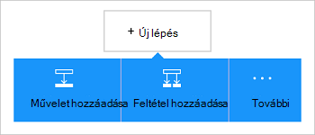

<properties
    pageTitle="Logika alkalmazás felvétele az Office 365 Outlook connector |} Microsoft Azure"
    description="Az Office 365-összekötő ahhoz, hogy az Office 365-tel kapcsolati összefüggés-alkalmazások létrehozása. Példa: létrehozása, szerkesztése és frissítése a névjegyek és naptárelemek."
    services=""    
    documentationCenter=""     
    authors="MandiOhlinger"    
    manager="anneta"    
    editor="" 
    tags="connectors" />

<tags
ms.service="logic-apps"
ms.devlang="na"
ms.topic="article"
ms.tgt_pltfrm="na"
ms.workload="integration"
ms.date="10/18/2016"
ms.author="mandia"/>

# Az Office 365 Outlook connector – első lépések 

Az Office 365 Outlook connector lehetővé teszi, hogy az Outlook, az Office 365-ben való interakció. Ez az összekötő segítségével létrehozása, szerkesztése és frissítése a névjegyek és naptárelemek, és is megnyithatja, küldése és e-mailek megválaszolása.

Az Office 365 Outlook akkor:

- A munkafolyamat funkcióival a levelezés és naptár használata az Office 365 összeállítása. 
- Indítók segítségével a munkafolyamat indítása, ha egy új e-mailt, naptárelem frissítésekor és az egyéb.
- Műveletek segítségével küldjön e-mailt, hozzon létre egy új naptáresemény, és így tovább. Ha például egy új objektum van (az eseményindító) Salesforce, amikor e-mail küldése az Office 365 Outlook (művelet). 

Ez a témakör bemutatja, hogyan használhatja az Office 365 Outlook connector összefüggés-alkalmazásban, és eseményindítók és műveletek is sorolja fel.

>[AZURE.NOTE] Ez a cikk verziójának logika alkalmazások általános elérhetőség (kiadás) vonatkozik.

Ha többet szeretne megtudni a logika alkalmazások, [Mik azok a logika alkalmazások](../app-service-logic/app-service-logic-what-are-logic-apps.md) és megtekintése [összefüggés-alkalmazás létrehozása](../app-service-logic/app-service-logic-create-a-logic-app.md)

## Az Office 365 csatlakoztatása

Mielőtt a logika alkalmazás elérhető valamelyik szolgáltatás először hoz létre *kapcsolatot* a szolgáltatás. Kapcsolat a összefüggés-at, és egy másik szolgáltatás közötti kapcsolatot biztosít. Ha például szeretne csatlakozni az Office 365 Outlook, először az Office 365- *kapcsolat*. Kapcsolat létrehozása általában a szolgáltatást, amelyhez csatlakozni szeretne eléréséhez használt hitelesítő adatok megadása Ezt az Office 365 Outlook, adja meg a hitelesítő adatokat a kapcsolat létrehozása az Office 365-fiókjába.

## A kapcsolat létrehozása

>[AZURE.INCLUDE [Steps to create a connection to Office 365](../../includes/connectors-create-api-office365-outlook.md)]

## Az eseményindító használata

Az eseményindító az eseményre kattintva elindíthatja a munkafolyamatot egy logikai alkalmazásban definiált használható. Eseményindítók "lekérdezik" a szolgáltatás-intervallum és a gyakoriság, amelyet. [További tudnivalók a indítók](../app-service-logic/app-service-logic-what-are-logic-apps.md#logic-app-concepts).

1. A logikai alkalmazásban írja be az "office 365" indítók listájának:  

    

2. Jelölje be az **Office 365 Outlook - egy közelgő eseményt hamarosan indításakor**. Ha egy kapcsolat már létezik, válassza a naptár a legördülő listából.

    

    Ha jelentkezzen be a program kéri, írja be a bejelentkezési adatokat a kapcsolat létrehozása. [A kapcsolat létrehozása](connectors-create-api-office365-outlook.md#create-the-connection) az Ez a témakör felsorolja azokat a lépéseket. 

    > [AZURE.NOTE] Ebben a példában a logika alkalmazást futtatja a naptáresemény frissítésekor. Ez az eseményindító eredményének megtekintéséhez adja hozzá a másik művelet, amelyet a szöveges üzenetet küld. Ha például adott szövegek az a Twilio *üzenet küldése* művelet hozzáadása, ha 15 perc múlva elindítja a naptáreseményt. 

3. Kattintson a **Szerkesztés** gombra, és adja meg a **gyakoriság** és **intervallum** értéket. Például ha azt szeretné, hogy az eseményindító lekérdezik 15 percenként, majd adja a **gyakoriság** **perccé**, és **15** **intervallum** beállítása. 

    

4. **Mentse** a módosításokat (bal felső sarkában az eszköztár). A logikai alkalmazás menti, és előfordulhat, hogy lesz automatikusan engedélyezett.

## Művelet használata

Művelet egy olyan művelet, a munkafolyamat egy logikai alkalmazásban definiált által végzett. [További tudnivalók a műveletek](../app-service-logic/app-service-logic-what-are-logic-apps.md#logic-app-concepts).

1. Jelölje ki a pluszjelre. Számos beállítást látni: **művelet hozzáadása**, **a megadott feltétel hozzáadása**vagy a **További** lehetőségek közül.

    

2. Válassza az **Add művelet**.

3. A szöveg mezőbe írja be az "office 365" az elérhető műveletek listájának.

     

4. Ebben a példában válassza az **Office 365 Outlook - névjegyet**. Ha egy kapcsolat már létezik, válassza a **Mappa azonosítója**, a **megadott név**és az egyéb tulajdonságokat:  

    

    Ha a kapcsolat adatait kéri, írja be a részletek, a kapcsolat létrehozása. [A kapcsolat létrehozása](connectors-create-api-office365-outlook.md#create-the-connection) a jelen témakör következő tulajdonságokat ismerteti. 

    > [AZURE.NOTE] Ebben a példában hozzunk létre egy új partnert, az Office 365 Outlook. Kapcsolat létrehozása másik eseményindító kimenetét is használhatja. Ha például vegye fel a SalesForce *-objektum létrehozásakor az* eseményindító. Akkor adja hozzá az Office 365 Outlook, *lépjen kapcsolatba a létrehozás* művelet, amely a SalesForce-mezők használja az új új névjegy létrehozása az Office 365-ben. 

5. **Mentse** a módosításokat (bal felső sarkában az eszköztár). A logikai alkalmazás menti, és előfordulhat, hogy lesz automatikusan engedélyezett.

## Műszaki információk

Az alábbiakban a eseményindítók, műveletek és válaszokat, amely támogatja a kapcsolat adatait:

## Az Office 365 indítók

|Eseményindító | Leírás|
|--- | ---|
|[Ha egy közelgő eseményt hamarosan indítása](connectors-create-api-office365-outlook.md#when-an-upcoming-event-is-starting-soon)|Ez a művelet elindítja a folyamat egy közelgő naptáresemény indításakor.|
|[Amikor egy új e-mail értesítések:](connectors-create-api-office365-outlook.md#when-a-new-email-arrives)|Ez a művelet elindítja a folyamat, új e-mail érkezésekor|
|[Új esemény létrehozása esetén](connectors-create-api-office365-outlook.md#when-a-new-event-is-created)|Ez a művelet egy folyamat elindítja az új esemény naptárban létrehozásakor.|
|[Esemény módosításának](connectors-create-api-office365-outlook.md#when-an-event-is-modified)|Ez a művelet elindítja a folyamat egy eseményt a naptárban módosításakor.|

## Az Office 365-műveletek

|Művelet|Leírás|
|--- | ---|
|[E-mailek beszerzése](connectors-create-api-office365-outlook.md#get-emails)|Ez a művelet e-mailben megkapja a mappára.|
|[Küldés e-mailben](connectors-create-api-office365-outlook.md#send-an-email)|Ez a művelet e-mailt küld.|
|[E-mail törlése](connectors-create-api-office365-outlook.md#delete-email)|Ez a művelet törli az e-mailben azonosító szerint.|
|[Elem megjelölése olvasottként](connectors-create-api-office365-outlook.md#mark-as-read)|Ez a művelet jelöli meg, hogy elolvasta e-mailben.|
|[E-mail megválaszolása](connectors-create-api-office365-outlook.md#reply-to-email)|Ez a művelet egy e-mailhez adott válaszok.|
|[Melléklet beszerzése](connectors-create-api-office365-outlook.md#get-attachment)|Ez a művelet azonosító e-mail mellékletként kap.|
|[Küldés e-mailben beállítások](connectors-create-api-office365-outlook.md#send-email-with-options)|Ez a művelet több beállításokat tartalmazó e-mail küldése és megvárja, amíg a címzett válaszolni vissza, a lehetőségek közül.|
|[Jóváhagyás e-mail küldése](connectors-create-api-office365-outlook.md#send-approval-email)|Ez a művelet egy jóváhagyási e-mailt küld, és megvárja, amíg a címzett választ.|
|[Naptárak beszerzése](connectors-create-api-office365-outlook.md#get-calendars)|Ez a művelet felsorolja az elérhető naptárat.|
|[Események beszerzése](connectors-create-api-office365-outlook.md#get-events)|Ez a művelet megszerzi naptár eseményeinek.|
|[Esemény létrehozása](connectors-create-api-office365-outlook.md#create-event)|Ez a művelet új esemény naptár hoz létre.|
|[Esemény beszerzése](connectors-create-api-office365-outlook.md#get-event)|Ez a művelet egy adott eseményt a naptárból beolvasása|
|[Esemény törlése](connectors-create-api-office365-outlook.md#delete-event)|Ez a művelet esemény törlése a naptárban.|
|[Esemény módosítása](connectors-create-api-office365-outlook.md#update-event)|Ez a művelet a naptárban az esemény frissíti.|
|[A névjegyalbummappák beszerzése](connectors-create-api-office365-outlook.md#get-contact-folders)|Ez a művelet megjeleníti a rendelkezésre álló névjegymappák.|
|[Névjegyek](connectors-create-api-office365-outlook.md#get-contacts)|Ez a művelet partnerek megszerzi névjegymappát.|
|[Névjegy létrehozása](connectors-create-api-office365-outlook.md#create-contact)|Ez a művelet létrehoz egy új ügyfelet, a Névjegyalbum mappában.|
|[Partner beszerzése](connectors-create-api-office365-outlook.md#get-contact)|Ez a művelet egy adott partnerrel megszerzi névjegymappát.|
|[Névjegy törlése](connectors-create-api-office365-outlook.md#delete-contact)|Ez a művelet partner törlése névjegymappát.|
|[Partner frissítése](connectors-create-api-office365-outlook.md#update-contact)|Ez a művelet frissíti a névjegy a Névjegytár mappában.|

### Eseményindító és a művelet részletei

Ebben a szakaszban látható minden eseményindító és a művelet, beleértve minden szükséges vagy választható bemeneti tulajdonságainak és bármely megfelelő eredményt ad, az összekötő társított pontos részleteket.

#### Ha egy közelgő eseményt hamarosan indítása
Ez a művelet elindítja a folyamat egy közelgő naptáresemény indításakor. 

|Tulajdonság neve| Megjelenítendő név|Leírás|
| ---|---|---|
|táblázat *|Naptár azonosítója|A naptár egyedi azonosító|
|lookAheadTimeInMinutes|Megjelenés előre idő|A következő keres a közelgő eseményekről (percben) idő|

Csillag (*) azt jelzi, hogy a tulajdonság szükség.

##### Kimeneti részletei
CalendarItemsList: Naptári elemek listáját

| Tulajdonság neve | Adattípus | Leírás |
|---|---|---|
|érték|tömb|Naptári elemek listája|

#### E-mailek beszerzése
Ez a művelet e-mailben megkapja a mappára. 

|Tulajdonság neve| Megjelenítendő név|Leírás|
| ---|---|---|
|Mappa_útvonala|Mappa elérési útja|Az e-mailek beolvasásához mappa elérési útját (alapértelmezett: "Beérkezett üzenetek")|
|felső|Felső|E-mailek beolvasásához száma (alapértelmezés: 10)|
|fetchOnlyUnread|Csak az olvasatlan üzenetek beolvasása|A lekérni csak olvasatlan e-mailek?|
|includeAttachments|Mellékletet tartalmaznak|Ha az értéke igaz, mellékletek is lesz visszakeresve, amely az e-mailt együtt|
|searchQuery|Keresési lekérdezés|Keresési lekérdezés az e-mailek szűrése|
|kihagyása|Kihagyása|E-mailek kihagyása száma (alapértelmezett: 0)|
|skipToken|Jogkivonat kihagyása|Jogkivonat ugorja át a fájllehívási új lapra|

Csillag (*) azt jelzi, hogy a tulajdonság szükség.

##### Kimeneti részletei
ReceiveMessage: E-mail üzenet

| Tulajdonság neve | Adattípus | Leírás |
|---|---|---|
|A|karakterlánc|A|
|A|karakterlánc|A|
|Tárgy|karakterlánc|Tárgy|
|Szervezet|karakterlánc|Szervezet|
|Sürgős|karakterlánc|Sürgős|
|HasAttachment|logikai érték|Van melléklete|
|Azonosító|karakterlánc|Üzenet azonosítója|
|IsRead|logikai érték|Ki lett olvasva.|
|DateTimeReceived|karakterlánc|Dátum-idő kapott|
|Mellékletek|tömb|Mellékletek|
|Másolatot kap|karakterlánc|Adja meg az e-mail címét, például egymástól pontosvesszővel elválasztvasomeone@contoso.com|
|A titkos másolat|karakterlánc|Adja meg az e-mail címét, például egymástól pontosvesszővel elválasztvasomeone@contoso.com|
|IsHtml|logikai érték|A Html|

#### Küldés e-mailben
Ez a művelet e-mailt küld. 

|Tulajdonság neve| Megjelenítendő név|Leírás|
| ---|---|---|
|üzenethez *|E-mailben|E-mailben|

Csillag (*) azt jelzi, hogy a tulajdonság szükség.

##### Kimeneti részletei
Nincs lehetőség.

#### E-mail törlése
Ez a művelet törli az e-mailben azonosító szerint. 

|Tulajdonság neve| Megjelenítendő név|Leírás|
| ---|---|---|
|messageId *|Üzenet azonosítója|Az e-mailben törlése azonosítója|

Csillag (*) azt jelzi, hogy a tulajdonság szükség.

##### Kimeneti részletei
Nincs lehetőség.

#### Elem megjelölése olvasottként
Ez a művelet jelöli meg, hogy elolvasta e-mailben. 

|Tulajdonság neve| Megjelenítendő név|Leírás|
| ---|---|---|
|messageId *|Üzenet azonosítója|Az e-mailben lesznek olvasottként megjelölve, azonosítója olvasása|

Csillag (*) azt jelzi, hogy a tulajdonság szükség.

##### Kimeneti részletei
Nincs lehetőség.

#### E-mail megválaszolása
Ez a művelet egy e-mailhez adott válaszok. 

|Tulajdonság neve| Megjelenítendő név|Leírás|
| ---|---|---|
|messageId *|Üzenet azonosítója|Az e-mailt szeretne válaszolni azonosítója|
|Megjegyzés *|Megjegyzés|Válasz a megjegyzésre|
|replyAll|Válasz mindenkinek|Válasz küldése minden címzett|

Csillag (*) azt jelzi, hogy a tulajdonság szükség.

##### Kimeneti részletei
Nincs lehetőség.

#### Melléklet beszerzése
Ez a művelet azonosító e-mail mellékletként kap. 

|Tulajdonság neve| Megjelenítendő név|Leírás|
| ---|---|---|
|messageId *|Üzenet azonosítója|Az e-mailt azonosítója|
|mellékletazonosító *|Melléklet azonosító|A mellékletre és letöltés azonosítója|

Csillag (*) azt jelzi, hogy a tulajdonság szükség.

##### Kimeneti részletei
Nincs lehetőség.

#### Amikor egy új e-mail értesítések:
Ez a művelet elindítja a folyamat, új e-mail érkezésekor.

|Tulajdonság neve| Megjelenítendő név|Leírás|
| ---|---|---|
|Mappa_útvonala|Mappa elérési útja|Mappa beolvasásához (alapértelmezett: Beérkezett üzenetek mappa)|
|a|A|Címzettek e-mail címét|
|a|A|Címről:|
|sürgős|Sürgős|Az e-mailt (magas, normál, alacsony) fontosságát (alapértelmezett: normál)|
|fetchOnlyWithAttachment|Van melléklete|Lekérés csak az e-maileket melléklettel együtt|
|includeAttachments|Mellékletet tartalmaznak|Mellékletet tartalmaznak|
|subjectFilter|Tárgy szűrő|A Tárgy mezőben keres karakterlánc|

Csillag (*) azt jelzi, hogy a tulajdonság szükség.

##### Kimeneti részletei
TriggerBatchResponse [ReceiveMessage]

| Tulajdonság neve | Adattípus |
|---|---|
|érték|tömb|

#### Küldés e-mailben beállítások
Ez a művelet több beállításokat tartalmazó e-mail küldése és megvárja, amíg a címzett válaszolni vissza, a lehetőségek közül. 

|Tulajdonság neve| Megjelenítendő név|Leírás|
| ---|---|---|
|optionsEmailSubscription *|Előfizetés kérése e-mail beállítások|Előfizetés kérése e-mail beállítások|

Csillag (*) azt jelzi, hogy a tulajdonság szükség.

##### Kimeneti részletei
SubscriptionResponse: E-mailre jóváhagyási modell

| Tulajdonság neve | Adattípus | Leírás |
|---|---|---|
|azonosító|karakterlánc|Előfizetés azonosítója|
|erőforrás|karakterlánc|Az előfizetés kérelem erőforrás|
|NotificationTípus|karakterlánc|Értesítés típusa|
|notificationUrl|karakterlánc|Értesítés URL-címe|

#### Jóváhagyás e-mail küldése
Ez a művelet egy jóváhagyási e-mailt küld, és megvárja, amíg a címzett választ. 

|Tulajdonság neve| Megjelenítendő név|Leírás|
| ---|---|---|
|approvalEmailSubscription *|Előfizetés kérelem jóváhagyása a levelezéshez|Előfizetés kérelem jóváhagyása a levelezéshez|

Csillag (*) azt jelzi, hogy a tulajdonság szükség.

##### Kimeneti részletei
SubscriptionResponse: E-mailre jóváhagyási modell

| Tulajdonság neve | Adattípus | Leírás |
|---|---|---|
|azonosító|karakterlánc|Előfizetés azonosítója|
|erőforrás|karakterlánc|Az előfizetés kérelem erőforrás|
|NotificationTípus|karakterlánc|Értesítés típusa|
|notificationUrl|karakterlánc|Értesítés URL-címe|

#### Naptárak beszerzése
Ez a művelet felsorolja az elérhető naptárat. 

Nincsenek a hívás paraméterek.

##### Kimeneti részletei
TablesList

| Tulajdonság neve | Adattípus |
|---|---|
|érték|tömb|

#### Események beszerzése
Ez a művelet megszerzi naptár eseményeinek. 

|Tulajdonság neve| Megjelenítendő név|Leírás|
| ---|---|---|
|táblázat *|Naptár azonosítója|Jelöljön ki egy naptárt|
|$filter|Szűrő lekérdezések|Egy ODATA szűrő lekérdezést a visszaküldött tételek korlátozása|
|$orderby|Rendezési szempont|Az ODATA orderBy lekérdezés bejegyzések sorrendjének megadása|
|$skip|Kihagyott elemek száma|Kihagyása bejegyzéseinek száma (alapértelmezett = 0)|
|$top|Get maximális száma|Beolvasásához bejegyzések maximális száma (alapértelmezett = 256)|

Csillag (*) azt jelzi, hogy a tulajdonság szükség.

##### Kimeneti részletei
CalendarEventList: Naptári elemek listáját

| Tulajdonság neve | Adattípus | Leírás |
|---|---|---|
|érték|tömb|Naptári elemek listája|

#### Esemény létrehozása
Ez a művelet új esemény naptár hoz létre. 

|Tulajdonság neve| Megjelenítendő név|Leírás|
| ---|---|---|
|táblázat *|Naptár azonosítója|Jelöljön ki egy naptárt|
|elem *|Elem|Esemény létrehozása|

Csillag (*) azt jelzi, hogy a tulajdonság szükség.

##### Kimeneti részletei
CalendarEvent: Összekötő adott naptárt esemény modell osztály.

| Tulajdonság neve | Adattípus | Leírás |
|---|---|---|
|Azonosító|karakterlánc|Az esemény egyedi azonosítója.|
|Résztvevők|tömb|Az esemény résztvevőinek listáját.|
|Szervezet|Nincs megadva|Az eseménnyel társított az üzenet törzsébe.|
|BodyPreview|karakterlánc|Az üzenet az eseménnyel társított előnézetét.|
|A kategóriák|tömb|Az eseménnyel társított kategóriát.|
|ChangeKey|karakterlánc|Az esemény objektum verziójának azonosítja. Minden alkalommal, amikor az esemény módosulnak, ChangeKey is megváltozik.|
|DateTimeCreated|karakterlánc|Dátum és idő, amely az esemény.|
|DateTimeLastModified|karakterlánc|Dátum és idő, amely az eseményre az utolsó módosítás dátuma.|
|Vége|karakterlánc|Az esemény Munkaidő vége.|
|EndTimeZone|karakterlánc|Adja meg az értekezlet időzónáját befejezési idő. Ezt az értéket kell lennie, a Windows meghatározott (például: "Óceáni idő").|
|HasAttachments|logikai érték|IGAZ, ha az esemény van melléklete beállítása|
|Sürgős|karakterlánc|Az esemény fontosságát: alacsony, normál vagy magas.|
|IsAllDay|logikai érték|IGAZ, ha az esemény tart az egész napos beállítása|
|IsCancelled|logikai érték|Állítsa be az IGAZ, ha az esemény meg lett szakítva.|
|IsOrganizer|logikai érték|IGAZ, ha az üzenet feladója is szerepel a szervező beállítása.|
|Hely|Nincs megadva|Az esemény helyét.|
|A szervező|Nincs megadva|A szervező az esemény.|
|Ismétlődés|Nincs megadva|Az ismétlődési szabályt az esemény.|
|Emlékeztető|egész szám|Idő perc, amelyben emlékezteti arra esemény Kezdés előtt.|
|ResponseRequested|logikai érték|IGAZ, ha a feladó szeretné a választ, ha az esemény van elfogadó vagy elutasító személyek beállítása|
|ResponseStatus|Nincs megadva|Az esemény üzenethez válaszként küldött válasz típusáról.|
|SeriesMasterId|karakterlánc|Egyedi azonosító sorozat fő esemény típusa.|
|ShowAs|karakterlánc|Az elfoglaltsági jeleníti meg.|
|Indítása|karakterlánc|Az esemény kezdetének.|
|StartTimeZone|karakterlánc|Megadja az értekezlet zóna elindítása időpontját. Ezt az értéket kell lennie, a Windows meghatározott (például: "Óceáni idő").|
|Tárgy|karakterlánc|Esemény tárgyát.|
|Típus|karakterlánc|Az esemény típusa: egyetlen példányt, a előfordulás, a kivétel vagy a sorozat diaminta.|
|Webhivatkozás|karakterlánc|Az üzenet az eseménnyel társított előnézetét.|

#### Esemény beszerzése
Ez a művelet egy adott eseményt a naptárból beolvasása 

|Tulajdonság neve| Megjelenítendő név|Leírás|
| ---|---|---|
|táblázat *|Naptár azonosítója|Jelöljön ki egy naptárt|
|azonosító *|Listaelem-azonosító|Jelöljön ki egy eseményt|

Csillag (*) azt jelzi, hogy a tulajdonság szükség.

##### Kimeneti részletei
CalendarEvent: Összekötő adott naptárt esemény modell osztály.

| Tulajdonság neve | Adattípus | Leírás |
|---|---|---|
|Azonosító|karakterlánc|Az esemény egyedi azonosítója.|
|Résztvevők|tömb|Az esemény résztvevőinek listáját.|
|Szervezet|Nincs megadva|Az eseménnyel társított az üzenet törzsébe.|
|BodyPreview|karakterlánc|Az üzenet az eseménnyel társított előnézetét.|
|A kategóriák|tömb|Az eseménnyel társított kategóriát.|
|ChangeKey|karakterlánc|Az esemény objektum verziójának azonosítja. Minden alkalommal, amikor az esemény módosulnak, ChangeKey is megváltozik.|
|DateTimeCreated|karakterlánc|Dátum és idő, amely az esemény.|
|DateTimeLastModified|karakterlánc|Dátum és idő, amely az eseményre az utolsó módosítás dátuma.|
|Vége|karakterlánc|Az esemény befejezési időpontját.|
|EndTimeZone|karakterlánc|Adja meg az értekezlet időzónáját befejezési idő. Ezt az értéket kell lennie, a Windows meghatározott (például: "Óceáni idő").|
|HasAttachments|logikai érték|IGAZ, ha az esemény van melléklete beállítása|
|Sürgős|karakterlánc|Az esemény fontosságát: alacsony, normál vagy magas.|
|IsAllDay|logikai érték|IGAZ, ha az esemény tart az egész napos beállítása|
|IsCancelled|logikai érték|Állítsa be az IGAZ, ha az esemény meg lett szakítva.|
|IsOrganizer|logikai érték|IGAZ, ha az üzenet feladója is szerepel a szervező beállítása.|
|Hely|Nincs megadva|Az esemény helyét.|
|A szervező|Nincs megadva|A szervező az esemény.|
|Ismétlődés|Nincs megadva|Az ismétlődési szabályt az esemény.|
|Emlékeztető|egész szám|Idő perc, amelyben emlékezteti arra esemény Kezdés előtt.|
|ResponseRequested|logikai érték|IGAZ, ha a feladó szeretné a választ, ha az esemény van elfogadó vagy elutasító személyek beállítása|
|ResponseStatus|Nincs megadva|Az esemény üzenethez válaszként küldött válasz típusáról.|
|SeriesMasterId|karakterlánc|Egyedi azonosító sorozat fő esemény típusa.|
|ShowAs|karakterlánc|Az elfoglaltsági jeleníti meg.|
|Indítása|karakterlánc|Az esemény kezdetének.|
|StartTimeZone|karakterlánc|Megadja az értekezlet zóna elindítása időpontját. Ezt az értéket kell lennie, a Windows meghatározott (például: "Óceáni idő").|
|Tárgy|karakterlánc|Esemény tárgyát.|
|Típus|karakterlánc|Az esemény típusa: egyetlen példányt, a előfordulás, a kivétel vagy a sorozat diaminta.|
|Webhivatkozás|karakterlánc|Az üzenet az eseménnyel társított előnézetét.|

#### Esemény törlése
Ez a művelet esemény törlése a naptárban. 

|Tulajdonság neve| Megjelenítendő név|Leírás|
| ---|---|---|
|táblázat *|Naptár azonosítója|Jelöljön ki egy naptárt|
|azonosító *|Azonosító|Jelöljön ki egy eseményt|

Csillag (*) azt jelzi, hogy a tulajdonság szükség.

##### Kimeneti részletei
Nincs lehetőség.

#### Esemény módosítása
Ez a művelet a naptárban az esemény frissíti. 

|Tulajdonság neve| Megjelenítendő név|Leírás|
| ---|---|---|
|táblázat *|Naptár azonosítója|Jelöljön ki egy naptárt|
|azonosító *|Azonosító|Jelöljön ki egy eseményt|
|elem *|Elem|Esemény módosítása|

Csillag (*) azt jelzi, hogy a tulajdonság szükség.

##### Kimeneti részletei
CalendarEvent: Összekötő adott naptárt esemény modell osztály.

| Tulajdonság neve | Adattípus | Leírás |
|---|---|---|
|Azonosító|karakterlánc|Az esemény egyedi azonosítója.|
|Résztvevők|tömb|Az esemény résztvevőinek listáját.|
|Szervezet|Nincs megadva|Az eseménnyel társított az üzenet törzsébe.|
|BodyPreview|karakterlánc|Az üzenet az eseménnyel társított előnézetét.|
|A kategóriák|tömb|Az eseménnyel társított kategóriát.|
|ChangeKey|karakterlánc|Az esemény objektum verziójának azonosítja. Minden alkalommal, amikor az esemény módosulnak, ChangeKey is megváltozik.|
|DateTimeCreated|karakterlánc|Dátum és idő, amely az esemény.|
|DateTimeLastModified|karakterlánc|Dátum és idő, amely az eseményre az utolsó módosítás dátuma.|
|Vége|karakterlánc|Az esemény Munkaidő vége.|
|EndTimeZone|karakterlánc|Adja meg az értekezlet időzónáját befejezési idő. Ezt az értéket kell lennie, a Windows meghatározott (például: "Óceáni idő").|
|HasAttachments|logikai érték|IGAZ, ha az esemény van melléklete beállítása|
|Sürgős|karakterlánc|Az esemény fontosságát: alacsony, normál vagy magas.|
|IsAllDay|logikai érték|IGAZ, ha az esemény tart az egész napos beállítása|
|IsCancelled|logikai érték|Állítsa be az IGAZ, ha az esemény meg lett szakítva.|
|IsOrganizer|logikai érték|IGAZ, ha az üzenet feladója is szerepel a szervező beállítása.|
|Hely|Nincs megadva|Az esemény helyét.|
|A szervező|Nincs megadva|A szervező az esemény.|
|Ismétlődés|Nincs megadva|Az ismétlődési szabályt az esemény.|
|Emlékeztető|egész szám|Idő perc, amelyben emlékezteti arra esemény Kezdés előtt.|
|ResponseRequested|logikai érték|IGAZ, ha a feladó szeretné a választ, ha az esemény van elfogadó vagy elutasító személyek beállítása|
|ResponseStatus|Nincs megadva|Az esemény üzenethez válaszként küldött válasz típusáról.|
|SeriesMasterId|karakterlánc|Egyedi azonosító sorozat fő esemény típusa.|
|ShowAs|karakterlánc|Az elfoglaltsági jeleníti meg.|
|Indítása|karakterlánc|Az esemény kezdetének.|
|StartTimeZone|karakterlánc|Megadja az értekezlet zóna elindítása időpontját. Ezt az értéket kell lennie, a Windows meghatározott (például: "Óceáni idő").|
|Tárgy|karakterlánc|Esemény tárgyát.|
|Típus|karakterlánc|Az esemény típusa: egyetlen példányt, a előfordulás, a kivétel vagy a sorozat diaminta.|
|Webhivatkozás|karakterlánc|Az üzenet az eseménnyel társított előnézetét.|

#### Új esemény létrehozása esetén
Ez a művelet egy folyamat elindítja az új esemény naptárban létrehozásakor. 

|Tulajdonság neve| Megjelenítendő név|Leírás|
| ---|---|---|
|táblázat *|Naptár azonosítója|Jelöljön ki egy naptárt|
|$filter|Szűrő lekérdezések|Egy ODATA szűrő lekérdezést a visszaküldött tételek korlátozása|
|$orderby|Rendezési szempont|Az ODATA orderBy lekérdezés bejegyzések sorrendjének megadása|
|$skip|Kihagyott elemek száma|Kihagyása bejegyzéseinek száma (alapértelmezett = 0)|
|$top|Get maximális száma|Beolvasásához bejegyzések maximális száma (alapértelmezett = 256)|

Csillag (*) azt jelzi, hogy a tulajdonság szükség.

##### Kimeneti részletei
CalendarItemsList: Naptári elemek listáját

| Tulajdonság neve | Adattípus | Leírás |
|---|---|---|
|érték|tömb|Naptári elemek listája|

#### Esemény módosításának
Ez a művelet elindítja a folyamat egy eseményt a naptárban módosításakor. 

|Tulajdonság neve| Megjelenítendő név|Leírás|
| ---|---|---|
|táblázat *|Naptár azonosítója|Jelöljön ki egy naptárt|
|$filter|Szűrő lekérdezések|Egy ODATA szűrő lekérdezést a visszaküldött tételek korlátozása|
|$orderby|Rendezési szempont|Az ODATA orderBy lekérdezés bejegyzések sorrendjének megadása|
|$skip|Kihagyott elemek száma|Kihagyása bejegyzéseinek száma (alapértelmezett = 0)|
|$top|Get maximális száma|Beolvasásához bejegyzések maximális száma (alapértelmezett = 256)|

Csillag (*) azt jelzi, hogy a tulajdonság szükség.

##### Kimeneti részletei
CalendarItemsList: Naptári elemek listáját

| Tulajdonság neve | Adattípus | Leírás |
|---|---|---|
|érték|tömb|Naptári elemek listája|

#### A névjegyalbummappák beszerzése
Ez a művelet megjeleníti a rendelkezésre álló névjegymappák. 

Nincsenek a hívás paraméterek.

##### Kimeneti részletei
TablesList

| Tulajdonság neve | Adattípus |
|---|---|
|érték|tömb|

#### Névjegyek
Ez a művelet partnerek megszerzi névjegymappát. 

|Tulajdonság neve| Megjelenítendő név|Leírás|
| ---|---|---|
|táblázat *|Mappa azonosító|A Névjegyek mappa beolvasásához egyedi azonosító|
|$filter|Szűrő lekérdezések|Egy ODATA szűrő lekérdezést a visszaküldött tételek korlátozása|
|$orderby|Rendezési szempont|Az ODATA orderBy lekérdezés bejegyzések sorrendjének megadása|
|$skip|Kihagyott elemek száma|Kihagyása bejegyzéseinek száma (alapértelmezett = 0)|
|$top|Get maximális száma|Beolvasásához bejegyzések maximális száma (alapértelmezett = 256)|

Csillag (*) azt jelzi, hogy a tulajdonság szükség.

##### Kimeneti részletei
ContactList: Partnerek lista

| Tulajdonság neve | Adattípus | Leírás |
|---|---|---|
|érték|tömb|A partnerek lista|

#### Névjegy létrehozása
Ez a művelet létrehoz egy új ügyfelet, a Névjegyalbum mappában. 

|Tulajdonság neve| Megjelenítendő név|Leírás|
| ---|---|---|
|táblázat *|Mappa azonosító|Jelölje ki a Névjegyalbum mappa|
|elem *|Elem|Névjegy létrehozása|

Csillag (*) azt jelzi, hogy a tulajdonság szükség.

##### Kimeneti részletei
Partner: partner

| Tulajdonság neve | Adattípus | Leírás |
|---|---|---|
|Azonosító|karakterlánc|A partner egyedi azonosítója.|
|ParentFolderId attribútumnak|karakterlánc|A partner szülőmappára azonosítója|
|Születésnapi|karakterlánc|A partner Születésnapi.|
|FileAs|karakterlánc|A partner nevére nevéből.|
|DisplayName|karakterlánc|A partner megjelenítendő nevet.|
|GivenName|karakterlánc|A megadott nevére.|
|Monogram|karakterlánc|A partner monogramot.|
|MiddleName|karakterlánc|A partner középső nevet.|
|Becenév|karakterlánc|A partner becenév.|
|Vezetéknév|karakterlánc|Az ügyfél vezetékneve.|
|Cím|karakterlánc|A partner címet.|
|Előállítása|karakterlánc|A partner létrehozása.|
|EmailAddresses|tömb|A partner e-mail címeket.|
|ImAddresses|tömb|A partner azonnali üzenetküldési (Csevegés) címet.|
|Munkakör|karakterlánc|A partner beosztás.|
|Vállalatnév|karakterlánc|A partner vállalat nevét.|
|Szervezeti egység|karakterlánc|A partner részleg.|
|OfficeLocation|karakterlánc|A partner office helye.|
|Szakmai|karakterlánc|A partner szakmai.|
|BusinessHomePage|karakterlánc|A partner kezdőlapja.|
|AssistantName|karakterlánc|A partner asszisztens neve.|
|Kezelő|karakterlánc|A kapcsolatkezelőt neve.|
|HomePhones|tömb|A Partner otthoni telefonszámokat.|
|BusinessPhones|tömb|A partner üzleti telefonszámok|
|MobilePhone1|karakterlánc|A partner mobiltelefonszáma.|
|HomeAddress|Nincs megadva|Az otthoni címére.|
|BusinessAddress|Nincs megadva|Az üzleti címére.|
|OtherAddress|Nincs megadva|A partner egyéb címét.|
|YomiCompanyName|karakterlánc|A fonetikus japán vállalati az ügyfél nevét.|
|YomiGivenName|karakterlánc|A fonetikus japán megadott (Utónév) a kapcsolattartó nevét.|
|YomiSurname|karakterlánc|A fonetikus japán Vezetéknév (Vezetéknév) a kapcsolattartó|
|A kategóriák|tömb|Az ügyfélhez tartozó kategóriákat.|
|ChangeKey|karakterlánc|Azonosítja az esemény objektum verziója|
|DateTimeCreated|karakterlánc|A partner létrehozásának ideje.|
|DateTimeLastModified|karakterlánc|Az idő, a kapcsolattartó módosítás dátuma.|

#### Partner beszerzése
Ez a művelet egy adott partnerrel megszerzi névjegymappát. 

|Tulajdonság neve| Megjelenítendő név|Leírás|
| ---|---|---|
|táblázat *|Mappa azonosító|Jelölje ki a Névjegyalbum mappa|
|azonosító *|Listaelem-azonosító|A partnerek beolvasásához egyedi azonosító|

Csillag (*) azt jelzi, hogy a tulajdonság szükség.

##### Kimeneti részletei
Partner: partner

| Tulajdonság neve | Adattípus | Leírás |
|---|---|---|
|Azonosító|karakterlánc|A partner egyedi azonosítója.|
|ParentFolderId attribútumnak|karakterlánc|A partner szülőmappára azonosítója|
|Születésnapi|karakterlánc|A partner Születésnapi.|
|FileAs|karakterlánc|A partner nevére nevéből.|
|DisplayName|karakterlánc|A partner megjelenítendő nevet.|
|GivenName|karakterlánc|A megadott nevére.|
|Monogram|karakterlánc|A partner monogramot.|
|MiddleName|karakterlánc|A partner középső nevet.|
|Becenév|karakterlánc|A partner becenév.|
|Vezetéknév|karakterlánc|Az ügyfél vezetékneve.|
|Cím|karakterlánc|A partner címet.|
|Előállítása|karakterlánc|A partner létrehozása.|
|EmailAddresses|tömb|A partner e-mail címeket.|
|ImAddresses|tömb|A partner azonnali üzenetküldési (Csevegés) címet.|
|Munkakör|karakterlánc|A partner beosztás.|
|Vállalatnév|karakterlánc|A partner vállalat nevét.|
|Szervezeti egység|karakterlánc|A partner részleg.|
|OfficeLocation|karakterlánc|A partner office helyét.|
|Szakmai|karakterlánc|A partner szakmai.|
|BusinessHomePage|karakterlánc|A partner kezdőlapja.|
|AssistantName|karakterlánc|A partner asszisztens neve.|
|Kezelő|karakterlánc|A kapcsolatkezelőt neve.|
|HomePhones|tömb|A partner belföldi telefonszámok.|
|BusinessPhones|tömb|A partner üzleti telefonszámok|
|MobilePhone1|karakterlánc|A partner mobiltelefonszáma.|
|HomeAddress|Nincs megadva|Az otthoni címére.|
|BusinessAddress|Nincs megadva|Az üzleti címére.|
|OtherAddress|Nincs megadva|A partner egyéb címét.|
|YomiCompanyName|karakterlánc|A fonetikus japán vállalati az ügyfél nevét.|
|YomiGivenName|karakterlánc|A fonetikus japán megadott (Utónév) a kapcsolattartó nevét.|
|YomiSurname|karakterlánc|A fonetikus japán Vezetéknév (Vezetéknév) a kapcsolattartó|
|A kategóriák|tömb|Az ügyfélhez tartozó kategóriákat.|
|ChangeKey|karakterlánc|Azonosítja az esemény objektum verziója|
|DateTimeCreated|karakterlánc|A partner létrehozásának ideje.|
|DateTimeLastModified|karakterlánc|Az idő, a kapcsolattartó módosítás dátuma.|

#### Névjegy törlése
Ez a művelet partner törlése névjegymappát. 

|Tulajdonság neve| Megjelenítendő név|Leírás|
| ---|---|---|
|táblázat *|Mappa azonosító|Jelölje ki a Névjegyalbum mappa|
|azonosító *|Azonosító|Egyedi azonosító partner törlése|

Csillag (*) azt jelzi, hogy a tulajdonság szükség.

##### Kimeneti részletei
Nincs lehetőség.

#### Partner frissítése
Ez a művelet frissíti a névjegy a Névjegytár mappában. 

|Tulajdonság neve| Megjelenítendő név|Leírás|
| ---|---|---|
|táblázat *|Mappa azonosító|Jelölje ki a Névjegyalbum mappa|
|azonosító *|Azonosító|Kapcsolattartó frissítése egyedi azonosítója|
|elem *|Elem|Névjegykártya frissítése|

Csillag (*) azt jelzi, hogy a tulajdonság szükség.

##### Kimeneti részletei
Partner: partner

| Tulajdonság neve | Adattípus | Leírás |
|---|---|---|
|Azonosító|karakterlánc|A partner egyedi azonosítója.|
|ParentFolderId attribútumnak|karakterlánc|A partner szülőmappára azonosítója|
|Születésnapi|karakterlánc|A partner Születésnapi.|
|FileAs|karakterlánc|A partner nevére nevéből.|
|DisplayName|karakterlánc|A partner megjelenítendő nevet.|
|GivenName|karakterlánc|A megadott nevére.|
|Monogram|karakterlánc|A partner monogramot.|
|MiddleName|karakterlánc|A partner középső nevet.|
|Becenév|karakterlánc|A partner becenév.|
|Vezetéknév|karakterlánc|Az ügyfél vezetékneve.|
|Cím|karakterlánc|A partner címet.|
|Előállítása|karakterlánc|A partner létrehozása.|
|EmailAddresses|tömb|A partner e-mail címeket.|
|ImAddresses|tömb|A partner azonnali üzenetküldési (Csevegés) címet.|
|Munkakör|karakterlánc|A partner beosztás.|
|Vállalatnév|karakterlánc|A partner vállalat nevét.|
|Szervezeti egység|karakterlánc|A partner részleg.|
|OfficeLocation|karakterlánc|A partner office helye.|
|Szakmai|karakterlánc|A partner szakmai.|
|BusinessHomePage|karakterlánc|A partner kezdőlapja.|
|AssistantName|karakterlánc|A partner asszisztens neve.|
|Kezelő|karakterlánc|A kapcsolatkezelőt neve.|
|HomePhones|tömb|A Partner otthoni telefonszámokat.|
|BusinessPhones|tömb|A partner üzleti telefonszámok|
|MobilePhone1|karakterlánc|A partner mobiltelefonszáma.|
|HomeAddress|Nincs megadva|Az otthoni címére.|
|BusinessAddress|Nincs megadva|Az üzleti címére.|
|OtherAddress|Nincs megadva|A partner egyéb címét.|
|YomiCompanyName|karakterlánc|A fonetikus japán vállalati az ügyfél nevét.|
|YomiGivenName|karakterlánc|A fonetikus japán megadott (Utónév) a kapcsolattartó nevét.|
|YomiSurname|karakterlánc|A fonetikus japán Vezetéknév (Vezetéknév) a kapcsolattartó|
|A kategóriák|tömb|Az ügyfélhez tartozó kategóriákat.|
|ChangeKey|karakterlánc|Azonosítja az esemény objektum verziója|
|DateTimeCreated|karakterlánc|A partner létrehozásának ideje.|
|DateTimeLastModified|karakterlánc|Az idő, a kapcsolattartó módosítás dátuma.|

## HTTP-válaszok

A műveletek és a fenti indítók végre az alábbi HTTP állapot kódokat a térhet vissza: 

|név|Leírás|
|---|---|
|200|oké|
|202|Elfogadott|
|400|Hibás kérés|
|401|Ezzel az illetéktelen|
|403|Tiltott|
|404|Nem található|
|500|Belső kiszolgálóhiba. Ismeretlen hiba|
|alapértelmezett|A művelet sikertelen volt.|

## Következő lépések

[Egy logikai-alkalmazás létrehozása](../app-service-logic/app-service-logic-create-a-logic-app.md). Ismerkedjen meg az egyéb elérhető összekötők összefüggés-alkalmazásokban a [API-khoz lista](apis-list.md).