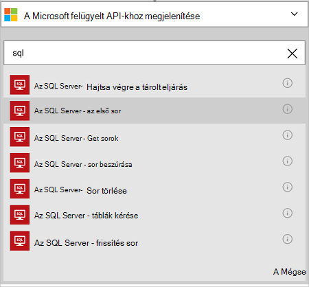

<properties
    pageTitle="Az Azure SQL-adatbázis összekötő hozzáadása az összefüggés-alkalmazások |} Microsoft Azure"
    description="Azure SQL-adatbázis összekötő REST API-paraméterekkel áttekintése"
    services=""
    documentationCenter="" 
    authors="MandiOhlinger"
    manager="anneta"
    editor=""
    tags="connectors"/>

<tags
   ms.service="logic-apps"
   ms.devlang="na"
   ms.topic="article"
   ms.tgt_pltfrm="na"
   ms.workload="na" 
   ms.date="10/18/2016"
   ms.author="mandia"/>

# Első lépések az Azure SQL-adatbázis-összekötő
A szervezet kezelése a táblában található adatok munkafolyamatok az Azure SQL-adatbázis összekötő használatával hozhat létre. 

SQL-adatbázissal akkor:

- Hozza létre a munkafolyamat úgy, hogy új vevő ügyfelek adatbázisok mezőinek megadásáról, vagy meglévőket frissíteni a megrendelésben rendelések adatbázist.
- Műveletek segítségével get egy sornyi adatot, új sor beszúrása és még akkor is törli. Ha például egy rekord létrehozásakor a Dynamics CRM Online (az eseményindító), majd sor beszúrása Azure SQL-adatbázisban (művelet). 

Ez a témakör bemutatja, hogyan használja az SQL-adatbázis összekötő összefüggés-alkalmazásban, és műveletek is láthatók.

>[AZURE.NOTE] Ez a cikk verziójának logika alkalmazások általános elérhetőség (kiadás) vonatkozik. 

Ha többet szeretne megtudni a logika alkalmazások, [Mik azok a logika alkalmazások](../app-service-logic/app-service-logic-what-are-logic-apps.md) és megtekintése [összefüggés-alkalmazás létrehozása](../app-service-logic/app-service-logic-create-a-logic-app.md)

## Azure SQL-adatbázis csatlakoztatása

Mielőtt a logika alkalmazás elérhető valamelyik szolgáltatás először hoz létre *kapcsolatot* a szolgáltatás. Kapcsolat a összefüggés-at, és egy másik szolgáltatás közötti kapcsolatot biztosít. Például SQL-adatbázishoz szeretne csatlakozni, először létrehoz egy SQL-adatbázis *kapcsolat*. Kapcsolat létrehozása, adja meg a szokásos módon a szolgáltatás csatlakozik eléréséhez használt hitelesítő adatok. SQL-adatbázishoz, írja be az SQL-adatbázis hitelesítő adatait, és hozza létre a kapcsolatot. 

#### A kapcsolat létrehozása

>[AZURE.INCLUDE [Create the connection to SQL Azure](../../includes/connectors-create-api-sqlazure.md)]

## Az eseményindító használata

Ez az összekötő nincsenek olyan indítók. Más indítók segítségével indítsa el a logika alkalmazást, például az ismétlődés az eseményindító, HTTP Webhook eseménykód, indítók más összekötők, és sok más érhető el. [Egy logikai-alkalmazás létrehozása](../app-service-logic/app-service-logic-create-a-logic-app.md) egy példát tartalmaz.

## Művelet használata
    
Művelet egy olyan művelet, a munkafolyamat egy logikai alkalmazásban definiált által végzett. [További tudnivalók a műveletek](../app-service-logic/app-service-logic-what-are-logic-apps.md#logic-app-concepts).

1. Jelölje ki a pluszjelre. Számos beállítást látni: **művelet hozzáadása**, **a megadott feltétel hozzáadása**vagy a **További** lehetőségek közül.

    

2. Válassza az **Add művelet**.

3. A szöveg mezőbe írja be "sql" az elérhető műveletek listájának.

     

4. Ebben a példában válassza az **SQL Server - az első sor**. Ha egy kapcsolat már létezik, jelölje be a **táblázat neve** a legördülő listából, és adja meg a **Sorazonosító** , amelynek vissza.

    

    Ha a kapcsolat adatait kéri, írja be a részletek, a kapcsolat létrehozása. [A kapcsolat létrehozása](connectors-create-api-sqlazure.md#create-the-connection) a jelen témakör következő tulajdonságokat ismerteti. 

    > [AZURE.NOTE] Ebben a példában azt egy táblából egy sorban adja eredményül. A sor adatainak megtekintéséhez adja hozzá a másik művelet, amelyet a létrehoz egy fájlt az táblából származó mezők használatával. Például a Vezetéknév és utónév mezőt az új fájl létrehozása a felhőalapú tárolási fiók használó OneDrive művelet hozzáadása. 

5. **Mentse** a módosításokat (bal felső sarkában az eszköztár). A logikai alkalmazás menti, és előfordulhat, hogy lesz automatikusan engedélyezett.

## Műszaki információk

## SQL-adatbázis-műveletek
Művelet egy olyan művelet, a munkafolyamat egy logikai alkalmazásban definiált által végzett. Az SQL-adatbázis összekötő tartalmazza a következő műveleteket. 

|Művelet|Leírás|
|--- | ---|
|[ExecuteProcedure](connectors-create-api-sqlazure.md#execute-stored-procedure)|Az SQL végrehajtja a tárolt eljárás|
|[GetRow](connectors-create-api-sqlazure.md#get-row)|Egyetlen sor egy SQL táblából|
|[GetRows hívás](connectors-create-api-sqlazure.md#get-rows)|Sorok egy SQL táblából|
|[InsertRow](connectors-create-api-sqlazure.md#insert-row)|Új sor beszúrása SQL táblába|
|[DeleteRow](connectors-create-api-sqlazure.md#delete-row)|Sorok törlése a SQL táblából|
|[GetTables](connectors-create-api-sqlazure.md#get-tables)|Táblázatok beolvassa az SQL-adatbázishoz|
|[UpdateRow](connectors-create-api-sqlazure.md#update-row)|Frissíti egy meglévő sor egy SQL-táblázatban|

### Művelet részletei

Ebben a részben lásd: az egyes műveletek, például minden olyan kötelező és választható bemeneti tulajdonságainak és bármely megfelelő eredményt ad, az összekötő társított pontos részleteket.

#### Hajtsa végre a tárolt eljárás
Az SQL végrehajtja a tárolt eljárás.  

| Tulajdonság neve| Megjelenítendő név |Leírás|
| ---|---|---|
|az eljárás * | Az eljárás neve | A tárolt eljárás nevét meg szeretné végrehajtása |
|Paraméterek * | Bemeneti paramétereket | A paraméterek nem dinamikus és kiválaszthatja, hogy a tárolt eljárás alapján.    Például ha az Adventure Works mintavállalati adatbázis használata esetén válassza a *ufnGetCustomerInformation* tárolt eljárás. A **Vevőkód** bemeneti paraméterre jelenik meg. Írja be a "6" vagy a többi ügyfél azonosítók közül. |

Csillag (*) azt jelzi, hogy a tulajdonság szükség.

##### Kimeneti részletei
ProcedureResult: Végzi a tárolt eljárás végrehajtás eredménye

| Tulajdonság neve | Adattípus | Leírás |
|---|---|---|
|OutputParameters|objektum|Kimeneti paraméterértékeket |
|Visszatérési kód:|egész szám|Vissza a kódot eljárás |
|ResultSets|objektum| Eredménykészlet|

#### Első sor 
Olvassa be az egysoros készítése egy SQL-táblából.  

| Tulajdonság neve| Megjelenítendő név |Leírás|
| ---|---|---|
|táblázat * | Táblázat neve |SQL-tábla neve|
|azonosító * | Sorazonosító |A sor beolvasásához egyedi azonosító|

Csillag (*) azt jelzi, hogy a tulajdonság szükség.

##### Kimeneti részletei
Elem

| Tulajdonság neve | Adattípus |
|---|---|
|ItemInternalId|karakterlánc|

#### Első sor 
Olvassa be a sorok készítése egy SQL-táblából.  

|Tulajdonság neve| Megjelenítendő név|Leírás|
| ---|---|---|
|táblázat *|Táblázat neve|SQL-tábla neve|
|$skip|Kihagyott elemek száma|Kihagyása bejegyzéseinek száma (alapértelmezett = 0)|
|$top|Get maximális száma|Beolvasásához bejegyzések maximális száma (alapértelmezett = 256)|
|$filter|Szűrő lekérdezések|Az ODATA szűrése lekérdezés korlátozása bejegyzéseinek száma|
|$orderby|Rendezési szempont|Az ODATA orderBy lekérdezés bejegyzések sorrendjének megadása|

Csillag (*) azt jelzi, hogy a tulajdonság szükség.

##### Kimeneti részletei
ItemsList

| Tulajdonság neve | Adattípus |
|---|---|
|érték|tömb|

#### Sor beszúrása 
Új sor beszúrása egy SQL táblába.  

|Tulajdonság neve| Megjelenítendő név|Leírás|
| ---|---|---|
|táblázat *|Táblázat neve|SQL-tábla neve|
|elem *|Sor|Az SQL a megadott táblázat beszúrása a sor|

Csillag (*) azt jelzi, hogy a tulajdonság szükség.

##### Kimeneti részletei
Elem

| Tulajdonság neve | Adattípus |
|---|---|
|ItemInternalId|karakterlánc|

#### Sor törlése 
Sor törlése egy SQL-táblából.  

|Tulajdonság neve| Megjelenítendő név|Leírás|
| ---|---|---|
|táblázat *|Táblázat neve|SQL-tábla neve|
|azonosító *|Sorazonosító|Egyedi azonosítója, a sor törlése|

Csillag (*) azt jelzi, hogy a tulajdonság szükség.

##### Kimeneti részletei
Nincs lehetőség.

#### Tábla 
Táblázatok beolvassa az SQL-adatbázishoz.  

Nincsenek a hívás paraméterek. 

##### Kimeneti részletei 
TablesList

| Tulajdonság neve | Adattípus |
|---|---|
|érték|tömb|

#### Sor frissítése 
Frissíti egy meglévő sor egy SQL-táblázatban.  

|Tulajdonság neve| Megjelenítendő név|Leírás|
| ---|---|---|
|táblázat *|Táblázat neve|SQL-tábla neve|
|azonosító *|Sorazonosító|Egyedi azonosítója, a sor frissítése|
|elem *|Sor|Frissített értékeket tartalmazó sor|

Csillag (*) azt jelzi, hogy a tulajdonság szükség.

##### Kimeneti részletei  
Elem

| Tulajdonság neve | Adattípus |
|---|---|
|ItemInternalId|karakterlánc|

### HTTP-válaszok

Ha a hívások átirányítása a különböző műveletek elvégzése adott válaszok jelenhetnek meg. Az alábbi táblázat ismerteti a válaszokat és azok leírását:  

|név|Leírás|
|---|---|
|200|oké|
|202|Elfogadott|
|400|Hibás kérés|
|401|Ezzel az illetéktelen|
|403|Tiltott|
|404|Nem található|
|500|Belső kiszolgálóhiba. Ismeretlen hiba|
|alapértelmezett|A művelet sikertelen volt.|

## Következő lépések

[Egy logikai-alkalmazás létrehozása](../app-service-logic/app-service-logic-create-a-logic-app.md). Ismerkedjen meg az [API-khoz listában](apis-list.md)a összefüggés-alkalmazások más elérhető összekötők.
