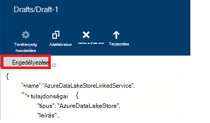

<properties
    pageTitle="Adatok áthelyezése és Azure adatok tó áruházból |} Azure Data Factory"
    description="Hogyan helyezhetők át az adatok/az Azure tó adattár Azure Data Factory használatával"
    services="data-factory"
    documentationCenter=""
    authors="linda33wj"
    manager="jhubbard"
    editor="monicar"/>

<tags
    ms.service="data-factory"
    ms.workload="data-services"
    ms.tgt_pltfrm="na"
    ms.devlang="na"
    ms.topic="article"
    ms.date="09/27/2016"
    ms.author="jingwang"/>

# Adatok áthelyezése és az Azure tó adattár Azure Data Factory használatával
Ez a cikk azt ismerteti, hogyan használhatja a Másolás tevékenység az Azure adatok gyári az-adatok áthelyezése a/Azure tó adattár/át egy másik adattár. Ez a cikk az adatok mozgását általános áttekintést bemutatja a Másolás tevékenység és a támogatott adatokat tároló kombinációk [Mozgás a tevékenységekre vonatkozó adatok](data-factory-data-movement-activities.md) cikk épül.

> [AZURE.NOTE]
> Azure tó adattár fiók létrehozása egy folyamat létrehozása egy másolatot a tevékenységhez való/áruházból Azure adatok tó adatok áthelyezése előtt. Azure tó adattár kapcsolatos további tudnivalókért olvassa el a [Azure tó adattár – első lépések](../data-lake-store/data-lake-store-get-started-portal.md)című témakört.
>  
> Tekintse át [a folyamat első oktatóprogram összeállítása](data-factory-build-your-first-pipeline.md) a lépések részletes adatok gyár, csatolt szolgáltatások, adatkészleteket és a folyamat létrehozása. Az adatok gyári szerkesztő vagy Visual Studio, illetve Azure PowerShell a JSON kódrészletek hozhat létre az adatok gyári szervezetek.

## Az adatok varázsló másolása
A hozzon létre egy folyamat, amely másolja az adatokat, és az Azure tó adattár legegyszerűbben a Másolás adatok varázsló használatával. Lásd: [oktatóprogram: hozzon létre egy példány varázslóval folyamat](data-factory-copy-data-wizard-tutorial.md) létrehozása egy folyamat adatok másolása varázsló segítségével a rövid ismertetését megtalálja. 

Az alábbi példák adnia minta JSON-definíciók létrehozása egy folyamat [Azure portal](data-factory-copy-activity-tutorial-using-azure-portal.md) segítségével vagy [Visual Studio](data-factory-copy-activity-tutorial-using-visual-studio.md) vagy [Azure Powershellhez](data-factory-copy-activity-tutorial-using-powershell.md)használható. Adatok másolása, Azure tó adattár és az Azure Blob-tárolóhoz mutatnak. Azonban adatokat másolt **közvetlenül** bármilyen forrásból valamelyik, az mosdók megadott [Itt](data-factory-data-movement-activities.md#supported-data-stores) a Másolás tevékenység használata Azure Data Factory is lehet.  

## Minta: Adatok másolása Azure Blob Azure tó adattárhoz
A következő példában:

1.  Csatolt szolgáltatás típusú [AzureStorage](#azure-storage-linked-service-properties).
2.  Csatolt szolgáltatás típusú [AzureDataLakeStore](#azure-data-lake-linked-service-properties).
3.  A beviteli [adatkészlet](data-factory-create-datasets.md) [AzureBlob](#azure-blob-dataset-type-properties)típusú.
4.  Egy kimenet [adatkészlet](data-factory-create-datasets.md) [AzureDataLakeStore](#azure-data-lake-dataset-type-properties)típusú.
4.  A [folyamat](data-factory-create-pipelines.md) [BlobSource](#azure-blob-copy-activity-type-properties) és [AzureDataLakeStoreSink](#azure-data-lake-copy-activity-type-properties)használó másolás tevékenységgel.

A minta-idősorok adatokat másolja az Azure Blob-tárolóhoz Azure tó adattár óránként. A minták következő szakaszok ezeket mintákban használt JSON tulajdonságok témakörben olvashat.

**Azure csatolt tárhelyszolgáltatáshoz:**

    {
      "name": "StorageLinkedService",
      "properties": {
        "type": "AzureStorage",
        "typeProperties": {
          "connectionString": "DefaultEndpointsProtocol=https;AccountName=<accountname>;AccountKey=<accountkey>"
        }
      }
    }

**Azure adatok tó összekapcsolt szolgáltatás:**

    {
        "name": "AzureDataLakeStoreLinkedService",
        "properties": {
            "type": "AzureDataLakeStore",
            "typeProperties": {
                "dataLakeStoreUri": "https://<accountname>.azuredatalakestore.net/webhdfs/v1",
                "sessionId": "<session ID>",
                "authorization": "<authorization URL>"
            }
        }
    }

### Azure adatok tó csatolt szolgáltatás adatok Factory-szerkesztővel létrehozása
Az alábbi eljárás lépéseit az Azure tó adattár csatolt szolgáltatásainak adatok Factory-szerkesztővel hozhat létre.

1. Kattintson az **új adatokat tárolja** a parancssávon, és válassza az **Azure tó adattár**.
2. A JSON-szerkesztőben **dataLakeStoreUri** tulajdonság írja be a URI az adatok tó.
3. Kattintson az **Engedélyezés** gombra, a parancssávon. Megjelenik egy előugró ablak.

    

4. A hitelesítő adatok való bejelentkezéshez használt, és a **engedélyezése** tulajdonság a JSON kell-e kiosztani értékre most.
5. (nem kötelező) Adja meg a JSON választható paraméterekkel, például a **fióknév**, **subscriptionID**és **resourceGroupName** értékek (és) törlése a tulajdonságok a JSON.
6. Kattintson a **központi telepítés** a csatolt szolgáltatás üzembe a parancssávon.

> [AZURE.IMPORTANT] A **engedélyezése** gombjával generált engedélyezési kód után valamikor jár le. , **Zavartalanul** használatával az **Engedélyezés** gombra, ha a **token lejár** , és a csatolt szolgáltatás újratelepítés. Lásd: [Azure adatok tó tár csatolt szolgáltatás](#azure-data-lake-store-linked-service-properties) szakaszban további információt. 

**Azure Blob beviteli adatkészlet:**

Adatok van kiválasztott az új blob óránként (gyakoriság: óra, intervallum: 1). A mappa elérési útját és nevét a blob-dinamikusan értékeli ki a kezdési időpontot a szelet, amely feldolgozása alapján. A mappa elérési útja használ év, hónap és nap része a kezdési időpontot, és a fájlnevet használja a kezdési időpontot a óra részét. "külső": "igaz" beállítás tájékoztatja Data Factory szolgáltatás a táblázatot az adatok gyári mutató külső, és nem készül az adatok gyári tevékenységet.

    {
      "name": "AzureBlobInput",
      "properties": {
        "type": "AzureBlob",
        "linkedServiceName": "StorageLinkedService",
        "typeProperties": {
          "folderPath": "mycontainer/myfolder/yearno={Year}/monthno={Month}/dayno={Day}",
          "partitionedBy": [
            {
              "name": "Year",
              "value": {
                "type": "DateTime",
                "date": "SliceStart",
                "format": "yyyy"
              }
            },
            {
              "name": "Month",
              "value": {
                "type": "DateTime",
                "date": "SliceStart",
                "format": "MM"
              }
            },
            {
              "name": "Day",
              "value": {
                "type": "DateTime",
                "date": "SliceStart",
                "format": "dd"
              }
            },
            {
              "name": "Hour",
              "value": {
                "type": "DateTime",
                "date": "SliceStart",
                "format": "HH"
              }
            }
          ]
        },
        "external": true,
        "availability": {
          "frequency": "Hour",
          "interval": 1
        },
        "policy": {
          "externalData": {
            "retryInterval": "00:01:00",
            "retryTimeout": "00:10:00",
            "maximumRetry": 3
          }
        }
      }
    }

**Azure adatok tó kimeneti adatkészlet:**

A minta másolja az adatokat egy Azure adatok tó áruházból. Új adata adatok tó példányok óránként tárolni.

    {
        "name": "AzureDataLakeStoreOutput",
        "properties": {
            "type": "AzureDataLakeStore",
            "linkedServiceName": "AzureDataLakeStoreLinkedService",
            "typeProperties": {
                "folderPath": "datalake/output/"
            },
            "availability": {
                "frequency": "Hour",
                "interval": 1
            }
        }
    }

**Csővezeték egy másolatot a tevékenységhez:**

A folyamat egy példány tevékenységet, amely a bemeneti és kimeneti adatkészleteket használatára van beállítva, és van ütemezve óránként tartalmazza. A során JSON megadása az **adatforrás** típusa **BlobSource** van állítva, és **AzureDataLakeStoreSink** **gyűjtő** típusának beállítása.

    {  
        "name":"SamplePipeline",
        "properties":
        {  
            "start":"2014-06-01T18:00:00",
            "end":"2014-06-01T19:00:00",
            "description":"pipeline with copy activity",
            "activities":
            [  
                {
                    "name": "AzureBlobtoDataLake",
                    "description": "Copy Activity",
                    "type": "Copy",
                    "inputs": [
                    {
                        "name": "AzureBlobInput"
                    }
                    ],
                    "outputs": [
                    {
                        "name": "AzureDataLakeStoreOutput"
                    }
                    ],
                    "typeProperties": {
                        "source": {
                            "type": "BlobSource",
                            "treatEmptyAsNull": true,
                            "blobColumnSeparators": ","
                        },
                        "sink": {
                            "type": "AzureDataLakeStoreSink"
                        }
                    },
                    "scheduler": {
                        "frequency": "Hour",
                        "interval": 1
                    },
                    "policy": {
                        "concurrency": 1,
                        "executionPriorityOrder": "OldestFirst",
                        "retry": 0,
                        "timeout": "01:00:00"
                    }
                }
            ]
        }
    }

## Minta: Adatok másolása Azure tó adattár Azure Blob
A következő példában:

1.  Csatolt szolgáltatás típusú [AzureDataLakeStore](#azure-data-lake-linked-service-properties).
2.  Csatolt szolgáltatás típusú [AzureStorage](#azure-storage-linked-service-properties).
3.  A beviteli [adatkészlet](data-factory-create-datasets.md) [AzureDataLakeStore](#azure-data-lake-dataset-type-properties)típusú.
4.  Egy kimenet [adatkészlet](data-factory-create-datasets.md) [AzureBlob](#azure-blob-dataset-type-properties)típusú.
5.  A [folyamat](data-factory-create-pipelines.md) [AzureDataLakeStoreSource](#azure-data-lake-copy-activity-type-properties) és [BlobSink](#azure-blob-copy-activity-type-properties) használó másolás tevékenységgel

A minta-idősorok adatokat másolja az Azure adatok tó áruházból az Azure blob óránként. A minták következő szakaszok ezeket mintákban használt JSON tulajdonságok témakörben olvashat.

**Azure tó adattár összekapcsolt szolgáltatás:**

    {
        "name": "AzureDataLakeStoreLinkedService",
        "properties": {
            "type": "AzureDataLakeStore",
            "typeProperties": {
                "dataLakeStoreUri": "https://<accountname>.azuredatalakestore.net/webhdfs/v1",
                "sessionId": "<session ID>",
                "authorization": "<authorization URL>"
            }
        }
    }

> [AZURE.NOTE] Lásd: az előző minta engedélyezési URL-cím beszerzése című témakör lépéseit.  

**Azure csatolt tárhelyszolgáltatáshoz:**

    {
      "name": "StorageLinkedService",
      "properties": {
        "type": "AzureStorage",
        "typeProperties": {
          "connectionString": "DefaultEndpointsProtocol=https;AccountName=<accountname>;AccountKey=<accountkey>"
        }
      }
    }

**Azure adatok tó beviteli adatkészlet:**

Beállítás **"külső": igaz** tájékoztatja a Data Factory szolgáltatás, a táblázatot az adatok gyári mutató külső, és nem készül az adatok gyári tevékenységet.

    {
        "name": "AzureDataLakeStoreInput",
        "properties":
        {
            "type": "AzureDataLakeStore",
            "linkedServiceName": "AzureDataLakeStoreLinkedService",
            "typeProperties": {
                "folderPath": "datalake/input/",
                "fileName": "SearchLog.tsv",
                "format": {
                    "type": "TextFormat",
                    "rowDelimiter": "\n",
                    "columnDelimiter": "\t"
                }
            },
            "external": true,
            "availability": {
                "frequency": "Hour",
                "interval": 1
            },
            "policy": {
                "externalData": {
                    "retryInterval": "00:01:00",
                    "retryTimeout": "00:10:00",
                    "maximumRetry": 3
                }
            }
        }
    }

**Azure Blob kimeneti adatkészlet:**

Adatok egy új blob íródott óránként (gyakoriság: óra, intervallum: 1). A mappa elérési útját a blob dinamikusan kiértékeli a kezdési időpontot a szelet, amely feldolgozása alapján. A mappa elérési útja használja az év, hónap, nap és a kezdési időpontot óra részei.

    {
      "name": "AzureBlobOutput",
      "properties": {
        "type": "AzureBlob",
        "linkedServiceName": "StorageLinkedService",
        "typeProperties": {
          "folderPath": "mycontainer/myfolder/yearno={Year}/monthno={Month}/dayno={Day}/hourno={Hour}",
          "partitionedBy": [
            {
              "name": "Year",
              "value": {
                "type": "DateTime",
                "date": "SliceStart",
                "format": "yyyy"
              }
            },
            {
              "name": "Month",
              "value": {
                "type": "DateTime",
                "date": "SliceStart",
                "format": "MM"
              }
            },
            {
              "name": "Day",
              "value": {
                "type": "DateTime",
                "date": "SliceStart",
                "format": "dd"
              }
            },
            {
              "name": "Hour",
              "value": {
                "type": "DateTime",
                "date": "SliceStart",
                "format": "HH"
              }
            }
          ],
          "format": {
            "type": "TextFormat",
            "columnDelimiter": "\t",
            "rowDelimiter": "\n"
          }
        },
        "availability": {
          "frequency": "Hour",
          "interval": 1
        }
      }
    }

**A Másolás tevékenységgel csővezeték:**

A folyamat egy példány tevékenységet, amely a bemeneti és kimeneti adatkészleteket használatára van beállítva, és van ütemezve óránként tartalmazza. A során JSON megadása az **adatforrás** típusa **AzureDataLakeStoreSource** van állítva, és **BlobSink** **gyűjtő** típusának beállítása.

    {  
        "name":"SamplePipeline",
        "properties":{  
            "start":"2014-06-01T18:00:00",
            "end":"2014-06-01T19:00:00",
            "description":"pipeline for copy activity",
            "activities":[  
                {
                    "name": "AzureDakeLaketoBlob",
                    "description": "copy activity",
                    "type": "Copy",
                    "inputs": [
                      {
                        "name": "AzureDataLakeStoreInput"
                      }
                    ],
                    "outputs": [
                      {
                        "name": "AzureBlobOutput"
                      }
                    ],
                    "typeProperties": {
                        "source": {
                            "type": "AzureDataLakeStoreSource",
                        },
                        "sink": {
                            "type": "BlobSink"
                        }
                    },
                    "scheduler": {
                        "frequency": "Hour",
                        "interval": 1
                    },
                    "policy": {
                        "concurrency": 1,
                        "executionPriorityOrder": "OldestFirst",
                        "retry": 0,
                        "timeout": "01:00:00"
                    }
                }
             ]
        }
    }

## Azure csatolt tó-tár szolgáltatás tulajdonságai

Azure tároló ügyfél is csatolása az Azure adatok gyári csatolt Azure tároló szolgáltatást használ. Az alábbi táblázat ismerteti a JSON elemeit adott Azure csatolt tárhelyszolgáltatáshoz leírását.

| A tulajdonság | Leírás | Szükséges |
| :-------- | :----------- | :-------- |
| típus | Meg kell a típusa tulajdonság: **AzureDataLakeStore** | igen |
| dataLakeStoreUri | Adja meg az Azure tó adattár fiókkal kapcsolatos információk. A következő formátumban van: https://<Azure Data Lake account name>.azuredatalakestore.net/webhdfs/v1 | igen |
| engedély | Az **Adatok gyári szerkesztő** **engedélyezése** gombra, és adja meg a hitelesítő adatait, amelyet az automatikusan generált engedélyezési URL-cím rendel a tulajdonság értékét.  | igen |
| munkamenet-azonosító | Az oauth engedélyezési munkamenetből OAuth a munkamenet azonosítója. Minden egyes munkamenet-azonosító egyedi, és előfordulhat, hogy csak egyszer lehet használni. Ez a beállítás automatikusan létrejön adatok Factory-szerkesztő használata során. | igen |  
| Fióknév | Adatok tó fióknév | nem |
| subscriptionId | Azure előfizetés azonosítójával. | Nem (Ha nincs megadva, az adatok gyári az előfizetés-alapú). |
| resourceGroupName |  Azure erőforráscsoport neve | Nem (Ha nincs megadva, az adatok gyári erőforráscsoport-alapú). |

## Jogkivonat lejárati 
A hoz létre az **Engedélyezés** gombra a engedélyezési kód után valamikor jár le. Az alábbi táblázatban talál a felhasználói fiókok különböző típusú elévülési idejét. Az alábbi hibaüzenet jelenhet meg üzenet mikor **jogkivonat lejár**hitelesítés: "a hitelesítő adatok hibás művelet: invalid_grant - AADSTS70002: hitelesítő adatok érvényesítése hiba. AADSTS70008: A megadott access támogatás lejárt vagy visszavonva. Nyomkövetés azonosítója: d18629e8-af88-43c5-88e3-d8419eb1fca1 Korrelációazonosító: fac30a0c-6be6-4e02-8d69-a776d2ffefd7 időbélyeg: a Skype 2015-12-15 21-09-31Z ".

| Felhasználó típusa | Lejárta után |
| :-------- | :----------- | 
| Azure Active Directory nem kezeli a felhasználói fiókok (@hotmail.com, @live.com, stb.). | 12 óra |
| Felhasználói fiókok felügyelt által Azure Active Directory (AAD) | Futtassa a 14 nappal az utolsó szelet után.   90 napon, ha egy csatolt szolgáltatás OAuth-alapú alapján szeletet fut 14 naponta legalább egyszer. |

A token lejárati idő előtti módosítja jelszavát, ha a token azonnal lejár, és ebben a részben említett hibaüzenet jelenik meg. 

Ez a hiba elkerülése/feloldás, zavartalanul használatával az **Engedélyezés** gombra mikor a **token lejár** , és a csatolt szolgáltatás újratelepítés. **Munkamenet** és **engedélyezési** tulajdonságok programozás útján a következő szakaszban a kód használatával értékeit is hozhat létre:

### Munkamenet és a hitelesítési értékeket programozás útján létrehozásához 

    if (linkedService.Properties.TypeProperties is AzureDataLakeStoreLinkedService ||
        linkedService.Properties.TypeProperties is AzureDataLakeAnalyticsLinkedService)
    {
        AuthorizationSessionGetResponse authorizationSession = this.Client.OAuth.Get(this.ResourceGroupName, this.DataFactoryName, linkedService.Properties.Type);

        WindowsFormsWebAuthenticationDialog authenticationDialog = new WindowsFormsWebAuthenticationDialog(null);
        string authorization = authenticationDialog.AuthenticateAAD(authorizationSession.AuthorizationSession.Endpoint, new Uri("urn:ietf:wg:oauth:2.0:oob"));

        AzureDataLakeStoreLinkedService azureDataLakeStoreProperties = linkedService.Properties.TypeProperties as AzureDataLakeStoreLinkedService;
        if (azureDataLakeStoreProperties != null)
        {
            azureDataLakeStoreProperties.SessionId = authorizationSession.AuthorizationSession.SessionId;
            azureDataLakeStoreProperties.Authorization = authorization;
        }

        AzureDataLakeAnalyticsLinkedService azureDataLakeAnalyticsProperties = linkedService.Properties.TypeProperties as AzureDataLakeAnalyticsLinkedService;
        if (azureDataLakeAnalyticsProperties != null)
        {
            azureDataLakeAnalyticsProperties.SessionId = authorizationSession.AuthorizationSession.SessionId;
            azureDataLakeAnalyticsProperties.Authorization = authorization;
        }
    }

Témakörök [AzureDataLakeStoreLinkedService osztály](https://msdn.microsoft.com/library/microsoft.azure.management.datafactories.models.azuredatalakestorelinkedservice.aspx), [AzureDataLakeAnalyticsLinkedService](https://msdn.microsoft.com/library/microsoft.azure.management.datafactories.models.azuredatalakeanalyticslinkedservice.aspx), és [AuthorizationSessionGetResponse osztály](https://msdn.microsoft.com/library/microsoft.azure.management.datafactories.models.authorizationsessiongetresponse.aspx) részletes tudnivalókat az adatok gyári osztályok használt a kódot. A kód használt WindowsFormsWebAuthenticationDialog osztály **2.9.10826.1824** **Microsoft.IdentityModel.Clients.ActiveDirectory.WindowsForms.dll** verzió mutató hivatkozás hozzáadása. 
 

## Azure adatok tó adatkészlet tulajdonságai

JSON szakaszok és a rendelkezésre álló adatkészleteket definiálása tulajdonságok teljes listáját a [létrehozása adatkészleteket](data-factory-create-datasets.md) témakört is. Szakaszok, például a struktúra, elérhetőségét és egy adatkészletből JSON házirend hasonlóak az adatkészlet diagramtípusokat (Azure SQL Azure blob, Azure táblázat stb.).

A **typeProperties** szakaszt adatkészlet hibatípusonként eltérő, és információt nyújt a hely, formátumra stb, az adatok tárolása az adatok. A következő tulajdonságokat a typeProperties szakaszát adatkészlet **AzureDataLakeStore** adatkészlet típusú foglalja magában:

| A tulajdonság | Leírás | Szükséges |
| :-------- | :----------- | :-------- |
| Mappa_útvonala | A tároló és a Azure adatok tó mappa elérési útja tárolni. | igen |
| Fájlnév | Az Azure adatok tó áruházban a fájl nevét. a fájlnév nem kötelező és a kis-és nagybetűket paraméter.   Akkor adjon meg egy fájlnevet, ha a tevékenység (beleértve a Másolás) működnek a megadott fájlt.  Fájlnév nincs megadva, másolása a Mappa_útvonala beviteli adatkészlet az összes fájl szerepel.  Ha egy kimenet adatkészlet fileName nincs megadva, a létrehozott fájl nevét a következő lesz az alábbi ebben a formátumban: adatok. <Guid>.txt (például:: Data.0a405f8a-93ff-4c6f-b3be-f69616f1df7a.txt | nem |
| partitionedBy | partitionedBy egy választható tulajdonság értéke. A dinamikus Mappa_útvonala és az idő adatsor fájlnév megadása felhasználhatja azt. Ha például Mappa_útvonala is paraméteres az adatok óránként. A részletek és a példák [használata partitionedBy tulajdonság](#using-partitionedby-property) szakaszban olvashat. | nem |
| Formátum | A következő formátumú már támogatott: **TextFormat**, **AvroFormat**, **JsonFormat**, **OrcFormat**, **ParquetFormat**. A tulajdonság **típusa** formátum csoportban az egyik ezeket az értékeket. További információt [Tartalmazó TextFormat](#specifying-textformat), [AvroFormat megadása](#specifying-avroformat), [Megadása JsonFormat](#specifying-jsonformat), [OrcFormat megadása](#specifying-orcformat)és [Megadása ParquetFormat](#specifying-parquetformat) lásd. Ha a fájlokat a másolni kívánt-van közötti fájlalapú tárolók is (bináris) példányát, ugorja át a két bemeneti és kimeneti adatkészlet definíciók a formátuma szakaszban.| nem
| tömörítés | Adja meg a típus és az adatok tömörítés szintjét. Támogatott típusú: **GZip**, a **Deflate**, és a **BZip2** és a támogatott szintek: **Optimal** és **leggyorsabb**. A tömörítési beállításokat jelenleg nem támogatott **AvroFormat** vagy **OrcFormat**adatait. További tudnivalókért lásd: [tömörítés támogatás](#compression-support) szakaszában.  | nem |

### PartitionedBy tulajdonság használatával
Egy dinamikus Mappa_útvonala és az idő adatsor filename megadhatja a **partitionedBy** szakasz, adatok gyári makrókat és a rendszer változóinak: SliceStart és SliceEnd, amelyek egy adott szeletre a kezdési és befejezési időpontot jelzi.

Cikkek [Adatkészleteket létrehozása](data-factory-create-datasets.md) és [ütemezése és a végrehajtás](data-factory-scheduling-and-execution.md) megértéséhez idő sorozat adatkészleteket, ütemezés és szeletek további tájékoztatást.

#### Minta 1

    "folderPath": "wikidatagateway/wikisampledataout/{Slice}",
    "partitionedBy":
    [
        { "name": "Slice", "value": { "type": "DateTime", "date": "SliceStart", "format": "yyyyMMddHH" } },
    ],

Ebben a példában {szeletet} Data Factory rendszer változó SliceStart (YYYYMMDDHH) formátumban megadott értékkel helyettesíti. A SliceStart elindítása a szelet hivatkozik. A Mappa_útvonala eltér az egyes szeletek. Példa: wikidatagateway/wikisampledataout/2014100103 vagy wikidatagateway/wikisampledataout/2014100104

#### Minta 2

    "folderPath": "wikidatagateway/wikisampledataout/{Year}/{Month}/{Day}",
    "fileName": "{Hour}.csv",
    "partitionedBy":
     [
        { "name": "Year", "value": { "type": "DateTime", "date": "SliceStart", "format": "yyyy" } },
        { "name": "Month", "value": { "type": "DateTime", "date": "SliceStart", "format": "MM" } },
        { "name": "Day", "value": { "type": "DateTime", "date": "SliceStart", "format": "dd" } },
        { "name": "Hour", "value": { "type": "DateTime", "date": "SliceStart", "format": "hh" } }
    ],

Ebben a példában az év, hónap, nap és SliceStart időpontjának kibontása be külön változók Mappa_útvonala és a fájlnevet tulajdonságok által használt.

[AZURE.INCLUDE [data-factory-file-format](../../includes/data-factory-file-format.md)]
 

### A tömörítési támogatás  
Nagyméretű adatkészletek feldolgozása okozhatják adatátviteli, valamint a hálózati szűk. Emiatt tömörített üzletek adatainak is nemcsak adatátvitel gyorsítása a hálózaton keresztül és takarékoskodhat a lemezterülettel, de is hozása jelentős teljesítménybeli fejlesztések a nagy adatfeldolgozás. A tömörítési jelenleg, fájlalapú adatokat tárolja, például Azure Blob- vagy a helyszíni fájlrendszerben használata támogatott.  

Egy adatkészlet tömörítés megadásához a **tömörítés** tulajdonsággal az adathalmazban JSON a következő példának megfelelően:   

    {  
        "name": "AzureDatalakeStoreDataSet",  
        "properties": {  
            "availability": {  
                "frequency": "Day",  
                "interval": 1  
            },  
            "type": "AzureDatalakeStore",  
            "linkedServiceName": "DataLakeStoreLinkedService",  
            "typeProperties": {  
                "fileName": "pagecounts.csv.gz",  
                "folderPath": "compression/file/",  
                "compression": {  
                    "type": "GZip",  
                    "level": "Optimal"  
                }  
            }  
        }  
    }  
 
A **tömörítési** szakasz két tulajdonságok foglalja magában:  
  
- **Típusa:** a tömörítési kodek, amely lehet **GZIP**, **Deflate** vagy **BZIP2**.  
- **Szint:** lehet **Optimal** vagy **leggyorsabb**tömörítést. 
    - **Leggyorsabb:** A tömörítési művelet be kell fejeződnie minél gyorsabban, még akkor is, ha az eredményül kapott fájl optimálisan nem tömöríti. 
    - **Optimal**: A tömörítési művelet célszerű lehet optimálisan tömöríteni, akkor is, ha a művelet elvégzéséhez hosszabb ideig tart. 
    
    További információ a [Tömörítési szint](https://msdn.microsoft.com/library/system.io.compression.compressionlevel.aspx) témakört. 

Tegyük fel, hogy a minta adatkészlet a kimenet másolása tevékenység szolgál. A Másolás tevékenység tömöríti a kimeneti adatai GZIP kodek optimális arányok kiszámításához használja a, majd írja be az Azure adatok tó áruházban pagecounts.csv.gz nevű fájlt a a tömörített adatok.   

Tömörítés tulajdonság-beviteli adatkészlet JSON ad meg, amikor a folyamat tömörített adatokat olvas a forrás. A tulajdonságok egy kimenet adatkészlet JSON ad meg, amikor a Másolás tevékenység tömörített adatokat is írhat a cél. Íme néhány példa alkalmazási helyzetek: 

- Az Azure adatok tó áruházból tömörített olvasható GZIP adatok kibontásához, és eredményül kapott adatokat írás Azure SQL-adatbázishoz. Ebben az esetben határozhatja meg a bemeneti Azure tó adattár adatkészlet a tömörítést JSON tulajdonság. 
- Adatok fájlrendszerből a helyszíni egyszerű szöveges fájlból, a tömörítés GZip formátumban, adatainak olvasása és írása a tömörített Azure adatok tó tárolóhoz. Egy kimenet Azure adatok tó adatkészlet a tömörítés JSON tulajdonság ebben az esetben határozza meg.  
- GZIP tömörített adatok az Azure adatok tó áruházból, azt kibontásához, tömörítése BZIP2 használatával, adatainak olvasása és írása eredmény Azure adatok tó tárolóhoz. Tömörítés típusa beállítás legyen GZIP és BZIP2 adatbevitelt, és adatkészleteket rendre kimeneti.   

## Azure adatok tó másolás tevékenység típusának tulajdonságai  
Szakaszok és a tevékenységek definiálásával használható tulajdonságok teljes listáját a [Folyamatok létrehozása](data-factory-create-pipelines.md) témakört is. Az összes tevékenységtípusokhoz tulajdonságait, például a név, leírás, a bemeneti és kimeneti táblák és házirend érhetők el.

Minden tevékenység típusa azonban függenek tulajdonságok elérhető typeProperties szakaszában a tevékenységet. Attól függően, hogy milyen típusú adatforrások és mosdók változik másolása a tevékenységhez

**AzureDataLakeStoreSource** támogatja a következő tulajdonságok **typeProperties** szakasz:

| A tulajdonság | Leírás | Megengedett érték | Szükséges |
| -------- | ----------- | -------------- | -------- |
| rekurzív | Azt jelzi, hogy az adatok olvasható rekurzív az almappák vagy csak a megadott mappába. | Hamis értéket Igaz (alapértelmezés) | nem |

**AzureDataLakeStoreSink** támogatja a következő tulajdonságok **typeProperties** szakasz:

| A tulajdonság | Leírás | Megengedett érték | Szükséges |
| -------- | ----------- | -------------- | -------- |
| copyBehavior | Meghatározza a Másolás viselkedését. | **PreserveHierarchy:** megőrzi a célmappát fájl hierarchia. Az adatforrás mappára forrásfájlban relatív elérési útja relatív fájl elérési útját cél célmappába azonos.  **FlattenHierarchy:** a forrás mappában lévő összes fájlt az első szintű célmappát jönnek létre. A cél fájlokat létre automatikusan létrejön nevét.  **MergeFiles:** egy fájl a forrás mappában lévő összes fájl egyesíti. A fájl/Blob van megadva, az egyesített fájlnév akkor a megadott név; egyéb esetben akkor is automatikusan létrehozott fájl nevét. | nem |

[AZURE.INCLUDE [data-factory-structure-for-rectangualr-datasets](../../includes/data-factory-structure-for-rectangualr-datasets.md)]

[AZURE.INCLUDE [data-factory-type-conversion-sample](../../includes/data-factory-type-conversion-sample.md)]

[AZURE.INCLUDE [data-factory-column-mapping](../../includes/data-factory-column-mapping.md)]

## A teljesítmény és a finombeállítása  
Lásd: a [Másolás tevékenység teljesítmény és útmutató beállítása](data-factory-copy-activity-performance.md) Ha többet szeretne tudni a főbb tényezők hatása teljesítmény mozgásának adatok (másolása a tevékenység) az Azure Data Factory és a különféle módokon optimalizálása azt.
