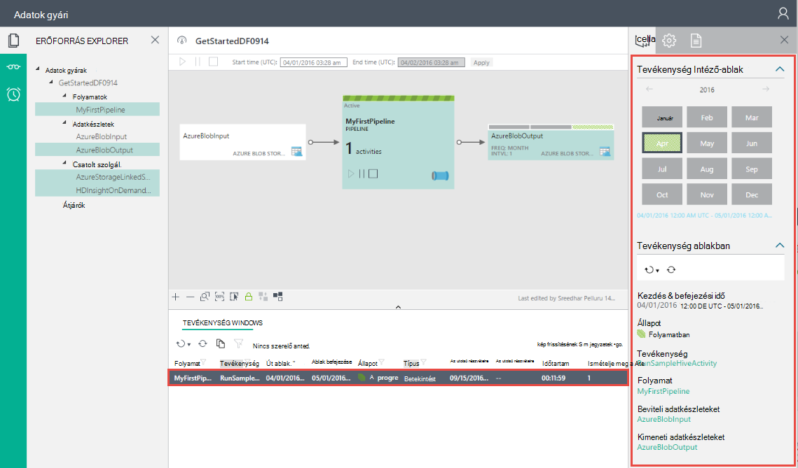

<properties
    pageTitle="Az első adatok gyári (Azure portal) összeállítása |} Microsoft Azure"
    description="Ebben az oktatóanyagban hozzon létre egy minta Azure Data Factory folyamat adatok gyári szerkesztővel az Azure-portálon."
    services="data-factory"
    documentationCenter=""
    authors="spelluru"
    manager="jhubbard"
    editor="monicar"/>

<tags
    ms.service="data-factory"
    ms.workload="data-services"
    ms.tgt_pltfrm="na"
    ms.devlang="na"
    ms.topic="hero-article" 
    ms.date="09/14/2016"
    ms.author="spelluru"/>

# Oktatóprogram: Az első Azure adatok gyári Azure portálon összeállítása
> [AZURE.SELECTOR]
- [Áttekintés és a vonatkozó követelmények](data-factory-build-your-first-pipeline.md)
- [Azure portál](data-factory-build-your-first-pipeline-using-editor.md)
- [Visual Studio](data-factory-build-your-first-pipeline-using-vs.md)
- [A PowerShell](data-factory-build-your-first-pipeline-using-powershell.md)
- [Erőforrás-kezelő sablon](data-factory-build-your-first-pipeline-using-arm.md)
- [REST API-VAL](data-factory-build-your-first-pipeline-using-rest-api.md)

Ebben a cikkben megismerheti, hogyan az [Azure portál](https://portal.azure.com/) használata az első Azure adatok gyári létrehozásához. 

## Előfeltételek        
1. Olvassa el a [Oktatóprogram áttekintése](data-factory-build-your-first-pipeline.md) cikket, és hajtsa végre a **előfeltétel** .
2. Ez a cikk nem nyújt az Azure Data Factory szolgáltatás elrendezését. Azt javasoljuk, hogy feldolgozzuk [Azure Data Factory bemutatása](data-factory-introduction.md) a cikk részletes ismertetése a szolgáltatás.  

## Adatok gyári létrehozása
Adatok gyár beállíthatja, hogy egy vagy több folyamatok. Egy folyamat beállíthatja, hogy egy vagy több tevékenységek rajta. Ha például egy példány tevékenység adatok másolása adatok céltárat forrást és struktúra parancsprogramot, amely a bemeneti adatokat a termék futtatásához a HDInsight-struktúra tevékenységének kimeneti adatok. Az adatok gyári létrehozásával ebben a lépésben első. 

1.  Jelentkezzen be az [Azure-portálon](https://portal.azure.com/).
2.  A bal oldali menüben kattintson az **Új** gombra, és kattintson az **adatok + Analytics** **Data Factory**gombra.
        
    

2.  Írja be az **új adatok gyári** lap **GetStartedDF** nevét.

    

    > [AZURE.IMPORTANT] 
    > Az Azure adatok gyári neve **globálisan egyedinek**kell lennie. Ha a hibakód: **nem érhető el adatok gyári neve "GetStartedDF"**. Módosítsa az adatok gyári (például yournameGetStartedDF) nevét, és próbáljon meg ismét létrehozni. [Adatok Factory - elnevezési szabályai](data-factory-naming-rules.md) témakört vonatkozó adatok gyári eltérések elnevezési szabályokat.
    > 
    > Az adatok gyári neve bejegyezhető **DNS** nevével ennélfogva és a jövőben nyilvánosan láthatóvá válnak.

3.  Jelölje ki az **Azure előfizetés** , amelyre a data factory létrehozni. 
4.  Jelölje be a meglévő **erőforráscsoport** , vagy hozzon létre egy erőforrás csoportot. Az oktatóprogram, hozzon létre egy névvel ellátott erőforráscsoport: **ADFGetStartedRG**. 
5.  Kattintson a **Létrehozás** gombra az **új adatok gyári** lap.

    > [AZURE.IMPORTANT] Adatok Factory-példányok létrehozásához az [Adatok gyári munkatársi](../active-directory/role-based-access-built-in-roles.md/#data-factory-contributor) szerepkörök, az előfizetés/erőforrás csoport szintjén tagjának kell lennie. 
6.  A data factory hoznak létre a **Startboard** az Azure-portálra a következőképpen jelenik meg:   

    
7. Gratulálok! Az adatok első gyári sikeresen létrehozott. Az adatok gyári létrehozása sikeresen befejeződött, miután látni az gyári lapon, amely jelzi, hogy az adatok gyári tartalmát.   

    

Mielőtt hoz létre egy folyamat adatok gyári, néhány adatot gyári szervezetek először létrehozásához szükséges. Először létre csatolt szolgáltatások hivatkozás adatokat tárolja/képlet ki az adatokat tároló, határozza meg a bemeneti és kimeneti adatkészleteket, és csatolt adatokat tárolja a bemeneti és kimeneti adatok megjelenítése, majd hozza létre a folyamat az alábbi adatkészleteket használó tevékenységet. 

## Hozzon létre csatolt szolgáltatások
Ebben a lépésben összekapcsol Azure tárterület-fiókját, és a az igény szerinti Azure hdinsight szolgáltatáshoz fürt az adatok gyári. A tároló Azure-fiók adatait tartalmazza bemeneti és kimeneti a folyamat az alábbi példa a. A csatolt HDInsight szolgáltatást használják, a tevékenység a folyamat az alábbi példa a megadott struktúra parancsfájl futtatásához. Milyen [adatok tárolására](data-factory-data-movement-activities.md)azonosítása/[szolgáltatások számítja ki](data-factory-compute-linked-services.md) a helyzetben használja, és azokat a szolgáltatásokat az adatok gyári csatolása csatolt szolgáltatások létrehozásával.  

### Azure csatolt tárhelyszolgáltatáshoz létrehozása
Ebben a lépésben összekapcsol Azure tárterület-fiókját az adatok gyári. Ebben az oktatóanyagban használatával Azure tároló ugyanazzal a fiókkal bemeneti és kimeneti adatok és a HQL parancsprogram tárolásához. 

1.  Kattintson a **Szerző és üzembe** a az **Adatok gyári** lap az **GetStartedDF**. Meg kell jelennie a adatok Factory-szerkesztőben. 
     
    
2.  Kattintson az **új adatok tárolására** , és válassza az **Azure tárhelyet**.

    

3.  Meg kell jelennie a JSON parancsfájl létrehozása az Azure csatolt tárhelyszolgáltatáshoz szerkesztőben. 
    
    
     
4. **Fióknév** cserélje le az access használatával az Azure tárterület-fiók a **fiókkulcs** és Azure tároló fiók nevére. Megtudhatja, hogyan hozhatja ki a tárhely hívóbetű, lásd: a [nézet, a másolás és a hívóbetűk újragenerálása tárhely](../storage/storage-create-storage-account.md#view-copy-and-regenerate-storage-access-keys)
5. Kattintson a **központi telepítés** a csatolt szolgáltatás üzembe a parancssávon.

    

   Miután sikeresen telepíti a csatolt szolgáltatás, a **Piszkozat-1** ablak el kell tűnniük, amikor látja, **AzureStorageLinkedService** a bal oldali fastruktúrájú nézetben. 
       

 
### Azure hdinsight szolgáltatáshoz kapcsolódó szolgáltatás hozzon létre
Ebben a lépésben csatol egy igény szerinti HDInsight fürthöz az adatok gyári. A HDInsight fürt automatikusan létrejön futásidőben, és törölni a megadott számú alkalommal az áttelepítés feldolgozó és tétlen. 

1. Az **Adatok Factory-szerkesztőben**kattintson **... További**kattintson az **Új számítja ki**, és válassza ki **a csoportját igény szerinti hdinsight szolgáltatásból lehetőségre**.

    
2. Másolja és illessze be az alábbi kódtöredékének a **Piszkozat-1** -ablakba. A JSON kódtöredékének, amely a HDInsight fürt igény szerinti létrehozására-tulajdonságokat ismerteti. 

        {
          "name": "HDInsightOnDemandLinkedService",
          "properties": {
            "type": "HDInsightOnDemand",
            "typeProperties": {
              "version": "3.2",
              "clusterSize": 1,
              "timeToLive": "00:30:00",
              "linkedServiceName": "AzureStorageLinkedService"
            }
          }
        }
    
    Az alábbi táblázat ismertetését a kódtöredék használt JSON tulajdonságait:
    
  	| A tulajdonság | Leírás |
  	| :------- | :---------- |
  	| Verzió | Itt adhatja meg, hogy a HDInsight verziójában létrehozott 3,2. | 
  	| ClusterSize | Adja meg a HDInsight fürt méretét. | 
  	| Élettartam | Meghatározza, hogy az üresjárati idejére a HDInsight fürt törlés előtt. |
  	| linkedServiceName | Itt adhatja meg a tárterület-fiókot, amely a naplókat HDInsight által létrehozott tárolására szolgál. |

    Vegye figyelembe az alábbiakat: 
    
    - Az adatok gyári hoz a **Windows-alapú** HDInsight fürtre meg a JSON. Azt **Linux-alapú** HDInsight fürt létrehozása is lehet. [Igény szerinti HDInsight csatolt szolgáltatás](data-factory-compute-linked-services.md#azure-hdinsight-on-demand-linked-service) információt talál. 
    - Az igény szerinti HDInsight fürt használata helyett használhatja is **saját HDInsight fürt** . A részletekért [HDInsight csatolt szolgáltatás](data-factory-compute-linked-services.md#azure-hdinsight-linked-service) témakörben olvashat.
    - A HDInsight fürt **alapértelmezett tároló** a JSON (**linkedServiceName**) megadott blob-tárolóhoz hoz létre. HDInsight nem törli a tároló törlésekor a fürt. Ez a jelenség szándékosan van így. Igény szerinti csatolt HDInsight szolgáltatással HDInsight fürt jön létre, minden alkalommal, amikor egy szeletet feldolgozása van, kivéve, ha van egy meglévő élő fürthöz (**élettartam**). Ha elkészült a feldolgozása a rendszer automatikusan törli a fürt.
    
        További szeletek feldolgozása, mint az Azure blob-tárolóhoz sok tárolók látható. Ha nincs szüksége rájuk a feladatok hibaelhárítási, érdemes törölheti őket a tárhely költség csökkentése érdekében. Ezek a tárolók azoknak a hajtsa végre a minta: "adf**yourdatafactoryname**-**linkedservicename**- datetimestamp". Például a [Microsoft tároló Explorer](http://storageexplorer.com/) eszközök segítségével az Azure blob-tárolóban lévő tárolók törlése.

    [Igény szerinti HDInsight csatolt szolgáltatás](data-factory-compute-linked-services.md#azure-hdinsight-on-demand-linked-service) információt talál.
3. Kattintson a **központi telepítés** a csatolt szolgáltatás üzembe a parancssávon. 

    

4. Győződjön meg arról, **AzureStorageLinkedService** és **HDInsightOnDemandLinkedService** a fa megjelenítése a bal oldali is látható.

    

## Hozzon létre adatkészleteket
Ebben a lépésben létrehoz jelenítik meg a bemeneti és kimeneti struktúra feldolgozásra adatok adatkészleteket. Olvassa el az alábbi adatkészleteket az oktatóprogram korábbi részében létrehozott **AzureStorageLinkedService** . A csatolt szolgáltatás pontok Azure tároló fiókot és adatkészleteket megadása tároló, a mappa, a fájl nevét az beviteli betöltő tárolására és a kimeneti adatok.   

### Beviteli adatkészlet létrehozása

1. Az **Adatok Factory-szerkesztőben**kattintson **... További** a parancssávon, kattintson a **Új adatkészlet**, és válassza az **Azure Blob-tárolóhoz**.

    
2. Másolja és illessze be az alábbi kódtöredékének a piszkozat-1-ablakba. A JSON kódtöredékének a hoz létre, amely egy tevékenység, a során bemeneti adatok **AzureBlobInput** nevű adatkészletet. Ezeken kívül megadhatja, hogy a bemeneti adatok a blob-tároló **adfgetstarted** neve és a **inputdata**nevű mappa található.
        
        {
            "name": "AzureBlobInput",
            "properties": {
                "type": "AzureBlob",
                "linkedServiceName": "AzureStorageLinkedService",
                "typeProperties": {
                    "fileName": "input.log",
                    "folderPath": "adfgetstarted/inputdata",
                    "format": {
                        "type": "TextFormat",
                        "columnDelimiter": ","
                    }
                },
                "availability": {
                    "frequency": "Month",
                    "interval": 1
                },
                "external": true,
                "policy": {}
            }
        } 

    Az alábbi táblázat ismertetését a kódtöredék használt JSON tulajdonságait:

  	| A tulajdonság | Leírás |
  	| :------- | :---------- |
  	| típus | A type tulajdonság AzureBlob beállítani, mert az Azure blob-tárolóhoz tárolt adatokhoz. |  
  	| linkedServiceName | a korábban létrehozott AzureStorageLinkedService hivatkozik. |
  	| Fájlnév | Ez a tulajdonság nem kötelező. Ha ez a tulajdonság nincs megadva, az a Mappa_útvonala származó fájlok vannak kiválasztott. Ebben az esetben csak a input.log feldolgozása. |
  	| típus | A naplófájlok-szöveg formátumban, így TextFormat használjuk. | 
  	| columnDelimiter | a naplófájlok oszlopai határolja vessző karakter () |
  	| gyakoriság/intervallum | Hónap és az intervallum beállítása gyakoriság értéke 1, ami azt jelenti, hogy beviteli szeletet elérhetők havi. | 
  	| külső | Ez a tulajdonság értéke igaz, ha a bemeneti adatok Data Factory szolgáltatás nem jön létre. | 
        
3. Kattintson a **központi telepítés** a telepítéshez használni az újonnan létrehozott adatkészlet parancssávon. Meg kell jelennie a bal oldali fastruktúrájú nézetben az adatkészlet. 

### Hozzon létre a kimeneti adatkészlet
A kimenet adatkészlet az Azure Blob-tárolóban lévő kimeneti adatai ábrázolásához létrehozása 

1. Az **Adatok Factory-szerkesztőben**kattintson **... További** a parancssávon, kattintson a **Új adatkészlet**, és válassza az **Azure Blob-tárolóhoz**.  
2. Másolja és illessze be az alábbi kódtöredékének a piszkozat-1-ablakba. A JSON kódtöredékének létrehozásához **AzureBlobOutput**és a struktúra parancsfájl által létrehozott adatok szerkezetének megadása című adatkészletet. Ezeken kívül megadhatja, hogy az eredmények tárolása a blob-tároló **adfgetstarted** neve és a **partitioneddata**nevű mappát. **A elérhetősége** Itt adhatja meg, hogy a kimeneti adatkészlet havi rendszerességgel elő.
    
        {
          "name": "AzureBlobOutput",
          "properties": {
            "type": "AzureBlob",
            "linkedServiceName": "AzureStorageLinkedService",
            "typeProperties": {
              "folderPath": "adfgetstarted/partitioneddata",
              "format": {
                "type": "TextFormat",
                "columnDelimiter": ","
              }
            },
            "availability": {
              "frequency": "Month",
              "interval": 1
            }
          }
        }

    Lásd: az alábbi tulajdonságok leírásai **létrehozásához a beviteli adatkészlet** szakaszát. Nem meg a külső tulajdonság egy kimenet adatkészlet, az adatok gyári szolgáltatás az adatkészlet elő.
3. Kattintson a **központi telepítés** a telepítéshez használni az újonnan létrehozott adatkészlet parancssávon.
4. Győződjön meg arról, hogy az adatkészlet sikeresen jön létre.

    

## Folyamat létrehozása
Ebben a lépésben az első folyamat **HDInsightHive** tevékenységgel létrehozása. Beviteli szeletet érhető el havi (gyakoriság: intervallum, hónap: 1), kimeneti szeletet havi készül, és a Feladatütemező a tevékenységhez tartozó is tulajdonsága havi. A kimenet adatkészlet és a tevékenység ütemező beállításainak kell lennie. Kimeneti adatkészlet jelenleg milyen meghajtók az ütemezést, így akkor is, ha a tevékenység nem hozhatók létre bármely kimeneti létre kell hoznia egy kimenet adatkészlet. Ha a tevékenység bármely bevitel nem kerül, kihagyhatja létrehozásához a beviteli adatkészlet. Tulajdonságait a következő JSON használt végén található ez a szakasz ismerteti. 

1. Az **Adatok Factory-szerkesztőben**kattintson **három pontra (…) További parancsok is elérhetők** , és kattintson az **új folyamat**.
    
    
2. Másolja és illessze be az alábbi kódtöredékének a piszkozat-1-ablakba.

    > [AZURE.IMPORTANT] **Storageaccountname** cserélje le a tárterület a JSON-fiók nevére.
        
        {
            "name": "MyFirstPipeline",
            "properties": {
                "description": "My first Azure Data Factory pipeline",
                "activities": [
                    {
                        "type": "HDInsightHive",
                        "typeProperties": {
                            "scriptPath": "adfgetstarted/script/partitionweblogs.hql",
                            "scriptLinkedService": "AzureStorageLinkedService",
                            "defines": {
                                "inputtable": "wasb://adfgetstarted@<storageaccountname>.blob.core.windows.net/inputdata",
                                "partitionedtable": "wasb://adfgetstarted@<storageaccountname>.blob.core.windows.net/partitioneddata"
                            }
                        },
                        "inputs": [
                            {
                                "name": "AzureBlobInput"
                            }
                        ],
                        "outputs": [
                            {
                                "name": "AzureBlobOutput"
                            }
                        ],
                        "policy": {
                            "concurrency": 1,
                            "retry": 3
                        },
                        "scheduler": {
                            "frequency": "Month",
                            "interval": 1
                        },
                        "name": "RunSampleHiveActivity",
                        "linkedServiceName": "HDInsightOnDemandLinkedService"
                    }
                ],
                "start": "2016-04-01T00:00:00Z",
                "end": "2016-04-02T00:00:00Z",
                "isPaused": false
            }
        }
 
    A JSON kódtöredékének a készít egy folyamat, amely egy tevékenység bejelentkezett az adatokat egy HDInsight fürthöz struktúrát használó áll.
    
    A struktúra parancsfájl, **partitionweblogs.hql**, Azure tároló fiók (az scriptLinkedService **AzureStorageLinkedService**nevű által megadott), és a tároló **adfgetstarted** **parancsfájl** mappájában vannak tárolva.

    A **definiálja** szakasz szolgál adja meg a struktúra értékként a struktúra parancsfájl átadott futtatókörnyezet beállításokat (például ${hiveconf: inputtable}, {hiveconf:partitionedtable} $).

    A folyamat **kezdete** és **vége** tulajdonságainak a folyamat aktív időt adja meg.

    A tevékenység JSON adja meg, hogy a struktúra parancsfájl fut-e a számítási a **linkedServiceName** – **HDInsightOnDemandLinkedService**határozza meg.

    > [AZURE.NOTE] [Egy folyamat felépítése](data-factory-create-pipelines.md#anatomy-of-a-pipeline) részletes tájékoztatást a példában JSON-tulajdonságok megtekintése 

3. Ellenőrizze a következőket: 
    1. forrásfájl **Input.log** **inputdata** mappájában található a **adfgetstarted** tároló az Azure blob-tárolóhoz
    2. **partitionweblogs.hql** fájl létezik a **adfgetstarted** tároló az Azure blob-tárolóhoz **parancsfájl** mappájában található. Teljes a előfeltétel lépéseket az [Oktatóprogram áttekintése](data-factory-build-your-first-pipeline.md) Ha ezeket a fájlokat nem látható. 
    3. Győződjön meg arról, **storageaccountname** cseréli a folyamat JSON tárterület-fiókja nevét. 
2. Kattintson a **központi telepítés** bevezetését tervezi a folyamat a parancssávon. Mivel a **Kezdés** és a **Záró** időpont múltbeli vannak beállítva, és **isPaused** hamis értékre van állítva, a folyamat (a tevékenység a során) fut, közvetlenül a telepítése után. 
4. Győződjön meg arról, hogy látható-e a fastruktúrájú nézetben a folyamat.

    
5. Gratulálunk, az első folyamat sikeresen létrehozott!

## Monitor folyamat

### Monitor folyamat diagramnézetében

6. Kattintson az **X** adatok gyári szerkesztő pengéit zárja be, és vissza szeretne térni az adatok gyári lap, és kattintson a **Diagram**gombra.
  
    
7. A Diagram nézetben című témakörben áttekintést a folyamatok, és ebben az oktatóanyagban használt adatkészleteket.
    
     
8. A folyamat minden tevékenység megtekintéséhez kattintson a jobb gombbal a diagram folyamat, és kattintson a Megnyitás folyamat. 

    
9. Győződjön meg arról, hogy látható-e a HDInsightHive tevékenységet a során. 
  
    

    Lépjen vissza az előző nézetre, kattintson a webhely-navigációs menü tetején **Data factory** . 
10. A **Diagram nézetben**kattintson duplán az adatkészlet **AzureBlobInput**. Győződjön meg arról, hogy a szeletet **kész** állapotban van-e. Eltarthat néhány percig, amíg a szeletet kész állapotban jelenjen meg. Miután valamikor várja meg nem történik, ha lásd: a bemeneti fájl (input.log), a jobb oldali tároló (adfgetstarted) és a mappa (inputdata) helyezett esetén.

    
11. Kattintson az **X** **AzureBlobInput** lap bezárásához. 
12. A **Diagram nézetben**kattintson duplán az adatkészlet **AzureBlobOutput**. Láthatja, hogy a szeletet, amely jelenleg feldolgozása.

    
9. Feldolgozási befejezése után a szeletet **kész** állapotban látni.
    
>[AZURE.IMPORTANT] Az igény szerinti HDInsight fürt kibocsátása rendszerint valamikor vesz igénybe (körülbelül 20 perc). Emiatt várjon **körülbelül 30 percig** a szeletet feldolgozása érvénybe a folyamat.    

     
    
10. Ha a szeletet **kész** állapotban van, ellenőrizze, hogy a blob-tárolóban a kimeneti adatokhoz a **adfgetstarted** tároló **partitioneddata** mappájában.  
 
    
11. Kattintson a szeletet részleteit a egy **szeletre** lap megjelenítéséhez.

      
12. Kattintson a tevékenység futtassa a **tevékenységlista fut** futtatása (a tevékenység struktúra a helyzetben) egy **tevékenység, futtassa a részletek** ablak a tevékenység részleteit.   

      
    
    A naplófájlból láthatja, hogy a struktúra lekérdezést, amely végrehajtása és a állapotinformációkat. Ezek a naplók hasznosak hibaelhárítási kapcsolatos problémák megoldásához.
Lásd: [Monitor és Azure portál pengéit használatával folyamatok kezelése](data-factory-monitor-manage-pipelines.md) a cikk további információt. 

> [AZURE.IMPORTANT] A bemeneti fájl kap törlésekor a szeletet importálni. Ezért, ha azt szeretné, futtassa újra a szeletet, és végezze el ismét az oktatóanyagot, a beviteli fájl feltöltése (input.log) a adfgetstarted tároló inputdata mappájába.

### Lync-folyamat Monitor és kezelheti a alkalmazás használata
Is Monitor használja, és a folyamatok Lync alkalmazás kezeléséhez. Ez az alkalmazás használatával kapcsolatos részletes tudnivalókért lásd [Monitor és kezelheti a figyelés és felügyeleti alkalmazás Azure Data Factory folyamatok](data-factory-monitor-manage-app.md).

1. Kattintson az adatok factory kezdőlapján **Monitor és kezelés** csempére.

     
2. Meg kell jelennie **Monitor és kezelés alkalmazást**. Módosítsa a **Kezdő időpont** és **záró időpontot** a megfelelő lépések (04-01 – 2016-ban 12:00 de) és befejezési idő (04-02 – 2016-ban 12:00 de) a folyamat, kattintson az **Alkalmaz**gombra.

     
3. Jelölje ki a **Tevékenységet a Windows** listában, szeretne tudni, hogy egy tevékenység ablakban. 
    

## Összefoglalás 
Ebben az oktatóprogramban egy Azure adatok gyári folyamat adatok struktúra parancsprogram futtatása a HDInsight hadoop fürthöz hozta létre. Használva a adatok Factory-szerkesztőben az Azure-portálon végezze el az alábbi lépéseket:  

1.  Az Azure **adatok gyári**létre.
2.  Hozzon létre két **csatolt szolgáltatások**:
    1.  **Azure tároló** csatolja a szolgáltatást, a bemeneti és kimeneti fájlok tárolja az adatok gyári Azure blob-tárolóhoz hivatkozás.
    2.  **Azure hdinsight szolgáltatáshoz** igény szerinti csatolt a szolgáltatást az igény szerinti HDInsight Hadoop fürt csatolása az adatok gyári. Azure Data Factory hoz létre egy HDInsight Hadoop fürt just-a-time bemeneti adatok folyamat, és a kimeneti adatai kiszámítására. 
3.  Létre két **adatkészleteket**, amelyek leírják a bemeneti és kimeneti adatok HDInsight-struktúra a tevékenységhez a során. 
4.  A **folyamat** létrehozott **HDInsight-struktúra** tevékenységgel. 

## Következő lépések
Ebben a cikkben egy folyamat átalakítási tevékenységet (HDInsight tevékenység), amelyet a struktúra parancsfájl futtat egy igény szerinti HDInsight fürt hozott létre. A Másolás tevékenységének használata adatok másolása Azure SQL-Azure Blob megtekintéséhez kattintson a [oktatóprogram: adatok másolása az egy Azure SQL Azure blob-](data-factory-copy-data-from-azure-blob-storage-to-sql-database.md).

## Lásd még:
| A témakör | Leírás |
| :---- | :---- |
| [A tevékenységekre vonatkozó adatok transzformációt hajt végre.](data-factory-data-transformation-activities.md) | Ebben a cikkben egy tevékenységlista adatok átalakítása (például az oktatóprogram használt HDInsight-struktúra átalakítása) Azure Data Factory által támogatott. | 
| [Ütemezés- és végrehajtása](data-factory-scheduling-and-execution.md) | Ez a cikk ismerteti az Azure Data Factory alkalmazásmodell ütemezési és a végrehajtás szempontjait. |
| [Folyamatok](data-factory-create-pipelines.md) | Ez a cikk segít megérteni a folyamatok és Azure Data Factory és használatuk összeállításához végpontok közötti adatalapú munkafolyamatok forgatókönyv vagy üzleti tevékenységek. |
| [Adatkészletek](data-factory-create-datasets.md) | Ez a cikk segít megérteni az Azure Data Factory adatkészleteket.
| [Figyelésére és figyelése alkalmazással folyamatok kezelése](data-factory-monitor-manage-app.md) | Ez a cikk leírja, hogy miként figyelheti, kezelése és használata a figyelő és felügyeleti alkalmazás folyamatok hibakeresési. 

  

