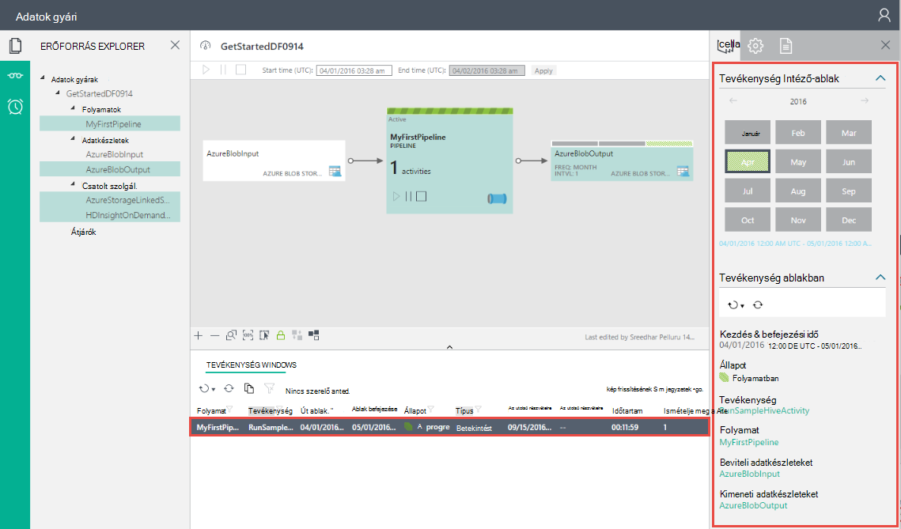
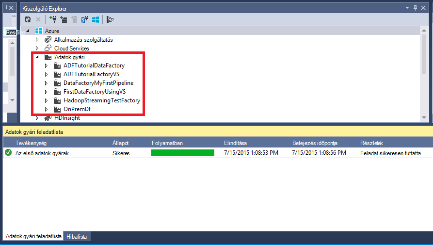

<properties
    pageTitle="Az első adatok gyári (Visual Studio) összeállítása |} Microsoft Azure"
    description="Ebben az oktatóanyagban hozzon létre egy minta Azure Data Factory folyamat Visual Studio segítségével."
    services="data-factory"
    documentationCenter=""
    authors="spelluru"
    manager="jhubbard"
    editor="monicar"/>

<tags
    ms.service="data-factory"
    ms.workload="data-services"
    ms.tgt_pltfrm="na"
    ms.devlang="na"
    ms.topic="hero-article" 
    ms.date="10/17/2016"
    ms.author="spelluru"/>

# Oktatóprogram: Az Azure első Build adatok gyári Microsoft Visual Studio segítségével
> [AZURE.SELECTOR]
- [Áttekintés és a vonatkozó követelmények](data-factory-build-your-first-pipeline.md)
- [Azure portál](data-factory-build-your-first-pipeline-using-editor.md)
- [Visual Studio](data-factory-build-your-first-pipeline-using-vs.md)
- [A PowerShell](data-factory-build-your-first-pipeline-using-powershell.md)
- [Erőforrás-kezelő sablon](data-factory-build-your-first-pipeline-using-arm.md)
- [REST API-VAL](data-factory-build-your-first-pipeline-using-rest-api.md)

Ebben a cikkben a a Microsoft Visual Studio létrehozása az Azure adatok első gyári használhatja.

## Előfeltételek
1. Olvassa el a [Oktatóprogram áttekintése](data-factory-build-your-first-pipeline.md) cikket, és hajtsa végre a **előfeltétel** .
2. Engedélyezni szeretné a Visual Studio intézmények Data Factory Azure Data Factory közzététele **az Azure előfizetés rendszergazdának** kell lennie.
3. A következő, a számítógépen telepítve kell rendelkeznie: 
    - Visual Studio 2013 vagy a Visual Studio 2015
    - Töltse le a Visual Studio 2013 vagy a Visual Studio 2015 Azure SDK csomagjában talál. Nyissa meg [Azure töltse le a lapot](https://azure.microsoft.com/downloads/) , és kattintson **és 2013-ban** vagy a **VIEWBEN 2015** **.NET** szakaszában.
    - Töltse le a legújabb Azure Data Factory beépülő modul for Visual Studio: [és 2013-ban](https://visualstudiogallery.msdn.microsoft.com/754d998c-8f92-4aa7-835b-e89c8c954aa5) vagy [a Skype 2015 VIEWBEN](https://visualstudiogallery.msdn.microsoft.com/371a4cf9-0093-40fa-b7dd-be3c74f49005). A beépülő modul is frissítheti a következő módon: menüben kattintson az **eszközök** -> **Extensions és frissítések** -> **Online** -> **Visual Studio gyűjtemény** -> **A Microsoft Azure adatok gyári Tools for Visual Studio** -> **frissítése**. 
 
Ezután a Visual Studio létrehozása az Azure adatok gyári használata. 

## Visual Studio projekt létrehozása 
1. Indítsa el a **Visual Studio 2013** vagy a **Visual Studio 2015**. Kattintson a **fájl**fülre, mutasson az **Új**, és kattintson a **Projekt**. Meg kell jelennie a **Új** párbeszédpanel.  
2. Az **Új projekt** párbeszédpanelen válassza ki a **DataFactory** sablont, és kattintson az **Üres adatok Factory-projektet**.   

    

3. Írja be a **nevét** a projekt, **helyét**és nevét a **megoldást**, és kattintson az **OK gombra**.

    

## Hozzon létre csatolt szolgáltatások
Adatok gyár beállíthatja, hogy egy vagy több folyamatok. Egy folyamat beállíthatja, hogy egy vagy több tevékenységek rajta. Például egy példány tevékenység másolandó adatok forrásból származó adatok céltárat és a HDInsight-struktúra tevékenységének struktúra parancsfájl, a bemeneti adatokat a futtatására. Lásd: [támogatott adatokat tárolja](data-factory-data-movement-activities.md##supported-data-stores-and-formats) az adatforrások és mosdók a Másolás tevékenység által támogatott. Lásd: a [csatolt szolgáltatások kiszámítása](data-factory-compute-linked-services.md) az adatok gyári által támogatott számítási szolgáltatások listában. 

Ebben a lépésben összekapcsol Azure tárterület-fiókját, és a az igény szerinti Azure hdinsight szolgáltatáshoz fürt az adatok gyári. A tároló Azure-fiók adatait tartalmazza bemeneti és kimeneti a folyamat az alábbi példa a. A csatolt HDInsight szolgáltatást használják, a tevékenység a folyamat az alábbi példa a megadott struktúra parancsfájl futtatásához. Milyen adatok azonosításához áruházból/számítási szolgáltatások igényektől használt, és azokat a szolgáltatásokat az adatok gyári csatolása csatolt szolgáltatások létrehozásával.  

Akkor adja meg a nevét és az adatok gyári beállításait később, ha teszi közzé a Data Factory megoldás.

#### Azure csatolt tárhelyszolgáltatáshoz létrehozása
Ebben a lépésben összekapcsol Azure tárterület-fiókját az adatok gyári. Az ebben az oktatóanyagban a Azure tároló ugyanazzal a fiókkal bemeneti és kimeneti adatok és a HQL parancsprogram használhatja. 

4. A megoldás Intéző kattintson a jobb gombbal az **Csatolt szolgáltatások** , mutasson a **Felvétel**, és kattintson az **Új elem**gombra.      
5. **Új elem hozzáadása** párbeszédpanelen **Azure csatolt Tárhelyszolgáltatáshoz** válasszon a listából, és kattintson a **Hozzáadás**gombra. 
3. Cserélje ki **fióknév** és **accountkey** Azure tárterület-fiókja és a kulcs nevét. Megtudhatja, hogyan hozhatja ki a tárhely hívóbetű, lásd: a [nézet, a másolás és a hívóbetűk újragenerálása tárhely](../storage/storage-create-storage-account.md#view-copy-and-regenerate-storage-access-keys)

    

4. Mentse a **AzureStorageLinkedService1.json** fájlt.

#### Azure hdinsight szolgáltatáshoz kapcsolódó szolgáltatás hozzon létre
Ebben a lépésben csatol egy igény szerinti HDInsight fürthöz az adatok gyári. A HDInsight fürt automatikusan létrejön futásidőben, és törölni a megadott számú alkalommal az áttelepítés feldolgozó és tétlen. Az igény szerinti HDInsight fürt használata helyett a saját HDInsight fürt is használhatja. Című témakör tartalmaz [számítja ki a csatolt](data-factory-compute-linked-services.md) további információt. 

1. Az **Intéző megoldást**kattintson a jobb gombbal a **Csatolt szolgáltatások**, mutasson a **Felvétel**, és kattintson az **Új elem**gombra.
2. Jelölje ki a **HDInsight igény szerint csatolt szolgáltatás**, és kattintson a **Hozzáadás**gombra. 
3. A **JSON** lecserélése a következőre:

        {
          "name": "HDInsightOnDemandLinkedService",
          "properties": {
            "type": "HDInsightOnDemand",
            "typeProperties": {
              "version": "3.2",
              "clusterSize": 1,
              "timeToLive": "00:30:00",
              "linkedServiceName": "AzureStorageLinkedService1"
            }
          }
        }
    
    Az alábbi táblázat ismertetését a kódtöredék használt JSON tulajdonságait:
    
    A tulajdonság | Leírás
    -------- | -----------
    Verzió | Itt adhatja meg, hogy a HDInsight verziójában létrehozott 3,2. 
    ClusterSize | Adja meg a HDInsight fürt méretét. 
    Élettartam | Meghatározza, hogy az üresjárati idejére a HDInsight fürt törlés előtt.
    linkedServiceName | Adja meg a tárterület-fiókot, amely a naplókat HDInsight által létrehozott tárolására szolgál

    Vegye figyelembe az alábbiakat: 
    
    - Az adatok gyári hoz a **Windows-alapú** HDInsight fürtre meg az előző JSON. Azt **Linux-alapú** HDInsight fürt létrehozása is lehet. [Igény szerinti HDInsight csatolt szolgáltatás](data-factory-compute-linked-services.md#azure-hdinsight-on-demand-linked-service) információt talál. 
    - Az igény szerinti HDInsight fürt használata helyett használhatja is **saját HDInsight fürt** . A részletekért [HDInsight csatolt szolgáltatás](data-factory-compute-linked-services.md#azure-hdinsight-linked-service) témakörben olvashat.
    - A HDInsight fürt **alapértelmezett tároló** a JSON (**linkedServiceName**) megadott blob-tárolóhoz hoz létre. HDInsight nem törli a tároló törlésekor a fürt. Ez a jelenség szándékosan van így. Igény szerinti csatolt HDInsight szolgáltatással HDInsight fürt jön létre, minden alkalommal, amikor egy szeletet feldolgozása van, kivéve, ha van egy meglévő élő fürthöz (**élettartam**). Ha elkészült a feldolgozása a rendszer automatikusan törli a fürt.
    
        További szeletek feldolgozása, mint az Azure blob-tárolóhoz sok tárolók látható. Ha nincs szüksége rájuk a feladatok hibaelhárítási, érdemes törölheti őket a tárhely költség csökkentése érdekében. Ezek a tárolók azoknak a hajtsa végre a minta: "adf**yourdatafactoryname**-**linkedservicename**- datetimestamp". Például a [Microsoft tároló Explorer](http://storageexplorer.com/) eszközök segítségével az Azure blob-tárolóban lévő tárolók törlése.

    [Igény szerinti HDInsight csatolt szolgáltatás](data-factory-compute-linked-services.md#azure-hdinsight-on-demand-linked-service) információt talál. 
4. Mentse a **HDInsightOnDemandLinkedService1.json** fájlt.

## Hozzon létre adatkészleteket
Ebben a lépésben létrehoz jelenítik meg a bemeneti és kimeneti struktúra feldolgozásra adatok adatkészleteket. Olvassa el az alábbi adatkészleteket az oktatóprogram korábbi részében létrehozott **AzureStorageLinkedService1** . A csatolt szolgáltatás pontok Azure tároló fiókot és adatkészleteket megadása tároló, a mappa, a fájl nevét az beviteli betöltő tárolására és a kimeneti adatok.   

#### Beviteli adatkészlet létrehozása

1. Az **Intéző megoldást**kattintson a jobb gombbal a **táblázatok**, mutasson a **Felvétel**, és kattintson az **Új elem**gombra. 
2. **Azure Blob** válasszon a listából, módosítsa a fájl nevét a **InputDataSet.json**, és kattintson a **Hozzáadás**gombra.
3. A **JSON** -szerkesztőben lecserélése a következőre: 

    A JSON kódtöredékének a hoz létre, amely egy tevékenység, a során bemeneti adatok **AzureBlobInput** nevű adatkészletet. Ezeken kívül megadhatja, hogy a bemeneti adatok a blob-tároló **adfgetstarted** neve és a **inputdata** nevű mappa található
        
        {
            "name": "AzureBlobInput",
            "properties": {
                "type": "AzureBlob",
                "linkedServiceName": "AzureStorageLinkedService1",
                "typeProperties": {
                    "fileName": "input.log",
                    "folderPath": "adfgetstarted/inputdata",
                    "format": {
                        "type": "TextFormat",
                        "columnDelimiter": ","
                    }
                },
                "availability": {
                    "frequency": "Month",
                    "interval": 1
                },
                "external": true,
                "policy": {}
            }
        } 

    Az alábbi táblázat ismertetését a kódtöredék használt JSON tulajdonságait:

  	| A tulajdonság | Leírás |
  	| :------- | :---------- |
  	| típus | A type tulajdonság AzureBlob beállítani, mert az Azure blob-tárolóhoz tárolt adatokhoz. |  
  	| linkedServiceName | a korábban létrehozott AzureStorageLinkedService1 hivatkozik. |
  	| Fájlnév | Ez a tulajdonság nem kötelező. Ha ez a tulajdonság nincs megadva, az a Mappa_útvonala származó fájlok vannak kiválasztott. Ebben az esetben csak a input.log feldolgozása. |
  	| típus | A naplófájlok-szöveg formátumban, így TextFormat használjuk. | 
  	| columnDelimiter | a naplófájlok oszlopai vannak tagolva az vessző karakter () |
  	| gyakoriság/intervallum | Hónap és az intervallum beállítása gyakoriság értéke 1, ami azt jelenti, hogy beviteli szeletet elérhetők havi. | 
  	| külső | Ez a tulajdonság értéke igaz, ha a bemeneti adatok Data Factory szolgáltatás nem jön létre. | 
      
    
3. Mentse a **InputDataset.json** fájlt. 

 
#### Hozzon létre a kimeneti adatkészlet
A kimenet adatkészlet az Azure Blob-tárolóban lévő kimeneti adatai ábrázolásához létrehozása 

1. Az **Intéző megoldást**kattintson a jobb gombbal a **táblázatok**, mutasson a **Felvétel**, és kattintson az **Új elem**gombra. 
2. **Azure Blob** válasszon a listából, módosítsa a fájl nevét a **OutputDataset.json**, és kattintson a **Hozzáadás**gombra. 
3. A **JSON** -szerkesztőben lecserélése a következőre: 

    A JSON kódtöredékének létrehozásához **AzureBlobOutput**és a struktúra parancsfájl által létrehozott adatok szerkezetének megadása című adatkészletet. Ezeken kívül megadhatja, hogy az eredmények tárolása a blob-tároló **adfgetstarted** neve és a **partitioneddata**nevű mappát. **A elérhetősége** Itt adhatja meg, hogy a kimeneti adatkészlet havi rendszerességgel elő.
    
        {
          "name": "AzureBlobOutput",
          "properties": {
            "type": "AzureBlob",
            "linkedServiceName": "AzureStorageLinkedService1",
            "typeProperties": {
              "folderPath": "adfgetstarted/partitioneddata",
              "format": {
                "type": "TextFormat",
                "columnDelimiter": ","
              }
            },
            "availability": {
              "frequency": "Month",
              "interval": 1
            }
          }
        }

    Lásd: az alábbi tulajdonságok leírásai **létrehozásához a beviteli adatkészlet** szakaszát. Nem meg a külső tulajdonság egy kimenet adatkészlet, az adatok gyári szolgáltatás az adatkészlet elő.

4. Mentse a **OutputDataset.json** fájlt.

### Folyamat létrehozása
Ebben a lépésben az első folyamat **HDInsightHive** tevékenységgel létrehozása. A beviteli szeletet érhető el havi (gyakoriság: intervallum, hónap: 1), kimeneti szeletet havi készül, és a Feladatütemező a tevékenységhez tartozó is tulajdonsága havi. A kimenet adatkészlet és a tevékenység ütemező beállításainak kell lennie. Kimeneti adatkészlet jelenleg milyen meghajtók az ütemezést, így akkor is, ha a tevékenység nem hozhatók létre bármely kimeneti létre kell hoznia egy kimenet adatkészlet. Ha a tevékenység bármely bevitel nem kerül, kihagyhatja létrehozásához a beviteli adatkészlet. Tulajdonságait a következő JSON használt végén található ez a szakasz ismerteti.

1. Az **Intéző megoldást**, kattintson a jobb gombbal **folyamatok**, mutasson a **Felvétel**, és kattintson a **Új elem.** 
2. Jelölje ki a **Struktúra átalakítása folyamat** a listából, és kattintson a **Hozzáadás**gombra. 
3. A **JSON** cserélje le a következő kódtöredékének.

    > [AZURE.IMPORTANT] **storageaccountname** cserélje le a tárterület-fiók nevére.

        {
            "name": "MyFirstPipeline",
            "properties": {
                "description": "My first Azure Data Factory pipeline",
                "activities": [
                    {
                        "type": "HDInsightHive",
                        "typeProperties": {
                            "scriptPath": "adfgetstarted/script/partitionweblogs.hql",
                            "scriptLinkedService": "AzureStorageLinkedService1",
                            "defines": {
                                "inputtable": "wasb://adfgetstarted@<storageaccountname>.blob.core.windows.net/inputdata",
                                "partitionedtable": "wasb://adfgetstarted@<storageaccountname>.blob.core.windows.net/partitioneddata"
                            }
                        },
                        "inputs": [
                            {
                                "name": "AzureBlobInput"
                            }
                        ],
                        "outputs": [
                            {
                                "name": "AzureBlobOutput"
                            }
                        ],
                        "policy": {
                            "concurrency": 1,
                            "retry": 3
                        },
                        "scheduler": {
                            "frequency": "Month",
                            "interval": 1
                        },
                        "name": "RunSampleHiveActivity",
                        "linkedServiceName": "HDInsightOnDemandLinkedService"
                    }
                ],
                "start": "2016-04-01T00:00:00Z",
                "end": "2016-04-02T00:00:00Z",
                "isPaused": false
            }
        }

    A JSON kódtöredékének a készít egy folyamat, amely egy tevékenység bejelentkezett az adatokat egy HDInsight fürthöz struktúrát használó áll.
    
    A JSON kódtöredékének a készít egy folyamat, amely egy tevékenység bejelentkezett az adatokat egy HDInsight fürthöz struktúrát használó áll.
    
    A struktúra parancsfájl, **partitionweblogs.hql**, Azure tároló fiók (az scriptLinkedService **AzureStorageLinkedService1**nevű által megadott), és a tároló **adfgetstarted** **parancsfájl** mappájában vannak tárolva.

    A **definiálja** szakasz szolgál adja meg a struktúra értékként a struktúra parancsfájl átadott futtatókörnyezet beállításokat (például ${hiveconf: inputtable}, {hiveconf:partitionedtable} $).

    A folyamat **kezdete** és **vége** tulajdonságainak a folyamat aktív időt adja meg.

    A tevékenység JSON adja meg, hogy a struktúra parancsfájl fut-e a számítási a **linkedServiceName** – **HDInsightOnDemandLinkedService**határozza meg.

    > [AZURE.NOTE] Lásd: [a folyamat felépítése](data-factory-create-pipelines.md#anatomy-of-a-pipeline) a példában JSON tulajdonságok kapcsolatban további tájékoztatást. 
3. Mentse a **HiveActivity1.json** fájlt.

### Vegyük partitionweblogs.hql, illetve input.log függőség 

1. Kattintson a jobb gombbal a **függőségek** , a **Megoldást kezelő** ablakban, mutasson a **Felvétel**, és kattintson a **Meglévő elemet**.  
2. Nyissa meg a **C:\ADFGettingStarted** és **partitionweblogs.hql**, **input.log** fájlok, jelölje ki, majd kattintson a **Hozzáadás**gombra. Az [Oktatóprogram áttekintése](data-factory-build-your-first-pipeline.md)a Előfeltételek részeként két fájlt is létrehozott.

A következő lépés teszi közzé a megoldás, amikor a **partitionweblogs.hql** fájlt töltenek fel a **adfgetstarted** blob-tárolóban a parancsfájlok mappába.   

### Adatok gyári szervezetek közzététele és terjesztése

18. Kattintson a jobb gombbal a project a megoldást Intéző, és kattintson a **Közzététel**gombra. 
19. **Jelentkezzen be Microsoft-fiókja** párbeszédpanel jelenik meg, ha az Azure előfizetéssel rendelkező adja meg a hitelesítő adatait, és kattintson a **Bejelentkezés**gombra.
20. Meg kell jelennie a következő párbeszédpanelen:

    

21. Az adatok gyári konfigurálása lapon tegye a következőket: 
    1. **Hozzon létre új Data Factory** beállítással.
    2. Írja be egy egyedi **nevet** a data factory. Példa: **FirstDataFactoryUsingVS09152016**. A név globálisan egyedinek kell lennie.  
    
    
        > [AZURE.IMPORTANT] Ha a **nem érhető el adatok gyári neve "FirstDataFactoryUsingVS"** hibaüzenet jelenik meg közzétételekor, (például yournameFirstDataFactoryUsingVS) nevének módosítása [Adatok Factory - elnevezési szabályai](data-factory-naming-rules.md) témakört vonatkozó adatok gyári eltérések elnevezési szabályokat.
3. Jelölje ki a megfelelő előfizetést, a **előfizetés** mező.
     
     
        > [AZURE.IMPORTANT] Ha nem látható minden előfizetés, győződjön meg arról, bejelentkezve, hogy a rendszergazda vagy az előfizetés további rendszergazdai fiókkal.  
        
    4. Az **erőforráscsoport** a létrehozandó adatok gyári kijelölése 
    5. Az adatok gyári **terület** kijelölése 
    6. Kattintson a **Tovább gombra** kattintva lépjen az **Elemek közzététele** lapra. (Nyomja meg a **lap** áthelyezése a név mezőben, hogy ki, ha a **következő** gomb nem érhető el.) 
23. Az **Elemek közzététel** lapon győződjön meg róla, hogy az adatok gyárak szervezetek legyen kijelölve, majd kattintson a **Tovább gombra** kattintva lépjen az **összefoglaló** lapra.     
24. Tekintse át az összefoglaló, és kattintson a **Tovább gombra** kattintva indítsa el a telepítési folyamatot, és a **Telepítés állapotának**megtekintése gombra.
25. A **Telepítési állapota** lapon a telepítés állapotának láthatók. Miután végzett a telepítést, kattintson a Befejezés gombra. 

 
Megjegyzés: fontos tudnivaló: 

- Ha a hiba jelenik meg: "**az előfizetés nem regisztrált névtér Microsoft.DataFactory**", tegye a következők egyikét, és próbálja meg újra közzétenni: 

    - Az Azure PowerShell, az adatok gyári szolgáltató regisztrálhatja a következő parancsot. 
        
            Register-AzureRmResourceProvider -ProviderNamespace Microsoft.DataFactory
    
        Győződjön meg arról, hogy a következő parancsot a szolgáltató van regisztrálva Data Factory futtatható. 
    
            Get-AzureRmResourceProvider
    - Jelentkezzen be az Azure-előfizetést használ a az [Azure-portálra](https://portal.azure.com) , és keresse meg a Data Factory lap (vagy) adatok gyár létrehozása az Azure-portálon. Ez a művelet automatikusan regisztrálja a szolgáltató meg.
-   Az adatok gyári neve bejegyezhető DNS nevével ennélfogva és a jövőben nyilvánosan láthatóvá válnak.
-   Adatok Factory-példányok létrehozásához kell lennie egy rendszergazdának vagy a további-rendszergazda az Azure előfizetés

 
## Monitor folyamat

### Monitor folyamat diagramnézetében
6. Jelentkezzen be az [Azure portál](https://portal.azure.com/), tegye a következőket:
    1. Kattintson a **További szolgáltatások** , majd az **adatok gyárak**.
         
    2. Jelölje ki az adatok gyári nevét (például: **FirstDataFactoryUsingVS09152016**) az adatok gyárak listájából. 
        
7. Az adatok factory kezdőlapján kattintson a **Diagram**gombra.
  
    
7. A Diagram nézetben című témakörben áttekintést a folyamatok, és ebben az oktatóanyagban használt adatkészleteket.
    
     
8. A folyamat minden tevékenység megtekintéséhez kattintson a jobb gombbal a diagram folyamat, és kattintson a Megnyitás folyamat. 

    
9. Győződjön meg arról, hogy látható-e a HDInsightHive tevékenységet a során. 
  
    

    Lépjen vissza az előző nézetre, kattintson a webhely-navigációs menü tetején **Data factory** . 
10. A **Diagram nézetben**kattintson duplán az adatkészlet **AzureBlobInput**. Győződjön meg arról, hogy a szeletet **kész** állapotban van-e. Eltarthat néhány percig, amíg a szeletet kész állapotban jelenjen meg. Miután valamikor várja meg nem történik, ha lásd: a bemeneti fájl (input.log), a jobb oldali tároló (adfgetstarted) és a mappa (inputdata) helyezett esetén.

    
11. Kattintson az **X** **AzureBlobInput** lap bezárásához. 
12. A **Diagram nézetben**kattintson duplán az adatkészlet **AzureBlobOutput**. Láthatja, hogy a szeletre, amely jelenleg feldolgozása.

    
9. Feldolgozási befejezése után a szeletet **kész** állapotban látni.

    > [AZURE.IMPORTANT] Az igény szerinti HDInsight fürt kibocsátása rendszerint valamikor vesz igénybe (körülbelül 20 perc). Emiatt várjon **körülbelül 30 percig** a szeletet feldolgozása érvénybe a folyamat.  

     
    
10. Ha a szeletet **kész** állapotban van, ellenőrizze, hogy a blob-tárolóban a kimeneti adatokhoz a **adfgetstarted** tároló **partitioneddata** mappájában.  
 
    
11. Kattintson a szeletet részleteit a egy **szeletre** lap megjelenítéséhez.

      
12. Kattintson a tevékenység futtassa a **tevékenységlista fut** futtatása (a tevékenység struktúra a helyzetben) egy **tevékenység, futtassa a részletek** ablak a tevékenység részleteit.   
      
    
    A naplófájlból láthatja, hogy a struktúra lekérdezést, amely végrehajtása és a állapotinformációkat. Ezek a naplók hasznosak hibaelhárítási kapcsolatos problémák megoldásához.  
 

Lásd: a [Monitor adatkészleteket, és a folyamat](data-factory-monitor-manage-pipelines.md) kapcsolatos tudnivalókat az Azure portal segítségével figyelheti a folyamat és adatkészleteket létrehozott, ebben az oktatóanyagban.

### Lync-folyamat Monitor és kezelheti a alkalmazás használata
Is Monitor használja, és a folyamatok Lync alkalmazás kezeléséhez. Ez az alkalmazás használatával kapcsolatos részletes tudnivalókért lásd [Monitor és kezelheti a figyelés és felügyeleti alkalmazás Azure Data Factory folyamatok](data-factory-monitor-manage-app.md).

1. Kattintson a Monitor, és kezelheti a csempére.

     
2. Lásd: a Monitor kell, és kezelheti az alkalmazás. Módosítsa a **Kezdő időpont** és **záró időpontot** a megfelelő lépések (04-01 – 2016-ban 12:00 de) és befejezési idő (04-02 – 2016-ban 12:00 de) a folyamat, kattintson az **Alkalmaz**gombra.

     
3. Jelölje ki a tevékenységet a Windows listában, szeretne tudni, hogy egy tevékenység ablakban. 
    

> [AZURE.IMPORTANT] A bemeneti fájl kap törlésekor a szeletet importálni. Ezért, ha azt szeretné, futtassa újra a szeletet, és végezze el ismét az oktatóanyagot, a beviteli fájl feltöltése (input.log) a adfgetstarted tároló inputdata mappájába.
 

## Kiszolgáló Intézővel gyárak adatok megtekintése

1. A **Visual Studióban**kattintson a **Nézet** menü, és kattintson a **Kiszolgáló Intéző**gombra.
2. A kiszolgáló-kezelő ablakban bontsa ki az **Azure** , és bontsa ki a **Data Factory**. Ha megjelenik a **Visual Studio jelentkezzen be**, adja meg a **fiók** az Azure-előfizetéséhez társított, és kattintson a **Tovább**gombra. Írja be a **jelszót**, és kattintson a **Bejelentkezés**gombra. Visual Studio próbálja az előfizetése összes Azure adatok gyárak információk. Ez a művelet az **Adatok gyári feladatlista** ablakban állapotának megtekintése.

    
3. Kattintson a jobb gombbal az adatok gyár, és válassza a **Data Factory exportálása a új projekt** létrehozása egy meglévő adatok gyári alapján Visual Studio projekt.

    

## Frissítés a Microsoft Visual Studio Data Factory eszközök

Azure Data Factory tools for Visual Studio frissítéséhez tegye a következőket:

1. Kattintson az **eszközök** menü, és kattintson a **bővítmények és frissítések**.
2. A bal oldali ablaktáblában válassza a **frissítések** , és válassza a **Visual Studio gyűjtemény**.
3. Jelölje ki az **Azure Data Factory tools for Visual Studio** , és kattintson a **frissítés**gombra. Ha nem látja ezt a bejegyzést, akkor már van az eszközök legújabb verzióját. 

## Konfigurációs fájlok használata
Konfigurációs fájl Visual Studio segítségével másképp minden környezethez szolgáltatások/táblák és folyamatok csatolt tulajdonságainak konfigurálása. 

Fontolja meg egy csatolt Azure tároló szolgáltatás a következő JSON-definíciót. **ConnectionString** megadhatja a fióknév és a környezet (fejlesztők/próba/gyártási), amelyhez telepíti az adatok gyári szervezetek alapján accountkey eltérő értékű. Ez a jelenség környezetben külön konfigurációs fájl használatával érhet el. 

    {
        "name": "StorageLinkedService",
        "properties": {
            "type": "AzureStorage",
            "description": "",
            "typeProperties": {
                "connectionString": "DefaultEndpointsProtocol=https;AccountName=<accountname>;AccountKey=<accountkey>"
            }
        }
    } 

### Konfigurációs fájl
Adja hozzá a konfigurációs fájl környezetben hajt végre az alábbi lépéseket:   

1. Kattintson a jobb gombbal a Data Factory projekt a Visual Studio megoldás, mutasson a **Hozzáadás gombra**, és kattintson az **Új elem**gombra.
2. A bal oldali telepített sablonok közül válassza ki a **Config** , **Konfigurációs fájl**kiválasztása, írja be a **nevét** a konfigurációs fájl, és kattintson a **Hozzáadás**gombra.

    
3. Adja hozzá a konfigurációs paramétereket és az értékeket a következő formátumban.

        {
            "$schema": "http://datafactories.schema.management.azure.com/vsschemas/V1/Microsoft.DataFactory.Config.json",
            "AzureStorageLinkedService1": [
                {
                    "name": "$.properties.typeProperties.connectionString",
                    "value": "DefaultEndpointsProtocol=https;AccountName=<accountname>;AccountKey=<accountkey>"
                }
            ],
            "AzureSqlLinkedService1": [
                {
                    "name": "$.properties.typeProperties.connectionString",
                    "value":  "Server=tcp:spsqlserver.database.windows.net,1433;Database=spsqldb;User ID=spelluru;Password=Sowmya123;Trusted_Connection=False;Encrypt=True;Connection Timeout=30"
                }
            ]
        }

    Ebben a példában az Azure csatolt tárhelyszolgáltatáshoz és Azure SQL-csatolt szolgáltatásainak connectionString tulajdonsága állítja be. Figyelje meg, hogy a név megadása az alábbi [JsonPath](http://goessner.net/articles/JsonPath/).   

    Ha JSON van egy tulajdonság, ahogy az alábbi kódot értékek tömbjét foglalja magában:  

        "structure": [
            {
                "name": "FirstName",
                "type": "String"
            },
            {
                "name": "LastName",
                "type": "String"
            }
        ],
    
    Állítsa be a tulajdonságok, ahogy a következő konfigurációs fájl (használata nulla alapú indexelés): 
        
        {
            "name": "$.properties.structure[0].name",
            "value": "FirstName"
        }
        {
            "name": "$.properties.structure[0].type",
            "value": "String"
        }
        {
            "name": "$.properties.structure[1].name",
            "value": "LastName"
        }
        {
            "name": "$.properties.structure[1].type",
            "value": "String"
        }

### Szóközt tartalmazó neveket tulajdonság
Ha egy tulajdonságnév szóközt tartalmaz, használja a szögletes zárójelek (adatbázis-kiszolgáló neve) a következő példában látható módon: 

     {
         "name": "$.properties.activities[1].typeProperties.webServiceParameters.['Database server name']",
         "value": "MyAsqlServer.database.windows.net"
     }

### A konfiguráció használata megoldást üzembe helyez
Ha webkiszolgálón teszi közzé Azure Data Factory személyek a VIEWBEN, adhatja meg a beállításokat, amelyek az adott közzétételi művelet használni kívánt. 

Személyek közzététele Azure Data Factory projektben konfigurációs fájl használatával:   

1. Kattintson a jobb gombbal a Data Factory projekt, és kattintson a **Közzététel** az **Elemek közzététele** párbeszédpanel megjelenítéséhez. 
2. Jelölje ki egy meglévő adatok gyári vagy értékek hozhat létre az adatok gyár **konfigurálása adatok gyári** lapon adja meg, és kattintson a **Tovább**gombra.   
3. Az **Elemek közzététel** lapon: látható a legördülő lista, **Válassza a telepítés Config** mező rendelkezésre álló beállításokat.

    

4. Jelölje ki a **konfigurációs fájl** szeretné használni, és kattintson a **Tovább**gombra. 
5. Győződjön meg arról, hogy lásd: az **Összegzés** lapon a JSON-fájl nevét, és kattintson a **Tovább**gombra. 
6. A telepítési művelet befejezése után, kattintson a **Befejezés gombra** . 

Amikor rendszerbe állítják, az értékeket az importált kereséskonfigurációs fájl tulajdonságainak értékének beállítása az adatok gyári entitás JSON-fájlokban, a személyek is Azure Data Factory szolgáltatás telepítése előtt szolgálnak.   

## Összefoglalás 
Ebben az oktatóprogramban egy Azure adatok gyári folyamat adatok HDInsight hadoop fürtre struktúra parancsfájl futtatásával létre. Használva a adatok Factory-szerkesztőben az Azure-portálon végezze el az alábbi lépéseket:  

1.  Az Azure **adatok gyári**létre.
2.  Hozzon létre két **csatolt szolgáltatások**:
    1.  **Azure tároló** szolgáltatást, a bemeneti és kimeneti fájlok tárolja az adatok gyári Azure blob-tárolóhoz csatolása csatolt.
    2.  **Azure hdinsight szolgáltatáshoz** igény szerinti csatolt a szolgáltatást az igény szerinti HDInsight Hadoop fürt csatolása az adatok gyári. Azure Data Factory hoz létre egy HDInsight Hadoop fürt csak igény bemeneti adatok folyamat, és a kimeneti adatai kiszámítására. 
3.  Létre két **adatkészleteket**, amelyek leírják a bemeneti és kimeneti adatok HDInsight-struktúra a tevékenységhez a során. 
4.  A **folyamat** létrehozott **HDInsight-struktúra** tevékenységgel.  

## Következő lépések
Ebben a cikkben egy folyamat átalakítási tevékenységet (HDInsight tevékenység), amelyet a struktúra parancsfájl futtat egy igény szerinti HDInsight fürt hozott létre. A Másolás tevékenységének használata adatok másolása Azure SQL-Azure Blob megtekintéséhez kattintson a [oktatóprogram: adatok másolása az egy Azure SQL Azure blob-](data-factory-copy-data-from-azure-blob-storage-to-sql-database.md).
  
## Lásd még:
| A témakör | Leírás |
| :---- | :---- |
| [A tevékenységekre vonatkozó adatok transzformációt hajt végre.](data-factory-data-transformation-activities.md) | Ebben a cikkben egy tevékenységlista adatok átalakítása (például HDInsight-struktúra átalakításához használt ebben az oktatóanyagban) Azure Data Factory által támogatott. | 
| [Ütemezés- és végrehajtása](data-factory-scheduling-and-execution.md) | Ez a cikk ismerteti az Azure Data Factory alkalmazásmodell ütemezési és a végrehajtás szempontjait. |
| [Folyamatok](data-factory-create-pipelines.md) | Ez a cikk segít megérteni a folyamatok és Azure Data Factory és használatuk összeállításához végpontok közötti adatalapú munkafolyamatok forgatókönyv vagy üzleti tevékenységek. |
| [Adatkészletek](data-factory-create-datasets.md) | Ez a cikk segít megérteni az Azure Data Factory adatkészleteket.
| [Figyelésére és figyelése alkalmazással folyamatok kezelése](data-factory-monitor-manage-app.md) | Ez a cikk leírja, hogy miként figyelheti, kezelése és használata a figyelő és felügyeleti alkalmazás folyamatok hibakeresési. 
