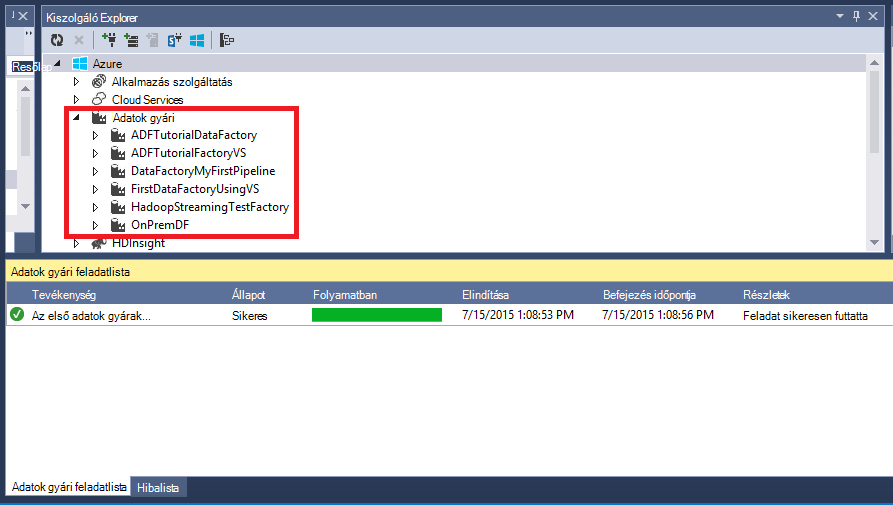

<properties 
    pageTitle="Oktatóprogram: Hozzon létre egy folyamat másolás tevékenység Visual Studio segítségével |} Microsoft Azure" 
    description="Ebben az oktatóanyagban létrehozása az Azure Data Factory folyamat egy másolatot a tevékenységhez a Visual Studio használatával." 
    services="data-factory" 
    documentationCenter="" 
    authors="spelluru" 
    manager="jhubbard" 
    editor="monicar"/>

<tags 
    ms.service="data-factory" 
    ms.workload="data-services" 
    ms.tgt_pltfrm="na" 
    ms.devlang="na" 
    ms.topic="get-started-article" 
    ms.date="10/17/2016" 
    ms.author="spelluru"/>

# Oktatóprogram: Hozzon létre egy folyamat másolás tevékenység Visual Studio segítségével
> [AZURE.SELECTOR]
- [Áttekintés és a vonatkozó követelmények](data-factory-copy-data-from-azure-blob-storage-to-sql-database.md)
- [Másolja a varázsló](data-factory-copy-data-wizard-tutorial.md)
- [Azure portál](data-factory-copy-activity-tutorial-using-azure-portal.md)
- [Visual Studio](data-factory-copy-activity-tutorial-using-visual-studio.md)
- [A PowerShell](data-factory-copy-activity-tutorial-using-powershell.md)
- [Erőforrás-kezelő Azure-sablon](data-factory-copy-activity-tutorial-using-azure-resource-manager-template.md)
- [REST API-VAL](data-factory-copy-activity-tutorial-using-rest-api.md)
- [.NET API](data-factory-copy-activity-tutorial-using-dotnet-api.md)

Ebből az oktatóanyagból megtudhatja, hogyan hozhat létre, és figyelemmel az Azure adatok gyári a Visual Studio segítségével. Az adatok gyári folyamat egy példány tevékenység használja az adatok másolása az Azure Blob-tárolóhoz az Azure SQL-adatbázis.

Az alábbiakban a részeként ebben az oktatóanyagban végrehajtandó lépések:

1. Hozzon létre két csatolt szolgáltatások: **AzureStorageLinkedService1** és **AzureSqlinkedService1**. 

    A AzureStorageLinkedService1 kapcsolódik az Azure tárhely, és AzureSqlLinkedService1 Azure SQL-adatbázishoz csatolja az adatok gyári: **ADFTutorialDataFactoryVS**. A bemeneti adatok az a folyamat az Azure blob-tárolóban lévő blob-tárolóban található, és a kimeneti adatok egy táblázatban az Azure SQL-adatbázisban vannak tárolva. Ezért vesz fel két áruház csatolt szolgáltatásként adatok gyári.
2. Hozzon létre két adatkészleteket: **InputDataset** és **OutputDataset**, amely jelenítik meg a bemeneti és kimeneti tárolt adatokra van az adatokat tárolja. 

    A a InputDataset adja meg a blob-tárolóhoz, amely tartalmazza a forrásadatokat blob. A a OutputDataset adja meg az SQL táblázat, amely a kimeneti adatokat tárolja. Egyéb tulajdonságait, például a struktúra, elérhetőségét és házirend is adja meg.
3. Hozzon létre egy **ADFTutorialPipeline** a ADFTutorialDataFactoryVS a nevű folyamat. 

    A folyamat a másolatok bemeneti adatok az Azure blob-e az Azure SQL-eredménytábla **Másolás tevékenységet** tartalmaz. A Másolás tevékenység az adatok mozgását Azure Data Factory hajt végre. A tevékenység globálisan elérhető szolgáltatással, amely másolhatja az adatokat a különböző adatokat tárolja, biztonságos, megbízható és méretezhető útján között van-e kapcsolva. [Mozgás a tevékenységekre vonatkozó adatok](data-factory-data-movement-activities.md) cikk lásd: a Másolás tevékenység kapcsolatban további tájékoztatást. 
4. Hozzon létre egy **VSTutorialFactory**nevű adatok gyári. Telepítse az adatok gyári és minden adat gyári entitás (csatolt szolgáltatások, táblázatok és a folyamat).    

## Előfeltételek

1. Olvassa el a [Oktatóprogram áttekintése](data-factory-copy-data-from-azure-blob-storage-to-sql-database.md) cikket, és hajtsa végre a **előfeltétel** . 
2. A **rendszergazda az Azure előfizetés** Data Factory szervezetek közzététele Azure Data Factory engedélyezni kell lennie.  
3. A következő, a számítógépen telepítve kell rendelkeznie: 
    - Visual Studio 2013 vagy a Visual Studio 2015
    - Töltse le a Visual Studio 2013 vagy a Visual Studio 2015 Azure SDK csomagjában talál. Nyissa meg [Azure töltse le a lapot](https://azure.microsoft.com/downloads/) , és kattintson **és 2013-ban** vagy a **VIEWBEN 2015** **.NET** szakaszában.
    - Töltse le a legújabb Azure Data Factory beépülő modul for Visual Studio: [és 2013-ban](https://visualstudiogallery.msdn.microsoft.com/754d998c-8f92-4aa7-835b-e89c8c954aa5) vagy [a Skype 2015 VIEWBEN](https://visualstudiogallery.msdn.microsoft.com/371a4cf9-0093-40fa-b7dd-be3c74f49005). A beépülő modul is frissítheti az alábbi lépésekkel: menüben kattintson az **eszközök** -> **Extensions és frissítések** -> **Online** -> **Visual Studio gyűjtemény** -> **A Microsoft Azure adatok gyári Tools for Visual Studio** -> **frissítése**.

## Visual Studio projekt létrehozása 
1. Indítsa el a **Visual Studio 2013**. Kattintson a **fájl**fülre, mutasson az **Új**, és kattintson a **Projekt**. Meg kell jelennie a **Új** párbeszédpanel.  
2. Az **Új projekt** párbeszédpanelen válassza ki a **DataFactory** sablont, és kattintson az **Üres adatok Factory-projektet**. Ha nem látja a DataFactory sablont, zárja be a Visual Studio, telepítse az Azure SDK a Visual Studio 2013, és nyissa meg újra a Visual Studio.  

    

3. Írja be a **nevét** a projekt, **helyét**és nevét a **megoldást**, és kattintson az **OK gombra**.

     

## Hozzon létre csatolt szolgáltatások
Csatolt szolgáltatások hivatkozás adatokat tárolja, vagy az Azure adatok gyári szolgáltatások számítja ki. Lásd: [támogatott adatokat tárolja](data-factory-data-movement-activities.md##supported-data-stores-and-formats) az adatforrások és a Másolás tevékenység által támogatott mosdók. Lásd: a [csatolt szolgáltatások kiszámítása](data-factory-compute-linked-services.md) az adatok gyári által támogatott számítási szolgáltatások listában. Ebben az oktatóanyagban bármely számítási szolgáltatás nem használja. 

Ebben a lépésben hoz létre két csatolt szolgáltatások: **AzureStorageLinkedService1** és **AzureSqlLinkedService1**. AzureStorageLinkedService1 csatolt szolgáltatás hivatkozások Azure tárterület-fiók és AzureSqlLinkedService Azure SQL-adatbázishoz csatolja az adatok gyári: **ADFTutorialDataFactory**. 

### A csatolt Azure tároló szolgáltatás hozzon létre

4. Kattintson a jobb gombbal **a csatolt szolgáltatások** a megoldást Intéző, mutasson a **Felvétel**, és kattintson az **Új elem**gombra.      
5. **Új elem hozzáadása** párbeszédpanelen jelölje be a **Csatolt Azure Tárhelyszolgáltatáshoz** a listából, és kattintson a **Hozzáadás**gombra. 

    
 
3. Csere `<accountname>` és `<accountkey>`* Azure tároló fiókja és a kulcs a nevet. 

    

4. Mentse a **AzureStorageLinkedService1.json** fájlt.

> Kapcsolatos további tudnivalók: [adatok a/Azure Blob áthelyezése](data-factory-azure-blob-connector.md#azure-storage-linked-service) JSON tulajdonságait.

### A csatolt Azure SQL-szolgáltatás hozzon létre

5. Kattintson a jobb gombbal a **Csatolt szolgáltatások** csomópontot a **Megoldást Explorer** újra, mutasson a **Hozzáadás gombra**, és kattintson az **Új elem**gombra. 
6. Ebben az esetben válassza az **Azure SQL-csatolt szolgáltatás**, és kattintson a **Hozzáadás**gombra. 
7. Cserélje le a **AzureSqlLinkedService1.json fájl** `<servername>`, `<databasename>`, `<username@servername>`, és `<password>` nevek a Azure SQL server, az adatbázis, a felhasználói fiókot, és a jelszavát.    
8.  Mentse a **AzureSqlLinkedService1.json** fájlt. 

> [AZURE.NOTE]
> Kapcsolatos további tudnivalók: [adatok a/Azure SQL-adatbázis áthelyezése](data-factory-azure-sql-connector.md#azure-sql-linked-service-properties) JSON tulajdonságait.

## Adatkészletek létrehozása
Az előző lépésben létrehozott csatolt **AzureStorageLinkedService1** és szolgáltatások **AzureSqlLinkedService1** Azure tároló fiókot és Azure SQL-adatbázis csatolása az adatok gyári: **ADFTutorialDataFactory**. Ebben a lépésben két adatkészleteket – **InputDataset** és **OutputDataset** – az adatok tárolóban AzureStorageLinkedService1 és AzureSqlLinkedService1 említett van tárolva bemeneti és kimeneti adatokat megjelenítő határozza meg. A InputDataset adja meg a blob-tárolóhoz, amely tartalmazza a forrásadatokat blob. A OutputDataset adja meg az SQL táblázat, amely a kimeneti adatokat tárolja.

### Beviteli adatkészlet létrehozása
Ebben a lépésben hozzon létre egy adatkészlet nevű **InputDataset** , amely a csatolt **AzureStorageLinkedService1** szolgáltatás jelöli Azure-tárolóban lévő blob-tárolóhoz mutat. Táblázat a téglalap alakú adatkészlet és a támogatott pillanatban adatkészlet csak típusát. 

9. Kattintson a jobb gombbal a **táblákat** az **Solution Explorer**, mutasson a **Hozzáadás gombra**, és kattintson az **Új elem**gombra.
10. **Új elem hozzáadása** párbeszédpanelen jelölje be az **Azure Blob**, és kattintson a **Hozzáadás**gombra.   
10. A JSON szöveget cserélje ki az alábbi szöveget, és mentse a **AzureBlobLocation1.json** fájlt. 

        {
          "name": "InputDataset",
          "properties": {
            "structure": [
              {
                "name": "FirstName",
                "type": "String"
              },
              {
                "name": "LastName",
                "type": "String"
              }
            ],
            "type": "AzureBlob",
            "linkedServiceName": "AzureStorageLinkedService1",
            "typeProperties": {
              "folderPath": "adftutorial/",
              "format": {
                "type": "TextFormat",
                "columnDelimiter": ","
              }
            },
            "external": true,
            "availability": {
              "frequency": "Hour",
              "interval": 1
            }
          }
        }

     Vegye figyelembe az alábbiakat: 
    
    - adatkészlet **típus** **AzureBlob**van beállítva.
    - **linkedServiceName** **AzureStorageLinkedService**értékre van állítva. A 2 létrehozott csatolt szolgáltatást.
    - a **adftutorial** tároló **Mappa_útvonala** van beállítva. Adja meg a nevét a **fájlnév** tulajdonságot használó mappában tárolt blob is. Nem a blob nevét adja meg, mivel minden BLOB-tárolóban adatainak tekinteni egy bemeneti adatok.  
    - formátum **típusa** **TextFormat** beállítása
    - Három elem látható a szövegfájl – **Utónév** és **Vezetéknév** – (**columnDelimiter**) karakterrel vesszővel elválasztott 
    - Az **Elérhetőség** értéke **óránként** (**gyakoriság** értéke **órát** és **intervallum** értéke **1**). Ezért Data Factory megkeresi a bemeneti adatok óránként blob-tárolóhoz (**adftutorial**) megadott a legfelső szintű mappájára. 
    
    Ha Ön nem adja a **bemeneti** adatkészlet egy **fájlnevet** , valamennyi fájlok/BLOB a bemeneti mappából (**Mappa_útvonala**) bemeneti adatok alapján számít. A JSON ad meg egy fájlnevet, ha csak a megadott fájl/blob tekintendő asn beviteli.
 
    Ha nem ad meg egy **fájlnevet** egy **eredménytábla**, a **Mappa_útvonala** a létrehozott fájlok neve a következő formátumban: adatok. &lt;Globálisan egyedi azonosítója\&gt;. a txt (Példa: Data.0a405f8a-93ff-4c6f-b3be-f69616f1df7a.txt.).

    **Mappa_útvonala** és **fileName** dinamikusan alapján a **SliceStart** időpontot szeretne beállítani, a **partitionedBy** tulajdonsággal. A következő példában Mappa_útvonala használja évet, hónapot és napot az a SliceStart (a feldolgozása szeletet kezdetének), valamint fileName a SliceStart órára. Ha például az darab készült szelet 2016-09-20T08:00:00, a mappanév wikidatagateway/wikisampledataout/2016/09/20 van állítva, és a fájlnév 08.csv van beállítva. 

            "folderPath": "wikidatagateway/wikisampledataout/{Year}/{Month}/{Day}",
            "fileName": "{Hour}.csv",
            "partitionedBy": 
            [
                { "name": "Year", "value": { "type": "DateTime", "date": "SliceStart", "format": "yyyy" } },
                { "name": "Month", "value": { "type": "DateTime", "date": "SliceStart", "format": "MM" } }, 
                { "name": "Day", "value": { "type": "DateTime", "date": "SliceStart", "format": "dd" } }, 
                { "name": "Hour", "value": { "type": "DateTime", "date": "SliceStart", "format": "hh" } } 

> [AZURE.NOTE]
> Kapcsolatos további tudnivalók: [adatok a/Azure Blob áthelyezése](data-factory-azure-blob-connector.md#azure-blob-dataset-type-properties) JSON tulajdonságait.

### Kimeneti adatkészlet létrehozása
Ebben a lépésben létrehoz egy **OutputDataset**nevű kimeneti adatkészlet. Ez az adatkészlet az **AzureSqlLinkedService1**jelöli Azure SQL-adatbázis táblájához SQL mutat. 

11. Kattintson ismét a jobb gombbal a **Megoldást Explorer** **táblák** , mutasson a **Hozzáadás gombra**, és kattintson az **Új elem**gombra.
12. **Új elem hozzáadása** párbeszédpanelen jelölje be az **Azure SQL**, és kattintson a **Hozzáadás**gombra. 
13. A JSON szöveget cserélje ki az alábbi JSON, és mentse a **AzureSqlTableLocation1.json** fájlt.

        {
          "name": "OutputDataset",
          "properties": {
            "structure": [
              {
                "name": "FirstName",
                "type": "String"
              },
              {
                "name": "LastName",
                "type": "String"
              }
            ],
            "type": "AzureSqlTable",
            "linkedServiceName": "AzureSqlLinkedService1",
            "typeProperties": {
              "tableName": "emp"
            },
            "availability": {
              "frequency": "Hour",
              "interval": 1
            }
          }
        }

     Vegye figyelembe az alábbiakat: 
    
    - adatkészlet **típusú** **AzureSQLTable**van beállítva.
    - **linkedServiceName** **AzureSqlLinkedService** (létrehozott csatolt szolgáltatást a 2) értékre van állítva.
    - **táblanév** **a vállalati projektirányítási**értékre van állítva.
    - Három oszlop van – **Azonosítót**, **Vezetéknév**és **Utónév** – a vállalati projektirányítási táblázatban az adatbázisban. Azonosító-azonosító oszlop, így csak a **Vezetéknév** és **Utónév** Itt határozhatja meg kell.
    - **Elérhetőség** a **óránként** (**gyakoriság** **órára** és **intervallum** értéke **1**) értékre van állítva.  Az adatok gyári szolgáltatás készít egy kimenet szeletre óránként a **Vállalati projektirányítási** táblázat az Azure SQL-adatbázisban.

> [AZURE.NOTE]
> Kapcsolatos további tudnivalók: [adatok a/Azure SQL-adatbázis áthelyezése](data-factory-azure-sql-connector.md#azure-sql-linked-service-properties) JSON tulajdonságait.

## Folyamat létrehozása 
Bemeneti és kimeneti csatolt szolgáltatások és -táblázatok eddig hozott létre. Most, létrehozhat egy folyamat másolja a vágólapra **Másolás tevékenység** adatait az Azure blob-Azure SQL-adatbázishoz. 

1. Kattintson a jobb gombbal a **Megoldást Explorer** **folyamatok** , mutasson a **Hozzáadás gombra**, és kattintson az **Új elem**gombra.  
15. Az **Új elem hozzáadása** párbeszédpanelen jelölje be a **Másolás adatok folyamat** , és kattintson a **Hozzáadás**gombra. 
16. A JSON cserélje ki az alábbi JSON, és mentse a **CopyActivity1.json** fájlt.
            
        {
          "name": "ADFTutorialPipeline",
          "properties": {
            "description": "Copy data from a blob to Azure SQL table",
            "activities": [
              {
                "name": "CopyFromBlobToSQL",
                "type": "Copy",
                "inputs": [
                  {
                    "name": "InputDataset"
                  }
                ],
                "outputs": [
                  {
                    "name": "OutputDataset"
                  }
                ],
                "typeProperties": {
                  "source": {
                    "type": "BlobSource"
                  },
                  "sink": {
                    "type": "SqlSink",
                    "writeBatchSize": 10000,
                    "writeBatchTimeout": "60:00:00"
                  }
                },
                "Policy": {
                  "concurrency": 1,
                  "executionPriorityOrder": "NewestFirst",
                  "style": "StartOfInterval",
                  "retry": 0,
                  "timeout": "01:00:00"
                }
              }
            ],
            "start": "2015-07-12T00:00:00Z",
            "end": "2015-07-13T00:00:00Z",
            "isPaused": false
          }
        }

    Vegye figyelembe az alábbiakat:

    - A tevékenységek csoportban található csak egy tevékenység, amelynek a **típus** értéke **másolása**
    - A tevékenységhez tartozó bemeneti **InputDataset** van állítva, és a tevékenység kimeneti **OutputDataset**van beállítva.
    - **TypeProperties** csoportban a forrás típusa **BlobSource** van megadva, és **SqlSink** van megadva, gyűjtő típust.

    A **Kezdés** tulajdonság értékét cserélje le az aktuális nap és **Záró** érték, a következő napra. Adja meg csak a dátum részt, és ugorja át az időrészre, a dátum-idő. Ha például "2016-02-03", amely egyenértékű "2016 – 02-03T00:00:00Z"
    
    Mindkét indítsa el, és a záró időpontok [ISO formátumban](http://en.wikipedia.org/wiki/ISO_8601)kell lennie. Példa: 2016 – 10-14T16:32:41Z. A **befejezési** idő nem kötelező, de ebben az oktatóanyagban használjuk. 
    
    Ha nem adja meg a **befejezési** tulajdonság értékét, mint "**Kezdés + 48 óra**" számítja ki. A folyamat végtelen időre szóló futtatásához adja meg az érték a **befejezési** tulajdonság **9999-09-09** .
    
    Az előző példában vannak 24 adatok szeletek minden szeletre óránként előállított-e.

## Adatok gyári szervezetek közzététele és terjesztése
Ebben a lépésben Data Factory személyek (csatolt szolgáltatások adatkészleteket és folyamat) közzététele korábban létrehozott. Is megadhatja az új adatok gyári létrehozni, tartsa lenyomva az ujját ezen személyek nevét.  

18. Kattintson a jobb gombbal a project a megoldást Intézőben, és kattintson a **Közzététel**gombra. 
19. **Jelentkezzen be Microsoft-fiókja** párbeszédpanel jelenik meg, ha az Azure előfizetéssel rendelkező adja meg a hitelesítő adatait, és kattintson a **Bejelentkezés**gombra.
20. Meg kell jelennie a következő párbeszédpanelen:

    
21. Az adatok gyári konfigurálása lapon hajtsa végre az alábbi lépéseket: 
    1. **Hozzon létre új Data Factory** beállítással.
    2. Írja be a **VSTutorialFactory** **jelölőnégyzetét**.  
    
        > [AZURE.IMPORTANT]  
        > Az Azure adatok gyári neve globálisan egyedinek kell lennie. Ha közzétételekor kapcsolatos adatok gyári neve hibaüzenetet kap, az adatok gyári (például yournameVSTutorialFactory), és próbálja meg ismét a közzétételi nevének módosítása. [Adatok Factory - elnevezési szabályai](data-factory-naming-rules.md) témakört vonatkozó adatok gyári eltérések elnevezési szabályokat.     
    3. Kattintson az **előfizetés** mező Azure előfizetését.
     
        > [AZURE.IMPORTANT]Ha nem látható minden előfizetés, győződjön meg arról, bejelentkezve, hogy a rendszergazda vagy az előfizetés további rendszergazdai fiókkal.  
    4. a data factory létrehozni az **erőforráscsoport** kijelölése 5. Az adatok gyári **terület** kijelölése Csak az adatok gyári szolgáltatás által támogatott régiók jelennek meg a legördülő listában.
6. Kattintson a **Tovább gombra** kattintva lépjen az **Elemek közzététele** lapra.
    
           
23. Az **Elemek közzététel** lapon győződjön meg róla, hogy az adatok gyárak szervezetek legyen kijelölve, majd kattintson a **Tovább gombra** kattintva lépjen az **összefoglaló** lapra.
    
         
24. Tekintse át az összefoglaló, és kattintson a **Tovább gombra** kattintva indítsa el a telepítési folyamatot, és a **Telepítés állapotának**megtekintése gombra.

    
25. A **Telepítési állapota** lapon a telepítés állapotának láthatók. Miután végzett a telepítést, kattintson a Befejezés gombra. 
     vegye figyelembe az alábbiakat: 

- Ha a hiba jelenik meg: "**az előfizetés nem regisztrált névtér Microsoft.DataFactory**", tegye a következők egyikét, és próbálja meg újra közzétenni: 

    - Az Azure PowerShell, az adatok gyári szolgáltató regisztrálhatja a következő parancsot. 
        
            Register-AzureRmResourceProvider -ProviderNamespace Microsoft.DataFactory
    
        Győződjön meg arról, hogy a következő parancsot a szolgáltató van regisztrálva Data Factory futtatható. 
    
            Get-AzureRmResourceProvider
    - Jelentkezzen be az [Azure portál](https://portal.azure.com) az Azure-előfizetést használ, és keresse meg a Data Factory lap (vagy) létrehozása adatok gyár az Azure-portálon. Ez a művelet automatikusan regisztrálja a szolgáltató meg.
-   Az adatok gyári neve bejegyezhető DNS nevével ennélfogva és a jövőben nyilvánosan láthatóvá válnak.

> [AZURE.IMPORTANT] Adatok Factory-példányok létrehozásához kell lennie a felügyeleti/további-rendszergazda az Azure előfizetés

## Összefoglalás
Ebben az oktatóprogramban egy Azure adatok gyári másolása létrehozott adatainak egy Azure blob-Azure SQL-adatbázishoz. Visual Studio hozta létre az adatok gyári, csatolt szolgáltatások, adatkészleteket és a folyamat. Ha végzett, ebben az oktatóanyagban a magas szintű lépések a következők:  

1.  Az Azure **adatok gyári**létre.
2.  Hozzon létre **csatolt szolgáltatások**:
    1. Hivatkozás: Azure tárterület-fiókját a bemeneti adatokat tartalmazó az **Azure tároló** csatolt szolgáltatások.    
    2. Egy **Azure SQL** szolgáltatás, amelyre a hivatkozás a kimeneti adatokat tároló Azure SQL-adatbázishoz csatolja. 
3.  Létrehozott **adatkészleteket**, amelyek leírják a bemeneti és kimeneti adatok számára a folyamatok.
4.  Forrás- és **SqlSink** gyűjtő, mint egy **Példány tevékenység** **BlobSource** létre **folyamat** . 

## Kiszolgáló Intézővel gyárak adatok megtekintése

1. A **Visual Studióban**kattintson a **Nézet** menü, és kattintson a **Kiszolgáló Intéző**.
2. A kiszolgáló-kezelő ablakban bontsa ki az **Azure** , és bontsa ki a **Data Factory**. Ha megjelenik a **Visual Studio jelentkezzen be**, adja meg a **fiók** az Azure-előfizetéséhez társított, és kattintson a **Tovább**gombra. Írja be a **jelszót**, és kattintson a **Bejelentkezés**gombra. Visual Studio próbálja az előfizetése összes Azure adatok gyárak adatainak. Ez a művelet az **Adatok gyári feladatlista** ablakban állapotának megtekintése.
    
3. Kattintson a jobb gombbal egy adatok gyár, és válassza a Data Factory exportálása egy meglévő adatok gyári alapján Visual Studio projekt létrehozása új projekthez.
      

## Frissítés a Microsoft Visual Studio Data Factory eszközök
Azure Data Factory tools for Visual Studio frissítéséhez kövesse az alábbi lépéseket:

1. Kattintson az **eszközök** menü, és kattintson a **bővítmények és frissítések**. 
2. A bal oldali ablaktáblában válassza a **frissítések** , és válassza a **Visual Studio gyűjtemény**.
4. Jelölje ki az **Azure Data Factory tools for Visual Studio** , és kattintson a **frissítés**gombra. Ha nem látja ezt a bejegyzést, akkor már van az eszközök legújabb verzióját. 

Lásd: a [Monitor adatkészleteket, és a folyamat](data-factory-copy-activity-tutorial-using-azure-portal.md#monitor-pipeline) kapcsolatos tudnivalókat az Azure portal segítségével figyelheti a folyamat és adatkészleteket létrehozott, ebben az oktatóanyagban.

## Lásd még:
| A témakör | Leírás |
| :---- | :---- |
| [Mozgás a tevékenységekre vonatkozó adatok](data-factory-data-movement-activities.md) | Ez a cikk a Másolás tevékenység használta az oktatóprogram részletes információt tartalmaz. |
| [Ütemezés- és végrehajtása](data-factory-scheduling-and-execution.md) | Ez a cikk ismerteti az Azure Data Factory alkalmazásmodell ütemezési és a végrehajtás szempontjait. |
| [Folyamatok](data-factory-create-pipelines.md) | Ez a cikk segít megérteni a folyamatok és Azure Data Factory tevékenységek |
| [Adatkészletek](data-factory-create-datasets.md) | Ez a cikk segít megérteni az Azure Data Factory adatkészleteket.
| [Figyelésére és figyelése alkalmazással folyamatok kezelése](data-factory-monitor-manage-app.md) | Ez a cikk leírja, hogy miként figyelheti, kezelése és használata a figyelő és felügyeleti alkalmazás folyamatok hibakeresési. 
