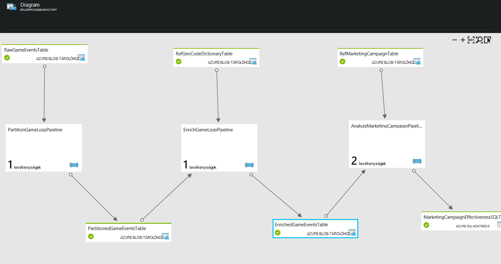

<properties 
    pageTitle="Használatieset - ügyfelek adatainak összegyűjtése" 
    description="Megtudhatja, hogyan használható az Azure Data Factory adatalapú munkafolyamat (folyamat) játék ügyfelek profil létrehozása." 
    services="data-factory" 
    documentationCenter="" 
    authors="sharonlo101" 
    manager="jhubbard" 
    editor="monicar"/>

<tags 
    ms.service="data-factory" 
    ms.workload="data-services" 
    ms.tgt_pltfrm="na" 
    ms.devlang="na" 
    ms.topic="article" 
    ms.date="09/06/2016" 
    ms.author="shlo"/>

# Használatieset - ügyfelek adatainak összegyűjtése

Azure Data Factory a Cortana intelligencia programcsomag megoldás gyorsítók végrehajtásához használt sok szolgáltatások közül.  A Cortana intelligenciával kapcsolatos további információkért keresse fel a [Cortana üzletiintelligencia-csomagot](http://www.microsoft.com/cortanaanalytics). A dokumentum egy egyszerű használatieset segít – első lépések bemutatása, hogyan Azure Data Factory is problémamegoldó közös analytics azt ismertetik.

Szeretne elérni, és próbálja ki az egyszerű használat esetben csak egy [Azure előfizetés](https://azure.microsoft.com/pricing/free-trial/).  Mintaként szolgáló, amely a használati eset a [minták](data-factory-samples.md) cikkben ismertetett lépéseket követve telepítheti.

## Eset

A contoso, amely több platformokon játékok hoz létre játék vállalata: játékok konzol, a kézi eszköz eszközök és a személyi számítógép (PC-re). Játékosokat ezek játékok, mint naplóadatok nagy mennyiségű elő, amely nyomon követi a szokásai, játék stílusának és a felhasználó beállításai parancsra.  A területi demográfiai, kombinálva és termékadatok, Contoso elemzések is hogy segítségével iránymutatást adjon arról, hogy miként tárhelyén lejátszó tartalmasabbá teszi őket, és azokat a frissítéseket és a mérkőzés szavakat cél vásárol. 

Contoso cél, hogy a szereplők játék előzményei alapján felfelé-értékesítés/határokon-értékesítés lehetőségek azonosítása, és látványos szolgáltatások hozzáadása a meghajtó üzleti NÖV, és adja meg a hatékonyabb működését ügyfeleknek. A használatieset-példa egy üzleti játék vállalata használja azt. A vállalat optimalizálja a játékok tárhelyén lejátszó tevékenysége alapján szeretne. Ezek az elvek minden üzleti, amelyek ügyfelei körül a termékek és szolgáltatások vesznek és ügyfeleik tartalmasabbá teszi szeretne alkalmazni.

## Kihívásokkal kapcsolatban

## Megoldás – áttekintés

Az egyszerű használat eset szerepel példaként, hogyan használhatja Azure Data Factory ingest, előkészítése, átalakítás, elemezheti és adatok közzététele használható.

Az alábbi ábrán ábrázolja, hogy az adatok folyamatok után jelennek meg az Azure-portálon telepítve van.

1.  A **PartitionGameLogsPipeline** beolvassa az nyers játék események blob-tárolóhoz, és évet, hónapot és napot alapján partíciót hoz létre.
2.  A **EnrichGameLogsPipeline** geo kód hivatkozási adatok particionált játék események csatlakozik, és az adatok dúsítja IP-címek a megfelelő geo helyekre összekapcsolásával.
3.  A **AnalyzeMarketingCampaignPipeline** folyamat használja a bővített adatok, és dolgozza fel a hozhat létre a végleges eredménye, amely tartalmazza a marketingtevékenység marketingkampány hatékonyságát hirdetési adatokkal.

Ebben a példában a Data Factory szolgál a téve a bemeneti adatok, az átalakítás és a folyamat az adatok másolása és Azure SQL-adatbázishoz végleges adatainak és tevékenységek.  A hálózat adatok folyamatok ábrázolása, kezelheti őket, és a felhasználói felületen állapotuk figyelése.

## Legfontosabb előny

Optimalizálása a felhasználói profil analytics és a igazítás, a vállalati célok játék vállalat el tudja látni gyűjthet gyorsan szokásai, és elemzése a marketingkampányok hatékonyságát.

