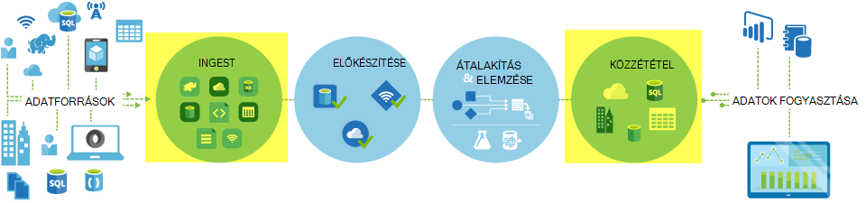
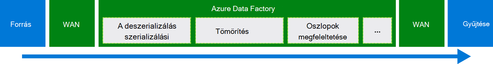
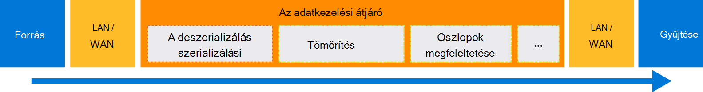

<properties
    pageTitle="Adatok áthelyezése a Másolás tevékenység |} Microsoft Azure"
    description="További tudnivalók: adatok mozgás az adatok gyári folyamatok: adatok áttelepítése felhő tárolja, és egy helyszíni áruház és a felhő üzlet közötti. Használja a Másolás tevékenységet."
    keywords="másolja az adatokat, adatok mozgását, adatok áttelepítése, adatátviteli"
    services="data-factory"
    documentationCenter=""
    authors="linda33wj"
    manager="jhubbard"
    editor="monicar"/>

<tags
    ms.service="data-factory"
    ms.workload="data-services"
    ms.tgt_pltfrm="na"
    ms.devlang="na"
    ms.topic="article"
    ms.date="09/22/2016"
    ms.author="jingwang"/>

# Adatok áthelyezése másolás tevékenység használatával

## – Áttekintés
Azure Data Factory, a Másolás tevékenységet, több különböző alakzatra vonatkozó adatok a különféle helyszíni és felhőbeli adatforrások Azure is használhatja. Adatok másolása, után képes kell további transzformált és elemezheti. Másolás tevékenység közzétenni, átalakítási és az üzleti üzletiintelligencia- és az alkalmazás felhasználási elemzés eredménye is használhatja.

Másolás tevékenység van-e kapcsolva, a biztonságos megbízható, méretezhető, és [világszerte elérhető szolgáltatásokat](#global). Ez a cikk részletesen adatok mozgását Data Factory és a Másolás tevékenységét.

Először lássuk, hogyan adatok áttelepítése fordul elő, két felhő adatokat tárolja, és egy helyszíni adatok áruházból és a felhő adattár közötti.

> [AZURE.NOTE] Az általános tevékenységek kapcsolatos további tudnivalókért olvassa el a [ismertetése folyamatok és a tevékenységek](data-factory-create-pipelines.md)című témakört.

### Az adatok között két felhő adatokat tárolja másolása
Forrás- és gyűjtő adatokat tárolja a felhőben vannak, Másolás tevékenység kerül a következő szakaszokat, amelyeket a forrás adatainak másolása a gyűjtő keresztül. A Másolás tevékenység hatásköröket szolgáltatásban:

1. Adatokat olvas be a forrás adatainak áruházból.
2. Szerializálási/deszerializálás, a tömörítés/kibontási, a hozzárendelés oszlop hajt végre, és írja be a konvertálás. Ezeket a műveleteket a bemeneti adatkészlet, a kimeneti adatkészlet és a Másolás tevékenység beállításai alapján igen.
3.  Az adatok céltárat adatot ír.

A szolgáltatás automatikusan választ az optimális régió, az adatok mozgását végrehajtásához. Ez a terület az általában az egyik legközelebb a gyűjtő adatokat tároló.

### Adatok másolása egy helyszíni adatok áruházból és a felhő adattár között
Biztonságos adatok áthelyezése fiókok között egy helyszíni adatok áruházból és a felhő adattár, telepítse az adatkezelési átjáró a helyszíni számítógépre. Az adatkezelési átjáró, amely lehetővé teszi, hogy a hibrid adat mozgását és feldolgozása ügynökszoftvert. Telepítheti azt ugyanazon a gépen az adatok tárolására magát, illetve másik számítógépre, amely nem tud hozzáférni az adatok áruházból.

Ebben az esetben az adatkezelési átjáró a szerializálási/deszerializálás, a tömörítés/kibontási, a hozzárendelés oszlop hajt végre, és írja be a konvertálás. Nem adatfolyam az Azure Data Factory szolgáltatáson keresztül. Ehelyett az adatkezelési átjáró közvetlenül a adatot ír a céltár.

Lásd: [adatok áthelyezése fiókok között a helyszíni és felhőbeli adatokat tárolja](data-factory-move-data-between-onprem-and-cloud.md) egy – bevezetés és áttekintése a következő. Lásd: az [Adatkezelési átjáró](data-factory-data-management-gateway.md) a ügynök részletes információt.

Úgy is átvihet az adatkezelési átjáró segítségével Azure IaaS virtuális gépeken futó (VMs) tárolt adatok rögzítése támogatott adatokat tárolja. Ebben az esetben telepíthető az adatkezelési átjáró a azonos virtuális az adatok tárolására magát, illetve a egy külön virtuális, amely nem tud hozzáférni a adatokat tároló.

## Támogatott adatokat tárolja, és formátumok
[AZURE.INCLUDE [data-factory-supported-data-stores](../../includes/data-factory-supported-data-stores.md)]

Ha módosítani szeretné áthelyezni/származó adatok adatok tárolására, hogy a Másolás tevékenység nem támogatja, használata egy **egyéni tevékenységeket** az adatok gyári saját logika az adatok másolása és áthelyezése. Létrehozásával és használatával egyéni tevékenység részletekért olvassa el [az Azure Data Factory során egyéni tevékenységeknek](data-factory-use-custom-activities.md).

### Támogatott fájlformátumok
Fájlok másolása Másolás tevékenység is használhatja-két fájlalapú adatokat tárolja, például Azure Blob, a fájlrendszer és a Fájlrendszerhez között van. Ehhez kihagyhatja a mind a bemeneti és kimeneti adatkészlet definíciók [formátuma szakaszban](data-factory-create-datasets.md) . Az adatokat a program hatékony bármely szerializálási deszerializálás nélkül.

Másolás tevékenység is beolvassa, és a megadott formátumú fájlok ír: szöveg, Avro, ORC, Parquet és JSON. A következő másolás tevékenységek, például végezheti el:

-   Adatok másolása Azure Blob-szöveg (CSV) formátumban, és Azure SQL-adatbázis írni.
-   Fájlok másolása szöveg (CSV) formátumban a fájlrendszerben helyszíni, és Azure Blob írási Avro formátumban.
-   Adatok másolása Azure SQL-adatbázisban, és az írási Fájlrendszerhez helyszíni ORC formátumban.

## Mozgás világszerte elérhető adatok
Azure Data Factory csak a nyugati Amerikai Egyesült Államok, kelet-amerikai és Észak-Európa régióban érhető el. Azonban a szolgáltatást, amely a Másolás tevékenység hatásköröket érhető el globális az alábbi régiókban és geographies. A világszerte elérhető topológia hatékony adatok mozgását, amely általában nem határokon-régió Ugrás biztosítja. Lásd: a [Services régió szerint](https://azure.microsoft.com/regions/#services) az elérhetőség Data Factory és adatok mozgás egy tartomány.

### Adatok másolása a felhőben adatokat tárolja között
Ha forrás- és gyűjtő adatokat tárolja a felhőben, adatok gyári az régiót, amelynek a gyűjtő ugyanazt a geography, az adatok áthelyezése a legközelebb áll a szolgáltatás telepítési használja. Olvassa el az alábbi táblázat a leképezéshez:

Az adatok céltárat területe | Adatok mozgását használt terület
:----------------------------------- | :----------------------------
Kelet-Amerikai Egyesült Államok | Kelet-Amerikai Egyesült Államok
Kelet-amerikai 2 | Kelet-amerikai 2
Nyugati Amerikai Egyesült Államok | Nyugati Amerikai Egyesült Államok
Nyugati USA-beli 2 | Nyugati Amerikai Egyesült Államok
A központi Amerikai Egyesült Államok | A központi Amerikai Egyesült Államok
Nyugati központi Amerikai Egyesült Államok | A központi Amerikai Egyesült Államok
A központi Észak-amerikai | A központi Észak-amerikai
A központi Dél-Amerikai Egyesült Államok | A központi Dél-Amerikai Egyesült Államok
Észak-Európa | Észak-Európa
Nyugati Európa | Nyugati Európa
Délkelet-ázsiai | Délkelet-ázsiai
Kelet-ázsiai | Délkelet-ázsiai
Japán keleti | Japán keleti
Japán nyugati | Japán keleti
Brazília Dél | Brazília Dél
Ausztrália keleti | Ausztrália keleti
Ausztrália Könyvesbolt is. | Ausztrália Könyvesbolt is.
A központi India | A központi India
Dél-indiai | A központi India
Nyugati India | A központi India

> [AZURE.NOTE] Adatok céltár régiója nem szerepel a fenti listában, ha, ahelyett hogy egy alternatív terület másolás tevékenység sikertelen lesz.

### Adatok másolása egy helyszíni adatok áruházból és a felhő adattár között
Ha adatokat másolja a helyszíni (vagy Azure virtuális gépeken futó/IaaS) között, és felhőalapú tárolja, [Az adatkezelési átjáró](data-factory-data-management-gateway.md) az adatok mozgás egy helyszíni gépen vagy a virtuális gép hajt végre. Az adatok nem flow a felhőben, a szolgáltatáson keresztül, hacsak nem használja a [Másolás előkészített](data-factory-copy-activity-performance.md#staged-copy) képesség. Ebben az esetben adatok folyik az átmeneti tárolásra szolgáló Azure Blob-tárolóhoz előtt van írva a gyűjtő adatok tárolóba.

## Hozzon létre egy folyamat másolás tevékenység
Egy folyamat többféleképpen másolás tevékenységet hozhat létre:

### A Másolás varázslóval
Az adatok gyári másolás varázslóval hozhat létre egy folyamat másolása a tevékenységhez. Ez a folyamat lehetővé teszi a támogatott adatforrások adatainak másolása célok *JSON írása nélkül* definíciók csatolt szolgáltatások, adatkészleteket és folyamatok. Kapcsolatos további tudnivalók: [Adatok gyári másolás varázsló](data-factory-copy-wizard.md) a varázslót.  

### Parancsfájlok JSON használatával
Adatok gyári szerkesztő az Azure portálon, a Visual Studio vagy Azure PowerShell hozhat létre egy folyamat JSON definícióját (Másolás tevékenység) segítségével. Ezt követően, hogy a folyamat létrehozása az adatok gyári telepítheti. Lásd: [oktatóprogram: használata másolás tevékenység-Azure Data Factory során](data-factory-copy-data-from-azure-blob-storage-to-sql-database.md) lépésenkénti útmutatást az oktatóanyagot.    

Az összes tevékenységtípusokhoz JSON tulajdonságai (például a név, leírás, a bemeneti és kimeneti táblák és házirendek) érhetők el. A használható tulajdonságok a `typeProperties` szakaszában a tevékenységet változnak minden tevékenység típusát.

Másolás tevékenység a `typeProperties` szakasz attól függően, hogy milyen típusú adatforrások változik, és Mosogatók. Kattintson a forrás/gyűjtő a [támogatott adatforrások és mosdók](#supported-data-stores) szakaszban, ha többet szeretne tudni, hogy adatokat tároló másolás tevékenység támogató tulajdonságokat.   

Íme egy példa JSON-definíciót:

    {
      "name": "ADFTutorialPipeline",
      "properties": {
        "description": "Copy data from Azure blob to Azure SQL table",
        "activities": [
          {
            "name": "CopyFromBlobToSQL",
            "type": "Copy",
            "inputs": [
              {
                "name": "InputBlobTable"
              }
            ],
            "outputs": [
              {
                "name": "OutputSQLTable"
              }
            ],
            "typeProperties": {
              "source": {
                "type": "BlobSource"
              },
              "sink": {
                "type": "SqlSink",
                "writeBatchSize": 10000,
                "writeBatchTimeout": "60:00:00"
              }
            },
            "Policy": {
              "concurrency": 1,
              "executionPriorityOrder": "NewestFirst",
              "retry": 0,
              "timeout": "01:00:00"
            }
          }
        ],
        "start": "2016-07-12T00:00:00Z",
        "end": "2016-07-13T00:00:00Z"
      }
    }

Az ütemezés szerint határozza meg a kimeneti adatkészlet határozza meg, hogy mikor fut, a tevékenység (például: **napi**, **napjaként**gyakoriság, **1**intervallum). A tevékenység másolja át adatokat egy beviteli adatkészlet (**forrás**) egy kimenet adatkészlet (**gyűjtő**).

Megadhatja, hogy egynél több beviteli adatkészlet másolás tevékenységhez. Ellenőrizze a függőségeket, a tevékenység futása előtt szolgálnak. Jó helyen jár csak az első adatkészlet származó adatokat a cél adatkészlet másolja. További tudnivalókért lásd: [ütemezési és végrehajtása](data-factory-scheduling-and-execution.md).  

## A teljesítmény és a finombeállítása
Olvassa el a [Másolás tevékenységet a teljesítmény és a beállítási útmutatója](data-factory-copy-activity-performance.md), amely leírja a mozgásának adatok (másolása a tevékenység) Azure Data Factory teljesítményt befolyásoló főbb tényezők. Belső a tesztelés során megfigyelt teljesítményét listák és a azt ismerteti, hogy a különböző módokon optimalizálhatja a Másolás tevékenység teljesítményét.

## Ütemezési és egymás után következő másolása
Lásd: [ütemezése, illetve a végrehajtás](data-factory-scheduling-and-execution.md) ütemezés- és végrehajtás való működésének Data Factory részletes információt. Futtatásához több másolatot műveletek egymás után/szekvenciális rendezett módon lehetőség. A [Másolás rendelt](data-factory-scheduling-and-execution.md#ordered-copy) szakaszban olvashat.

## Dokumentumkonvertálás típusa
Különböző tárolók natív típus különféle rendszerek van. Másolás tevékenység forrástípus gyűjtése a következő két lépésből álló módszert az egyik automatikus típus konverzió hajtja végre:

1. Natív forrástípus konvertálása .NET típusát.
2. A .NET típusú konvertálása natív gyűjtő típusát.

A hozzárendelés natív típus rendszerből egy adatokat tároló .NET típusának megfelelő adatokat tároló című témakörben van. (Hivatkozásra az adott az [adatokat tárolja támogatott](#supported-data-stores) táblázat). Ezek a hozzárendelések határozza meg a megfelelő típusú a táblák létrehozásakor, hogy a tevékenység másolás hajtja végre a megfelelő Dokumentumkonvertálás is használhatja.

## Következő lépések
- A Másolás tevékenységgel kapcsolatos további című témakörben talál [Azure blobtárolóhoz Azure SQL-adatbázis adatainak másolása](data-factory-copy-data-from-azure-blob-storage-to-sql-database.md).
- Adatok egy helyszíni adatok áruházból való áthelyezéséről egy felhőalapú adattár című témakörben talál [adatainak áthelyezése a helyszíni adatok cloud tárolja](data-factory-move-data-between-onprem-and-cloud.md).
