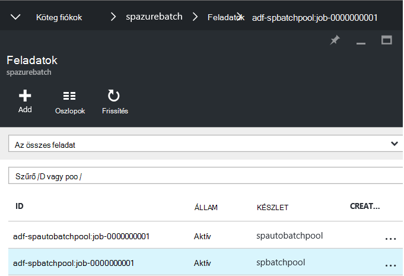
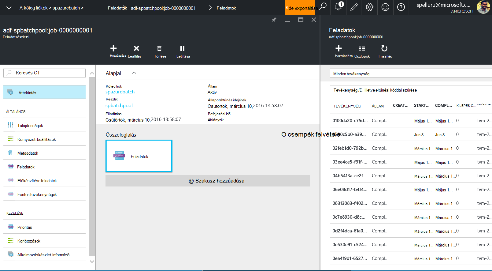

<properties
    pageTitle="Az adatok gyári és a köteg nagyméretű adatkészletek folyamat |} Microsoft Azure"
    description="Ismerteti, hogyan lehet feldolgozni nagyon nagy mennyiségű adat-Azure adatok gyár folyamat Azure köteg párhuzamos feldolgozási videofunkcióinak használatával."
    services="data-factory"
    documentationCenter=""
    authors="spelluru"
    manager="jhubbard"
    editor="monicar"/>

<tags
    ms.service="data-factory"
    ms.workload="data-services"
    ms.tgt_pltfrm="na"
    ms.devlang="na"
    ms.topic="article"
    ms.date="10/17/2016"
    ms.author="spelluru"/>

# Adatok gyári és a köteg folyamat nagyméretű adatkészletek
Ez a cikk ismerteti a egy architektúrája, amely áthelyezi és nagyméretű adatkészletek feldolgozásával automatikus és ütemezett módon minta megoldást. Egy végpont – útmutató – a megoldást az Azure adatok gyár és Azure köteg végrehajtásához is tartalmaz. 

Ez a témakör az hosszabb, mint a szokásos cikk, mert egy teljes minta megoldások – útmutató tartalmaz. Ha Ön új köteget, és az adatok gyári, az alábbi szolgáltatások megismerheti, és hogyan működnek együtt. Ha valamit, amit a szolgáltatásokkal kapcsolatos tudnivalók és vannak tervezése és architecting megoldást, előfordulhat, hogy koncentrálhat csak a cikk a [architektúra szakasz](#architecture-of-sample-solution) , és ha a minta vagy a megoldást, érdemes lépésenként a [forgatókönyv](#implementation-of-sample-solution)kipróbálására. Akkor hívjon ezt a tartalmat, és hogyan használható a megjegyzéseket.

Először nézzük meg, hogyan segíthet a Data Factory és a köteg szolgáltatások feldolgozó nagy adathalmazok a felhőben.     

## Miért Azure köteg?
Azure köteg lehetővé teszi, hogy nagyszabású a párhuzamos és a nagy teljesítményű számítások (HPC) alkalmazások hatékonyan futtatását a felhőben. Egy platform-szolgáltatás, ütemezi a számítási igényű munkát futtatni szeretne a virtuális gépeken futó felügyelt gyűjteménye, és is automatikusan skála kiszámítására az igényeknek megfelelően a feladatok erőforrásokat.

A köteg szolgáltatás definiálhatók Azure számítási erőforrások párhuzamosan, és a méretezés az alkalmazások végrehajtani. Futtathatja az igény szerinti vagy ütemezett feladatok, és nem kell manuálisan, adja meg, és létrehozása és kezelése egy HPC fürthöz, egyes virtuális gépeken futó, virtuális hálózatok vagy egy bonyolult feladat ütemezési infrastruktúra tevékenység.

Ha nem ismeri a Azure köteg módon segít a ismertetése a jelen cikkben ismertetett megoldást architektúra/végrehajtásának, olvassa el a következő cikkeket.   

- [Azure köteg alapjai](../batch/batch-technical-overview.md)
- [Köteg szolgáltatás áttekintése](../batch/batch-api-basics.md)

(nem kötelező) Azure köteg kapcsolatos további információért lásd: a [tanulási javaslat Azure köteghez](https://azure.microsoft.com/documentation/learning-paths/batch/).

## Miért Azure Data Factory?
Adatok gyári orchestrates és a szállítási és adatok átalakítása automatizálja felhőalapú adatok integrációs szolgáltatás. Az adatok gyár szolgáltatással is létrehozhat, hogy a helyszíni adatok áthelyezése és a felhő egy központi adattár üzletek adatainak kezelt adatok folyamatok (például: Azure Blob-tárolóhoz), és a folyamat/átalakítás adatok szolgáltatások, például az Azure hdinsight szolgáltatáshoz és Azure gépi tanulási használatával. Adatok folyamatok ütemezett módon (óránként, napi, heti stb.) és monitor futtatása és kezelheti a kapcsolatos problémák azonosítása és a művelet végrehajtása egy pillantással ütemezhető is. 

Ha nem Azure Data Factory ismerős módon segít a ismertetése a jelen cikkben ismertetett megoldást architektúra/végrehajtásának, olvassa el a következő cikkeket.  

- [Azure Data Factory bevezetése](data-factory-introduction.md)
- [Az adatok első folyamat összeállítása](data-factory-build-your-first-pipeline.md)   

(nem kötelező) Azure adatok gyár kapcsolatos további tudnivalókért lásd: a [tanulási javaslat az Azure adatok gyár](https://azure.microsoft.com/documentation/learning-paths/data-factory/).

## Adatok gyár és a köteg csoportosítása
Adatok gyári beépített tevékenységeiről, így másolás tevékenység adatok másolása vagy áthelyezése egy adatforrás adatok áruházában adatok céltárat és a tevékenység struktúra folyamat adatokhoz Hadoop fürt (HDInsight) a Azure tartalmazza. Lásd: [A tevékenységekre vonatkozó adatok átalakítása](data-factory-data-transformation-activities.md) listáját a támogatott átalakítása tevékenységeket. 

Lehetővé teszi a áthelyezése vagy saját logika az adatfeldolgozás és futtatása ezeket a tevékenységeket, az Azure hdinsight szolgáltatáshoz fürt vagy egy VMs Azure köteg készlete egyéni .NET tevékenységek létrehozása. Azure köteg használatakor adhatja meg a készlet automatikus méretezése (hozzáadása vagy eltávolítása a terhelést a alapján VMs) képletre kiszámlázásakor.     

## Architektúra megoldások – minta
Annak ellenére, hogy a jelen cikkben ismertetett architektúra egyszerű megoldás, az összetett esetek, például a kockázat pénzügyi szolgáltatások, kép feldolgozás és megjelenítését és genomikus analysis modellezése fontos. 

A diagram 1) módját Data Factory orchestrates az adatok mozgását és feldolgozása, és a 2) hogyan Azure köteg dolgozza fel az adatokat a párhuzamos módon mutatja be. Letölthető és kinyomtatható, a diagram egyszerű hivatkozás (11 x 17. vagy A3 méretét): [HPC és az adatok üzletifolyamat-tervező Azure köteg és adatok gyári használatával](http://go.microsoft.com/fwlink/?LinkId=717686).

A következő lista ismerteti a folyamat az alapvető lépések. A megoldást is tartalmaz, kódot és magyarázatokat, a végpontok közötti megoldást össze.

1.  **Azure köteg konfigurálása számítási csomópont (VMs) erőforráskészlethez tartozik**. A csomópontok számának és az egyes csomópontok méretének megadása

2.  **Azure Data Factory-példány létrehozása** Azure blob-tárolóhoz, az Azure köteg számítási szolgáltatás, a bemeneti és kimeneti adatok és a munkafolyamat/folyamat, áthelyezése és az adatokat a tevékenységekkel megjelenítő személyekkel konfigurált.

3.   **A Data Factory során egyéni .NET tevékenység létrehozása**. A tevékenység a felhasználó kód, amely az Azure köteg készlet fut.

4.  **Azure-tárolóban lévő BLOB bemeneti adatok nagy mennyiségű áruházból**. Adatok (általában időpontonként) oszlik logikai szeletek.

5.  **Adatok gyári másolja az adatokat, amely akkor párhuzamosan** a másodlagos helyre.

6.  **Adatok gyár futtatja az egyéni tevékenységeket a köteg elosztja készlet segítségével**. Adatok gyári futhat tevékenységeket. Az egyes tevékenységek folyamatok az adatok szelet. Az eredmények Azure tárolója tárolja.

7.  **Adatok gyári a végeredmény egy harmadik helyre helyezi át**, egy alkalmazásából eloszlás vagy más eszközökkel további feldolgozásra.

## Minta megoldás végrehajtása
A minta megoldást szándékosan egyszerű és mutatja, hogy az adatok gyár és a köteg adatkészleteket feldolgozása együttes használata. A megoldás egyszerűen a függvény összeszámolja a kívánt keresőkifejezést ("Microsoft") előfordulásainak száma egy idősorok vannak rendezve, a bemeneti fájlok. Kimeneti fájlok számának exportálja azt.

**Idő**: Ha ismeri a Azure, az adatok gyári és a köteg alapjait, és az alábbi előfeltételek befejeződött, azt a megoldást megnyitja az 1-2 órán befejezéséhez becslése.

### Előfeltételek

#### Azure előfizetés
Ha nem rendelkezik az Azure előfizetéssel, létrehozhat egy ingyenes próba-fiókkal, mindössze néhány perc az. Lásd: az [ingyenes próbaverziót](https://azure.microsoft.com/pricing/free-trial/).

#### Azure tárterület-fiók
Az adatok tárolásának ebben az oktatóanyagban Azure tároló fiókot használ. Ha a Azure tárterület-fiókja nem rendelkezik, olvassa el a [tárterület-fiók létrehozása](../storage/storage-create-storage-account.md#create-a-storage-account). A minta megoldást blob-tárolóhoz használja.

#### Azure köteg-fiók
Az [Azure portál](http://manage.windowsazure.com/)Azure köteg fiókot létrehozni. Lásd: [létrehozása és kezelése az Azure köteg fiók](../batch/batch-account-create-portal.md). Megjegyzés: az Azure köteg nevét és a fiók fiókkulcs. [Új-AzureRmBatchAccount](https://msdn.microsoft.com/library/mt603749.aspx) parancsmag hozhat létre Azure köteg fiókot is használhatja. Lásd: az [első lépések az Azure köteg PowerShell-parancsmagok](../batch/batch-powershell-cmdlets-get-started.md) Ezen parancsmag használatával kapcsolatos részletes útmutatásért.

A minta megoldást folyamat adatainak Azure köteg (közvetve keresztül az Azure Data Factory folyamat) számítási csomópontok (felügyelt gyűjteménye virtuális gépeken futó) erőforráskészlethez tartozik a párhuzamos módon használja.

#### Köteg erőforráskészletet Azure virtuális gépeken futó (VMs)
Hozzon létre egy **Azure köteg készletben** legalább 2 számítási csomópontok.

1.  Az [Azure portált](https://portal.azure.com)a bal oldali menüben kattintson a **Tallózás gombra** , és kattintson a **Köteg fiókok**elemre. 
2. Jelölje ki a köteget Azure-fiókját, a **Köteg fiók** lap megnyitásához. 
3. Kattintson a **készletek** csempére.
4. Kattintson a **készletek** lap hozzáadása gombra az eszköztáron a készletbe felvenni.
    1. Adja meg a készlet (**Alkalmazáskészlet-azonosító**) Azonosítóját. Figyelje meg a **készlet azonosító**; szüksége az adatok gyári megoldás létrehozásakor. 
    2. Adja meg a **Windows Server 2012 R2** az operációs rendszer család beállítást.
    3. Jelölje ki a **csomópont árak réteg**.
    4. Írja be a **Cél dedikált** beállítás értékként **2** .
    5. Adja meg a **2** érték a **Max feladatok egyes csomópontok** beállítását.
    6. Kattintson az **OK gombra** a készlet létrehozása. 
    
#### Azure tároló Explorer   
[Azure tároló Explorer 6 (eszköz)](https://azurestorageexplorer.codeplex.com/) vagy [CloudXplorer](http://clumsyleaf.com/products/cloudxplorer) (a ClumsyLeaf szoftver). Ezek az eszközök használható vizsgálata és az adatokat, többek között a naplókat, a felhőben tárolt alkalmazások Azure tároló projektjeit a megváltoztatását.

1.  A tároló **mycontainer** magánjellegű hozzáféréssel (nincs névtelen hozzáféréssel) nevű létrehozása

2.  Ha **CloudXplorer**használja, az alábbi szerkezet létrehozása mappa és almappák:

    

    **Inputfolder** és **outputfolder** **mycontainer,** a legfelső szintű mappák és a **inputfolder** a dátum és idő bélyegzőket (éééé-MM-DD-HH) almappák tartoznak.

    **Azure tároló Explorer**használatakor a következő lépésben szükséges névvel rendelkező fájlok feltöltése: inputfolder/2015-11-16-00/file.txt, inputfolder/2015-11-16-01/file.txt és így tovább. Ebben a lépésben automatikusan létrehozza a mappákat.

3.  Hozzon létre egy szöveges fájl **file.txt** a számítógépen, amelyen a kulcsszó **Microsoft**tartalommal. Például: "az egyéni tevékenységeket Microsoft próba egyéni tevékenységeket Microsoft tesztelése".

4.  Töltse fel a fájlt az Azure blob-tárolóhoz beviteli mappát.

    

    **Azure tároló Explorer**használatakor töltse fel a fájlt **file.txt** **mycontainer**. Kattintson a **Másolás** gombra az eszköztáron, és készítsen másolatot a blob. A **Másolás Blob** párbeszédpanelen módosítsa a **cél blob neve** **inputfolder/2015-11-16-00/file.txt.** Ismételje meg ezt a lépést inputfolder/2015-11-16-01/file.txt, inputfolder/2015-11-16-02/file.txt, inputfolder/2015-11-16-03/file.txt, inputfolder/2015-11-16-04/file.txt létrehozása, és így tovább. Ez a művelet automatikusan létrehozza a mappákat.

3.  Hozzon létre egy másik tároló: **customactivitycontainer**. Az egyéni tevékenységeket zip-fájl feltöltése a tároló.

#### Visual Studio
Telepítse a Microsoft Visual Studio 2012 vagy újabb létrehozása az egyéni köteg tevékenység használható az adatok gyár megoldás.

### Magas szintű lépéseket a megoldás létrehozása

1.  Hozzon létre egy egyéni tevékenységet, amely tartalmazza az adatfeldolgozás logika.
2.  Hozzon létre egy Azure adatok gyári az egyéni tevékenységeket használó:

### Az egyéni tevékenység létrehozása

Az adatok gyári egyéni tevékenység a szívecskés a minta megoldás. A minta megoldást Azure köteg használja az egyéni tevékenységeket futtatásához. Lásd: [használja az egyéni tevékenységeket az Azure Data Factory során](data-factory-use-custom-activities.md) az alapvető információ kialakítása az egyéni tevékenységeket és az Azure Data Factory folyamatok.

Az Azure Data Factory folyamat, amelyekkel egyéni .NET tevékenység létrehozásához szüksége **.NET osztálytár** projekt létrehozását, amely az adott **IDotNetActivity** kapcsolat osztály. A kapcsolatnak csak egy módszert: **végrehajtás**. Az alábbiakban az aláírást az módszer:

    public IDictionary<string, string> Execute(
                IEnumerable<LinkedService> linkedServices,
                IEnumerable<Dataset> datasets,
                Activity activity,
                IActivityLogger logger)

A módszer összetevője néhány fontosabb megértéséhez szükséges.

-   A módszer veszi négy paraméterei:

    1.  **linkedServices**. Egy megszámlálható listája, amely a bemeneti és kimeneti adatforrás csatolása csatolt szolgáltatások (például: Azure Blob-tárolóhoz) szeretné az adatok gyár. Ebben a példában az azt jelenti, csak egy csatolt szolgáltatás típusú bemeneti és kimeneti Azure-tárhelyet.

    2.  **adatkészleteket**. Ez a egy adatkészleteket megszámlálható listáját. A helyek és a sémák bemeneti és kimeneti adatkészleteket által meghatározott paraméter is használhatja.

    3.  **tevékenység**. Ez a paraméter jelöli az aktuális számítási személyhez – ebben az esetben egy köteg Azure szolgáltatás.

    4.  **naplózó**. A naplózási teszi lehetővé, hogy a felület hibakeresési megjegyzéseket írni az folyamat "Felhasználó" bejelentkezési.

-   A módszer egy szótár használt lánc egyéni tevékenységek együtt a jövőben adja eredményül. Ez a funkció nem érhető el, így a módszerrel eredményül egy üres szótár. 

#### Az eljárás: Az egyéni tevékenység létrehozása

1.  A Visual Studio .NET osztálytár projektet létrehozni.

    1.  Indítsa el a **Visual Studio 2012**/**a Skype 2015 2013 /**.

    2.  Kattintson a **fájl**fülre, mutasson az **Új**, és kattintson a **Projekt**.

    3.  Bontsa ki a **sablonok**, és válassza a **vizuális C\#**. Az útmutató, használja a C\#, azonban az egyéni tevékenységeket kidolgozása bármely .NET nyelven is használhatja.

    4.  **Osztálytár** választhat a jobb oldalon a projekttípusok listáját.

    5.  Írja be a **név** **MyDotNetActivity** .

    6.  Válassza a **C:\\ADF** **helyét**. Ha még nem létezik a **ADF** mappa létrehozása

    7.  Kattintson az **OK gombra** a projekt létrehozása.

2.  Kattintson az **eszközök**, mutasson a **NuGet csomag kezelő**és **Csomag Manager konzolban**kattintson.

3.  A **Csomag kezelője konzol**végrehajtása **Microsoft.Azure.Management.DataFactories**importálása a következő parancsot.

            Install-Package Microsoft.Azure.Management.DataFactories

4.  A projekt importálása az **Azure tároló** NuGet csomagot. A csomag van szüksége, mivel ez a példa a blobtárolóhoz API-val használt.

        Install-Package Azure.Storage

5.  A következő irányelvek **használatával** adhat a forrásfájlt, a projekt.

        using System.IO;
        using System.Globalization;
        using System.Diagnostics;
        using System.Linq;

        using Microsoft.Azure.Management.DataFactories.Models;
        using Microsoft.Azure.Management.DataFactories.Runtime;

        using Microsoft.WindowsAzure.Storage;
        using Microsoft.WindowsAzure.Storage.Blob;

6.  Módosítsa a **névtér** nevét **MyDotNetActivityNS**.

        namespace MyDotNetActivityNS

7.  **MyDotNetActivity** az osztály átnevezése és származtatása azt a **IDotNetActivity** felület alább látható módon.

        public class MyDotNetActivity : IDotNetActivity

8.  A **IDotNetActivity** felületet **MyDotNetActivity** osztály (Hozzáadás) a **végrehajtás** módja végrehajtása, és másolja a vágólapra az alábbi példa kódot a módszerrel. A magyarázat az ezzel a módszerrel használt logikát a [Metódus végrehajtása](#execute-method) szakaszban olvashat.

        /// 

        /// Execute method is the only method of IDotNetActivity interface you must implement.
        /// In this sample, the method invokes the Calculate method to perform the core logic.  
        /// 

        public IDictionary<string, string> Execute(
            IEnumerable<LinkedService> linkedServices,
            IEnumerable<Dataset> datasets,
            Activity activity,
            IActivityLogger logger)
        {

            // declare types for input and output data stores
            AzureStorageLinkedService inputLinkedService;

            Dataset inputDataset = datasets.Single(dataset => dataset.Name == activity.Inputs.Single().Name);
    
            foreach (LinkedService ls in linkedServices)
                logger.Write("linkedService.Name {0}", ls.Name);

            // using First method instead of Single since we are using the same
            // Azure Storage linked service for input and output.
            inputLinkedService = linkedServices.First(
                linkedService =>
                linkedService.Name ==
                inputDataset.Properties.LinkedServiceName).Properties.TypeProperties
                as AzureStorageLinkedService;

            string connectionString = inputLinkedService.ConnectionString; // To create an input storage client.
            string folderPath = GetFolderPath(inputDataset);
            string output = string.Empty; // for use later.

            // create storage client for input. Pass the connection string.
            CloudStorageAccount inputStorageAccount = CloudStorageAccount.Parse(connectionString);
            CloudBlobClient inputClient = inputStorageAccount.CreateCloudBlobClient();

            // initialize the continuation token before using it in the do-while loop.
            BlobContinuationToken continuationToken = null;
            do
            {   // get the list of input blobs from the input storage client object.
                BlobResultSegment blobList = inputClient.ListBlobsSegmented(folderPath,
                                         true,
                                         BlobListingDetails.Metadata,
                                         null,
                                         continuationToken,
                                         null,
                                         null);

                // Calculate method returns the number of occurrences of
                // the search term (“Microsoft”) in each blob associated
                // with the data slice.
                //
                // definition of the method is shown in the next step.
                output = Calculate(blobList, logger, folderPath, ref continuationToken, "Microsoft");

            } while (continuationToken != null);

            // get the output dataset using the name of the dataset matched to a name in the Activity output collection.
            Dataset outputDataset = datasets.Single(dataset => dataset.Name == activity.Outputs.Single().Name);

            folderPath = GetFolderPath(outputDataset);

            logger.Write("Writing blob to the folder: {0}", folderPath);

            // create a storage object for the output blob.
            CloudStorageAccount outputStorageAccount = CloudStorageAccount.Parse(connectionString);
            // write the name of the file.
            Uri outputBlobUri = new Uri(outputStorageAccount.BlobEndpoint, folderPath + "/" + GetFileName(outputDataset));

            logger.Write("output blob URI: {0}", outputBlobUri.ToString());
            // create a blob and upload the output text.
            CloudBlockBlob outputBlob = new CloudBlockBlob(outputBlobUri, outputStorageAccount.Credentials);
            logger.Write("Writing {0} to the output blob", output);
            outputBlob.UploadText(output);

            // The dictionary can be used to chain custom activities together in the future.
            // This feature is not implemented yet, so just return an empty dictionary.
            return new Dictionary<string, string>();
        }

9.  Az alábbi segítő módszerek hozzáadása az osztály. A **végrehajtás** módszerrel vételét ezeket a módszereket. Legfontosabb a **Calculate** módszer elkülöníti a keresztül az egyes blob iteráló kódot.

        /// 

        /// Gets the folderPath value from the input/output dataset.
        /// 

        private static string GetFolderPath(Dataset dataArtifact)
        {
            if (dataArtifact == null || dataArtifact.Properties == null)
            {
                return null;
            }

            AzureBlobDataset blobDataset = dataArtifact.Properties.TypeProperties as AzureBlobDataset;
            if (blobDataset == null)
            {
                return null;
            }

            return blobDataset.FolderPath;
        }

        /// 

        /// Gets the fileName value from the input/output dataset.
        /// 

        private static string GetFileName(Dataset dataArtifact)
        {
            if (dataArtifact == null || dataArtifact.Properties == null)
            {
                return null;
            }

            AzureBlobDataset blobDataset = dataArtifact.Properties.TypeProperties as AzureBlobDataset;
            if (blobDataset == null)
            {
                return null;
            }

            return blobDataset.FileName;
        }

        /// 

        /// Iterates through each blob (file) in the folder, counts the number of instances of search term in the file,
        /// and prepares the output text that is written to the output blob.
        /// 

        public static string Calculate(BlobResultSegment Bresult, IActivityLogger logger, string folderPath, ref BlobContinuationToken token, string searchTerm)
        {
            string output = string.Empty;
            logger.Write("number of blobs found: {0}", Bresult.Results.Count<IListBlobItem>());
            foreach (IListBlobItem listBlobItem in Bresult.Results)
            {
                CloudBlockBlob inputBlob = listBlobItem as CloudBlockBlob;
                if ((inputBlob != null) && (inputBlob.Name.IndexOf("$$$.$$$") == -1))
                {
                    string blobText = inputBlob.DownloadText(Encoding.ASCII, null, null, null);
                    logger.Write("input blob text: {0}", blobText);
                    string[] source = blobText.Split(new char[] { '.', '?', '!', ' ', ';', ':', ',' }, StringSplitOptions.RemoveEmptyEntries);
                    var matchQuery = from word in source
                                     where word.ToLowerInvariant() == searchTerm.ToLowerInvariant()
                                     select word;
                    int wordCount = matchQuery.Count();
                    output += string.Format("{0} occurrences(s) of the search term \"{1}\" were found in the file {2}.\r\n", wordCount, searchTerm, inputBlob.Name);
                }
            }
            return output;
        }

    A **GetFolderPath** metódus ad vissza az elérési út azt a mappát, amely az adatkészlet mutat, és a **GetFileName** metódus ad vissza, amely az adatkészlet mutat blob/fájl nevét.

        "name": "InputDataset",
        "properties": {
            "type": "AzureBlob",
            "linkedServiceName": "StorageLinkedService",
            "typeProperties": {
                "fileName": "file.txt",
                "folderPath": "mycontainer/inputfolder/{Year}-{Month}-{Day}-{Hour}",

    A **Calculate** módszer kulcsszó **Microsoft** a beviteli fájlok (BLOB-mappában) példányainak számát számítja ki. A keresett kifejezést (a "Microsoft"), csomagolásukkor be a kódot.

10.  A projekt össze. Kattintson a **Szerkesztés** a menüben, és **Megoldást összeállítása**gombra.

11.  Indítsa el a **Windows Intézőt**, és kattintson az **bin\\hibakeresési** vagy **bin\\engedje fel az** mappa build típusától függően.

12.  **MyDotNetActivity.zip** összes bináris tartalmazó zip-fájl létrehozása a ** \\bin\\hibakeresési** mappát. Ha meg szeretné jeleníteni a MyDotNetActivity érdemes. **PDB** fájl így például sorszámát további részleteket a forráskód a problémát, ha a hibát okozó fordul elő.

    

13.  Töltse fel a **MyDotNetActivity.zip** a blob-tárolóhoz blob-ként: **customactivitycontainer** az, hogy a **StorageLinkedService** csatolva a **ADFTutorialDataFactory** szolgáltatás Azure blob-tárolóhoz használja. Ha még nem létezik a blob-tárolóhoz **customactivitycontainer** létrehozása

#### Végrehajtási mód

Ez a témakör további részletek és a megjegyzéseket fűzhet a végrehajtás módszer a kódot.

1.  A tagok a bemeneti gyűjtemény keresztül léptetés [Microsoft.WindowsAzure.Storage.Blob](https://msdn.microsoft.com/library/azure/microsoft.windowsazure.storage.blob.aspx) névtér találhatók. A blob-gyűjtemény keresztül léptetés szükséges a **BlobContinuationToken** osztály használatával. Lényegében egy do kell használnia – a token a Kilépés a leállításig mechanizmusként a leállításig közben. További tudnivalókért lásd: [használatáról a .NET Blob-tárolóhoz](../storage/storage-dotnet-how-to-use-blobs.md). Egy egyszerű ciklus Itt jelennek meg:

        // Initialize the continuation token.
        BlobContinuationToken continuationToken = null;
        do
        {
        // Get the list of input blobs from the input storage client object.
        BlobResultSegment blobList = inputClient.ListBlobsSegmented(folderPath,
                                true,
                                          BlobListingDetails.Metadata,
                                          null,
                                          continuationToken,
                                          null,
                                          null);
        // Return a string derived from parsing each blob.
            output = Calculate(blobList, logger, folderPath, ref continuationToken, "Microsoft");

        } while (continuationToken != null);

    További információ a [ListBlobsSegmented](https://msdn.microsoft.com/library/jj717596.aspx) módszer dokumentációjában.

2.  A kód BLOB készletével logikailag munkához Ugrás belül a ne-hurok közben. A **végrehajtás** módszer, ne-közben loop BLOB listája átadja nevű **Calculate**függvény. A módszer a karakterlánc típusú változóban eredménye, hogy többször is keresztül szakaszában valamennyi BLOB **kimeneti** nevű adja eredményül.

    A keresett kifejezést (**Microsoft**) előfordulásainak száma a az átkerül a **Calculate** módszer blob adja eredményül.

        output += string.Format("{0} occurrences of the search term \"{1}\" were found in the file {2}.\r\n", wordCount, searchTerm, inputBlob.Name);

3.  Miután a **Calculate** módszer által elvégzett munka, az új blob kell írni. Minden feldolgozott BLOB csoportját, így egy új blob a eredményekkel írhatók. Írni egy új blob, először nyissa meg a kimeneti adatkészlet.

        // Get the output dataset using the name of the dataset matched to a name in the Activity output collection.
        Dataset outputDataset = datasets.Single(dataset => dataset.Name == activity.Outputs.Single().Name);

4.  A kódot is felhívja segítő metódus: **GetFolderPath** beolvasásához a mappa elérési útját (a tárhely tároló neve).

        folderPath = GetFolderPath(outputDataset);

    A **GetFolderPath** árnyékot az adatkészlet objektumot egy AzureBlobDataSet, amelynek Mappa_útvonala nevű tulajdonság.

        AzureBlobDataset blobDataset = dataArtifact.Properties.TypeProperties as AzureBlobDataset;

        return blobDataset.FolderPath;

5.  A kód felhívja a **GetFileName** módszer beolvasni a fájl nevét (blob neve). A kód hasonlít a fenti kóddal beolvasni a mappa elérési útját.

        AzureBlobDataset blobDataset = dataArtifact.Properties.TypeProperties as AzureBlobDataset;

        return blobDataset.FileName;

6.  A fájl nevét: hozzon létre egy URI-objektum íródott. A URI konstruktor a **BlobEndpoint** tulajdonság a tároló nevét használja. A mappa elérési útját és nevét a kimeneti blob URI Egyenletszerkesztővel kerülnek.  

        // Write the name of the file.
        Uri outputBlobUri = new Uri(outputStorageAccount.BlobEndpoint, folderPath + "/" + GetFileName(outputDataset));

7.  A fájl nevét úgy írtak, és most írhat a kimeneti karakterlánc a **Calculate** mód az új blob:

        // Create a blob and upload the output text.
        CloudBlockBlob outputBlob = new CloudBlockBlob(outputBlobUri, outputStorageAccount.Credentials);
        logger.Write("Writing {0} to the output blob", output);
        outputBlob.UploadText(output);

### Az adatok gyár létrehozása

[Az egyéni tevékenységeket létrehozása](#create-the-custom-activity) szakaszban létrehozott egy egyéni tevékenységeket és bináris tartalmazó zip-fájl, és a PDB fájl feltöltése egy Azure blob-tárolóhoz. Ebben a részben hoz létre egy Azure **adatok gyári** az **egyéni tevékenységeket**használó **folyamat** .

A beviteli adatkészlet számára az egyéni tevékenységeket a BLOB (fájl) jelöl, a bemeneti mappában (mycontainer\\inputfolder) blob-tárolóban lévő. A kimenet adatkészlet a tevékenység jelöli a kimeneti BLOB a kimeneti mappában (mycontainer\\outputfolder) blob-tárolóban lévő.

Egy vagy több fájlt húzhatja a bemeneti mappákba:

    mycontainer -\> inputfolder
        2015-11-16-00
        2015-11-16-01
        2015-11-16-02
        2015-11-16-03
        2015-11-16-04

Ha például legördülő egy fájl (file.txt) a következő tartalommal mindegyikbe a mappák.

    test custom activity Microsoft test custom activity Microsoft

Beviteli mappák a szeletre Azure Data Factory felel meg, akkor is, ha a mappa 2 vagy több fájlt. Minden egyes szeletet dolgozza fel a folyamat, amikor az egyéni tevékenységeket függvény, a bemeneti mappa az adott szeletet valamennyi BLOB keresztül.

Megjelenik a kimeneti fájlok öt ugyanazt a tartalmat. A kimeneti fájl nem dolgozza fel a fájlt a Skype 2015-11-16-00 mappában például a következő tartalom foglalja magában:

    2 occurrences(s) of the search term "Microsoft" were found in the file inputfolder/2015-11-16-00/file.txt.

Ha több fájlt (file.txt, fájl2.ref fájllal, file3.txt) ugyanazt a tartalmat, a bemeneti mappába leválaszt, a kimeneti fájl a következő tartalom látni. Minden mappa (2015-11-16-00 stb.) Ez a példa a szeletre felel meg annak ellenére, hogy a mappa több beviteli fájlokat tartalmazza.

    2 occurrences(s) of the search term "Microsoft" were found in the file inputfolder/2015-11-16-00/file.txt.
    2 occurrences(s) of the search term "Microsoft" were found in the file inputfolder/2015-11-16-00/file2.txt.
    2 occurrences(s) of the search term "Microsoft" were found in the file inputfolder/2015-11-16-00/file3.txt.

A kimeneti fájl három sorai most egy beviteli fájlonként (blob) a szeletet (2015-11-16-00) társított mappában vannak.

Az egyes tevékenységek futtatása feladat jön létre. Ez a példa a van csak egy tevékenységet a folyamat. Amikor egy szeletet dolgozza fel a folyamat, feldolgozása a szeletre Azure köteg fut, az egyéni tevékenységeket. Vannak öt szeletek (minden egyes szeletet olyan több BLOB vagy fájl), mivel nincsenek készült Azure köteg öt feladatokat. Tevékenység futtat, a köteget, esetén ténylegesen működik, és egyéni tevékenységeket.

Az alábbi útmutató nyújt további információt.

#### Lépés: 1: Az adatok gyári létrehozása

1.  Az [Azure portal](https://portal.azure.com/)bejelentkezés után végezze el az alábbi lépéseket:

    1.  A bal oldali menüben kattintson az **Új** gombra.

    2.  Kattintson az **Új** lap **adatok + Analytics** .

    3.  **Adatok gyári** kattintson az **adatok analytics** lap.

2.  Írja be az **új adatok gyári** lap **CustomActivityFactory** nevét. Az Azure adatok gyári neve globálisan egyedinek kell lennie. Ha a hibakód: **nem érhető el adatok gyári neve "CustomActivityFactory"**, módosíthatja az adatok gyári (például a **yournameCustomActivityFactory**) nevét, és próbáljon meg ismét létrehozni.

3.  Kattintson **Az erőforrás-csoport NEVÉRE**, és válassza a meglévő erőforráscsoport vagy erőforráscsoport létrehozása.

4.  Győződjön meg arról, hogy a helyes előfizetés és régió, amelyre a data factory létrehozandó használja.

5.  Kattintson a **Létrehozás** gombra az **új adatok gyári** lap.

6.  Az **Irányítópult** : az Azure portál eredményezne adatok gyári látni.

7.  Az adatok gyári létrehozása sikeresen befejeződött, miután látni az gyári lapon, amely jelzi, hogy az adatok gyári tartalmát.

 

#### Lépés: 2: Hozzon létre csatolt szolgáltatások

Csatolt szolgáltatások hivatkozás adatokat tárolja, vagy az Azure adatok gyári szolgáltatások számítja ki. Ebben a lépésben összekapcsol az **Azure tárterület** -fiók és az **Azure köteg** fiók az adatok gyári.

#### Azure csatolt tárhelyszolgáltatáshoz létrehozása

1.  Kattintson a **Szerző és üzembe** **CustomActivityFactory**a csempe az **Adatok gyári** lap. Az adatok gyári szerkesztő látni.

2.  Kattintson az **új adatokat tárolja** a parancssávon, és válassza a **Azure tároló.** Meg kell jelennie a JSON parancsfájl létrehozása az Azure csatolt tárhelyszolgáltatáshoz szerkesztőben.

    

3.  **Fióknév** cserélje le az access használatával az Azure tárterület-fiók a **fiókkulcs** és Azure tároló fiók nevére. Megtudhatja, hogyan hozhatja ki a tárhely hívóbetű, lásd: a [nézet, a másolás és a hívóbetűk újragenerálása tároló](../storage/storage-create-storage-account.md#view-copy-and-regenerate-storage-access-keys).

4.  Kattintson a **központi telepítés** a csatolt szolgáltatás üzembe a parancssávon.

    

#### Csatolt Azure köteg szolgáltatás hozzon létre

Ebben a lépésben a Data Factory egyéni tevékenység futtatásához használt **Azure köteg** fiókjának csatolt szolgáltatás hozzon létre.

1.  Kattintson az **Új számítja ki** a parancssávon, és válassza a **Azure köteget.** Meg kell jelennie a JSON parancsfájl hozhat létre egy csatolt Azure köteg szolgáltatás szerkesztőben.

2.  A JSON parancsfájl:

    1.  **Fióknév** cserélje le a köteg Azure-fiók nevére.

    2.  Cserélje ki a köteget Azure-fiók a hívóbetű **hívóbetű** .

    3.  Adja meg a készlet Azonosítóját**.** **Készlet_neve** tulajdonság Az ezt a tulajdonságot vagy a készlet nevét adja meg vagy készlet azonosítójával.

    4.  Adja meg a köteg URI **batchUri** JSON tulajdonság. 
    
        > [AZURE.IMPORTANT] Az **URL-CÍMÉT** az **Azure köteg fiók lap** van, a következő formátumban: \<fióknév\>. \<régió\>. batch.azure.com. A JSON **batchUri** tulajdonsághoz el kell **távolítania a "fióknév."** az URL-címen. Példa: `"batchUri": "https://eastus.batch.azure.com"`.

        

        A **Készlet_neve** tulajdonság is megadhatja a készlet neve helyett a készlet azonosítója.

        > [AZURE.NOTE] Az adatok gyári szolgáltatás nem támogatja igény szerinti beállítást Azure köteghez, ahogyan ezt a hdinsight szolgáltatásból lehetőségre. Csak a saját Azure köteg készlet használhatja az Azure adatok gyári.

    5.  Adja meg a **linkedServiceName** tulajdonság **StorageLinkedService** . Az előző lépésben létrehozott csatolt szolgáltatást. A tároló fájlok és a naplókat egy átmeneti területen szolgál.

3.  Kattintson a **központi telepítés** a csatolt szolgáltatás üzembe a parancssávon.

#### Lépés 3: Adatkészleteket létrehozása

Ebben a lépésben létrehoz adatkészleteket bemeneti és kimeneti adatok ábrázolásához.

#### Beviteli adatkészlet létrehozása

1.  **Szerkesztő** az adatok gyári **Új adatkészlet** gombra az eszköztáron, és **Azure Blob-tárolóhoz** kattintson a legördülő menüből.

2.  A jobb oldali ablaktáblában a JSON cserélje ki az alábbi JSON kódtöredékének:

        {
            "name": "InputDataset",
            "properties": {
                "type": "AzureBlob",
                "linkedServiceName": "AzureStorageLinkedService",
                "typeProperties": {
                    "folderPath": "mycontainer/inputfolder/{Year}-{Month}-{Day}-{Hour}",
                    "format": {
                        "type": "TextFormat"
                    },
                    "partitionedBy": [
                        {
                            "name": "Year",
                            "value": {
                                "type": "DateTime",
                                "date": "SliceStart",
                                "format": "yyyy"
                            }
                        },
                        {
                            "name": "Month",
                            "value": {
                                "type": "DateTime",
                                "date": "SliceStart",
                                "format": "MM"
                            }
                        },
                        {
                            "name": "Day",
                            "value": {
                                "type": "DateTime",
                                "date": "SliceStart",
                                "format": "dd"
                            }
                        },
                        {
                            "name": "Hour",
                            "value": {
                                "type": "DateTime",
                                "date": "SliceStart",
                                "format": "HH"
                            }
                        }
                    ]
                },
                "availability": {
                    "frequency": "Hour",
                    "interval": 1
                },
                "external": true,
                "policy": {}
            }
        }

     Hoz létre egy folyamat később a kezdési időpontot az útmutató: a Skype 2015-11-16T00:00:00Z és a befejezési időpontot: a Skype 2015-11-16T05:00:00Z. Kapcsol adatok **óránként**, így 5 bemeneti és kimeneti szeletek van ütemezve ( **00**: 00:00 -\> **05**: 00:00).

     A **gyakoriság** és a bemeneti adatkészlet **intervallum** **órát** és **1**, ami azt jelenti, hogy a bemeneti szeletet elérhető óránként van beállítva.

     Az alábbiakban az indítási beállítások az egyes a szeletek és a fenti JSON kódtöredékének **SliceStart** rendszer változó képviseli.

  	| **Szeletek** | **Elindítása**          |
  	|-----------|-------------------------|
  	| 1         | 2015-11-16T**00**: 00:00 |
  	| 2         | 2015-11-16T**01**: 00:00 |
  	| 3         | 2015-11-16T**02**: 00:00 |
  	| 4         | 2015-11-16T**03**: 00:00 |
  	| 5         | 2015-11-16T**04**: 00:00 |

     A szeletek kezdetének (**SliceStart**) év, hónap, nap és óra részét használatával a **Mappa_útvonala** számítható ki. Itt ezért hogyan egy szeletet egy beviteli mappában van hozzárendelve.

  	| **Szeletek** | **Elindítása**          | **Bemeneti mappa**  |
  	|-----------|-------------------------|-------------------|
  	| 1         | 2015-11-16T**00**: 00:00 | 2015-11-16 -**00** |
  	| 2         | 2015-11-16T**01**: 00:00 | 2015-11-16 -**01** |
  	| 3         | 2015-11-16T**02**: 00:00 | 2015-11-16 -**02** |
  	| 4         | 2015-11-16T**03**: 00:00 | 2015-11-16 -**03** |
  	| 5         | 2015-11-16T**04**: 00:00 | 2015-11-16 -**04** |

3.  Kattintson a **központi telepítés** készíthetnek és helyezhetnek üzembe a **InputDataset** táblázat az eszköztáron. 

#### Kimeneti adatkészlet létrehozása

Ebben a lépésben hozzon létre egy másik adatkészlet típusú AzureBlob a kimeneti adatok ábrázolásához.

1.  **Szerkesztő** az adatok gyári **Új adatkészlet** gombra az eszköztáron, és **Azure Blob-tárolóhoz** kattintson a legördülő menüből.

2.  A jobb oldali ablaktáblában a JSON cserélje ki az alábbi JSON kódtöredékének:

        {
            "name": "OutputDataset",
            "properties": {
                "type": "AzureBlob",
                "linkedServiceName": "AzureStorageLinkedService",
                "typeProperties": {
                    "fileName": "{slice}.txt",
                    "folderPath": "mycontainer/outputfolder",
                    "partitionedBy": [
                        {
                            "name": "slice",
                            "value": {
                                "type": "DateTime",
                                "date": "SliceStart",
                                "format": "yyyy-MM-dd-HH"
                            }
                        }
                    ]
                },
                "availability": {
                    "frequency": "Hour",
                    "interval": 1
                }
            }
        }

    Kimeneti blob/fájl minden egyes beviteli szeletet jön létre. Az alábbiakban hogyan kimeneti fájl minden egyes szeletet neve. Egy kimenet mappában lévő összes a kimeneti fájl generált: **mycontainer\\outputfolder**.

  	| **Szeletek** | **Elindítása**          | **Kimenő fájl**       |
  	|-----------|-------------------------|-----------------------|
  	| 1         | 2015-11-16T**00**: 00:00 | 2015-11-16 -**00. txt** |
  	| 2         | 2015-11-16T**01**: 00:00 | 2015-11-16 -**01. txt** |
  	| 3         | 2015-11-16T**02**: 00:00 | 2015-11-16 -**02. txt** |
  	| 4         | 2015-11-16T**03**: 00:00 | 2015-11-16 -**03. txt** |
  	| 5         | 2015-11-16T**04**: 00:00 | 2015-11-16 -**04. txt** |

     Ne feledje, hogy egy beviteli mappában lévő összes fájlt (például: a Skype 2015-11-16-00) a kezdési időpontot a szeletek részeként: 2015-11-16-00. Ez a cikk szöge feldolgozása után az egyéni tevékenységeket beolvasása a minden fájl, és hoz létre a kimeneti fájl a keresett kifejezést (a "Microsoft") előfordulásainak száma egy sort. 2015-11-16-00 mappában három fájlok vannak, ha vannak-e három vonalat a kimeneti fájl: a Skype 2015-11-16-00.txt.

3.  Kattintson a **központi telepítés** készíthetnek és helyezhetnek üzembe a **OutputDataset**az eszköztáron.

#### Lépés: 4: Létrehozása, és a folyamat futtatása egyéni tevékenységeket használó

Ebben a lépésben létrehoz egy folyamat tartalmazó egy tevékenység, a korábban létrehozott egyéni tevékenységeket.

> [AZURE.IMPORTANT] Ha még nem feltöltött a **file.txt** beviteléhez a blob-tárolóban lévő mappák, tegye meg a folyamat létrehozása előtt. A **isPaused** tulajdonság értéke HAMIS, a során, JSON, így a folyamat azonnal elindul, múltbeli van a **kezdési** dátumot.

1.  A adatok Factory-szerkesztőben kattintson az **új folyamat** a parancssávon. Ha a parancs nem látható, kattintson a **... (Három pont)** való megjelenítését.

2.  A jobb oldali ablaktáblában a JSON cserélje ki az alábbi JSON parancsprogramot:

        {
            "name": "PipelineCustom",
            "properties": {
                "description": "Use custom activity",
                "activities": [
                    {
                        "type": "DotNetActivity",
                        "typeProperties": {
                            "assemblyName": "MyDotNetActivity.dll",
                            "entryPoint": "MyDotNetActivityNS.MyDotNetActivity",
                            "packageLinkedService": "AzureStorageLinkedService",
                            "packageFile": "customactivitycontainer/MyDotNetActivity.zip"
                        },
                        "inputs": [
                            {
                                "name": "InputDataset"
                            }
                        ],
                        "outputs": [
                            {
                                "name": "OutputDataset"
                            }
                        ],
                        "policy": {
                            "timeout": "00:30:00",
                            "concurrency": 5,
                            "retry": 3
                        },
                        "scheduler": {
                            "frequency": "Hour",
                            "interval": 1
                        },
                        "name": "MyDotNetActivity",
                        "linkedServiceName": "AzureBatchLinkedService"
                    }
                ],
                "start": "2015-11-16T00:00:00Z",
                "end": "2015-11-16T05:00:00Z",
                "isPaused": false
           }
        }

    Vegye figyelembe az alábbiakat:

    -   A folyamat csak egy tevékenységhez van, és ez típusú: **DotNetActivity**.

    -   **AssemblyName** nevét a DLL értéke: **MyDotNetActivity.dll**.

    -   **Belépési** **MyDotNetActivityNS.MyDotNetActivity**értékre van állítva. Alapvetően van \<névtér\>. \<osztálynév\> be a kódot.

    -   **PackageLinkedService** mutat, amely tartalmazza az egyéni tevékenységeket zip-fájl blob-tárolóhoz **StorageLinkedService** értékre van állítva. Bemeneti és kimeneti fájl-és az egyéni tevékenységeket zip-fájl másik Azure tárterület-fiókok esetén, ha van egy másik Azure csatolt tárhelyszolgáltatáshoz létrehozásához. Ez a cikk tartalma feltételezi, hogy az azonos Azure tárterület-fiókot használ.

    -   **PackageFile** **customactivitycontainer/MyDotNetActivity.zip**értékre van állítva. A formátum a: \<containerforthezip\>/\<nameofthezip.zip\>.

    -   Az egyéni tevékenységeket veszi **InputDataset** bemenetként és **OutputDataset** ezt az eredményt.

    -   Az egyéni tevékenységeket **linkedServiceName** tulajdonsága az **AzureBatchLinkedService**, amely közli, hogy az egyéni tevékenységeket Azure köteg futtatásához szükséges rendszerkövetelmények Azure Data Factory mutat.

    -   Fontos a **párhuzamos** beállítását. Ha az alapértelmezett érték, amely 1, akkor is, ha 2 vagy több kiszámítására az Azure köteg készletben csomópontok, használja a szeletek feldolgozása egymás után. Emiatt nem vannak véve a párhuzamos feldolgozási képesség Azure köteg előnyeit. Ha **feldolgozási** nagyobb értékre állítja, azaz 2, az azt jelenti, hogy a két szeletre (felel meg a két tevékenység Azure kötegben) feldolgozhatók egyszerre, ebben az esetben, mind a VMs az Azure tételben készlet használhatók. Emiatt a tulajdonság feldolgozási megfelelően.

    -   Egyetlen feladat (szeletek) alapértelmezés szerint egy virtuális bármely pontján végrehajtása. A hiba oka, hogy alapértelmezés szerint a **maximális tevékenységek egy virtuális** értéke 1-Azure köteg készlet. Előfeltételek részeként a erőforráskészlethez tartozik a tulajdonság értéke 2, így egyszerre két adatok gyári körcikkei is futnia egy virtuális a létrehozott.

    -   **isPaused** tulajdonság alapértelmezés szerint hamis értékre van állítva. A folyamat azonnal fut ebben a példában, mert szeletet múltbeli kezdi el. Beállíthatja, hogy ez a tulajdonság igaz, mutasson a folyamat, és állítsa vissza újraindításához hamis.

    -   A **kezdési** idő és **befejezési** időpontot egymástól öt órát, szeletek előállított óránként, így öt szeletek vannak készített a folyamat.

3.  Kattintson a **központi telepítés** bevezetését tervezi a folyamat a parancssávon.

#### 5 lépés: A folyamat tesztelése

Ebben a lépésben a folyamat történő húzással fájlokat a bemeneti mappákba tesztelje. Kezdjük, az a folyamat teszteléséhez beviteli mappánként külön fájlba.

1.  A Data Factory fel az Azure portált kattintson a **Diagram**gombra.

    

2.  A diagram nézetben kattintson duplán a bemeneti adatkészlet: **InputDataset**.

    

3.  Meg kell jelennie a **InputDataset** lap kész öt szeletek. Az egyes szeletek figyelje meg a **SZELETEK KEZDÉSI idő** és a **SZELETEK BEFEJEZÉSI IDŐPONTOT** .

    

4.  A **Diagram nézetben**kattintson **OutputDataset**.

5.  Látnia kell, hogy a öt kimeneti szeletet kész állapotban vannak, ha az azok már készültek.

    

6.  A **szeletek** társított **feladatok** megtekintheti, és milyen minden egyes szeletet adódott a virtuális Azure portal segítségével. Lásd: [adatok gyári és a köteg integrációs](#data-factory-and-batch-integration) szakaszban további információt. 

7.  Ekkor megjelennek a kimeneti-fájlokat a **outputfolder** **mycontainer** , a Azure blob-tárolóban lévő.

    

    Meg kell jelennie egy, az egyes beviteli szeletek öt kimeneti fájlt. A kimeneti fájl minden egyes van, hogy a következő kimenet hasonló tartalom:

        2 occurrences(s) of the search term "Microsoft" were found in the file inputfolder/2015-11-16-00/file.txt.

    A következő ábra bemutatja, hogyan feleltesse meg az adatok gyár szeletek feladatok az Azure köteget. Ebben a példában egy szeletet csak egy Futtatás tartalmaz.

    

8.  Ezután a több mappában található fájlok kipróbálása. Fájlok létrehozása: **fájl2.ref fájllal**, **file3.txt**, **file4.txt**és **file5.txt** az ugyanazt a tartalmat, például a mappában file.txt: **a Skype 2015-11-06-01**.

9.  A kimenet mappa **törlése** a kimeneti fájl: **a Skype 2015-11-16-01.txt**.

10. Most a **OutputDataset** lap, kattintson a jobb gombbal a szeletet **SZELETET KEZDÉSI idő** értékre van állítva a **11/16/2015 01:00:00 de**, és kattintson a **Futtatás** gombra a ismétlése/újra-process a szeletet. Most a szeletet helyett egy fájl már öt fájlt.

    

11. A szeletet fut, és **készen**áll a állapota, miután a **outputfolder** **mycontainer** a blob-tárolóban lévő, ellenőrizze a kimeneti fájl az a szeletek (**2015-11-16-01.txt**) tartalma. Az egyes fájlok a szelet vonal kell lennie.

        2 occurrences(s) of the search term "Microsoft" were found in the file inputfolder/2015-11-16-01/file.txt.
        2 occurrences(s) of the search term "Microsoft" were found in the file inputfolder/2015-11-16-01/file2.txt.
        2 occurrences(s) of the search term "Microsoft" were found in the file inputfolder/2015-11-16-01/file3.txt.
        2 occurrences(s) of the search term "Microsoft" were found in the file inputfolder/2015-11-16-01/file4.txt.
        2 occurrences(s) of the search term "Microsoft" were found in the file inputfolder/2015-11-16-01/file5.txt.

> [AZURE.NOTE] Ha a kimeneti fájl 2015-11-16-01.txt művelet nem törli, mielőtt megpróbálja öt beviteli fájlokkal, megtekintheti az előző szeletet futtatható egy sor- és az aktuális szeletet futtatható öt sor. Alapértelmezés szerint a tartalom a kimeneti fájl, ha már van ellátva.

#### Adatok gyári és a köteg integrációja
A Data Factory szolgáltatás hoz létre egy feladat Azure kötegben nevű: **adf-poolname:job-xxx**. 

Minden tevékenység futtatásakor a szeletet egy tevékenység, a feladat jön létre. Ha készen áll a dolgozható 10 szeletek, 10 feladatok létrejönnek a feladatot. Párhuzamosan futó pedig több számítási csomópontok Ha egynél több szeletet is. A maximális tevékenység / számítási csomópont értéke > 1, ha egynél több szelet ugyanazt a számítási futó lehet.

Ebben a példában nincsenek öt szeletek, így öt tevékenységek Azure köteget. Az **5** a során beállítása **feldolgozási** Azure Data Factory és a **Maximum tevékenységek egy virtuális** JSON **2** állíthatja Azure köteg készletben **2** VMs, a feladatok futása gyors (Ellenőrizze a tevékenységek kezdési és befejezési időpont).

A portál használatával megtekintheti a köteg feladatot, és a tevékenységekhez rendelt **szeletek** , és milyen minden egyes szeletet adódott a virtuális. 

### A folyamat hibakeresése

Néhány egyszerű módszerek hibakeresési áll:

1.  Ha **készen áll arra,**hogy nincs beállítva a bemeneti szeletet, erősítse meg a bemeneti mappaszerkezet helyességének ellenőrzése file.txt létezik a bemeneti mappákban.

    

2.  A **végrehajtás** módja az egyéni tevékenységeket az **IActivityLogger** objektum használatával, amely segítséget nyújt a hibák elhárítása információk naplózása. A naplózott üzenetek jelenjenek meg a felhasználó\_0. naplófájl.

    A **OutputDataset** lap kattintson a szeletet a kör közepétől a **SZELETRE** lap megjelenítéséhez. Láthatja, hogy a **tevékenység futtatja** az adott szeletet. Meg kell jelennie egy tevékenységet a szeletet futtatása. Ha a parancssáv a **Futtatás** gombra kattint, egy másik tevékenységeket futtatása a azonos szeletet az elindíthatja.

    Ha a tevékenység Futtatás gombra kattint, a **Tevékenység futtatása részletek** lap és a naplófájlok látni. Naplózott üzenet megjelenítéséhez a **felhasználói\_0. napló** fájlt. Hiba lép fel, jelenik három tevékenység fut, mert a kísérletek számát a folyamat/tevékenység JSON 3 van beállítva. A tevékenység a Futtatás gombra kattint, jelenik a naplófájlok, megtekintheti a hiba elhárításához.

    

    A naplófájlok, kattintson a **felhasználó-0.log**. Kattintson a jobb oldali ablaktábla vannak a **IActivityLogger.Write** módszerrel eredményét.

    

    Jelölje be a rendszer-0.log rendszer hibaüzenetek és a kivételek.

        Trace\_T\_D\_12/6/2015 1:43:35 AM\_T\_D\_\_T\_D\_Verbose\_T\_D\_0\_T\_D\_Loading assembly file MyDotNetActivity...

        Trace\_T\_D\_12/6/2015 1:43:35 AM\_T\_D\_\_T\_D\_Verbose\_T\_D\_0\_T\_D\_Creating an instance of MyDotNetActivityNS.MyDotNetActivity from assembly file MyDotNetActivity...

        Trace\_T\_D\_12/6/2015 1:43:35 AM\_T\_D\_\_T\_D\_Verbose\_T\_D\_0\_T\_D\_Executing Module

        Trace\_T\_D\_12/6/2015 1:43:38 AM\_T\_D\_\_T\_D\_Information\_T\_D\_0\_T\_D\_Activity e3817da0-d843-4c5c-85c6-40ba7424dce2 finished successfully

3.  A **PDB** fájl bele a zip-fájl, hogy a részletek például **egymást fedő hívás** információt tartalmaznak, ha hiba történik.

4.  Az egyéni tevékenység zip-fájl az összes fájlt nem almappát **legfelső szintű** kell lennie.

    

5.  Győződjön meg arról, hogy helyes értékek a **assemblyName** (MyDotNetActivity.dll), a **belépési** (MyDotNetActivityNS.MyDotNetActivity), a **packageFile** (customactivitycontainer/MyDotNetActivity.zip) és a **packageLinkedService** (kell mutatnia, amely tartalmazza a zip-fájl Azure blob-tárolóhoz) van beállítva.

6.  Ha rögzíteni a hibaüzenet, és szeretné a szeletet ismételt feldolgozása, kattintson a jobb gombbal a **OutputDataset** lap a szeletre, és kattintson a **Futtatás**parancsra.

    

    > [AZURE.NOTE] 
    > Az Azure Blob-tárolóhoz nevű **tároló** látható: **adfjobs**. Ez a tároló nem törli automatikusan, de biztonságosan törölheti azt követően végzett teszteli a megoldást. Hasonlóképpen, a Data Factory megoldást hoz létre az nevű egy köteg Azure **feladat** : **adf -\<készlet azonosító/neve\>: feladat-0000000001**. Ha szeretné a megoldást ellenőrzése után törölheti ezt a feladatot.
7. Az egyéni tevékenységeket nem használja a csomag **app.config** fájlból. Emiatt a kód beolvassa a konfigurációs fájl minden kapcsolati karakterláncot, ha nem működik futásidőben. Azure köteg használata esetén az **Azure KeyVault**, tartsa lenyomva az ujját bármelyik titkos kulcsok szeretne a legjobb módszer a tanúsítvány-alapú szolgáltatás egyszerű segítségével a keyvault védelme és a tanúsítvány Azure köteg kvótáját terjesztése. A .NET egyéni tevékenység majd elérhet titkos kulcsok futásidőben a KeyVault. A megoldás egy általános és titkos, nem csak a kapcsolati karakterlánc bármilyen típusú is méretezhető.

    Van egy egyszerűbb megoldást (de nem a legjobb): hozzon létre egy **Azure SQL szolgáltatás csatolt** csatlakozási karakterlánc beállításainak, hozzon létre egy adatkészletet, amely a csatolt szolgáltatást használja, és az adatkészlet lánc megegyezik egy üres beviteli adatkészlet egyéni .NET műveletre. A csatolt szolgáltatás kapcsolati karakterláncot az egyéni tevékenységeket kódban érheti el és miként kell működik futásidőben.  

#### A minta bővítése

Ha többet szeretne megtudni az Azure Data Factory és Azure köteg szolgáltatások a következő példában bővítése Ha például egy másik időtartomány körcikkei feldolgozása, tegye az alábbiakat:

1.  A következő almappákat beszúrása a **inputfolder**: a Skype 2015-11-16-05 2015-11-16-06 201-11-16-07, 2011-11-16-08, 2015-11-16-09 és hely beviteli a mappákban lévő fájlok. A folyamat a záró időpontjának módosítása `2015-11-16T05:00:00Z` való `2015-11-16T10:00:00Z`. A **Diagram nézetben**kattintson duplán a **InputDataset**, és győződjön meg arról, hogy készen állnak-e a bemeneti szeletek. Kattintson duplán a **OuptutDataset** kimeneti szeletek állapotának megtekintéséhez. Ha készen áll a állapotban vannak, jelölje be a outputfolder a kimeneti fájlok.

2.  Növelje vagy csökkentse a **feldolgozási** beállítás megértéséhez, hogy hogyan hatással van a megoldás, különösen akkor fordul elő, a Azure köteg feldolgozása teljesítményét. (Lásd: lépés: 4: létrehozása és futtatása a folyamat tudhat meg a **párhuzamos** beállítását.)

3.  Hozzon létre egy készlet magasabb/alsó **maximális tevékenységek egy virtuális**. Szeretné használni az új készlet létrehozott, frissítse az Azure köteg csatolt szolgáltatás a Data Factory megoldás. (Lásd: lépés: 4: létrehozása és futtatása a folyamat tudhat meg a **maximális tevékenységek egy virtuális** beállítás.)

4.  Az Azure köteg készlet **Automatikus méretezéssel** szolgáltatás hozzon létre. Az alkalmazás által használt power feldolgozása dinamikus kiigazítása automatikus méretezés az Azure köteg készletben számítási csomópontok. Létrehozhat például egy köteg azure készletbe a 0 dedikált VMs és az Automatikus méretezéssel képlet tevékenységekkel száma alapján:
 
    Függő tevékenységek egy időben per egy virtuális (például: tevékenységekkel ad-öt VMs >):

        pendingTaskSampleVector=$PendingTasks.GetSample(600 * TimeInterval_Second);
        $TargetDedicated = max(pendingTaskSampleVector);

    A maximális száma tevékenységekkel függetlenül egyszerre egy virtuális:

        pendingTaskSampleVector=$PendingTasks.GetSample(600 * TimeInterval_Second);
        $TargetDedicated = (max(pendingTaskSampleVector)>0)?1:0;

    Lásd: az [Automatikus méretezés kiszámítása a csomópontok az Azure köteg készletben](../batch/batch-automatic-scaling.md) további információt. 

    Ha pedig az alapértelmezett [autoScaleEvaluationInterval](https://msdn.microsoft.com/library/azure/dn820173.aspx)használ, akkor a köteg szolgáltatás 15-30 percig tart a virtuális előkészítése az egyéni tevékenységeket futtatása előtt is eltelhet.  Ha pedig az egy másik autoScaleEvaluationInterval, a köteg szolgáltatás autoScaleEvaluationInterval + 10 perc is eltelhet. 
     
5. A minta megoldás a **végrehajtás** módszer elindítja a **Calculate** módszert, amelyet egy bemeneti adatok szeletet egy kimenet szeletre kapcsol dolgozza fel. Saját bemeneti adatok folyamat, és a Calculate módszer hívás a végrehajtás módszer cserélje a módot hívás módszert is írhat.

 

### Következő lépések: az adatok felhasználása

Után dolgozza fel adatokat, például a **Microsoft Power BI**online eszközökkel is felhasználni. Az alábbiakban a hivatkozások segít megérteni a Power BI és Azure-ban használatához:

-   [A Power BI adatkészletet feltárása](https://powerbi.microsoft.com/en-us/documentation/powerbi-service-get-data/)

-   [A Power BI Desktop – első lépések](https://powerbi.microsoft.com/en-us/documentation/powerbi-desktop-getting-started/)

-   [A Power BI-adatok frissítése](https://powerbi.microsoft.com/en-us/documentation/powerbi-refresh-data/)

-   [Azure és a Power BI - egyszerű – áttekintés](https://powerbi.microsoft.com/en-us/documentation/powerbi-azure-and-power-bi/)

## Hivatkozások

-   [Azure Data Factory](https://azure.microsoft.com/documentation/services/data-factory/)

    -   [Azure Data Factory szolgáltatás – bevezetés](data-factory-introduction.md)

    -   [Azure Data Factory – első lépések](data-factory-build-your-first-pipeline.md)

    -   [Egyéni tevékenységeknek az Azure adatok gyár során](data-factory-use-custom-activities.md)

-   [Azure köteg](https://azure.microsoft.com/documentation/services/batch/)

    -   [Azure köteg alapjai](../batch/batch-technical-overview.md)

    -   [Azure köteg szolgáltatásainak áttekintése](../batch/batch-api-basics.md)

    -   [Hozzon létre, és az Azure-portálon Azure köteg fiók kezelése](../batch/batch-account-create-portal.md)

    -   [Azure köteg tár .NET – első lépések](../batch/batch-dotnet-get-started.md)

[batch-explorer]: https://github.com/Azure/azure-batch-samples/tree/master/CSharp/BatchExplorer
[batch-explorer-walkthrough]: http://blogs.technet.com/b/windowshpc/archive/2015/01/20/azure-batch-explorer-sample-walkthrough.aspx

