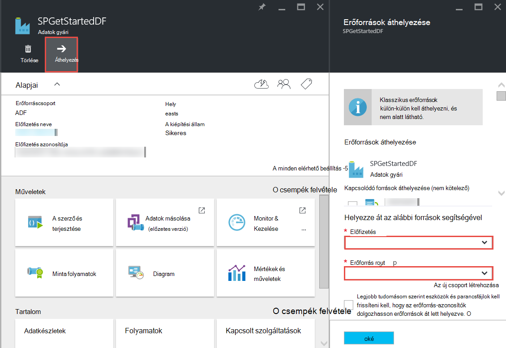

<properties 
    pageTitle="Azure adatok Factory - gyakran ismételt kérdések" 
    description="Gyakori kérdések a a Azure Data Factory." 
    services="data-factory" 
    documentationCenter="" 
    authors="sharonlo101" 
    manager="jhubbard" 
    editor="monicar"/>

<tags 
    ms.service="data-factory" 
    ms.workload="data-services" 
    ms.tgt_pltfrm="na" 
    ms.devlang="na" 
    ms.topic="article" 
    ms.date="09/12/2016" 
    ms.author="shlo"/>

# Azure adatok Factory - gyakran ismételt kérdések

## Általános kérdések

### Mi az Azure Data Factory?

Adatok gyári egy felhőalapú adatok integrálása szolgáltatás, hogy **a mozgás és az adatok átalakítása automatizálja**. Mint a berendezések nyers és alakíthat ki őket a kész áruk futtató gyár adatok gyári orchestrates nyers adatok összegyűjtése és átalakíthatja azt a kész használható információk meglévő szolgáltatások. 
 
Adatok gyári lehetővé teszi az adatok áthelyezése fiókok között mind a helyszíni és felhőbeli adatokat tárolja, valamint számítási szolgáltatások, például a Azure hdinsight szolgáltatáshoz és Azure adatok tó Analytics folyamat/átalakítás az adatoknak adatalapú munkafolyamatok létrehozása. Miután létrehozott egy folyamat, amely a szükséges művelet végrehajtása, ütemezése rendszeres futtatásához (óránkénti, napi, heti stb.).   

További információt talál [– Áttekintés és kulcs fogalmak](data-factory-introduction.md) . 

### Hol találom meg a részleteket árak az Azure Data Factory?

Lásd: az [adatok gyári árak Részletek lap] [ adf-pricing-details] az Azure adatok gyári árak információkat.  

### Hogyan kezdjek hozzá az Azure Data Factory?

- Azure Data Factory áttekintése című témakörben [Azure Data Factory](data-factory-introduction.md).
- **Adatok másolása vagy áthelyezése** , másolása tevékenység használatával kapcsolatos oktatóanyagot lásd: az [adatok másolása az Azure Blob-tárolóhoz Azure SQL-adatbázishoz](data-factory-copy-data-from-azure-blob-storage-to-sql-database.md).
- A HDInsight-struktúra tevékenység egy oktatóprogram **adatokat** olvashat. Lásd: a [folyamat adatainak struktúra parancsfájl Hadoop fürt futtatásával](data-factory-build-your-first-pipeline.md) 
  
### Mi az, hogy az adatok gyári régió elérhetősége?
Az **Amerikai Egyesült Államok nyugati** és **Észak-Európa**Data Factory érhető el. A számítási és tárolási által használt szolgáltatások adatok gyárak más régiókban lehet. Lásd: [támogatott régiók](data-factory-introduction.md#supported-regions). 
 
### Mik azok az adatok gyárak és folyamatok/tevékenységek/adatkészleteket számával?
 
Az [Azure-előfizetést és a szolgáltatás korlátozások, a kvótákat, és a kényszerek](../azure-subscription-service-limits.md#data-factory-limits) cikk lásd: **Azure adatok gyári korlátozása** című szakaszában.

### Mi az a szerzői/Fejlesztőeszközök felület Azure Data Factory szolgáltatással?

A szerző/készíthet adatok gyárak használ, az alábbiak egyikét:

- **Azure portál**  
   az adatok gyári pengéit az Azure-portálon gazdag felhasználói felület gyárak csatolt ad adatszolgáltatások létrehozásához adja meg. Az **Adatok gyári szerkesztő**is részét képező a portálon, lehetővé teszi az eszközzel egyszerűen készíthet csatolt szolgáltatások, táblák, adatkészletek és folyamatok ezen elemek JSON definícióinak megadásával. Lásd: [az első adatok folyamat Azure portálon összeállítása](data-factory-build-your-first-pipeline-using-editor.md) példa létrehozása és adatok gyár telepítése a portálon editor segítségével.

- **Visual Studio**  
   létrehozása az Azure adatok gyári Visual Studio is használhatja. [Az első adatok folyamat, használja a Visual Studio Build](data-factory-build-your-first-pipeline-using-vs.md) talál további információt. 

- **Azure PowerShell**  
   [létrehozása és monitor Azure Data Factory Azure PowerShell használatával](data-factory-build-your-first-pipeline-using-powershell.md) is találhat a oktatóprogram és áttekintése a következő adatok gyár PowerShell használatával hozhat létre. Lásd: az [Adatok gyári parancsmagjai – referencia] [ adf-powershell-reference] egy teljes dokumentációjának gyári adatok parancsmagok MSDN-tár tartalom.
   
- **.NET osztálytár**  
   adatok gyári .NET SDK használatával hozhat létre adatok gyárak programozás útján. Lásd: [jelentések létrehozása, figyelheti, és kezelheti az adatok gyárak .NET SDK használatával](data-factory-create-data-factories-programmatically.md) .NET SDK használatával adatok gyár létrehozásának ismertetését megtalálja. [Adatok gyári osztály tár – segédlet] című témakörben[ msdn-class-library-reference] egy teljes dokumentációjának adatok gyári .NET SDK.

- **REST API**  
   létrehozása és adatok gyárak üzembe is használhatja az Azure Data Factory szolgáltatás által elérhetővé tett REST API-t. Lásd: az [Adatok gyári REST API-hivatkozás] [ msdn-rest-api-reference] átfogó dokumentációjának, az adatok gyári REST API-t.
 
- **Erőforrás-kezelő Azure-sablon** 
   lásd: [oktatóprogram: az első Azure adatok gyári Azure erőforrás-kezelő sablonnal össze](data-factory-build-your-first-pipeline-using-arm.md) fő részleteket. 

### Át lehet nevezni a adatok gyári?
nem. Más Azure erőforrások, például egy Azure adatok gyári neve nem módosíthatók. 

### Áthelyezhetők-e egy adatok gyári Azure előfizetésből között? 
igen. A következő ábrán látható módon használja az adatok gyári lap az **Ugrás** gombra. 

### Mik azok a számítási környezetben Data Factory által támogatott?
Az alábbi táblázat felsorolja a számítási környezetek Data Factory és futtatását is lehetővé teszi őket tevékenységekhez által támogatott. 

| Környezet kiszámítása | tevékenységek |
| ------------------- | -------- | 
| [Igény szerinti HDInsight fürt](data-factory-compute-linked-services.md#azure-hdinsight-on-demand-linked-service) vagy a [saját HDInsight fürthöz](data-factory-compute-linked-services.md#azure-hdinsight-linked-service) | [DotNet](data-factory-use-custom-activities.md) [struktúra](data-factory-hive-activity.md), [malac](data-factory-pig-activity.md), [MapReduce](data-factory-map-reduce.md), [Hadoop-adatfolyam](data-factory-hadoop-streaming-activity.md) | 
| [Azure köteg](data-factory-compute-linked-services.md#azure-batch-linked-service) | [DotNet](data-factory-use-custom-activities.md) |  
| [Azure gépi tanulási](data-factory-compute-linked-services.md#azure-machine-learning-linked-service) | [A gép tevékenységek tanulási: köteg végrehajtása és a frissítés erőforrás](data-factory-azure-ml-batch-execution-activity.md) |
| [Azure adatok tó Analytics](data-factory-compute-linked-services.md#azure-data-lake-analytics-linked-service) | [Adatok tó Analytics U-SQL nyelvben](data-factory-usql-activity.md)
| [Az SQL Server](data-factory-compute-linked-services.md#sql-server-linked-service) [azure SQL](data-factory-compute-linked-services.md#azure-sql-linked-service)és az [Azure SQL-adatraktár](data-factory-compute-linked-services.md#azure-sql-data-warehouse-linked-service), | [Tárolt eljárás](data-factory-stored-proc-activity.md)

## Tevékenységek – gyakori kérdések
### Mik azok a különböző típusú tevékenységek is használhatja a Data Factory során? 

- [Mozgás a tevékenységekre vonatkozó adatok](data-factory-data-movement-activities.md) adatok áthelyezése.
- [Adatok átalakítása tevékenységek](data-factory-data-transformation-activities.md) folyamat/átalakítás adatokat. 

### Ha nem fut a tevékenység?
Az **Elérhetőség** kereséskonfigurációs beállításokat a kimeneti adattábla határozza meg, hogy a tevékenység futtatásakor. Ha a bemeneti adatkészleteket megadva, a tevékenység ellenőrzi, hogy teljesülnek-e a bemeneti adatok-függőségeket (Ez azt jelenti, hogy **készen áll a** állapot) operációs rendszert futtató megkezdése előtt. 

## Másolja a tevékenység – gyakori kérdések
### Az meg jobban, hogy egy folyamat több tevékenységekkel vagy egy különálló folyamat minden egyes tevékenységre vonatkozóan? 
Folyamatok kellene foglalja csomagba a kapcsolódó tevékenységeket. Ha az adatkészleteket, ezeket bejelentkezzen fel nem által a folyamat kívüli bármely tevékenység, a tevékenységek egy folyamat tárolhatja. Ezzel a módszerrel, nem kellene lánc folyamat aktív időszakok, hogy azok egymáshoz igazíthatja. Az adatintegritás a táblázatokban a folyamat belső is, jobban megőrzése, amikor frissíti a folyamat. Frissítési folyamat lényegében leállítja a folyamat tevékenységeit, eltávolítja azokat, és újra hoz létre. A szerzői perspektivikus, is lehet jobban láthatóvá az adatáramlást az folyamat egy JSON-fájl a kapcsolódó tevékenységeket belül.

### Melyek a támogatott adatokat tárolja?
[AZURE.INCLUDE [data-factory-supported-data-stores](../../includes/data-factory-supported-data-stores.md)]

### Melyek a támogatott fájlformátumok? 
[AZURE.INCLUDE [data-factory-file-format](../../includes/data-factory-file-format.md)]

### Ha a másolási művelet a végrehajtott? 
Lásd: [világszerte elérhető adatok mozgását](data-factory-data-movement-activities.md#global) szakaszban további információt. Rövid Ha egy helyszíni adatokat tároló van szó, a Másolás végzi az adatkezelési átjáró a helyszíni környezetben. És, ha az adatok mozgását között két felhő tárolja, a Másolás a legközelebbi ugyanazt a geography gyűjtő helyére régióban műveletet. 

## HDInsight tevékenység – gyakori kérdések

### Milyen régiók HDInsight által támogatott?

Lásd: a földrajzi elérhetősége, a következő cikkben: vagy [HDInsight árak részletek][hdinsight-supported-regions].

### Melyik területen az igény szerinti HDInsight fürt által használt?

Az igény szerinti HDInsight fürt ugyanabban a régióban, amelyben a fürthöz használandó megadott tárolására van jön létre.    

### Hogyan lehet további tárterületet fiókok a HDInsight fürtre hozzárendelése?

Ha a saját HDInsight fürt (BYOC -: A saját fürt hozása) használ, a következő témakörökben olvashatók: 

- [Egy HDInsight fürthöz használata alternatív tároló fiókok és Metastores][hdinsight-alternate-storage]
- [További tárterület fiókok használata HDInsight-struktúra][hdinsight-alternate-storage-2]

Az igény szerinti fürt az adatok gyári szolgáltatás által létrehozott használatakor adja meg a HDInsight további tárterületet fiókokat csatolt szolgáltatás, hogy az adatok gyári szolgáltatás az Ön nevében regisztrálhatja azokat. A JSON-definícióban az igény szerinti csatolt szolgáltatás tulajdonsággal **additionalLinkedServiceNames** alternatív tároló fiókok a következő JSON kódtöredékének látható módon:
 
    {
        "name": "MyHDInsightOnDemandLinkedService",
        "properties":
        {
            "type": "HDInsightOnDemandLinkedService",
            "typeProperties": {
                "clusterSize": 1,
                "timeToLive": "00:01:00",
                "linkedServiceName": "LinkedService-SampleData",
                "additionalLinkedServiceNames": [ "otherLinkedServiceName1", "otherLinkedServiceName2" ] 
            }
        }
    } 

A fenti példában a otherLinkedServiceName1 és otherLinkedServiceName2 csatolt szolgáltatások, amelyeknek definíciók tartalmaz a HDInsight fürt alternatív tároló fiókok eléréséhez szükséges hitelesítő képviseli.

## A szeletek – gyakori kérdések

### Miért nem érhetők el a beviteli szeletek nem kész állapotban?  
A hiba a beállítás **külső** tulajdonság nem **Igaz,** a bemeneti adatkészlet a külső adatok gyári (nincs adat gyári elő) a bemeneti adatok esetén. 

A következő példa csak kell beállítania **a külső** igaz a **dataset1**.  

**DataFactory1** A folyamat 1:-dataset1 > activity1 -> dataset2 -> activity2 dataset3 folyamat 2 ->: dataset3 -> activity3 dataset4 ->

Ha egy folyamat dataset4 (az adatok factory 1 2 folyamat készített), amely a másik adatok gyári, mert az adatkészlet darab termék készült különböző gyár (DataFactory1, nem DataFactory2) szerint egy külső adatkészlet megjelölés dataset4.  

**DataFactory2**    
A folyamat 1:-dataset4 > activity4 dataset5 ->

Ha a külső tulajdonság helyesen van beállítva, győződjön meg arról, hogy létezik-e a bemeneti adatok a bemeneti adatkészlet meghatározása a megadott helyen. 

### Hogyan lehet bármikor, mint amikor a szeletet éppen elő naponta éjfél szelet futtatható?
Az **eltolás** tulajdonság segítségével adja meg az időt, a szeletet készítendő ki. Lásd: [adatkészlet elérhetősége](data-factory-create-datasets.md#Availability) szakaszban olvashat a tulajdonság értékét. Íme egy gyors példa:

    "availability":
    {
        "frequency": "Day",
        "interval": 1,
        "offset": "06:00:00"
    }

Napi szeletek indítsa el a **6 AM** az alapértelmezett éjfél helyett.     

### Hogyan futtathatja a szeletet?
A szeletek futtathatja az alábbi módon: 

- Monitor és kezelése alkalmazás segítségével egy tevékenység ablakban vagy szeletet futtassa újra. [Ismétlése kijelölt tevékenység windows](data-factory-monitor-manage-app.md#re-run-selected-activity-windows) talál utasításokat.   
- Kattintson a **Futtatás** a **SZELETRE** lap az a szeletek az Azure-portálon a parancssávon.
- Futtassa a **Set-AzureRmDataFactorySliceStatus** parancsmagot értékűre **Várakozás** a szeletet állapotú.   
    
        Set-AzureRmDataFactorySliceStatus -Status Waiting -ResourceGroupName $ResourceGroup -DataFactoryName $df -TableName $table -StartDateTime "02/26/2015 19:00:00" -EndDateTime "02/26/2015 20:00:00" 

Lásd: [Set-AzureRmDataFactorySliceStatus] [ set-azure-datafactory-slice-status] parancsmag kapcsolatban további tájékoztatást. 

### Mennyi ideig did tartani egy szeletet feldolgozása?
Intézővel tevékenység ablakban a Monitor és App kezelése, hogy mennyi ideig tartott a szeletre feldolgozása. Lásd: a [Tevékenység ablak Explorer](data-factory-monitor-manage-app.md#activity-window-explorer) további információt. 

A következő az Azure-portálon is elvégezheti:  

1. Kattintson az **Adatok gyári** lap az adatok factory-csempe **adatkészleteket** .
2. Kattintson az adott adatkészlet a a **adatkészleteket** lap.
3. Jelölje ki a szeletet, amelyek érdeklik a **tábla** lap **legutóbbi szeletek** listájából.
4. Kattintson a tevékenységet a **Tevékenység fut** listából a **SZELETRE** lap futtatni. 
5. Kattintson a **Tevékenység futtatása részletek** lap a **Tulajdonságok** csempére. 
6. Meg kell jelennie a **időtartam** mező egy értékkel. Ez az érték a szeletet feldolgozása szükséges idő.   

### Hogyan szüntetheti meg egy futó szeletet?
Ha a végrehajtása a folyamat leállítása kell [Felfüggesztett-AzureRmDataFactoryPipeline](https://msdn.microsoft.com/library/mt603721.aspx) parancsmag is használhatja. Jelenleg felfüggeszti a folyamat nem állítható le a folyamatban lévő szeletet végrehajtások. Miután végzett a folyamatban lévő végrehajtások, nincs további szeletet van felvett.

Valójában szeretne azonnal leállítja az összes végrehajtások, csak akkor is törli a folyamat, és hozza létre újra. Ha úgy dönt, hogy a folyamat törli, nem szükséges táblák és a folyamat által használt csatolt szolgáltatások törlése. 

[create-factory-using-dotnet-sdk]: data-factory-create-data-factories-programmatically.md
[msdn-class-library-reference]: https://msdn.microsoft.com/library/dn883654.aspx
[msdn-rest-api-reference]: https://msdn.microsoft.com/library/dn906738.aspx

[adf-powershell-reference]: https://msdn.microsoft.com/library/dn820234.aspx 
[azure-portal]: http://portal.azure.com
[set-azure-datafactory-slice-status]: https://msdn.microsoft.com/library/mt603522.aspx

[adf-pricing-details]: http://go.microsoft.com/fwlink/?LinkId=517777
[hdinsight-supported-regions]: http://azure.microsoft.com/pricing/details/hdinsight/
[hdinsight-alternate-storage]: http://social.technet.microsoft.com/wiki/contents/articles/23256.using-an-hdinsight-cluster-with-alternate-storage-accounts-and-metastores.aspx
[hdinsight-alternate-storage-2]: http://blogs.msdn.com/b/cindygross/archive/2014/05/05/use-additional-storage-accounts-with-hdinsight-hive.aspx
 
