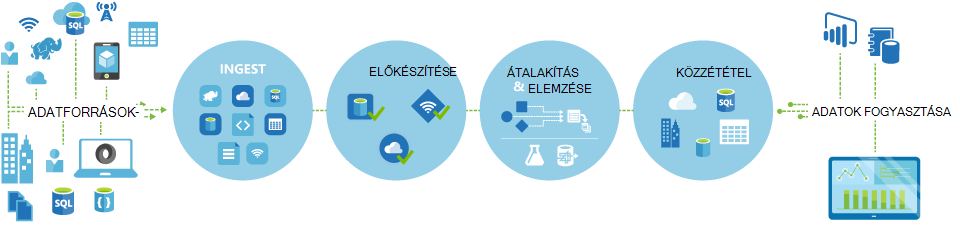
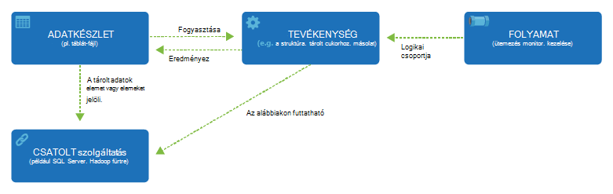

<properties 
    pageTitle="Adatok gyári, adatok integrációs szolgáltatás – bevezetés |} Microsoft Azure" 
    description="Ismerje meg, hogy mi az Azure Data Factory: cloud adatok integrálása orchestrates és szolgáltatás automatizálja mozgását és adatok átalakítása." 
    keywords="Mi az azure adatok gyári adatok integrálása felhő adatok integrálása,"
    services="data-factory" 
    documentationCenter="" 
    authors="sharonlo101" 
    manager="jhubbard" 
    editor="monicar"/>

<tags 
    ms.service="data-factory" 
    ms.workload="data-services" 
    ms.tgt_pltfrm="na" 
    ms.devlang="na" 
    ms.topic="get-started-article" 
    ms.date="09/22/2016" 
    ms.author="shlo"/>

# Azure adatok gyári szolgáltatás, egy adatok integrálása a felhőben – bevezetés

## Mi az Azure Data Factory? 
Adatok gyári orchestrates és automatizálja a **Mozgás** és az adatok **átalakítása** felhőalapú adatok integrációs szolgáltatás. Adatok integrálása megoldásokat az adatok gyári szolgáltatással is ingest különböző adatokat tárolja az adatokat, átalakítás/folyamat az adatok és az eredményül kapott adatokat az adatokat tárolja közzététele hozhat létre. 

Adatok gyári szolgáltatáson keresztül, és létrehozása az adatok folyamatok áthelyezése és az adatokat, majd futtassa a folyamatok megadott időközönként (óránkénti, napi, heti stb.). A leszármazással és az adatok folyamatok közötti függőségek megjelenítése, és figyelemmel követheti a összes az adatok folyamatok egyszerűen vezérlőkre problémák és figyelése értesítések beállítása egyetlen egységesített nézetből való széles tárházát is tartalmaz.

**Figure1.** Különböző forrásokból származó adatok ingest, előkészítése, átalakítás, és az adatok elemzése és tegye közzé a használatra kész adatok fogyasztása.

## Folyamatok, és a tevékenységek
Az adatok gyári megoldást hozzon létre egy vagy több adat **folyamatok**. Egy folyamat egy logikai tevékenységek csoportosítása. Csoporttevékenységek egységbe foglalására, amely a közös feladatokat szolgálnak. 

**Tevékenységek** megadása a műveletek elvégzéséhez az adatokon. Például a Másolás tevékenységének segítségével előfordulhat, hogy egy adattár adatainak másolása egy másik adattár. Hasonlóképpen a struktúra tevékenységének, futó struktúra lekérdezés-átalakítás, vagy az adatok elemzése Azure hdinsight szolgáltatáshoz fürt használhatók. Adatok gyári támogatja a tevékenységek kétféle: adatok mozgását tevékenységeket és adatok átalakítása tevékenységeket. 
  
## Mozgás a tevékenységekre vonatkozó adatok 
[AZURE.INCLUDE [data-factory-supported-data-stores](../../includes/data-factory-supported-data-stores.md)]

Lásd: [A tevékenységekre vonatkozó adatok mozgás](data-factory-data-movement-activities.md) a cikk további információt. 

## A tevékenységekre vonatkozó adatok transzformációt hajt végre.
[AZURE.INCLUDE [data-factory-transformation-activities](../../includes/data-factory-transformation-activities.md)]

Lásd: [A tevékenységekre vonatkozó adatok átalakítása](data-factory-data-transformation-activities.md) cikk további információt.

Ha módosítani szeretné áthelyezni adatok/származó adatok tárolására, hogy másolás tevékenység nem támogatja, vagy adatokat a saját logika, hozzon létre egy **egyéni .NET tevékenységeket**. Létrehozásával és használatával egyéni tevékenység részletekért olvassa el [az Azure Data Factory során egyéni tevékenységeknek](data-factory-use-custom-activities.md).

## Kapcsolt szolgáltatások
Csatolt szolgáltatások meghatározása a külső erőforrások csatlakozhat Data Factory szükséges információt (például: Azure tárolására, a helyszíni SQL Server Azure hdinsight szolgáltatáshoz). Az adatok gyári két célra csatolt szolgáltatásokat használja:

- Ábrázolására egy **adattár** többek között, de nem kizárólag egy helyszíni SQL Server Oracle-adatbázishoz, a megosztás vagy a Azure Blob-tárolóhoz fiók fájl. A támogatott készletei lista [Mozgás a tevékenységekre vonatkozó adatok](data-factory-data-movement-activities.md) szakaszban olvashat. 
- Ábrázolására, egy **erőforrás számítja ki** , hogy a tevékenység végrehajtását üzemeltetheti. Ha például a HDInsightHive tevékenység fut, egy HDInsight Hadoop fürthöz. Lásd: [a tevékenységekre vonatkozó adatok átalakítása](data-factory-data-transformation-activities.md) szakasz listáját a támogatott számítási környezetek. 

## Adatkészletek 
Kapcsolt szolgáltatások adatokat tárolja az Azure adatok gyári hivatkozás. Adatkészleteket jelenítik meg az adatokat tárolja a adatstruktúrák. Például az Azure csatolt tárhelyszolgáltatáshoz tartalmaz kapcsolati adatok Data Factory-Azure tároló fiókhoz való csatlakozáshoz. Az Azure Blob-adatkészlet adja meg a blob-tárolóhoz és egy mappát az Azure Blob-tárolóhoz, amelyből a folyamat olvassa el az adatokat. Hasonlóképpen az Azure SQL-csatolt szolgáltatása kapcsolati adatok Azure SQL-adatbázishoz, és egy Azure SQL-adatkészlet Itt adhatja meg az adatokat tartalmazó táblázat.   

## Adatok gyári entitás közötti kapcsolat
Adatok gyári tartalmaz néhány fontosabb intézmények, amely a közös munka határozza meg a bemeneti és kimeneti adatok, eseményeket, és az ütemezés, és hajtsa végre a kívánt adatokat továbbításához szükséges erőforrások feldolgozása.

**ábra 2.** Adatkészlet, tevékenységet, folyamat és csatolt szolgáltatás közötti kapcsolatok

A csatolt szolgáltatások, a adatkészleteket, a tevékenységek és folyamatok négy egyszerű fogalmak készen áll a kezdéshez! Azt is megteheti, hogy [az első folyamat összeállítása](data-factory-build-your-first-pipeline.md). 

## A támogatott régiók
Jelenleg a **Nyugati Amerikai Egyesült Államok**, **Kelet-amerikai**és **Észak-Európa** régiók adatok gyárak hozhat létre. Azonban adatok gyár adatokat tárolja érhetik el és egyéb adatok áthelyezése fiókok között adatokat tárolja az Azure régiókban szolgáltatások számítja ki vagy folyamat az adatoknak a szolgáltatások számítja ki. 

Azure Data Factory, magát nem tárolja az adatokat. Lehetővé teszi, hogy adatalapú pénzáramlások [támogatott adatokat tárolja](data-factory-data-movement-activities.md#supported-data-stores) , és használja a [szolgáltatások kiszámítása](data-factory-compute-linked-services.md) más régiókban vagy egy helyszíni környezetben adatok feldolgozásának közötti mozgás téve létrehozása. Azt is lehetővé teszi [figyelheti és kezelheti a munkafolyamatok](data-factory-monitor-manage-pipelines.md) mindkettő programozott használata és a felhasználói felület mechanizmusok. 

Habár az Azure Data Factory csak a **Nyugati Amerikai Egyesült Államok**, a **Kelet-Amerikai Egyesült Államokban**és a **Észak-Europe** régióban érhető el, a szolgáltatást, az adatok mozgását az adatok gyári – áttekintés elérhető [globálisan](data-factory-data-movement-activities.md#global) több területen is. Abban az esetben, ha egy adattár helyezkedik el tűzfal mögött majd telepítve van az [Adatkezelési átjáró](data-factory-move-data-between-onprem-and-cloud.md) a helyszíni környezet inkább áthelyezi az adatokat. 

Példát tudassa velünk feltételezik, hogy a számítási környezetben, például az Azure hdinsight szolgáltatáshoz fürt és Azure gépi tanulási futtatja a Europe nyugati régió ki. Hozzon létre és Észak-Európa Azure Data Factory-példány használja, és a nyugati Európában számítási-környezetekkel kapcsolatos feladatok ütemezése használatával. Az adatok gyári szeretne elindítani a számítási területen a feladat néhány ezredmásodperc vesz igénybe, de nem változtatja meg a időpontot tudja kiválasztani a feladat futtatása a számítási területen.

Szándékában áll minden Azure által támogatott későbbi földrajzi Azure Data Factory van-e.
  
## Következő lépések
Megtudhatja, hogyan hozhat létre az adatok folyamatok az adatok gyárak, az alábbi oktatóanyagok a lépésenkénti utasításokat követve. 

Oktatóprogram | Leírás
-------- | -----------
[A Hadoop fürt segítségével adatokat feldolgozó adatok folyamat összeállítása](data-factory-build-your-first-pipeline.md) | Ebben az oktatóanyagban generál az első Azure adatok gyári egy adatok és **folyamatok adatok** struktúra parancsprogram-Azure hdinsight szolgáltatáshoz (Hadoop) fürtre futtatásával. |
[Az adatok áthelyezése fiókok között két felhő adatokat tárolja a adatok folyamat összeállítása](data-factory-copy-data-from-azure-blob-storage-to-sql-database.md) | Ebben az oktatóanyagban hoz létre egy adatok gyári egy folyamat az **adatokat helyezi át** , hogy Blob-tárolóhoz SQL-adatbázishoz.
[Adatok áthelyezése fiókok között egy helyszíni adatok áruházból, és a felhő adattár az adatkezelési átjáró segítségével egy adatok folyamat összeállítása](data-factory-move-data-between-onprem-and-cloud.md) | Ebben az oktatóanyagban generál egy folyamat az adatok gyár, hogy **adatokat helyezi át** egy **helyszíni** SQL Server-adatbázisból az Azure blob. Az útmutató részeként telepítse, és állítsa be az adatkezelési átjáró a számítógépre. 
