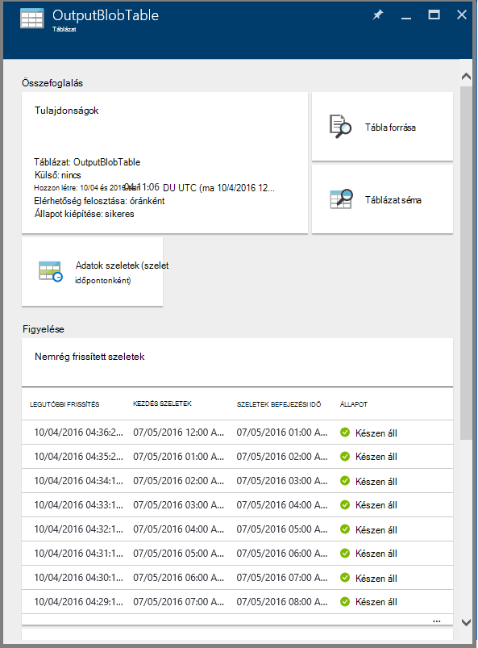
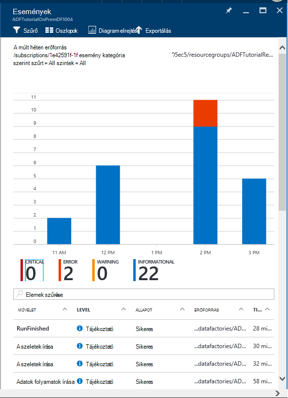
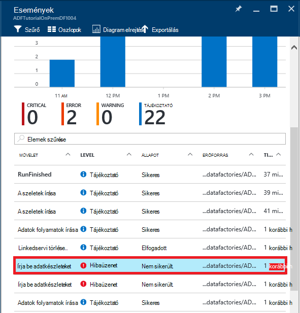
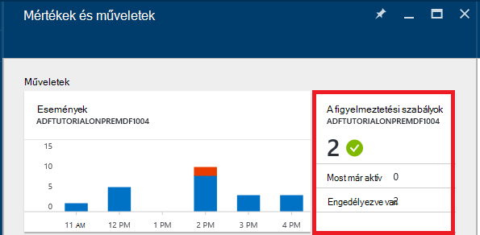

<properties 
    pageTitle="Figyelésére és Azure Data Factory folyamatok kezelése" 
    description="Megtudhatja, hogy miként Azure-portál és Azure PowerShell használatával figyelésére és Azure adatok gyárak és folyamatok létrehozott kezelése." 
    services="data-factory" 
    documentationCenter="" 
    authors="spelluru" 
    manager="jhubbard" 
    editor="monicar"/>

<tags 
    ms.service="data-factory" 
    ms.workload="data-services" 
    ms.tgt_pltfrm="na" 
    ms.devlang="na" 
    ms.topic="article" 
    ms.date="09/06/2016" 
    ms.author="spelluru"/>

# Figyelésére és Azure Data Factory folyamatok kezelése
> [AZURE.SELECTOR]
- [Azure portál/Azure PowerShell használatával](data-factory-monitor-manage-pipelines.md)
- [Használatával a figyelés és felügyeleti alkalmazás](data-factory-monitor-manage-app.md)

Az adatok gyári szolgáltatás megbízható és készültségi nézetet a tárhely, kezelését és adatok mozgását szolgáltatások is biztosít. A szolgáltatás lehetővé a felügyeleti Irányítópult segítséget nyújt, amelyek segítségével hajtsa végre az alábbi műveleteket: 

- Gyorsan értékeli végpont adatok folyamat állapota.
- Kapcsolatos problémák azonosítása és korrekciós lépéseket, ha szükséges. 
- Változáskövetési adatok leszármazással. 
- A Kapcsolatok nyomon a forrásokban végig az adatok között.
- Feladat végrehajtását, a rendszerállapot és függőségek megjelenítése teljes korábbi könyvelési.

Ez a cikk leírja, hogy miként figyelheti, kezelése és a folyamatok hibakeresési. Értesítések létrehozása, és értesítést kaphat hibákkal kapcsolatos információkat is tartalmazza.

## Folyamatok, és a tevékenység államok ismertetése
Az Azure-portálra a alábbi műveleteket végezheti el:

- Az adatok gyári megtekinteni diagram létrehozása
- Egy folyamat tevékenységek megtekintése
- Bemeneti és kimeneti adatkészleteket megtekintése
- és az egyéb. 

A szakasz is ismerteti, hogyan szelet átmenetek egy állam egy másik állapotára.   

### Nyissa meg az adatok gyári
1.  Jelentkezzen be az [Azure-portálon](https://portal.azure.com).
2.  A bal oldali menüjében kattintson az **adatok gyárak** . Ha nem látható, kattintson a **További szolgáltatások >** , és kattintson a **adatok gyárak** **INTELLIGENCIA + ANALYTICS** kategória alatt. 

    

    Meg kell jelennie a **adatok gyárak** lap a adatok gyárak. 
4. Az adatok gyárak lap válassza a data factory érdeklik.

      
5.  és meg kell jelennie a data factory honlapját (**Data factory** lap).

    

#### Az adatok gyári diagram nézete
A Diagram nézet adatok gyár üveg figyelésére és az adatok gyári és fekteti kezelése egyetlen ablaktábla biztosít.

Az adatok gyári diagram megtekintheti, kattintson a **Diagram** adatok factory kezdőlapján.

Nagyítás, Kicsinyítés, a Nagyítás igazítása, 100 %-os nagyítás, a diagram elrendezésének zárolása és automatikusan elhelyezi a folyamatok és táblázatok. Megtekintheti az adatok felsorolása (a kijelölt elemek felsőbb szintű és lefelé irányuló elemek megjelenítése).
 

### Egy folyamat belül tevékenységek 
1. Kattintson a jobb gombbal a folyamat, és kattintson a **Megnyitás folyamat** minden tevékenységet a bemeneti és kimeneti, a tevékenységek adatkészleteket együtt során megjelenítéséhez. Ez a funkció akkor hasznos, ha a a folyamat magában foglalja a egynél több tevékenység és megérteni a működési leszármazással egy egyetlen folyamat szeretne.

      
2. Az alábbi példa a két tevékenység a során a ráfordítások és a kimeneti értékeket láthatók. A tevékenység **JoinData** HDInsight-struktúra tevékenység típusú és **EgressDataAzure** másolás tevékenység típusú című szerepelnek, a minta folyamat. 
    
     
3. A webhely-navigációs bal felső sarokban lévő adatok gyári hivatkozására kattintva megkeresheti vissza az adatokat Factory kezdőlapján.

    

### Egy folyamat belül az egyes tevékenységek állapotát
Egy tevékenység aktuális állapotát megtekintheti az adatkészleteket, a tevékenység készített bármelyikét állapotának megtekintése. 

Példa: a következő példában a **BlobPartitionHiveActivity** sikeresen és a megtermelt egy adatkészlet nevű **PartitionedProductsUsageTable**, amely **készen** állapotban van.

Kattintson duplán a diagram nézetben a **PartitionedProductsUsageTable** bővíthető másik tevékenységeket fut belül egy folyamat által létrehozott összes szeletet. Győződjön meg arról, hogy a **BlobPartitionHiveActivity** sikeresen havonta futtatta megjelenik az előző nyolc hónap, és **készen áll a** állapotban szeletet mutatni.

Az adatkészlet adatok gyári körcikkei lehetnek az alábbi állapotok egyikét:

<table>
<tr>
    <th align="left">Állam</th><th align="left">Alállapota</th><th align="left">Leírás</th>
</tr>
<tr>
    <td rowspan="8">Várakozás</td><td>ScheduleTime</td><td>Az a szeletek futtatásához nem eljött az ideje annak.</td>
</tr>
<tr>
<td>DatasetDependencies</td><td>A felsőbb szintű függőségeket nem készen állnak.</td>
</tr>
<tr>
<td>ComputeResources</td><td>A számítási erőforrások nem érhetők el.</td>
</tr>
<tr>
<td>ConcurrencyLimit</td> <td>A tevékenység-példányok elfoglaltak futtatása más szeletek.</td>
</tr>
<tr>
<td>ActivityResume</td><td>Tevékenység fel van függesztve, és nem futtatható a szeletek, csak akkor folytatódik.</td>
</tr>
<tr>
<td>Ismételje meg</td><td>Tevékenység végrehajtását megismétlése.</td>
</tr>
<tr>
<td>Adatérvényesítési</td><td>Adatérvényesítési még nem kezdődött.</td>
</tr>
<tr>
<td>ValidationRetry</td><td>Várakozás az érvényesítési kell ismételni.</td>
</tr>
<tr>
<tr
<td rowspan="2">Esetbejegyzések</td><td>Érvényesítése</td><td>Adatérvényesítési folyamatban van.</td>
</tr>
<td></td>
<td>A szeletek feldolgozása.</td>
</tr>
<tr>
<td rowspan="4">Nem sikerült.</td><td>Időtúllépése</td><td>Végrehajtási tartott hosszabb, amely szerint a tevékenység engedélyezve van.</td>
</tr>
<tr>
<td>Lemondva</td><td>Felhasználói művelet megszakítja.</td>
</tr>
<tr>
<td>Adatérvényesítési</td><td>Sikertelen volt.</td>
</tr>
<tr>
<td></td><td>Nem sikerült készítése és/vagy a szeletet érvényesíteni.</td>
</tr>
<td>Készen áll</td><td></td><td>A szeletek készen áll a felhasználás.</td>
</tr>
<tr>
<td>Kihagyott</td><td></td><td>A szeletek feldolgozása nem.</td>
</tr>
<tr>
<td>Nincs lehetőség</td><td></td><td>Más állapotú olyan használja, de vissza nem állítja szeletek.</td>
</tr>
</table>

A részletes adatait egy szeletet a egy szeletet bejegyzése a **Szeletek nemrég frissített** lap kattintva tekinthető meg.

 
A szeletek többször végrehajtva, ha a **tevékenység fut** listában több sor látni. Megtekintheti, hogy egy **tevékenység fut** listában szereplő futtatása bejegyzések indítása tevékenység részleteit. A lista mellett megjelenő hibaüzenet, ha vannak ilyenek naplófájlok mutatja. Ez a funkció akkor hasznos, megtekintése és naplók hibakeresési az adatok gyári elhagyása nélkül.

Ha a szeletet nem **kész** állapotú, megjelenik a felsőbb szintű szeletek, amely nem készen áll, amelyek gátolják az aktuális szelet menjen végbe **, amelyek nem áll készen felsőbb szintű szeletek** listában. Ez a funkció akkor hasznos, ha a a szeletek **Várakozás** állapotban van, és szeretné megérteni a felsőbb szintű függőségek, amelyen a szeletet várakozik.

### Adatkészlet diagramja
Miután az adatok gyár rendszerbe, és a folyamatok van érvényes aktív pontra, az adatkészlet egy állam áttűnés szeletre között. Jelenleg a szeletek állapot követi a következő diagramja:

Az adatok gyári adatkészlet állam áttűnés áramlás: Várakozás-a-végrehajtási vagy a folyamatban lévő (Validating) > -> kész/sikertelen

A szeletek előtti feltételek teljesülése esetén végrehajtása **Várakozás** állapotban indítása. Ezután a tevékenység kezdésének végrehajtása, és a szeletet **Folyamatban** állapotú kerül. A tevékenység végrehajtását sikeres vagy sikertelen lesz. A szeletek van megjelölve, **készen áll**, " **nem sikerült** a végrehajtás az eredménytől függően vagy. 

A szeletek **kész** vagy **hibás** állam való visszatéréshez **Várakozás** állapot visszaállíthatja. **Átugrása**, amely megakadályozza, hogy a tevékenység végrehajtása a szeletek állapotának is megjelölheti, és a szeletet folyamat.

## Folyamatok kezelése
A folyamatok Azure PowerShell használatával kezelheti. Például mutasson, és folytathatja a folyamatok Azure PowerShell-parancsmagok futtatásával. 

### Mutasson az egérrel, és folyamatok folytatása
Akkor is szünet/felfüggesztheti a **Felfüggesztett-AzureRmDataFactoryPipeline** Powershell parancsmaggal folyamatok. Ezzel a parancsmaggal akkor hasznos, ha nem szeretné futtatni a folyamatok, amíg a probléma megoldódott.

Példa: az alábbi képernyőfelvételen, a probléma lett észlelt a **PartitionProductsUsagePipeline** **productrecgamalbox1dev** adatok gyári az a, és szeretnénk kell függeszteni a folyamat.

Egy folyamat felfüggesztésére, futtassa az alábbi PowerShell-parancsot:

    Suspend-AzureRmDataFactoryPipeline [-ResourceGroupName] <String> [-DataFactoryName] <String> [-Name] <String>

Példa:

    Suspend-AzureRmDataFactoryPipeline -ResourceGroupName ADF -DataFactoryName productrecgamalbox1dev -Name PartitionProductsUsagePipeline 

Ha a probléma a **PartitionProductsUsagePipeline**a rögzített, a felfüggesztett folyamat folytatható az alábbi PowerShell parancs futtatásával:

    Resume-AzureRmDataFactoryPipeline [-ResourceGroupName] <String> [-DataFactoryName] <String> [-Name] <String>

Példa:

    Resume-AzureRmDataFactoryPipeline -ResourceGroupName ADF -DataFactoryName productrecgamalbox1dev -Name PartitionProductsUsagePipeline 

## Folyamatok hibakeresése
Azure Data Factory keresztül Azure-portál és Azure PowerShell hibakeresési és folyamatok elhárítása multimédiás szolgáltatásokat nyújt.

### Egy folyamat hibák keresése
Ha a tevékenység futtatás nem sikerül egy során, az adatkészlet a folyamat készített meghibásodása miatt hibát állapotban van. Hibakeresési, és használja az alábbi eljárások Azure Data Factory hibáinak elhárítása.

#### Azure portal segítségével hibakeresési hibát:

3.  A **tábla** lap kattintson a probléma szeletet **állapot** értékűre **sikertelen**.

    
4.  Kattintson a tevékenység futtatása, amely nem sikerült a **SZELETRE** lap.
    
    
5.  A **Tevékenység futtatása részletek** lap a HDInsight feldolgozása társított fájlokat tölthet. Az állapot/stderr a hiba részleteit tartalmazó hibanaplófájl letöltése a letöltés elemre.

      

#### A PowerShell-lel való hibakeresési hiba
1.  Indítsa el az **Azure PowerShell**.
3.  Futtassa a **Get-AzureRmDataFactorySlice** parancsot a szeletek és állapotukat. Meg kell jelennie a állapotú szeletek: **nem sikerült**.       

            Get-AzureRmDataFactorySlice [-ResourceGroupName] <String> [-DataFactoryName] <String> [-TableName] <String> [-StartDateTime] <DateTime> [[-EndDateTime] <DateTime> ] [-Profile <AzureProfile> ] [ <CommonParameters>]
    
    Példa:
        
            Get-AzureRmDataFactorySlice -ResourceGroupName ADF -DataFactoryName LogProcessingFactory -TableName EnrichedGameEventsTable -StartDateTime 2014-05-04 20:00:00

    A Set-AzureRmDataFactoryPipelineActivePeriod megadott StartDateTime érték **StartDateTime** cserélje ki.
4. Most futtassa a **Get-AzureRmDataFactoryRun** parancsmag részleteket szeretne megtudni a szeletet futtatása tevékenység.

        Get-AzureRmDataFactoryRun [-ResourceGroupName] <String> [-DataFactoryName] <String> [-TableName] <String> [-StartDateTime] 
        <DateTime> [-Profile <AzureProfile> ] [ <CommonParameters>]
    
    Példa:

        Get-AzureRmDataFactoryRun -ResourceGroupName ADF -DataFactoryName LogProcessingFactory -TableName EnrichedGameEventsTable -StartDateTime "5/5/2014 12:00:00 AM"

    A kezdési időpontot, az a hiba/probléma szeletek az előző lépésben lejegyzett StartDateTime értéke. A dátum és idő dupla idézőjelek közé kell tenni.
5.  Meg kell jelennie a kimenet (az alábbihoz hasonló) a hiba adatait:

            Id                      : 841b77c9-d56c-48d1-99a3-8c16c3e77d39
            ResourceGroupName       : ADF
            DataFactoryName         : LogProcessingFactory3
            TableName               : EnrichedGameEventsTable
            ProcessingStartTime     : 10/10/2014 3:04:52 AM
            ProcessingEndTime       : 10/10/2014 3:06:49 AM
            PercentComplete         : 0
            DataSliceStart          : 5/5/2014 12:00:00 AM
            DataSliceEnd            : 5/6/2014 12:00:00 AM
            Status                  : FailedExecution
            Timestamp               : 10/10/2014 3:04:52 AM
            RetryAttempt            : 0
            Properties              : {}
            ErrorMessage            : Pig script failed with exit code '5'. See wasb://     adfjobs@spestore.blob.core.windows.net/PigQuery
                                            Jobs/841b77c9-d56c-48d1-99a3-
                        8c16c3e77d39/10_10_2014_03_04_53_277/Status/stderr' for
                        more details.
            ActivityName            : PigEnrichLogs
            PipelineName            : EnrichGameLogsPipeline
            Type                    :
    
    
6.  **Mentés-AzureRmDataFactoryLog** parancsmag futtatását is lehetővé teszi a kimenet megtekintheti, és töltse le a parancsmag használata a **-DownloadLogsoption** naplófájlokat Id értékkel.

            Save-AzureRmDataFactoryLog -ResourceGroupName "ADF" -DataFactoryName "LogProcessingFactory" -Id "841b77c9-d56c-48d1-99a3-8c16c3e77d39" -DownloadLogs -Output "C:\Test"

## Futtassa újra a hibák egy során

### Azure portál használatával

Miután hibaelhárítási, és a folyamat hibáit hibakeresési, futtathatja a hibák, lépjen a hiba szeletet megnyitásához kattintson a **Futtatás** gombra a parancssávon.

Abban az esetben, ha a szeletet érvényességi szabály hiba miatt sikertelen volt (az ex: adatok nem érhető el), a hiba kijavítása, és ellenőrizze újra a parancssáv **érvényesítése** gombjára kattintva.

### Azure PowerShell használatával

A Set-AzureRmDataFactorySliceStatus parancsmaggal hibák futtathatja. Lásd: [Set-AzureRmDataFactorySliceStatus](https://msdn.microsoft.com/library/mt603522.aspx) témakör szintaxis és további részleteket a parancsmag. 

**Példa:** A következő példa állítja be a tábla összes szeletet állapotának 'DAWikiAggregatedData' "Várakozás" az Azure adatok gyári "WikiADF".

A UpdateType értéke UpstreamInPipeline, ami azt jelenti, hogy minden függő (felsőbb szintű) tábla és a tábla minden egyes szeletet állapotok van beállítva "Várakozás." Más lehetséges a paraméter értéke "A személy,."

    Set-AzureRmDataFactorySliceStatus -ResourceGroupName ADF -DataFactoryName WikiADF -TableName DAWikiAggregatedData -Status Waiting -UpdateType UpstreamInPipeline -StartDateTime 2014-05-21T16:00:00 -EndDateTime 2014-05-21T20:00:00

## Értesítések létrehozása
Azure naplók felhasználói eseményeket egy Azure erőforrás (például adatok factory) létrehozott, frissítése vagy törölt. Riasztások az esemény is létrehozhat. Adatok gyári lehetővé teszi különböző mértékek rögzíthet és értesítések létrehozása mérési módja miatt. Azt javasoljuk, hogy használható események valós idejű figyelemmel kísérésére és mérőszámok korábbi célból. 

### Események értesítéseket
Azure események be, hogy mi történik az Azure erőforrások hasznos Hírcsatornájában biztosítanak. Azure naplók felhasználói eseményeket egy Azure erőforrás (például adatok factory) létrehozott, frissítése vagy törölt. Az Azure Data Factory használatakor jön létre esemény, ha:

- Azure Data Factory létrehozott/frissítése vagy törölt.
- Adatkezelési (más néven fut másként) lépések/befejeződött.
- Az igény szerinti HDInsight fürt létrejön, és eltávolítja.

Említett felhasználói eseményekkel kapcsolatos értesítések létrehozása, és konfigurálhatók úgy, hogy a rendszergazda, és az előfizetés további rendszergazdák értesítő e-mailek küldése. Ezeken kívül adhatja meg a felhasználóknak, akiknek e-mailben értesítést kapni, a feltételek teljesülése esetén további e-mail címek. Ez a funkció akkor hasznos, ha a hibákkal kapcsolatos értesítés szeretne, és nem szeretne folyamatosan figyelheti a adatok gyári.

> [AZURE.NOTE] Jelenleg a portálon nem jelennek meg figyelmeztetések eseményekről. A [Figyelés és felügyeleti alkalmazás](data-factory-monitor-manage-app.md) segítségével összes riasztást látni.

#### Az értesítési definíció megadása:
Adjon meg egy figyelmeztető definícióját, hozzon létre egy leíró a műveletek, amelyet szeretne megkapni a JSON fájlt. A következő példában az értesítést küld a RunFinished művelet e-mailben értesítést. Ahhoz, hogy bizonyos, e-mailben értesítést küldött, amikor befejezte a Futtatás adatok gyári és a Futtatás nem sikerült (állapot = FailedExecution).

    {
        "contentVersion": "1.0.0.0",
         "$schema": "http://schema.management.azure.com/schemas/2014-04-01-preview/deploymentTemplate.json#",
        "parameters": {},
        "resources": 
        [
            {
                "name": "ADFAlertsSlice",
                "type": "microsoft.insights/alertrules",
                "apiVersion": "2014-04-01",
                "location": "East US",
                "properties": 
                {
                    "name": "ADFAlertsSlice",
                    "description": "One or more of the data slices for the Azure Data Factory has failed processing.",
                    "isEnabled": true,
                    "condition": 
                    {
                        "odata.type": "Microsoft.Azure.Management.Insights.Models.ManagementEventRuleCondition",
                        "dataSource": 
                        {
                            "odata.type": "Microsoft.Azure.Management.Insights.Models.RuleManagementEventDataSource",
                            "operationName": "RunFinished",
                            "status": "Failed",
                            "subStatus": "FailedExecution"   
                        }
                    },
                    "action": 
                    {
                        "odata.type": "Microsoft.Azure.Management.Insights.Models.RuleEmailAction",
                        "customEmails": [ "<your alias>@contoso.com" ]
                    }
                }
            }
        ]
    }

A JSON definíciójához képest **Részállapot** távolítható el, ha nem szeretné megkapni az egy adott hiba esetén.

Ebben a példában az értesítés az előfizetése összes adatok gyárak beállítja. Ha azt szeretné, hogy egy adott adatok gyári beállítva a riasztást, akkor az **adatforrás**adatok gyári **resourceUri** megadhatja:

    "resourceUri" : "/SUBSCRIPTIONS/<subscriptionId>/RESOURCEGROUPS/<resourceGroupName>/PROVIDERS/MICROSOFT.DATAFACTORY/DATAFACTORIES/<dataFactoryName>"

Az alábbi táblázat a listát ad az elérhető műveletek és állapot (és a részleges állapotok).

Művelet neve | Állapot | Sub állapota
-------------- | ------ | ----------
RunStarted | Lépések | Indítása
RunFinished | Nem sikerült / sikeres | FailedResourceAllocation  Sikeres  FailedExecution  Időtúllépése  < megszakad  FailedValidation  Félbehagyott
OnDemandClusterCreateStarted | Lépések
OnDemandClusterCreateSuccessful | Sikeres
OnDemandClusterDeleted | Sikeres

Kapcsolatos további tudnivalók: [Hozzon létre szabályt](https://msdn.microsoft.com/library/azure/dn510366.aspx) JSON elemeket a példában. 

#### Az értesítés üzembe helyezése 
Az értesítés üzembe helyezéséhez az Azure PowerShell-parancsmag használata: **Új-AzureRmResourceGroupDeployment**, az alábbi példában látható módon:

    New-AzureRmResourceGroupDeployment -ResourceGroupName adf -TemplateFile .\ADFAlertFailedSlice.json  

Miután az erőforrás csoport telepítési sikeresen befejeződött, a következő üzenet jelenik meg:

    VERBOSE: 7:00:48 PM - Template is valid.
    WARNING: 7:00:48 PM - The StorageAccountName parameter is no longer used and will be removed in a future release.
    Please update scripts to remove this parameter.
    VERBOSE: 7:00:49 PM - Create template deployment 'ADFAlertFailedSlice'.
    VERBOSE: 7:00:57 PM - Resource microsoft.insights/alertrules 'ADFAlertsSlice' provisioning status is succeeded
    
    DeploymentName    : ADFAlertFailedSlice
    ResourceGroupName : adf
    ProvisioningState : Succeeded
    Timestamp         : 10/11/2014 2:01:00 AM
    Mode              : Incremental
    TemplateLink      :
    Parameters        :
    Outputs           :

> [AZURE.NOTE] Az [Értesítés szabály létrehozása](https://msdn.microsoft.com/library/azure/dn510366.aspx) REST API segítségével hozzon létre egy szabályt. A JSON-tartalom a JSON példához hasonló.  

#### Az Azure erőforrás csoport telepítések lista beolvasása
A telepített Azure erőforráscsoport telepítések listáját beolvasásához, használja a parancsmag: **Get-AzureRmResourceGroupDeployment**, az alábbi példában látható módon:

    Get-AzureRmResourceGroupDeployment -ResourceGroupName adf
    
    DeploymentName    : ADFAlertFailedSlice
    ResourceGroupName : adf
    ProvisioningState : Succeeded
    Timestamp         : 10/11/2014 2:01:00 AM
    Mode              : Incremental
    TemplateLink      :
    Parameters        :
    Outputs           :

#### Hibaelhárítási felhasználói események

1. A **mértékek és a műveletek** csempe parancsra kattintást követően létrehozott összes eseményének megjelenik.

    

2. Kattintson az események megtekintéséhez **események** csempére. 

    
3. Az **események** lap események részleteit, események szűrése és így tovább. 

    
4. Kattintson egy **műveletet** a hibát okozó műveletek listában.
    
     
5. Kattintson **a hiba részleteit a hibaként** .

    
  

Lásd: [Azure betekintést parancsmagok](https://msdn.microsoft.com/library/mt282452.aspx) cikk hozzáadása/get/eltávolítás figyelmeztetések segítségével PowerShell-parancsmagok. Íme néhány példa a **Get-AlertRule** parancsmaggal: 

    PS C:\> get-alertrule -res $resourceGroup -n ADFAlertsSlice -det
        
            Properties :
            Action      : Microsoft.Azure.Management.Insights.Models.RuleEmailAction
            Condition   :
            DataSource :
            EventName             :
            Category              :
            Level                 :
            OperationName         : RunFinished
            ResourceGroupName     :
            ResourceProviderName  :
            ResourceId            :
            Status                : Failed
            SubStatus             : FailedExecution
            Claims                : Microsoft.Azure.Management.Insights.Models.RuleManagementEventClaimsDataSource
            Condition   :
            Description : One or more of the data slices for the Azure Data Factory has failed processing.
            Status      : Enabled
            Name:       : ADFAlertsSlice
            Tags       :
            $type          : Microsoft.WindowsAzure.Management.Common.Storage.CasePreservedDictionary, Microsoft.WindowsAzure.Management.Common.Storage
            Id: /subscriptions/<subscription ID>/resourceGroups/<resource group name>/providers/microsoft.insights/alertrules/ADFAlertsSlice
            Location   : West US
            Name       : ADFAlertsSlice
    
    PS C:\> Get-AlertRule -res $resourceGroup

            Properties : Microsoft.Azure.Management.Insights.Models.Rule
            Tags       : {[$type, Microsoft.WindowsAzure.Management.Common.Storage.CasePreservedDictionary, Microsoft.WindowsAzure.Management.Common.Storage]}
            Id         : /subscriptions/<subscription id>/resourceGroups/<resource group name>/providers/microsoft.insights/alertrules/FailedExecutionRunsWest0
            Location   : West US
            Name       : FailedExecutionRunsWest0
    
            Properties : Microsoft.Azure.Management.Insights.Models.Rule
            Tags       : {[$type, Microsoft.WindowsAzure.Management.Common.Storage.CasePreservedDictionary, Microsoft.WindowsAzure.Management.Common.Storage]}
            Id         : /subscriptions/<subscription id>/resourceGroups/<resource group name>/providers/microsoft.insights/alertrules/FailedExecutionRunsWest3
            Location   : West US
            Name       : FailedExecutionRunsWest3

    PS C:\> Get-AlertRule -res $resourceGroup -Name FailedExecutionRunsWest0
    
            Properties : Microsoft.Azure.Management.Insights.Models.Rule
            Tags       : {[$type, Microsoft.WindowsAzure.Management.Common.Storage.CasePreservedDictionary, Microsoft.WindowsAzure.Management.Common.Storage]}
            Id         : /subscriptions/<subscription id>/resourceGroups/<resource group name>/providers/microsoft.insights/alertrules/FailedExecutionRunsWest0
            Location   : West US
            Name       : FailedExecutionRunsWest0

A következő parancsokat segítség – részletek és a Get-AlertRule parancsmag példákat is tartalmaz. 

    get-help Get-AlertRule -detailed 
    get-help Get-AlertRule -examples

- Ha az értesítési generációs események a portál lap látható, de nem érkezik értesítő e-mailek, ellenőrizze, hogy megadott e-mail címre e-mailek fogadására külső feladóktól érkező legyen-e beállítva. A riasztási e-maileket az e-mail beállításait is letiltotta.

### Értesítések mérési módja miatt
Adatok gyári lehetővé teszi különböző mértékek rögzíthet és értesítések létrehozása mérési módja miatt. Figyelheti, és a következő mérési módja miatt az szeletek értesítések létrehozása az adatok gyári.
 
- Nem sikerült fut
- A sikeres fut

Ezek a mértékek hasznosak, és lehetővé teszi áttekintést kaphat a teljes sikertelen és sikeres futtatja a saját adatok gyári. Mértékek vannak kibocsátott, minden alkalommal, amikor egy szeletet Futtatás van. Az óra, fölött ezeket a mértékek összesíti, és tolni a tárterület-fiókjába. Ezért ahhoz, hogy a mértékek, fiók beállítása a tárhely.

#### Mértékek engedélyezése:
Ahhoz, hogy a mértékek, kattintson az adatok gyári lap a következőket:

**Figyelés** -> **metrikus** -> **Diagnosztikai beállítások** -> **diagnosztikai**

A **diagnosztikai** a lap **parancsára** , és jelölje ki a tárterület-fiókot, és mentése.

Miután mentette, akár egy óra vonatkozó mérőszámok összesítési óránként történik, mert az ellenőrzési lap látható legyen a mértékek is tarthat.

### Értesítés a mértékek beállítása:

Kattintson az **adatok gyári mértékek** lap: 

A a **metrikus** lap válassza a **+ Hozzáadás értesítés** az eszköztáron. 

A **riasztási szabály hozzáadása** lapon hajtsa végre az alábbi lépéseket, és kattintson az **OK gombra**.
 
- Írja be a figyelmeztetést nevét (például: nem sikerült az értesítés).
- Adjon meg egy leírást az értesítésre vonatkozóan (Példa: küldjön e-mailt, ha hiba történik).
- Jelölje ki egy mérőszám (sikeres fut összehasonlítása sikertelen fut).
- Adja meg, egy feltételt és egy küszöbértéknél.   
- Adja meg az időszak. 
- Adja meg, hogy kell-e egy e-mailt küldeni tulajdonosok, munkatársak és olvasók.
- és az egyéb. 

Miután sikeresen hozzáad a szabályt, akkor a lap bezárása, és a **metrikus** lapon látható az új értesítés. 

Is meg kell jelennie értesítések száma a **riasztások** hivatkozásra. Kattintson a **riasztások** csempére.

A **riasztások** lap a bármelyik meglévő riasztások láthatók. Értesítés hozzáadásához kattintson a **Hozzáadás értesítés** az eszköztáron.

### Értesítések:
Ha a szabályt a feltételnek megfelelő, riasztási aktivált e-mail szerezheti be. A probléma megoldódott, és a riasztási feltételhez többé nem felelnek meg, miután riasztási megszűnt-e e-mailben kap.

Ez a jelenség eltér események ahol értesítés küldése minden hiba esetén melyik szabályt minősíti.

### Üzembe helyezése a riasztások PowerShell használatával
Az események módon megegyező módon telepítheti a mértékek vonatkozó értesítések. 

**Riasztási meghatározása:**

    {
        "contentVersion" : "1.0.0.0",
        "$schema" : "http://schema.management.azure.com/schemas/2014-04-01-preview/deploymentTemplate.json#",
        "parameters" : {},
        "resources" : [
        {
                "name" : "FailedRunsGreaterThan5",
                "type" : "microsoft.insights/alertrules",
                "apiVersion" : "2014-04-01",
                "location" : "East US",
                "properties" : {
                    "name" : "FailedRunsGreaterThan5",
                    "description" : "Failed Runs greater than 5",
                    "isEnabled" : true,
                    "condition" : {
                        "$type" : "Microsoft.WindowsAzure.Management.Monitoring.Alerts.Models.ThresholdRuleCondition, Microsoft.WindowsAzure.Management.Mon.Client",
                        "odata.type" : "Microsoft.Azure.Management.Insights.Models.ThresholdRuleCondition",
                        "dataSource" : {
                            "$type" : "Microsoft.WindowsAzure.Management.Monitoring.Alerts.Models.RuleMetricDataSource, Microsoft.WindowsAzure.Management.Mon.Client",
                            "odata.type" : "Microsoft.Azure.Management.Insights.Models.RuleMetricDataSource",
                            "resourceUri" : "/SUBSCRIPTIONS/<subscriptionId>/RESOURCEGROUPS/<resourceGroupName
    >/PROVIDERS/MICROSOFT.DATAFACTORY/DATAFACTORIES/<dataFactoryName>",
                            "metricName" : "FailedRuns"
                        },
                        "threshold" : 5.0,
                        "windowSize" : "PT3H",
                        "timeAggregation" : "Total"
                    },
                    "action" : {
                        "$type" : "Microsoft.WindowsAzure.Management.Monitoring.Alerts.Models.RuleEmailAction, Microsoft.WindowsAzure.Management.Mon.Client",
                        "odata.type" : "Microsoft.Azure.Management.Insights.Models.RuleEmailAction",
                        "customEmails" : ["abhinav.gpt@live.com"]
                    }
                }
            }
        ]
    }
 
SubscriptionId resourceGroupName és a minta dataFactoryName cserélje megfelelő értéket.

*metricName* mostantól támogatja a két érték:
- FailedRuns
- SuccessfulRuns

**Az értesítés telepítése:**

Az értesítés üzembe helyezéséhez az Azure PowerShell-parancsmag használata: **Új-AzureRmResourceGroupDeployment**, az alábbi példában látható módon:

    New-AzureRmResourceGroupDeployment -ResourceGroupName adf -TemplateFile .\FailedRunsGreaterThan5.json

Üzenet követő sikeres telepítés után kell megjelennie:

    VERBOSE: 12:52:47 PM - Template is valid.
    VERBOSE: 12:52:48 PM - Create template deployment 'FailedRunsGreaterThan5'.
    VERBOSE: 12:52:55 PM - Resource microsoft.insights/alertrules 'FailedRunsGreaterThan5' provisioning status is succeeded
    
    
    DeploymentName    : FailedRunsGreaterThan5
    ResourceGroupName : adf
    ProvisioningState : Succeeded
    Timestamp         : 7/27/2015 7:52:56 PM
    Mode              : Incremental
    TemplateLink      :
    Parameters        :
    Outputs           

A **Hozzáadás-AlertRule** parancsmag használatával üzembe egy szabályt. [Hozzáadás-AlertRule](https://msdn.microsoft.com/library/mt282468.aspx) témakört részletek és a példákat.  

## Adatok gyári áthelyezése egy másik erőforráscsoport vagy-előfizetésre
Áthelyezheti adatok gyár egy másik erőforráscsoport vagy egy másik előfizetést az adatok factory kezdőlapján kattintson az **Ugrás** parancs gomb segítségével. 

Az adatok gyári együtt mozgathatja a kapcsolódó erőforrásokat (például az adatok gyári társított riasztások).

