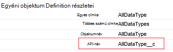
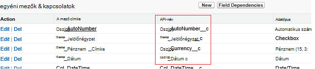

<properties
    pageTitle="Adatok áthelyezése a Salesforce Data Factory használatával |} Microsoft Azure"
    description="Tudnivalók az adatok áthelyezése a Salesforce Azure Data Factory használatával."
    services="data-factory"
    documentationCenter=""
    authors="linda33wj"
    manager="jhubbard"
    editor="monicar"/>

<tags
    ms.service="data-factory"
    ms.workload="data-services"
    ms.tgt_pltfrm="na"
    ms.devlang="na"
    ms.topic="article"
    ms.date="10/25/2016"
    ms.author="jingwang"/>

# Azure Data Factory használatával a Salesforce-adatok áthelyezése
Ez a cikk azt ismerteti, hogyan használhatja másolás tevékenység az Azure adatok gyári a Salesforce adatainak másolása bármely adattár, amely szerepel a [támogatott adatforrások és mosdók](data-factory-data-movement-activities.md#supported-data-stores) táblázatban gyűjtő oszlopban a. Ez a cikk az adatok mozgás egy általános áttekintése másolás állapotát tevékenysége és a támogatott adatokat tároló kombinációk eltéréseit [Mozgás a tevékenységekre vonatkozó adatok](data-factory-data-movement-activities.md) cikk épül.

Azure Data Factory jelenleg támogatott csak mozgó származó adatok Salesforce [támogatott gyűjtő adatok stores]((data-factory-data-movement-activities.md#supported-data-stores), de nem támogatja a adatok áthelyezése más adatokból tárolja a Salesforce hatással van.

## Előfeltételek
- Az alábbi kiadásai Salesforce egyikét kell használnia: Developer Edition, Professional változatának, Enterprise Edition vagy korlátlan Edition.
- API jogosultsági engedélyezve kell lennie. Lásd: [hogyan által engedélycsoportot API Salesforce hozzáférés engedélyezése?](https://www.data2crm.com/migration/faqs/enable-api-access-salesforce-permission-set/)
- Adatok másolása Salesforce a helyszíni adatok tárolja, meg kell legalább adatok adatkezelési átjáró 2.0-s verziója a helyszíni környezetben van telepítve.

## Salesforce kérelem korlátai
Salesforce teljes API-összehívások és a párhuzamos API kérések munkalapjai. A "API kérése korlátai" című a [Salesforce-Fejlesztőeszközök korlátozások](http://resources.docs.salesforce.com/200/20/en-us/sfdc/pdf/salesforce_app_limits_cheatsheet.pdf) a cikk további információt. Megjegyzés: Ha egyidejű kérelmek száma meghaladja a, szabályozásának akkor fordul elő, és látni fogja a véletlen hibák; Ha kérések száma meghaladja a, a Salesforce-fiókot, azzal blokkolhatja 24 órát; a "REQUEST_LIMIT_EXCEEDED" hiba mindkét esetben is kaphat.

## Az adatok varázsló másolása
A hozzon létre egy folyamat, amely valamelyik a támogatott gyűjtő adatokat tárolja, Salesforce adatait másolja legegyszerűbben az adatok másolása varázslóval. Lásd: [oktatóprogram: hozzon létre egy példány varázslóval folyamat](data-factory-copy-data-wizard-tutorial.md) rövid ismertetését megtalálja a folyamat létrehozásáról az adatok másolása varázslóval.

Az alábbi példában egy folyamat létrehozása az [Azure portál](data-factory-copy-activity-tutorial-using-azure-portal.md) [Visual Studio](data-factory-copy-activity-tutorial-using-visual-studio.md)és [Azure PowerShell](data-factory-copy-activity-tutorial-using-powershell.md)használatával használható minta JSON-definíciók biztosít. Adatok másolása Salesforce Azure Blob-tárolóhoz mutatnak. Adatok másolni lehet valamelyik, az mosdók megadott [Itt](data-factory-data-movement-activities.md#supported-data-stores) a Másolás tevékenység használata Azure Data Factory.   

## Minta: Adatok másolása Salesforce-Azure blob
Ez a példa adatokat másolja a Salesforce-Azure blob óránként. A JSON-tulajdonságok ezekben a példákban használt vannak szakaszokban ismertetett példák után. Adatok másolhatja közvetlenül az Azure Data Factory másolás tevékenység használatával az [elmozdulásnak a tevékenységekre vonatkozó adatok](data-factory-data-movement-activities.md#supported-data-stores) a cikkben szereplő mosdók látta el.

Az alábbiakban az adatok gyári eltéréseket, amely az alkalmazási példát végrehajtásához létrehozása kell. A listában az alábbi szakaszokban ezeket a lépéseket talál tájékoztatást.

- A csatolt szolgáltatás [Salesforce](#salesforce-linked-service-properties) -típus
- A következő típusú [AzureStorage](data-factory-azure-blob-connector.md#azure-storage-linked-service-properties) csatolt szolgáltatás
- A beviteli [adatkészlet](data-factory-create-datasets.md) [RelationalTable](#salesforce-dataset-properties) típusú
- Egy kimenet [adatkészlet](data-factory-create-datasets.md) [AzureBlob](data-factory-azure-blob-connector.md#azure-blob-dataset-type-properties) típusú
- A [folyamat](data-factory-create-pipelines.md) [RelationalSource](#relationalsource-type-properties) és [BlobSink](data-factory-azure-blob-connector.md#azure-blob-copy-activity-type-properties) használó másolása a tevékenységhez

**Csatolt Salesforce-szolgáltatás**

Ebben a példában a **Salesforce** csatolt szolgáltatást. Az a tulajdonságokat a csatolt szolgáltatás által támogatott [Salesforce csatolt szolgáltatás](#salesforce-linked-service-properties) szakaszban olvashat.  Lásd: a [biztonsági jogkivonat első](https://help.salesforce.com/apex/HTViewHelpDoc?id=user_security_token.htm) kapcsolatos tudnivalókat a biztonsági jogkivonat alaphelyzetbe állítása és beszerzése.

    {
        "name": "SalesforceLinkedService",
        "properties":
        {
            "type": "Salesforce",
            "typeProperties":
            {
                "username": "<user name>",
                "password": "<password>",
                "securityToken": "<security token>"
            }
        }
    }

**Azure csatolt tárhelyszolgáltatáshoz**

    {
      "name": "AzureStorageLinkedService",
      "properties": {
        "type": "AzureStorage",
        "typeProperties": {
          "connectionString": "DefaultEndpointsProtocol=https;AccountName=<accountname>;AccountKey=<accountkey>"
        }
      }
    }

**Salesforce beviteli adatkészlet**

    {
        "name": "SalesforceInput",
        "properties": {
            "linkedServiceName": "SalesforceLinkedService",
            "type": "RelationalTable",
            "typeProperties": {
                "tableName": "AllDataType__c"  
            },
            "availability": {
                "frequency": "Hour",
                "interval": 1
            },
            "external": true,
            "policy": {
                "externalData": {
                    "retryInterval": "00:01:00",
                    "retryTimeout": "00:10:00",
                    "maximumRetry": 3
                }
            }
        }
    }

Az adatok gyári szolgáltatás **Igaz** beállítás **külső** tájékoztatja, az adatkészlet adatok gyári mutató külső, és nem készül az adatok gyári tevékenységet.

> [AZURE.IMPORTANT] A "__c" rész API-név az egyéni objektumokat van szükség.

**Azure blob-kimeneti adatkészlet**

Adatok egy új blob íródott óránként (gyakoriság: óra, intervallum: 1).

    {
        "name": "AzureBlobOutput",
        "properties":
        {
            "type": "AzureBlob",
            "linkedServiceName": "AzureStorageLinkedService",
            "typeProperties":
            {
                "folderPath": "adfgetstarted/alltypes_c"
            },
            "availability":
            {
                "frequency": "Hour",
                "interval": 1
            }
        }
    }

**Másolás tevékenységeket használó folyamat**

A folyamat tartalmaz másolása tevékenységét, amely van konfigurálva, a fenti bemeneti és kimeneti adatkészleteket, és óránként van ütemezve. A során JSON definition az **adatforrás** típusa értéke **RelationalSource**, és a **gyűjtő** típusának beállítása **BlobSink**.

Lásd: [RelationalSource tulajdonságokat](#relationalsource-type-properties) a RelationalSource által támogatott tulajdonságok listáját.

    {  
        "name":"SamplePipeline",
        "properties":{  
            "start":"2016-06-01T18:00:00",
            "end":"2016-06-01T19:00:00",
            "description":"pipeline with copy activity",
            "activities":[  
            {
                "name": "SalesforceToAzureBlob",
                "description": "Copy from Salesforce to an Azure blob",
                "type": "Copy",
                "inputs": [
                {
                    "name": "SalesforceInput"
                }
                ],
                "outputs": [
                {
                    "name": "AzureBlobOutput"
                }
                ],
                "typeProperties": {
                    "source": {
                        "type": "RelationalSource",
                        "query": "SELECT Id, Col_AutoNumber__c, Col_Checkbox__c, Col_Currency__c, Col_Date__c, Col_DateTime__c, Col_Email__c, Col_Number__c, Col_Percent__c, Col_Phone__c, Col_Picklist__c, Col_Picklist_MultiSelect__c, Col_Text__c, Col_Text_Area__c, Col_Text_AreaLong__c, Col_Text_AreaRich__c, Col_URL__c, Col_Text_Encrypt__c, Col_Lookup__c FROM AllDataType__c"             
                    },
                    "sink": {
                        "type": "BlobSink"
                    }
                },
                "scheduler": {
                    "frequency": "Hour",
                    "interval": 1
                },
                "policy": {
                    "concurrency": 1,
                    "executionPriorityOrder": "OldestFirst",
                    "retry": 0,
                    "timeout": "01:00:00"
                }
            }
            ]
        }
    }

> [AZURE.IMPORTANT] A "__c" rész API-név az egyéni objektumokat van szükség.

## Csatolt Salesforce-szolgáltatás tulajdonságai

Az alábbi táblázat a JSON-elemek, a csatolt Salesforce-szolgáltatás jellemző ismertetését.

| A tulajdonság | Leírás | Szükséges |
| -------- | ----------- | -------- |
| típus | Meg kell a típusa tulajdonság: **Salesforce**. | igen |
| felhasználónév |Adja meg, hogy egy felhasználó nevét a felhasználói fiók. | igen |
| jelszó | Adja meg a felhasználói fiók jelszavát.  | igen |
| securityToken | Adja meg a biztonsági jogkivonat, a felhasználói fiók. Lásd: a [biztonsági jogkivonat első](https://help.salesforce.com/apex/HTViewHelpDoc?id=user_security_token.htm) kapcsolatos tudnivalókat a biztonsági jogkivonat alaphelyzetbe állítása és beszerzése. Az általános biztonsági tokenek kapcsolatos további tudnivalókért olvassa el a [Biztonság és az API](https://developer.salesforce.com/docs/atlas.en-us.api.meta/api/sforce_api_concepts_security.htm)című témakört.  | igen |

## Salesforce adatkészlet tulajdonságai

Szakaszok és adatkészleteket definiálása elérhető tulajdonságok teljes listáját a [létrehozása adatkészleteket](data-factory-create-datasets.md) témakört is. Szakaszok, például a struktúra, elérhetőségét és egy adathalmaz JSON házirend hasonlóak az összes adatkészlet (Azure SQL Azure blob, Azure tábla és stb.).

A **typeProperties** szakasz eltérő adatkészlet hibatípusonként és az adatok tárolása az adatok helyének adatait. A következő tulajdonságokat a typeProperties szakaszát egy adatkészlet **RelationalTable** típusú foglalja magában:

| A tulajdonság | Leírás | Szükséges |
| -------- | ----------- | -------- |
| Táblanév | A Salesforce tábla neve. | Nem (Ha nincs megadva a **lekérdezés** adott **RelationalSource** ) |

> [AZURE.IMPORTANT]  A "__c" rész API-név az egyéni objektumokat van szükség.

## RelationalSource tulajdonságai

Szakaszok és érhetők el a tevékenységek definiálásával tulajdonságokról teljes listáját a [folyamatok létrehozása](data-factory-create-pipelines.md) témakört is. Tulajdonságok például név, leírás, bemeneti és kimeneti táblákat, és különböző házirendek érhetők el a tevékenységek diagramtípusokat.

A Tulajdonságok typeProperties szakaszában a tevékenységet, rendelkezésre álló azonban, függenek minden tevékenység típusát. Másolás tevékenységhez azok eltérőek attól függően, hogy milyen típusú adatforrások és mosdók.

A Másolás tevékenységét Ha a forrás-típus **RelationalSource** (amely tartalmazza a Salesforce), a következő tulajdonságokat érhetők el typeProperties szakasz:

| A tulajdonság | Leírás | Megengedett érték | Szükséges |
| -------- | ----------- | -------------- | -------- |
| lekérdezés | Az egyéni lekérdezés használatával olvassa el az adatok. | A lekérdezés SQL-92 vagy [Salesforce objektum lekérdezési nyelv (SOQL)](https://developer.salesforce.com/docs/atlas.en-us.soql_sosl.meta/soql_sosl/sforce_api_calls_soql.htm) lekérdezést. Példa: `select * from MyTable__c`. | Szám (amennyiben a **táblanév** az **adathalmazban** nincs megadva) |

> [AZURE.IMPORTANT] A "__c" rész API-név az egyéni objektumokat van szükség.

## Tippek a lekérdezések használatához

### Hol használatával adatok visszakeresése dátumidő oszlop záradék
Ha meg az SOQL vagy SQL-lekérdezés DateTime formátumban különbség a figyelmet. Példa:

- **SOQL minta**: $$Text.Format ("azonosító jelölje ki, a nevet, a BillingCity a fiók hol LastModifiedDate > = {0:yyyy-MM-ddTHH:mm:ssZ} és LastModifiedDate < {1:yyyy-MM-ddTHH:mm:ssZ}", WindowStart, WindowEnd)
- **SQL minta**: $$Text.Format ("kijelölése * hol LastModifiedDate a fiók > = {{ts\'{0:yyyy-MM-dd óó}\'}} és LastModifiedDate < {{ts\'{1:yyyy-MM-dd óó}\'}}", WindowStart, WindowEnd) ".

### Adatok beolvasása a Salesforce-jelentések
Beolvasható adatok Salesforce-jelentések lekérdezés a megadásával `{call "<report name>"}`, például `"query": "{call \"TestReport\"}"`.

### Salesforce Lomtár mappából törölt rekordok visszanyerése
Megadhatja a finom Salesforce Lomtár mappából törölt rekordok lekérdezni **"IsDeleted = 1"** a lekérdezés. Ha például 

- A törölt rekordok lekérdezést, adja meg a "Válasszon *MyTable__c * *Hol IsDeleted = 1**"
- A lekérdezés összes a rekordokat, beleértve a meglévő és a törölt, adja meg a "Válasszon *MyTable__c * *Hol IsDeleted = 0 vagy IsDeleted = 1**"

[AZURE.INCLUDE [data-factory-structure-for-rectangualr-datasets](../../includes/data-factory-structure-for-rectangualr-datasets.md)]

### Salesforce-leképezésének
Salesforce-típus | . NETTÓ-alapú típusa
--------------- | ---------------
Automatikus szám | Karakterlánc
Jelölőnégyzet | Logikai érték
Pénznem | Dupla
Dátum | Dátum és idő
Dátum/idő | Dátum és idő
E-mailben | Karakterlánc
Azonosító | Karakterlánc
A keresés kapcsolat | Karakterlánc
Többszörös kijelölési lista | Karakterlánc
Szám | Dupla
Százalék | Dupla
Telefonszám | Karakterlánc
Választási | Karakterlánc
Szöveg | Karakterlánc
Szövegterület | Karakterlánc
Szövegterület (hosszú) | Karakterlánc
Szövegterület (Rich) | Karakterlánc
Szöveg (titkosított) | Karakterlánc
URL-CÍME | Karakterlánc

[AZURE.INCLUDE [data-factory-column-mapping](../../includes/data-factory-column-mapping.md)]
[AZURE.INCLUDE [data-factory-structure-for-rectangualr-datasets](../../includes/data-factory-structure-for-rectangualr-datasets.md)]

## A teljesítmény és a finombeállítása  
Olvassa el a [Másolás tevékenységet a teljesítmény és a beállítási útmutatója](data-factory-copy-activity-performance.md) Ha többet szeretne tudni a főbb tényezők hatása teljesítmény mozgásának adatok (másolása a tevékenység) az Azure Data Factory és a különféle módokon optimalizálása azt.
