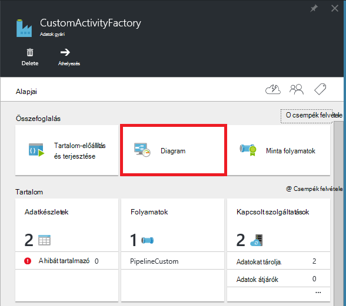

<properties
    pageTitle="Egyéni tevékenységeknek az Azure Data Factory során"
    description="Megtudhatja, hogyan hozhat létre egyéni tevékenységeket, és használhatja őket az Azure Data Factory folyamat."
    services="data-factory"
    documentationCenter=""
    authors="spelluru"
    manager="jhubbard"
    editor="monicar"/>

<tags
    ms.service="data-factory"
    ms.workload="data-services"
    ms.tgt_pltfrm="na"
    ms.devlang="na"
    ms.topic="article"
    ms.date="10/17/2016"
    ms.author="spelluru"/>

# Egyéni tevékenységeknek az Azure Data Factory során
> [AZURE.SELECTOR]
[A struktúra](data-factory-hive-activity.md)  
[Malac](data-factory-pig-activity.md)  
[MapReduce](data-factory-map-reduce.md)  
[A folyamatos átvitelű Hadoop](data-factory-hadoop-streaming-activity.md)
[Gépi tanulási](data-factory-azure-ml-batch-execution-activity.md) 
[Tárolt eljárás](data-factory-stored-proc-activity.md)
[U-SQL nyelvben adatok tó Analytics](data-factory-usql-activity.md)
[.NET, egyéni](data-factory-use-custom-activities.md)

Tevékenységek, amelyek segítségével használhatja az Azure Data Factory során két típusa van.
 
- [Mozgás a tevékenységekre vonatkozó adatok](data-factory-data-movement-activities.md) adatok áthelyezése fiókok között [támogatott adatokat tárolja](data-factory-data-movement-activities.md#supported-data-stores).
- [A tevékenységekre vonatkozó adatok átalakítása](data-factory-data-transformation-activities.md) átalakítás/folyamat adatok használt képlet ki például Azure hdinsight szolgáltatáshoz, Azure köteg és Azure gépi tanulási. Példa: HDInsight-struktúra és gépi tanulási köteg végrehajtása.  

Kell az adatokat áthelyezheti egy adattár Azure Data Factory által nem támogatott/az, ha egy egyéni .NET tevékenység létrehozása a saját adatok mozgását logika, és a tevékenység használata a során. 

Hasonlóképpen átalakítás/folyamat oly módon, hogy nem támogatott a Data Factory adatokat kell, ha, létrehozhat egyéni tevékenység saját adatfeldolgozás logika a, és a tevékenység használata a során.

> [AZURE.NOTE] Az adatkezelési átjáró jelenleg csak a tevékenység másolás és a tárolt eljárás tevékenység az adatok gyári. Még nem lehetséges az egyéni tevékenység az átjáró a helyszíni adatforrás eléréséhez használni.
 
Úgy is beállíthatja az egyéni .NET tevékenység egy **Köteg Azure** szolgáltatás vagy a egy **Azure hdinsight szolgáltatáshoz** fürthöz futtatásához.   

A következő forgatókönyv egyéni .NET tevékenység létrehozásához, és az egyéni tevékenységeket használata a folyamat részletes útmutatás. Az útmutató a csatolt **Azure köteg** szolgáltatást használja. Használja az Azure hdinsight szolgáltatáshoz kapcsolódó szolgáltatás helyette, **HDInsight** (Ha a saját HDInsight fürt esetén) vagy **HDInsightOnDemand** típusú csatolt szolgáltatás hozzon létre (Ha azt szeretné, hogy a Data Factory-HDInsight fürt igény szerinti létrehozásához), és a folyamat JSON (**linkedServiceName**) tevékenység részében használható. Lásd: Azure hdinsight szolgáltatáshoz használatáról az egyéni tevékenységeket futtatásához [használata Azure hdinsight szolgáltatáshoz kapcsolódó szolgáltatások](#use-azure-hdinsight-linked-services) szakaszát.

> [AZURE.IMPORTANT] .NET-keretrendszer, mint a Visual Studio .NET egyéni tevékenység projekthez cél keretét beállítása 4.5.2 verziója. Adatok gyári nem támogatja a .NET-keretrendszer verziók ellen lefordított legkésőbb 4.5.2 az egyéni tevékenységek.   

## Útmutató 

### Előfeltételek

- Visual Studio 2012 és 2013-ban és a Skype 2015
- Töltse le és telepítse az [Azure.NET SDK][azure-developer-center]

### Azure köteg vonatkozó követelmények
Az útmutató futtassa az egyéni .NET tevékenységek Azure köteg használata a számítási erőforrásként. [Azure köteg alapjai] című[ batch-technical-overview] az Azure köteg áttekintése szolgáltatás, és olvassa el az [Ismerkedés az Azure köteg tárral a .NET rendszerhez] [ batch-get-started] gyorsan Ismerkedés az Azure köteg szolgáltatással.

Az oktatóprogram meg kell Azure köteg fiók létrehozását VMs erőforráskészlethez tartozik. A lépések a következők:

1. Az [Azure portál](http://manage.windowsazure.com) **Azure köteg fiók** létrehozása. Lásd: [létrehozása és kezelése az Azure köteg fiók] [ batch-create-account] miként. Megjegyzés: az Azure köteg nevét és a fiók fiókkulcs lefelé.

    [Új-AzureBatchAccount] is használhatja[ new-azure-batch-account] parancsmag egy köteg Azure-fiók létrehozása. Lásd: [Microsoft Azure köteg fiók kezelése Azure PowerShell használatá] [ azure-batch-blog] Ezen parancsmag használatával kapcsolatos részletes útmutatásért.
2. Hozzon létre egy **Köteg Azure készlet**.
    1. Az [Azure portált](https://portal.azure.com)a bal oldali menüben kattintson a **Tallózás gombra** , és kattintson a **Köteg fiókok**elemre. 
    2. Jelölje ki a köteget Azure-fiókját, a **Köteg fiók** lap megnyitásához. 
    3. Kattintson a **készletek** csempére.
    4. Kattintson a **készletek** lap hozzáadása gombra az eszköztáron a készletbe felvenni.
        1. Adja meg a készlet (**Alkalmazáskészlet-azonosító**) Azonosítóját. Figyelje meg a **készlet azonosító**; szüksége az adatok gyári megoldás létrehozásakor. 
        2. Adja meg a **Windows Server 2012 R2** az operációs rendszer család beállítást.
        3. Jelölje ki a **csomópont árak réteg**. 
        3. Írja be a **Cél dedikált** beállítás értékként **2** .
        4. Adja meg a **2** érték a **Max feladatok egyes csomópontok** beállítását.
    5. Kattintson az **OK gombra** a készlet létrehozása. 
 
    [Új-AzureBatchPool](https://msdn.microsoft.com/library/mt628690.aspx) parancsmag egy köteg Azure-készlet létrehozása is használhatja.    

### Magas szintű lépések 
1.  **Hozzon létre egy egyéni tevékenységet** a Data Factory folyamat használni. Az egyéni tevékenységeket az alábbi példa az adatok átalakítása/feldolgozás logika tartalmazza. 
    1.  A Visual Studióban .NET osztálytár projekt létrehozása, a bemeneti adatok feldolgozása kód hozzáadása és a projekt összeállítása. 
    2.  Zip-a bináris fájlokat és a PDB (nem kötelező) fájlt a kimeneti mappában.  
    3.  Töltse fel a zip-fájl Azure blob-tárolóhoz. A létrehozás az egyéni tevékenységeket szakasz szerepelnek a lépések részletes leírását. 
2. **Az Azure adatok gyári az egyéni tevékenységeket használó létrehozása**:
    1. Hozzon létre egy Azure adatok gyári.
    2. Hozzon létre csatolt szolgáltatást.
        1. AzureStorageLinkedService: Éppen a Kellékek tároló hitelesítő adatok BLOB eléréséhez.
        2. AzureBatchLinkedService: Itt adhatja meg az Azure köteg szerint számítja ki.
    3. Hozzon létre adatkészleteket.
        1. InputDataset: Itt adhatja meg a tárhely tároló és egy mappát a bemeneti BLOB.
        1. OuputDataset: Itt adhatja meg a tárhely tároló és a kimeneti BLOB mappáját.
    2. Hozzon létre egy folyamat az egyéni tevékenységeket használó.
    3. Futtatni, és tesztelje a folyamat.
    4. A folyamat hibakeresési.

## Az egyéni tevékenység létrehozása
.NET egyéni próbál létrehozni, hogy az adott **IDotNetActivity** felületet osztály **.NET osztálytár** projektet létrehozni. Ez a kapcsolatnak csak egy metódus: [végrehajtás](https://msdn.microsoft.com/library/azure/mt603945.aspx) és az aláírás:

    public IDictionary<string, string> Execute(
            IEnumerable<LinkedService> linkedServices, 
            IEnumerable<Dataset> datasets, 
            Activity activity, 
            IActivityLogger logger)
        

A módszer veszi négy paraméterei:

- **linkedServices**. Ez a tulajdonság egy megszámlálható listája, amely a bemeneti és kimeneti adatforrás csatolása csatolt szolgáltatások (például: Azure Blob-tárolóhoz) az adatok gyári. Ebben a példában az azt jelenti, csak egy csatolt szolgáltatás típusú bemeneti és kimeneti Azure-tárhelyet. 
- **adatkészleteket**. Ez a tulajdonság egy adatkészleteket megszámlálható listáját. A helyek és a sémák bemeneti és kimeneti adatkészleteket által meghatározott paraméter is használhatja.
- **tevékenység**. Ez a tulajdonság jelöli az aktuális számítási személyhez – ebben az esetben az Azure köteget.
- **naplózó**. Az objektum teszi lehetővé, hogy a felület hibakeresési megjegyzéseket írni az folyamat "Felhasználó" bejelentkezési. 

A módszer egy szótár használt lánc egyéni tevékenységek együtt a jövőben adja eredményül. Ez a funkció nem érhető el, így a módszerrel eredményül egy üres szótár.  

### Az eljárás 
1.  **.NET osztálytár** projektet létrehozni.
    <ol type="a">
        <li>Indítsa el a <b>Visual Studio 2015</b> vagy <b>Visual Studio 2013</b> vagy <b>Visual Studio 2012</b>.</li>
        <li>Kattintson a <b>fájl</b>fülre, mutasson az <b>Új</b>, és kattintson a <b>Projekt</b>.</li>
        <li>Bontsa ki a <b>sablonok</b>, és válassza <b>a Visual C#</b>. Az útmutató használja a C#, de az egyéni tevékenységeket kidolgozása bármely .NET nyelven is használhatja.</li>
        <li><b>Osztálytár</b> választhat a jobb oldalon a projekttípusok listáját.</li>
        <li>Írja be a <b>név</b> <b>MyDotNetActivity</b> .</li>
        <li>Jelölje be a <b>hely</b> <b>C:\ADFGetStarted</b> .</li>
        <li>Kattintson az <b>OK gombra</b> a projekt létrehozása.</li>
    </ol>
2.  Kattintson az **eszközök**, mutasson a **NuGet csomag kezelő**és **Csomag Manager konzolban**kattintson.
3.  A csomag Manager konzolon **Microsoft.Azure.Management.DataFactories**importálhatja a következő parancs végrehajtása.

        Install-Package Microsoft.Azure.Management.DataFactories

4. A projekt importálása az **Azure tároló** NuGet csomagot.

        Install-Package Azure.Storage

5. A projektben a forrásfájl adja hozzá a következő **használata** kimutatásokban.

        using System.IO;
        using System.Globalization;
        using System.Diagnostics;
        using System.Linq;

        using Microsoft.Azure.Management.DataFactories.Models;
        using Microsoft.Azure.Management.DataFactories.Runtime;

        using Microsoft.WindowsAzure.Storage;
        using Microsoft.WindowsAzure.Storage.Blob;

6. Módosítsa a **névtér** nevét **MyDotNetActivityNS**.

        namespace MyDotNetActivityNS

7. **MyDotNetActivity** az osztály neveként és származtatása azt a **IDotNetActivity** felületén a következő kódrészletet látható módon:

        public class MyDotNetActivity : IDotNetActivity

8. A **IDotNetActivity** felületet **MyDotNetActivity** osztály (Hozzáadás) a **végrehajtás** módja végrehajtása, és másolja a vágólapra az alábbi példa kódot a módszerrel.

    Az alábbi példa megszámolja a a keresett kifejezést (a "Microsoft") előfordulásainak száma az egyes tartozó adatok körcikkel blob. 

        /// 

        /// Execute method is the only method of IDotNetActivity interface you must implement. 
        /// In this sample, the method invokes the Calculate method to perform the core logic.  
        /// 

        public IDictionary<string, string> Execute(
            IEnumerable<LinkedService> linkedServices,
            IEnumerable<Dataset> datasets,
            Activity activity,
            IActivityLogger logger)
        {
            // to get extended properties (for example: SliceStart)
            DotNetActivity dotNetActivity = (DotNetActivity)activity.TypeProperties;
            string sliceStartString = dotNetActivity.ExtendedProperties["SliceStart"];

            // to log all extended properties           
            IDictionary<string, string> extendedProperties = dotNetActivity.ExtendedProperties;
            logger.Write("Logging extended properties if any...");
            foreach (KeyValuePair<string, string> entry in extendedProperties)
            {
                logger.Write("<key:{0}> <value:{1}>", entry.Key, entry.Value);
            }
        
            // declare types for input and output data stores
            AzureStorageLinkedService inputLinkedService;

            // declare dataset types
            CustomDataset inputLocation;
            AzureBlobDataset outputLocation;

            Dataset inputDataset = datasets.Single(dataset => dataset.Name == activity.Inputs.Single().Name);
            inputLocation = inputDataset.Properties.TypeProperties as CustomDataset;

            foreach (LinkedService ls in linkedServices)
                logger.Write("linkedService.Name {0}", ls.Name);

            // using First method instead of Single since we are using the same 
            // Azure Storage linked service for input and output. 
            inputLinkedService = linkedServices.First(
                linkedService =>
                linkedService.Name ==
                inputDataset.Properties.LinkedServiceName).Properties.TypeProperties
                as AzureStorageLinkedService;

            string connectionString = inputLinkedService.ConnectionString; 

            // To create an input storage client.
            string folderPath = GetFolderPath(inputDataset);
            string output = string.Empty; // for use later.

            // create storage client for input. Pass the connection string.
            CloudStorageAccount inputStorageAccount = CloudStorageAccount.Parse(connectionString);
            CloudBlobClient inputClient = inputStorageAccount.CreateCloudBlobClient();

            // initialize the continuation token before using it in the do-while loop.
            BlobContinuationToken continuationToken = null;
            do
            {   // get the list of input blobs from the input storage client object.
                BlobResultSegment blobList = inputClient.ListBlobsSegmented(folderPath,
                                         true,
                                         BlobListingDetails.Metadata,
                                         null,
                                         continuationToken,
                                         null,
                                         null);
                
                // Calculate method returns the number of occurrences of 
                // the search term (“Microsoft”) in each blob associated
                // with the data slice. definition of the method is shown in the next step.
 
                output = Calculate(blobList, logger, folderPath, ref continuationToken, "Microsoft");

            } while (continuationToken != null);

            // get the output dataset using the name of the dataset matched to a name in the Activity output collection.
            Dataset outputDataset = datasets.Single(dataset => dataset.Name == activity.Outputs.Single().Name);
            // convert to blob location object.
            outputLocation = outputDataset.Properties.TypeProperties as AzureBlobDataset;

            folderPath = GetFolderPath(outputDataset);

            logger.Write("Writing blob to the folder: {0}", folderPath);

            // create a storage object for the output blob.
            CloudStorageAccount outputStorageAccount = CloudStorageAccount.Parse(connectionString);
            // write the name of the file. 
            Uri outputBlobUri = new Uri(outputStorageAccount.BlobEndpoint, folderPath + "/" + GetFileName(outputDataset));

            logger.Write("output blob URI: {0}", outputBlobUri.ToString());
            // create a blob and upload the output text.
            CloudBlockBlob outputBlob = new CloudBlockBlob(outputBlobUri, outputStorageAccount.Credentials);
            logger.Write("Writing {0} to the output blob", output);
            outputBlob.UploadText(output);

            // The dictionary can be used to chain custom activities together in the future.
            // This feature is not implemented yet, so just return an empty dictionary.  

            return new Dictionary<string, string>();
        }

9. Adja hozzá a következő segítő módszereket. A **végrehajtás** módszer segítő módszerekben elindítja. A **GetConnectionString** módszer az Azure tároló kapcsolati karakterláncot, és az **GetFolderPath** módszer beolvassa a blob-helyet. Legfontosabb a **Calculate** módszer elkülöníti a keresztül az egyes blob iteráló kódot.

        /// 

        /// Gets the folderPath value from the input/output dataset.
        /// 

        private static string GetFolderPath(Dataset dataArtifact)
        {
            if (dataArtifact == null || dataArtifact.Properties == null)
            {
                return null;
            }

            AzureBlobDataset blobDataset = dataArtifact.Properties.TypeProperties as AzureBlobDataset;
            if (blobDataset == null)
            {
                return null;
            }

            return blobDataset.FolderPath;
        }

        /// 

        /// Gets the fileName value from the input/output dataset.   
        /// 

        private static string GetFileName(Dataset dataArtifact)
        {
            if (dataArtifact == null || dataArtifact.Properties == null)
            {
                return null;
            }

            AzureBlobDataset blobDataset = dataArtifact.Properties.TypeProperties as AzureBlobDataset;
            if (blobDataset == null)
            {
                return null;
            }

            return blobDataset.FileName;
        }

        /// 

        /// Iterates through each blob (file) in the folder, counts the number of instances of search term in the file, 
        /// and prepares the output text that is written to the output blob. 
        /// 

        public static string Calculate(BlobResultSegment Bresult, IActivityLogger logger, string folderPath, ref BlobContinuationToken token, string searchTerm)
        {
            string output = string.Empty;
            logger.Write("number of blobs found: {0}", Bresult.Results.Count<IListBlobItem>());
            foreach (IListBlobItem listBlobItem in Bresult.Results)
            {
                CloudBlockBlob inputBlob = listBlobItem as CloudBlockBlob;
                if ((inputBlob != null) && (inputBlob.Name.IndexOf("$$$.$$$") == -1))
                {
                    string blobText = inputBlob.DownloadText(Encoding.ASCII, null, null, null);
                    logger.Write("input blob text: {0}", blobText);
                    string[] source = blobText.Split(new char[] { '.', '?', '!', ' ', ';', ':', ',' }, StringSplitOptions.RemoveEmptyEntries);
                    var matchQuery = from word in source
                                     where word.ToLowerInvariant() == searchTerm.ToLowerInvariant()
                                     select word;
                    int wordCount = matchQuery.Count();
                    output += string.Format("{0} occurrences(s) of the search term \"{1}\" were found in the file {2}.\r\n", wordCount, searchTerm, inputBlob.Name);
                }
            }
            return output;
        }

    A GetFolderPath metódus ad vissza az elérési utat azt a mappát, amely az adatkészlet mutat, és a GetFileName metódus ad vissza, amely az adatkészlet mutat blob/fájl nevét. Ha Ön havefolderPath határozza meg, {év}, például változók használata {hónap}, {nap} stb módszer adja eredményül az ahogy karakterlánca futtatókörnyezet értékek lecserélése nélkül. Lásd: [az Access kiterjesztett tulajdonságokat](#access-extended-properties) szakasz részletesen elérése SliceStart, SliceEnd stb.    
    
            "name": "InputDataset",
            "properties": {
                "type": "AzureBlob",
                "linkedServiceName": "AzureStorageLinkedService",
                "typeProperties": {
                    "fileName": "file.txt",
                    "folderPath": "adftutorial/inputfolder/",
    
    A Calculate módszer kulcsszó Microsoft a beviteli fájlok (BLOB-mappában) példányainak számát számítja ki. A keresett kifejezést (a "Microsoft"), csomagolásukkor be a kódot.

10. A projekt össze. A menüben kattintson a **Szerkesztés** , és kattintson a **Szerkesztés megoldás**.

    > [AZURE.IMPORTANT] .NET-keretrendszer, mint a projekt cél keretét beállítása 4.5.2 verziója: kattintson a jobb gombbal a projektet, majd kattintson a **Tulajdonságok** beállítása a cél keretrendszer. Adatok gyári nem támogatja a .NET-keretrendszer verziók ellen lefordított később 4.5.2 az egyéni tevékenységek. 
11. Indítsa el a **Windows Intézőt**, és kattintson az összeállítás típusától függően **bin\debug** vagy **bin\release** mappában.
12. **MyDotNetActivity.zip** összes bináris tartalmazó zip-fájl létrehozása a <project folder>\bin\Debug mappába. Érdemes lehet a **MyDotNetActivity.pdb** fájl, így például sorszámát további részleteket a forráskód, ha egy sikertelen volt a problémát okozó. Az egyéni tevékenység zip-fájl az összes fájlt nem sub mappákkal **legfelső szintű** kell lennie.

    
13. Töltse fel a **MyDotNetActivity.zip** a blob-tárolóhoz blob-ként: **customactivitycontainer** az, hogy a **AzureStorageLinkedService** csatolva a **ADFTutorialDataFactory** szolgáltatás Azure blob-tárolóhoz használja.  Ha még nem létezik a blob-tárolóhoz **customactivitycontainer** létrehozása

> [AZURE.NOTE] Ha hozzáadja a .NET tevékenység projektet Data Factory projektet tartalmaz Visual Studio megoldást, és a Data Factory-alkalmazás projektből .NET tevékenységet a project mutató hivatkozás hozzáadása, nem kell manuálisan a zip-fájl létrehozása és feltöltése a az Azure blob-tárolóhoz az utolsó két lépést végre. Adatok gyári szervezetek Visual Studio segítségével teszi közzé, ha ezeket a lépéseket a közzétételi folyamat automatikusan történik. Cikkek [a Visual Studio segítségével első folyamat összeállítása](data-factory-build-your-first-pipeline-using-vs.md) és [Azure SQL Azure Blob adatainak másolása](data-factory-copy-activity-tutorial-using-visual-studio.md) Ha többet szeretne tudni létrehozásáról és közzétételéről Data Factory szervezetek Visual Studio segítségével.  

### Végrehajtási mód

Ez a témakör további részletek és a megjegyzéseket fűzhet a **végrehajtás** módszer a kódot.
 
1. A tagok a bemeneti gyűjtemény keresztül léptetés [Microsoft.WindowsAzure.Storage.Blob](https://msdn.microsoft.com/library/azure/microsoft.windowsazure.storage.blob.aspx) névtér találhatók. A blob-gyűjtemény keresztül léptetés szükséges a **BlobContinuationToken** osztály használatával. Lényegében egy do kell használnia – a token a Kilépés a leállításig mechanizmusként a leállításig közben. További tudnivalókért lásd: [használatáról a .NET Blob-tárolóhoz](../storage/storage-dotnet-how-to-use-blobs.md). Egy egyszerű ciklus Itt jelennek meg:

        // Initialize the continuation token.
        BlobContinuationToken continuationToken = null;
        do
        {   
            // Get the list of input blobs from the input storage client object.
            BlobResultSegment blobList = inputClient.ListBlobsSegmented(folderPath,
                                      true,
                                      BlobListingDetails.Metadata,
                                      null,
                                      continuationToken,
                                      null,
                                      null);
            // Return a string derived from parsing each blob.
            output = Calculate(blobList, logger, folderPath, ref continuationToken, "Microsoft");
        } while (continuationToken != null);

    További információ a [ListBlobsSegmented](https://msdn.microsoft.com/library/jj717596.aspx) metódus dokumentációjában.

2.  A kód BLOB készletével logikailag munkához Ugrás belül a ne-hurok közben. A **végrehajtás** módszer, ne-közben hurok BLOB listája átadja nevű **Calculate**függvény. A módszer a karakterlánc típusú változóban eredménye, hogy többször is keresztül szakaszában valamennyi BLOB **kimeneti** nevű adja eredményül. 

    A keresett kifejezést (**Microsoft**) előfordulásainak száma a az átkerül a **Calculate** módszer blob adja eredményül. 

            output += string.Format("{0} occurrences of the search term \"{1}\" were found in the file {2}.\r\n", wordCount, searchTerm, inputBlob.Name);

3.  Miután a **Calculate** módszer által elvégzett munka, az új blob kell írni. Minden feldolgozott BLOB csoportját, így egy új blob a eredményekkel írhatók. Írni egy új blob, először nyissa meg a kimeneti adatkészlet. 

            // Get the output dataset using the name of the dataset matched to a name in the Activity output collection.
            Dataset outputDataset = datasets.Single(dataset => dataset.Name == activity.Outputs.Single().Name);

            // Convert to blob location object.
            outputLocation = outputDataset.Properties.TypeProperties as AzureBlobDataset;

4.  A kódot is felhívja segítő metódus: **GetFolderPath** beolvasásához a mappa elérési útját (a tárhely tároló neve).
 
            folderPath = GetFolderPath(outputDataset);

    A **GetFolderPath** árnyékot az adatkészlet objektumot egy AzureBlobDataSet, amelynek Mappa_útvonala nevű tulajdonság.
            
            AzureBlobDataset blobDataset = dataArtifact.Properties.TypeProperties as AzureBlobDataset;
            
            return blobDataset.FolderPath;

5.  A kód felhívja a **GetFileName** módszer beolvasni a fájl nevét (blob neve).  

            AzureBlobDataset blobDataset = dataArtifact.Properties.TypeProperties as AzureBlobDataset;

            return blobDataset.FileName;

6.  A fájl nevét: hozzon létre egy URI-objektum íródott. A URI konstruktor a **BlobEndpoint** tulajdonság a tároló nevét használja. A mappa elérési útját és nevét a kimeneti blob URI Egyenletszerkesztővel kerülnek.  

            // Write the name of the file. 
            Uri outputBlobUri = new Uri(outputStorageAccount.BlobEndpoint, folderPath + "/" + GetFileName(outputDataset));

7.  A fájl nevét úgy írtak, és most írhat a kimeneti karakterlánc a Calculate mód az új blob:

            // Create a blob and upload the output text.
            CloudBlockBlob outputBlob = new CloudBlockBlob(outputBlobUri, outputStorageAccount.Credentials);
            logger.Write("Writing {0} to the output blob", output);
            outputBlob.UploadText(output);

## A data factory Azure portálon létrehozása

**Az egyéni tevékenységeket létrehozása** szakaszban létrehozott egy egyéni tevékenységeket és bináris tartalmazó zip-fájl, és a PDB fájl feltöltése egy Azure blob-tárolóhoz. Ebben a részben hoz létre egy Azure **adatok gyári** az **egyéni tevékenységeket**használó **folyamat** .
 
A beviteli adatkészlet számára az egyéni tevékenységeket a BLOB (fájl) jelöl, blob-tárolóban lévő a bemeneti mappában (adftutorial\inputfolder). A kimenet adatkészlet a tevékenységhez a kimeneti BLOB blob-tárolóhoz a kimeneti mappában (adftutorial\outputfolder) jelöli. 

Hozzon létre egy **file.txt** a következő tartalommal nevű fájlt, és töltse fel **adftutorial\inputfolder** (adftutorial az Azure blob-tárolóhoz neve pedig inputfolder a tároló mappa nevét.)

    test custom activity Microsoft test custom activity Microsoft

A beviteli mappában a szeletre Azure Data Factory felel meg, akkor is, ha a mappa két vagy több fájlt. Minden egyes szeletet dolgozza fel a folyamat, amikor az egyéni tevékenységeket függvény, a bemeneti mappa az adott szeletet valamennyi BLOB keresztül. 

Egy a fájlt a adftutorial\output mappában (ugyanaz, mint a bemeneti mappában BLOB száma) egy vagy több vonalat tartalmazó kimeneti jelenik meg:
 
    2 occurrences(s) of the search term "Microsoft" were found in the file inputfolder/2015-11-16-00/file.txt.

A lépések, végezze el a következők:

1. Hozzon létre egy **adatok gyári**.
2. Az Azure köteg készlete VMs a **csatolt szolgáltatások** , amelyek az egyéni tevékenységeket fut, és a bemeneti és kimeneti BLOB betöltő Azure tárolására. 
2. Bemeneti és kimeneti **adatkészleteket** bemeneti és kimeneti az egyéni tevékenység jelképező. 
3. **Folyamat** az egyéni tevékenységeket használó.
4. **Adatok gyári**. Létrehozhat egy ezeket a szervezetek Azure közzétételekor. 

> [AZURE.NOTE] A **file.txt** létrehozása és feltöltése blob-tárolóhoz, ha még nem tette. A fenti útmutatást találhat.  

### Lépés: 1: Az adatok gyári létrehozása

1.  Az Azure-portálra bejelentkezés után végezze el az alábbi lépéseket:
    1.  A bal oldali menüben kattintson az **Új** gombra.
    2.  Kattintson az **Új** lap **adatok + Analytics** .
    3.  **Adatok gyári** kattintson az **adatok analytics** lap.
2.  Írja be az **új adatok gyári** lap **CustomActivityFactory** nevét. Az Azure adatok gyári neve globálisan egyedinek kell lennie. Ha a hibakód: **nem érhető el adatok gyári neve "CustomActivityFactory"**, módosíthatja az adatok gyári (például a **yournameCustomActivityFactory**) nevét, és próbáljon meg ismét létrehozni.
3.  Kattintson **Az erőforrás-csoport NEVÉRE**, és válassza a meglévő erőforráscsoport vagy erőforráscsoport létrehozása. 
4.  Győződjön meg arról, hogy a helyes **előfizetés** és esetén **régió** , amelyre a data factory létrehozni. 
5.  Kattintson a **Létrehozás** gombra az **új adatok gyári** lap.
6.  Az **Irányítópult** : az Azure portál eredményezne adatok gyári látni.
7.  Az adatok gyári létrehozása sikeresen befejeződött, miután a Data Factory lap, amely jelzi, hogy az adatok gyári tartalmának látni.

### Lépés: 2: Hozzon létre csatolt szolgáltatások

Csatolt szolgáltatások hivatkozás adatokat tárolja, vagy az Azure adatok gyári szolgáltatások számítja ki. Ebben a lépésben összekapcsol az Azure tárterület-fiók és az Azure köteg fiók az adatok gyári.

#### Azure csatolt tárhelyszolgáltatáshoz létrehozása

1.  Kattintson a **Szerző és üzembe** **CustomActivityFactory**a csempe az **Adatok gyári** lap. Az adatok gyári szerkesztő látni.
2.  Kattintson az **új adatokat tárolja** a parancssávon, és válassza az **Azure tároló**. Meg kell jelennie a JSON parancsfájl létrehozása az Azure csatolt tárhelyszolgáltatáshoz szerkesztőben.
3.  **Fióknév** cserélje le az access használatával az Azure tárterület-fiók a **fiókkulcs** és Azure tároló fiók nevére. Megtudhatja, hogyan hozhatja ki a tárhely hívóbetű, lásd: a [nézet, a másolás és a hívóbetűk újragenerálása tároló](../storage/storage-create-storage-account.md#view-copy-and-regenerate-storage-access-keys).
4.  Kattintson a **központi telepítés** a csatolt szolgáltatás üzembe a parancssávon.

#### Csatolt Azure köteg szolgáltatás hozzon létre

2. Az adatok gyári Editor válassza az **Új számítja ki** a parancssáv, és a menüből válassza az **Azure köteget** .
3. A JSON parancsfájl végezze el az alábbi módosításokat:
    1. Adja meg a **fióknév** tulajdonság Azure köteg fiókja nevét. Az **URL-CÍMÉT** az **Azure köteg fiók lap** van, a következő formátumban: http://**fióknév**. region.batch.azure.com. A JSON **batchUri** tulajdonsághoz el kell **távolítania a "fióknév."** az URL-CÍMÉT, és a **fióknév** a **fióknév** JSON tulajdonság a.
    2. Adja meg az Azure köteg fiókkulcs **accessKey** tulajdonság. 
    3. Adja meg a készlet alkalmazáshoz létrehozott korábbi neve **Készlet_neve** tulajdonság előfeltételekről részeként. Adja meg a készlet neve helyett a készlet azonosítója is.
    4. Adja meg az Azure köteg URI **batchUri** tulajdonság. Lásd: a **fióknév** tulajdonság fölé jegyzeteket. Példa: https://westus.batch.azure.com.  
    5. Adja meg a **AzureStorageLinkedService** **linkedServiceName** tulajdonság.
        
            {
              "name": "AzureBatchLinkedService",
              "properties": {
                "type": "AzureBatch",
                "typeProperties": {
                  "accountName": "myazurebatchaccount",
                  "batchUri": "https://westus.batch.azure.com",
                  "accessKey": "<yourbatchaccountkey>",
                  "poolName": "myazurebatchpool",
                  "linkedServiceName": "AzureStorageLinkedService"
                }
              }
            }

        A **Készlet_neve** tulajdonság is megadhatja a készlet neve helyett a készlet azonosítója.

    > [AZURE.NOTE] Az adatok gyári szolgáltatás nem támogatja igény szerinti beállítást Azure köteghez, ahogyan ezt a hdinsight szolgáltatásból lehetőségre. Csak a saját Azure köteg készlet használhatja az Azure adatok gyári.
    
### Lépés 3: Hozzon létre adatkészleteket
Ebben a lépésben létrehoz adatkészleteket bemeneti és kimeneti adatok ábrázolásához.

#### Beviteli adatkészlet létrehozása
1.  A **szerkesztő** az adatok gyári **Új adatkészlet** gombra az eszköztáron, és **Azure Blob-tárolóhoz** kattintson a legördülő menüből.
2.  A jobb oldali ablaktáblában a JSON cserélje ki az alábbi JSON kódtöredékének:

            {
                "name": "InputDataset",
                "properties": {
                    "type": "AzureBlob",
                    "linkedServiceName": "AzureStorageLinkedService",
                    "typeProperties": {
                        "folderPath": "adftutorial/customactivityinput/",
                        "format": {
                            "type": "TextFormat"
                        }
                    },
                    "availability": {
                        "frequency": "Hour",
                        "interval": 1
                    },
                    "external": true,
                    "policy": {}
                }
            }

    Hoz létre egy folyamat később a kezdési időpontot az útmutató: a Skype 2015-11-16T00:00:00Z és a befejezési időpontot: a Skype 2015-11-16T05:00:00Z. Van ütemezve kapcsol adatok óránként, így 5 bemeneti és kimeneti szeletek ( **00**: 00:00- **05**>: 00:00). 

    A **gyakoriság** és a bemeneti adatkészlet **intervallum** **órát** és **1**, ami azt jelenti, hogy a bemeneti szeletet elérhető óránként van beállítva. Ez a példa ugyanannak a fájlnak (file.txt) a intputfolder a. 

    Az alábbiakban az indítási beállítások az egyes a szeletek és a fenti JSON kódtöredékének SliceStart rendszer változó képviseli. 

    
3.  Kattintson a **központi telepítés** készíthetnek és helyezhetnek üzembe a **InputDataset**az eszköztáron. Győződjön meg arról, hogy üzenet jelenik meg a **Táblázat sikeresen létre** a címsoron a szerkesztő.

#### Egy kimenet adatkészlet létrehozása

1. **Adatok gyári szerkesztő** **Új adatkészlet**gombra, és kattintson az **Azure Blob-tárolóhoz** a parancssávon.
2. A JSON parancsfájl, a jobb oldali cserélje ki az alábbi JSON parancsprogramot:

        {
            "name": "OutputDataset",
            "properties": {
                "type": "AzureBlob",
                "linkedServiceName": "AzureStorageLinkedService",
                "typeProperties": {
                    "fileName": "{slice}.txt",
                    "folderPath": "adftutorial/customactivityoutput/",
                    "partitionedBy": [
                        {
                            "name": "slice",
                            "value": {
                                "type": "DateTime",
                                "date": "SliceStart",
                                "format": "yyyy-MM-dd-HH"
                            }
                        }
                    ]
                },
                "availability": {
                    "frequency": "Hour",
                    "interval": 1
                }
            }
        }

    Kimeneti hely **adftutorial/customactivityoutput/** és a kimeneti fájl neve yyyy-MM-dd-HH.txt, ahol a yyyy-MM-dd-HH az év, hónap, dátum és az éppen előállított szelet óra. Lásd: a [Fejlesztői segédlet] [ adf-developer-reference] további információt.

    Kimeneti blob/fájl minden egyes beviteli szeletet jön létre. Az alábbiakban hogyan kimeneti fájl minden egyes szeletet neve. A kimeneti fájlok egy kimenet mappában jönnek létre: **adftutorial\customactivityoutput**.

  	| Szeletek | Elindítása | Kimenő fájl |
  	| :---- | :--------- | :---------- | 
  	| 1 | 2015-11-16T00:00:00 | 2015-11-16-00.txt |
  	| 2 | 2015-11-16T01:00:00 | 2015-11-16-01.txt |
  	| 3 | 2015-11-16T02:00:00 | 2015-11-16-02.txt |
  	| 4 | 2015-11-16T03:00:00 | 2015-11-16-03.txt |
  	| 5 | 2015-11-16T04:00:00 | 2015-11-16-04.txt |

    Ne feledje, hogy egy beviteli mappában lévő összes fájlt az imént említett lekérdezéstípusokról indítási beállítások egy szeletre részét. Ez a cikk szöge feldolgozása után az egyéni tevékenységeket beolvasása a minden fájl, és hoz létre a kimeneti fájl a keresett kifejezést (a "Microsoft") előfordulásainak száma egy sort. A inputfolder három fájlok vannak, ha vannak-e három vonalat a kimeneti fájl az egyes óránkénti szeletek: a Skype 2015-11-16:01:00:00.txt 2015-11-16-00.txt stb. 

2. Kattintson a **központi telepítés** a telepítéshez használni a **OutputDataset**parancssávon.

### Létrehozása és futtatása a folyamat az egyéni tevékenységeket használó

1. A adatok Factory-szerkesztőben kattintson az **új folyamat** a parancssávon. Ha a parancs nem látható, kattintson a **... (Három pont)** való megjelenítését.
2. A jobb oldali ablaktáblában a JSON cserélje le a következő JSON parancsfájl. 

        {
          "name": "ADFTutorialPipelineCustom",
          "properties": {
            "description": "Use custom activity",
            "activities": [
              {
                "Name": "MyDotNetActivity",
                "Type": "DotNetActivity",
                "Inputs": [
                  {
                    "Name": "InputDataset"
                  }
                ],
                "Outputs": [
                  {
                    "Name": "OutputDataset"
                  }
                ],
                "LinkedServiceName": "AzureBatchLinkedService",
                "typeProperties": {
                  "AssemblyName": "MyDotNetActivity.dll",
                  "EntryPoint": "MyDotNetActivityNS.MyDotNetActivity",
                  "PackageLinkedService": "AzureStorageLinkedService",
                  "PackageFile": "customactivitycontainer/MyDotNetActivity.zip",
                  "extendedProperties": {
                    "SliceStart": "$$Text.Format('{0:yyyyMMddHH-mm}', Time.AddMinutes(SliceStart, 0))"
                  }
                },
                "Policy": {
                  "Concurrency": 2,
                  "ExecutionPriorityOrder": "OldestFirst",
                  "Retry": 3,
                  "Timeout": "00:30:00",
                  "Delay": "00:00:00"
                }
              }
            ],
            "start": "2015-11-16T00:00:00Z",
            "end": "2015-11-16T05:00:00Z",
            "isPaused": false
          }
        }

    Vegye figyelembe az alábbiakat:

    - **Feldolgozási** , hogy a két szeletek párhuzamosan dolgozza fel az Azure köteg készletben 2 VMs értéke **2** .
    - Van egy tevékenységet a tevékenységek szakaszt, és típusú: **DotNetActivity**.
    - **AssemblyName** nevét a DLL értéke: **MyDotnetActivity.dll**.
    - **Belépési** **MyDotNetActivityNS.MyDotNetActivity**értékre van állítva.
    - **PackageLinkedService** mutat, amely tartalmazza az egyéni tevékenységeket zip-fájl blob-tárolóhoz **AzureStorageLinkedService** értékre van állítva. Különböző Azure tárterület-fiókok esetén bemeneti és kimeneti fájl-és az egyéni tevékenységeket zip-fájl, létrehozhat egy másik Azure csatolt tárhelyszolgáltatáshoz. Ez a cikk tartalma feltételezi, hogy az azonos Azure tárterület-fiókot használ.
    - **PackageFile** **customactivitycontainer/MyDotNetActivity.zip**értékre van állítva. A formátum a: containerforthezip/nameofthezip.zip.
    - Az egyéni tevékenységeket veszi **InputDataset** bemenetként és **OutputDataset** ezt az eredményt.
    - Az egyéni tevékenységeket linkedServiceName tulajdonsága az **AzureBatchLinkedService**, amely megadja az egyéni tevékenységeket Azure köteg VMs futtatásához szükséges Azure Data Factory mutat.
    - **isPaused** tulajdonság értéke **hamis** alapértelmezés szerint. A folyamat azonnal fut ebben a példában, mivel a szeletek nyissa meg a múltbeli. Beállíthatja, hogy ez a tulajdonság mutasson a folyamat, és állítsa vissza újraindításához hamis értéket Igaz értékre. 
    - A **kezdési** idő és **befejezési** időpontot **öt** egymástól óra, szeletek előállított óránként, így öt szeletek vannak készített a folyamat. 

4. Kattintson a **központi telepítés** bevezetését tervezi a folyamat a parancssávon.

### A folyamat figyelése
 
8. A Data Factory fel az Azure portált kattintson a **Diagram**gombra.
    
    
 
9. A Diagram nézetben kattintson a OutputDataset.
 
    

10. Látnia kell, hogy a öt kimeneti szeletet kész állapotban vannak, ha az azok már készültek.

    
    
12. Győződjön meg arról, hogy a program a **adftutorial** tárolóban blob-tárolóban lévő hozza létre a kimeneti fájlokat.

    ![az egyéni tevékenységeket kimeneti][image-data-factory-ouput-from-custom-activity]

9. A kimeneti fájl megnyitása, meg kell jelennie a eredménye a következő kimenet hasonló:

    2 előfordulását (s) a keresőkifejezést "Microsoft" a fájl inputfolder/2015-11-16-00/file.txt találhatók.

10. Az [Azure portál] használata[ azure-preview-portal] vagy Azure PowerShell-parancsmagok az adatok gyári, folyamatok és adatkészletek figyelése. A naplókban (kifejezetten felhasználói-0.log), amely letölthető a portál és -parancsmagok használatával az egyéni tevékenységeket kódját a **ActivityLogger** érkező üzenetek tekintheti meg.

    ![Töltse le a naplók egyéni tevékenység][image-data-factory-download-logs-from-custom-activity]

Lásd: a [Monitor és folyamatok kezelése](data-factory-monitor-manage-pipelines.md) adatkészleteket, és folyamatok felügyeletére a lépések részletes leírását.      

### Adatok gyári és a köteg integrációja
A Data Factory szolgáltatás hoz létre egy feladat Azure kötegben nevű: **adf-poolname:job-xxx**. 

Minden tevékenység futtatásakor szelet feladat jön létre. Ha készen áll a dolgozható 10 szeletek, ebben a feladatban létrehozott 10 feladatokat. Párhuzamosan futó pedig több számítási csomópontok Ha egynél több szeletet is. A maximális tevékenység / számítási csomópont értéke > 1, az azonos számítási futó egynél több szeletet is. 

Az alábbi ábra mutatja be, hogy a tevékenységek közötti kapcsolatok Azure Data Factory és köteget. 

## A folyamat hibakeresése
Néhány alapvető technikákat hibakeresési áll:

1.  Ha a következő hibaüzenet jelenik meg, akkor győződjön meg arról, hogy az osztály a CS fájl neve megegyezik-e a során JSON **belépési** tulajdonság megadott név. A fenti forgatókönyv az osztály neve: MyDotNetActivity, és a a JSON-ban a belépési: MyDotNetActivityNS. **MyDotNetActivity**. 

            MyDotNetActivity assembly does not exist or doesn't implement the type Microsoft.DataFactories.Runtime.IDotNetActivity properly

    Ha felelnek meg a neveket, erősítse meg, hogy a bináris fájlok a **legfelső szintű mappa** zip-fájl. Ez azt jelenti, hogy a zip-fájl megnyitásakor meg kell jelennie a legfelső szintű mappa, és nem a sub mappák összes fájlt.   
2.  Ha **készen áll arra,**hogy nincs beállítva a bemeneti szeletet, győződjön meg arról, hogy helyesek-e a bemeneti mappaszerkezet és **file.txt** szerepel-e a bemeneti mappák. 
2.  A **végrehajtás** módja az egyéni tevékenységeket az **IActivityLogger** objektum használatával, amely segítséget nyújt a hibák elhárítása információk naplózása. A naplózott üzenetek jelenjenek meg a felhasználó naplófájlok (nevű egy vagy több fájlt: felhasználói-0.log, a felhasználó-1.log, a felhasználó-2.log, a stb.). 

    Kattintson a **OutputDataset** lap a szeletet a kör közepétől a **SZELETRE** lap megjelenítéséhez. Láthatja, hogy a **tevékenység futtatja** az adott szeletet. Meg kell jelennie egy tevékenységet a szeletet futtatása. Ha a Futtatás gombra kattint a parancssáv, egy másik tevékenységeket futtatása a azonos szeletet az elindíthatja. 

    Ha a tevékenység Futtatás gombra kattint, a **Tevékenység futtatása részletek** lap és a naplófájlok látni. A user_0.log fájl naplózott üzenetek című cikk tartalmaz. Hiba lép fel, jelenik három tevékenység fut, mert a kísérletek számát a folyamat/tevékenység JSON 3 van beállítva. A tevékenység a Futtatás gombra kattint, jelenik a naplófájlok, megtekintheti a hiba elhárításához. 

    A naplófájlok, kattintson a **felhasználó-0.log**. Kattintson a jobb oldali ablaktábla vannak a **IActivityLogger.Write** módszerrel eredményét. Ha nem látható az összes üzenetet, jelölje be további naplófájlok nevű esetén: user_1.log, user_2.log stb. Egyéb esetben a kód nem sikerült az utolsó üzenetet naplózása után.

    Azt is ellenőrizze a **rendszer-0.log** rendszer hibaüzenetek és a kivételek.

3.  A **PDB** fájl bele a zip-fájl, hogy a részletek például **egymást fedő hívás** információt tartalmaznak, ha hiba történik.
4.  Az egyéni tevékenység zip-fájl az összes fájlt nem sub mappákkal **legfelső szintű** kell lennie.
5.  Győződjön meg arról, hogy helyes értékek a **assemblyName** (MyDotNetActivity.dll), a **belépési**(MyDotNetActivityNS.MyDotNetActivity), a **packageFile** (customactivitycontainer/MyDotNetActivity.zip) és a **packageLinkedService** (kell mutatnia, amely tartalmazza a zip-fájl Azure blob-tárolóhoz) van beállítva. 
6.  Ha rögzíteni a hibaüzenet, és szeretné a szeletet ismételt feldolgozása, kattintson a jobb gombbal a **OutputDataset** lap a szeletre, és kattintson a **Futtatás**parancsra. 
7.  Az egyéni tevékenységeket nem használja az **app.config** fájl a csomagból, a kód beolvassa a konfigurációs fájl minden kapcsolati karakterláncot, ha nem működik futásidőben. Azure köteg használata esetén célszerű, tartsa lenyomva az ujját bármelyik titkos kulcsok a az **Azure KeyVault**, a tanúsítvány-alapú szolgáltatás egyszerű védelme a **keyvault**és a tanúsítvány Azure köteg kvótáját terjesztése. A .NET egyéni tevékenység majd elérhet titkos kulcsok futásidőben a KeyVault. Ez a megoldás egy általános megoldás, és titkos, nem csak a kapcsolati karakterlánc bármilyen típusú is méretezhető.

    Van egy egyszerűbb megoldást (de nem a legjobb): hozzon létre egy **Azure SQL szolgáltatás csatolt** csatlakozási karakterlánc beállításainak, hozzon létre egy adatkészletet, amely a csatolt szolgáltatást használja, és az adatkészlet lánc megegyezik egy üres beviteli adatkészlet egyéni .NET műveletre. A csatolt szolgáltatás kapcsolati karakterláncot az egyéni tevékenységeket kódban érheti el és miként kell működik futásidőben.  

## Az egyéni tevékenységeket frissítése
Ha frissíti az egyéni tevékenységeket kódját, összeállítása azt, és új bináris blob-tárolóhoz tartalmazó zip-fájl feltöltése.

## Adatok másolása és áthelyezése 
Egy munkalapon tárolt **forrásadatok** adatainak tárolása tevékenység másolatok másolása egy **gyűjtő** adattár. Lásd: [támogatott adatokat tárolja](data-factory-data-movement-activities.md#supported-data-stores) a listáját, a támogatott adatforrások és mosdók a Másolás tevékenység adatait tárolja. 

Kell az adatokat áthelyezheti egy adattár, amely nem támogatja a **Másolás**tevékenység/az, ha előfordulhat, hogy az **egyéni tevékenységeket** az adatok gyári a saját összefüggés-et az adatok másolása és áthelyezése. Nézze meg [a HTTP-adatok Downloader minta](https://github.com/Azure/Azure-DataFactory/tree/master/Samples/HttpDataDownloaderSample) GitHub.  

## AppDomain elkülönítési 
Megtudhatja, hogy miként ahhoz, hogy egy egyéni .NET tevékenységeket, amelyek nem korlátozza a Azure Data Factory-megnyitó ikonra (például WindowsAzure.Storage v4.3.0, Newtonsoft.Json v6.0.x stb.) által használt összeállítás-verziók Azure Data Factory [Cross AppDomain minta](https://github.com/Azure/Azure-DataFactory/tree/master/Samples/CrossAppDomainDotNetActivitySample) látható.

## Az Access kiterjesztett tulajdonságokat
A tevékenység JSON alább látható módon tulajdonságai is deklarálhatnak: 

    "typeProperties": {
      "AssemblyName": "MyDotNetActivity.dll",
      "EntryPoint": "MyDotNetActivityNS.MyDotNetActivity",
      "PackageLinkedService": "AzureStorageLinkedService",
      "PackageFile": "customactivitycontainer/MyDotNetActivity.zip",
      "extendedProperties": {
        "SliceStart": "$$Text.Format('{0:yyyyMMddHH-mm}', Time.AddMinutes(SliceStart, 0))",
        "DataFactoryName": "CustomActivityFactory"
      }
    },

Kódban vannak két bővített tulajdonságai: **SliceStart** és **DataFactoryName**. SliceStart érték alapján a SliceStart rendszer változó. Lásd: [A rendszer változói](data-factory-scheduling-and-execution.md#data-factory-system-variables) listáját a támogatott rendszer változói. A DataFactoryName értéke csomagolásukkor a "CustomActivityFactory". 

A **végrehajtás** módszer a bővített tulajdonságokból eléréséhez használja az alábbi kódot hasonló kódot: 

    // to get extended properties (for example: SliceStart)
    DotNetActivity dotNetActivity = (DotNetActivity)activity.TypeProperties;
    string sliceStartString = dotNetActivity.ExtendedProperties["SliceStart"];

    // to log all extended properties                               
    IDictionary<string, string> extendedProperties = dotNetActivity.ExtendedProperties;
    logger.Write("Logging extended properties if any...");
    foreach (KeyValuePair<string, string> entry in extendedProperties)
    {
        logger.Write("<key:{0}> <value:{1}>", entry.Key, entry.Value);
    }

## Azure köteg automatikus méretezés szolgáltatás
Az **Automatikus méretezéssel** funkciót egy köteg Azure készlet is létrehozhat. Létrehozhat például egy köteg azure készletbe a 0 dedikált VMs és az Automatikus méretezéssel képlet tevékenységekkel száma alapján:

Függő tevékenységek egy időben per egy virtuális (például: tevékenységekkel 5-öt VMs >):

    pendingTaskSampleVector=$PendingTasks.GetSample(600 * TimeInterval_Second);
    $TargetDedicated = max(pendingTaskSampleVector);

A maximális száma tevékenységekkel függetlenül egyszerre egy virtuális:

    pendingTaskSampleVector=$PendingTasks.GetSample(600 * TimeInterval_Second);
    $TargetDedicated = (max(pendingTaskSampleVector)>0)?1:0;

Lásd: az [Automatikus méretezés kiszámítása a csomópontok az Azure köteg készletben](../batch/batch-automatic-scaling.md) további információt. 

Ha pedig az alapértelmezett [autoScaleEvaluationInterval](https://msdn.microsoft.com/library/azure/dn820173.aspx)használ, akkor a köteg szolgáltatás 15-30 percig tart a virtuális előkészítése az egyéni tevékenységeket futtatása előtt is eltelhet.  Ha pedig az egy másik autoScaleEvaluationInterval, a köteg szolgáltatás autoScaleEvaluationInterval + 10 perc is eltelhet.

## Azure hdinsight szolgáltatáshoz kapcsolódó szolgáltatások használata
Az útmutató akkor Azure köteg számítási futtatásához használt az egyéni tevékenységeket. Is használja a saját HDInsight fürt, illetve hozzon létre egy igény szerinti HDInsight fürthöz, és az egyéni tevékenységeket, futtassa a HDInsight fürt van Data Factory van. Az alábbiakban a magas szintű lépések egy HDInsight fürthöz.  

1. Hozzon létre egy csatolt Azure HDInsight-szolgáltatás.   
2. A JSON során helyett **AzureBatchLinkedService** csatolt HDInsight-szolgáltatást használhatja. 

Előfordulhat, hogy meg szeretné változtatni a **Kezdés** és a **Záró** időpontjának a folyamat, így tesztelheti az alkalmazási példát, az Azure HDInsight szolgáltatáshoz.

#### Azure hdinsight szolgáltatáshoz kapcsolódó szolgáltatás hozzon létre 
Az Azure Data Factory szolgáltatás támogatja az igény szerinti fürt létrehozását, és a bemeneti kapcsol kimeneti adatai feldolgozása használni. A saját fürt azonos végrehajtásához is használhatja. Igény szerinti HDInsight fürt használatakor az egyes szeletek fürt jön létre. Mivel a saját HDInsight fürt használata esetén a fürt készen áll a a szeletet azonnal feldolgozása. Ezért igény szerinti fürt használ, előfordulhat, hogy nem jelenik a kimeneti adatok leggyorsabban a saját fürt használata esetén.

> [AZURE.NOTE] A .NET-tevékenységet egy példánya fut futásidőben, csak egy csomóponton dolgozó a HDInsight fürt; azt nem lehet méretezni, hogy több csomópontokat futtatni. .NET tevékenység több példánya futtatható párhuzamosan a HDInsight fürt csomópontjai.

##### Az igény szerinti HDInsight fürt használata

1. Az **Azure-portálon**kattintson a **Szerző és Deploy** Data Factory kezdőlapján.
2. Az adatok gyári Editor válassza az **Új számítja ki** a parancssáv, és a menüből válassza az **igény szerinti HDInsight fürt** .
2. A JSON parancsfájl végezze el az alábbi módosításokat:
    1. A **clusterSize** tulajdonság adja meg a HDInsight fürt méretét.
    3. **Élettartam** tulajdonság adja meg, mennyi ideig az ügyfél lehet tétlen törlés előtt.
    4. A **verzió** tulajdonság adja meg a használni kívánt HDInsight-verziót. Kizárja a ezt a tulajdonságot, ha a legújabb verzióját használják.  
    5. Adja meg a **linkedServiceName** **AzureStorageLinkedService** kérése is létrehozott oktatóprogram elindítása.

            {
                "name": "HDInsightOnDemandLinkedService",
                "properties": {
                    "type": "HDInsightOnDemand",
                    "typeProperties": {
                        "clusterSize": 4,
                        "timeToLive": "00:05:00",
                        "osType": "Windows",
                        "linkedServiceName": "AzureStorageLinkedService",
                    }
                }
            }

2. Kattintson a **központi telepítés** a csatolt szolgáltatás üzembe a parancssávon.

##### A saját HDInsight fürt használata:

1. Az **Azure-portálon**kattintson a **Szerző és Deploy** Data Factory kezdőlapján.
2. **Adatok gyári szerkesztő**válassza az **Új számítja ki** a parancssáv, és válassza a **HDInsight fürt** a menüből.
2. A JSON parancsfájl végezze el az alábbi módosításokat:
    1. A **clusterUri** tulajdonság írja be az URL-cím a hdinsight szolgáltatásból lehetőségre. Példa: https://<clustername>.azurehdinsight.net/     
    2. A **felhasználónév** tulajdonság adja meg a felhasználó nevét, aki rendelkezik hozzáféréssel a HDInsight fürt.
    3. A **jelszó** tulajdonság írja be a felhasználó jelszavát.
    4. Írja be a **LinkedServiceName** tulajdonság **AzureStorageLinkedService**. Az első lépések oktatóprogram csatolt szolgáltatást is létrehozott.

2. Kattintson a **központi telepítés** a csatolt szolgáltatás üzembe a parancssávon.

Lásd: a [számítja ki a csatolt szolgáltatások](data-factory-compute-linked-services.md) további információt. 

A **folyamat JSON**, használja a HDInsight (igény szerinti vagy a saját) szolgáltatás csatolt: 

    {
      "name": "ADFTutorialPipelineCustom",
      "properties": {
        "description": "Use custom activity",
        "activities": [
          {
            "Name": "MyDotNetActivity",
            "Type": "DotNetActivity",
            "Inputs": [
              {
                "Name": "InputDataset"
              }
            ],
            "Outputs": [
              {
                "Name": "OutputDataset"
              }
            ],
            "LinkedServiceName": "HDInsightOnDemandLinkedService",
            "typeProperties": {
              "AssemblyName": "MyDotNetActivity.dll",
              "EntryPoint": "MyDotNetActivityNS.MyDotNetActivity",
              "PackageLinkedService": "AzureStorageLinkedService",
              "PackageFile": "customactivitycontainer/MyDotNetActivity.zip",
              "extendedProperties": {
                "SliceStart": "$$Text.Format('{0:yyyyMMddHH-mm}', Time.AddMinutes(SliceStart, 0))"
              }
            },
            "Policy": {
              "Concurrency": 2,
              "ExecutionPriorityOrder": "OldestFirst",
              "Retry": 3,
              "Timeout": "00:30:00",
              "Delay": "00:00:00"
            }
          }
        ],
        "start": "2015-11-16T00:00:00Z",
        "end": "2015-11-16T05:00:00Z",
        "isPaused": false
      }
    }

## Példák

Minta | Milyen egyéni tevékenységet jelent. 
------ | ----------- 
[HTTP-adatok Downloader](https://github.com/Azure/Azure-DataFactory/tree/master/Samples/HttpDataDownloaderSample). | Adatok letöltődött HTTP zárólap az egyéni tevékenységeket C# használata adatok gyári Azure Blob-tárolóhoz.
[Twitter Sentiment Analysis minta](https://github.com/Azure/Azure-DataFactory/tree/master/Samples/TwitterAnalysisSample-CustomC%23Activity) | Elindítja az Azure Machine Learning modell és do sentiment elemzés, pontozási, előrejelzési stb.
[R parancsfájl futtatására](https://github.com/Azure/Azure-DataFactory/tree/master/Samples/RunRScriptUsingADFSample). | Elindítja az R parancsfájl RScript.exe futtatásával a HDInsight fürt, amely már rendelkezik R telepítve rajta. 
[Idegen AppDomain .NET tevékenység](https://github.com/Azure/Azure-DataFactory/tree/master/Samples/CrossAppDomainDotNetActivitySample) | Az adatok gyári megnyitó használtakkal a különböző összeállítás verziókat használ  
 

## Lásd még:

[Azure adatok gyári frissítések: Azure köteg használatával végrehajtása ADF egyéni .NET tevékenységek](https://azure.microsoft.com/blog/2015/05/01/azure-data-factory-updates-execute-adf-custom-net-activities-using-azure-batch/).

[batch-net-library]: ../batch/batch-dotnet-get-started.md
[batch-create-account]: ../batch/batch-account-create-portal.md
[batch-technical-overview]: ../batch/batch-technical-overview.md
[batch-get-started]: ../batch/batch-dotnet-get-started.md
[use-custom-activities]: data-factory-use-custom-activities.md
[troubleshoot]: data-factory-troubleshoot.md
[data-factory-introduction]: data-factory-introduction.md
[azure-powershell-install]: https://github.com/Azure/azure-sdk-tools/releases

[developer-reference]: http://go.microsoft.com/fwlink/?LinkId=516908
[cmdlet-reference]: http://go.microsoft.com/fwlink/?LinkId=517456

[new-azure-batch-account]: https://msdn.microsoft.com/library/mt125880.aspx
[new-azure-batch-pool]: https://msdn.microsoft.com/library/mt125936.aspx
[azure-batch-blog]: http://blogs.technet.com/b/windowshpc/archive/2014/10/28/using-azure-powershell-to-manage-azure-batch-account.aspx

[nuget-package]: http://go.microsoft.com/fwlink/?LinkId=517478
[azure-developer-center]: http://azure.microsoft.com/develop/net/
[adf-developer-reference]: http://go.microsoft.com/fwlink/?LinkId=516908
[azure-preview-portal]: https://portal.azure.com/

[adfgetstarted]: data-factory-copy-data-from-azure-blob-storage-to-sql-database.md
[hivewalkthrough]: data-factory-data-transformation-activities.md

[image-data-factory-ouput-from-custom-activity]: ./media/data-factory-use-custom-activities/OutputFilesFromCustomActivity.png

[image-data-factory-download-logs-from-custom-activity]: ./media/data-factory-use-custom-activities/DownloadLogsFromCustomActivity.png
