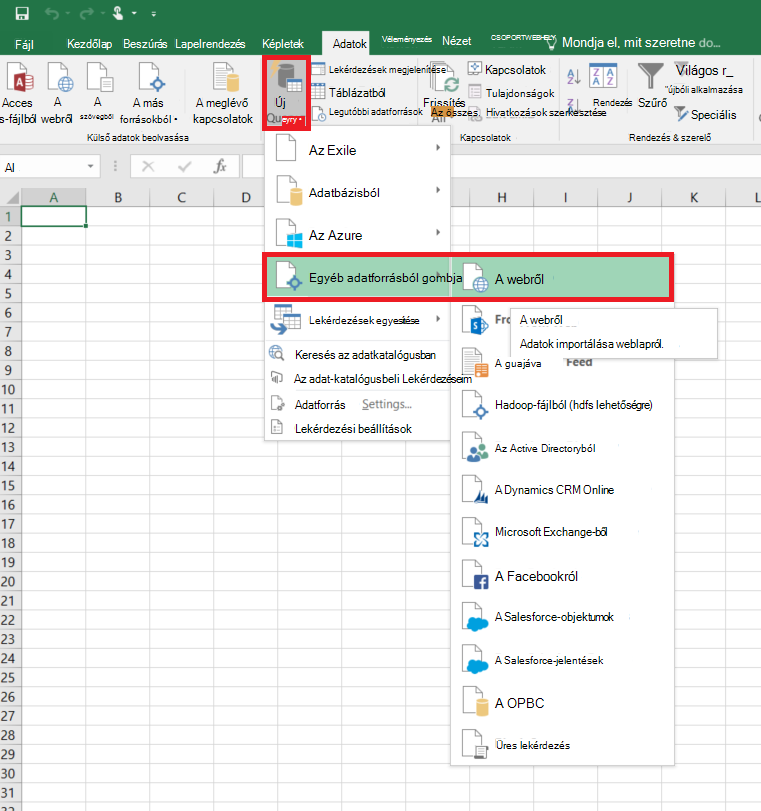
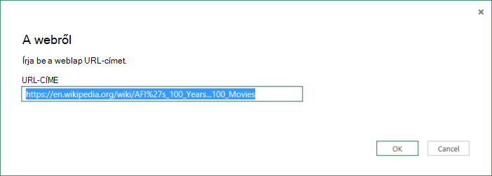
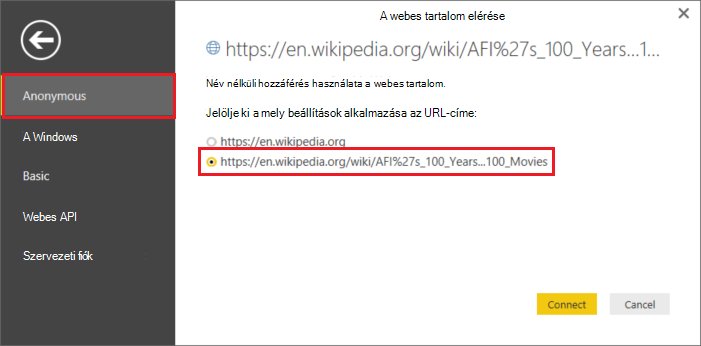
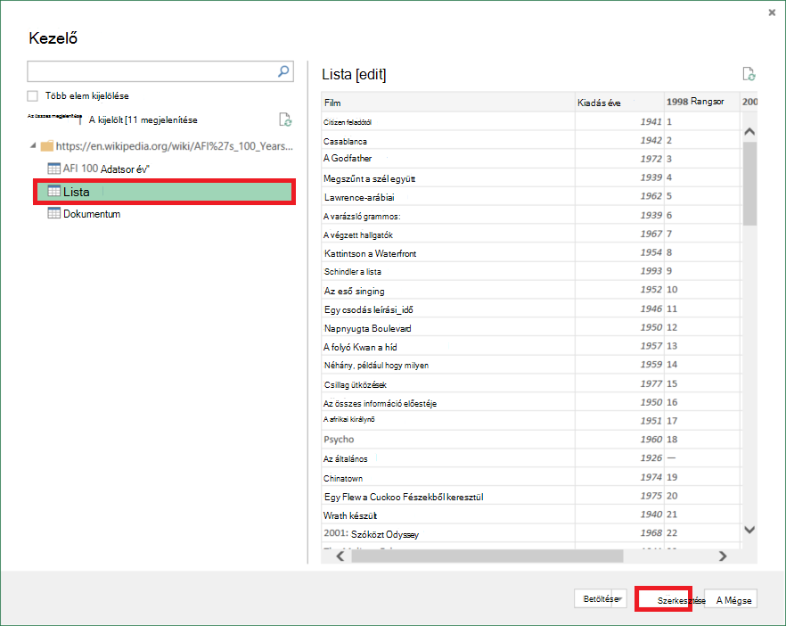
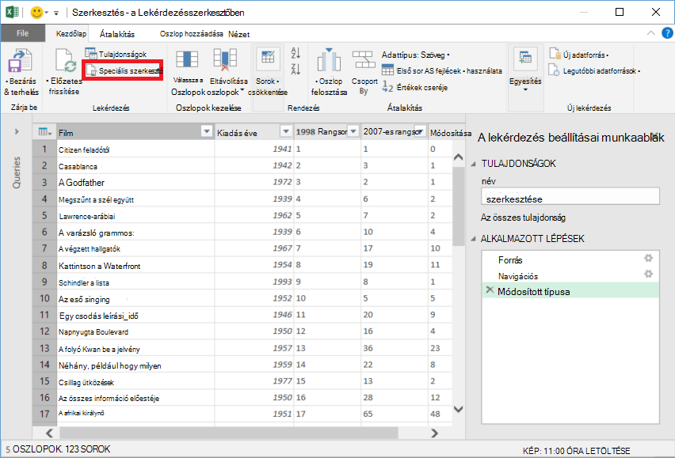
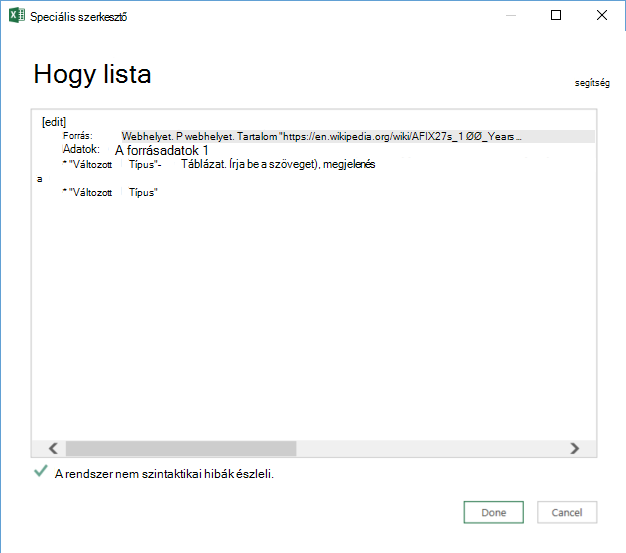

<properties 
    pageTitle="Adatok áthelyezése a webes tábla |} Azure Data Factory" 
    description="További tudnivalók a helyszíni adatok áthelyezése egy weblapot Azure Data Factory táblázat." 
    services="data-factory" 
    documentationCenter="" 
    authors="linda33wj" 
    manager="jhubbard" 
    editor="monicar"/>

<tags 
    ms.service="data-factory" 
    ms.workload="data-services" 
    ms.tgt_pltfrm="na" 
    ms.devlang="na" 
    ms.topic="article" 
    ms.date="09/26/2016" 
    ms.author="jingwang"/>

# Azure adatok gyár használatával webes tábla forrásból származó adatok áthelyezése
Ez a cikk azt ismerteti, hogyan használhatja a Másolás tevékenység-Azure adatok gyári az adatok másolása egy másik adattár az weblapon egy táblázat. Ez a cikk az adatok mozgás egy általános áttekintése másolás állapotát tevékenysége és a támogatott adatokat tároló kombinációk eltéréseit [Mozgás a tevékenységekre vonatkozó adatok](data-factory-data-movement-activities.md) cikk épül.

Adatok gyári jelenleg támogatott csak mozgó adatok webes tábla egyéb adatokat tárolja, de nem az adatok áthelyezésére más adatokból tárolja a webes tábla célhelyre.

> [AZURE.NOTE] A webes összekötő jelenleg csak kibontása táblázat tartalmát a HTML-lapok támogatja.

## Minta: Adatok másolása webes tábla a Azure Blob

Az alábbi példa látható:

1.  Csatolt szolgáltatás típusú [webhelyen](#web-linked-service-properties).
2.  Csatolt szolgáltatás típusú [AzureStorage](data-factory-azure-blob-connector.md#azure-storage-linked-service-properties).
3.  A beviteli [adatkészlet](data-factory-create-datasets.md) [WebTable](#WebTable-dataset-properties)típusú.
4.  Egy kimenet [adatkészlet](data-factory-create-datasets.md) [AzureBlob](data-factory-azure-blob-connector.md#azure-blob-dataset-type-properties)típusú.
4.  A [folyamat](data-factory-create-pipelines.md) [WebSource](#websource-copy-activity-type-properties) és [BlobSink](data-factory-azure-blob-connector.md#azure-blob-copy-activity-type-properties)használó másolása a tevékenységhez.

A minta adatokat másolja a webes tábla egy Azure blob óránként. A minták következő szakaszok ezeket mintákban használt JSON tulajdonságok témakörben olvashat. 

A következő példa bemutatja, hogyan webes tábla adatainak másolása az Azure blob. Azonban adatok másolhatók közvetlenül az Azure Data Factory a Másolás tevékenység használatával a [Tevékenységekre vonatkozó adatok mozgását](data-factory-data-movement-activities.md) cikk jelzett mosdók közül. 

**Webes csatolt szolgáltatás** Ebben a példában a csatolt webszolgáltatás névtelen hitelesítés. Lásd: [webhely szolgáltatás csatolt](#web-linked-service-properties) szakasz hitelesítési használható különböző típusú. 

    {
        "name": "WebLinkedService",
        "properties":
        {
            "type": "Web",
            "typeProperties":
            {
                "authenticationType": "Anonymous",
                "url" : "https://en.wikipedia.org/wiki/"
            }
        }
    }

**Azure csatolt tárhelyszolgáltatáshoz**

    {
      "name": "AzureStorageLinkedService",
      "properties": {
        "type": "AzureStorage",
        "typeProperties": {
          "connectionString": "DefaultEndpointsProtocol=https;AccountName=<accountname>;AccountKey=<accountkey>"
        }
      }
    }

**Beviteli adatkészlet WebTable** Az adatok gyári szolgáltatás **Igaz** beállítás **külső** tájékoztatja, az adatkészlet adatok gyári mutató külső, és nem készül az adatok gyári tevékenységet.

> [AZURE.NOTE] Lásd: [index HTML formátumban megjelenítő táblázat első](#get-index-of-a-table-in-an-html-page) szakasz lépéseket a tárgymutató-táblázat első HTML formátumban.  

    
    {
        "name": "WebTableInput",
        "properties": {
            "type": "WebTable",
            "linkedServiceName": "WebLinkedService",
            "typeProperties": {
                "index": 1,
                "path": "AFI's_100_Years...100_Movies"
            },
            "external": true,
            "availability": {
                "frequency": "Hour",
                "interval":  1
            }
        }
    }

**Azure Blob-kimeneti adatkészlet**

Adatok egy új blob íródott óránként (gyakoriság: óra, intervallum: 1). 

    {
        "name": "AzureBlobOutput",
        "properties":
        {
            "type": "AzureBlob",
            "linkedServiceName": "AzureStorageLinkedService",
            "typeProperties":
            {
                "folderPath": "adfgetstarted/Movies"
            },
            "availability":
            {
                "frequency": "Hour",
                "interval": 1
            }
        }
    }

**Másolás tevékenységeket használó csővezeték**

A folyamat tartalmaz egy másolatot a tevékenység van konfigurálva, a fenti bemeneti és kimeneti adatkészleteket és óránként van ütemezve. A során JSON megadása az **adatforrás** típusa **WebSource** van állítva, és **BlobSink** **gyűjtő** típusának beállítása. 

Lásd: [WebSource tulajdonságokat](#websource-copy-activity-type-properties) a WebSource tulajdonságbeállítások listáját. 
    
    {  
        "name":"SamplePipeline",
        "properties":{  
        "start":"2014-06-01T18:00:00",
        "end":"2014-06-01T19:00:00",
        "description":"pipeline with copy activity",
        "activities":[  
          {
            "name": "WebTableToAzureBlob",
            "description": "Copy from a Web table to an Azure blob",
            "type": "Copy",
            "inputs": [
              {
                "name": "WebTableInput"
              }
            ],
            "outputs": [
              {
                "name": "AzureBlobOutput"
              }
            ],
            "typeProperties": {
              "source": {
                "type": "WebSource"
              },
              "sink": {
                "type": "BlobSink"
              }
            },
           "scheduler": {
              "frequency": "Hour",
              "interval": 1
            },
            "policy": {
              "concurrency": 1,
              "executionPriorityOrder": "OldestFirst",
              "retry": 0,
              "timeout": "01:00:00"
            }
          }
          ]
       }
    }

## Webes csatolt szolgáltatás tulajdonságai

Az alábbi táblázat ismerteti a JSON elemek jellemző csatolt webszolgáltatás leírását.

| A tulajdonság | Leírás | Szükséges |
| -------- | ----------- | -------- | 
| típus | Meg kell a típusa tulajdonság: **webes** | igen | 
| URL-címe | A webes forrás URL-címe | igen |
| authenticationType | Névtelen vagy egyszerű. | igen |
| Felhasználónév | Alapszintű hitelesítés felhasználóneve. | Igen (az alapszintű hitelesítés)
| jelszó | Alapszintű hitelesítés jelszava. | Igen (az alapszintű hitelesítés)

### Névtelen hitelesítés használatával

    {
        "name": "web",
        "properties":
        {
            "type": "Web",
            "typeProperties":
            {
                "authenticationType": "Anonymous",
                "url" : "https://en.wikipedia.org/wiki/"
            }
        }
    }

### Alapszintű hitelesítés használatával
    
    {
        "name": "web",
        "properties":
        {
            "type": "Web",
            "typeProperties":
            {
                "authenticationType": "basic",
                "url" : "http://myit.mycompany.com/",
                "userName": "Administrator",
                "password": "password"
            }
        }
    }

## WebTable adatkészlet tulajdonságai

Szakaszok és a rendelkezésre álló adatkészleteket definiálása tulajdonságok teljes listáját a [létrehozása adatkészleteket](data-factory-create-datasets.md) témakört is. Szakaszok, például a struktúra, elérhetőségét és egy adatkészletből JSON házirend hasonlóak az adatkészlet diagramtípusokat (Azure SQL Azure blob, Azure táblázat stb.).

A **typeProperties** szakasz eltérő adatkészlet hibatípusonként és az adatok tárolása az adatok helyének adatait. Az typeProperties szakaszban adatkészlet **WebTable** típusú rendelkezik az alábbi tulajdonságok

A tulajdonság | Leírás | Szükséges
:-------- | :----------- | :--------
típus    | Az adatkészlet típusát. meg kell **WebTable** | igen
elérési út | A relatív URL-címe a táblázatot tartalmazó erőforrás. | nem. Ha nincs megadva, csak a megadott URL-cím a csatolt szolgáltatás definícióban használja. 
index | A táblázatot az erőforrás indexe. Lásd: [index HTML formátumban megjelenítő táblázat első](#get-index-of-a-table-in-an-html-page) szakasz megtudhatja, hogy egy tábla index első HTML formátumban. | igen

**Példa:**

    {
        "name": "WebTableInput",
        "properties": {
            "type": "WebTable",
            "linkedServiceName": "WebLinkedService",
            "typeProperties": {
                "index": 1,
                "path": "AFI's_100_Years...100_Movies"
            },
            "external": true,
            "availability": {
                "frequency": "Hour",
                "interval":  1
            }
        }
    }

## WebSource - példány tevékenység típusának tulajdonságai

Szakaszok és a tevékenységek definiálásával használható tulajdonságok teljes listáját a [Folyamatok létrehozása](data-factory-create-pipelines.md) témakört is. Az összes tevékenységtípusokhoz tulajdonságait, például a név, leírás, a bemeneti és kimeneti táblák és házirend érhetők el. 

Minden tevékenység típusa azonban függenek tulajdonságok elérhető typeProperties szakaszában a tevékenységet. Másolás tevékenységhez azok eltérőek attól függően, hogy milyen típusú adatforrások és mosdók.

Jelenleg Ha másolás tevékenységet a forrás **WebSource**típusú, nincs további tulajdonságokat használható. 

## Index a táblázat első HTML formátumban

1. Indítsa el az **Excel 2016-ban** , és kattintson az **adatok** fülre.  
2. **Új lekérdezés** kattintson az eszköztáron, mutasson a **Más forrásokból** , és kattintson **A weblapról**gombra.
    
     
3. **A webes** párbeszédpanelen írja be az **URL-cím** JSON csatolt szolgáltatást használó szeretné (például: https://en.wikipedia.org/wiki/) elérési út szeretné az adatkészlet együtt (például: AFI % 27s_100_Years 100_Movies), és kattintson az **OK gombra**. 

     

    Ebben a példában használt URL-cím: https://en.wikipedia.org/wiki/AFI%27s_100_Years...100_Movies 
4.  **Access webes tartalmak** párbeszédpanel jelenik meg, ha a megfelelő **URL-CÍMÉT**, **hitelesítés**, jelölje be, és kattintson a **Csatlakozás**gombra. 

    
5.  Lásd: a táblázat tartalmát, és kattintson a **Szerkesztés** gombra a képernyő alján a fastruktúrájú nézetben **táblázat** elemre.  

     

5. A **Lekérdezésszerkesztő** ablakban kattintson a **Speciális szerkesztő** gombra az eszköztáron.

    

6. A speciális szerkesztő párbeszédpanelen a mellett a "Forrás" értéke az index.

     

Ha az Excel 2013 használata esetén segítségével [Az Excelhez készült Microsoft Power Query](https://www.microsoft.com/download/details.aspx?id=39379) az index. Lásd: [Csatlakozás az weblapon](https://support.office.com/article/Connect-to-a-web-page-Power-Query-b2725d67-c9e8-43e6-a590-c0a175bd64d8) a cikk további információt. A lépések hasonlóak, ha használja [A Microsoft Power BI asztali](https://powerbi.microsoft.com/desktop/). 

[AZURE.INCLUDE [data-factory-column-mapping](../../includes/data-factory-column-mapping.md)]

[AZURE.INCLUDE [data-factory-structure-for-rectangualr-datasets](../../includes/data-factory-structure-for-rectangualr-datasets.md)]

## A teljesítmény és a finombeállítása  
Lásd: a [Másolás tevékenység teljesítmény és útmutató beállítása](data-factory-copy-activity-performance.md) Ha többet szeretne tudni a főbb tényezők hatása teljesítmény mozgásának adatok (másolása a tevékenység) az Azure Data Factory és a különféle módokon optimalizálása azt.
