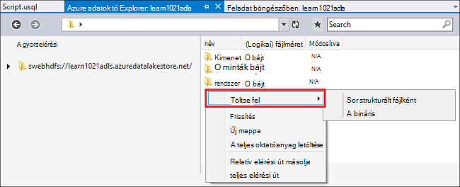
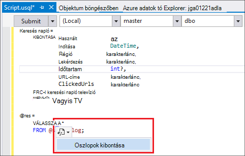
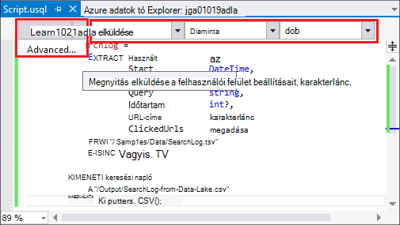
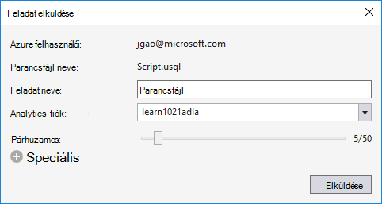
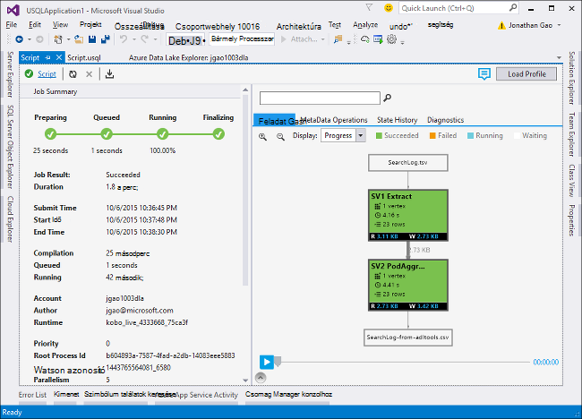
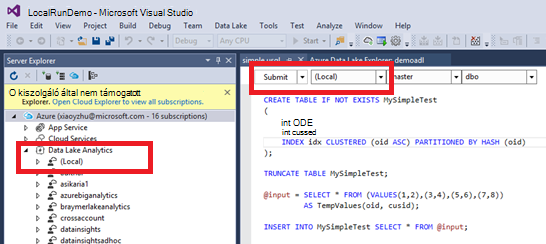
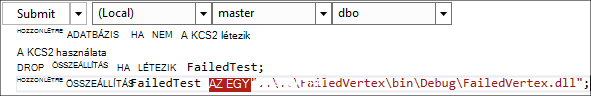

<properties
   pageTitle="Adatok tó eszközeivel for Visual Studio U – SQL-parancsfájlok kidolgozása |} Azure"
   description="Megtudhatja, hogy miként telepítheti az tó Adateszközök Visual Studio, fejlesztésével és vizsgálat U-SQL nyelvben parancsfájlok. "
   services="data-lake-analytics"
   documentationCenter=""
   authors="edmacauley"
   manager="jhubbard"
   editor="cgronlun"/>

<tags
   ms.service="data-lake-analytics"
   ms.devlang="na"
   ms.topic="get-started-article"
   ms.tgt_pltfrm="na"
   ms.workload="big-data"
   ms.date="05/16/2016"
   ms.author="edmaca"/>

# Oktatóanyag: adatok tó eszközeivel for Visual Studio U – SQL-parancsfájlok kidolgozása

[AZURE.INCLUDE [get-started-selector](../../includes/data-lake-analytics-selector-get-started.md)]

Megtudhatja, hogyan telepítheti a tó Adateszközök for Visual Studio, és írja be és tesztelje a U – SQL-parancsfájlok adatok tó Tools for Visual Studio segítségével.

Az SQL-U előkészítése, átalakításához és az adatok tó és túl az összes adatok elemzése a hyper méretezhető, nagyon bővíthető nyelv. További tudnivalókért lásd: [az SQL-U hivatkozás] (http://go.microsoft.com/fwlink/p/?LinkId=691348).

##Előfeltételek

- **Visual Studio 2015, a Visual Studio 2013 frissítése a 4-es és a Visual Studio 2012. Vállalati (Ultimate/prémium verzióban), a Professional, közösségi kiadásai által támogatott; Express edition nem támogatott. Jelenleg nem támogatja a Visual Studio "15", és dolgozunk, amely a.**
- **Microsoft Azure SDK a .NET rendszerhez verzió 2.7.1 vagy felett**.  Telepítse újra a [Webes platform telepítő](http://www.microsoft.com/web/downloads/platform.aspx)használatával.
- Az **[adatok tó Tools for Visual Studio](http://aka.ms/adltoolsvs)**.

    Miután telepítette az adatok tó Tools for Visual Studio, egy "Adatok tó Analytics" csomópontjának Server Explorer csoportban az "Azure" csomópont (megnyithatja Server explorer Ctrl + Alt + S billentyűkombinációval) jelenik meg.

- **Hajtsa végre az alábbi két szakaszok az [első lépések az Azure adatok tó Analytics Azure portál használatával](data-lake-analytics-get-started-portal.md)**.

    - [Azure adatok tó Analytics fiók létrehozása](data-lake-analytics-get-started-portal.md#create_adl_analytics_account).
    - [SearchLog.tsv feltölteni az alapértelmezett tó adattárolás fiókba](data-lake-analytics-get-started-portal.md#update-data-to-the-default-adl-storage-account).

    Kényelme PowerShell mintaparancsfájl adatok tó analitikus szolgáltatás létrehozása és feltöltése adatok forrásfájl [előkészítése az oktatóprogram Appx-A PowerShell](data-lake-analytics-data-lake-tools-get-started.md#appx-a-powershell-sample-for-preparing-the-tutorial)mintában találhatók.

    Az adatok tó eszközök létrehozása adatok tó Analytics-fiókokat nem támogatja. Úgy kell létrehozni a dokumentumot az Azure portálon Azure PowerShell, .NET SDK vagy Azure CLI. Adatok tó Analytics feladat futtatása, szüksége lesz néhány adatot. Annak ellenére, hogy a tó Adateszközök támogatja a feltöltése adatokat, de a portálon feltöltése a mintaadatokat, így könnyebben kövesse az ebben az oktatóanyagban kell használni.

## Azure csatlakoztatása

**Adatok tó Analytics csatlakozni**

1. Nyissa meg a Visual Studio.
2. Kattintson a **Nézet** menü **Server Explorer** Server Explorer megnyitásához. Nyomja le az ENTER vagy **[CTRL] + [ALT] + S**.
3. Kattintson a jobb gombbal az **Azure**, kattintson a "Csatlakozás a Microsoft Azure előfizetés" és a képernyőn megjelenő utasításokat.
4. A **Kiszolgáló Intéző**bontsa ki az **Azure**, és bontsa ki a **Adatok tó elemző**. Az adatok tó Analytics partnerlista kell látni, ha vannak. Visual Studio adatok tó Analytics-fiókokat nem hozható létre. Hozhat létre fiókot, lásd: [első lépések az Azure adatok tó Analytics Azure portal segítségével](data-lake-analytics-get-started-portal.md) vagy [Azure adatok tó Analytics Azure PowerShell használata – első lépések](data-lake-analytics-get-started-powershell.md).

## Forrás adatok fájlok feltöltése

Az oktatóprogram során feltöltött szakaszában **kapcsolatban előzetesen szükséges** adatokat.  

Abban az esetben, ha szeretné használni a saját adatain, az alábbiakban a tó Adateszközök adatainak feltöltése műveleteket.

**Fájlok feltöltése a függő Azure adatok tó fiók**

1. A **Kiszolgáló Intéző**, bontsa ki **Azure**, bontsa ki az **Adatok tó Analytics**, bontsa ki az adatok tó Analytics-fiókját, **Tárterület-fiókok**. Az alapértelmezett tó adattárolás fiók és a csatolt tó adattárolás partnerek és a csatolt Azure tárterület-fiókok kell látni. Az alapértelmezett adatokat tó fiók oszlopfejlécek "Alapértelmezett tároló fiók".
2. Kattintson a jobb gombbal az alapértelmezett tó adattárolás fiókot, és kattintson a **Intéző**.  Visual Studio-tallózó panelen tó Adateszközök nyílik meg.  A bal oldalon található azt Megadja azt a fastruktúra nézet, a tartalom megtekintése a jobb oldalon.
3. Tallózással keresse meg azt a mappát, amelyhez a fájlok feltöltése
4. Kattintson a jobb gombbal bármilyen üres területre, és kattintson a **Feltöltés**gombra.

    

**Fájlok feltöltése egy csatolt Azure Blob-tároló fiókkal**

1. A **Kiszolgáló Intéző**, bontsa ki **Azure**, bontsa ki az **Adatok tó Analytics**, bontsa ki az adatok tó Analytics-fiókját, **Tároló fiókok**. Az alapértelmezett tó adattárolás fiók és a csatolt tó adattárolás partnerek és a csatolt Azure tárterület-fiókok kell látni.
2. Bontsa ki az Azure tárterület-fiókot.
3. Kattintson a jobb gombbal a tároló, amelyre fájlok feltöltése, és kattintson a **Intéző**. Ha még nincs telepítve a tároló, akkor először hozzon létre egyet az Azure-portálra, Azure PowerShell vagy egyéb eszközök.
4. Tallózással keresse meg azt a mappát, amelyhez a fájlok feltöltése
5. Kattintson a jobb gombbal bármilyen üres területre, és kattintson a **Feltöltés**gombra.

## Az SQL-U parancsfájlok kidolgozása

Az adatok tó Analytics feladatok U-SQL nyelvben nyelvű kerülnek. Többet szeretne tudni az SQL-U, [U – SQL nyelv használatába](data-lake-analytics-u-sql-get-started.md) és [U-SQL nyelv reference](http://go.microsoft.com/fwlink/?LinkId=691348)témakörben olvashat.

**Létrehozása és adatok tó Analytics feladat elküldése**

1. A **fájl** menüben kattintson az **Új**gombra, és kattintson a **Projekt**.
2. Válassza ki a **Projekt U-SQL nyelvben** .

    

3. Kattintson az **OK gombra**. A Visual studio megoldást hoz létre **Script.usql** -fájl segítségével.
4. Írja be a következőt a **Script.usql**:

        @searchlog =
            EXTRACT UserId          int,
                    Start           DateTime,
                    Region          string,
                    Query           string,
                    Duration        int?,
                    Urls            string,
                    ClickedUrls     string
            FROM "/Samples/Data/SearchLog.tsv"
            USING Extractors.Tsv();

        @res =
            SELECT *
            FROM @searchlog;        

        OUTPUT @res   
            TO "/Output/SearchLog-from-Data-Lake.csv"
        USING Outputters.Csv();

    Ez az SQL-U parancsfájl beolvassa az adatokat forrásfájl **Extractors.Tsv()**használatával, és ekkor létrehoz egy csv-fájl használatával **Outputters.Csv()**.

    Ne módosítsa a két elérési útját, kivéve, ha a forrásfájl egy másik helyre másolja.  Adatok tó elemző a kimeneti mappát hoz létre, ha még nem létezik.

    Sokkal egyszerűbb a fájlok alapértelmezett tárolt adatok tó fiókok relatív elérési utak használatával. Abszolút elérési út is használhatja.  Ha például

        adl://<Data LakeStorageAccountName>.azuredatalakestore.net:443/Samples/Data/SearchLog.tsv

    Abszolút elérési út csatolt tároló fiókok fájlok eléréséhez kell használnia.  A csatolt Azure tárterület-fiókjában tárolt fájlok szintaxisa a következő:

        wasb://<BlobContainerName>@<StorageAccountName>.blob.core.windows.net/Samples/Data/SearchLog.tsv

    >[AZURE.NOTE] Nyilvános BLOB vagy nyilvános tárolók hozzáférési engedélyek Azure Blob-tárolóban jelenleg nem támogatott.  

    Figyelje meg a következő funkciók:

    - **Az IntelliSense**

        A név az automatikus lefolytatottak és a tagok fog megjelenni a sorhalmazon, osztályok, sémák és felhasználó által definiált objektumok (UDOs).

        Az IntelliSense katalógus személyek (adatbázisok, sémák, táblák, UDOs stb.) a számítási fiók kapcsolódik. Jelölje be az aktuális aktív számítási fiók, az adatbázis és a felső eszköztárában sémájának, és váltás őket a legördülő listák keresztül.

    - *Oszlopok *kibontása***

        Kattintson a jobb oldalán *, kék aláhúzással kell látni a *. Vigye az egérmutatót a kék aláhúzásának, és kattintson a lefelé mutató nyílra.
        

        **Oszlopok kibontása**, kattintson az eszköz felülírják a * az oszlop nevét.

    - **Automatikus formázása**

        A felhasználók módosíthatják a behúzás mértékét a kód alapján U-SQL nyelvben parancsfájl-struktúra a Szerkesztés csoport Speciális >:

        - Dokumentum formázása (Ctrl + E, D): A teljes dokumentum formázása   
        - Kijelölés formázása (Ctrl + K billentyűkombinációt, a Ctrl + F): A kijelölés formázása. Ha nincs kijelölés nem érkezik, a billentyűparancs formázza, a kurzor a sor.  

        Az összes formázási szabályok konfigurálható a eszközök ->-Beállítások > Text szerkesztő - > SIP -> formázás.  
    - **SmartArt-francia**

        Adatok tó Tools for Visual Studio, akkor automatikusan behúzásához a kifejezések parancsfájlok írás közben képes. Ez a szolgáltatás alapértelmezés szerint nincs engedélyezve, a felhasználók, U ellenőrzése keresztül engedélyeznie kell – SQL-beállítások > és a kapcsolók-beállítások > -> intelligens behúzás engedélyezése.

    - **Nyissa meg a Definition, és keresse meg az összes hivatkozás**

        Kattintson a jobb gombbal egy UDO sorhalmazon/paraméter/oszlop stb nevét, és a gombra kattintva lépjen a definíció (F12) lehetővé teszi, hogy segítségével megkeresheti a definíciójához. Keresse meg az összes hivatkozást (Shift + F12) gombra kattintva jelennek meg az összes hivatkozás.

    - **Beszúrás Azure elérési út**

        Nem megjegyzése Azure fájl elérési útja, és írja be manuálisan, amikor a parancsfájl, Visual Studio tó Adateszközök írása egyszerűvé: kattintson a jobb gombbal a szerkesztő, kattintson a Beszúrás Azure elérési útját. Nyissa meg azt a fájlt a Azure Blob-tallózó panelen. Kattintson az **OK gombra**. a fájl elérési útját a program beszúrja a kód.

5. Adja meg az adatok tó elemző fiók, adatbázis és séma. Megadhatja, hogy **(helyi)** futtatása helyileg tesztelés a célra. További tudnivalókért lásd: [Futtatása U-SQL nyelvben helyi meghajtóra](#run-u-sql-locally).

    

    További tudnivalókért olvassa el a [U SQL katalógus](data-lake-analytics-use-u-sql-catalog.md)című témakört.

5. A **Megoldás Intéző**kattintson a jobb gombbal a **Script.usql**, és kattintson a **Szerkesztés parancsfájl**. Ellenőrizze az eredményt, a kimeneti ablakban.
6. A **Megoldás Explorer**kattintson a jobb gombbal a **Script.usql**, és válassza a **Parancsprogram elküldése**. Tetszés szerint is kattinthat **Küldés** Script.usql ablak.  Lásd: az előző képernyőképe.  Az előzetes beállításokkal elküldése a Küldés gomb melletti nyílra kattintva:
7. Adja meg a **Feladat nevére**, ellenőrizze a **Analytics-fiókot**, és kattintson a **Küldés**gombra. Beküldési eredmények és a feladat hivatkozás érhetők el a Visual Studióban ablak tó Adateszközök a beküldött befejeztével.

    

8. A frissítés gombra kattintva megtekintheti a legújabb feladat állapotát és a képernyő frissítése kell kattintania. Ha a feladat sikeres azt láthatja, a **Feladat Graph**, **Metaadatok adatgyűjtési műveletek**, **Állapot előzmények** **Diagnosztika**:

    

    * Projekt összefoglalása. Az összegzett adatokat, az aktuális feladatot, például megjelenítése: állapot előrehaladását, végrehajtás ideje, futtatókörnyezet nevét, küldő stb.   
    * Feladat részletei. Részletes információkat a feladat adni, többek között a parancsfájl, erőforrás, csúcsra végrehajtási megtekintése.
    * Feladat grafikon. Négy grafikonok állnak rendelkezésre a feladat adatainak ábrázolása: folyamatban, adatok olvasható, adatokat írni, végrehajtás ideje, átlagos végrehajtási idő / csomópontot, beviteli átviteli, kimeneti átviteli.
    * Metaadat-alapú műveletek. A metaadat-műveletek mutatja.
    * Állapot előzmények.
    * Diagnosztikai. Adatok tó Tools for Visual Studio fog automatikusan diagnosztizálása feladat végrehajtását. Értesítések fog kapni, amikor egyes hibákat vagy a saját feladatok teljesítménnyel kapcsolatos problémák. Lásd: a projekt diagnosztika (hivatkozás TBD) rész további információt.

**Feladat állapot ellenőrzése**

1. Kiszolgáló Intézőből bontsa ki az **Azure**, bontsa ki az **Adatok tó Analytics**, az adatok tó Analytics fióknév
2. Kattintson duplán a feladatok lista a **feladatokat** .
2. Kattintson a feladat állapotát.

**A feladat kimenet megjelenítéséhez**

1. A **Kiszolgáló Intéző**bontsa ki az **Azure**, bontsa ki az **Adatok tó Analytics**, bontsa ki az adatok tó Analytics-fiókját, bontsa ki a **Tárterület-fiókok**, kattintson a jobb gombbal az alapértelmezett tó adattárolás fiók és **Explorer**parancsra.
2.  Kattintson duplán a **kimeneti** nyissa meg azt a mappát
3.  Kattintson duplán a **SearchLog-a-adltools.csv**.

###Feladat lejátszás

Feladat lejátszás lehetővé teszi, hogy a feladat-végrehajtás előrehaladását megtekintés és vizuálisan észleli azokat meg teljesítményét rendellenességeinek és szűk. Ez a funkció is használható, mielőtt a feladat befejezése után végrehajtása (azaz a időszakban aktívan fut a feladat), valamint végrehajtása után. Lejátszás módon projekt végrehajtásakor lehetővé teszi a felhasználó lejátszásához felfelé az aktuális idő végrehajtását.

**Feladat-végrehajtás előrehaladását**  

1. Kattintson a **Profil betöltése** a jobb felső sarokban. Lásd: az előző képernyőképét.
2. Kattintson a feladat-végrehajtás végrehajtásának áttekintése bal alsó sarokban a lejátszás gombra.
3. A lejátszás, alatt kattintson a **Szünet** , a le, illetve közvetlenül az állapotsáv a adott pozícióba.

###Hőtérkép megjelenítése

Adatok tó Tools for Visual Studio felhasználói ügyféloldalon választható szín-lefedi a feladat megtekintése, melyek jelzik előrehaladását, adatok I/O, végrehajtás ideje, egyes szakaszait I/O átviteli biztosít. Keresztül, a felhasználók is azt kell megállapítania potenciális problémák és a feladat tulajdonságai terjesztési közvetlenül és intuitív. Megadhatja, hogy egy adatforrás megjelenítéséhez a legördülő listából.  

## Az SQL-U helyileg futtatása

A tapasztalt futtatja a Visual Studio U-SQL nyelvben helyi az alábbi műveleteket végezheti el:

- U-SQL nyelvben parancsfájlok helyi meghajtóra, futtassa a és C# összeállítások.
- C# összeállítások helyileg hibakeresési.
- Azure adatok tó Analytics szolgáltatás/törlés/nézet létrehozása a helyi adatbázisok, szerelvények, sémák és ugyanúgy, mint a kiszolgáló Intézőben táblák haszonnal jár.

A Visual Studióban *helyi* fiók jelenik meg, és a telepítő létrehoz egy *DataRoot* mappában található *C:\LocalRunRoot*. A DataRoot mappa lesz:

- Tár metaadatainak többek között a táblázatok, adatbázisok, TVFs stb.
- Egy bizonyos parancsfájl: relatív hivatkozás található bemeneti és kimeneti elérési utak, ha azt fogja keresheti meg a DataRoot (, valamint a parancsfájl elérési útját, ha az informatikai bemeneti)
- A DataRoot mappát nem lehet hivatkozni, ha egy összeállítás regisztrálhat, és a relatív elérési út (lásd: további részleteket "Ha módon helyi Futtatás használata összeállítások" rész)

Az alábbi videó bemutatja a U-SQL nyelvben helyi futtatása szolgáltatás:

>[AZURE.VIDEO usql-localrun]

### Ismert problémák és korlátai

- Nem hozható létre táblázat/DB stb Server Explorer helyi fiók.
- Amikor relatív hivatkozott:

    - A parancsprogram beviteli (KIBONTÁSA * FROM "/ elérési utat és abc") – a parancsfájl elérési útját és DataRoot elérési kell keresni.
    - Parancsfájl kimeneti (kibocsátás "elérési útja/abc"): a DataRoot út a kimeneti mappában lesz.
    - Az összeállítás regisztrációs (az ÖSSZEÁLLÍTÁS létrehozása xyz "/ elérési út/abc"): a parancsfájl elérési útját fog szeretne keresni, de nem az DataRoot.
    - A registered TVF/nézet vagy más metaadatok szervezetek: a DataRoot elérési utat kell keresni, de nem a parancsfájl elérési útját.

    Parancsfájlok futtatta adatok tó szolgáltatásokhoz, az alapértelmezett tárterület-fiók legfelső szintű mappa lesz, és ennek megfelelően kell keresni.

### Helyi meghajtóra U – SQL-parancsfájlok tesztelése
Az SQL-U parancsfájlok fejlesztése, tanulmányozza [kidolgozása U SQL-parancsfájlok](#develop-and-test-u-sql-scripts). Létre, és futtassa az SQL-U parancsfájlok helyi meghajtóra, a csoport legördülő listájában válassza a **(helyi)** , és kattintson a **Küldés**gombra. Ellenőrizze, hogy rendelkezik a megfelelő adatokat a hivatkozott - vagy hivatkozni abszolút elérési útját, vagy elhelyezni az adatokat a DataRoot mappában találja.

Később is is kattintson a jobb gombbal egy parancsprogramot és a helyi menüben kattintson a **Helyi terv futtatása** parancsra, vagy nyomja le a **CTRL + F5** eseményindító helyi futtatása.

### Összeállítások használata a helyi futtatása

Kétféleképpen futtatásához a testre szabott C# fájlok:

- Írja be a kódot mögött fájl szerelvények, és a szerelvények automatikusan regisztrál és kihagyott, miután megtörtént a parancsprogram.
- C# összeállítás projekt létrehozása és a kimeneti dll-alatti például parancsfájl keresztül a helyi fiókot regisztrálni. Felhívjuk a figyelmét arra, hogy az elérési út-e a DataRoot mappát, hanem a parancsfájl viszonyított.

### Parancsfájlok és C# összeállítások helyileg hibakeresése

A hibakeresési C# összeállítások elküldése és regisztrálása az Azure adatok tó Analytics szolgáltatás nélkül. Beállíthatja, hogy töréspontok fájl mögött mindkét a kódot, és a hivatkozott C# projekt.

**A fájl működését szabályozó kódot helyi kód hibakeresése**
1.  Beállíthatja töréspontok fájl alapjául szolgáló kódot.
2.  Nyomja le az **F5** szeretné hibakeresése helyi meghajtóra.

Az alábbi eljárást csak akkor működik, a Visual Studio 2015. A régebbi Visual Studio előfordulhat manuálisan kell felvenni a pdb fájlokat.

**A hivatkozott C# projekt helyi kód hibakeresése**
1.  C# összeállítás projekt létrehozása, és hozza létre, azt a kimeneti dll létrehozásához.
2.  A dll-szolgáltatásfájlját egy U az SQL utasítással rögzítése:

        CREATE ASSEMBLY assemblyname FROM @"..\..\path\to\output\.dll";
3.  A C# kód töréspontok beállítása
4.  Nyomja le az **F5** szeretné hibakeresése a és C# dll helyileg hivatkozó.  

##Lásd még:

Első lépések az adatok tó Analytics különböző eszközök használatával, olvassa el:

- [Első lépések az adatok tó Analytics Azure portál használatával](data-lake-analytics-get-started-portal.md)
- [Első lépések az adatok tó Analytics Azure PowerShell használatával](data-lake-analytics-get-started-powershell.md)
- [Első lépések az adatok tó Analytics .NET SDK használatával](data-lake-analytics-get-started-net-sdk.md)
- [Az SQL-U feladatok C# kód hibakeresése](data-lake-analytics-debug-u-sql-jobs.md)

A további fejlesztés témakörökben talál:

- [Adatok tó Analytics használatával webnaplókra elemzése](data-lake-analytics-analyze-weblogs.md)
- [Az SQL-U parancsfájlok tó Adateszközök for Visual Studio kidolgozása](data-lake-analytics-data-lake-tools-get-started.md)
- [Azure adatok tó elemző U – SQL nyelv használatába](data-lake-analytics-u-sql-get-started.md)
- [A felhasználó által definiált operátorok U-SQL nyelvben adatok tó Analytics feladatokhoz kidolgozása](data-lake-analytics-u-sql-develop-user-defined-operators.md)

##Az oktatóprogram előkészítése AlkX-A PowerShell minta

Az alábbi PowerShell parancsprogramot előkészíti Azure adatok tó Analytics-fiók és a forrásadatok, így [kidolgozása U SQL-parancsfájlok](data-lake-analytics-data-lake-tools-get-started.md#develop-u-sql-scripts)kihagyhatja.

    #region - used for creating Azure service names
    $nameToken = "<Enter an alias>"
    $namePrefix = $nameToken.ToLower() + (Get-Date -Format "MMdd")
    #endregion

    #region - service names
    $resourceGroupName = $namePrefix + "rg"
    $dataLakeStoreName = $namePrefix + "adas"
    $dataLakeAnalyticsName = $namePrefix + "adla"
    $location = "East US 2"
    #endregion

    # Treat all errors as terminating
    $ErrorActionPreference = "Stop"

    #region - Connect to Azure subscription
    Write-Host "`nConnecting to your Azure subscription ..." -ForegroundColor Green
    try{Get-AzureRmContext}
    catch{Login-AzureRmAccount}
    #endregion

    #region - Create an Azure Data Lake Analytics service account
    Write-Host "Create a resource group ..." -ForegroundColor Green
    New-AzureRmResourceGroup `
        -Name  $resourceGroupName `
        -Location $location

    Write-Host "Create a Data Lake account ..."  -ForegroundColor Green
    New-AzureRmDataLakeStoreAccount `
        -ResourceGroupName $resourceGroupName `
        -Name $dataLakeStoreName `
        -Location $location

    Write-Host "Create a Data Lake Analytics account ..."  -ForegroundColor Green
    New-AzureRmDataLakeAnalyticsAccount `
        -Name $dataLakeAnalyticsName `
        -ResourceGroupName $resourceGroupName `
        -Location $location `
        -DefaultDataLake $dataLakeStoreName

    Write-Host "The newly created Data Lake Analytics account ..."  -ForegroundColor Green
    Get-AzureRmDataLakeAnalyticsAccount `
        -ResourceGroupName $resourceGroupName `
        -Name $dataLakeAnalyticsName  
    #endregion

    #region - prepare the source data
    Write-Host "Import the source data ..."  -ForegroundColor Green
    $localFolder = "C:\Tutorials\Downloads\" # A temp location for the file.
    $storageAccount = "adltutorials"  # Don't modify this value.
    $container = "adls-sample-data"  #Don't modify this value.

    # Create the temp location  
    New-Item -Path $localFolder -ItemType Directory -Force

    # Download the sample file from Azure Blob storage
    $context = New-AzureStorageContext -StorageAccountName $storageAccount -Anonymous
    $blobs = Azure\Get-AzureStorageBlob -Container $container -Context $context
    $blobs | Get-AzureStorageBlobContent -Context $context -Destination $localFolder

    # Upload the file to the default Data Lake Store account    
    Import-AzureRmDataLakeStoreItem -AccountName $dataLakeStoreName -Path $localFolder"SearchLog.tsv" -Destination "/Samples/Data/SearchLog.tsv"

    Write-Host "List the source data ..."  -ForegroundColor Green
    Get-AzureRmDataLakeStoreChildItem -Account $dataLakeStoreName -Path  "/Samples/Data/"
    #endregion
