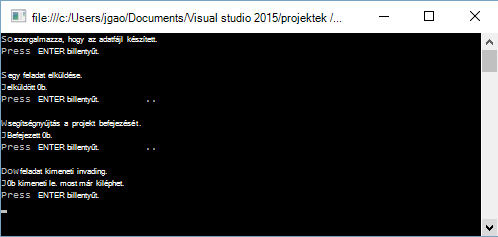

<properties 
   pageTitle="Első lépések az Azure adatok tó Analytics .NET SDK használatával |} Azure" 
   description="Megtudhatja, hogy miként tó adattár fiókok létrehozása, adatok tó Analytics-feladatok létrehozása a .NET SDK használatával, és nyújtson be a feladatok U-SQL nyelvben nyelven íródott. " 
   services="data-lake-analytics" 
   documentationCenter="" 
   authors="edmacauley" 
   manager="jhubbard" 
   editor="cgronlun"/>
 
<tags
   ms.service="data-lake-analytics"
   ms.devlang="na"
   ms.topic="hero-article"
   ms.tgt_pltfrm="na"
   ms.workload="big-data" 
   ms.date="10/26/2016"
   ms.author="edmaca"/>

# Oktatóprogram: Azure adatok tó Analytics .NET SDK használata – első lépések

[AZURE.INCLUDE [get-started-selector](../../includes/data-lake-analytics-selector-get-started.md)]

Megtudhatja, hogy miként küldhetnek írt [U –](data-lake-analytics-u-sql-get-started.md) SQL-adatok tó Analytics feladatokat az Azure .NET SDK használatával. További információt a adatok tó Analytics [Azure adatok tó Analytics áttekintése](data-lake-analytics-overview.md)című témakörben találhat.

Ebben az oktatóanyagban fog készítsünk egy U-SQL nyelvben feladat, amely beolvassa a tabulátor elválasztott értékek (TSV) fájlt, és konvertálja a vesszővel tagolt (CSV) fájl elküldése C# konzol alkalmazást. Az azonos oktatóprogram más támogatott eszközökkel folyamatát, kattintson a lap tetején lévő Ez a cikk.

##Előfeltételek

Ebben az oktatóanyagban megkezdése előtt a következőket kell rendelkeznie:

- A **visual Studio 2015, a Visual Studio 2013 frissítése, 4, vagy vizuális C++ telepítve van a Visual Studio 2012**.
- **Microsoft Azure SDK a .NET rendszerhez 2.5-ös verziójának, vagy felett**.  Telepítse újra a [Webes platform telepítő](http://www.microsoft.com/web/downloads/platform.aspx)használatával.
- **Az Azure adatok tó Analytics-fiókot**. Lásd: [Kezelése adatok tó Analytics Azure .NET SDK használatával](data-lake-analytics-manage-use-dotnet-sdk.md).

##Konzol-alkalmazás létrehozása

Ebben az oktatóanyagban bizonyos keresési naplók feldolgozása.  A keresési napló adatok tó tár vagy a Azure Blob-tárolóhoz tárolható. 

Egy mintanézet Keresés nyilvános Azure Blob-tárolóban található. Az alkalmazásban használni munkaállomástól töltse le a fájlt, és kattintson az alapértelmezett adattár tó fiókba az adatok tó Analytics-fiók töltse fel a fájlt.

**Az SQL-U parancsfájl létrehozása**

Adatok tó Analytics feladatok U-SQL nyelvben nyelvű kerülnek. Többet szeretne tudni az SQL-U, [U – SQL nyelv használatába](data-lake-analytics-u-sql-get-started.md) és [U-SQL nyelv reference](http://go.microsoft.com/fwlink/?LinkId=691348)témakörben olvashat.

Hozzon létre egy **SampleUSQLScript.txt** fájlt a következő U-SQL nyelvben parancsfájl, és helyezze el a fájlt a **C:\temp\* * elérési útját.  Az elérési út szoftveresen kötött hoz létre a következő eljárással a .NET-alkalmazásban.  

    @searchlog =
        EXTRACT UserId          int,
                Start           DateTime,
                Region          string,
                Query           string,
                Duration        int?,
                Urls            string,
                ClickedUrls     string
        FROM "/Samples/Data/SearchLog.tsv"
        USING Extractors.Tsv();
    
    OUTPUT @searchlog   
        TO "/Output/SearchLog-from-Data-Lake.csv"
    USING Outputters.Csv();

A U-SQL nyelvben parancsfájl beolvassa az adatokat forrásfájl **Extractors.Tsv()**használatával, és ekkor létrehoz egy csv-fájl használatával **Outputters.Csv()**. 

A C#-alkalmazásban kell készítse el a **/Samples/Data/SearchLog.tsv** fájlt, és a **/Output/** mappát.    

Sokkal egyszerűbb a fájlok alapértelmezett tárolt adatok tó fiókok relatív elérési utak használatával. Abszolút elérési út is használhatja.  Ha például 

    adl://<Data LakeStorageAccountName>.azuredatalakestore.net:443/Samples/Data/SearchLog.tsv
    
Abszolút elérési út csatolt tároló fiókok fájlok eléréséhez kell használnia.  A csatolt Azure tárterület-fiókjában tárolt fájlok szintaxisa a következő:

    wasb://<BlobContainerName>@<StorageAccountName>.blob.core.windows.net/Samples/Data/SearchLog.tsv

>[AZURE.NOTE] Jelenleg ismert probléma a Azure adatok tó szolgáltatással.  Ha a minta alkalmazás megszakad vagy hibát észlel, előfordulhat, hogy manuálisan törölni szeretne, amely a parancsfájl hoz létre tó adattár és adatok tó Analytics-fiókok.  Ha nem ismeri az Azure-portálra a, a [kezelése Azure adatok tó Analytics Azure portal segítségével](data-lake-analytics-manage-use-portal.md) útmutató fog használatba vételéhez.       

**Alkalmazás létrehozása**

1. Nyissa meg a Visual Studio.
2. C# console-alkalmazás létrehozása.
3. Nyissa meg a NuGet csomag Management console, és futtassa az alábbi parancsokat:

        Install-Package Microsoft.Azure.Management.DataLake.Analytics -Pre
        Install-Package Microsoft.Azure.Management.DataLake.Store -Pre
        Install-Package Microsoft.Azure.Management.DataLake.StoreUploader -Pre
        Install-Package Microsoft.Rest.ClientRuntime.Azure.Authentication -Pre
        Install-Package WindowsAzure.Storage

       
5. Program.cs illessze be a következő kódot:

        using System;
        using System.IO;
        using System.Collections.Generic;
        using System.Threading;
        using Microsoft.Rest;
        using Microsoft.Rest.Azure.Authentication;
        using Microsoft.Azure.Management.DataLake.Store;
        using Microsoft.Azure.Management.DataLake.StoreUploader;
        using Microsoft.Azure.Management.DataLake.Analytics;
        using Microsoft.Azure.Management.DataLake.Analytics.Models;
        using Microsoft.WindowsAzure.Storage.Blob;

        namespace SdkSample
        {
          class Program
          {
            private const string SUBSCRIPTIONID = "<Enter Your Azure Subscription ID>";
            private const string CLIENTID = "1950a258-227b-4e31-a9cf-717495945fc2";
            private const string DOMAINNAME = "common"; // Replace this string with the user's Azure Active Directory tenant ID or domain name, if needed.

            private static string _adlaAccountName = "<Enter an Existing Data Lake Analytics Account Name>";
            private static string _adlsAccountName = "<Enter the default Data Lake Store Account Name>";

            private static DataLakeAnalyticsAccountManagementClient _adlaClient;
            private static DataLakeStoreFileSystemManagementClient _adlsFileSystemClient;
            private static DataLakeAnalyticsJobManagementClient _adlaJobClient;
        
            private static void Main(string[] args)
            {
                string localFolderPath = @"c:\temp\";

                // Connect to Azure
                var creds = AuthenticateAzure(DOMAINNAME, CLIENTID);

                SetupClients(creds, SUBSCRIPTIONID);

                // Transfer the source file from a public Azure Blob container to Data Lake Store.
                CloudBlockBlob blob = new CloudBlockBlob(new Uri("https://adltutorials.blob.core.windows.net/adls-sample-data/SearchLog.tsv"));
                blob.DownloadToFile(localFolderPath + "SearchLog.tsv", FileMode.Create); // from WASB
                UploadFile(localFolderPath + "SearchLog.tsv", "/Samples/Data/SearchLog.tsv"); // to ADLS
                WaitForNewline("Source data file prepared.", "Submitting a job.");

                // Submit the job
                Guid jobId = SubmitJobByPath(localFolderPath + "SampleUSQLScript.txt", "My First ADLA Job");
                WaitForNewline("Job submitted.", "Waiting for job completion.");

                // Wait for job completion
                WaitForJob(jobId);
                WaitForNewline("Job completed.", "Downloading job output.");

                // Download job output
                DownloadFile(@"/Output/SearchLog-from-Data-Lake.csv", localFolderPath + "SearchLog-from-Data-Lake.csv");
        
                WaitForNewline("Job output downloaded. You can now exit.");
            }
        
            public static ServiceClientCredentials AuthenticateAzure(
                string domainName,
                string nativeClientAppCLIENTID)
            {
                // User login via interactive popup
                SynchronizationContext.SetSynchronizationContext(new SynchronizationContext());
                // Use the client ID of an existing AAD "Native Client" application.
                var activeDirectoryClientSettings = ActiveDirectoryClientSettings.UsePromptOnly(nativeClientAppCLIENTID, new Uri("urn:ietf:wg:oauth:2.0:oob"));
                return UserTokenProvider.LoginWithPromptAsync(domainName, activeDirectoryClientSettings).Result;
            }

            public static void SetupClients(ServiceClientCredentials tokenCreds, string subscriptionId)
            {
                _adlaClient = new DataLakeAnalyticsAccountManagementClient(tokenCreds);
                _adlaClient.SubscriptionId = subscriptionId;

                _adlaJobClient = new DataLakeAnalyticsJobManagementClient(tokenCreds);

                _adlsFileSystemClient = new DataLakeStoreFileSystemManagementClient(tokenCreds);
            }

            public static void UploadFile(string srcFilePath, string destFilePath, bool force = true)
            {
                var parameters = new UploadParameters(srcFilePath, destFilePath, _adlsAccountName, isOverwrite: force);
                var frontend = new DataLakeStoreFrontEndAdapter(_adlsAccountName, _adlsFileSystemClient);
                var uploader = new DataLakeStoreUploader(parameters, frontend);
                uploader.Execute();
            }

            public static void DownloadFile(string srcPath, string destPath)
            {
                var stream = _adlsFileSystemClient.FileSystem.Open(_adlsAccountName, srcPath);
                var fileStream = new FileStream(destPath, FileMode.Create);

                stream.CopyTo(fileStream);
                fileStream.Close();
                stream.Close();
            }

            // Helper function to show status and wait for user input
            public static void WaitForNewline(string reason, string nextAction = "")
            {
                Console.WriteLine(reason + "\r\nPress ENTER to continue...");

                Console.ReadLine();

                if (!String.IsNullOrWhiteSpace(nextAction))
                    Console.WriteLine(nextAction);
            }

            // List all Data Lake Analytics accounts within the subscription
            public static List<DataLakeAnalyticsAccount> ListADLAAccounts()
            {
                var response = _adlaClient.Account.List();
                var accounts = new List<DataLakeAnalyticsAccount>(response);

                while (response.NextPageLink != null)
                {
                    response = _adlaClient.Account.ListNext(response.NextPageLink);
                    accounts.AddRange(response);
                }

                Console.WriteLine("You have %i Data Lake Analytics account(s).", accounts.Count);
                for (int i = 0; i < accounts.Count; i++)
                {
                    Console.WriteLine(accounts[i].Name);
                }

                return accounts;
            }
            public static Guid SubmitJobByPath(string scriptPath, string jobName)
            {
                var script = File.ReadAllText(scriptPath);

                var jobId = Guid.NewGuid();
                var properties = new USqlJobProperties(script);
                var parameters = new JobInformation(jobName, JobType.USql, properties, priority: 1, degreeOfParallelism: 1, jobId: jobId);
                var jobInfo = _adlaJobClient.Job.Create(_adlaAccountName, jobId, parameters);

                return jobId;
            }

            public static JobResult WaitForJob(Guid jobId)
            {
                var jobInfo = _adlaJobClient.Job.Get(_adlaAccountName, jobId);
                while (jobInfo.State != JobState.Ended)
                {
                    jobInfo = _adlaJobClient.Job.Get(_adlaAccountName, jobId);
                }
                return jobInfo.Result.Value;
            }
          }
        }

6. Nyomja le az **F5 billentyűparancs hatására** az alkalmazás futtatásához. A kimenet hasonlít:

    

7. Jelölje be a kimeneti fájl.  Az alapértelmezett elérési utat és neve c:\Temp\SearchLog-from-Data-Lake.csv.

## Lásd még:

- Az egyéb eszközök segítségével azonos oktatóprogram megtekintéséhez kattintson a lap választók lap tetején.
- Összetett lekérdezés talál további [elemzés webhely naplók Azure adatok tó Analytics használatával](data-lake-analytics-analyze-weblogs.md).
- Első lépésként U – SQL-alkalmazások fejlesztésével lásd: [adatok tó Tools for Visual Studio segítségével kidolgozása U – SQL-parancsfájlok](data-lake-analytics-data-lake-tools-get-started.md).
- Az SQL-U, [Azure adatok tó Analytics U – SQL nyelv használatába](data-lake-analytics-u-sql-get-started.md), és témakörben [U – SQL nyelv hivatkozás](http://go.microsoft.com/fwlink/?LinkId=691348).
- Teendőkről olvassa el az [Azure adatok kezelése tó Analytics Azure portál használatával](data-lake-analytics-manage-use-portal.md)című témakört.
- Adatok tó Analytics áttekinti a [Azure adatok tó Analytics áttekintése](data-lake-analytics-overview.md)című témakörben találhat.
