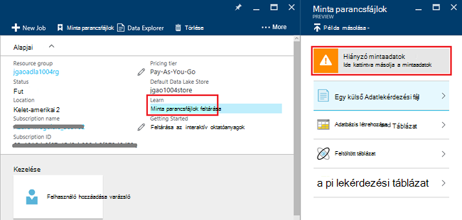
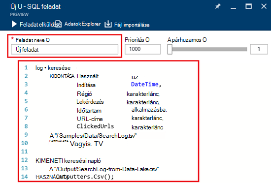
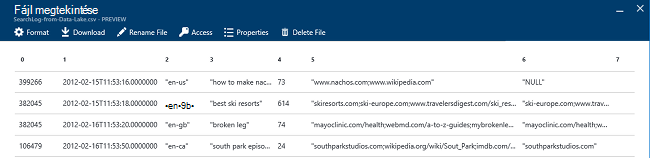

<properties 
   pageTitle="Első lépések az Azure adatok tó Analytics Azure portálon |} Azure" 
   description="Megtudhatja, hogy miként az Azure portal segítségével adatokat tó Analytics-fiók létrehozása, U – SQL használatával adatok tó Analytics feladat létrehozásához, és a feladat elküldése. " 
   services="data-lake-analytics" 
   documentationCenter="" 
   authors="edmacauley" 
   manager="jhubbard" 
   editor="cgronlun"/>
 
<tags
   ms.service="data-lake-analytics"
   ms.devlang="na"
   ms.topic="hero-article"
   ms.tgt_pltfrm="na"
   ms.workload="big-data" 
   ms.date="10/06/2016"
   ms.author="edmaca"/>

# Oktatóprogram: Azure adatok tó Analytics Azure portálon – első lépések

[AZURE.INCLUDE [get-started-selector](../../includes/data-lake-analytics-selector-get-started.md)]

Megtudhatja, hogy miként az Azure portal segítségével Azure adatok tó Analytics-fiókokat létrehozni, adatok tó Analytics feladatok meghatározása a [U-SQL nyelvben](data-lake-analytics-u-sql-get-started.md)és elküldése az adatok tó Analytics szolgáltatás feladatokat. További információt a adatok tó Analytics [Azure adatok tó Analytics áttekintése](data-lake-analytics-overview.md)című témakörben találhat.

Ebben az oktatóanyagban fejleszt, amely beolvassa a lap elválasztott értékek (TSV) fájlt, és konvertálja a vesszővel elválasztott értékek (CSV) fájl a feladat. Az azonos oktatóprogram más támogatott eszközökkel folyamatát, kattintson a lap tetején lévő ebben a szakaszban. Amikor az első feladat sikeres, megkezdheti összetettebb adatok átalakítások U – SQL írni.

##Előfeltételek

Ebben az oktatóanyagban megkezdése előtt az alábbiakat kell rendelkeznie:

- **Az Azure-előfizetés**. Lásd: [Ismerkedés az Azure ingyenes próbaverziót](https://azure.microsoft.com/pricing/free-trial/).

##Adatok tó Analytics-fiók létrehozása

Adatok tó Analytics-fiókkal kell rendelkeznie, bármilyen feladat futtatása előtt.

Minden adatok tó Analytics- [Azure tó adattár]() fiók függőség rendelkezik.  Ehhez a fiókhoz tó adattár alapértelmezett fiókként nevezik.  A tó adattár fiók hozhat létre, előre vagy az adatok tó Analytics-fiók létrehozásakor. Ebben az oktatóanyagban a tó adattár fiók hoz létre az adatok tó Analytics-fiókkal.

**Adatok tó Analytics-fiók létrehozása**

1. Bejelentkezés az [Azure-portálon](https://portal.azure.com).
2. Kattintson az **Új**kattintson a **üzletiintelligencia- + analytics**, és kattintson az **Adatok tó Analytics**.
3. Írja be vagy válassza ki a következő értékeket:

    

    - **Név**: az adatok tó Analytics-fiók neve.
    - **Előfizetés**: válassza ki a a Analytics-fiókhoz használt Azure előfizetést.
    - **Erőforráscsoport**. Jelölje be a meglévő Azure erőforráscsoport, vagy hozzon létre egy újat. Azure erőforrás-kezelő lehetővé teszi, hogy az erőforrások az alkalmazás csoportosan kezelheti. További információ az [Azure erőforrás-kezelő áttekintése](resource-group-overview.md)című témakörben találhat. 
    - **Helyét**. Jelölje ki az adatok tó Analytics-fiók a Azure adatközpont. 
    - **Tó adattár**: minden adat tó Analytics-fiók függő tó adattár fiókkal rendelkezik. Az adatok tó Analytics és a függő tó adattár számlát az azonos Azure adatközpontban kell lennie. Hajtsa végre az utasítás tó adattár új fiók létrehozása, vagy jelöljön ki egy meglévőt.

8. Kattintson a **létrehozása**gombra. Ez megjeleníti a portál kezdőképernyőjén. Új csempe megjelenik a "Telepíti az Azure adatok tó Analytics" megjelenítő címkével ellátott a StartBoard. Adatok tó Analytics-fiók létrehozása néhány percet vesz igénybe. A fiók létrehozásakor a a portálon a fiók egy új lap nyílik meg.

Egy adatok tó Analytics-fiók létrehozását követően további tó adattár és Azure tároló fiókok is hozzáadhat. Útmutatásért lásd: az [adatok tó Analytics kezelése fiók adatforrásokhoz](data-lake-analytics-manage-use-portal.md#manage-account-data-sources).

##Adatforrások adatainak előkészítése

Ebben az oktatóanyagban bizonyos keresési naplók feldolgozása.  A keresési napló dData tó tár vagy a Azure Blob-tárolóhoz tárolható. 

Az Azure portál felhasználói felületet biztosít az egyes mintaadatfájlokat másolása a tó adattár keresési naplófájlt tartalmazza az alapértelmezett fiók.

**Mintaadatok fájljai másolása**

1. Az [Azure portálon](https://portal.azure.com)nyissa meg az adatok tó Analytics-fiókját.  Lásd: hozzon létre egy újat, és a portálon nyissa meg a fiók [kezelése adatok tó Analytics-fiókokat](data-lake-analytics-get-started-portal.md#manage-accounts) .
3. Bontsa ki a **Essentials** ablakban, és kattintson a **Tallózás minta parancsfájlok**. Másik lap **Minta parancsfájlok**nevű nyílik meg.

    

4. Kattintson a **Minta hiányzó adatok** másolása, a mintaadatok fájljai. Ha elkészült, a portálon a **mintaadatokat tartalmazó frissítése sikerült**jeleníti meg.
7. Az adatok tó analytics fiók lap kattintson **Adatok Intéző** a képernyő tetején. 

    

    Két pengéit nyílik meg. **Adatok Explorer**, és a másik pedig az alapértelmezett adattár tó fiók.
8. Kattintson az alapértelmezett adattár tó fiók lap **minták** kattintva bontsa ki a mappát, és kattintson az **adatok** bontsa ki a mappát. A következő fájlokat és mappákat kell jelenik meg:

    - AmbulanceData /
    - AdsLog.tsv
    - SearchLog.tsv
    - Version.txt
    - WebLog.log
    
    Ebben az oktatóanyagban SearchLog.tsv használja.

A gyakorlatban, vagy a program az alkalmazások adatokat írjon be egy csatolt tároló fiókok vagy feltölteni az adatokat. A fájlok feltöltéséről lásd: [tó adattár adatok feltöltése](data-lake-analytics-manage-use-portal.md#upload-data-to-adls) vagy [Blob-tárolóhoz adatok feltöltése](data-lake-analytics-manage-use-portal.md#upload-data-to-wasb).

##Létrehozása és elküldése az adatok tó Analytics-feladatok

Után a forrásadatok készített, elindíthatja kidolgozása U-SQL nyelvben parancsfájl.  

**A feladat elküldése**

1. Kattintson az adatok tó analytics fiók lap a portálon, **Új feladatot**. 

    

    Ha a lap nem látható, lásd: [Nyissa meg a portálról adatok tó Analytics-fiókot](data-lake-analytics-manage-use-portal.md#access-adla-account).
2. Írja be a **Feladat nevére**, és a következő U-SQL nyelvben parancsfájl:

        @searchlog =
            EXTRACT UserId          int,
                    Start           DateTime,
                    Region          string,
                    Query           string,
                    Duration        int?,
                    Urls            string,
                    ClickedUrls     string
            FROM "/Samples/Data/SearchLog.tsv"
            USING Extractors.Tsv();
        
        OUTPUT @searchlog   
            TO "/Output/SearchLog-from-Data-Lake.csv"
        USING Outputters.Csv();

    

    A U-SQL nyelvben parancsfájl beolvassa az adatokat forrásfájl **Extractors.Tsv()**használatával, és ekkor létrehoz egy csv-fájl használatával **Outputters.Csv()**. 
    
    Ne módosítsa a két elérési útját, kivéve, ha a forrásfájl egy másik helyre másolja.  Adatok tó Analytics a kimeneti mappát hoz létre, ha még nem létezik.  Ebben az esetben azt egyszerű, relatív elérési utak használják.  
    
    Sokkal egyszerűbb a relatív elérési út az alapértelmezett adatokat tó fiókok tárolt fájlok használata. Abszolút elérési út is használhatja.  Ha például 
    
        adl://<Data LakeStorageAccountName>.azuredatalakestore.net:443/Samples/Data/SearchLog.tsv
      

    Az SQL-U, bővebben: [Azure adatok tó Analytics U – SQL nyelv használatába](data-lake-analytics-u-sql-get-started.md) és [U-SQL nyelv hivatkozás](http://go.microsoft.com/fwlink/?LinkId=691348).
     
3. Kattintson a **Feladat elküldése** tetején.   
4. Várja meg, amíg a feladat állapota **sikerült**. A feladat elvégzéséhez körülbelül egy percig láthatja.
    
    Abban az esetben, ha a feladat nem sikerült, lásd: [Monitor és problémáinak megoldása adatok tó Analytics feladatok](data-lake-analytics-monitor-and-troubleshoot-jobs-tutorial.md).

5. A lap alján kattintson a **kimeneti** fülre, és válassza a **SearchLog származó adatok Lake.csv**. Előnézete, töltse le, átnevezése és törlése a kimeneti fájl.

    

##Lásd még:

- Összetett lekérdezés talál további [elemzés webhely naplók Azure adatok tó Analytics használatával](data-lake-analytics-analyze-weblogs.md).
- Első lépésként U – SQL-alkalmazások fejlesztésével lásd: [adatok tó Tools for Visual Studio segítségével kidolgozása U – SQL-parancsfájlok](data-lake-analytics-data-lake-tools-get-started.md).
- Az SQL-U című témakörben talál [Azure adatok tó Analytics U – SQL nyelv használatába](data-lake-analytics-u-sql-get-started.md).
- Teendőkről olvassa el az [Azure adatok kezelése tó Analytics Azure portál használatával](data-lake-analytics-manage-use-portal.md)című témakört.
- Adatok tó Analytics áttekinti a [Azure adatok tó Analytics áttekintése](data-lake-analytics-overview.md)című témakörben találhat.
- Az egyéb eszközök segítségével azonos oktatóprogram megtekintéséhez kattintson a lap választók lap tetején.
- Diagnosztikai információk naplózása súgójának [elérése diagnosztikai naplók Azure adatok tó elemzéséhez](data-lake-analytics-diagnostic-logs.md)
