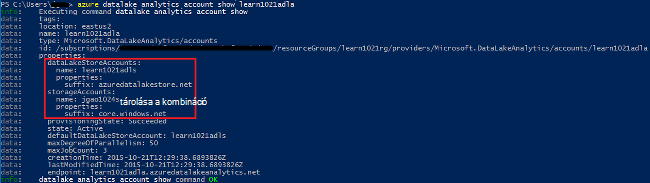
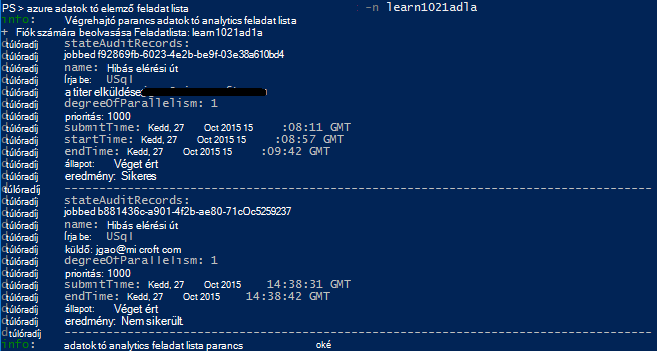

<properties 
   pageTitle="Azure adatok tó Analytics Azure parancssori felületéről kezelése |} Azure" 
   description="Útmutató: adatok tó Analytics-fiókokat, adatforrásokhoz, feladatok és Azure CLI segítségével a felhasználók kezelése" 
   services="data-lake-analytics" 
   documentationCenter="" 
   authors="edmacauley" 
   manager="jhubbard" 
   editor="cgronlun"/>
 
<tags
   ms.service="data-lake-analytics"
   ms.devlang="na"
   ms.topic="article"
   ms.tgt_pltfrm="na"
   ms.workload="big-data" 
   ms.date="05/16/2016"
   ms.author="edmaca"/>

# Azure adatok tó Analytics Azure parancssor CLI () használata kezelése

[AZURE.INCLUDE [manage-selector](../../includes/data-lake-analytics-selector-manage.md)]

Megtudhatja, hogy miként kezelheti az Azure adatok tó Analytics-fiókokat, az adatforrások, a felhasználók és a feladatok az Azure használatával. Adatkezelési témakör egyéb eszközök segítségével megtekintéséhez kattintson a fenti lapon válasszon.

**Előfeltételek**

Ebben az oktatóanyagban megkezdése előtt a következőket kell rendelkeznie:

- **Az Azure-előfizetés**. Lásd: [Ismerkedés az Azure ingyenes próbaverziót](https://azure.microsoft.com/pricing/free-trial/).
- **Azure CLI**. Lásd: [Telepítse és állítsa be az Azure CLI](../xplat-cli-install.md).
    - Letöltheti és telepítheti az **előzetes verziójú** [Azure CLI eszközök](https://github.com/MicrosoftBigData/AzureDataLake/releases) annak érdekében, hogy ez a bemutató befejezéséhez.
- **Hitelesítés**, a következő parancsot:

        azure login
    Hitelesítés, munkahelyi vagy iskolai fiókkal kapcsolatos további tudnivalókért olvassa el a [Csatlakozás az Azure CLI az Azure-előfizetésbe](../xplat-cli-connect.md).
- **Az erőforrás-kezelő Azure módban váltás**a következő parancsot:

        azure config mode arm

**A tó adattár és adatok tó Analytics parancsok megjelenítéséhez:**

    azure datalake store
    azure datalake analytics

<!-- ################################ -->
<!-- ################################ -->
## Fiókok kezelése

Mielőtt bármilyen adat tó Analytics-feladat futtatása, az adatok tó Analytics fiókkal kell rendelkeznie. Azure hdinsight szolgáltatáshoz, eltérően nem fizet a Analytics fiókjához, amikor nem fut a feladatot.  Csak az alkalommal, amikor egy projekt fut fizet.  További információ az [Azure adatok tó Analytics áttekintése](data-lake-analytics-overview.md)című témakörben találhat.  

###Fiókok létrehozása

    azure datalake analytics account create "<Data Lake Analytics Account Name>" "<Azure Location>" "<Resource Group Name>" "<Default Data Lake Account Name>"

###Fiókok frissítése

A következő parancs frissíti a tulajdonságok egy meglévő adatok tó Analytics-fiók
    
    azure datalake analytics account set "<Data Lake Analytics Account Name>"

###Partnerek lista

Lista adatainak tó Analytics-fiókokat 

    azure datalake analytics account list

Lista adatainak tó Analytics fiókok egy adott erőforrás csoporton belül

    azure datalake analytics account list -g "<Azure Resource Group Name>"

Részletek a meghatározott adatok tó Analytics-fiók

    azure datalake analytics account show -g "<Azure Resource Group Name>" -n "<Data Lake Analytics Account Name>"

###Adatok tó Analytics-fiókokat törlése

    azure datalake analytics account delete "<Data Lake Analytics Account Name>"

<!-- ################################ -->
<!-- ################################ -->
## Fiók adatforrások kezelése

Adatok tó Analytics jelenleg támogatja a következő adatforrásokhoz:

- [Azure tó adattárhoz](../data-lake-store/data-lake-store-overview.md)
- [Azure tárhely](../storage/storage-introduction.md)

Amikor létrehoz egy Analytics-fiókot, ki kell jelölnie Azure tó adattárolás fiókkal az alapértelmezett tárterület-fiók. Az alapértelmezett ADL tároló fiók feladat metaadat- és a naplókat tárolására szolgál. Miután létrehozott egy Analytics-fiókot, további tó adattárolás fiókok, illetve Azure tárterület-fiókot is hozzáadhat. 

### Keresse meg az alapértelmezett ADL tárterület-fiók

    azure datalake analytics account show "<Data Lake Analytics Account Name>"

Tulajdonságok: datalakeStoreAccount:name az érték fog megjelenni.

### Azure Blob-tároló további fiókok hozzáadása

    azure datalake analytics account datasource add -n "<Data Lake Analytics Account Name>" -b "<Azure Blob Storage Account Short Name>" -k "<Azure Storage Account Key>"

>[AZURE.NOTE] Csak Blob tároló rövid neveket támogatottak.  Ne használjon FQDN, például "myblob.blob.core.windows.net".

### További tó adattár fiókok hozzáadása

    azure datalake analytics account datasource add -n "<Data Lake Analytics Account Name>" -l "<Data Lake Store Account Name>" [-d]

[-d] egy választható kapcsoló jelzi, hogy az adatok tó hozzáadódjanak az alapértelmezett adatokat tó fiók van. 

### Létező adatforrás módosítása

Egy meglévő tó adattár-fiókot, legyen az alapértelmezett beállítása:

    azure datalake analytics account datasource set -n "<Data Lake Analytics Account Name>" -l "<Azure Data Lake Store Account Name>" -d
      
Egy meglévő Blob tároló fiókkulcs frissítése:

    azure datalake analytics account datasource set -n "<Data Lake Analytics Account Name>" -b "<Blob Storage Account Name>" -k "<New Blob Storage Account Key>"

### Adatforrások felsorolása:

    azure datalake analytics account show "<Data Lake Analytics Account Name>"
    

### Adatforrások törlése:

Tó adattár fiók törlése:

    azure datalake analytics account datasource delete "<Data Lake Analytics Account Name>" "<Azure Data Lake Store Account Name>"

Egy Blob-tároló fiók törlése:

    azure datalake analytics account datasource delete "<Data Lake Analytics Account Name>" "<Blob Storage Account Name>"

## Feladatok kezelése

Adatok tó Analytics-fiókkal kell rendelkeznie, mielőtt létrehozhat egy feladatot.  További tudnivalókért lásd: [kezelése adatok tó Analytics-fiókokat](#manage-accounts).

### Feladatok lista

    azure datalake analytics job list -n "<Data Lake Analytics Account Name>"

### Feladat részletei beszerzése

    azure datalake analytics job show -n "<Data Lake Analytics Account Name>" -j "<Job ID>"
    
### Feladatok elküldése

> [AZURE.NOTE] Egy feladat alapértelmezett érték 1000, és a párhuzamos feladat alapértelmezett fokú érték 1.

    azure datalake analytics job create  "<Data Lake Analytics Account Name>" "<Job Name>" "<Script>"

### Feladat megszakítása

A feladat azonosító, és majd a Mégse gombra a Mégse gombra a feladat keresése a lista paranccsal.

    azure datalake analytics job list -n "<Data Lake Analytics Account Name>"
    azure datalake analytics job cancel "<Data Lake Analytics Account Name>" "<Job ID>"

## Katalógus kezelése

A U-SQL nyelvben katalógus adatok és a kód felépítését, így U-SQL nyelvben parancsfájlok megosztható szolgál. A katalógus lehetővé teszi, hogy az adatokkal az Azure adatok tó lehetséges legnagyobb teljesítményét. További tudnivalókért olvassa el a [U SQL katalógus](data-lake-analytics-use-u-sql-catalog.md)című témakört.
 
###Katalógus elemek

    #List databases
    azure datalake analytics catalog list -n "<Data Lake Analytics Account Name>" -t database

    #List tables
    azure datalake analytics catalog list -n "<Data Lake Analytics Account Name>" -t table
    
A típusok adatbázis, séma, összeállítási, külső adatforráshoz, tábla, táblafüggvény értékelni, vagy tábla statisztika tartalmazzák.

###Titkos katalógus létrehozása

    azure datalake analytics catalog secret create -n "<Data Lake Analytics Account Name>" <databaseName> <hostUri> <secretName>

### Katalógus titkos kulcs módosítása

    azure datalake analytics catalog secret set -n "<Data Lake Analytics Account Name>" <databaseName> <hostUri> <secretName>

###Katalógus titkos törlése

    azure datalake analytics catalog secrete delete -n "<Data Lake Analytics Account Name>" <databaseName> <hostUri> <secretName>

<!-- ################################ -->
<!-- ################################ -->
## ARM-csoportok használata

Alkalmazások általában épülnek fel sok összetevőjét, például egy webalkalmazás, adatbázis, adatbázis-kiszolgáló, tárolási és 3 külső szolgáltatásokra. Azure erőforrás-kezelő (ARM) lehetővé teszi az erőforrások csoportként az Azure erőforráscsoport néven az alkalmazás használata. Telepítése, frissítése, figyelésére vagy törlése az összes erőforrás egyetlen, összehangolt műveletben az alkalmazás. Telepítés olyan sablont használ, és a sablonon használhatja például vizsgálat, átmeneti és üzemi különböző környezetekben. Egyértelművé teheti számlázási a szervezet megtekintésével, a teljes csoporton az összegzett költségét. További információ az [Azure erőforrás-kezelő áttekintése](../azure-resource-manager/resource-group-overview.md)című témakörben találhat. 

Adatok tó Analytics szolgáltatás az alábbi összetevőket a következők lehetnek:

- Azure adatok tó Analytics-fiók
- Szükséges alapértelmezett tó adattárolás Azure-fiók
- Azure-adatok tó további tárterület fiókok
- További tárterület Azure-fiókok

Létrehozhat egy ARM csoportban, hogy könnyebben kezelhető az összetevők.

Az azonos Azure adatközpontban egy adatok tó Analytics-fiók és az függő tároló fiókok kell mutatnia.
A ARM csoport azonban is található egy másik adatközpont.  

##Lásd még: 

- [Microsoft Azure adatok tó Analytics áttekintése](data-lake-analytics-overview.md)
- [Első lépések az adatok tó Analytics Azure portál használatával](data-lake-analytics-get-started-portal.md)
- [Azure adatok tó Analytics Azure portálon kezelése](data-lake-analytics-manage-use-portal.md)
- [Figyelésére és Azure portálon Azure adatok tó Analytics feladatok hibaelhárítása](data-lake-analytics-monitor-and-troubleshoot-jobs-tutorial.md)

