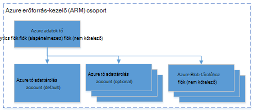

<properties 
   pageTitle="Azure adatok tó Analytics Azure .NET SDK használatával kezelése |} Azure" 
   description="Útmutató: adatok tó Analytics-feladatok, az adatforrások, a felhasználók kezelése " 
   services="data-lake-analytics" 
   documentationCenter="" 
   authors="mumian" 
   manager="jhubbard" 
   editor="cgronlun"/>
 
<tags
   ms.service="data-lake-analytics"
   ms.devlang="na"
   ms.topic="article"
   ms.tgt_pltfrm="na"
   ms.workload="big-data" 
   ms.date="09/23/2016"
   ms.author="jgao"/>

# Azure adatok tó Analytics Azure .NET SDK használatával kezelése

[AZURE.INCLUDE [manage-selector](../../includes/data-lake-analytics-selector-manage.md)]

Megtudhatja, hogy miként kezelheti az Azure adatok tó Analytics-fiókokat, az adatforrások, a felhasználók és a feladatok az Azure .NET SDK használatával. Egyéb eszközök segítségével management témakörök megtekintéséhez kattintson a fenti lapon válasszon.

**Előfeltételek**

Ebben az oktatóanyagban megkezdése előtt a következőket kell rendelkeznie:

- **Az Azure-előfizetés**. Lásd: [Ismerkedés az Azure ingyenes próbaverziót](https://azure.microsoft.com/pricing/free-trial/).

<!-- ################################ -->
<!-- ################################ -->

## Azure adatok tó Analytics csatlakoztatása

A következő Nuget csomagokban lesz szüksége:

    Install-Package Microsoft.Rest.ClientRuntime.Azure.Authentication -Pre
    Install-Package Microsoft.Azure.Common 
    Install-Package Microsoft.Azure.Management.ResourceManager -Pre
    Install-Package Microsoft.Azure.Management.DataLake.Analytics -Pre

A következő kódot példa bemutatja, hogyan Azure csatlakozás és a meglévő adatok tó Analytics fiókok csoportban az Azure előfizetés listája.

    using System;
    using System.Collections.Generic;
    using System.Threading;

    using Microsoft.Rest;
    using Microsoft.Rest.Azure.Authentication;

    using Microsoft.Azure.Management.ResourceManager;
    using Microsoft.Azure.Management.DataLake.Store;
    using Microsoft.Azure.Management.DataLake.Analytics;
    using Microsoft.Azure.Management.DataLake.Analytics.Models;

    namespace ConsoleAcplication1
    {
        class Program
        {

            private const string SUBSCRIPTIONID = "<Enter Your Azure Subscription ID>";
            private const string CLIENTID = "1950a258-227b-4e31-a9cf-717495945fc2";
            private const string DOMAINNAME = "common"; // Replace this string with the user's Azure Active Directory tenant ID or domain name, if needed.

            private static DataLakeAnalyticsAccountManagementClient _adlaClient;

            private static void Main(string[] args)
            {

                var creds = AuthenticateAzure(DOMAINNAME, CLIENTID);

                _adlaClient = new DataLakeAnalyticsAccountManagementClient(creds);
                _adlaClient.SubscriptionId = SUBSCRIPTIONID;

                var adlaAccounts = ListADLAAccounts();

                Console.WriteLine("You have %i Data Lake Analytics account(s).", adlaAccounts.Count);
                for (int i = 0; i < adlaAccounts.Count; i ++)
                {
                    Console.WriteLine(adlaAccounts[i].Name);
                }

                System.Console.WriteLine("Press ENTER to continue");
                System.Console.ReadLine();
            }

            public static ServiceClientCredentials AuthenticateAzure(
            string domainName,
            string nativeClientAppCLIENTID)
            {
                // User login via interactive popup
                SynchronizationContext.SetSynchronizationContext(new SynchronizationContext());
                // Use the client ID of an existing AAD "Native Client" application.
                var activeDirectoryClientSettings = ActiveDirectoryClientSettings.UsePromptOnly(nativeClientAppCLIENTID, new Uri("urn:ietf:wg:oauth:2.0:oob"));
                return UserTokenProvider.LoginWithPromptAsync(domainName, activeDirectoryClientSettings).Result;
            }

            public static List<DataLakeAnalyticsAccount> ListADLAAccounts()
            {
                var response = _adlaClient.Account.List();
                var accounts = new List<DataLakeAnalyticsAccount>(response);

                while (response.NextPageLink != null)
                {
                    response = _adlaClient.Account.ListNext(response.NextPageLink);
                    accounts.AddRange(response);
                }

                return accounts;
            }
        }
    }

## Fiókok kezelése

Mielőtt bármilyen adat tó Analytics-feladat futtatása, az adatok tó Analytics fiókkal kell rendelkeznie. Azure hdinsight szolgáltatáshoz, eltérően nem fizet a Analytics fiókjához, amikor nem fut a feladatot.  Csak az alkalommal, amikor egy projekt fut fizet.  További információ az [Azure adatok tó Analytics áttekintése](data-lake-analytics-overview.md)című témakörben találhat.  

###Fiókok létrehozása

Az Azure az erőforrás-kezelés csoport és tó adattár fiókkal kell rendelkeznie, az alábbi példa futtatása előtt.

A következő kódot megtudhatja, hogy miként erőforráscsoport létrehozása:

    public static async Task<ResourceGroup> CreateResourceGroupAsync(
        ServiceClientCredentials credential,
        string groupName,
        string subscriptionId,
        string location)
    {

        Console.WriteLine("Creating the resource group...");
        var resourceManagementClient = new ResourceManagementClient(credential)
        { SubscriptionId = subscriptionId };
        var resourceGroup = new ResourceGroup { Location = location };
        return await resourceManagementClient.ResourceGroups.CreateOrUpdateAsync(groupName, resourceGroup);
    }

A következő kódrészlet szemlélteti, hogyan lehet tó adattár fiók létrehozása:

    var adlsParameters = new DataLakeStoreAccount(location: _location);
    _adlsClient.Account.Create(_resourceGroupName, _adlsAccountName, adlsParameters);

A következő kódot megtudhatja, hogy miként adatok tó Analytics-fiók létrehozása:

    var defaultAdlsAccount = new List<DataLakeStoreAccountInfo> { new DataLakeStoreAccountInfo(adlsAccountName, new DataLakeStoreAccountInfoProperties()) };
    var adlaProperties = new DataLakeAnalyticsAccountProperties(defaultDataLakeStoreAccount: adlsAccountName, dataLakeStoreAccounts: defaultAdlsAccount);
    var adlaParameters = new DataLakeAnalyticsAccount(properties: adlaProperties, location: location);
    var adlaAccount = _adlaClient.Account.Create(resourceGroupName, adlaAccountName, adlaParameters);

###Partnerek lista

Lásd: [Azure adatok tó Analytics csatlakozni](#connect_to_azure_data_lake_analytics).

###Keresse meg a fiók

Ha már sikerült adatok tó Analytics-fiókokat listájának objektum, keresse meg a fiók használhatja a következő:

    Predicate<DataLakeAnalyticsAccount> accountFinder = (DataLakeAnalyticsAccount a) => { return a.Name == adlaAccountName; };
    var myAdlaAccount = adlaAccounts.Find(accountFinder);

###Adatok tó Analytics-fiókokat törlése

A következő kódrészletet töröl egy adatok tó Analytics-fiókkal:

    _adlaClient.Account.Delete(resourceGroupName, adlaAccountName);

<!-- ################################ -->
<!-- ################################ -->
## Fiók adatforrások kezelése

Adatok tó Analytics jelenleg támogatja a következő adatforrásokhoz:

- [Azure tó adattárolás](../data-lake-store/data-lake-store-overview.md)
- [Azure tárhely](../storage/storage-introduction.md)

Amikor létrehoz egy Analytics-fiókot, ki kell jelölnie Azure tó adattárolás fiókkal az alapértelmezett tárterület-fiók. Az alapértelmezett adattár tó fiók feladat-metaadatok és a feladat naplókat tárolására szolgál. Miután létrehozott egy Analytics-fiókot, további tó adattárolás fiókok, illetve Azure tárterület-fiókot is hozzáadhat. 

### Keresse meg az alapértelmezett adattár tó fiók

Lásd: a Keresés a jelen cikkben fiók keresése az adatok tó Analytics-fiókot. Ezután felhasználhatja a következőket:

    string adlaDefaultDataLakeStoreAccountName = myAccount.Properties.DefaultDataLakeStoreAccount;

## Erőforrás-kezelő Azure csoportok használata

Alkalmazások általában épülnek fel sok összetevőjét, például egy webalkalmazás, adatbázis, adatbázis-kiszolgáló, tárolási és 3 külső szolgáltatásokra. Azure erőforrás-kezelő lehetővé teszi az erőforrások csoportként az Azure erőforráscsoport néven az alkalmazás használata. Telepítése, frissítése, figyelésére vagy törlése az összes erőforrás egyetlen, összehangolt műveletben az alkalmazás. Telepítés olyan sablont használ, és a sablonon használhatja például vizsgálatára, előkészítése és munkakörnyezeti különböző környezetekben. Egyértelművé teheti számlázási a szervezet megtekintésével, a teljes csoporton az összegzett költségét. További információ az [Azure erőforrás-kezelő áttekintése](../azure-resource-manager/resource-group-overview.md)című témakörben találhat. 

Adatok tó Analytics szolgáltatás az alábbi összetevőket a következők lehetnek:

- Azure adatok tó Analytics-fiók
- Szükséges alapértelmezett tó adattárolás Azure-fiók
- Azure-adatok tó további tárterület fiókok
- További tárterület Azure-fiókok

Létrehozhat egy erőforrás-kezelés csoport könnyebb kezelése csoportban az összetevők.

Az azonos Azure adatközpontban egy adatok tó Analytics-fiók és az függő tároló fiókok kell mutatnia.
Az erőforrás-kezelés csoport azonban is található egy másik adatközpont.  

##Lásd még: 

- [Microsoft Azure adatok tó Analytics áttekintése](data-lake-analytics-overview.md)
- [Első lépések az adatok tó Analytics Azure portál használatával](data-lake-analytics-get-started-portal.md)
- [Azure adatok tó Analytics Azure portálon kezelése](data-lake-analytics-manage-use-portal.md)
- [Figyelésére és Azure portálon Azure adatok tó Analytics feladatok hibaelhárítása](data-lake-analytics-monitor-and-troubleshoot-jobs-tutorial.md)

