<properties 
   pageTitle="Azure adatok tó Analytics az Azure portálon kezelheti |} Azure" 
   description="Útmutató: adatok tó elemző könyvvitelének, adatforrásokhoz, a felhasználók és feladatok kezelése" 
   services="data-lake-analytics" 
   documentationCenter="" 
   authors="edmacauley" 
   manager="jhubbard" 
   editor="cgronlun"/>
 
<tags
   ms.service="data-lake-analytics"
   ms.devlang="na"
   ms.topic="article"
   ms.tgt_pltfrm="na"
   ms.workload="big-data" 
   ms.date="10/06/2016"
   ms.author="edmaca"/>

# Azure adatok tó Analytics Azure portálon kezelése

[AZURE.INCLUDE [manage-selector](../../includes/data-lake-analytics-selector-manage.md)]

Megtudhatja, hogy miként kezelheti az Azure adatok tó Analytics-fiókokat, a fiók adatforrásokhoz, a felhasználók és a feladatok az Azure portálon. Egyéb eszközök segítségével management témakörök megtekintéséhez kattintson a lap tetején lévő tabulátorválasztó.

**Előfeltételek**

Ebben az oktatóanyagban megkezdése előtt az alábbiakat kell rendelkeznie:

- **Az Azure-előfizetés**. Lásd: [Ismerkedés az Azure ingyenes próbaverziót](https://azure.microsoft.com/pricing/free-trial/).

<!-- ################################ -->
<!-- ################################ -->
## Fiókok kezelése

Mielőtt bármilyen adat tó Analytics-feladat futtatása, az adatok tó Analytics fiókkal kell rendelkeznie. Azure hdinsight szolgáltatáshoz, eltérően csak fizet adatok tó Analytics-fiók a feladat futtatásakor.  Csak a alkalommal, amikor egy projekt fut fizet.  További információ az [Azure adatok tó Analytics áttekintése](data-lake-analytics-overview.md)című témakörben találhat.  

**Adatok tó Analytics-fiók létrehozása**

1. Bejelentkezés az [Azure-portálon](https://portal.azure.com).
2. Kattintson az **Új**kattintson a **üzletiintelligencia- + analytics**, és kattintson az **Adatok tó Analytics**.
3. Írja be vagy válassza ki a következő értékeket:

    

    - **Név**: az adatok tó elemző fiók neve.
    - **Előfizetés**: válassza ki a a Analytics-fiókhoz használt Azure előfizetést.
    - **Erőforráscsoport**. Jelölje be a meglévő Azure erőforráscsoport, vagy hozzon létre egy újat. Azure erőforrás-kezelő lehetővé teszi, hogy az erőforrások az alkalmazás csoportosan kezelheti. További információ az [Azure erőforrás-kezelő áttekintése](resource-group-overview.md)című témakörben találhat. 
    - **Helyét**. Jelölje ki az adatok tó Analytics-fiók a Azure adatközpont. 
    - **Tó adattár**: minden adat tó Analytics-fiók függő tó adattár fiókkal rendelkezik. Az adatok tó Analytics és a függő tó adattár számlát az azonos Azure adatközpontban kell lennie. Hajtsa végre az utasítás tó adattár új fiók létrehozása, vagy jelöljön ki egy meglévőt.

8. Kattintson a **létrehozása**gombra. Ez megjeleníti a portál kezdőképernyőjén. Új csempe megjelenik a "Telepíti az Azure adatok tó Analytics" megjelenítő címkével ellátott a StartBoard. Adatok tó Analytics-fiók létrehozása néhány percet vesz igénybe. A fiók létrehozásakor a a portálon a fiók egy új lap nyílik meg.

Egy adatok tó Analytics-fiók létrehozását követően további tó adattár és Azure tároló fiókok is hozzáadhat. Útmutatásért lásd: az [adatok tó Analytics kezelése fiók adatforrásokhoz](data-lake-analytics-manage-use-portal.md#manage-account-data-sources).

**Az access/megnyitása egy adatok tó Analytics-fiókkal**

1. Bejelentkezés az [Azure-portálon](https://portal.azure.com/).
2. Kattintson az **Adatok tó elemző** a bal oldali menüben.  Ha nem látható, kattintson a **További szolgáltatások**, és kattintson **Adatok tó Analytics** **üzletiintelligencia**-n és Analytics.
3. Kattintson a használni kívánt adatok tó Analytics-fiókra. A fiók egy új lap jelenik meg.

**Adatok tó Analytics fiók törlése**

1. Nyissa meg a törölni kívánt adatok tó Analytics fiókot. Útmutatásért lásd: [Access-adatok tó Analytics-fiókokat](#access-adla-account).
2. A lap tetején lévő gomb menüjében kattintson a **Törlés** gombra.
3. Írja be a fiók nevét, és kattintson a **Törlés**gombra.

Egy adatok tó Analytics-fiók törlése a függő tó adattár-fiókok nem törli. A tó adattárolás fiókok törlése című témakör nyújt tájékoztatást [Törlés tó adattár fiók](data-lake-store-get-started-portal.md#delete-azure-data-lake-store-account).

<!-- ################################ -->
<!-- ################################ -->
## Fiók adatforrások kezelése

Adatok tó Analytics jelenleg támogatja a következő adatforrásokhoz:

- [Azure tó adattárhoz](../data-lake-store/data-lake-store-overview.md)
- [Azure tárhely](../storage/storage-introduction.md)

Amikor létrehoz egy adatok tó Analytics-fiókkal, ki kell jelölnie Azure tó adattár fiókkal az alapértelmezett tárterület-fiókot. Az alapértelmezett adattár tó fiók feladat metaadat- és a naplókat tárolására szolgál. Miután létrehozott egy adatok tó Analytics-fiókkal, további tó adattár fiókok, illetve Azure tárterület-fiókot is hozzáadhat. 

**Az alapértelmezett adatokat tó tároló fiók keresése**

- Nyissa meg a használni kívánt adatok tó Analytics-fiókot. Útmutatásért lásd: [Access-adatok tó Analytics-fiókokat](#access-adla-account). Az alapértelmezett adatokat tó tároló az **alapvető**jelennek meg:

    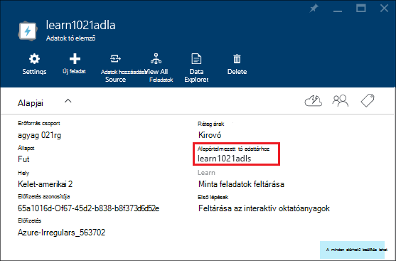

**További adatforrásokhoz hozzáadása**

1. Nyissa meg a használni kívánt adatok tó elemző fiókot. Útmutatásért lásd: [Access-adatok tó elemző fiókok](#access-adla-account).
2. Kattintson a **Beállítások** gombra, és kattintson az **Adatforrások**. Az alapértelmezett adattár tó fiók szerepel ott gondoskodik. 
3. Kattintson az **adatforrás hozzáadása**.

    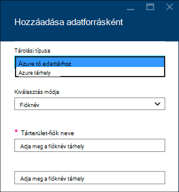

    Azure tó adattár fiók hozzáadásához szüksége van a fiók nevét, és azt a lekérdezés access tudja a fiókot.
    Az Azure Blob-tárolóhoz, szeretne felvenni a tárterület-fiók és a navigálással, a tárterület-fiókjába a portálon található fiókkulcs.

**Adatforrások feltárása**  

1. Nyissa meg a használni kívánt Analytics-fiókot. Útmutatásért lásd: [Access-adatok tó elemző fiókok](#access-adla-account).
2. Kattintson a **Beállítások** gombra, és kattintson az **Adatok Explorer**. 
 
    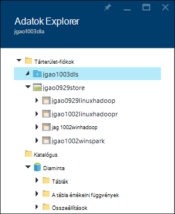
    
3. Egy tó adattár fiók elemre kattintva nyissa meg a fiókot.

    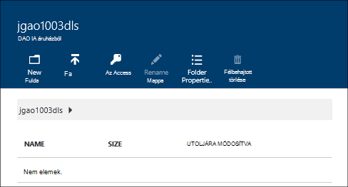
    
    Az összes tó adattár-fiókhoz is
    
    - **Új mappa**: Adja hozzá az új mappát.
    - **Töltse fel**: a tárterület-fiókot a munkaállomásról fájlokat feltölteni.
    - **Az Access**: konfigurálása a hozzáférési engedélyek.
    - **Mappa átnevezése**: nevezze át a mappát.
    - **Mappa tulajdonságai**: fájl vagy mappa tulajdonságainak megjelenítése, például WASB elérési útját, WEBHDFS elérési út utolsó módosítás és így tovább.
    - **Mappa törlése**: törli egy mappát.

**Tó adattár-fiókjába a fájlok feltöltése**

1. A portálról a bal oldali menüben kattintson a **Tallózás** gombra, és kattintson az **Adatok tó áruházból**.
2. Kattintson a tó adattár fiókra, amely fel szeretné tölteni az adatokat. Az alapértelmezett tó adattárolás fiókot, olvassa el [az alábbi](#default-adl-account).
3. A felső menüben kattintson az **Adatok Explorer** .
4. Kattintson az **Új könyvtár** hozzon létre egy új mappát, vagy kattintson a mappa nevét módosíthatja a mappa.
6. Fájl feltöltése a felső menüben kattintson a **Feltöltés** elemre.

**Azure Blob-tároló fiókjába a fájlok feltöltése**

Lásd: az [adatok HDInsight Hadoop feladatok feltöltése](../hdinsight/hdinsight-upload-data.md).  Az adatok adatok tó Analytics vonatkozik.

## Felhasználókezelés

Adatok tó Analytics szerepköralapú hozzáférés-vezérlés Azure Active Directory használja. Amikor létrehoz egy adatok tó Analytics-fiókkal, a "Előfizetés rendszergazdák" szerepkör bekerül a fiók. Felveheti a többi felhasználó és a biztonsági csoportok a következő szerepkörök:

|Szerepkör|Leírás|
|----|-----------|
|Tulajdonos|Adhatja meg a szolgáltatás, beleértve az erőforrásokhoz kezelése.|
|Közös munka|Elérheti a portált; Űrlapadatok elküldése és figyelheti a feladatokat. Feladatok küldhetik engedélyezni munkatársi olvasási és írási engedélye arra, hogy az adatok tó áruházból fiókok igényeknek megfelelően.|
|DataLakeAnalyticsDeveloper | Elküldése, figyelésére és feladat megszakítása.  Ezek a felhasználók csak a saját feladatok mondhatja. Azok nem a saját fiók kezelése, például vehet fel felhasználókat, engedélyek módosítása vagy törlése a fiók. Feladatok futtatásához engedélyezni szükségük van olvasási vagy az adatok tó áruházból fiókok írási hozzáféréssel     | 
|A képernyőolvasók|Lehetővé teszi, hogy minden megtekintheti, de nem bármilyen módosítást.|  
|DevTest Labs felhasználói|Lehetővé teszi a mindent jeleníthet meg és csatlakozás a Kezdés, újraindítása és leállítás virtuális gépeken futó.|  
|Felhasználói hozzáférés-rendszergazda|Segítségével Azure erőforrások felhasználó hozzáférését kezelheti.|  

Azure Active Directory-felhasználók és a biztonsági csoportok létrehozásával kapcsolatos további tudnivalókért olvassa el a [Mi az Azure Active Directory](../active-directory/active-directory-whatis.md)című témakört.

**Felhasználó vagy biztonsági csoportokat hozzáadása egy adatok tó Analytics-fiókhoz**

1. Nyissa meg a használni kívánt Analytics-fiókot. Útmutatásért lásd: [Access-adatok tó Analytics-fiókokat](#access-adla-account).
2. Kattintson a **Beállítások**gombra, és kattintson a **felhasználók**. Választhatja a **hozzáférést** a címsoron **Essentials** az alábbi képernyőképen látható módon:

    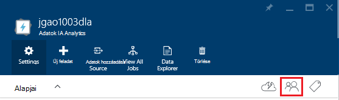
3. A **felhasználó** a lap kattintson a **Hozzáadás**elemre.
4. Jelölje ki azt a szerepkört, és vegye fel a felhasználót, és kattintson **az OK**gombra.

**Megjegyzés: Ha a felhasználó vagy biztonsági csoport küldhetnek feladatokat, szükségük engedélyt kell adni, valamint adatokat tó áruházból. További tudnivalókért lásd: [adatok tó tárban tárolt biztonságos adatok](../data-lake-store/data-lake-store-secure-data.md).**

<!-- ################################ -->
<!-- ################################ -->
## Feladatok kezelése

Adatok tó Analytics-fiókkal kell rendelkeznie, bármilyen U-SQL nyelvben feladat futtatása előtt.  További tudnivalókért lásd: [kezelése adatok tó Analytics-fiókokat](#manage-data-lake-analytics-accounts).

**Feladat létrehozásához**

1. Nyissa meg a használni kívánt Analytics-fiókot. Útmutatásért lásd: [Access-adatok tó Analytics-fiókokat](#access-adla-account).
2. Kattintson az **Új feladat**gombra.

    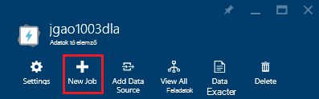

    Kell egy hasonló új lap jelenik meg:

    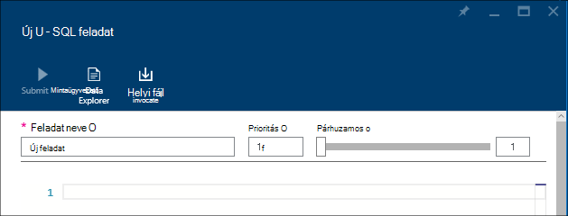

    Minden feladat végrehajtását konfigurálása

  	|név|Leírás|
  	|----|-----------|
  	|Feladat neve|Írja be a feladat nevét.|
  	|Prioritás|Kisebb értéket prioritása magasabb. Ha két feladat mindkét aszinkron, egyikőjük egy kisebb prioritás először fut.|
  	|Párhuzamos |Számítási folyamatokat, amely akkor fordulhat elő, egy időben maximális száma. A szám növelésével javíthatja a teljesítményt, de megnövelhetik költség.|
  	|Parancsfájl|Írja be a U-SQL nyelvben parancsfájl a feladatot.|

    A azonos felületén is a hivatkozás adatforrások feltárása, és további fájlok hozzáadása a csatolt adatforrás. 
3. Ha el szeretné küldeni a feladatot, kattintson a **Feladat elküldése** gombra.

**A feladat elküldése**

Lásd: az [adatok tó Analytics létrehozása feladatok](#create-job).

**Lync-feladatok**

1. Nyissa meg a használni kívánt Analytics-fiókot. Útmutatásért lásd: [Access-adatok tó Analytics-fiókokat](#access-adla-account). A feladatkezelés panelen az egyszerű feladat információkat jeleníti meg:

    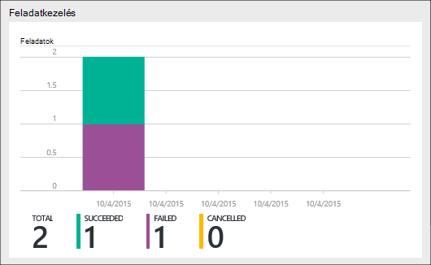

3. **Feladatkezelés** kattintson az előző képernyőképen látható módon.

    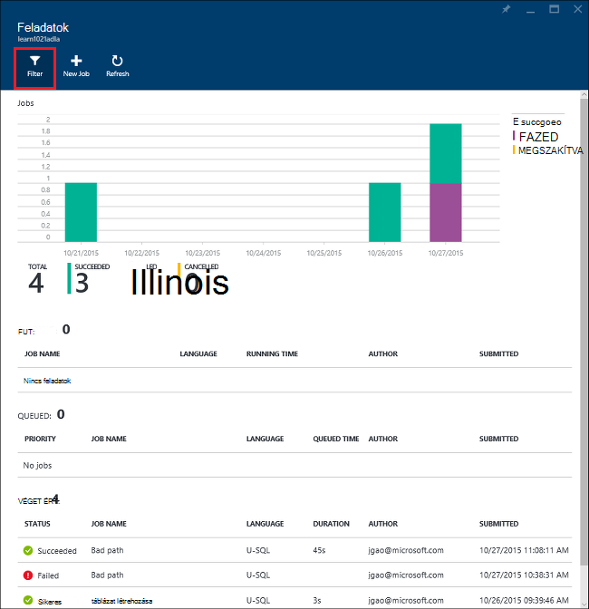

4. Kattintson a feladatok listájából. Vagy kattintson a **szűrő** segítségével megkeresheti azokat a feladatokat:

    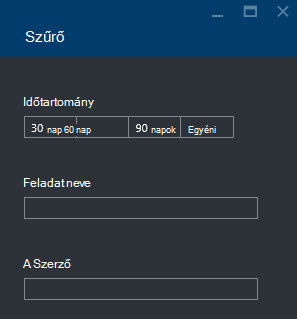

    Feladatok **Időtartomány**, a **Projekt neve**és a **Szerző**szerint is szűrheti.
5. Ha a feladat újraküldése szeretne, kattintson a **küldje el újra** .

**A feladat megismétlése**

Lásd: a [Monitor adatok tó Analytics feladatok](#monitor-jobs).

##Fiók használat figyelése

**Lync-fiók használata**

1. Nyissa meg a használni kívánt Analytics-fiókot. Útmutatásért lásd: [Access-adatok tó Analytics-fiókokat](#access-adla-account). A használati panelen a használatát mutatja be.

    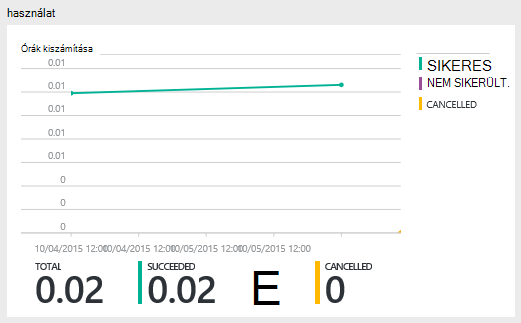

2. Kattintson duplán a ablaktábla kapcsolatban további részletekre kíváncsi.

##Az SQL-U katalógus megtekintése

A [katalógus U-SQL nyelvben](data-lake-analytics-use-u-sql-catalog.md) adatok és a kód felépítését, így U-SQL nyelvben parancsfájlok megosztható szolgál. A katalógus lehetővé teszi, hogy az adatokkal az Azure adatok tó lehetséges legnagyobb teljesítményét. Az Azure portálról Ön tudni megtekinteni a katalógus U-SQL nyelvben.

**Az SQL-U katalógus böngészése**

1. Nyissa meg a használni kívánt Analytics-fiókot. Útmutatásért lásd: [Access-adatok tó Analytics-fiókokat](#access-adla-account).
2. A felső menüben kattintson az **Adatok Explorer** .
3. Bontsa ki a **katalógus**, bontsa ki a **fő**, **táblákat, vagy **értékelni Táblázatfüggvények**, vagy **összeállítások **. Az alábbi képernyőképen látható egy táblázat értékelni függvény.

    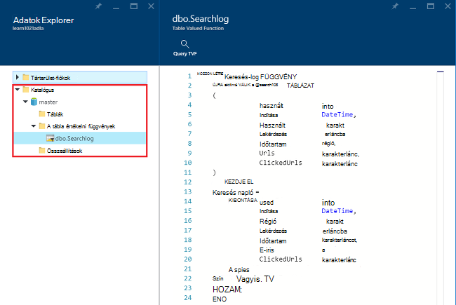

<!-- ################################ -->
<!-- ################################ -->
## Erőforrás-kezelő Azure csoportok használata

Alkalmazások általában épülnek fel sok összetevőjét, például egy webalkalmazás, adatbázis, adatbázis-kiszolgáló, tárolási és külső szolgáltatásokra támaszkodik. Azure erőforrás-kezelő lehetővé teszi az erőforrások csoportként az Azure erőforráscsoport néven az alkalmazás használata. Telepítése, frissítése, figyelésére vagy összes erőforrás törlése egyetlen, összehangolt műveletben az alkalmazás. Telepítés olyan sablont használ, és a sablonon használhatja például tesztjét, átmeneti, és a különböző környezetekben. Egyértelművé teheti számlázási a szervezet megtekintésével, a teljes csoporton az összegzett költségét. További információ az [Azure erőforrás-kezelő áttekintése](../azure-resource-manager/resource-group-overview.md)című témakörben találhat. 

Adatok tó Analytics szolgáltatás az alábbi összetevőket a következők lehetnek:

- Azure adatok tó Analytics-fiók
- Szükséges alapértelmezett tó adattár Azure-fiók
- További Azure adattár tó fiókok
- További tárterület Azure-fiókok

Létrehozhat egy erőforrás-kezelés csoport könnyebb kezelése csoportban az összetevők.

Az azonos Azure adatközpontban egy adatok tó Analytics-fiók és az függő tároló fiókok kell mutatnia.
Az erőforrás-kezelés csoport azonban is található egy másik adatközpont.  

##Lásd még: 

- [Microsoft Azure adatok tó Analytics áttekintése](data-lake-analytics-overview.md)
- [Első lépések az adatok tó Analytics Azure portál használatával](data-lake-analytics-get-started-portal.md)
- [Azure adatok tó elemző Azure PowerShell használatával kezelése](data-lake-analytics-manage-use-powershell.md)
- [Figyelésére és Azure portálon Azure adatok tó Analytics feladatok hibaelhárítása](data-lake-analytics-monitor-and-troubleshoot-jobs-tutorial.md)

