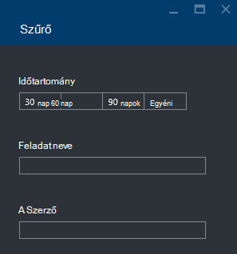

<properties 
   pageTitle="Azure portálon Azure adatok tó Analytics feladatok hibaelhárítása |} Azure" 
   description="Útmutató: adatok tó Analytics feladatok hibaelhárítása az Azure Portal segítségével. " 
   services="data-lake-analytics" 
   documentationCenter="" 
   authors="edmacauley" 
   manager="jhubbard" 
   editor="cgronlun"/>
 
<tags
   ms.service="data-lake-analytics"
   ms.devlang="na"
   ms.topic="article"
   ms.tgt_pltfrm="na"
   ms.workload="big-data" 
   ms.date="05/16/2016"
   ms.author="edmaca"/>

# Azure portálon Azure adatok tó Analytics feladatok hibaelhárítása

Útmutató: adatok tó Analytics feladatok hibaelhárítása az Azure Portal segítségével.

Ebben az oktatóanyagban használni telepítési forrás fájl hiányzik probléma, és az Azure-portálon használja a probléma elhárításához.

**Előfeltételek**

Ebben az oktatóanyagban megkezdése előtt a következőket kell rendelkeznie:

- Az **adatok tó Analytics alapismeretei feladat folyamat**. Lásd: az [első lépések az Azure adatok tó Analytics Azure-portálon](data-lake-analytics-get-started-portal.md).
- **A adatok tó Analytics-fiókot**. Lásd: az [első lépések az Azure adatok tó Analytics Azure-portálon](data-lake-analytics-get-started-portal.md#create-adl-analytics-account).
- **Másolja a vágólapra mintaadatokat az alapértelmezett adattár tó fiókba**.  Lásd: az [Előkészítés forrásadatok](data-lake-analytics-get-started-portal.md#prepare-source-data)

##Adatok tó Analytics feladat elküldése

Most már hibás forrás fájlnévvel U-SQL nyelvben feladat hoz létre.  

**A feladat elküldése**

1. Az Azure portál bal felső sarokban kattintson **A Microsoft Azure** .
2. Kattintson a mozaik az adatok tó Analytics-fiókja nevét.  Ez volt a kiemelt Itt a fiók létrehozásakor.
Ha a számla kitűzi nem létezik, nézze meg [Analytics fiók portálon nyissa meg](data-lake-analytics-manage-use-portal.md#access-adla-account).
3. A felső menüben kattintson az **Új feladat** .
4. Írja be a feladat nevét, és a következő U-SQL nyelvben parancsfájl:

        @searchlog =
            EXTRACT UserId          int,
                    Start           DateTime,
                    Region          string,
                    Query           string,
                    Duration        int?,
                    Urls            string,
                    ClickedUrls     string
            FROM "/Samples/Data/SearchLog.tsv1"
            USING Extractors.Tsv();
        
        OUTPUT @searchlog   
            TO "/output/SearchLog-from-adls.csv"
        USING Outputters.Csv();

    A forrásfájl a parancsfájl definiált **/Samples/Data/SearchLog.tsv1**, ahol **/Samples/Data/SearchLog.tsv**kell.
     
5. Kattintson a **Feladat elküldése** tetején. Ekkor megnyílik egy új feladat ablaktáblában. A címsoron mutatja a feladat állapota. A befejezéshez néhány percet vesz igénybe. **Frissítse** a legújabb állapotának kattinthat.
6. Várja meg, amíg a feladat állapota **nem sikerült**.  Ha a feladat **sikerült**, van, mert nem eltávolít a /Samples mappát. **Előzetesen szükséges** című az oktatóprogram elején.

Felmerülhet - Miért tart olyan sokáig egy kis projektre vonatkozóan.  Ne feledje, hogy adatokat tó Analytics lett tervezve nagy adatfeldolgozás.  Az adatoknak a elosztott rendszer nagy mennyiségű feldolgozása közben azt helyezi.

Vegyük feltételezik, hogy küldte el a feladatot, és zárja be a portálon.  A következő szakaszban megtanulhatja hibáinak elhárítása a feladatot.

## A feladat – problémamegoldás

Utolsó szakaszban elküldött egy feladatot, és a feladat sikertelen volt.  

**Az összes a feladatok megtekintéséhez**

1. Az Azure portál bal felső sarokban kattintson **A Microsoft Azure** .
2. Kattintson a mozaik az adatok tó Analytics-fiókja nevét.  A projekt összefoglaló jelenik meg a **Feladatok kezelése** hivatkozásra.

    
    
    A feladat kezelése áttekintést ad a projekt állapotáról. Figyelje tartozik egy sikertelen feladatot.
   
3. Kattintson a feladatok megtekintéséhez a **Feladatkezelés** csempére. A feladatok kategóriába **fut**, **várólistás**és **Befejezve**. A sikertelen feladat **Befejezve** szakaszában gondoskodik. A lista első szakasz kell lennie. Ha sok feladatot, kattintson a **szűrő** segítségével megkeresheti a feladatokat.

    

4. Kattintson a projekt adatait egy új lap megnyitása a listából a sikertelen feladatot:

    
    
    Figyelje meg a **küldje el újra** gombra. Miután a hiba elhárításához újraküldése a a feladatot.

5. Kattintson az előző képe nyissa meg a hiba adatait a kiemelt részére.  Kell hasonló látható:

    

    Jelzi, hogy a forrás mappa nem található.
    
6. Kattintson a **parancsprogram másolása**gombra.
7. A **Feladó** elérési frissítése a következő:

    "/ Samples/Data/SearchLog.tsv"

8. Kattintson a **feladat elküldése**gombra.

##Lásd még:

- [Azure adatok tó Analytics – áttekintés](data-lake-analytics-overview.md)
- [Első lépések az Azure adatok tó Analytics Azure PowerShell használatával](data-lake-analytics-get-started-powershell.md)
- [Első lépések a Azure adatok tó Analytics és U SQL Visual Studio segítségével](data-lake-analytics-u-sql-get-started.md)
- [Azure adatok tó Analytics Azure portálon kezelése](data-lake-analytics-manage-use-portal.md)

